# はじめに

Jupytermind AI Data Scientistは、Jupyter上のデータ分析を支援するGitHub Copilot Agent Skillです。本稿ではv0.2.0を用い、Kaggle APIから取得した公開データ50件を分析します。

本稿 `white-paper-v0.2.0.md` は、構成、本文、表、各実験節、結果の要約、図表の説明、限界、改善候補の整理を含め、全体をAIが生成しています。人間は実験目的、対象件数、実行順序、共通制約、修正方針を指示し、AIがNotebook、ログ、監査結果などの実行証拠を基に文章を作成・更新します。したがって、本稿は人間が独立に執筆・査読した文書ではありません。数値や結論は参照元の実行証拠とともに確認する必要があります。

各実験では、AI Agentが分析計画を立て、初回結果を読み直し、結論に影響する未解決点があれば追加依頼を自動生成します。追加分析は最大3回です。v0.2.0で追加された機能も評価します。対象はライフサイクル管理、データ定義、分析前提、意味的な異常検査、感度分析、独立データ比較、可視化監査です。

# Jupytermindとは

Jupytermindの「AI Data Scientist」は、自然言語による問いを受けて分析を組み立てるAgent Skillです。分析計画、Kaggle APIからのデータ取得（プロンプトで指示）、前処理、統計、可視化、解釈を扱います。分析コードはJupyter MCP経由で実行し、コード、出力、図表、根拠付きInsightをプロジェクトNotebookへ記録します。

v0.2.0は、Notebookの生成に加えて、分析の状態と品質条件を明示的に扱う機能を追加しました。対象は長時間処理の状態、列定義の確度、結論に影響する前提、意味的なデータ異常、結論の感度、独立データとの一致、図表の可読性です。ただし、これらは科学的妥当性を自動的に保証するものではありません。データの代表性、分析設計、因果解釈、外部妥当性は、実験結果と証拠に基づいて別途評価する必要があります。

# Jupytermindの17モジュールの役割

v0.2.0のソースコードとSkillの利用手順に基づき、従来の11モジュールとv0.2.0で追加された6モジュールの責務を整理しました。モジュール名は実装上のファイル名です。

| モジュール | 役割・入出力 | 分析での意味と注意点 |
|---|---|---|
| `language_router` | 指示文に日本語スクリプトの文字が含まれるかを判定し、`ja`または`en`を返す決定的なヒューリスティックです。 | 応答・ノートブックの言語を合わせる入口です。意味理解による言語判定ではなく、日本語文字があれば日本語とみなします。 |
| `project_manager` | プロジェクト名を小文字英数字とハイフンのslug規則で検証し、プロジェクトとノートブックを解決・作成します。書き込みキューを直列化し、実行カウントも採番します。 | パストラバーサルや並行書き込みを防ぎ、成果物の保存場所を安定させます。保存先ルートは環境変数で固定できます。 |
| `mcp_gateway` | MCPクライアントを通じてコードを実行します。既定タイムアウトは30秒で、成功した実行だけを実行カウント・出力付きセルとして保存します。 | 分析コードをJupyter実行環境に限定し、失敗・タイムアウト時に未完了セルを成功扱いで記録しないための境界です。 |
| `ingestion` | CSV・Excelを読み込み、API・DBは許可ホスト確認後に注入されたfetcherで取得します。既定の行上限は10万行で、超過時は切り詰めたことを結果に示します。 | データ取得の入口に許可リストとサイズ制限を設けます。データ定義、出典の信頼性、取得データとKaggle掲載版の同一性までは保証しません。 |
| `cleaning` | 重複行削除、欠損行削除、欠損値補完の3操作を提供し、処理前後の行数・削除数・対象列を返します。 | 前処理の影響を記録しやすくします。一方、補完方法や削除が妥当かを選ぶのは分析者であり、用意された操作以外は別途実装が必要です。 |
| `eda` | `describe`相当の要約統計、型、非欠損数を返し、列ごとの欠損数・割合と、カテゴリ列のユニーク数・上位値・割合を集計します。カテゴリの既定上位件数は10です。 | 分析前のデータ把握を支えます。要約の提示は、異常値や測定誤差の意味を判断することとは別です。 |
| `stats_analysis` | 2列のPearson相関係数とp値を計算し、指定言語で強さ・方向を説明します。 | 相関の基本計算を支えます。実装された関数はPearson相関が中心で、回帰、反復測定、因果推論などすべての分析手法を網羅しません。必要ならSkillがJupyter上で別のライブラリ・コードを選びます。 |
| `visualization` | scatter、line、bar、histの4種類をPNGとして描画し、画像MIME出力付きのコードセルとして保存します。日本語などの非ASCIIラベルには同梱フォントを適用します。 | 図表をノートブックに残し、既存の変数を使った再実行可能性を守ります。どの図が問いに適切か、軸・単位・比較対象が誤解を招かないかは別途判断が必要です。 |
| `insight_engine` | 実行結果から正規表現で引用値を抽出し、実行カウント・引用値・主張種別を含むEvidence manifestをInsightに付けます。根拠が見つからなければ書き込みを拒否します。 | Insightとコード出力の追跡可能性を高めます。値が出力に存在することは検証できますが、主張の統計的妥当性や因果解釈まで機械的に保証するわけではありません。 |
| `notebook_audit` | ノートブックを読み取り専用で検査し、nbformat、未実行・エラーのコードセル、PNG図表、Insight風Markdownのmanifestと引用先を報告します。v0.2.0では、図表の欠損グリフ、ラベル不足、ほぼ空の画像も任意で検査します。 | 形式、証拠リンク、図表の機械的な可読性条件の不整合を引き渡し前に検出します。監査対象は実装された構造的条件であり、データの意味や結論の正しさを審査する査読者ではありません。 |
| `gate_config` | MUSUBIX設定から必須のtestコマンドが宣言され、required扱いになっているか確認します。 | 開発時のテストゲート設定を確認するモジュールです。データ分析の各実験を検定する機能ではなく、設定確認だけでテスト自体の品質を保証するものでもありません。 |
| `lifecycle` | `run_id`ごとに実行中セル、保留中のNotebook書き込み、ロック、完了・失敗・キャンセル状態を記録し、キャンセル要求と静止状態の待機機能を提供します。 | 長時間実験で、プロセス終了とNotebook書き込みの終了を区別するために使います。キャンセルは協調的であり、すでに実行中のカーネルセルを強制中断する機能ではありません。 |
| `data_definition` | データ出典、対象範囲、変数定義、単位、変換をmanifestにまとめ、各項目を`verified`、`inferred`、`reported`、`unknown`で区別します。 | 推測した列定義や単位を確認済みの事実として扱うことを防ぎます。manifestを作成しても、元のデータ辞書がない項目の意味が自動的に確定するわけではありません。 |
| `analysis_assumptions` | 分析範囲、標本抽出、結論に影響する前提、因果範囲をmanifestに記録し、未検証の重要前提や識別条件のない因果主張を検出します。 | 注意書きを書くだけで前提を検証したことにしないための品質ゲートです。前提が妥当かを実証する分析や外部知識は別途必要です。 |
| `data_quality` | 宣言した範囲、許容値、非欠損、一意性の制約に基づいて意味的な異常を検出し、独立した参照データがある場合は列平均の差を許容幅と比較します。 | 単なる統計的外れ値と、値域・カテゴリ・キーに関する意味的違反を分けて扱えます。制約や参照データが誤っていれば、検査結果も妥当になりません。 |
| `sensitivity` | 分析関数を代替モデル、部分集合、パラメータの組み合わせで再実行し、基準値からの最大相対偏差と結論の安定性を報告します。実行回数には上限を設定します。 | 単一仕様への依存を可視化します。検討すべき仕様がグリッドに含まれていなければ、`stable`という結果だけで頑健性を保証できません。 |
| `dataset_validation` | 読み込み済みの主データと候補データをキーで照合し、共通キー、片側だけのキー、対応列の一致率を報告します。 | 独立データによる重なりと値の一致を確認できます。候補データの自動検索は行わず、候補が独立・派生・重複のどれかも呼び出し側が明示する必要があります。 |

モジュールの存在と入出力は実装から確認しましたが、17個すべての関数が50実験の各Notebookで直接呼び出されたことを意味しません。特に、統計手法の選択や図表の解釈は、エージェントが依頼・データ・実行結果に応じて組み立てる処理と、モジュールが提供する限定的なヘルパー関数を分けて評価します。

# 検証環境

| 項目 | 構成 |
|---|---|
| Jupytermind | v0.2.0、ローカルcheckout |
| Copilot CLI | 1.0.90 |
| Python | 3.12 |
| MCP / Jupyter MCP Server | 2.2.0 / 2.2.3 |
| JupyterLab | 4.6.4 |
| 実験数 | 50 |
| 並列数 | 3 |
| 実験タイムアウト | 1フェーズ1,200秒 |

# 実験設計と反復手順

対象は50課題です。1〜10は基礎的な表形式・時系列・観察データ、11〜30は心理、神経、経済、気象、交通など異なる構造を含むデータを対象にします。31〜50では対象分野を広げます。住宅・医療・公衆衛生、需要予測・不正検知・公平性、環境・災害・農業、顧客行動・自然言語を扱います。各課題のKaggle参照先を手がかりに、認証済みKaggle APIで対応するデータセットを検索・取得します。

Kaggle APIで対応データを取得できなかった場合は、同じ実験の公開CSVを使用します。実験01〜30は旧ベンチマークで使用したURLを明示的なフォールバック先とします。実験31〜50は、旧稿に同じデータセットのCSVが明記されている場合だけ切り替えます。対応するCSVがない場合は別データを推測で選びません。フォールバック時はAPIの失敗内容、切替理由、CSV URL、取得日時、SHA-256をNotebookに記録します。公開CSVとKaggle掲載版の完全な同一性は保証されないため、データ出典と比較可能性の限界を各実験で明記します。

各課題では、データセットと分析上の問いを基に、AIが初回プロンプトを自動生成します。人間は実験全体の目的と共通制約を定めますが、個々の初回プロンプトの文章はAIが構成します。追加分析の内容も前もって決めません。

1. AIはデータセット、分析したい問い、Kaggle API優先の取得条件、保存・監査・反復の共通制約から初回プロンプトを自動生成します。具体的な手法・比較・図表は固定せず、Jupytermindに計画、コード、出力、図表、根拠付きInsightをNotebookへ記録させます。
2. 初回結果を読んだAI自身が、結論の信頼性や問いへの回答に影響する未解決点を特定します。追加分析が必要なら、AIが次の自然言語依頼文を自分で作成し、文面・選定理由をNotebookに記録してから実行します。
3. AIは追加結果を再評価し、必要なら次の依頼文も自分で作成して同じ手順を繰り返します。反復は最大3回とし、追加分析が不要になった理由も記録します。ユーザーや実験スクリプトが追加分析の項目を事前に指定することはありません。
4. 最終Notebookのコードセルを先頭から再実行し、v0.2.0の `notebook_audit` で実行状態、エラー、図表、証拠manifestを確認します。
5. 実験中にJupytermindの不具合または機能不足が疑われた場合は、再現条件、期待する挙動、実際の挙動、影響、回避策、関係するログ・Notebookセルを「改善候補」として記録します。ベンチマークランナーやCopilot CLIなどJupytermind外部の問題とは切り分けます。

AIが生成する追加依頼では、初回の問いに対する回答を深める一方、標本数・データ定義・計算可能性に見合わない複雑さを追加しないよう求めます。追加依頼の必要性もAIが初回・各回の結果を見て判断し、単に統計手法を増やすことを品質向上とはみなしません。

評価では、次の観点を分けて記録します。

- **計画の自律性**: 曖昧さや測定単位を確認し、問いに沿う計画・比較対象・手法を自分で選べたか。
- **反復の有効性**: 初回の具体的な不足を、追加依頼が新しい検証・結果・根拠で埋めたか。追記が不要なら、その判断が説明されているか。
- **分析の妥当性**: データ構造に合う手法を選び、その前提を確かめたか。欠損、小標本、多重比較、不確実性、交絡を考慮し、因果と相関を区別したか。
- **可視化の有用性**: 図が比較対象・時間構造・分布を伝え、軸・単位・標本数と解釈が整合したか。
- **再現性と追跡可能性**: Kaggle APIの出典・ファイル・ハッシュが記録され、Notebookが再実行でき、監査で証拠リンクが確認できたか。
- **製品改善への示唆**: Jupytermindの不具合または不足機能として再現できるか。既存Issueと重複せず、利用者への影響と期待する受け入れ条件を具体化できるか。

# 実験手順と結果

各実験の節には、AIが自動生成してJupytermindへ実際に渡した初回プロンプトの全文を、追加依頼文と同じ「原文」形式で載せます。AIは課題文を先頭に置き、Kaggle API優先の取得要件、失敗時のCSVフォールバック、保存先、報告要件、最大3回の自律的な追加依頼を組み合わせてプロンプトを構成します。共通制約は実験間で揃えますが、初回プロンプトは各課題の問いとデータに合わせてAIが生成した実行入力です。

各実験では、発火したSkillではなく、実際に使用したJupytermindモジュールを記載します。Notebookのコードセルにある `ai_data_scientist` のimport文と関数呼び出しを確認し、`project_manager`、`mcp_gateway`、`notebook_audit`、`data_definition`など、直接使用したモジュールだけを列挙します。パッケージ内部で間接的に呼ばれたモジュールは、Notebookまたは実行記録から確認できない限り使用済みとみなしません。各モジュールについて、使用した関数と分析上の目的も併記します。

改善候補は、単一実験の印象だけでIssue化しません。ログ、Notebook、監査結果から再現可能性を確認し、既存Issueを検索して重複を除きます。Jupytermind本体に原因があると判断できた候補は、バグまたは機能要望として `nahisaho/jupytermind` に登録します。Issueには発見した実験番号、対象バージョン、再現手順を記載します。さらに、期待する挙動と実際の挙動、影響、証拠、受け入れ条件を含めます。外部ランナーに固有の問題はJupytermindのIssueとして登録しません。

各実験の分析と監査が終了した時点で、その実験の節を本稿へ追記します。分析は最大3件を並列実行しますが、本稿への反映は競合を避けるため1件ずつ行います。実験節の作成と追記に成功するまで、その実験を完了扱いにしません。

実験節の文章もAIが生成します。AIは初回プロンプト、Notebook、初回・追加確認ログ、外部監査状態を読み、証拠として確認できる内容だけを節へ反映します。人間は記載方針を指示しますが、各節の本文を手作業で執筆していません。

<!-- EXPERIMENT_RESULTS_START -->

## 実験01: Titanic（完了）

**課題**: 「KaggleのTitanicデータで、生存者と非生存者にどのような違いが見られるか調べてください。」

**初回プロンプト（全文・原文）**: 「KaggleのTitanicデータで、生存者と非生存者にどのような違いが見られるか調べてください。分析計画は自分で立て、適切な比較と図表を選び、判断根拠と限界を日本語で説明してください。AI Data Scientist SkillとJupyter MCPを使い、計画、実行コード、結果、根拠付きInsightをノートブックに記録し、最後に上から再実行できるか確認してください。 Kaggle参照先: https://www.kaggle.com/competitions/titanic。インストール済みkaggle Python SDKを使い、NotebookのJupyter MCP実行セル内で`KaggleApi().authenticate()`、`dataset_list(search=...)`、`dataset_list_files(...)`、必要に応じて`dataset_download_file(...)`を呼び出し、Kaggle上の対応する公開データを検索・取得してください。外部CSVミラーは使用しないでください。owner/dataset slug、取得ファイル名、取得日、ファイルSHA-256をNotebookに記録してください。APIトークンをセル出力・Notebook・ログへ表示しないでください。分析・API取得コードの実行はJupyter MCPだけを使い、端末コマンド、subprocess、外部スクリプト起動、作業エージェントへの委譲は行わないでください。APIで対応するデータが見つからない場合は外部ソースにフォールバックせず、その実験を停止して理由を報告してください。保存先は benchmark/projects/kaggle-v020-kaggle-exp-01-titanic/notebooks/kaggle-v020-kaggle-exp-01-titanic.ipynb としてください。run_idは `v020-exp-01` です。長時間処理の開始前にlifecycle.register_runを呼び、実行・書込みフェーズを記録し、終了時にcompletedまたはfailedを記録してください。データ定義manifest、分析前提manifest、意味的な異常検査、妥当な範囲の感度分析を使い、適用できない機能は理由を記録してください。図表はvisual_audit=Trueで監査してください。Notebookには「使用したJupytermindモジュール」節を設け、直接import・呼び出したモジュール名、関数名、使用目的を記録してください。間接利用は使用済みに含めないでください。Jupytermindの不具合または機能不足が疑われた場合は「Jupytermind改善候補」節を設け、分類、再現条件、期待する挙動、実際の挙動、影響、回避策、関係するセルとログを記録してください。Copilot CLI、Kaggle API、ベンチマークランナーに固有の問題とは切り分け、候補がなければ「なし」と記録してください。初回分析後、自分で結果を読み直し、結論に実質的な影響を与える未解決点があれば自然言語の追加依頼文を作成し、Notebookの「反復依頼履歴」に原文のまま記録して実行してください。価値ある追加分析がなくなるまで最大3回繰り返し、各反復の選定理由・結果・証拠・残る限界を報告してください。最後に全コードセルを上から再実行し、notebook_auditとライフサイクル状態を記録してください。」

**使用したJupytermindモジュール**: Notebookの実行コードで直接import・呼び出しを確認できるものを示します。以下のモジュール名はすべて `ai_data_scientist.` 配下です。内部で間接利用されたモジュールは含めません。

| モジュール | 直接呼び出した関数・クラス・メソッド | 使用目的 |
|---|---|---|
| `project_manager` | `resolve_project`、`ensure_notebook`、`ensure_data_dir`、`enqueue_write` | 保存先・データ置場の解決、セル・出力・metadataの直列化保存 |
| `language_router` | `detect_language` | 日本語の検出 |
| `lifecycle` | `register_run`、`mark_execution_start` / `mark_execution_end`、`mark_write_start` / `mark_write_end`、`is_cancel_requested`、`wait_for_quiescence`、`mark_completed`、`get_run_status` | 実行・書込み・取消確認・静止状態・完了の記録 |
| `ingestion` | `SourceSpec`、`ingest` | 取得CSVの読込みと行数上限の適用 |
| `cleaning` | `clean_dataset` | 完全一致重複の除去と処理前後の行数記録 |
| `eda` | `explore` | 型・欠損・要約統計・カテゴリ分布の把握 |
| `data_definition` | `FieldValue`、`build_manifest`、`unresolved_fields` | 出所・列定義・単位の検証済み／推定／未知の区別 |
| `analysis_assumptions` | `Assumption`、`AnalysisAssumptionManifest`、`check_manifest` | 分析前提・関連分析の範囲・未検証前提の警告 |
| `data_quality` | `detect_anomalies` | 非欠損・一意性・許容カテゴリ・値域の意味的制約検査 |
| `stats_analysis` | `correlation` | 運賃と二値生存のPearson相関（点双列相関）の計算と日本語解釈 |
| `visualization` | `render_chart`、`build_image_output` | 図の描画・日本語フォント初期化・PNG MIME出力の作成 |
| `insight_engine` | `extract_cited_value`、`record_insight` | 実出力からの引用抽出と根拠付きInsight保存 |
| `sensitivity` | `SensitivityPlan`、`run_sensitivity` | 性別6仕様・子ども6仕様・説明モデル4仕様の感度分析 |
| `notebook_audit` | `audit_notebook` | 全コード・根拠・PNGの監査（`visual_audit=True`） |

`lifecycle.mark_failed` は例外・検査失敗時の分岐に記述されていますが、保存された最終出力から失敗状態への遷移は確認できません。`mcp_gateway`、`dataset_validation`、`anomaly_detection`、`data_quality.validate_anomalies` は直接使用していません。Notebookは、Python側MCPClientがないため直接Jupyter MCPを使い、独立参照データがないためデータセット間検証を非適用としています。高額運賃を正当な観測の可能性があるまま機械的に除去する統計的異常値処理も採用していません。ロジスティックモデルとブートストラップは外部Pythonライブラリによる分析であり、Jupytermindの専用関数を使ったものではありません。

**初回指示**: 手法や追加分析の内容は指定せず、AI自身による計画・比較・図表選択を求めました。一方、取得はKaggle SDK、分析実行はJupyter MCPに限定し、取得履歴、manifest、意味的検査、感度分析、反復履歴、図表監査、全セル再実行、ライフサイクル記録を要求しました。AIは、生存ラベルを含む訓練データ相当のみを採用し、欠損行の一括削除や高額運賃の自動除去をしない計画を立てました。

**データ取得**: `authenticate()` 後、`dataset_list(search='titanic', sort_by='hottest', page=1)` と `dataset_list_files(...)` を実行しました。最初に確認した `heptapod/titanic` には `train_and_test2.csv` しかなく、次の `yasserh/titanic-dataset` から `Titanic-Dataset.csv` を `dataset_download_file(...)` で取得しました。外部CSVミラーの使用は記録されていません。公開説明は `dataset_metadata(...)` で取得しています。

データは891行・12列で、PassengerIdは1～891、生存ラベルは生存342人・非生存549人でした。行数上限による切り詰めはなく、完全一致重複の除去も0行です。Notebook metadataの初回取得日時は `2026-10-01T15:33:31.600696+00:00`、再実行時の取得日時は `2026-10-01T15:45:35.352734+00:00`（日本時間ではともに2026-10-02）です。両取得のSHA-256は `7d118fef8b6ccf7f81111877bc388536f7b1e498a655e3d649d19aaa010e9f6f` で一致しています。公開メタデータのライセンス表記は `CC0-1.0` でした。ただし、コミュニティ公開データのdescriptionと構造・ID・ラベル集計を確認したもので、競技公式原本とのバイト照合や歴史的原簿の独立検証ではありません。認証情報を表示しないコードとなっており、指定されたNotebook出力・両ログにはAPIトークンの表示は確認されません。

**初回結果**: 生存率は全体38.4%（342/891）でした。AIは性別・等級・年齢帯・家族人数代理・港・客室記録別の生存率とWilson 95%区間、連続値の分布、生存／非生存群の構成比を比較しました。

| 比較 | 初回の観測結果 |
|---|---|
| 性別 | 女性74.2%（233/314、95%区間69.1～78.7%）、男性18.9%（109/577、15.9～22.3%）。差は55.3ポイント |
| 客室等級 | 1等63.0%（136/216）、2等47.3%（87/184）、3等24.2%（119/491） |
| 性別×等級 | 女性は1等96.8%、2等92.1%、3等50.0%。男性は1等36.9%、2等15.7%、3等13.5% |
| 生存／非生存群の構成 | 生存群の68.1%が女性、非生存群の85.2%が男性。性別ごとの生存率とは分母が異なる |
| 年齢 | 観測値の中央値は両群28歳。0～11歳57.4%（39/68）、60歳以上26.9%（7/26）、年齢欠損群29.4%（52/177） |
| 運賃 | 生存群の中央値26.0、非生存群10.5。運賃と生存の相関は `r=0.2573`（`p=6.12×10⁻¹⁵`）だが交絡・依存未調整 |
| 家族人数代理 | 本人＋SibSp＋Parchで定義。単独30.4%（163/537）、2～4人57.9%（169/292）、5人以上16.1%（10/62） |
| 港・客室記録 | C港55.4%、Q港39.0%、S港33.7%。客室記録あり66.7%、欠損30.0% |

年齢177人（19.9%）、客室687人（77.1%）、乗船港2人に欠損がありました。意味的制約違反と整数性違反はいずれも0件です。運賃0の15人、高額運賃（200超）の20人、共有Ticketを持つ344行は診断情報として記録し、自動的に誤りとは扱っていません。定義manifestは未知2項目（収集・改訂過程、運賃単位）と推定23項目を区別しました。初回から、年齢欠損、性別と等級の構成差、運賃・家族・記録項目の交絡、共有券依存が未解決点として残りました。

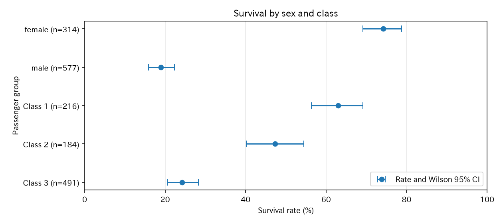

*性別・客室等級の各群について、分母を併記した生存率とWilson 95%区間。率の横軸は0～100%で共通だが、区間は乗客独立の近似に基づく。NotebookのPNG出力をそのまま抽出した。*

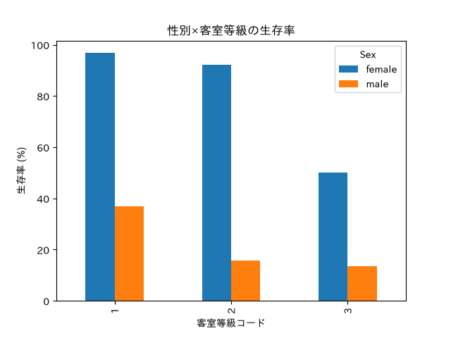

*性別×客室等級の生存率。女性内・男性内にも等級差がある。棒には区間や分母を表示していないため、Notebookの層別表と合わせて読む。*

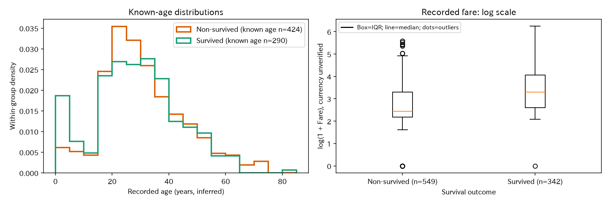

*左は年齢観測者だけの群内密度（生存290人、非生存424人）で、人数の頻度図ではない。右は全891人の `log(1+Fare)` の箱ひげ図。年齢の単位は推定、運賃の通貨・負担単位は未確認である。*

**AIが生成した追加依頼1 — 年齢欠損と層別の頑健性**

> 年齢が約20%欠損しているので、「子どもほど生存しやすい」と「女性の生存率が高い」という結論が年齢欠損や等級構成に依存しないか調べてください。年齢の観測・欠損を分け、性別×等級で比較し、子どもの閾値と欠損の扱いを変えた感度分析を行ってください。極端な欠損割当てはストレステストと明記し、結論をどこまで支持できるか説明してください。

**選定理由**: 年齢中央値が両群28歳でも低年齢の密度・生存率は異なり、177人の欠損が結論を変え得るとAIは判断しました。性別差が等級構成だけで説明されないかの確認も主要結論に直接関係します。

**結果・証拠**: `iteration-1` の欠損構成表と6＋6仕様の感度分析で、年齢観測群の生存率は40.6%、欠損群は29.4%でした。女性－男性の差は全行／年齢観測／年齢欠損と粗率／等級標準化を組み合わせて48.9～56.1ポイントで、設定した相対変動20%基準では `stable=True`、最大相対変動11.7%でした。ただし各部分集団で標準化の目標構成も異なります。

子どもの閾値を12歳未満・16歳未満・18歳未満、欠損を観測値のみ・性別×等級内中央値補完とした6仕様では、子どもとそれ以上の年齢群の差は15.9～22.8ポイントでした。方向は正でも最大相対変動23.1%で `stable=False` です。欠損全員を子どもとする非現実的ストレステストでは差が−1.7ポイントになりました。男性の12歳未満は各等級で比較群より高い一方、女性1等の12歳未満は1人だけで、生存率0%を一般化できません。性別差はこの範囲で維持されたものの、「子どもなら一律に有利」という結論は避けると再評価しました。中央値補完は非ランダムな欠損を解決せず、詳細定義・小標本・共有券依存も残ります。

**AIが生成した追加依頼2 — 運賃・家族・記録項目の交絡**

> 生存者の運賃が高く、2～4人の家族群、C港、客室記録ありの生存率も高いですが、性別・客室等級・年齢の構成の違いで説明される可能性を調べてください。層別表と説明用のロジスティックモデルを使い、年齢欠損処理と高額運賃の扱いを変えてください。共有Ticketで標準誤差を調整し、因果効果と誤解されないように、どの関連が仕様依存かを示してください。

**選定理由**: 反復1は性別差を支持しましたが、運賃・家族・港・客室記録の粗差が独立した関連かは判断できませんでした。AIは予測性能の最適化ではなく交絡感度の記述を目的とし、年齢の中央値補完／完全症例と運賃そのまま／99パーセンタイル上限の4仕様を固定しました。

**結果・証拠**: `iteration-2` の層別表・C/S直接標準化・4仕様の説明GLMとTicketクラスタ95%区間を使用しました。モデルには性別×等級の交互作用、年齢の二次項、家族代理群、港、客室記録、`log(1+Fare)` を含めています。乗船港欠損2人をモデルから除き、中央値補完では889人・680券、完全症例では712人・541券を用いました。収束・有限値・フルランクを検査しています。

性別だけを女性／男性に置き換えたモデル予測値の平均差は45.9～46.6ポイントで、4仕様の最大相対変動1.4%、`stable=True` でした。これは共変量分布上の記述的な予測対比で、性別の因果効果ではありません。`log(1+Fare)` が1増加する際の運賃オッズ比は1.13～1.30でしたが、全仕様の95%区間が1を含みました（中央値補完・上限処理なしでは1.30、区間0.73～2.30）。したがって運賃の粗差から独立した関連や支払いの因果効果を断定できません。

C－S港の粗差21.7ポイントは、共通の性別×等級構成への標準化で10.1ポイントに縮みました。Q港は層内標本が極小のため全体調整の解釈を保留しました。Notebookは2～4人家族群と客室記録ありの粗い優位も、調整モデルでは明確な追加的関連と呼ばないと再評価しています。単一補完、モデル形、港・客室記録の選択性、層内支持不足は解消されず、点推定の安定だけでは区間の妥当性を保証しません。共有券依存と大人数家族の少数券への集中を次の確認点としました。

**AIが生成した追加依頼3 — 共有Ticket依存と少数クラスタの影響**

> 共有Ticketで乗客の生存結果が依存する可能性があるので、性別差と家族人数別の生存率差について、乗客単位とTicket単位のブートストラップ区間を比較してください。少数のTicketが大人数家族の結論を支配していないか、1 Ticketずつ除外したときの変化も調べてください。再標本化の単位、反復数、乱数seedを固定し、点推定の安定と母集団への一般化を分けて説明してください。

**選定理由**: 反復2ではクラスタ標準誤差を使いましたが、初回のWilson区間は乗客独立近似のままでした。AIは、5人以上の家族代理群62人が少数Ticketに集中する可能性を踏まえ、主要性別差と二次的な家族差の不確実性を分けて検証しました。

**結果・証拠**: `iteration-3` で乗客単位と681 Ticket単位の等確率復元抽出を各2,000回実施し、percentile 95%区間を比較しました。乱数seedは `20261002` です。Ticket抽出では同一券の全乗客をまとめて複製するため、総乗客数は反復ごとに変動します。全681券について1券ずつ除外した影響度も調べました。

| 生存率差 | 点推定 | 乗客単位の95%区間 | Ticket単位の95%区間 |
|---|---|---|---|
| 女性－男性 | 55.3ポイント | 49.4～61.0ポイント | 48.5～61.9ポイント |
| 家族代理2～4人－単独 | 27.5ポイント | 20.6～34.1ポイント | 20.3～34.4ポイント |
| 家族代理5人以上－単独 | −14.2ポイント | −23.3～−3.4ポイント | −26.7～＋5.0ポイント |

性別差はTicket依存を考慮しても区間が0を大きく上回り、1券除外でも55.0～56.4ポイント、最大変化1.14ポイントでした。2～4人群の粗差は維持されますが、反復2の結果から独立した家族効果とは呼べません。5人以上群は62人が15券に集中し、1券除外で最大4.06ポイント変化しました。Ticket区間が0を含むため、「標本内では低率」と「一般に不利」を区別する必要があります。

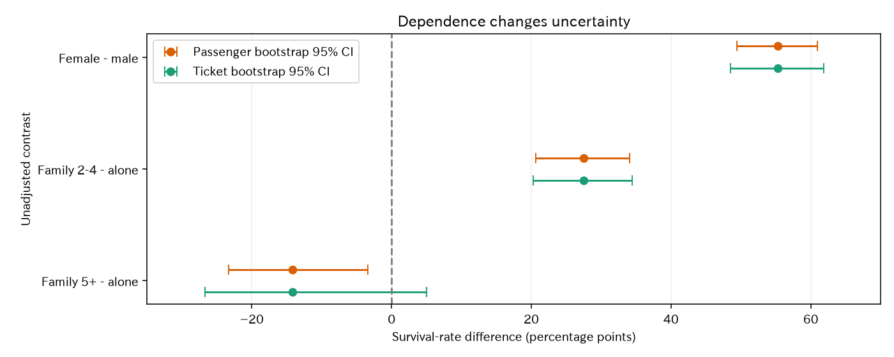

*性別差・家族人数代理群の粗い生存率差について、再標本化単位による95%区間の変化を比較した図。5人以上群ではTicket単位の区間が0線をまたぐ。区間は交絡調整後の効果ではない。*

AIは3回目で反復を停止しました。性別・等級の記述、年齢欠損、二次的属性の交絡、依存による区間の変化を検討済みで、詳細辞書・歴史的記録・代表性・真の同行集団は同じCSVの再分析だけでは解消できないと判断しています。Ticket自体も救命艇や全同行集団の代わりになる保証はなく、有限反復・クラスタ間独立近似が残ります。

**外部の追加確認ログとの区別**: 上記3件はNotebookに原文・選定理由・コード・結果があるAI生成の追加依頼です。別ファイル `followup.log` は、既存セルを保持して未解決点を再評価し、必要な場合だけ追加分析するという開始メッセージが重複して残り、最後に `[runner] stopping process group: Notebook remained stable and passed semantic audit` と記録されています。新しい追加依頼原文・分析結果・CLIの最終回答は確認できないため、第4反復や追加確認セッションの正常完了とは数えません。

**最終結論**: この891人では、生存群に女性が多く、非生存群に男性が多いこと、性別・等級で生存率が大きく異なることが主要な観測結果でした。性別差は年齢欠損処理、等級標準化、説明モデル、Ticket依存検査を変えても同方向に残りました。一方、年齢中央値が同じことを「年齢差なし」と解釈せず、低年齢群の差の大きさは閾値・欠損に依存すると整理しています。高い運賃、家族同伴、港、客室記録の粗差を独立した効果とはみなさず、大人数家族の不確実性も依存単位に左右されることを示しました。予測モデルの精度やKaggle提出スコアを評価した実験ではありません。

**再現性・監査**: Notebookの `replay_verification` と `final-audit` 出力には、出力・実行番号をクリアし、Jupyter MCPでカーネルを再起動して全21コードセルを上から再実行した記録があります。実行番号は `1, 3, 4, …, 22` と昇順・重複なしで、番号2の欠番だけを未実行とは扱っていません。初回数値と再実行数値はコード内の `rtol=1e-8`、`atol=1e-10` の比較を通り、再取得SHA-256も一致しています。本節の作成では分析を再実行せず、その保存済み記録を報告しています。

`audit_notebook(..., visual_audit=True)` は `ok=True`、nbformat有効、21/21コード実行済み、未実行・エラー・監査指摘・図表指摘0件、PNG4点、Insight6件でした。`lifecycle` は `v020-exp-01` を `completed` と記録し、実行中セル・未処理書込み・ロックはいずれも0です。ただし分析前提検査では、詳細列定義の独立照合不足と乗客独立性の仮定について警告2件が残り、Notebook構造監査合格と分析前提の解消は同義ではありません。図表監査も画像圧縮バイト密度などの近似で、意味内容の正しさを保証するものではありません。

外部 `status.json` でも初回・最終の21/21セル実行、エラーなし、図表4セル、Insight6件、成果物の安定、`final_completion.ready=true`、`analysis_complete=true` が記録されています。これらとNotebookの内容から、実験分析は完了と判断します。初回CLIは終了コード0・`exited`（1093.4秒）、追加確認は終了コード欄0でも終了理由が `artifact_complete_cutoff`（92.9秒）でした。初回・最終のNotebookサイズと更新日時は同じで、追加確認による成果物の更新は記録されていません。分析の完了と、追加確認セッションの自然な正常終了は分けて評価します。

Notebookは `benchmark/projects/kaggle-v020-kaggle-exp-01-titanic/notebooks/kaggle-v020-kaggle-exp-01-titanic.ipynb` に保存されています。本節の証拠は同Notebook、`initial-prompt.md`、`initial.log`、`followup.log`、`status.json` の5ファイルに限定し、`white-paper2.md` は書式・詳細度の参照だけに用いました。図はNotebook内PNGのバイト列を抽出したもので、新しく生成した図や別実験の図ではありません。

**失敗・回避策・Jupytermind改善候補**: 最終保存Notebookにエラーセルはありませんが、途中の問題がなかったとはいえません。Notebookの「Jupytermind改善候補」には次の2件が記録されています。

| 分類 | 記録された問題と影響 | 回避策・証拠の範囲 |
|---|---|---|
| Jupytermind–Jupyter MCPの協調保存不足疑い | 実行中に `enqueue_write` でmetadataを保存した際、計算はカーネル内で完了していてもMCP戻り値が `outputs=[]`・`count=0`、読戻し実行番号が `N/A` になったとNotebookが記録。Insight挿入によるセル位置変更時の初回Insight喪失も記録されている | 実際のIPython出力・実行番号を `recorded_cell` で同じセルへ保存し、Insightは末尾追記。最終4図・6 Insightを検査。初回障害の生MCP応答は指定ログにはなく、原因・責任境界は未確定 |
| データ定義manifestの機能不足／ガイダンス差候補 | `unresolved_fields()` の結果はunknown2項目のみで、inferred23項目は別途走査しないと注意点一覧に出ない | `inferred_fields_caveat` を明示走査で併記。取得APIがunknown限定であること自体を実装バグと断定しない。ガイダンスとの契約差という評価はNotebookの記録であり、ガイダンス原本は本節の証拠に含めていない |

候補1についてNotebookが挙げる初回時刻は `2026-10-01T15:35:22.865625～15:35:22.884183+00:00` です。この障害の細部はNotebook内の記述に基づき、`initial.log` には保存連携問題への回避と改善候補を記録したという要約だけがあります。最終成果物では回避後の監査合格を確認できますが、標準の保存連携だけで同じ保証が得られるかは未検証です。

環境固有の問題は分けて扱います。初期Jupyter MCP接続で親ディレクトリが自動作成されなかったこと、filesystem MCPの許可ルートによるAccess denied、Copilot CLIの出力サイズ制限は、Notebookが記録したツール・環境側の制約です。Kaggle SDKに `dataset_view` がなく `dataset_metadata` と `info` ラッパーに対応したことはSDK側の差異で、データ取得失敗ではありません。追加確認の成果物ベース打ち切りは外部ベンチマークランナー側の記録であり、Jupytermindの障害や実験分析の失敗とは判定しません。Notebookの「ベンチマークランナーは起動していない」という記述も、外部 `followup.log` のrunner停止記録を否定する根拠にはしません。2候補の分類・再現手順・期待／実際の挙動・影響・証拠・受け入れ条件は、同じrunディレクトリの `issue-candidate.json` に保存しています。

**残る限界**: 観察データの関連であり、性別、運賃、家族同伴などの因果効果を識別していません。非無作為な訓練標本を全乗船者・乗員へ一般化できず、船内位置・避難行動・救命艇・真の同行集団など未測定要因が残ります。年齢・客室の大きな欠損、極小の層別標本、家族人数代理の測定範囲、運賃の単位と個人／共有券負担の不明確さも重要です。感度分析の20%基準はこの分析の設定で、妥当性の一般的保証ではありません。複数仕様で結果が維持されても欠損機序・モデル正しさ・区間の校正を証明できず、構造監査の完了を科学的妥当性の保証と同一視しないことが、この実験の評価上の要点です。

## 実験02: Iris（標本内の特徴量分析を完了）

**課題**: KaggleのIris公開データについて、4つの計測特徴に表れる種間差と、花弁長・花弁幅の関係を調べました。ただし、実際の初回プロンプトの冒頭は「Irisの公開データ（ 」で途切れており、具体的な問いは明記されていません。ここでの課題説明は、Notebookで実施された分析の要約です。与えられていない課題文を補って原文扱いにはしません。

**初回プロンプト（全文・原文）**: 「Irisの公開データ（ Data Scientist SkillとこのプロジェクトのJupyter MCPを使って実行済みコード・出力・根拠付きの気づきをノートブックに記録してください。 Kaggle参照先: https://www.kaggle.com/datasets/uciml/iris。インストール済みkaggle Python SDKを使い、NotebookのJupyter MCP実行セル内で`KaggleApi().authenticate()`、`dataset_list(search=...)`、`dataset_list_files(...)`、必要に応じて`dataset_download_file(...)`を呼び出し、Kaggle上の対応する公開データを検索・取得してください。外部CSVミラーは使用しないでください。owner/dataset slug、取得ファイル名、取得日、ファイルSHA-256をNotebookに記録してください。APIトークンをセル出力・Notebook・ログへ表示しないでください。分析・API取得コードの実行はJupyter MCPだけを使い、端末コマンド、subprocess、外部スクリプト起動、作業エージェントへの委譲は行わないでください。APIで対応するデータが見つからない場合は外部ソースにフォールバックせず、その実験を停止して理由を報告してください。保存先は benchmark/projects/kaggle-v020-iris-feature-analysis/notebooks/kaggle-v020-iris-feature-analysis.ipynb としてください。run_idは `v020-exp-02` です。長時間処理の開始前にlifecycle.register_runを呼び、実行・書込みフェーズを記録し、終了時にcompletedまたはfailedを記録してください。データ定義manifest、分析前提manifest、意味的な異常検査、妥当な範囲の感度分析を使い、適用できない機能は理由を記録してください。図表はvisual_audit=Trueで監査してください。Notebookには「使用したJupytermindモジュール」節を設け、直接import・呼び出したモジュール名、関数名、使用目的を記録してください。間接利用は使用済みに含めないでください。Jupytermindの不具合または機能不足が疑われた場合は「Jupytermind改善候補」節を設け、分類、再現条件、期待する挙動、実際の挙動、影響、回避策、関係するセルとログを記録してください。Copilot CLI、Kaggle API、ベンチマークランナーに固有の問題とは切り分け、候補がなければ「なし」と記録してください。初回分析後、自分で結果を読み直し、結論に実質的な影響を与える未解決点があれば自然言語の追加依頼文を作成し、Notebookの「反復依頼履歴」に原文のまま記録して実行してください。価値ある追加分析がなくなるまで最大3回繰り返し、各反復の選定理由・結果・証拠・残る限界を報告してください。最後に全コードセルを上から再実行し、notebook_auditとライフサイクル状態を記録してください。」

**使用したJupytermindモジュール**: 以下はNotebookのコードセルと、Notebookに保存された別MCPセルの根拠更新コードに直接利用の記録があるものです。モジュール名の接頭辞はすべて `ai_data_scientist.` です。型名は直接呼び出したコンストラクタとして記載し、間接利用や未実行の失敗分岐は含めません。

| モジュール | 直接呼び出した関数・コンストラクタ | 使用目的 |
|---|---|---|
| `project_manager` | `resolve_project`, `ensure_notebook`, `ensure_data_dir`, `enqueue_write` | 保存先とデータ領域の確保、記録された別MCPセルからの根拠更新書込み |
| `language_router` | `detect_language` | 日本語の検出 |
| `lifecycle` | `register_run`, `is_cancel_requested`, `mark_execution_start`, `mark_execution_end`, `mark_write_start`, `mark_write_end`, `get_run_status`, `mark_completed`, `wait_for_quiescence` | run登録、取消確認、実行・書込みフェーズ、完了と静止の確認 |
| `ingestion` | `SourceSpec`, `ingest` | Kaggleから取得済みのCSV読込み |
| `cleaning` | `clean_dataset` | 欠損行除去と、Idを除いた重複除去の影響確認 |
| `eda` | `explore` | 型、欠損、記述統計、カテゴリ構成の確認 |
| `data_definition` | `FieldValue`, `build_manifest`, `DataDefinitionManifest.unresolved_fields` | データ定義・来歴と、確認済み・推測・不明の区別 |
| `analysis_assumptions` | `Assumption`, `AnalysisAssumptionManifest`, `check_manifest` | 分析前提、関連と因果の範囲、未解決前提の警告 |
| `data_quality` | `detect_anomalies` | 欠損、正値範囲、Id一意性、種カテゴリの制約検査 |
| `stats_analysis` | `correlation` | 全体・種内のPearson相関と日本語解釈 |
| `visualization` | `render_chart`, `build_image_output` | PNG生成、画像MIME出力、棒図レイアウト問題の再現用呼出し |
| `sensitivity` | `SensitivityPlan`, `run_sensitivity` | 重複処理、相関方式、種構成を変えた有限グリッドの感度分析 |
| `insight_engine` | `extract_cited_value`, `record_insight` | 実出力の引用値抽出、根拠付き考察の記録、標準出力互換性の診断と根拠更新 |
| `notebook_audit` | `audit_notebook` | 実行状態、根拠参照、`visual_audit=True`による図表監査 |

**初回指示**: Kaggle SDKによる検索・取得、出典とハッシュの記録、Jupyter MCPに限定した分析実行、定義・前提manifest、意味的異常検査、感度分析、図表監査、最大3回の自律的追加依頼、最後の再実行とライフサイクル記録を求めています。具体的な統計手法や追加依頼の項目は指定されていません。AIはNotebookで、種間分離の記述指標としてη²、花弁長・幅の関連として相関係数を選びました。η²は全変動に対する種間変動の割合であり、分類の正解率や因果的な重要度ではありません。

**データ取得**: NotebookのS1で `KaggleApi` を認証し、`dataset_list(search='iris', page=1)` の結果に `uciml/iris` があることを確認しました。`dataset_list_files` の一覧は `Iris.csv` と `database.sqlite` で、分析には `dataset_download_file` で取得した `Iris.csv` を使用しています。外部CSVミラーへのフォールバックはありません。保存された取得記録は次のとおりです。

| 項目 | Notebookに残る値 |
|---|---|
| owner/dataset slug | `uciml/iris` |
| ファイル | `Iris.csv` |
| 取得日時 | `2026-10-01T16:05:34.956871+00:00`（UTC。日本時間では2026-10-02） |
| ファイルサイズ | 5,107 bytes |
| SHA-256 | `600ac44f23c2e6e0ae37daac8ceb2baba4df963efa580eb31b3b576b28e34c55` |
| データ構成 | 150行・6列、3種各50行 |

S2では全列の欠損数が0、Idを含む完全一致行が0、Idを除く4特徴と種ラベルの重複が3件でした。欠損行除去による削除は0件で、主分析では重複を保持しました。宣言した意味的制約の違反も0件ですが、特徴量の0.01〜20という範囲は広い正値スクリーニングであり、生物学的正常範囲の保証ではありません。データ定義manifestは取得元・行数などを `verified`、列名に由来する意味・cm単位などを `inferred`、抽出枠・測定手順を `unknown` として区別しています。認証情報を出力しないコードになっており、指定されたNotebookとログにAPIトークンの表示は見当たりません。

**初回結果**: S3の全体Pearson相関は花弁長・花弁幅で `r=0.962757`、p値は `5.777×10⁻⁸⁶` でした。ただし、観測の独立性は未検証であり、p値は探索的な補助値として扱っています。3種全体のη²は花弁長0.941319、花弁幅0.928836、がく片長0.618706、がく片幅0.391881で、花弁特徴の種間分離が大きい結果でした。setosaの花弁長の実測範囲は1.0〜1.9、他2種の最小値は3.0で、この標本内では単一閾値でsetosaを分けられます。未知個体への分類性能は測定していません。

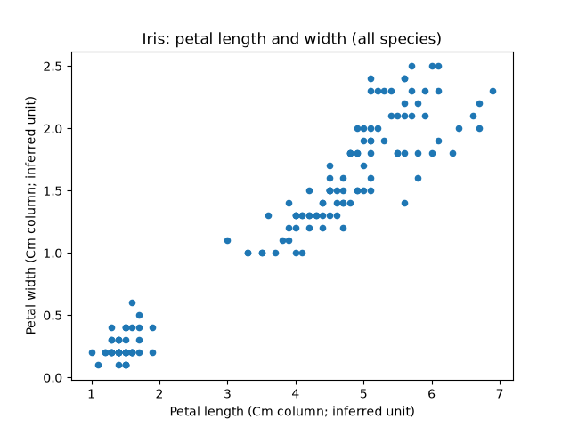

*全3種をまとめた花弁長・花弁幅の散布図。種による色分けはなく、この図だけでは種内相関と種間差を切り分けられません。単位は列名からの推測として軸に明記されています。NotebookのS4に保存されたPNGを抽出しました。*

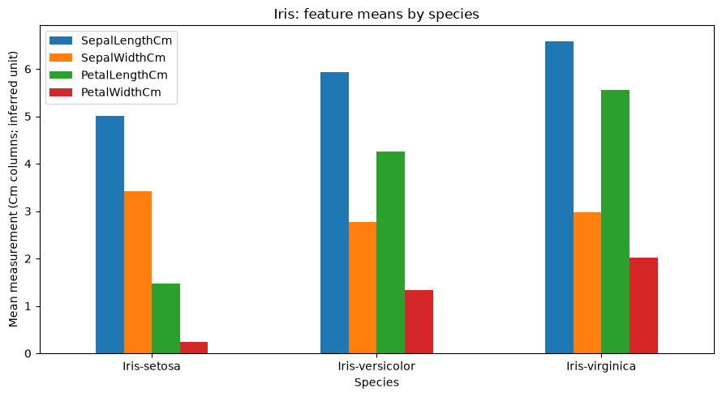

*種別のがく片長・幅、花弁長・幅の平均。花弁特徴の種間差を示しますが、個体分布や不確実性区間は表示していません。棒図のラベル切れを回避した最終版で、NotebookのS4に保存されたPNGを抽出しました。*

**AIが生成した追加依頼1 — 全体相関と種内相関の切分け**

> 花弁長と花弁幅の強い全体相関は種間差による見かけの関連ではありませんか。種別Pearson・Spearman相関と種平均を差し引いた相関を計算し、全体の結果と比較してください。種内でも同じ強さと解釈できるか、根拠と限界を記録してください。

全体の `r=0.962757` を各種内の関係へ一般化すると、種間差の影響を取り違える可能性があるとAIが判断しました。S5で計算した種内相関は次のとおりです。

| 種 | n | Pearson r | Spearman ρ |
|---|---|---|---|
| setosa | 50 | 0.306308 | 0.227275 |
| versicolor | 50 | 0.786668 | 0.787010 |
| virginica | 50 | 0.322108 | 0.362913 |

種平均を差し引いた相関は `r=0.482332` まで低下しました。全体相関と種内相関の強さは一致せず、「各種内でも一様に非常に強い関連がある」という一般化は採用しません。証拠はS5の出力とexecution count 25を引用する考察です。種平均中心化は種内の共変動をまとめた記述的調整であり、因果識別ではありません。種別の測定範囲と観測独立性は未検証のまま残りました。

**AIが生成した追加依頼2 — 重複・相関方式への感度と上位特徴の順位不確実性**

> 種によって相関が異なることは確認できました。Idを除く同一計測が3件あるため、重複を保持する場合と除外する場合、PearsonとSpearmanで全体・種平均中心化相関の結論が変わるか感度分析してください。また、花弁長と花弁幅のη²順位差を種別層化ブートストラップで確認し、最良特徴量を断言できるか調べてください。

AIは、重複3件の扱いと、初回の花弁長・幅のη²が僅差であることを未解決点として選びました。S6では重複除去後に147行となり、保持／除去とPearson／Spearmanを組み合わせた4仕様を比較しました。

| 重複の扱い・相関方式 | 全体相関 | 種平均中心化後の相関 |
|---|---|---|
| 保持・Pearson | 0.962757 | 0.482332 |
| 保持・Spearman | 0.936003 | 0.500729 |
| 除去・Pearson | 0.961883 | 0.482879 |
| 除去・Spearman | 0.937984 | 0.503775 |

全体相関の最大相対差は0.027789、中心化相関は0.044457で、設定した許容閾値0.10に対してどちらも `stable=True` でした。花弁長η²も保持時0.941319、除去時0.940219、最大相対差0.001169で、閾値0.05に対して安定でした。これは選んだ仕様間の安定性であり、種混合による解釈上の問題を解消する判定ではありません。

さらに、主分析の重複を保持したデータで各種50行を復元抽出し、seed `20261002`、2,000回の種別層化ブートストラップを実施しました。花弁長η²−花弁幅η²の95%百分位区間は `−0.006981〜0.032781` で0を含みます。首位頻度は花弁長88.1%、花弁幅11.9%でした。AIは花弁特徴の有力さを維持しつつ、花弁長が必ず最良とは断言しませんでした。証拠はS6の全仕様・再標本化出力とexecution count 26を引用する2つの考察です。重複が同一個体の二重登録か、別個体の同一測定かは判定できず、再標本化区間も本標本内の条件付き不確実性に限られます。

**AIが生成した追加依頼3 — 比較対象の種による順位の変化**

> 反復2では花弁長と幅のη²差の区間が0をまたぎ、花弁長が常に最良とは断言できません。setosaと他種は分離しやすいので、3種全体と各2種の部分集合でη²順位を比較してください。特にversicolorとvirginicaで有効な特徴量と測定値の重なりを確認し、結論の適用範囲を限定してください。

AIは、setosaの分離しやすさに引きずられた「最良特徴量」の一般化を避けるため、種の組合せを変える比較を選びました。S7の結果では、花弁特徴が上位である点は共通でも、首位は比較対象に依存しました。

| 比較対象 | n | 花弁長η² | 花弁幅η² | 首位 |
|---|---|---|---|---|
| 3種全体 | 150 | 0.941319 | 0.928836 | 花弁長 |
| setosa／versicolor | 100 | 0.940813 | 0.921903 | 花弁長 |
| setosa／virginica | 100 | 0.962229 | 0.949079 | 花弁長 |
| versicolor／virginica | 100 | 0.618462 | 0.685798 | 花弁幅 |

花弁長η²の種構成感度は最大相対差0.342983で、閾値0.10に対して `stable=False` でした。これは異なる比較対象への変更であり、データ誤りや実験失敗ではありません。versicolorとvirginicaの花弁長の範囲はそれぞれ3.0〜5.1と4.5〜6.9で、重なりは4.5〜5.1、花弁幅は1.0〜1.8と1.4〜2.5で、重なりは1.4〜1.8でした。どちらの特徴も、単一閾値では両種の標本を完全分離できません。証拠はS7の部分集合別η²・実測範囲とexecution count 27を引用する考察です。分類器の汎化性能は検証していません。

**最終結論・反復終了の判断**: この標本では、種間差はがく片より花弁特徴に強く表れます。ただし、全体の花弁長・幅の強い相関は種内で同じ強さではなく、特徴量の首位も比較対象の種によって変わります。3種全体の花弁長首位を普遍的な重要度とみなさず、versicolor／virginicaでは花弁幅が首位になることを併記する結論です。3回の追加依頼で、種混合、前処理・方式への感度、順位不確実性、種構成依存を確認しました。Notebookは反復上限に達したことと、抽出枠・測定法・重複個体同定・独立標本検証には追加資料が必要なことを停止理由として記録しています。

分析完了の根拠は、`status.json` の `analysis_complete=true`、`final_completion.ready=true` と、その要件群がすべてtrueであること、およびNotebookに取得・初回分析・3反復・根拠付き考察・最終監査が残っていることです。これは標本内の分析の完了であり、未解決の分析前提の解消を意味しません。

**監査・再現性**: S9の保存済み監査結果は `ok=true`、`nbformat_valid=true`、コードセル10、実行済み10、未実行・エラーセルなし、図表セルはインデックス12、根拠付き考察7、`findings` と `visual_findings` は空です。図表セル1つにPNGが2点あり、上記の2画像はその保存出力をそのまま抽出したものです。`visual_audit=True` の合格は、画像中のラベル切れや統計的妥当性をすべて保証するものではありません。

ライフサイクルは `v020-exp-02` が `completed`、`active_cell_executions=0`、`pending_notebook_writes=0`、`locks_held=0` でした。Notebookと初回ログは全コードセルの上からの再実行を報告しています。ただし、保存された `phase_log` には反復2の実行時刻が反復3より後の記録もあり、修正・部分再実行を含みます。この証拠だけから、単一のクリーンカーネルで全セルが一度だけ順番どおり実行されたことまでは確認できません。

再実行後の7考察の根拠更新は、対象Notebookを非アクティブにした別Jupyter MCPセルから実施したコードがNotebookに保存されています。引用値が現行MIME出力に存在しなければ停止する処理で、S9には `controller-evidence-write` の開始・終了ログがあります。S9自体は自己書込みを避けた読取り専用監査です。将来の再実行にも、この別セルでの根拠更新が必要と明記されており、単に対象Notebookのコードセルだけを再実行して引渡しが完結する構成ではありません。

初回ログには分析完了の応答があり、`status.json` は初回プロセスの `initial_exit_code=0`、終了理由 `exited` を記録しています。一方、追加確認ログには新しい自然言語の追加分析依頼はなく、既存3反復の確認、未検証範囲の明記、自己書込み問題の責任分界の整理が記録されています。その末尾はランナーによる停止通知で、`followup_termination=artifact_complete_cutoff` です。`followup_exit_code=0` の記録だけを、追加確認セッションが自然終了した証拠とは扱いません。最終分析状態は、安定した保存成果物、最終監査、ライフサイクルから判断します。

Notebookの保存先は `benchmark/projects/kaggle-v020-iris-feature-analysis/notebooks/kaggle-v020-iris-feature-analysis.ipynb` です。本節の分析証拠は、このNotebook、`benchmark/runs/02-iris-feature-analysis/initial-prompt.md`、`initial.log`、`followup.log`、`status.json` の5ファイルに限定しました。既存白書は書式の参照にのみ使用し、その別実験の数値・手法は転用していません。

**失敗内容・Jupytermind改善候補の切分け**: 最終Notebookに未実行・エラーセルはありませんが、途中の問題を「失敗なし」とは要約しません。Jupytermind側の候補は次の2件です。

| 分類 | 実際の挙動・証拠 | 影響と回避策 |
|---|---|---|
| 根拠記録の入出力互換性に関する機能不足 | S8の `stream_probe` は、S1の実行済み標準出力にSHA-256があることを `hash_found_in_stream=true` で確認しても、`insight_engine.record_insight` が `EvidenceMissingError` を返したと記録 | `print` 主体のNotebookでは実在する出力を根拠に使えない。分析の根拠値を `display(text/plain)` のMIME出力にして回避 |
| 図表レイアウトの不具合疑い | 初回ログは種別棒図のラベル切れを報告し、Notebookの改善候補節とS8の `layout_probe` は、既定の `visualization.render_chart(kind='bar', x='Species')` で縦向き種ラベル下部が切れたと記録。再生成PNGは28,760 bytes | 種名の判読を妨げる。最終S4は棒図のみmatplotlibで `rot=0`、`tight_layout`、`bbox_inches='tight'` を明示して回避。元の切れたPNG自体は最終Notebookに保存されていないため、画像による独立再確認はできない |

この2件はKaggle APIの取得失敗やCopilot CLIの表示不良ではなく、Notebook内のPython API呼出しに対する候補として記録します。ただし、記載された実装原因の説明を本節でソースコードまで検証したわけではありません。候補の再現手順、期待・実際の挙動、影響、証拠、受け入れ条件は同実験ディレクトリの `issue-candidate.json` に保存しました。Issue登録や修正は行っていません。

Notebookはさらに、S9実行中に同じNotebookへ `project_manager.enqueue_write` すると、実行が完了しても保存済みS9が `execution_count=None`、`outputs=0` になった問題を記録しています。別MCPセルから書き込み、S9を読取り専用にすることで回避したとされています。しかし、追加確認ログはJupytermindとJupyter MCPの責任分界が未確定として、これをJupytermind固有の改善候補から除外しています。本節もその区別を維持し、JSONの候補には含めません。

初期の保存先親ディレクトリ未作成エラーはJupyter MCP側の作成前提として、準備セルの括弧誤記は分析コード外の作成時ミスとしてNotebookに記録され、いずれも解消済みと説明されています。これらのエラーの生ログは指定された短い初回・追加確認ログには残っておらず、詳細はNotebookの記述に基づきます。外部ランナーの成果物安定後の停止もJupytermind不具合には分類しません。Kaggle取得についてはS1に成功した取得記録があり、指定証拠にAPI取得失敗はありません。

**残る限界**: 150行の固定標本で、母集団代表性、観測独立性、採集地域・時期、測定手順は未確認です。列の意味とcm単位も一次データ辞書による検証ではなく列名からの推測です。S2とS9は重複・標本抽出に関する結論上重要な未解決前提の警告2件を残しており、監査合格をもって検証済みにはしていません。異常検査は宣言した制約の範囲に限られ、異常値に対する追加の頑健性検証は確認できません。重複処理・相関方式・種構成の感度分析も、網羅的な仕様探索ではありません。

独立参照データがないため、別データとの照合や異常の参照検証は適用していません。同一配布物の `database.sqlite` は独立標本として扱っていません。分類器、交差検証、AUC、未知個体での閾値評価、因果解析は実施しておらず、その性能や効果を補って結論にはしません。棒図は平均だけ、散布図は種別色分けなしという可視化上の限界も残ります。本実験で確認できたのは、AIが初回の強い全体相関と花弁長首位をそのまま一般化せず、追加分析で主張の適用範囲を狭めたことです。

## 実験03: Palmer Penguins（分析完了）

**課題**: 「KaggleのPalmer Penguinsデータから、ペンギンの種や体格の違いがどの特徴に表れているか調べてください。」

**初回プロンプト（全文・原文）**:

> KaggleのPalmer Penguinsデータから、ペンギンの種や体格の違いがどの特徴に表れているか調べてください。手順は指定しません。自分で分析計画を立て、適切な図表を選んで、分析結果・不確実性・限界を日本語で説明してください。AI Data Scientist SkillとJupyter MCPを使い、計画、実行コード、結果、根拠付きInsightをノートブックに記録し、上からの再実行も確認してください。 Kaggle参照先: https://www.kaggle.com/datasets/parulpandey/palmer-archipelago-antarctica-penguin-data。インストール済みkaggle Python SDKを使い、NotebookのJupyter MCP実行セル内で`KaggleApi().authenticate()`、`dataset_list(search=...)`、`dataset_list_files(...)`、必要に応じて`dataset_download_file(...)`を呼び出し、Kaggle上の対応する公開データを検索・取得してください。owner/dataset slug、取得ファイル名、取得日、ファイルSHA-256をNotebookに記録してください。APIトークンをセル出力・Notebook・ログへ表示しないでください。分析・API取得コードの実行はJupyter MCPだけを使い、端末コマンド、subprocess、外部スクリプト起動、作業エージェントへの委譲は行わないでください。Kaggle APIで対応データを検索・取得できなかった場合に限り、`/home/nahisaho/kaggle/experiments/white-paper.md`に記載された旧実験の公開CSV `https://raw.githubusercontent.com/allisonhorst/palmerpenguins/master/inst/extdata/penguins.csv` を取得して実験を継続してください。その場合はKaggle APIの失敗内容、フォールバックした理由、CSV URL、取得日時、SHA-256をNotebookに記録し、公開CSVとKaggle掲載版の完全な同一性は保証されないことを明記してください。保存先は benchmark/projects/kaggle-v020-kaggle-exp-03-penguins/notebooks/kaggle-v020-kaggle-exp-03-penguins.ipynb としてください。run_idは `v020-exp-03` です。長時間処理の開始前にlifecycle.register_runを呼び、実行・書込みフェーズを記録し、終了時にcompletedまたはfailedを記録してください。データ定義manifest、分析前提manifest、意味的な異常検査、妥当な範囲の感度分析を使い、適用できない機能は理由を記録してください。図表はvisual_audit=Trueで監査してください。Notebookには「使用したJupytermindモジュール」節を設け、直接import・呼び出したモジュール名、関数名、使用目的を記録してください。間接利用は使用済みに含めないでください。Jupytermindの不具合または機能不足が疑われた場合は「Jupytermind改善候補」節を設け、分類、再現条件、期待する挙動、実際の挙動、影響、回避策、関係するセルとログを記録してください。Copilot CLI、Kaggle API、ベンチマークランナーに固有の問題とは切り分け、候補がなければ「なし」と記録してください。初回分析後、自分で結果を読み直し、結論に実質的な影響を与える未解決点があれば自然言語の追加依頼文を作成し、Notebookの「反復依頼履歴」に原文のまま記録して実行してください。価値ある追加分析がなくなるまで最大3回繰り返し、各反復の選定理由・結果・証拠・残る限界を報告してください。最後に全コードセルを上から再実行し、notebook_auditとライフサイクル状態を記録してください。

**使用したJupytermindモジュール**: Notebookのimport、コードセルの呼び出し、保存された記録を根拠に整理しました。名前はすべて `ai_data_scientist` 配下です。内部の間接利用は数えません。

| モジュール | 直接呼び出した関数・型・メソッド | 使用目的 |
|---|---|---|
| `project_manager` | `resolve_project`、`ensure_notebook`、`ensure_data_dir` | 指定プロジェクト、Notebook、取得データの保存先を解決・作成 |
| `language_router` | `detect_language` | 日本語の分析指示から出力言語を判定 |
| `lifecycle` | `register_run`、`is_cancel_requested`、`mark_execution_start`、`mark_execution_end`、`mark_completed`、`mark_failed`、`get_run_status`、`wait_for_quiescence` | 実行登録、取消確認、フェーズ・終了状態の管理 |
| `ingestion` | `SourceSpec`、`ingest` | 取得した2種類のCSVを読み込み |
| `cleaning` | `clean_dataset` | 形態分析・性別分析ごとの欠損除外と行数影響を記録 |
| `eda` | `explore` | 型、欠損、要約統計、カテゴリ構成を確認 |
| `stats_analysis` | `correlation` | 全体・種内・種×性別内のPearson相関と日本語解釈 |
| `visualization` | `render_chart`、`build_image_output` | 種別平均体重の描画、PNGのNotebook出力化、監査用最小入力の作成 |
| `data_definition` | `FieldValue`、`build_manifest`、`DataDefinitionManifest.unresolved_fields` | 単位・定義・採集範囲の確認状態と未確認事項を記録 |
| `analysis_assumptions` | `Assumption`、`AnalysisAssumptionManifest`、`check_manifest` | 独立性、欠損、雌雄構成、適用範囲の前提と残るwarningを確認 |
| `data_quality` | `detect_anomalies` | 未知性別コード、必須値、カテゴリ、暫定的な形態範囲を検査 |
| `sensitivity` | `SensitivityPlan`、`run_sensitivity` | 24仕様それぞれで主要4差の安定性を確認 |
| `insight_engine` | `extract_cited_value` | セルの実出力から引用値を抽出し、再実行後のEvidence manifestを更新 |
| `notebook_audit` | `audit_notebook`、`audit_visual_outputs` | 保存Notebookの実行状態・根拠・図表を監査し、図表監査の最小再現を実施 |

Notebookには、セル間の外側のJupyter MCP制御セルで `project_manager.enqueue_write`、`lifecycle.mark_write_start`、`lifecycle.mark_write_end` を呼ぶ保存手順も記録されています。`insight_engine.record_insight` の利用はモジュール使用節と `metadata.insight_authoring.functions` に記録されていますが、対象Notebookの保存コードセルには呼び出し式がありません。したがって、これらは「Notebook内の直接呼び出し式を確認できた関数」と「外側での呼び出しとして記録された関数」を区別します。複合図はmatplotlib、平均差の区間・トリム平均はSciPy、調整モデルと頑健共分散はstatsmodelsで実装され、Jupytermindだけが全統計処理を提供したわけではありません。

**初回指示**: 手法を指定せず、AI自身が分析計画と図表を選び、種差・体格差の根拠と限界を日本語で説明するよう求めました。Kaggle APIを優先し、取得失敗時だけ指定公開CSVへのフォールバックを許可しました。また、データ定義・分析前提manifest、意味的品質検査、感度分析、図表監査、ライフサイクル管理、最大3回の自律的追加依頼と最終再実行を要求しました。Notebookでは、種別分布・平均差・効果量、全体相関と種内相関の比較を初回計画に採用しています。

**データ取得・前処理**: Kaggle SDKで認証・検索・ファイル一覧取得に成功し、指定slug `parulpandey/palmer-archipelago-antarctica-penguin-data` の `penguins_size.csv` と `penguins_lter.csv` を取得しました。Notebookの来歴は取得日時を `2026-10-01T18:10:17.764427+00:00`（日本時間2026年10月2日03:10:17）と記録しています。初回ログもKaggle取得成功・フォールバック未使用と報告しています。

| ファイル | SHA-256 |
|---|---|
| `penguins_size.csv` | `aa728597b2228a2637e39c6f08e40a80971f4cdac7faf7bc21ff4481ee3e3ae9` |
| `penguins_lter.csv` | `5e625602cdd94c54167b0684c864a11ff9d1f2fb344fb5d252d33dea701a535f` |

簡略表は344行・7列で、完全一致重複は0行。元の種構成はAdelie 152行、Chinstrap 68行、Gentoo 124行でした。形態4列は同じ2行で欠損し、形態分析は342行、性別も必要な分析は333行です。性別は元の欠損10件に加え、未知コード `.` 1件を明示的に欠損へ変換して11件となりました。変換前のカテゴリ異常は1件、正規化後の指定ルールに対する意味的異常は0件でした。ただし、広い暫定範囲に収まることは測定値の正しさを保証しません。

`culmen_length_mm`・`culmen_depth_mm` は単位を変えず `bill_length_mm`・`bill_depth_mm` へ改名しました。LTER表と簡略表の行数、各形態値、種、島の一致をassertionで確認してから、`Date Egg` の日付年と個体IDを追加しています。2表は独立データではなく、同じ採集記録の別表示です。年は2007〜2009年、地域はAnversの3島、stageは `Adult, 1 Egg Stage` とmanifestに記録されました。日付年は測定年そのものとは限りません。GentooはBiscoeのみ、ChinstrapはDreamのみ、Adelieは3島に分布し、種と島が完全には分離できない構造です。

**初回結果**: AIは形態4特徴の種別集計、分布図、形状・体格の散布図、種間平均差と探索的95% Welch区間、Hedges' g、種別平均が説明する分散割合η²、全体・種内相関を計算しました。形態が揃った342行の種別平均は次のとおりです。

| 種 | 形態分析の行数 | 平均体重（g） | 平均フリッパー長（mm） | 平均くちばし長（mm） | 平均くちばし深さ（mm） |
|---|---:|---:|---:|---:|---:|
| Adelie | 151 | 3,700.662 | 189.954 | 38.791 | 18.346 |
| Chinstrap | 68 | 3,733.088 | 195.824 | 48.834 | 18.421 |
| Gentoo | 123 | 5,076.016 | 217.187 | 47.505 | 14.982 |

Gentooは体重とフリッパー長が最大で、くちばしは最も浅くなりました。Gentoo−Adelieの体重差は1,375.354 g（95%区間1,259.525〜1,491.183 g）、フリッパー長差は27.233 mmでした。一方、Chinstrap−Adelieの体重差は32.426 g（−85.533〜150.385 g）にとどまり、くちばし長差は10.042 mm（9.132〜10.953 mm）、Hedges' gは3.4641と対照的でした。体重差が明確でないことは同等性の証明ではありません。

種別η²はフリッパー長0.778229、くちばし長0.707809、深さ0.679759、体重0.669672でした。これは標本内の単変量分散比であり、未知個体の分類精度ではありません。平均だけでなく分布の重なりを示した点が、種差を一律の境界として読まないために有用でした。

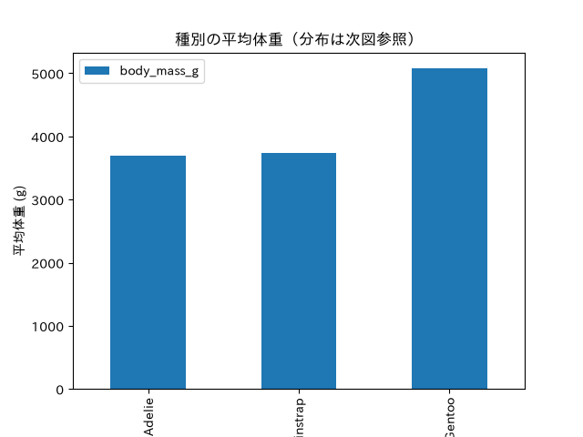

*形態が揃った採集記録の種別平均体重。Gentooの平均は大きいが、棒グラフだけでは種内変動や推定の不確実性は分からない。Notebookの保存PNGを抽出。*

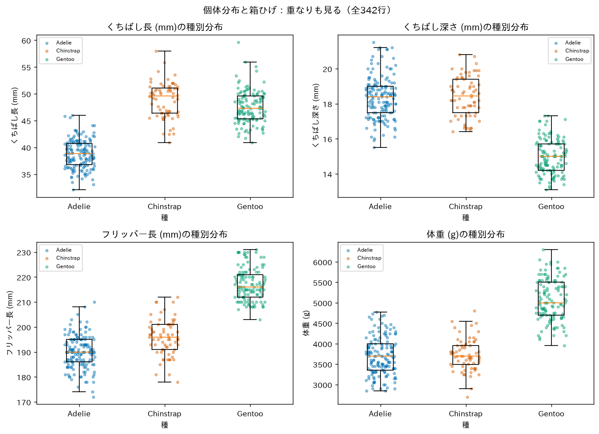

*くちばし長・深さ、フリッパー長、体重の箱ひげと観測点。AdelieとChinstrapの体重分布は大きく重なり、くちばし長では違いが表れる。*

全体のフリッパー長×体重はPearson r=0.871202でしたが、種内では0.468202〜0.702667に弱まりました。さらに、くちばし深さ×体重は全体ではr=−0.471916、種内ではAdelie 0.576138、Chinstrap 0.604498、Gentoo 0.719085と、すべて正になりました。大きく浅いくちばしのGentooを他種と混ぜることで、全体と種内の関連が逆転するSimpson型の現象です。AIはこの符号反転と雌雄構成の影響を初回の未解決点として選びました。

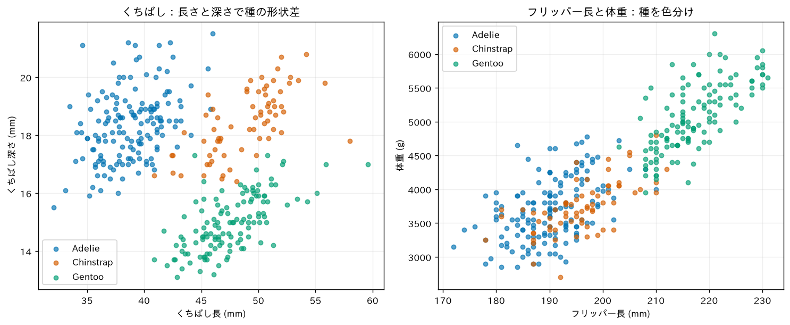

*左はくちばし長と深さ、右はフリッパー長と体重を種で色分けした散布図。体格の大きさと形状の違いを分けて読み、全体相関を種内の関係と混同しないための比較。*

**AIが生成した追加依頼1 — 雌雄構成と体格を揃えた形状差**

> 種や雌雄の混合で相関や平均差が見かけ上生じていないか確認してください。種別の雌雄差と95%区間を示し、雌雄を等重みにした種平均、種×性別内の相関、種と性別を調整した相関を比較してください。さらに体重が重なる範囲だけでもGentooの浅いくちばしとAdelieの短いくちばしが残るか調べてください。

**選定理由**: 深さ×体重の全体相関と種内相関が逆符号になり、種内の体格分布にも雌雄が混在するため、単純な全体比較だけでは形態の関連を誤読する可能性があると判断しました。初回ログにも、この混合を切り分ける追加分析に進む旨が記録されています。

**結果・証拠**: 雄−雌の平均体重差はAdelie約675 g（95%区間573〜776 g）、Chinstrap約412 g（254〜570 g）、Gentoo約805 g（697〜913 g）でした。雌雄を等重みにしてもGentoo−Adelieは1,376.124339 gで、主要な種差は雌雄構成だけでは消えません。種・性別調整後の残差相関はフリッパー長×体重0.374451、くちばし深さ×体重0.285439、長さ×体重0.259107となり、全体の体格相関の強さには混合の影響が含まれました。

共通体重範囲3,950〜4,775 gの100行に限定し、性別と体重を調整しても、Gentooの深さはAdelieより約4.37 mm浅く、Chinstrapの長さは約10.47 mm長い結果でした。根拠は反復1の集計・残差相関・共通範囲モデル表（セルID `47a0190a`、最終execution_count=7）です。重なり範囲の雌雄構成には偏りがあり、共通傾きと観測独立性に条件付けたモデルなので、体格を一定にした因果効果とは解釈しません。

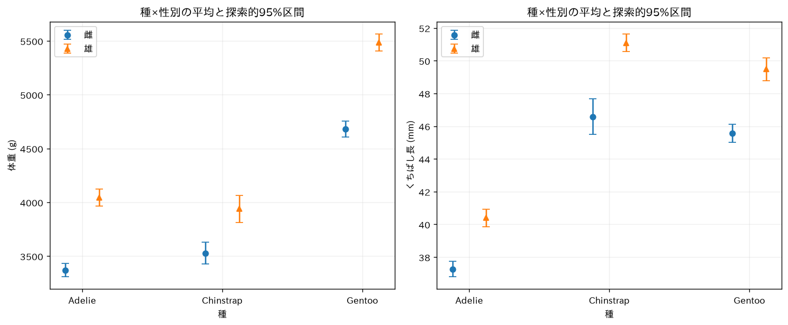

*性別既知の採集記録における種×性別の平均体重とくちばし長、探索的95%区間。3種とも雄の平均体重が大きい一方、雌雄別に見ても主要な種差が残る。区間は観測独立性に条件付けた推定。*

**AIが生成した追加依頼2 — 島・年・欠損と中心統計量への感度**

> Gentooの大きな体格とくちばしの種差が、島・採集年・欠損処理・少数の極端値に依存していないか確認してください。同じ島にいる種同士を性別と年を調整して比較し、平均・中央値・10%トリム平均、性別欠損を含めるか否か、年の除外を組み合わせた感度分析を実施してください。欠測値と未知性別の割当てを変えた場合の結論の変動も示してください。

**選定理由**: 雌雄を揃えても差が残った一方、GentooとChinstrapは別の島にしか存在せず、種・島の交絡が未解決でした。年、欠損除外、少数の極端値への依存も、主要差の安定性を左右し得ると判断しました。

**結果・証拠**: 平均・中央値・10%トリム平均の3種類、形態完全ケース・性別既知ケースの2種類、年の除外なし・2007年除外・2008年除外・2009年除外の4種類を組み合わせ、各主要差を24仕様で比較しました。

| 比較対象 | 24仕様での差の範囲 | 基準値からの最大相対偏差 |
|---|---:|---:|
| Gentoo−Adelieの体重 | 1,300〜1,464.135 g | 0.064551 |
| Gentoo−Adelieのフリッパー長 | 25.000〜27.687 mm | 0.082008 |
| Gentoo−Adelieのくちばし深さ | −3.800〜−3.034 mm | 0.129526 |
| Chinstrap−Adelieのくちばし長 | 9.921〜10.950 mm | 0.090373 |

4対象すべてで符号が維持され、`stable=True` でした。ただし安定性は基準値からの変動が指定した20%以内という判定であり、有意性や分析全体の正しさを保証する指標ではありません。

Biscoe内の163行で性別・年を調整したGentoo−Adelie体重差は1,373.445633 g（HC3による95%区間1,258.326657〜1,488.564609 g）。Dream内の123行のChinstrap−Adelie体重差は38.921999 g（−73.677688〜151.521687 g）でした。形態欠測2行の体重を広い暫定範囲1,500〜8,000 gの上下限に置くシナリオでも、Gentoo−Adelieは1,318.230〜1,413.413 gでした。未知性別をすべて雌・すべて雄に割り当てた雌雄等重み差は、それぞれ1,367.663 g・1,364.652 gです。これらは感度シナリオであり、元データを無根拠に補完したものではありません。

根拠は反復2の同島比較・24仕様・欠測上下限・性別割当表（セルID `e67ffd97`、execution_count=8）です。全種×全島の組合せはなく、Gentoo対Chinstrapの同島比較や島を完全調整した全種効果は識別できません。検討した仕様への頑健性は確認できても、標本選択バイアス全体を排除したわけではありません。

**AIが生成した追加依頼3 — 個体IDと観測依存性による区間感度**

> 平均差の方向は安定していますが、95%区間が各行の独立性に依存していないか確認してください。個体IDが種・島・年をまたいで再利用される状況を調べ、ID由来の保守的なグループ分けでクラスタ頑健区間を計算してください。グループ分けの意味が未確認であることを明記し、真の反復個体や巣を断定せず、どの結論が残るか確認してください。

**選定理由**: 原表344行に対しIDは190種類しかなく、点推定が安定しても独立性は前提manifestで `assumed` のままでした。95%区間への過度な確信を避ける最後の追加検証として選定しています。

**結果・証拠**: 性別既知333行では、種＋島＋IDのキーは295群で38群が複数行、年を加えると333群でした。IDの経年再利用なのか、同一個体の反復記録なのかは確定していません。ID末尾A1/A2をまとめ、年をまたいでクラスタ化する感度シナリオでも、BiscoeのGentoo−Adelie体重差1,373.445633 gの95%区間は1,252.357906〜1,494.533361 g、深さ差−3.379225 mmの区間は−3.613276〜−3.145174 mmでした。DreamのChinstrap−Adelie長さ差10.336622 mmは9.665958〜11.007287 mmでした。

一方、Dreamの体重差38.921999 gの区間は−64.565380〜142.409378 gで、優劣や同等性は断定できません。根拠は反復3のID診断・共分散別区間表（セルID `40ee8f3b`、execution_count=9）。ID由来のグループは検証済みの巣・反復個体キーではなく、検討した依存シナリオで主要差が残ることと、真の独立性が証明されたことは別です。

**最終結論・反復終了判断**: この採集表では、種差は体格とくちばし形状の両方に表れました。Gentooは重くフリッパーが長く、くちばしは浅い。AdelieとChinstrapは体重が近い一方、くちばし長は大きく異なります。雄の体重は3種とも雌より大きく、雌雄構成を揃えても主要な種差が残りました。全体相関には種・性別の混合が含まれるため、全体の強い相関や負相関を、そのまま種内の法則として解釈してはいけません。

3回の追加検証で、主要差は検討した島内比較、年除外、中心統計量、欠損処理、ID由来クラスタの範囲では維持されました。残る測定手順、真の反復個体・巣のキー、標本抽出情報、欠けた種×島の組合せは、同じ表のモデルを増やしても確認できないため、上限3回で終了しています。`followup.log` でも、既存の3回を理由に新たな反復は追加せず、共通傾き・独立性・測定手順と監査の保証範囲を明確にすると記録されています。この外部の追加確認セッションは、Notebook内の第4の追加分析ではありません。

**監査・再現性**: Notebookの `metadata.final_verification` は、カーネル再起動後に12コードセルを元の順序で再実行し、取得ファイルのSHA-256を照合したと記録しています。seedは `20261002`。保存完了後の確定監査日時は `2026-10-01T18:22:54.562103+00:00` です。`notebook_audit(visual_audit=True)` は `ok=True`、nbformat正常、12/12セル実行済み、未実行・エラー0、`findings=[]`、`visual_findings=[]`、根拠付きInsight 5件でした。PNGは2コードセルに計4出力あり、本節の4画像はその保存出力を抽出したものです。図表メタデータの存在を別途assertionで確認し、記録されたmissing glyphは空でした。

ライフサイクル `v020-exp-03` の確定状態は `completed`、実行中セル・未完了書込み・lockはいずれも0です。初回時点の前提warningは独立性・欠損・雌雄構成の3件でしたが、反復後の最終前提では欠損・雌雄構成・仕様安定性を `tested` とし、独立性に関するwarning 1件が残りました。これは構造監査の失敗とは別であり、監査合格は統計的独立性や科学的妥当性の保証ではありません。

監査セル自身の保存出力では11/12実行済み、実行中の末尾監査セルを未実行指摘から除外するwarningが出ています。それを最終結果とせず、外側の制御セルで保存後に再監査した12/12・指摘なしの確定metadataを採用しました。根拠引用の更新もセルIDと出力パターンに基づき、実行回数の変更に追従しています。ただしこの更新と確定検証には外側のJupyter MCP制御セルを使う手順が必要です。「上から実行した記録がある」ことと「対象Notebookだけを通常のRun Allで実行すれば、同じ保存後metadataまで自動更新される」ことは同義ではありません。また、再実行時は取得済みCSVのハッシュを照合して使うため、Kaggleから新規ダウンロードした場合の同一内容までは保証しません。

`status.json` も `analysis_complete=true`、`final_completion.ready=true` と記録し、構造監査、図表出力、根拠付きInsight、反復履歴、モジュール記録、改善候補記録、監査呼び出しの各要件を満たしています。初回プロセスは終了コード0、1,030.5秒、終了理由 `exited`。追加確認は終了コード0、95.5秒ですが、終了理由は `artifact_complete_cutoff` であり、通常終了とは区別します。`followup.log` のランナー記録は、Notebookが安定し監査に合格したためプロセス群を停止したと示しています。初回・追加確認後のNotebookサイズはともに802,187バイトで、記録されたmtimeも同一でした。

Notebookの保存先は `benchmark/projects/kaggle-v020-kaggle-exp-03-penguins/notebooks/kaggle-v020-kaggle-exp-03-penguins.ipynb` です。本節の完了判定は分析フラグ、最終完了要件、Notebook内容に基づきます。節生成前の文書化状態を分析失敗の根拠にはしていません。

**Jupytermind改善候補**: Notebookの「改善候補の小規模再現」セル（ID `9be20c41`、execution_count=11）には、Kaggle API・CLI・ベンチマークランナーを介さないモジュール関数への最小入力と実出力があります。次の2件を候補として保存しました。修正済み・Issue登録済みという意味ではありません。

| 分類 | 再現・実際の挙動 | 期待・影響・回避策 |
|---|---|---|
| データ定義の確認状態取得と利用手順の整合・機能不足候補 | `inferred` の `row_unit` だけを持つmanifestで `unresolved_fields()` を呼ぶと `[]` | 推定項目と不明項目を取り漏らさず取得できる手順が望ましい。Notebookはunknownだけを返す挙動がdocstringに明記されていると記録しており、API実装の誤りとは断定しない。今回はinferredを別走査して報告 |
| 可視化監査の監査情報欠落検知 | 実PNG出力を持つコードセルに `metadata.chart` を付けず `audit_visual_outputs` を呼ぶと `[]` | タイトル・軸・凡例・glyph検査情報の未提供を明示してほしい。空のfindingsだけでは未検査と問題なしを区別できない。今回は全図に情報を保存し、存在assertionと実画像確認を併用 |

1件目の利用手順との不整合はNotebook記載に基づく候補であり、本節作成時に説明文書やモジュール実装を別途検査したものではありません。2件目も最小入力で欠落通知が出ないことを確認した範囲に限定し、最終図表に誤りがあったとは主張しません。候補の分類、再現手順、期待・実際の挙動、影響、証拠、受け入れ条件は `benchmark/runs/03-kaggle-exp-03-penguins/issue-candidate.json` に保存しています。

**途中の失敗・外部基盤との切り分け**: Notebookには、実行中の対象セルから同じNotebookへ `enqueue_write` したところ、Jupyter MCP側の実行結果保存と競合し、そのセルが `execution_count=None`・出力なしになったと記録されています。カーネル側の処理完了やライフサイクルの `completed` だけでは、保存された実行証拠の完了を保証しない事例です。自己書込みを避け、セル間で別のJupyter MCP制御セルから書込み、その後に読取専用の監査セルと保存後監査を実行する方法で回避され、最終Notebookには未実行・エラーセルは残っていません。この途中事象はNotebookの再現記録に基づき、初回・追加確認ログにその詳細な生のツール通信はありません。

また、ホストから公開されるJupyter MCPツールにはカーネル内で使う同期 `MCPClient.execute` オブジェクトが渡されないため、`mcp_gateway.run_and_record` は使わず、実際のJupyter MCP `execute_cell` で実行したとNotebookに記録されています。これはホスト接続の制約であり、Jupytermindモジュールの直接利用やKaggle取得失敗とは別です。自己書込み競合の責任範囲もMCPとファイル書込みの統合・同期にあり、今回の証拠だけでJupytermind単独の欠陥とは断定しません。

Kaggle APIの失敗・フォールバック使用は記録されていません。Notebook内の「ランナーは起動していない」という記述は分析側の評価範囲として扱い、外部ランナー自体が存在しなかったとは解釈しません。実際にログとstatusには停止・終了処理が記録されています。追加確認の打切りは外部ランナーの処理であり、Jupytermindの分析失敗や上記2件の候補に混ぜません。

**残る限界**: 95%区間は独立性または指定クラスタ構造に条件付けた探索的区間で、多重比較補正はありません。調整モデルは共通傾き・加算効果などの仕様に依存し、ID由来クラスタは真の個体・巣を確認したものではありません。測定器、詳細測定部位、性別判定法、ライセンス条文はunknown、1行の観測単位はinferredです。無作為抽出や欠損機序、選択バイアスは確認できず、全種×全島の効果や南極全域・他時代・幼鳥への一般化、因果・進化的機序、外部分類精度は主張できません。独立した第2データセットがないため `validate_anomalies`・`compare_datasets` は使わず、種差を外れ値として削除しないため統計的異常検知も使っていません。分類・クラスタリング・AutoMLは課題の目的外と判断しました。

## 実験04: Tips（分析完了・Kaggle API取得失敗後に公開CSVへフォールバック）

**課題**: 「Kaggleの飲食店Tipsデータで、チップ額やチップ率に関係する特徴を調べてください。」

**初回プロンプト（全文・原文）**:

> Kaggleの飲食店Tipsデータで、チップ額やチップ率に関係する特徴を調べてください。分析方法は自分で選び、見やすい図表とともに、観察できた関係と因果とは言えない点を日本語で説明してください。AI Data Scientist SkillとJupyter MCPを使い、分析計画、コード、実行結果、根拠付きInsightをノートブックに記録し、再実行可能か確認してください。 Kaggle参照先: https://www.kaggle.com/datasets/jsphyg/tipping。インストール済みkaggle Python SDKを使い、NotebookのJupyter MCP実行セル内で`KaggleApi().authenticate()`、`dataset_list(search=...)`、`dataset_list_files(...)`、必要に応じて`dataset_download_file(...)`を呼び出し、Kaggle上の対応する公開データを検索・取得してください。owner/dataset slug、取得ファイル名、取得日、ファイルSHA-256をNotebookに記録してください。APIトークンをセル出力・Notebook・ログへ表示しないでください。分析・API取得コードの実行はJupyter MCPだけを使い、端末コマンド、subprocess、外部スクリプト起動、作業エージェントへの委譲は行わないでください。Kaggle APIで対応データを検索・取得できなかった場合に限り、`/home/nahisaho/kaggle/experiments/white-paper.md`に記載された旧実験の公開CSV `https://raw.githubusercontent.com/mwaskom/seaborn-data/master/tips.csv` を取得して実験を継続してください。その場合はKaggle APIの失敗内容、フォールバックした理由、CSV URL、取得日時、SHA-256をNotebookに記録し、公開CSVとKaggle掲載版の完全な同一性は保証されないことを明記してください。保存先は benchmark/projects/kaggle-v020-kaggle-exp-04-tips/notebooks/kaggle-v020-kaggle-exp-04-tips.ipynb としてください。run_idは `v020-exp-04` です。長時間処理の開始前にlifecycle.register_runを呼び、実行・書込みフェーズを記録し、終了時にcompletedまたはfailedを記録してください。データ定義manifest、分析前提manifest、意味的な異常検査、妥当な範囲の感度分析を使い、適用できない機能は理由を記録してください。図表はvisual_audit=Trueで監査してください。Notebookには「使用したJupytermindモジュール」節を設け、直接import・呼び出したモジュール名、関数名、使用目的を記録してください。間接利用は使用済みに含めないでください。Jupytermindの不具合または機能不足が疑われた場合は「Jupytermind改善候補」節を設け、分類、再現条件、期待する挙動、実際の挙動、影響、回避策、関係するセルとログを記録してください。Copilot CLI、Kaggle API、ベンチマークランナーに固有の問題とは切り分け、候補がなければ「なし」と記録してください。初回分析後、自分で結果を読み直し、結論に実質的な影響を与える未解決点があれば自然言語の追加依頼文を作成し、Notebookの「反復依頼履歴」に原文のまま記録して実行してください。価値ある追加分析がなくなるまで最大3回繰り返し、各反復の選定理由・結果・証拠・残る限界を報告してください。最後に全コードセルを上から再実行し、notebook_auditとライフサイクル状態を記録してください。

**使用したJupytermindモジュール**: Notebookのコードで直接import・呼び出しを確認できるものを示します。モジュール名の接頭辞はすべて `ai_data_scientist.` です。単なるimportや内部依存を使用実績には数えません。

| モジュール | 直接使用した関数・クラス・メソッド | 使用目的 |
|---|---|---|
| `project_manager` | `resolve_project`, `ensure_notebook`, `ensure_data_dir`, `enqueue_write` | 指定プロジェクト・Notebook・データ保存先の確保、Notebook書込み |
| `language_router` | `detect_language` | 日本語の検出 |
| `lifecycle` | `register_run`, `mark_execution_start`, `mark_execution_end`, `mark_write_start`, `mark_write_end`, `is_cancel_requested`, `mark_failed`, `mark_completed`, `get_run_status`, `wait_for_quiescence` | 実行・書込みフェーズ、キャンセル確認、例外時の失敗記録、完了・静止状態の確認 |
| `ingestion` | `SourceSpec`, `ingest` | 固定CSVの読込みと行上限の確認 |
| `eda` | `explore` | 型、欠損、要約統計、カテゴリ件数の把握 |
| `stats_analysis` | `correlation` | Pearson相関と日本語の解釈文 |
| `data_definition` | `FieldValue`, `build_manifest`, `DataDefinitionManifest.unresolved_fields` | データ定義・単位・出所の確度と未確認事項の記録 |
| `analysis_assumptions` | `Assumption`, `AnalysisAssumptionManifest`, `check_manifest` | 分析前提、因果解釈の範囲、結論に重要な未解決前提の確認 |
| `data_quality` | `detect_anomalies` | 欠損、値域、カテゴリ制約の検査 |
| `sensitivity` | `SensitivityPlan`, `run_sensitivity` | 仕様変更による係数の安定性評価 |
| `visualization` | `render_chart`, `build_image_output` | 日本語ラベル付き散布図とPNG画像出力の生成 |
| `insight_engine` | `extract_cited_value`, `record_insight` | 実行出力から引用値を抽出し、証拠manifest付きInsightを記録 |
| `notebook_audit` | `audit_visual_outputs`, `audit_notebook` | 図メタデータ欠落の限定再現と `visual_audit=True` のNotebook監査 |

回帰・HC3区間はstatsmodels、Spearman相関はSciPy、複合図はMatplotlib、ブートストラップはNumPyを使ったNotebook内コードで実施しています。これらをJupytermindの統計機能として数えません。欠損補完・削除は不要であり、完全一致行も保持しました。独立した第二データがないためデータ間比較・異常の外部検証は行わず、客・担当者IDがないためクラスタ化標準誤差や因果推論は適用していません。Python側の `mcp_gateway.run_and_record` は接続adapterが提供されていないとのNotebook記録があり、直接使用実績には含めません。

**初回指示**: 分析手法と追加分析の内容を事前指定せず、額と率に関係する特徴、見やすい図表、観察上の関連と因果の区別を求めました。取得はまずKaggle APIを使い、失敗時だけ指定の公開CSVを許可しています。さらに、出所・SHA-256、定義・前提manifest、意味的検査、感度分析、実行状態、図監査、根拠付きInsight、最大3回の自律的反復、全コードセルの再実行を要求しました。

**データ取得**: 初回ログは認証・検索後のファイル一覧取得失敗を報告し、Notebookの取得記録は `dataset_list_files("jsphyg/tipping")` の `HTTPError`、HTTP 403を記録しています。検索は成功したとの記録がありますが、初回の例外経路で検索結果一覧を保持しなかったため、返されたslug一覧は不明です。403の原因やKaggle版のファイル内容は確認できません。

許可された [seaborn-dataの公開 `tips.csv`](https://raw.githubusercontent.com/mwaskom/seaborn-data/master/tips.csv) にフォールバックし、ローカル名 `tips-fallback.csv` として保存しました。取得日時は `2026-10-01T18:11:04.884078+00:00`（UTC）。要求slugは `jsphyg/tipping` ですが、実取得元のKaggle owner/dataset slugは `null` であり、**Kaggle掲載版との完全な同一性は未確認**です。記録されたSHA-256は次のとおりです。

```text
e54cc4d2ce1bff65d32ca60b3e4b802e06bde1d7e7caf6f796f6bf7370e863b0
```

取得データは244行・7列（`total_bill`, `tip`, `sex`, `smoker`, `day`, `time`, `size`）、欠損0、完全一致行1件でした。同じ値の別会計である可能性を排除できず、主解析では全行を保持しました。値域・カテゴリの制約違反は検出されず、数値の有限性と人数の整数性もコードで確認しています。高チップ率を直ちに入力誤りとは扱っていません。通貨は米ドルとの推測にとどめ、図では「原データ通貨単位」と表示しました。率は `100 × tip / total_bill` と定義した列由来の指標であり、税や会計総額へのチップ含有は未確認です。

**初回結果**: AIは額と率を別々の目的変数として、記述統計、Pearson・Spearman相関、人数・曜日・時間帯・喫煙区分・記録上の性別による比較、OLSによる同時調整を選びました。回帰はHC3標準誤差を用いますが、これは会計間依存や未測定交絡を解消しません。

平均会計総額は19.786、平均チップ額は2.998でした。会計ごとの平均チップ率は16.080%、中央値は15.477%、総チップ額を総会計額で割った金額加重率は15.154%です。平均率と金額加重率は異なる推定対象です。会計総額とチップ額のPearson相関は `r=0.6757`、Spearman相関は `ρ=0.6790`。人数とチップ額も `r=0.4893` と正に関連しました。一方、会計総額とチップ率は `r=-0.3386`、`ρ=-0.3207`、人数と率は `r=-0.1429` でした。

全特徴を同時投入した初回モデルでは、会計総額1単位当たりのチップ額係数は0.09449（HC3 95%区間0.06112〜0.12786）、率の係数は−0.28208 pp（−0.43918〜−0.12499）でした。人数のチップ額係数は0.17599（−0.05463〜0.40661）で0を含み、人数そのものの独立した関連は強く断定できません。曜日・時間帯・喫煙・性別の調整係数の区間も0を含みますが、無関係や同等性の証明ではありません。1人・5人・6人の群はそれぞれ4・5・4会計で、単純な平均の順位付けは不安定です。

最大率は71.034%で、比率の分母共有と極端値が未解決点になりました。また、土曜87件・日曜76件はすべてDinner、木曜62件中61件はLunchで、曜日と時間帯の構成が強く偏っています。初回モデルのLunch係数のVIFは9.243でした。これらが追加依頼の選定につながりました。

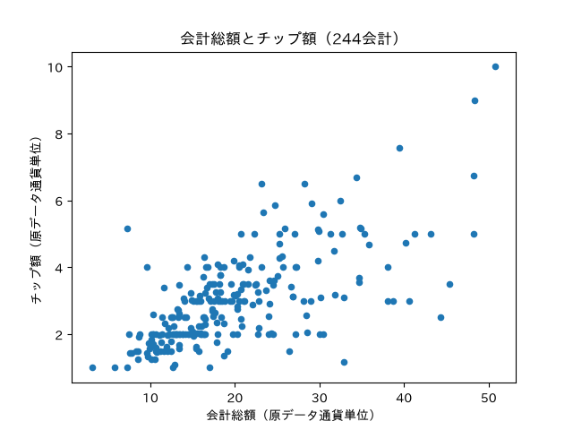

*244行の会計総額とチップ額。正の観察上の関連を示す散布図であり、因果効果を示すものではありません。NotebookのPNG出力を抽出しています。*

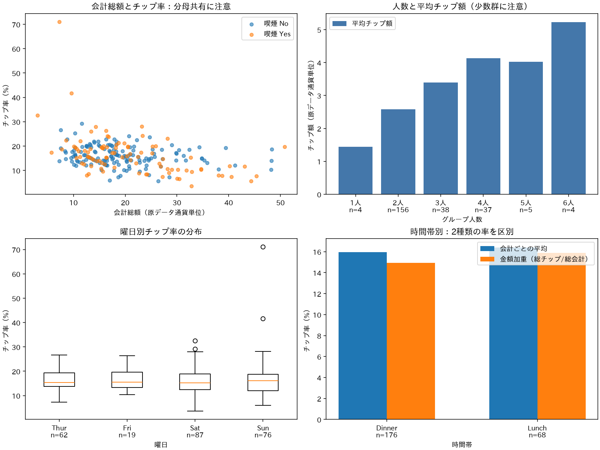

*会計総額と率の関係、人数別平均チップ額、曜日別の率分布、時間帯別の会計平均率と金額加重率。少数群の標本数と、率の集計方法の違いを併記しています。*

**AIが生成した追加依頼1 — 極端値・部分集合・分母共有の検証**

> 会計総額が高いほどチップ率が低いという結論は、71%の1会計や比率の分母共有に左右されていませんか。高チップ率・会計額の両端・重複を除く仕様と、夕食のみ・人数2〜4人のみで感度分析し、対数モデルの弾力性と加法モデルから生じる率の曲線を使って、観察上の関連と行動・因果の解釈を切り分けてください。

**選定理由**: 初回の負の相関が71%の1会計や分母共有に左右されると、関係の方向・大きさだけでなく行動上の解釈も変わるため、AIは最優先の未解決点としました。

**結果**: 元データ、高率上位1%除外、会計額中央90%、完全一致行の一方除外、Dinnerのみ、人数2〜4人のみの6仕様を比較しました。各仕様の標本数は順に244・241・218・243・176・231です。会計額のチップ額係数はすべて正で0.09279〜0.10011、初回基準からの最大相対偏差は5.95%。Notebookで設定した許容偏差25%以内で `stable=True` でした。率の係数もすべて負ですが、−0.29048〜−0.19570、最大相対偏差30.62%で `stable=False`。**方向の維持と係数の大きさの安定性を区別する**結果になりました。

調整対数モデルのチップ額弾力性は0.61345（HC3 95%区間0.45958〜0.76732）で、観測範囲では額が会計額に比例して増えるというモデルとは異なります。単純な加法モデルは `E[tip | bill] = 0.92027 + 0.10502 × bill`。これを率へ変換すると、会計額10で19.705%、40で12.803%となり、正の定額成分だけでも分母の増加に伴って率が低下します。これはモデルから導いた曲線であり、客の心理や会計額への介入効果の識別ではありません。証拠はNotebookの反復1コードセル（インデックス13）と要約セルです。部分集合では推定対象も変わり、25%基準は指定仕様内の計算上の安定性に限られます。

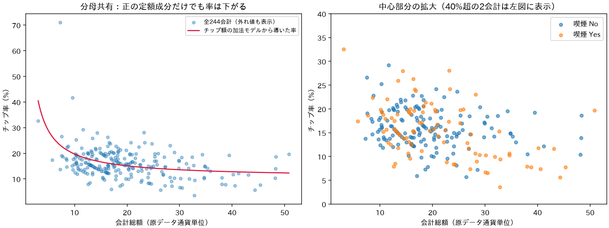

*左は全244行と加法モデル由来の率の曲線、右は40%以下の中心部分の拡大。高率の会計は左に残し、拡大図で表示しない範囲を明示しています。*

**AIが生成した追加依頼2 — 群差の不確実性・重み付け・曜日と時間帯の識別**

> 曜日・昼夜・喫煙区分・記録上の性別に関係がないと言い切れますか。群ごとのチップ率差にbootstrap区間を付け、会計平均率と金額加重率で喫煙区分の比較が反転する理由を確認してください。曜日と時間帯の重なり不足を調べ、同じ曜日の昼夜比較と曜日・時間帯を片方ずつ入れたモデルで、識別できない関係を明確にしてください。

**選定理由**: 反復1で率の大きさが不安定と分かり、初回の喫煙区分比較は会計平均率と金額加重率で逆向きでした。さらに昼夜のVIFが約9.24であり、「関係がない」という過剰解釈を防ぐ必要があると判断しました。

**結果**: seed `20261002`、5,000回の会計単位ブートストラップによるpercentile 95%区間を付けました。差の単位はパーセントポイント（pp）です。

| 比較 | 推定差（pp） | 95%区間（pp） | 比較群の会計数 |
|---|---:|---|---|
| 喫煙Yes−No・会計平均率 | +0.3868 | −1.3372〜2.3151 | 93 / 151 |
| 喫煙Yes−No・金額加重率 | −1.0967 | −2.5398〜0.5512 | 93 / 151 |
| Male−Female・会計平均率 | −0.8840 | −2.3842〜0.6426 | 157 / 87 |
| Lunch−Dinner・全曜日の会計平均率 | +0.4610 | −0.9702〜1.8292 | 68 / 176 |
| Lunch−Dinner・金曜のみの会計平均率 | +2.9849 | −1.2133〜6.8586 | 7 / 12 |

喫煙区分比較の符号反転は、金額加重率が大きな会計に大きな重みを与え、Yes群で会計額と率の負の共変動が強いことと整合しました。会計額と率のSpearman相関はYes群−0.47995、No群−0.18728です。これは喫煙の因果効果の符号反転ではありません。

曜日・時間帯の両方を含めた率モデルのLunch−Dinner係数は+0.6835 pp（HC3 95%区間−2.9824〜4.3494）、曜日を除いた時間帯モデルでは−0.4255 pp（−1.8863〜1.0354）でした。曜日だけの仕様も計算していますが、時間帯係数を持たないため昼夜差の表には載せていません。同じ曜日での比較は金曜7対12会計、木曜のDinnerは1会計のみであり、昼夜差は十分に識別できません。証拠は反復2コードセル（インデックス15）です。区間が0を含むことは無効果・同等性を証明せず、独立会計の仮定と多重比較未調整の限界も残ります。

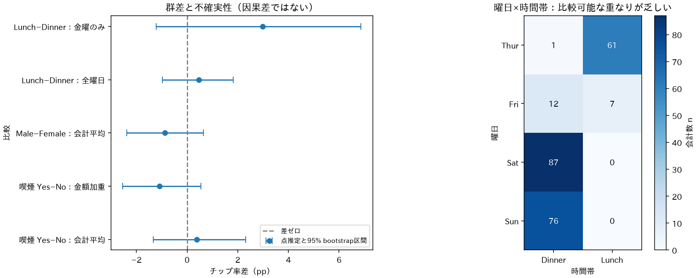

*左は群ごとの率差と95%ブートストラップ区間、右は曜日×時間帯の会計数。群差の不確実性と、同じ曜日の昼夜比較情報が少ないことを可視化しています。*

**AIが生成した追加依頼3 — 会計総額と喫煙区分の交互作用**

> 喫煙Yes群では会計総額とチップ率の順位相関がNo群より負に強いようです。一定の群差だけを仮定する初回モデルで見落としていませんか。会計総額×喫煙区分の交互作用をチップ額とチップ率の両方で探索し、高率の会計除外・会計額中央90%・夕食のみの仕様で確認してください。比較範囲の重なりと少数群も示し、探索的な候補と安定した結論を区別してください。

**選定理由**: 反復2の順位相関の差を受け、群差を一定とする初回モデルだけから「喫煙区分は関係しない」と解釈する危険を避けるため、AIは交互作用を選びました。

**結果**: 全会計、高率上位1%除外、会計額中央90%、Dinnerのみの4仕様で、会計総額×喫煙区分を追加しました。全会計のチップ額モデルの傾きはNo群0.13019、Yes群0.06551、Yes−Noの傾き差は−0.06468（HC3 95%区間−0.11661〜−0.01275）。4仕様で負の差を保ち、最大相対偏差12.31%で `stable=True` でした。

率モデルの全会計での傾き差は−0.29173 pp/会計通貨単位（−0.53997〜−0.04348）ですが、高率上位1%除外では−0.14422（−0.29922〜0.01077）となり0を含みます。最大相対偏差50.56%で `stable=False`。額の交互作用の指定仕様内の安定性を、率にも一般化していません。

両群の会計額の共通範囲は7.25〜48.33でした。ただし、会計額10未満のNo/Yes群は11/6会計、30以上60未満は15/17会計で、範囲が重なるだけでは共変量の交換可能性は保証されません。証拠は反復3コードセル（インデックス17）です。事後選択した交互作用、多重比較未調整、未測定交絡、独立性の仮定を残し、探索的な関連候補に限定しました。

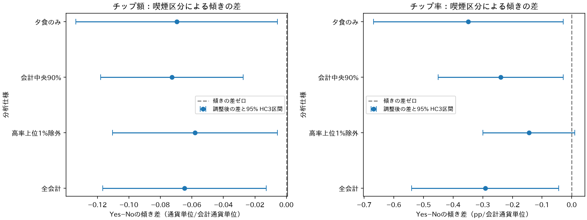

*4仕様のYes−Noの傾き差とHC3 95%区間。額の傾き差は指定仕様内で比較的安定する一方、率では高率除外により区間が0を含みます。*

**反復終了・追加確認**: 初回実行中にAIが3回の追加依頼を生成・実行しました。追加確認ログとNotebookの再評価節は、既存3回を保持し、新しい自然言語の追加依頼は0回と記録しています。辞書、客・担当者ID、独立した検証データがないため、同じ244行への探索追加では残る問題を解消できないと判断しました。追加確認は再評価・再実行・監査であり、4回目の統計探索依頼ではありません。

**最終結論**: **固定した公開CSVの観測範囲では、会計総額が高いほどチップ額が大きいという正の関連は指定した感度仕様内で安定していました。チップ率との負の関連は方向を保ったものの、大きさは高率観測の扱いに敏感でした。** 分母共有と加法モデルの定額成分でも率低下を説明できるため、「高額な客ほど気前が悪い」「会計額を増やすと率が下がる」といった心理・因果の結論にはなりません。人数の調整後関連やカテゴリ差は不確実で、喫煙区分との交互作用も探索的候補にとどまります。Kaggle版の取得成功や、飲食店一般への一般化は主張できません。

**監査・再現性**: `status.json` の `analysis_complete=true`、`final_completion.ready=true` と、Notebookの実行出力・再評価記録から分析完了を判断しました。文書化状態の値は分析の成否判定には用いていません。

初回の外部ランナー記録は `initial_termination="artifact_complete_cutoff"`、所要1158.5秒、終了コード0です。ただしログ末尾はNotebookの安定・監査を理由とするプロセス停止であり、CLIが自然終了したことを意味しません。初回監査には、末尾の自己監査セルが未完了のため除外されたという警告が1件ありました。追加確認は `followup_termination="exited"`、422.5秒、終了コード0で、ログ末尾の子孫ランタイム終了は外部ランナーによる後処理です。

追加確認ログは新カーネルで全12コードセルを上から再実行したと報告し、Notebookの保存後メタデータと `status.json` の最終監査は12/12実行済み、nbformat正常、未実行セル・エラーセル・監査指摘・視覚監査指摘はいずれも空です。PNGは4コードセルに計5出力、証拠付きInsightは8件あります。末尾セル内の自己監査出力では12セル中11実行済み・実行中末尾の除外警告が残っていますが、**保存後の監査**では12/12・指摘なしになっています。両時点を混同しません。

再現チェックの実行出力は、同じSHA-256とseedで主要統計・係数・区間・感度仕様・群差等の237数値を初回baselineと照合し、最大絶対差0、`atol=rtol=1e-10`、`match=true` を記録しています。再実行時の取得セルは固定済みファイルのハッシュを検証して再利用し、Kaggle APIへ再問い合わせしていません。これは固定データからの分析再現であり、Kaggleアクセスの回復確認ではありません。

初回run_idは `v020-exp-04`、追加確認のrun_idは `v020-exp-04-followup`。保存後記録の後者のlifecycleは `completed`、実行中セル・書込み待ち・保持ロックはすべて0です。一方、前提manifestの `ratio_definition` と `independence` は `assumed` のままで、結論に重要な未解決前提として警告2件が記録されています。Notebookの構造・引用・視覚監査の指摘なしと、統計前提の検証済みは別です。

Notebookの環境出力はPython 3.12.3、NumPy 2.5.3、pandas 3.0.6、SciPy 1.18.1、statsmodels 0.15.0、Matplotlib 3.11.2、nbformat 5.11.1、kaggle 2.2.4、jupyter-mcp-server 2.2.3、mcp 2.2.0です。Notebook保存先は `benchmark/projects/kaggle-v020-kaggle-exp-04-tips/notebooks/kaggle-v020-kaggle-exp-04-tips.ipynb`。本節の分析結果は指定のNotebook、`initial-prompt.md`、`initial.log`、`followup.log`、`status.json` のみを根拠とし、旧白書は節の書式の参考に限定しています。図はこのNotebookに保存されたPNGをそのまま抽出しました。

**失敗内容と切り分け**: Kaggleファイル一覧APIのHTTP 403は取得経路の失敗であり、Jupytermind障害の証拠ではありません。初回検索一覧の欠落はNotebook側取得コードの記録不足で、初回の一覧は復元できません。Notebookには、未作成ディレクトリへのJupyter MCPの作成失敗を `ensure_notebook` で回避したこと、著者側の改行エスケープ不足によるSyntaxErrorを修正したことも記録されています。ただし詳細な元エラー出力は指定の初回ログには残っておらず、Notebookの記述を超えて原因を断定しません。

Insight挿入を伴う最終セルの出力未保存は追加確認ログにも記録されています。初回はセル移動との関係を疑いましたが、移動を止めても再発したため、原因をセル移動だけには限定していません。実出力をIPythonの `capture_output` で捕捉し、実カーネルのexecution_countとともに同じセルへ保存した後、再監査しています。これはNotebook書込みとMCPの出力保存の統合上の問題として扱い、Jupytermindの統計・manifest・視覚監査APIの改善候補とは分けました。Copilot CLIや外部ランナー固有の数値分析障害は、指定証拠からは確認されません。

**Jupytermind改善候補**: Notebookの要約セル（インデックス19）と追加確認セル（33）で、次の限定再現例が記録されています。ライブラリの修正は行っていません。2件の分類・再現手順・期待/実際の挙動・影響・証拠・受け入れ条件は、本実験の `issue-candidate.json` に保存しています。

| 分類 | 再現・実際の挙動 | 影響・回避策・受け入れ条件 |
|---|---|---|
| 定義manifestの案内・機能整合 | `total_bill.unit` が `inferred` のmanifestで `unresolved_fields()` を呼ぶと、その単位は結果に含まれず、再現出力は `inferred_unit_returned_by_unresolved_fields=false` | 推測単位への注意書きを見落とす可能性。今回のNotebookはinferredを別走査しました。unknownのみという既存契約違反と断定せず、利用案内で別走査を明示するか、unknown/inferredを選択できるAPIとテストを用意し、推測をverifiedへ自動昇格しないことを受け入れ条件とします。 |
| 視覚監査の検査情報欠落検出 | PNG出力を持つコードセルからchartメタデータを丸ごと省いた最小Notebookを `audit_visual_outputs` に渡すと、結果は空配列 | 文字・ラベルを未検査でも検証済みと誤解する可能性。今回は全図セルにメタデータを付け、Glyph警告を検査し、Notebookには目視確認も記録されています。メタデータ全欠落・検査キー欠落・検査済み空配列を区別し、ラベル/凡例の必要性を検証するfindingと、監査okへの影響を固定するテストを受け入れ条件とします。 |

これらの改善候補は未確認単位や視覚検査情報の取り扱いに関するもので、今回の統計値の誤計算を示すものではありません。また、利用案内とAPI契約の整合に関する記述はNotebookの再評価に基づき、本節でライブラリ実装やdocstringを別途検証したものではありません。

**残る限界**: 店舗・地域・期間・抽出方法・ライセンス、通貨・税・チップ含有、sex/smokerが誰の属性かは未確認です。客や担当者の反復を識別できず、HC3と会計単位ブートストラップの区間は独立会計の仮定に条件付きです。曜日と時間帯の重なり不足、小標本、モデル仕様依存、事後探索、多重比較、未測定交絡、独立検証データ不在が残ります。PNGの密度や著者申告のメタデータは可読性の完全な保証ではなく、証拠manifestの単一引用照合もInsight段落の全数値・推論の妥当性を自動保証しません。再実行の一致と監査完了は確認できましたが、前提・因果識別・外的妥当性まで確認済みとすることはできません。

## 実験05: Diamonds（分析完了・監査セルの完了出力に留保）

**課題**: 「KaggleのDiamondsデータから、価格の違いを説明する特徴を調べてください。」

**初回プロンプト（全文・原文）**:

> KaggleのDiamondsデータから、価格の違いを説明する特徴を調べてください。手順は指定しません。自分で分析計画と図表を選び、単位・外れ値・相関と因果の区別に注意して日本語で報告してください。AI Data Scientist SkillとJupyter MCPで実行し、計画、コード、結果、根拠付きInsightをノートブックに残して再実行できることも確認してください。 Kaggle参照先: https://www.kaggle.com/datasets/shivam2503/diamonds。インストール済みkaggle Python SDKを使い、NotebookのJupyter MCP実行セル内で`KaggleApi().authenticate()`、`dataset_list(search=...)`、`dataset_list_files(...)`、必要に応じて`dataset_download_file(...)`を呼び出し、Kaggle上の対応する公開データを検索・取得してください。owner/dataset slug、取得ファイル名、取得日、ファイルSHA-256をNotebookに記録してください。APIトークンをセル出力・Notebook・ログへ表示しないでください。分析・API取得コードの実行はJupyter MCPだけを使い、端末コマンド、subprocess、外部スクリプト起動、作業エージェントへの委譲は行わないでください。Kaggle APIで対応データを検索・取得できなかった場合に限り、`/home/nahisaho/kaggle/experiments/white-paper.md`に記載された旧実験の公開CSV `https://raw.githubusercontent.com/mwaskom/seaborn-data/master/diamonds.csv` を取得して実験を継続してください。その場合はKaggle APIの失敗内容、フォールバックした理由、CSV URL、取得日時、SHA-256をNotebookに記録し、公開CSVとKaggle掲載版の完全な同一性は保証されないことを明記してください。保存先は benchmark/projects/kaggle-v020-kaggle-exp-05-diamonds/notebooks/kaggle-v020-kaggle-exp-05-diamonds.ipynb としてください。run_idは `v020-exp-05` です。長時間処理の開始前にlifecycle.register_runを呼び、実行・書込みフェーズを記録し、終了時にcompletedまたはfailedを記録してください。データ定義manifest、分析前提manifest、意味的な異常検査、妥当な範囲の感度分析を使い、適用できない機能は理由を記録してください。図表はvisual_audit=Trueで監査してください。Notebookには「使用したJupytermindモジュール」節を設け、直接import・呼び出したモジュール名、関数名、使用目的を記録してください。間接利用は使用済みに含めないでください。Jupytermindの不具合または機能不足が疑われた場合は「Jupytermind改善候補」節を設け、分類、再現条件、期待する挙動、実際の挙動、影響、回避策、関係するセルとログを記録してください。Copilot CLI、Kaggle API、ベンチマークランナーに固有の問題とは切り分け、候補がなければ「なし」と記録してください。初回分析後、自分で結果を読み直し、結論に実質的な影響を与える未解決点があれば自然言語の追加依頼文を作成し、Notebookの「反復依頼履歴」に原文のまま記録して実行してください。価値ある追加分析がなくなるまで最大3回繰り返し、各反復の選定理由・結果・証拠・残る限界を報告してください。最後に全コードセルを上から再実行し、notebook_auditとライフサイクル状態を記録してください。

**使用したJupytermindモジュール**: Notebookのimportと直接の呼出しを確認しました。以下のモジュール名の接頭辞はすべて `ai_data_scientist.` です。標準ライブラリ、Kaggle SDK、pandas、statsmodels、scikit-learn、Matplotlibによる処理はJupytermindの機能として数えません。監査・Insight書込みを行う末尾セルについては、保存されたメタデータとInsightを証拠とし、セル全体の実行完了とは区別します。

| モジュール | 直接呼び出した関数・コンストラクタ・メソッド | 使用目的 |
|---|---|---|
| `project_manager` | `resolve_project`、`ensure_notebook`、`ensure_data_dir`、`enqueue_write` | 指定プロジェクト・保存先の解決、Notebookとデータ領域の作成、Notebook書込みの直列化 |
| `lifecycle` | `register_run`、`is_cancel_requested`、`mark_execution_start`、`mark_execution_end`、`mark_write_start`、`mark_write_end`、`get_run_status`、`mark_completed`、`wait_for_quiescence` | run_idの登録、実行・書込みフェーズ、終了・静止状態の記録 |
| `language_router` | `detect_language` | 日本語による分析指示の確認 |
| `ingestion` | `SourceSpec`、`ingest` | 保存CSVの読込み、100,000行の上限内で切捨てがないことの確認 |
| `cleaning` | `clean_dataset` | 欠損除去の影響、行番号を除いた重複の計数。主分析は重複を残し、除外仕様を感度分析に使用 |
| `eda` | `explore` | 型、欠損、要約統計、カテゴリの把握 |
| `stats_analysis` | `correlation` | 重量と価格のPearson相関と日本語解釈 |
| `visualization` | `render_chart`、`build_image_output` | 日本語の図表8枚の描画とPNG MIME出力 |
| `insight_engine` | `extract_cited_value`、`record_insight` | 実行出力の値の抽出、6件の根拠付きInsight、stream出力の互換性確認 |
| `notebook_audit` | `audit_notebook`、`audit_visual_outputs` | Notebook構造・根拠リンク・図表の監査、監査メタデータ欠落の再現確認 |
| `data_definition` | `FieldValue`、`build_manifest`、生成manifestの`unresolved_fields` | 定義・単位・出典の確信度と不明事項の明示 |
| `analysis_assumptions` | `Assumption`、`AnalysisAssumptionManifest`、`check_manifest` | 分析範囲、結論に重要な仮定、検証済み・棄却した仮定の記録 |
| `data_quality` | `detect_anomalies` | 宣言した範囲・カテゴリ制約による意味的異常検査 |
| `sensitivity` | `SensitivityPlan`、`run_sensitivity` | 重量モデル2種類×前処理4種類の比較と相対偏差20%の安定性判定 |

**初回指示**: 手法を指定せず、価格差を説明する特徴、図表、単位・外れ値・因果解釈への対応を自律的に選ぶよう求めました。AIは「取得とハッシュ固定→定義・品質検査→分布と未調整比較→同じholdoutで重量・品質・比率の追加価値を比較→未解決点の反復検証→再実行と監査」という計画をNotebookに残しています。対数価格を目的変数とし、重量の非線形性をスプライン、品質をカテゴリのダミー変数で扱いました。相関する特徴群の除外差は足し合わせ可能な因果的寄与率ではないと明記しています。

**データ取得**: Notebookの取得記録では、Kaggle SDKの認証、`dataset_list(search='diamonds', page=1)`、`dataset_list_files('shivam2503/diamonds')`、`dataset_download_file(...)`を使い、`shivam2503/diamonds` の `diamonds.csv` を取得しています。検索結果に指定slug、ファイル一覧に `diamonds.csv` が記録されています。取得日時は **2026-10-01 18:10:28.129325 UTC**（日本時間2026-10-02 03:10:28.129325）、SHA-256は `fc2f171cc18eae2138d01dcca7179db3bb30ff047dceae4467a056d52133810a` です。取得記録の `source_kind` は `kaggle`、API失敗・フォールバック理由はともに `null` で、公開CSVへのフォールバックは記録されていません。保存された再実行時の出力は、取得済みCSVをSHA-256照合して再利用したことを示します。したがって再実行でAPIを再取得したとは扱いません。指定証拠ファイルにAPIトークンの値の表示は確認できません。

データは **53,940行・11列**で、`Unnamed: 0` を行番号として除いた10変数を分析しました。欠損除去は0行、行番号を除いた観測内容の重複は146行でした。公開ggplot2辞書との列対応から、価格をUSD、重量をct（1 ct=0.2 g）、寸法をmm、`depth` と `table` を比率として解釈しています。ただしKaggle側の単位・測定過程を独立に保証したわけではなく、manifestは対応を `inferred` としています。ライセンス、価格時点、母集団・標本抽出、測定過程は `unknown` のままです。

**初回結果**: 価格中央値は2,401、範囲は326〜18,823でした。重量と価格のPearson相関は **0.9216**、Spearman相関は **0.9629** で、大きさが価格差の主軸でした。寸法が0以下または20 mmを超える行は23件、寸法から再計算した `depth` との差が2ポイントを超える行は48件、x/y比が0.8〜1.2の外にある行は7件でした。これらは重なり得る検査件数で、合計を異常行数とはしません。20 mm、2ポイント等は感度検査のための仮定であり、真の誤入力を確定したものではありません。主分析では寸法を直接使わず、高価格・大重量を機械的に誤り扱いしませんでした。

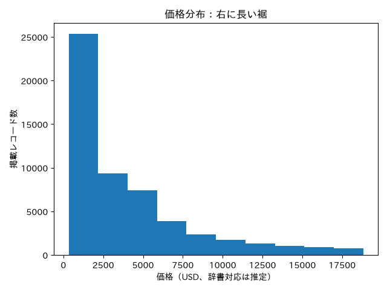

*価格の右裾が長い分布。USD表記は公開辞書との対応に基づく推定であり、現在の市場価格分布を意味しない。*

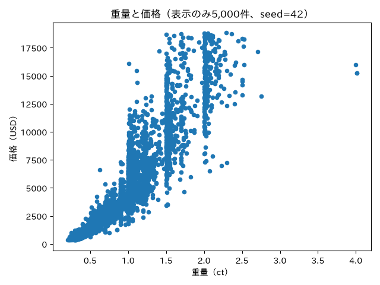

*重量と価格の関連。表示だけをseed=42の5,000件に絞った散布図で、モデル評価の標本数とは異なる。*

同一内容のレコードが学習・評価にまたがらないよう、観測内容のハッシュ単位でseed=42の固定分割を作成しました。学習43,159件、holdout 10,781件、同一レコードの分割間重複0件です。対数価格でのR²と、学習残差に基づくsmearing補正後のUSD尺度の指標を分けて示します（Notebookセル6、実行カウント4）。

| モデル | holdout対数価格R² | 対数価格RMSE | USD尺度MAE | USD尺度R² |
|---|---:|---:|---:|---:|
| 重量のみ | 0.935625 | 0.259543 | 844.37 | 0.863368 |
| 重量＋品質（cut・color・clarity） | 0.984951 | 0.125489 | 395.57 | 0.966043 |
| 重量＋品質＋比率（depth・table） | 0.984964 | 0.125432 | 395.10 | 0.966117 |

重量だけで対数価格の約93.6%を説明し、品質追加で約98.5%となりました。これは **USD価格の分散の98.5%を説明したという意味ではありません**。品質追加の対数R²増分は0.049326、比率追加の増分は小さく、群除外による低下は重量0.894272、透明度0.031681、色0.015947、カット0.000677、比率0.000014でした。共有情報を含む条件付きの比較であり、因果的な特徴の寄与率ではありません。

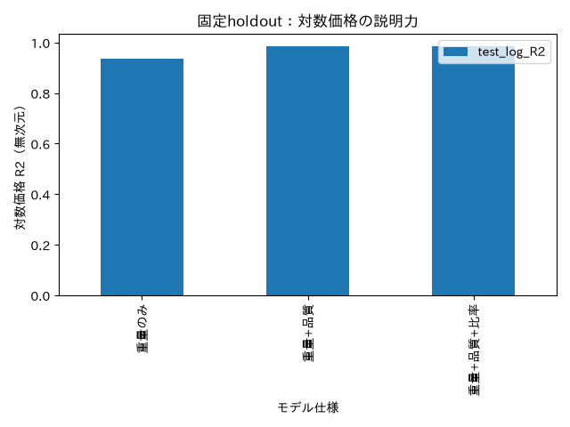

*同じholdoutで比較した対数価格R²。品質追加の改善が大きく、比率追加の差は小さい。*

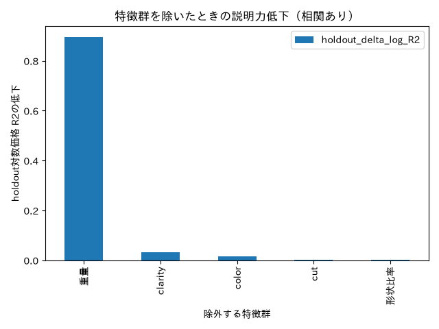

*特徴群を除いたときのholdout対数R²の低下。相関する特徴を含むため、棒の値を独立な寄与率として合計しない。*

カットの未調整価格中央値はIdealが1,810、Fairが3,282でしたが、平均重量はIdeal 0.703 ct、Fair 1.046 ctと異なります。初回の加法モデルで1 ct・色G・透明度VS2・学習データの `depth/table` 中央値に固定すると、Idealの幾何平均価格はFairより **16.79%高い**と推定されました。未調整順位の逆転を品質の因果効果とはせず、共通支持と仕様依存を未解決点に選びました。

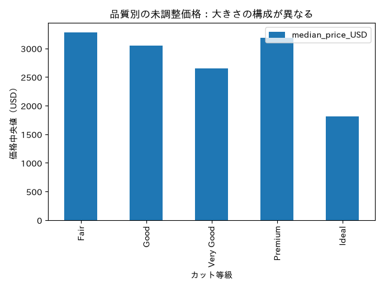

*カット等級ごとの未調整中央値。重量構成が異なる群を、そのまま品質効果として比較できない。*

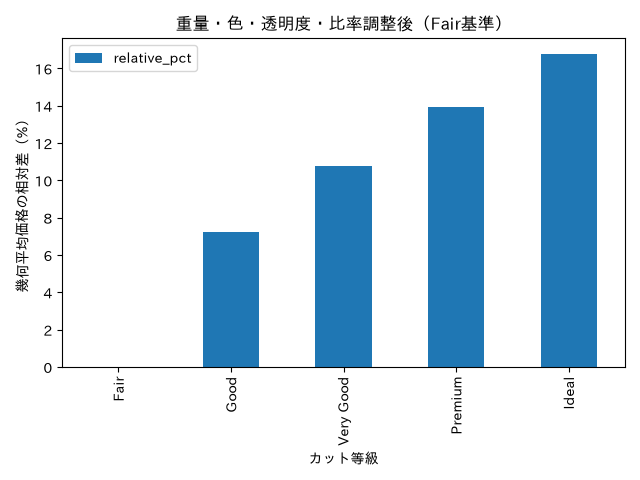

*1 ct・色G・透明度VS2・共通depth/tableに固定した加法モデルの相対差（Fair基準）。この比率を全重量域に一律適用できるかは追加分析で検討した。*

**AIが生成した追加依頼1 — 同一重量・色・透明度層の共通支持**

> 初回ではIdealの未調整価格が低い一方、条件調整後はFairより高くなりました。carat・color・clarityが同一の観測層でIdealとFair、およびIdealとPremiumの対数価格差を比較し、共通支持の件数と範囲を示してください。回帰の外挿に依存する程度と、依然として因果効果ではない理由を記録してください。

**選定理由・結果**: 初回の順位逆転がスプライン回帰の外挿に依存していないかを確認するためです。AIは重量・色・透明度が完全一致し、各カットが3件以上ある層に限定し、層の件数に基づく重み付き対数価格差を計算しました。層bootstrapは1,000回、seed=2026です（依頼原文・理由はセル8、出力はセル9、Insightはセル23）。

| 比較 | 共通支持の層数 | Ideal件数／比較等級件数 | 対象2等級に占める割合 | 重量範囲 | Idealの相対価格差 | 層bootstrap 95%区間 |
|---|---:|---:|---:|---|---:|---|
| Ideal対Fair | 108 | 1,455／573 | 8.76% | 0.30〜2.01 ct | 22.21% | 20.55〜23.95% |
| Ideal対Premium | 1,073 | 13,228／9,185 | 63.42% | 0.24〜2.30 ct | 1.10% | 0.51〜1.66% |

同じ重量・色・透明度でもIdealの価格が高い方向は確認できました。ただしFair比較は対象の8.76%だけであり、初回回帰の16.79%と同じ対象・調整条件の推定ではありません。`depth/table`、販売者、測定誤差、選択の交絡、重量の丸めが残ります。bootstrap区間は層の交換可能性を仮定したもので、市場全体や因果効果の区間ではありません。

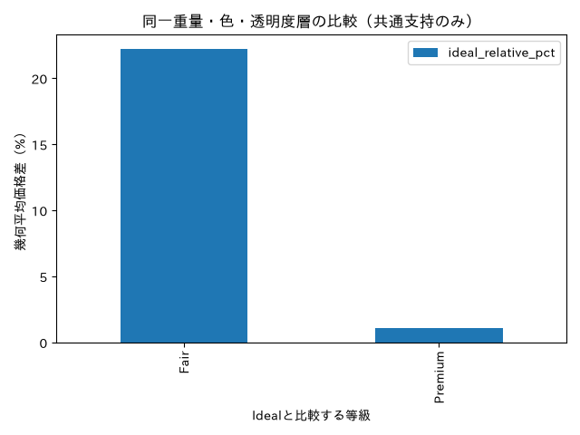

*共通支持のある層に限定したIdealの相対価格差。棒は点推定であり、区間と支持割合は上表で確認する。*

**AIが生成した追加依頼2 — 外れ値・重複・重量モデルへの感度**

> 主要結論の仕様依存性を確かめてください。重量の対数線形モデルとスプラインモデルを比較し、全件・意味的な寸法/比率異常を除外・観測内容の重複除外・重量と価格の上下1%を除外の条件で、品質追加によるholdout対数R2の増分とIdeal対Fairの調整価格差をSensitivityPlanで検証してください。全仕様の共通holdoutを固定し、安定性の判定対象・閾値・限界を明示してください。

**選定理由・結果**: 意味的異常と重複が見つかっており、重量の関数形と除外方針が主要結論を左右するかを定量化するためです。反復1の層比較とは別の頑健性を確認しました（原文・理由はセル10、出力はセル11、Insightはセル24）。

重量モデル2種類×前処理4種類の **8仕様**を評価し、全仕様で共通のholdoutを **10,376件**に固定しました。元のholdoutから405件を除外し、上下1%の境界は学習データから算出しています。品質追加の対数R²増分は **0.051814〜0.052366**、参照条件でのIdeal対Fair差は **16.755〜17.037%**で、すべて正でした。`run_sensitivity` の最大相対偏差はそれぞれ0.009406、0.014935で、設定した閾値0.20を下回り、両方 `stable=True` でした。

除外方針と重量の関数形を変えても方向・大きさは維持されました。ただしこれは評価対象を中心域に限定した加法モデルの比較です。初回とはholdoutが異なるため、品質増分の値をそのまま初回と比較できません。価格による選別も含み、全価格域の性能や、重量ごとのカット差が一定であることは保証しません。

**AIが生成した追加依頼3 — 品質と重量の交互作用・寸法・残差**

> 層比較のIdeal対Fair差が回帰推定より大きく、共通支持も狭いため、品質差を全重量域に一定とみなす未解決点が残ります。品質と対数重量の交互作用、および寸法x/y/zから得られる体積・形状情報を追加し、異常寸法を除いた共通holdoutで説明力を比較してください。重量帯別残差、重量別のIdeal対Fair差、品質群の条件付き重要度を確認し、初回結論を必要なら限定してください。

**選定理由・結果**: Fairとの層比較が狭い支持範囲で、加法モデルの一律比率とも異なったため、品質×重量の異質性と寸法の追加情報を調べました（原文・理由はセル12、出力はセル13、Insightはセル25）。意味的な寸法・比率検査を通る共通holdout **10,767件**で、対数R²は加法モデル **0.984962**、品質×重量 **0.985598**、さらに寸法を追加して **0.985741**でした。交互作用の増分は **0.000636**、体積・形状情報の追加増分は **0.000142**です。重量と品質が既知なら、寸法の独自の追加説明力は小さい結果でした。

交互作用を含むモデルから品質群を除いたときの対数R²低下は、透明度 **0.031625**、色 **0.015947**、カット **0.001126**で、順位は維持されました。一方、参照条件でのIdeal対Fairのモデル価格差は **0.3 ctで5.81%、0.5 ctで10.74%、1 ctで17.80%、1.5 ctで22.14%、2 ctで25.31%**と変わりました。「Idealなら一律に約17%高い」という解釈は採用せず、初回の値を参照条件に限定しました。

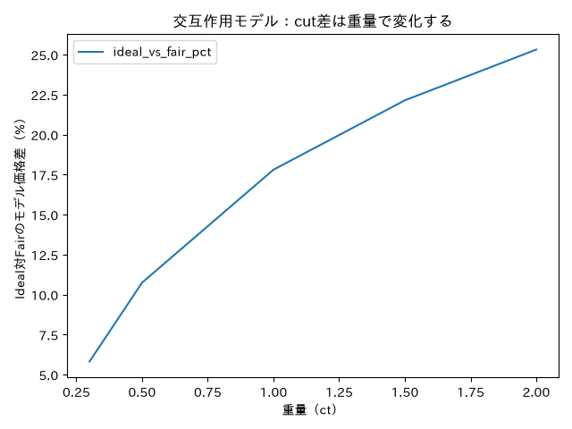

*品質×対数重量の交互作用モデルによる条件付き価格差。各点はモデル推定で、同じ条件の観測が十分存在することや因果効果を保証しない。*

2 ct以上のholdoutは429件で、交互作用モデルでも予測対数価格−実測対数価格の平均は **−0.03060**、相対誤差中央値は **−4.43%**でした。高重量域での過小予測傾向は残っています。重量±0.05 ctの近傍件数は全色・透明度を合算したもので、参照プロファイルの完全な共通支持を保証しません。AIは最大3回に達したため追加探索を終了し、売主・日付・鑑定等の未検証条件を限界として残しました。「有益な追加分析がすべてなくなった」とは記録から断定しません。

**追加確認ログの扱い**: 上記3依頼はNotebook内でAIが生成して実施した反復です。`followup.log` に残るのは「既存セルと根拠を保持して再評価し、結論を左右する不足がある場合だけ追加分析を行います。」という方針と外部ランナーの停止記録です。4回目の自然言語依頼、新しい分析結果、完了した追加監査出力は確認できません。`status.json` の初回・最終安定性に記録されたNotebookサイズ・mtimeも同一であり、追加確認を新しい分析成功として数えません。

**最終結論**: この掲載データ内では、**重量が価格差の主軸で、条件付きの追加説明力は透明度、色、カットの順に大きい**とまとめられます。品質を加えると固定holdoutの対数価格R²は約0.936から0.985へ、USD尺度MAEは約844から396へ改善しました。前処理と重量の関数形を変えても主要な方向は維持されました。ただしカットの未調整価格には重量構成の交絡があり、調整後の差も重量・比較対象・共通支持によって変わります。これは観察データの条件付き関連で、品質を変えると価格が上がるという因果効果ではありません。

**監査・再現性**: Notebookは `benchmark/projects/kaggle-v020-kaggle-exp-05-diamonds/notebooks/kaggle-v020-kaggle-exp-05-diamonds.ipynb`、run_idは `v020-exp-05` です。Notebookメタデータの `reexecution` には `jupyter-restart_notebook` によるカーネル再起動、先行する10コードセルの実行カウント1〜10、初回主要指標との一致 `metrics_equal_to_first_analysis=True`、比較許容差 `rtol=atol=1e-9`、CSVのSHA-256が記録されています。保存コードもハッシュ・主要指標・実行順を確認しています。ただし本節作成時に分析を新規再実行したのではなく、既存成果物の記録を確認したものです。

Notebookメタデータの監査は2026-10-01 18:23:29.814253 UTCに記録され、`ok=True`、nbformat正常、コードセル11、実行済み10、Insight 6、図表セル2（PNG計8枚）、エラーセル0、未実行指摘0、`visual_audit=True`、`visual_findings=[]` でした。ライフサイクルは `completed`、実行中セル・保留書込み・保持ロックはすべて0です。実行・書込みフェーズの時刻もNotebookに残っています。

ただし **末尾のセル26は `execution_count=null`、出力なし**です。監査は「末尾の `audit_notebook` 呼出しセルがまだ実行を終えていないため未実行指摘から除外」と警告しており、通常の11/11セル実行完了とは異なります。末尾セルによるInsight・監査メタデータの書込みは残っていますが、セル全体の完了出力は保存されていません。両実行ログには外部ランナーが安定したNotebookを理由にプロセス群を停止した記録があり、`status.json` の終了理由は初回・追加確認とも `artifact_complete_cutoff` です。正確な停止時点や、停止だけが出力欠落を起こしたかまでは断定しません。

分析の完了判定は `status.json` の **`analysis_complete=true`、`final_completion.ready=true`** と、実行済み分析セル・3回の反復・6件の根拠付きInsightを根拠としました。終了コード0だけを自然終了や完全再実行の証拠とはしません。図表監査の指摘0も、画像のレイアウトや統計的妥当性を全面保証するものではありません。

**Jupytermind改善候補**: Notebookの「Jupytermind改善候補」節と最小再現セル18から、次の3件を切り分けました。候補の詳細は `benchmark/runs/05-kaggle-exp-05-diamonds/issue-candidate.json` に保存しています。

| 分類 | 期待と実際の挙動 | 影響・回避策 | 証拠と確認範囲 |
|---|---|---|---|
| 可視化・レイアウト不足 | 既定の日本語カテゴリbar図はtick・軸ラベルまで収まることが望ましいが、Notebookは初回のモデル比較図等で下端が切れたと報告 | ラベルの判読性が低下。呼出し前に `figure.autolayout=True` を設定 | セル17の記述、セル7の回避設定、セル18の出力。本節の証拠には修正前PNG本体を含めていないため、切れ方の独立確認は未実施 |
| 可視化監査・メタデータ欠落の検出不足 | 実行済みPNGセルに必須監査メタデータがなければ警告することが望ましいが、最小再現で `audit_visual_outputs` は空のfindingsを返した | メタデータのない図を監査指摘なしと誤認し得る。呼出し側で字形・ラベルを確認し、セルと各出力にメタデータを付与 | セル18のコードと `visual_missing_metadata_findings=[]`。視覚的な欠陥そのものをこの再現で証明したわけではない |
| 根拠エンジン・標準出力互換性不足 | 実行済みセルのstdout streamにある数値を根拠として認識することが望ましいが、`record_insight` は `EvidenceMissingError` となった | printだけの出力からInsightを記録できない。実際の数値を `display_data` の `text/plain` にも出力して記録 | セル18で `print(0.5)`、実行カウント1、stdout `0.5\n` を持つNotebookを作成して直接再現。例外メッセージも保存出力にある |

stdout streamは正常なJupyter出力形式であり、その数値を根拠として扱えない点はJupytermind側の互換性候補です。図の既定レイアウトと監査ヘルパーの反応も、ライブラリへの直接呼出しに対応する候補であり、Kaggle APIの障害とは分けます。一方、外部ランナーのcutoffと末尾セル出力の未保存は、今回の証拠だけではJupytermind不具合に帰属できません。NotebookにはCLIの長出力省略にも言及がありますが、指定ログだけでは省略の具体的な発生箇所は確認できず、製品改善候補に追加しません。

**失敗・修正内容**: Notebookの `metadata.execution_notes` に、公開辞書の列名を誤って複数形 `carats` としてassertionが失敗し、実際の `carat` に直した記録があります。また、品質×対数重量の全カテゴリ項がスプラインの線形成分と重複してランク欠損となり、参照レベルを除いた指示変数を明示的に生成する形へ修正しています。保存された反復3のコードはモデル行列のランクを確認し、最終保存Notebookのエラーセルは0です。どちらも分析コード側の問題として扱い、Jupytermind改善候補には含めません。stream最小再現の例外は意図して捕捉した候補検証で、主要分析の未解決エラーではありません。残る実行上の不完全性は、前述の末尾監査セルの完了出力を確認できない点です。

**残る限界**: 単位の辞書対応と掲載レコードの独立性について、結論に重要な未検証仮定の警告が2件残っています。販売者、市場、価格時点、ブランド、鑑定等が不明で、未観測交絡・集積・選択を除けません。完全同一レコードの分割間重複は防ぎましたが、それ以上の依存まで解消した証拠はありません。holdoutを追加分析の選択にも再利用したため、性能は独立外部データへの保証ではありません。異常検査閾値の妥当性、独立参照データとの照合、因果識別は未検証で、参照データ不足等による非適用理由がNotebookに記録されています。狭い共通支持と2 ct以上の残差偏りを踏まえ、結論をこの掲載データの観察的関連に限定します。

本節の分析結果・実行状態・改善候補の証拠は、指定Notebook、`initial-prompt.md`、`initial.log`、`followup.log`、`status.json` に限定しました。既存の `white-paper2.md` は節の書式・詳細度の参照のみで、旧実験の数値を今回の結果として流用していません。掲載PNG8枚は指定Notebookの保存出力から抽出したもので、再描画していません。セル番号はNotebook内の0始まりの位置です。

## 実験06: Air Passengers / Flights（分析完了）

**課題**: 「KaggleのAir Passengersデータで、旅客数の長期的な推移と季節性を明らかにしてください。」

**初回プロンプト（全文・原文）**: 「KaggleのAir Passengersデータで、旅客数の長期的な推移と季節性を明らかにしてください。分析手順は自分で考え、時系列に適した図表を選び、データの期間と予測上の限界も日本語で述べてください。AI Data Scientist SkillとJupyter MCPで計画・実行・結果・根拠付きInsightをノートブックに記録し、先頭からの再実行を確認してください。 Kaggle参照先: https://www.kaggle.com/datasets/rakannimer/air-passengers。インストール済みkaggle Python SDKを使い、NotebookのJupyter MCP実行セル内で`KaggleApi().authenticate()`、`dataset_list(search=...)`、`dataset_list_files(...)`、必要に応じて`dataset_download_file(...)`を呼び出し、Kaggle上の対応する公開データを検索・取得してください。外部CSVミラーは使用しないでください。owner/dataset slug、取得ファイル名、取得日、ファイルSHA-256をNotebookに記録してください。APIトークンをセル出力・Notebook・ログへ表示しないでください。分析・API取得コードの実行はJupyter MCPだけを使い、端末コマンド、subprocess、外部スクリプト起動、作業エージェントへの委譲は行わないでください。APIで対応するデータが見つからない場合は外部ソースにフォールバックせず、その実験を停止して理由を報告してください。保存先は benchmark/projects/kaggle-v020-kaggle-exp-06-flights/notebooks/kaggle-v020-kaggle-exp-06-flights.ipynb としてください。run_idは `v020-exp-06` です。長時間処理の開始前にlifecycle.register_runを呼び、実行・書込みフェーズを記録し、終了時にcompletedまたはfailedを記録してください。データ定義manifest、分析前提manifest、意味的な異常検査、妥当な範囲の感度分析を使い、適用できない機能は理由を記録してください。図表はvisual_audit=Trueで監査してください。Notebookには「使用したJupytermindモジュール」節を設け、直接import・呼び出したモジュール名、関数名、使用目的を記録してください。間接利用は使用済みに含めないでください。Jupytermindの不具合または機能不足が疑われた場合は「Jupytermind改善候補」節を設け、分類、再現条件、期待する挙動、実際の挙動、影響、回避策、関係するセルとログを記録してください。Copilot CLI、Kaggle API、ベンチマークランナーに固有の問題とは切り分け、候補がなければ「なし」と記録してください。初回分析後、自分で結果を読み直し、結論に実質的な影響を与える未解決点があれば自然言語の追加依頼文を作成し、Notebookの「反復依頼履歴」に原文のまま記録して実行してください。価値ある追加分析がなくなるまで最大3回繰り返し、各反復の選定理由・結果・証拠・残る限界を報告してください。最後に全コードセルを上から再実行し、notebook_auditとライフサイクル状態を記録してください。」

**使用したJupytermindモジュール**: 保存されたNotebookのコードセルで、直接importと呼び出しを確認できるものを示します。以下のモジュール名の接頭辞はすべて`ai_data_scientist.`です。統計モデル自体はNumPyとstatsmodels、独自の季節性・分解図はmatplotlibによる実装であり、Jupytermindの分析関数としては数えません。

| モジュール | 直接呼び出した関数・クラス・メソッド | 使用目的 |
|---|---|---|
| `project_manager` | `resolve_project`, `ensure_notebook`, `ensure_data_dir` | 指定プロジェクトの解決、Notebookと取得データの保存先の作成 |
| `language_router` | `detect_language` | 日本語の依頼の識別 |
| `lifecycle` | `register_run`, `mark_execution_start`, `mark_execution_end`, `is_cancel_requested`, `mark_failed`, `mark_completed`, `wait_for_quiescence` | 実行登録、フェーズ管理、取消確認、失敗・完了記録、静止状態の確認。実行開始・終了関数は`phase`内で選択して呼び出す |
| `ingestion` | `SourceSpec`, `ingest` | Kaggleから取得したCSVを行数上限付きで読み込み |
| `cleaning` | `clean_dataset` | 重複削除の必要性と処理前後の行数を確認。削除は0行 |
| `eda` | `explore` | 型、欠損、要約統計の記録 |
| `data_quality` | `detect_anomalies` | 非欠損、正値、月キーの一意性の検査 |
| `data_definition` | `FieldValue`, `build_manifest`, `DataDefinitionManifest.unresolved_fields` | 定義を`verified`・`inferred`・`unknown`に区別し、未確認項目を列挙 |
| `analysis_assumptions` | `Assumption`, `AnalysisAssumptionManifest`, `check_manifest` | 記述的分析の範囲、正規化と将来の構造継続に関する前提・警告を記録 |
| `sensitivity` | `SensitivityPlan`, `run_sensitivity` | 初回6仕様、STL18仕様、予測誤差18仕様の感度比較 |
| `visualization` | `render_chart`, `build_image_output` | 月次推移・予測比較の描画、PNGのNotebook出力への変換 |
| `notebook_audit` | `audit_notebook`, `audit_visual_outputs` | 実行状態・根拠・図表の監査、メタデータ欠落時の局所再現 |

Notebookのモジュール一覧には構成用セルでの利用も記載されていますが、`project_manager.enqueue_write`、`lifecycle.get_run_status`、`insight_engine.extract_cited_value`・`record_insight`の呼び出しは保存されたコードセルでは確認できません。書込み開始・終了関数も`phase`に用意されていますが、保存コードには`write=True`での使用がありません。`insight_engine`の2関数はimportのみ確認できるため、この表には含めません。根拠manifest付きInsightや書込みフェーズの記録が保存されていることと、その生成関数の直接呼び出しが証明されることは区別します。

**初回指示**: 手法を指定せず、月次系列に適した図表を自律的に選び、長期推移、季節性、対象期間、予測上の限界を説明するよう求めました。Kaggle API限定の取得、来歴・ハッシュの記録、両manifest、意味的検査、感度分析、最大3回の自律的な追加依頼、最後の先頭再実行と図表監査も要件です。AIは月次品質の確認、年次集計、中心化12か月移動平均、年平均で正規化した季節プロファイル、対数STL分解を選びました。中心化移動平均は未来の観測も使う記述用の平滑化として扱い、予測には使用しませんでした。

**データ取得**: Notebookのセル3でKaggle Python SDKの`authenticate()`、`dataset_list(search='air passengers')`、`dataset_list_files()`、`dataset_download_file()`を使い、指定先`rakannimer/air-passengers`の`AirPassengers.csv`を取得しました。CSVは1,746バイト、144行・2列（`Month`、`#Passengers`）です。初回取得時刻は`2026-10-01T16:20:24.188406+00:00`、再取得時刻は`2026-10-01T16:27:51.158655+00:00`で、いずれも日本時間では2026年10月2日です。SHA-256は両方とも`5f8b316b84545d9cfb05612298df8415ce4c44421c7012d109465564b07ebc06`でした。外部CSVミラーは使用しておらず、認証情報の値は掲載しません。

観測期間は**1949年1月～1960年12月の144か月・12年間**です。セル5では月の連続性、重複、欠損、有限な正の整数値を確認し、意味的異常の指摘は空、重複削除は0行でした。欠損補間・外れ値除去は行っていません。検索結果の説明文は空で、**「千人」という単位や「国際航空旅客」という母集団は推定**です。地理的範囲、収集経路、実人数か搭乗回数かは不明としてmanifestに残し、以下では原データの記録値と無次元の比を中心に述べます。

**初回結果**: 年平均の月次記録値は1949年の126.67から1960年の476.17へ増え、**約3.76倍、増加率約275.92%、年率換算約12.79%**でした。年平均の前年比は全て正ですが、この年率は1949年と1960年の間の11年の変化を要約したもので、将来の成長率ではありません。年内の最大値と最小値の差も44から232へ拡大し、年平均に対する比は約0.347から0.487へ変化しました（セル7、実行番号4）。

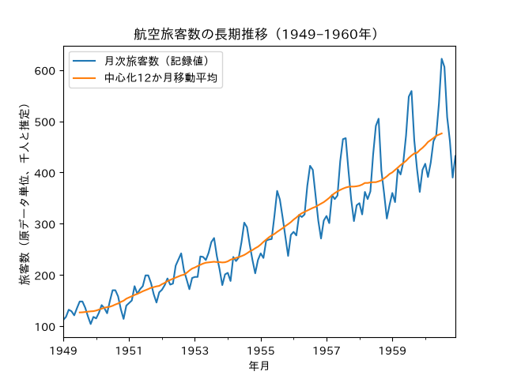

*1949～1960年の月次記録値と中心化12か月移動平均。長期的な増加に季節的な上下が重なっています。移動平均の端部は窓不足のため表示されず、将来へ外挿していません。*

各月の値を同じ年の月平均で割り、その12年間の平均をとると、7月の季節指数は約1.236、8月は約1.237、11月は約0.832でした。夏（7～8月）と冬（1～2月・11～12月）の平均指数の比は約1.419です。対数STLの季節性強度は約0.960でしたが、この分解上の指標を予測精度や原因の証明とは扱いませんでした。

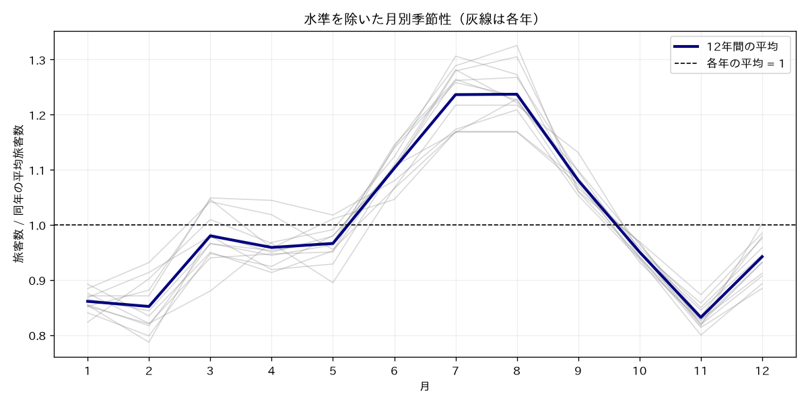

*灰線は各年、青線は12年間の平均季節指数です。各年の平均を1とすることで水準の増加と季節的な形を分け、7～8月の高さと11月の低さを示しています。*

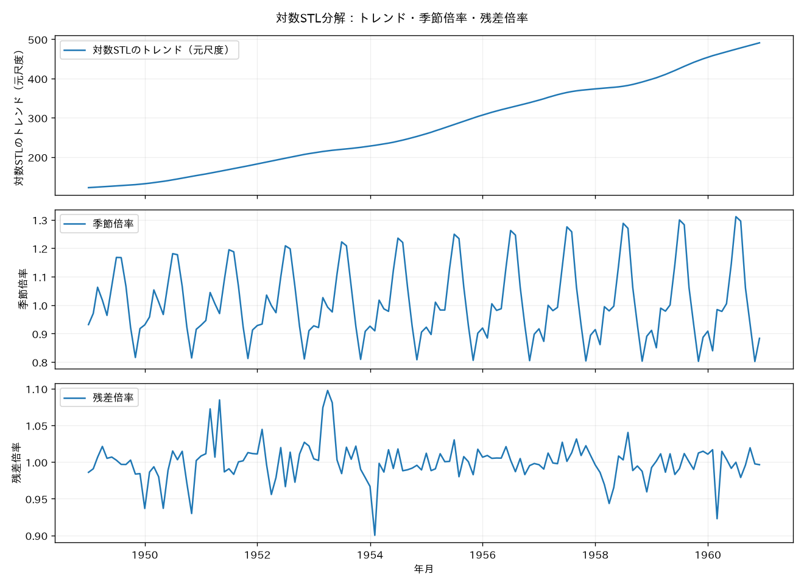

*対数STLの各成分を指数変換した記述的分解。上段はトレンドの元尺度、中段・下段は季節倍率と残差倍率です。全期間の観測を使うため、独立した予測検証ではありません。*

全期間・前半（1949～1954年）・後半（1955～1960年）と、年平均による正規化・対数線形トレンド除去を組み合わせた初回6仕様では、夏冬比は約1.340～1.483でした。全期間・年平均方式を基準とする最大相対偏差は約5.56%で、設定した10%許容内の`stable=True`です。ただし、これは夏冬の差が方式を変えても残るという確認であり、**季節倍率が前後半で同じであることの証明ではありません**。初回ログも、後半の振幅拡大を追加検証の理由として報告しています。

**AIが生成した追加依頼1 — 季節倍率の変化、月日数、ピーク月の確認**

> 初回結果では年平均で正規化しても季節振幅が後半ほど大きく見えます。前半と後半の夏冬比を、対数STLの季節窓と頑健推定の有無を変えて比較し、月の日数で割った場合も確認してください。7月と8月の順位を断定できるか、季節性は強いが固定の季節倍率ではないのかを根拠付きで説明してください。

**選定理由**: 全期間の平均的な夏冬比だけでは、相対振幅の変化や月日数の影響を除外できず、「季節性は一定」と誤解する余地があったためです。依頼原文はセル13、結果はセル14（実行番号6）、根拠付きInsightはセル15～17にあります。

**結果**: 年ごとに求めた夏冬比の平均は前半約1.357、後半約1.483で、後半は**約9.27%高い**値でした。この「年別比の平均」は、初回の「平均指数同士の比」と集計順序が異なります。対数STLの季節窓7・13・25と頑健推定の有無を組み合わせた6設定でも、全て後半の夏冬比が前半を上回り、最小の差は約0.124でした。全期間・前半・後半も含む18仕様の最大相対偏差は約5.21%で10%許容内ですが、前後半の変化を否定するものではありません。

月値をその月の日数で割ってから年内で正規化しても、夏冬比は**約1.375**でした。夏の高さは31日という月長だけでは説明できません。一方、7月と8月の平均指数差は約0.000735にすぎず、年別では7月優位4年、8月優位5年、同数3年です。ピークを一方に固定せず、**「7～8月の夏季ピーク」**としました。

**残る限界**: 日数調整後の指標は月次総量とは異なります。比較は12年の記述的評価で、季節変化の原因や統計的有意性は確定していません。STLの全期間分解も独立した検証ではないため、次に予測上の限界を時間順序を守って検証しました。

**AIが生成した追加依頼2 — 歴史内の予測誤差と外挿の限界**

> 季節性は明瞭ですが相対振幅は変化しており、12.79%という過去の年率成長をそのまま予測に使えるかが未解決です。過去のデータだけを学習に使う時系列のローリング起点検証で、季節ナイーブ、対数線形トレンド＋月効果、対数Holt-Wintersを12か月先と24か月先で比較してください。モデル・起点・予測期間に対する誤差の感度を記録し、この短い歴史データから将来予測について何が言え、何は言えないかを説明してください。

**選定理由**: 過去の成長率や季節分解の良好な適合だけでは将来精度を評価できず、未検証の「将来も同じ成長・季節構造」という前提を隠さないためです。依頼原文はセル18、結果はセル19（実行番号7）、根拠付きInsightはセル20～21にあります。

**結果**: 1954・1956・1958年末を学習終了時点とし、起点より後の12か月・24か月を評価しました。学習に使うのは各起点までの観測だけで、検証対象は1955～1960年です。3モデル×3起点×2期間の18仕様で、MAPE（平均絶対百分率誤差）とMAE、季節MASE、バイアスを記録しました。起点3件のMAPEの単純平均は次のとおりです。

| 予測モデル | 12か月先の平均MAPE | 24か月先の平均MAPE |
|---|---:|---:|
| 季節ナイーブ（最後の12か月の反復） | 12.55% | 16.40% |
| 対数線形トレンド＋月効果 | 5.08% | 6.99% |
| 対数Holt-Winters | 4.78% | 6.20% |

対数Holt-Wintersは平均MAPEが最小でしたが、全起点で最良ではありません。例えば1954年末起点の12か月では対数線形モデル約3.13%に対し、対数Holt-Winters約5.07%でした。18仕様全体のMAPEは**約2.77～21.52%**に広がり、20%許容の感度判定は`stable=False`です。最大相対偏差約324.25%は、最初の仕様（対数Holt-Winters・1954年末・12か月）のMAPEを基準にした量であり、MAPEそのものや誤差の信頼区間ではありません。

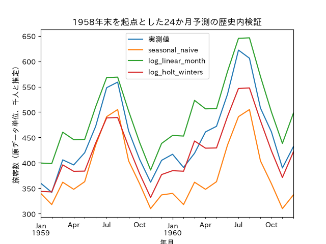

*3起点のうち1958年末起点の24か月検証を抜粋した図です。実測と3モデルの予測を比較しており、この図だけで全起点の成績や将来の精度を判断しません。*

**残る限界と反復終了**: 12か月・24か月の検証は一部同じ観測を使い、18評価は独立な18標本ではありません。対数予測の単純な指数変換には平均へのバイアス補正がなく、モデル選択後の独立した最終テストや予測区間の較正もありません。単位・母集団・収集経路の確認や未来の構造変化は同じCSVの加工では解消できないと判断し、**追加依頼は2回で終了**しました。上限3回を満たすためだけの反復は実施していません。

**最終結論**: この1949～1960年の系列では、長期的な水準増加と7～8月に高い季節性が併存しています。年平均は約3.76倍となり、夏冬の差は月日数や正規化方式を変えても残りました。ただし後半には相対的な夏冬差も拡大しており、固定の季節倍率とはいえません。歴史内の予測比較では対数Holt-Wintersの平均誤差が小さいものの、起点・期間・モデルに依存します。**記述的分析の完了と、将来の予測可能性の保証は別です。** `status.json`の`analysis_complete=true`、`final_completion.ready=true`と、Notebookに保存された結果・2回の反復・最終監査を分析完了の根拠としています。

**監査・再現性**: Notebookの`metadata.final_verification`とセル27末尾の「保存済み全セルの最終外部監査」には、カーネル再起動後の先頭再実行が記録されています。コードセルは0始まりのインデックス1・3・5・7・9・14・19・25・27、実行番号は順に1～9です。Kaggle再取得ファイルのSHA-256一致、全9コードセル実行済み、未実行・エラーなし、PNG4点、根拠manifest付きInsight8件、`visual_audit=True`、最終の`findings=[]`・`visual_findings=[]`を確認できます。セル9・19が図表を含むため、監査上の「図表セル2件」と「画像4点」は異なる集計です。

自己監査中は末尾セルがまだ未完了で、8/9セル実行済みと除外警告が出ましたが、保存後の監査では9/9になっています。一方、ライフサイクルについてはセル27の出力に`completed`・実行中0・書込み待ち0・ロック0があるのに対し、最終検証のスナップショットには`completed`ながら`active_cell_executions=1`が残ります。**全記録が静止状態で一致したとは主張せず、この記録上の不一致を留保します。** 構成時のフェーズログにも終了時刻が開始より早い項目があるため、これを各フェーズの所要時間計算には使いません。

初回ログは再起動・全9セル再実行・ハッシュ一致・完了を報告しています。外部ランナーの記録では初回は772.0秒、終了コード0、通常終了です。追加確認は93.5秒、終了コード欄0ですが、終了理由は`artifact_complete_cutoff`で、`followup.log`には「Notebookが安定し意味的監査を通過したためプロセスグループを停止した」とあります。**追加確認プロセスの通常終了や追加分析の実施をこのログからは確認できません。** 初回と追加確認後のNotebookサイズ・更新時刻は同一で、分析の追加依頼2回はNotebook内の反復履歴に基づくものです。

記録された依存ライブラリはKaggle 2.2.4、pandas 3.0.6、NumPy 2.5.3、statsmodels 0.15.0、matplotlib 3.11.2、nbformat 5.11.1です。これらはNotebookの環境記録であり、本レポート作成時に分析コードを再実行したという意味ではありません。

**失敗・改善候補の切り分け**: 分析を未完了にする最終エラーは記録されていませんが、途中のメタデータ取得と図表監査の範囲には注意が必要でした。

| 事象 | 証拠・実際の挙動 | 分類と対処 |
|---|---|---|
| 図表メタデータなしでも指摘が出ない | セル25で実在するPNGを持つcode cellに`metadata.chart`を付けず、`audit_visual_outputs(repro, (0,))`を呼ぶと`metadata_present=false`、`actual_findings=[]`、`missing_metadata_passes_without_findings=true` | **Jupytermindの図表監査の機能不足候補**。未確認の図を監査済みと誤解するリスク。本Notebookではタイトル・軸・凡例と使用フォントの字形検査結果を明示し、図表監査へ渡した |
| `dataset_view`による任意メタデータ取得の失敗 | セル5の`metadata_limit`に`AttributeError`、セル25の`SDK_separation.dataset_view_available=false`。構成時ログには品質フェーズの`RuntimeError`とセル修正も記録 | **Kaggle SDKインターフェース固有の制約**。検索・CSV取得は成功。検索結果の空の説明文を根拠に単位を確定せず、推定・不明として分析を継続した |
| 未作成の親ディレクトリへのNotebook作成 | セル24の記述に、Jupyter MCPで作成できず構成用Notebookから`ensure_notebook`で指定先を作成した旨がある。指定ログには生のエラー出力はない | **Jupyter MCP操作の前提条件として記載された事象**。詳細な失敗ログは未確認で、Jupytermind分析モジュールの不具合とは断定しない |
| 追加確認プロセスの打ち切り | `followup.log`のランナー停止記録と`status.json`の`artifact_complete_cutoff` | **外部ランナーの終了制御**。Copilot CLIの通常終了やJupytermindの分析失敗とは混同しない |

Jupytermindに対する改善候補は図表監査の1件（`VIZ-AUDIT-01`）です。期待する挙動は、PNGがあっても監査メタデータがなければ、字形・タイトル・軸ラベル・凡例が未確認であることを警告することです。受け入れ条件は、セル25と同じ再現で欠落警告が出ること、項目の一部欠落も識別できること、完全なメタデータを持つ本実験の図は従来どおり監査できることです。画像内容を自動で解釈できたという意味ではありません。分類・再現手順・期待／実際の挙動・影響・証拠・受け入れ条件は`benchmark/runs/06-kaggle-exp-06-flights/issue-candidate.json`に保存しています。ライフサイクルのスナップショット差は保存時点・外部監査側の操作を特定できないため、追加のJupytermind不具合とは断定しません。

**限界**: 対象は単一の歴史的系列の12季節周期です。単位・母集団・地理・収集方法が未確認で、運賃、所得、供給座席、路線、政策、災害などの外生情報はありません。独立参照データがないため、外部データとの意味的な照合は未実施です。非定常な水準間の単純相関や、季節性を無視した全期間のz-scoreによる除去も行っていません。分析前提manifestでは年平均正規化を`tested`へ更新した一方、将来の構造継続を表す`future-regime`は`assumed`のままで警告が残ります。最終Notebook監査の指摘なしは、この前提まで検証済みという意味ではありません。**1961年以後や現代の需要への外挿、季節変化の因果説明、将来精度の保証はできません。**

**証拠範囲**: 数値・状態・追加依頼の根拠は、指定Notebook、`initial-prompt.md`、`initial.log`、`followup.log`、`status.json`に限定しました。セル番号は0始まりです。既存の実験節は書式の参照にのみ使用し、旧版の数値や反復回数は転用していません。Notebookの保存先は`benchmark/projects/kaggle-v020-kaggle-exp-06-flights/notebooks/kaggle-v020-kaggle-exp-06-flights.ipynb`です。掲載PNG4点はその実行出力を抽出したもので、新規に描き直した図ではありません。

## 実験07: Auto MPG（分析完了）

**課題**: 「KaggleのAuto MPGデータを分析し、燃費の違いに関係する車両特性を調べてください。」

**初回プロンプト（全文・原文）**: 「KaggleのAuto MPGデータを分析し、燃費の違いに関係する車両特性を調べてください。手法は自分で選び、関係性の強さをわかりやすい図表で示し、観察データの限界を日本語で説明してください。AI Data Scientist SkillとJupyter MCPを使用し、計画から根拠付きInsightまでをノートブックに記録して再実行を確かめてください。 Kaggle参照先: https://www.kaggle.com/datasets/uciml/autompg-dataset。インストール済みkaggle Python SDKを使い、NotebookのJupyter MCP実行セル内で`KaggleApi().authenticate()`、`dataset_list(search=...)`、`dataset_list_files(...)`、必要に応じて`dataset_download_file(...)`を呼び出し、Kaggle上の対応する公開データを検索・取得してください。外部CSVミラーは使用しないでください。owner/dataset slug、取得ファイル名、取得日、ファイルSHA-256をNotebookに記録してください。APIトークンをセル出力・Notebook・ログへ表示しないでください。分析・API取得コードの実行はJupyter MCPだけを使い、端末コマンド、subprocess、外部スクリプト起動、作業エージェントへの委譲は行わないでください。APIで対応するデータが見つからない場合は外部ソースにフォールバックせず、その実験を停止して理由を報告してください。保存先は benchmark/projects/kaggle-v020-kaggle-exp-07-auto-mpg/notebooks/kaggle-v020-kaggle-exp-07-auto-mpg.ipynb としてください。run_idは `v020-exp-07` です。長時間処理の開始前にlifecycle.register_runを呼び、実行・書込みフェーズを記録し、終了時にcompletedまたはfailedを記録してください。データ定義manifest、分析前提manifest、意味的な異常検査、妥当な範囲の感度分析を使い、適用できない機能は理由を記録してください。図表はvisual_audit=Trueで監査してください。Notebookには「使用したJupytermindモジュール」節を設け、直接import・呼び出したモジュール名、関数名、使用目的を記録してください。間接利用は使用済みに含めないでください。Jupytermindの不具合または機能不足が疑われた場合は「Jupytermind改善候補」節を設け、分類、再現条件、期待する挙動、実際の挙動、影響、回避策、関係するセルとログを記録してください。Copilot CLI、Kaggle API、ベンチマークランナーに固有の問題とは切り分け、候補がなければ「なし」と記録してください。初回分析後、自分で結果を読み直し、結論に実質的な影響を与える未解決点があれば自然言語の追加依頼文を作成し、Notebookの「反復依頼履歴」に原文のまま記録して実行してください。価値ある追加分析がなくなるまで最大3回繰り返し、各反復の選定理由・結果・証拠・残る限界を報告してください。最後に全コードセルを上から再実行し、notebook_auditとライフサイクル状態を記録してください。」

**使用したJupytermindモジュール**: Notebookの直接importと呼び出しコードで確認できるものを示します。以下のモジュールはすべて `ai_data_scientist` 配下です。Kaggle SDK、pandas、SciPy、statsmodels、scikit-learn、matplotlib、nbformatは第三者ライブラリとして区別します。

| モジュール | 直接利用した関数・クラス・メソッド | 使用目的 |
|---|---|---|
| `project_manager` | `resolve_project`, `ensure_notebook`, `ensure_data_dir`, `enqueue_write`, `ProjectHandle` | 保存先の解決、Notebook・データ領域の準備、単一writerによる保存、根拠stagingと専用probeの作成 |
| `language_router` | `detect_language` | 日本語指示の判定 |
| `lifecycle` | `register_run`, `mark_execution_start`, `mark_execution_end`, `mark_write_start`, `mark_write_end`, `is_cancel_requested`, `mark_completed`, `get_run_status`, `wait_for_quiescence` | 実行・書込みフェーズ、中止要求、完了と静止状態の確認。例外・中止処理には `mark_failed` の呼び出しも記述 |
| `ingestion` | `SourceSpec`, `ingest` | Kaggle取得済みCSVの読み込みと行上限・切り詰めの確認 |
| `cleaning` | `clean_dataset` | 完全重複除去、完全ケース抽出、馬力の中央値補完と処理影響の記録 |
| `eda` | `explore` | 型、欠損、要約統計、車名カテゴリの確認 |
| `stats_analysis` | `correlation` | 日本語解釈付きPearson相関の計算 |
| `visualization` | `render_chart`, `build_image_output` | 重量と燃費の散布図生成、PNGのMIME出力化 |
| `data_definition` | `FieldValue`, `build_manifest`, `DataDefinitionManifest.unresolved_fields` | 出典・定義・単位の確信度、未知項目の記録 |
| `analysis_assumptions` | `Assumption`, `AnalysisAssumptionManifest`, `check_manifest` | 前提の状態、非因果スコープ、未解決の重要前提の確認 |
| `data_quality` | `detect_anomalies` | 欠損、値域、カテゴリ、車名の一意性の意味的検査 |
| `sensitivity` | `SensitivityPlan`, `run_sensitivity` | 16仕様での重量局所傾き・年式係数の安定性確認 |
| `insight_engine` | `extract_cited_value`, `record_insight` | 実出力の引用値と実行番号に結び付く8件のInsight記録、stream根拠参照の再現確認 |
| `notebook_audit` | `audit_visual_outputs`, `audit_notebook` | 図表metadata欠落の再現確認、`visual_audit=True` の最終監査 |

`mcp_gateway`、`dataset_validation`、`anomaly_detection`、`dependency_pins` は直接呼び出していないため、使用済みに含めません。相関区間、回帰、VIF、交差検証、複合図の描画は、第三者ライブラリを使ってNotebook内で組み立てています。

**初回指示**: 分析手法と追加分析の内容は指定せず、燃費差と車両特性の関連を自律的に調べ、日本語の解釈と観察データの限界を残すよう求めました。加えて、Kaggle API限定の取得、出典・ハッシュ、データ定義と前提のmanifest、意味的検査、感度分析、可視化監査、ライフサイクル、最大3回の反復、先頭からの再実行を要求しました。AIは、データ点検、Pearson・Spearman相関、共線性確認、年式・originを含む調整回帰、結果に応じた追加検証という計画をNotebookに記録しました。

**データ取得**: NotebookのAPIセルで `KaggleApi().authenticate()`、`dataset_list(search='auto mpg')`、`dataset_list_files(...)`、`dataset_metadata(...)`、`dataset_download_file(...)` を呼び出し、指定先 `uciml/autompg-dataset` の `auto-mpg.csv` を取得しました。保存された取得日時は **2026-10-01 16:40:07.286700 UTC**（日本時間2026-10-02 01:40:07.286700）です。これは再実行後の取得記録であり、最初のダウンロード日時と同一とは断定しません。SHA-256は `09a282cf12c7ab4ffb517b496b0dd1a8bac6e95977178cc7832c32044c32c3f6`、`external_csv_mirror=False` でした。認証処理の標準出力・標準エラーを表示しないコードになっており、指定された証拠にトークン値の表示は確認されません。

データは398行・9列です。取得した公開説明では、元データから燃費不明の8件が除かれたデータとされています。`horsepower` の `?` は6件あり、欠損へ変換した後、全特性の主分析は392件の完全ケースを使いました。完全重複行は0件ですが、車名は305種類で、一意性検査は重複する名称を持つ149行を指摘しました。これは「削除すべき重複測定149件」ではなく、同名・別年式車両などを含み得る名称の非一意性です。意味的検査の出力は馬力欠損と車名一意性の2項目でした。値域ルールは保守的な仮定であり、指摘がないことは測定値の正しさの証明ではありません。

データ定義manifestは、確認済み・推定・未知を分けています。市街地サイクルのmiles per gallonという燃費定義は公開説明で確認していますが、重量のlb、排気量のcubic inches、加速時間の秒・0–60 mph、年式コード70–82の西暦対応は推定です。ガロン規格とoriginの国・地域ラベルは未確認のため、km/L換算や国名への置換は行いませんでした。

**初回結果**: 重量と燃費には強い負の関連があり、Pearson相関は **−0.8317**（95%区間 −0.8597〜−0.7987）、Spearman順位相関は−0.8749でした。年式コードとのPearson相関は **0.5793**（95%区間 0.5100〜0.6411）です。その他の特性も含めた結果は次のとおりです。95%区間はFisher近似であり、独立性に関する留保があります。

| 特性 | 件数 | Pearson相関 | Pearsonの95%区間 | Spearman順位相関 |
|---|---:|---:|---|---:|
| 重量 | 398 | −0.8317 | −0.8597〜−0.7987 | −0.8749 |
| 排気量 | 398 | −0.8042 | −0.8364〜−0.7665 | −0.8557 |
| 馬力 | 392 | −0.7784 | −0.8147〜−0.7361 | −0.8536 |
| 気筒数 | 398 | −0.7754 | −0.8118〜−0.7330 | −0.8219 |
| 加速時間（推定） | 398 | 0.4203 | 0.3359〜0.4980 | 0.4387 |
| 年式コード | 398 | 0.5793 | 0.5100〜0.6411 | 0.5735 |

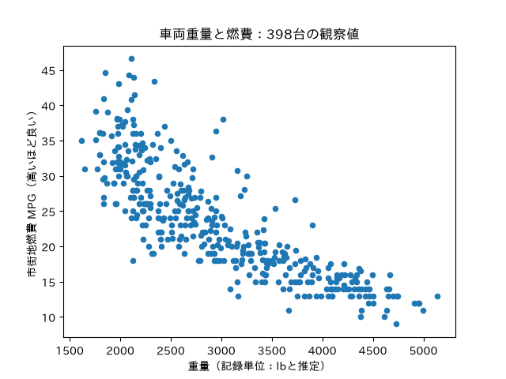

*398台の重量と燃費。MPGは高いほど燃費が良い。負の関連に曲線的な傾向が見られるが、重量の物理単位はlbと推定したものである。*

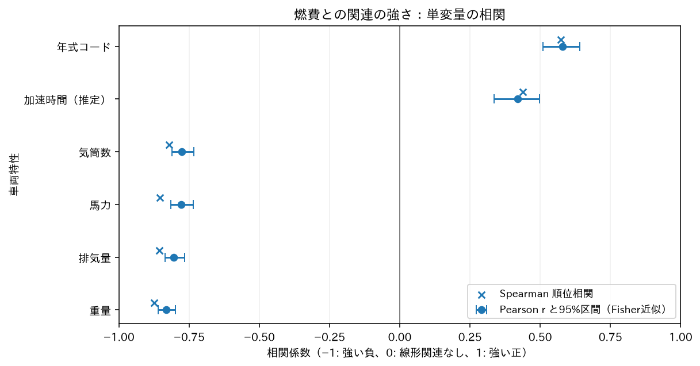

*Pearson相関とFisher近似の95%区間、Spearman順位相関の比較。馬力のみ392件、他の特性は398件であり、交絡を調整していない関連である。*

年式とoriginを調整した簡潔な線形モデルでは、重量1000記録単位あたりの係数は−5.8870 MPG（HC3の95%区間 −6.3640〜−5.4100）、年式コード1単位あたりは0.7698 MPG（0.6708〜0.8689）でした。標本内R²は簡潔モデル0.8190、全特性モデル0.8242で、追加特性による増分は0.0052でした。

ただし、重量と排気量の相関は0.933、排気量と気筒数は0.951と強く、全特性モデルの最大VIFは **22.94** でした。排気量の調整係数は正の0.0240となり、負の周辺相関と符号が逆転しました。AIは、これを「排気量を増やせば燃費が改善する」と解釈せず、共線性と関数形を追加確認すべき点として選びました。origin別の未調整平均燃費はコード1で20.084、2で27.891、3で30.451 MPGですが、重量・年式構成が異なるため、そのまま固有差とは扱いませんでした。

**AIが生成した追加依頼1 — 重量の非線形性と共線性**

> 重量と燃費の関係は直線ではなく曲線に見えます。重量の二次項を入れ、年式・originを調整した関係の方向と大きさを確認してください。全特性を加えたモデルとも同じ分割の交差検証で比較し、排気量や馬力を独立の主要要因と呼べるか、初回結論を見直してください。

**選定理由**: 初回散布図の曲線傾向、排気量の符号逆転、高いVIFが、線形係数や独立した重要度の解釈に影響すると判断しました。重量二次モデルと、気筒数をカテゴリとして扱い馬力二次項も加えた全特性モデルを比較しました。

**結果・証拠**: `ITERATION_1` セル（保存された実行番号6）では、392件に対してseed `20261002` の10分割×3反復、全モデル共通の30分割で交差検証を行っています。各モデルは訓練行だけで適合しています。

| モデル | pooled RMSE（MPG） | pooled MAE（MPG） | pooled R² |
|---|---:|---:|---:|
| 簡潔・線形 | 3.3615 | 2.5360 | 0.8140 |
| 全特性・線形 | 3.3488 | 2.5614 | 0.8154 |
| 簡潔・重量二次 | 3.0259 | 2.2210 | 0.8493 |
| 全特性・非線形 | 2.9054 | 2.1100 | 0.8611 |

簡潔モデルに重量二次項を加えるとRMSEは **約10.0%低下**しました。重量3000での局所傾きは1000記録単位あたり−7.0257 MPG、年式係数は0.8382でした。全特性の非線形モデルには追加改善があるため、「その他の特性は無関係」とは結論しません。一方、重い領域では二次曲線が折り返すため、全域で負・一定の傾きという解釈は保留しました。交差検証はこの標本内のモデル診断であり、fold間の標準偏差は95%信頼区間でも外部検証でもありません。

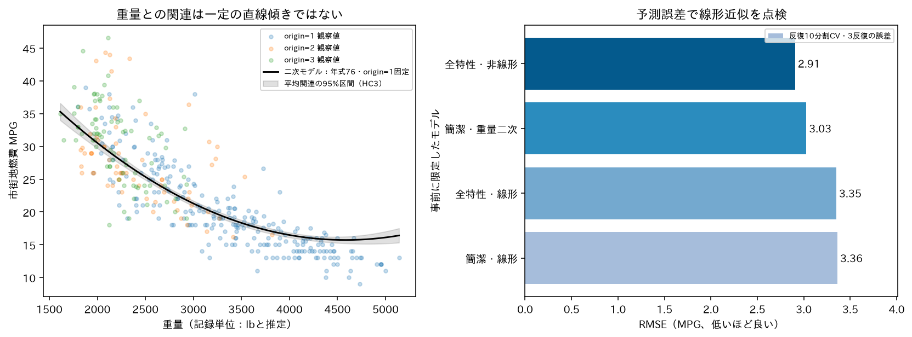

*左は年式コード76・origin=1に固定した二次モデルとHC3による平均関連の95%区間、右は同じ反復交差検証によるRMSE。右端の折り返しはモデルの形状であり、重い車両ほど燃費が改善するという証拠ではない。*

**AIが生成した追加依頼2 — 欠損・影響点・標本依存への感度**

> 非線形モデルでは重量約4500を超える領域で曲線が折り返しています。重量3000付近の負の関連と年式の正の関連は、対数重量モデル、馬力欠損の中央値補完、影響の強い観測の除外でも保たれるか確認してください。また、同じ車名や年式の依存を考慮した区間と交差検証を調べ、origin差の解釈と重量域の限界を明確にしてください。

**選定理由**: 曲線の重量域依存、馬力欠損6件、反復する車名、同年式の標本依存が未検証でした。AIは、4モデル×2欠損処理×2影響処理の16仕様、車名・年式cluster区間、群別分割の交差検証で確認しました。安定性の許容相対変動20%は、この診断前に定めた便宜的基準であり、一般的な科学的閾値ではありません。

**結果・証拠**: `ITERATION_2` セル（実行番号8）では、Cook距離4/nを超えた25件を感度分析で除外し、馬力欠損の中央値補完も比較しました。重量3000での局所傾きは16仕様すべてで負の **−7.0409〜−5.8870 MPG／重量1000記録単位**、基準からの最大相対変動は16.2%でした。年式係数はすべて正の **0.6730〜0.8395 MPG／コード1単位**、最大相対変動は19.7%でした。両者の `stable=True` は、この16仕様と20%基準に限った結果です。年式の変動は閾値に近く、頑健性を無制限には主張できません。

重量二次モデルの重量3000局所傾きは、年式13群のcluster区間でも−7.8967〜−6.1546、年式係数の区間も0.5805〜1.0959で、方向は維持されました。車名群5分割のRMSEは線形3.3930に対して二次3.0332、留一年式13分割では3.5187に対して3.1956で、改善方向も維持されました。年式ごとの重量相関もすべて負でした。

一方、重量5000付近（±250）には6台しかなく、同地点の局所傾きは二次モデルで正の1.8451、対数モデルで負の−3.7778でした。AIは、この領域の符号はモデル依存で確定できないと判断しました。群区間は近似であり、13年式という少数群や未測定の依存は残ります。影響点除外は診断であって、不正データと認定して主分析から取り除く処理ではありません。

**AIが生成した追加依頼3 — origin比較の共通支持域**

> originごとの重量範囲が異なるため、全標本の調整係数が比較可能な車両を比べているかが気になります。全originに共通する重量範囲に限定し、年式をカテゴリとして調整した場合の重量との関連とorigin差を確認してください。支持の乏しい重量域の折り返しを燃費改善と解釈しないよう、最終結論の範囲を定めてください。

**選定理由**: origin=3の車両が重い領域に存在せず、origin係数もモデルの関数形によって縮小しました。AIは、比較できる重量域と年式の線形制約が結論を左右すると判断し、共通重量域・年式カテゴリ調整を選びました。

**結果・証拠**: `ITERATION_3` セル（実行番号9）では、完全ケースの各originに共通する重量 **1825〜2930の204台**を分析しました。重量2500での局所傾きは−11.0089 MPG／重量1000記録単位で、負の関連が残りました。origin=1との差は次のとおりです。

| 比較条件 | origin=2との差（MPG） | HC3の95%区間 | origin=3との差（MPG） | HC3の95%区間 |
|---|---:|---|---:|---|
| 全標本392台・年式線形 | 1.3658 | 0.1912〜2.5405 | 0.9120 | −0.1130〜1.9371 |
| 全標本392台・年式カテゴリ | 1.2829 | 0.2928〜2.2729 | 0.6211 | −0.3297〜1.5718 |
| 共通重量域204台・年式カテゴリ | 1.0565 | −0.1836〜2.2965 | 0.5363 | −0.4471〜1.5196 |

共通重量域では両群の95%区間がゼロを含みました。これは「差が存在しない」という証明ではなく、この資料からoriginの固有差を強く主張できないという結果です。共通支持域は各群の最小値・最大値による一次元の制限であり、年式・重量・仕様の完全なマッチングではありません。少数セルや未観測交絡は解消していません。

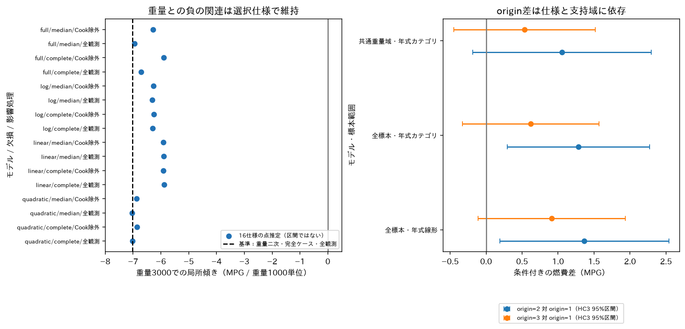

*左は重量3000での16仕様の点推定であり、点の幅は信頼区間ではない。右はorigin=1に対するorigin=2・3の差とHC3の95%区間。共通重量域へ限定すると、いずれの区間もゼロを含む。*

**最終結論**: この398台の観察データでは、**重量中心域での負の燃費関連と、年式コードとの正の関連**が主要な結果です。初回の相関だけで終えず、非線形性、欠損・影響点、標本依存、比較の支持域を確認したことで、結論をこの範囲に限定しました。排気量・馬力・気筒数の周辺相関を独立した因果的重要度に読み替えず、originの固有効果、重量5000付近の燃費改善、現代車への一般化は主張しません。

3回の追加依頼はすべて初回セッション中に生成・実行され、Notebookに原文と結果が残っています。残る因果識別、代表性、測定単位、稀な重量域の形状は、同じ標本のモデル追加だけでは解消できず、上限3回にも達したため停止しました。`followup.log` には既存証拠を確認する方針とランナーの停止記録があり、新しい追加依頼文や追加分析結果はありません。

**監査・再現性**: Notebookの最終監査は `ok=True`、nbformat有効、全14コードセル実行済み、未実行・エラーセル0件、図表セル3件、根拠付きInsight8件、`findings=[]`、`visual_findings=[]` でした。PNGは図表セル9に2点、12・19に各1点の計4点あり、本節ではその実出力を抽出して参照しています。セル番号はNotebookのゼロ始まりの位置です。

カーネル再起動後の再実行記録では、CSVのSHA-256と初回の主要13指標が一致し、最大絶対差は0.0、比較許容値は `rtol=atol=1e-10` でした。最終監査前の実行番号は1〜13の昇順、保存された最終監査セルの実行番号は16です。ライフサイクルは `completed`、実行中セル数・保留書込み数・ロック数はいずれも0でした。図表metadata、字形被覆・Glyph警告の点検も記録されていますが、自動監査だけで図の意味や統計的妥当性まで保証するものではありません。最終前提チェックには、標本依存を十分に捉えたという `iid` 前提が `assumed` のままである警告が1件残っています。

再現は通常のJupyterLabの「Run All」だけではなく、**記録されたMCP保存同期手順を含む**ものです。Notebookによると、主Notebookの `COMPILE_INSIGHTS` までを実行し、同じカーネルの補助Notebook `benchmark/auto-mpg-bootstrap-v020-exp-07.ipynb` のセル10でInsight・図表metadataを同期し、主Notebookの `FINAL_AUDIT` 実行・保存後に補助セル11で監査metadataを同期します。補助セル1〜9は初期化用なので再実行しない指定です。補助Notebook自体は今回の証拠対象ではなく、この手順は主Notebookに記載された内容として報告しています。今回の文書化作業で分析コードの再実行は行っていません。

Notebookに記録された環境はPython 3.12.3、numpy 2.5.3、pandas 3.0.6、SciPy 1.18.1、statsmodels 0.15.0、scikit-learn 1.9.1、matplotlib 3.11.2、Kaggle SDK 2.2.4、nbformat 5.11.1です。カーネル仕様・言語情報の名前はNotebook metadataでは空欄で、環境の自動復元まで確認されたとはいえません。独立参照データ照合は資料がなく、因果推定は識別条件を満たさず、AutoML・NLP・クラスタリングは目的外として適用していません。

`status.json` は `analysis_complete=True`、`final_completion.ready=True` と、完了要件すべての充足を記録しています。初回は終了コード0・1401.4秒・`exited`、追加確認は記録上の終了コード0・92.6秒ですが、終了理由は **`artifact_complete_cutoff`** です。`followup.log` の `[runner] stopping process group: Notebook remained stable and passed semantic audit` と整合し、追加確認セッションの自然終了とは区別します。初回後・追加確認後のNotebookは同じ756,508バイト・同じ更新時刻で安定していました。分析完了の判断はこれらの分析状態とNotebook内容に基づいています。

**失敗・回避策とJupytermind改善候補**: 分析全体の失敗ではありませんが、Notebookは作成途中の例外と回避策を記録しています。初回ログは要約中心で、途中の例外全文を網羅していないため、以下の切り分けはNotebookの対応ログと再現probe出力に基づきます。

| 問題 | 分類・実際の挙動 | 回避策・影響 |
|---|---|---|
| `dataset_view` がSDKに存在しない | Kaggle SDK互換性。Notebookに `AttributeError` と記録 | `dataset_metadata` に変更して取得継続。外部CSVへの切替なし |
| 親ディレクトリなしでの初期Notebook作成 | Jupyter MCPの作成制約として記録 | `project_manager` で先に領域を作成 |
| `findfont` へのリスト引数 | 独自分析コードの型誤り。`TypeError` と記録 | `FontProperties` に修正。Jupytermind固有の候補には含めない |
| 実行中セルのファイル書換えとMCP保存の競合 | Jupyter MCPと外部writerの接続境界。実行番号が失われる例をNotebookに記録 | 根拠をstagingに保存し、セル実行終了後に同期。単独モジュールの不具合とは断定しない |
| stream出力をInsightの根拠として参照できない | `insight_engine` の不具合／対応不足候補 | 同じ実測値を `display_data` の `text/plain` で提示 |
| chart metadata全体がない場合に視覚監査が指摘しない | `notebook_audit.audit_visual_outputs` の監査網羅性の機能不足候補 | metadata完全性と字形・描画警告を別途点検 |
| シリアライズ失敗後に既存Notebookが0バイトになる | `project_manager.enqueue_write` の非atomic保存の不具合候補 | FontPathを `str` 化し、シリアライズ可能性を確認。専用probeで再現し主Notebookはprobeに使わない |

Jupytermind候補3件の具体的証拠は、`STREAM_ONLY_PROBE`（実行番号11）と `FINAL_MANIFESTS_AND_PROBES`（実行番号12）、Notebook metadataの `jupytermind_improvements` です。streamに実際の値 `v020-exp-07-stream-probe` があるのに `record_insight` が `EvidenceMissingError` を返し、実図表を複製してmetadataを空にした監査は `missing_chart_metadata_findings=[]` でした。保存安全性probeではmatplotlibのFontPathに対して `TypeError` が発生し、専用Notebookが72バイトから0バイトになりました。FontPathの型互換性エラー自体と、失敗時に既存ファイルを保持できないwriterの責務は分けて扱います。分類、再現手順、期待・実際の挙動、影響、証拠、受け入れ条件を `issue-candidate.json` に保存しました。候補は報告段階であり、修正済み・GitHub Issue登録済みとはしません。

**残る限界**: 年式コード70〜82の歴史的車両で、抽出母集団と代表性は不明です。元データの燃費不明8件の除外、主分析の馬力欠損6件の除外に伴う選択バイアスは、中央値補完だけでは解消しません。空力、変速機、燃料、技術、規制、メーカーなどの未観測交絡があり、軽量化やoriginの介入効果は識別できません。重量・排気量・馬力・気筒数は強く共変動しています。物理単位とoriginラベルの一部は未確認で、独立参照資料による誤記照合も行っていません。

95%区間は近似で、車名・年式clusterによる補正もすべての依存を解消しません。16仕様の安定性は指定した関数形・欠損・影響処理と20%閾値に限ります。探索的比較のp値は多重比較補正しておらず、丸めた0.0000は厳密なゼロではありません。交差検証にはモデル選択後の楽観性が残り、留一年式法も主に補間の診断で、厳密な将来予測評価ではありません。以上から、本実験は関連の探索と結論の範囲を絞る反復分析の例であり、因果的燃費改善や外部市場への予測性能を確証するものではありません。

**証拠・保存先**: 本節はJupytermind v0.2.0ベンチマークの実験07を対象とし、実験上の根拠は、指定されたNotebook、`benchmark/runs/07-kaggle-exp-07-auto-mpg/initial-prompt.md`、`initial.log`、`followup.log`、`status.json` に限定しました。Notebookは `benchmark/projects/kaggle-v020-kaggle-exp-07-auto-mpg/notebooks/kaggle-v020-kaggle-exp-07-auto-mpg.ipynb`、run_idは `v020-exp-07` です。参照文書は節の書式・詳細度だけに用い、旧版の実験結果を今回の証拠に流用していません。

## 実験08: Red Wine Quality（分析完了）

**課題**: 「KaggleのRed Wine Qualityデータで、品質スコアと化学特性の関係を調べてください。」

**初回プロンプト（全文・原文）**:

> KaggleのRed Wine Qualityデータで、品質スコアと化学特性の関係を調べてください。分析計画と図表は自分で決め、統計的な関係を因果効果と混同せず日本語で説明してください。AI Data Scientist SkillとJupyter MCPを使って実行し、計画・コード・出力・根拠付きInsightをノートブックに記録し、再実行可能か確認してください。 Kaggle参照先: https://www.kaggle.com/datasets/uciml/red-wine-quality-cortez-et-al-2009。インストール済みkaggle Python SDKを使い、NotebookのJupyter MCP実行セル内で`KaggleApi().authenticate()`、`dataset_list(search=...)`、`dataset_list_files(...)`、必要に応じて`dataset_download_file(...)`を呼び出し、Kaggle上の対応する公開データを検索・取得してください。外部CSVミラーは使用しないでください。owner/dataset slug、取得ファイル名、取得日、ファイルSHA-256をNotebookに記録してください。APIトークンをセル出力・Notebook・ログへ表示しないでください。分析・API取得コードの実行はJupyter MCPだけを使い、端末コマンド、subprocess、外部スクリプト起動、作業エージェントへの委譲は行わないでください。APIで対応するデータが見つからない場合は外部ソースにフォールバックせず、その実験を停止して理由を報告してください。保存先は benchmark/projects/kaggle-v020-kaggle-exp-08-red-wine/notebooks/kaggle-v020-kaggle-exp-08-red-wine.ipynb としてください。run_idは `v020-exp-08` です。長時間処理の開始前にlifecycle.register_runを呼び、実行・書込みフェーズを記録し、終了時にcompletedまたはfailedを記録してください。データ定義manifest、分析前提manifest、意味的な異常検査、妥当な範囲の感度分析を使い、適用できない機能は理由を記録してください。図表はvisual_audit=Trueで監査してください。Notebookには「使用したJupytermindモジュール」節を設け、直接import・呼び出したモジュール名、関数名、使用目的を記録してください。間接利用は使用済みに含めないでください。Jupytermindの不具合または機能不足が疑われた場合は「Jupytermind改善候補」節を設け、分類、再現条件、期待する挙動、実際の挙動、影響、回避策、関係するセルとログを記録してください。Copilot CLI、Kaggle API、ベンチマークランナーに固有の問題とは切り分け、候補がなければ「なし」と記録してください。初回分析後、自分で結果を読み直し、結論に実質的な影響を与える未解決点があれば自然言語の追加依頼文を作成し、Notebookの「反復依頼履歴」に原文のまま記録して実行してください。価値ある追加分析がなくなるまで最大3回繰り返し、各反復の選定理由・結果・証拠・残る限界を報告してください。最後に全コードセルを上から再実行し、notebook_auditとライフサイクル状態を記録してください。

**使用したJupytermindモジュール**: Notebookのコードと保存出力に確認できる直接利用を記載します。外部ライブラリによる統計処理と、Jupytermindの機能を区別しています。以下のセル番号はNotebookのコメントにある `CELL: 00`〜`CELL: 10` を指します。

| モジュール | 直接利用した関数・クラス | 使用目的 |
|---|---|---|
| `ai_data_scientist.project_manager` | `resolve_project`、`ensure_notebook`、`ensure_data_dir`、`enqueue_write`、`ProjectHandle` | プロジェクト・保存先の解決、Notebook書き込みの直列化、隔離した根拠検証用Notebookの作成 |
| `ai_data_scientist.language_router` | `detect_language` | 日本語の指示を `ja` と判定 |
| `ai_data_scientist.lifecycle` | `register_run`、`mark_execution_start`、`mark_execution_end`、`mark_write_start`、`mark_write_end`、`is_cancel_requested`、`mark_failed`、`mark_completed`、`get_run_status`、`wait_for_quiescence` | 実行・書き込みフェーズ、キャンセル確認、失敗・完了・静止状態の管理。最終状態はNotebook metadataに記録 |
| `ai_data_scientist.ingestion` | `SourceSpec`、`ingest` | Kaggle SDKで取得したCSVを行上限10,000で読み込み |
| `ai_data_scientist.cleaning` | `clean_dataset` | 完全重複除去版を感度分析用に作成し、除去行数を記録 |
| `ai_data_scientist.eda` | `explore` | 型、欠損、非欠損数、記述統計の確認 |
| `ai_data_scientist.stats_analysis` | `correlation` | 11特性と品質のPearson相関・p値・日本語解釈 |
| `ai_data_scientist.data_definition` | `FieldValue`、`build_manifest`、`DataDefinitionManifest.unresolved_fields` | 取得元と実測値の確認済み情報、推定した定義・単位、未知の抽出方法・行識別を区別 |
| `ai_data_scientist.analysis_assumptions` | `Assumption`、`AnalysisAssumptionManifest`、`check_manifest` | 関連分析の前提と因果解釈の範囲を記録し、未検証の独立性などを警告 |
| `ai_data_scientist.data_quality` | `detect_anomalies` | 宣言した範囲、欠損、品質の許容カテゴリを検査 |
| `ai_data_scientist.sensitivity` | `SensitivityPlan`、`run_sensitivity` | 8仕様×3特性の感度分析と、許容差20%による安定性評価 |
| `ai_data_scientist.visualization` | `render_chart`、`build_image_output` | 品質度数図の描画と、5画像のPNG MIME出力作成 |
| `ai_data_scientist.insight_engine` | `extract_cited_value`、`record_insight`、`EvidenceMissingError` | 実在する出力からの根拠抽出・Insight記録、stdout根拠の検証と例外確認 |
| `ai_data_scientist.notebook_audit` | `audit_notebook`、`audit_visual_outputs` | 実行状態、根拠リンク、画像メタデータの監査と、監査境界の隔離検証 |

Spearman相関、bootstrap、BH補正、OLS、VIF、順序ロジット、二値ロジット、Huber回帰は、Notebook内でSciPy・statsmodelsなどを直接使用した分析です。PNG出力のうち品質度数図以外の描画はMatplotlibで行っています。

**初回指示**: 化学特性と品質の関連を自律的に調べ、因果効果と混同しないよう求めました。手法と追加依頼の内容は指定せず、Kaggle API限定の取得、出典・ハッシュ、定義・前提manifest、意味的異常検査、感度分析、根拠付きInsight、ライフサイクル、再実行・図表監査を要求しました。

AIは品質を順序尺度としてSpearmanを主解析、Pearsonを補助とし、11検定内のBenjamini–Hochberg（BH）補正、主要3特性のbootstrap区間、全11特性を調整するOLSを選びました。主解析では重複と極端値を保持し、完全一致の化学特性群でクラスタ標準誤差を計算しました。追加分析は結果を読んでから選定しています。

**データ取得**: `CELL: 01` にKaggle SDKの認証、データセット検索、指定slugとの照合、ファイル一覧確認、ダウンロードのコードと取得出力が残っています。取得元は `uciml/red-wine-quality-cortez-et-al-2009`、ファイルは `winequality-red.csv` です。保存出力の取得日時は `2026-10-01T16:37:42.172977+00:00`（UTC、日本時間2026年10月2日01:37:42）で、SHA-256は `d6a0d9bd24806944818795f22500c46cb6424cbff517aacda36595d3ed9b2daa` でした。再取得時のハッシュ一致も記録されています。外部CSVミラーへのフォールバックは記録されていません。

データは1,599行・12列で、11化学特性と品質スコアからなります。欠損0、完全重複240行、重複除去後1,359行でした。品質3〜8の件数は順に10、53、681、638、199、18件で、品質5・6が82.49%を占めます。非有限値、宣言した範囲・カテゴリの違反、遊離二酸化硫黄が総二酸化硫黄を超える行は検出されませんでした。ただし、範囲は広い暫定的な物理制約であり、専門的な正常値や測定誤りを判定したものではありません。

取得元・ファイル・日時・ハッシュとCSVの実測範囲は定義manifestで `verified`、列の測定意味・単位と対象集団の説明は `inferred`、抽出方法・独立試料IDは `unknown` とされています。本節でも単位や地域を確認済み事実として扱いません。

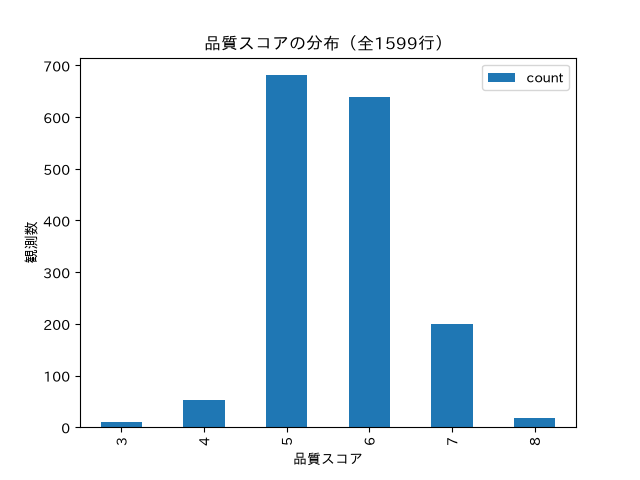

*全1,599行の品質スコア分布。品質5・6に観測が集中し、端の品質3・8は少数である。Notebookの保存済みPNG出力から抽出。*

**初回結果**: `CELL: 03` では、品質とアルコールに正、揮発性酸度に負、硫酸塩に正の主要な関連が見られました。全行と重複除去版の結果を混同しないよう、次の表ではそれぞれの点推定を分けています。

| 化学特性 | 全行Spearman ρ | 全行Pearson r | 重複除去版Spearman ρ［95% bootstrap CI］ | 全11特性調整OLS係数／1 SD［95%クラスタCI］ |
|---|---:|---:|---|---|
| alcohol（アルコール） | 0.4785 | 0.4762 | 0.4880［0.4438, 0.5296］ | 0.2942［0.2269, 0.3616］ |
| volatile acidity（揮発性酸度） | −0.3806 | −0.3906 | −0.3874［−0.4333, −0.3396］ | −0.1940［−0.2451, −0.1428］ |
| sulphates（硫酸塩） | 0.3771 | 0.2514 | 0.3806［0.3344, 0.4255］ | 0.1553［0.1075, 0.2031］ |

bootstrapは重複除去版からseed `200908` で1,200回の再標本化を行ったpercentile区間です。OLSは全行で各特性を標準化し、品質スコアの間隔を等しいと近似した関連モデルです。R²は0.3606でしたが、これは標本内の適合度であり、未知のワインへの予測性能ではありません。

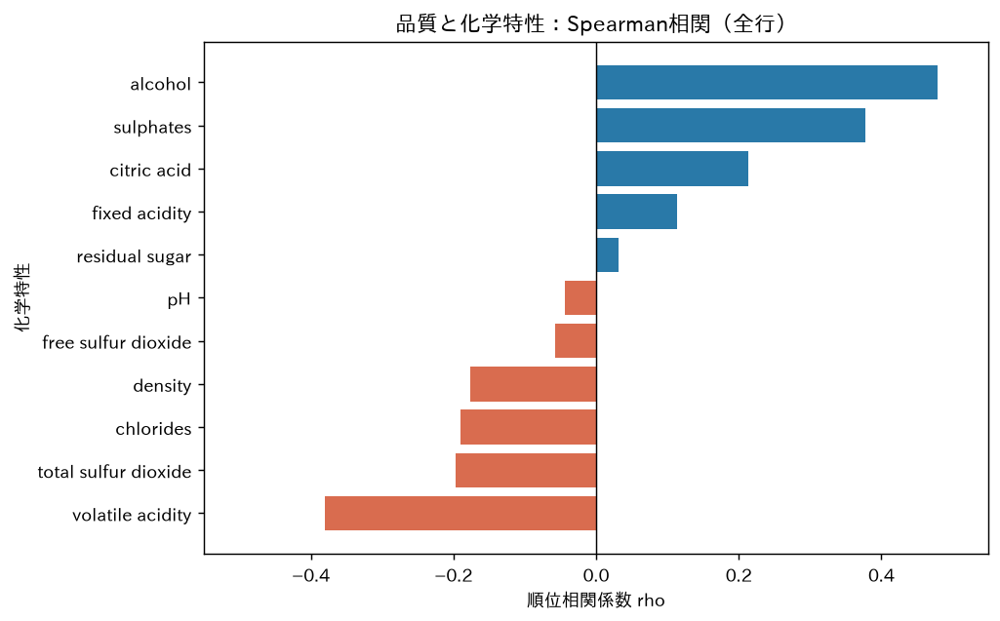

*全行のSpearman相関。アルコール・硫酸塩は正、揮発性酸度は負の関連が大きい。棒の長さは関連の強さであり、介入の効果量ではない。*

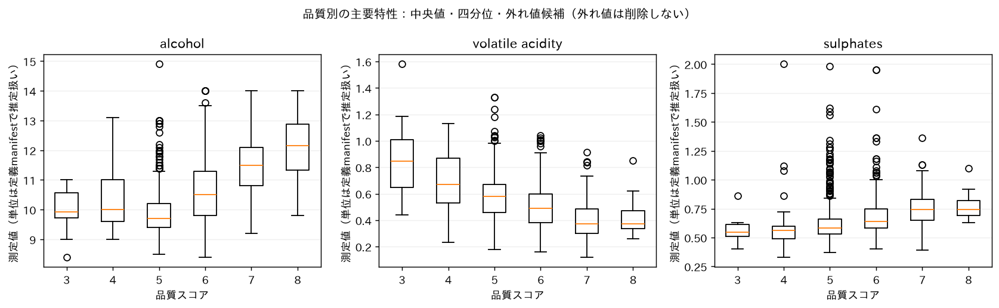

*品質別の主要3特性の箱ひげ図。箱は四分位範囲、線は中央値、丸は外れ値候補で、主解析では削除していない。測定単位は未検証であり、少数の品質端群の比較には注意が必要。*

pH（ρ=−0.0437、BH q=0.0889）と残糖（ρ=0.0320、q=0.2002）には、主解析で明確な単調関連の証拠が乏しい結果でした。これは効果の不存在や非線形関係の不存在を証明しません。クエン酸は単変量では正の順位相関（ρ=0.2135）でしたが、全特性調整後のOLS区間は0を含み、独立した正の関連とは断定していません。

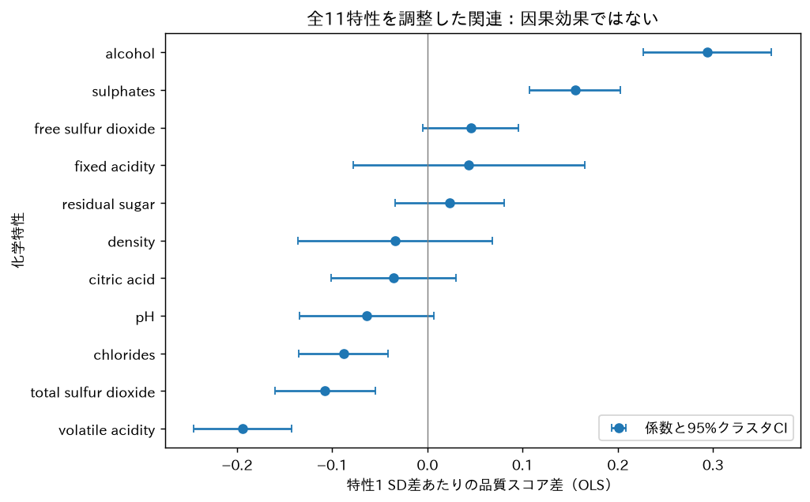

*全11特性の調整済みOLS係数と95%クラスタ信頼区間。横軸は特性1 SD差あたりの品質スコア差であり、因果効果ではない。化学特性群間の独立性は未検証。*

**AIが生成した追加依頼1 — 重複・極端値・相関定義への感度**

> 完全重複240行と極端な化学特性値が主要な関連を作っていないか確認してください。全行／完全重複除去、無処理／各特性の上下1%ウィンザー化、Spearman／Pearsonの組合せでアルコール・揮発性酸度・硫酸塩の関連の方向と大きさを比較し、安定性と限界を報告してください。

**選定理由**: 完全重複240行と、硫酸塩のPearson r=0.2514／Spearman ρ=0.3771の差が、初回結果の解釈と不確実性に影響すると判断しました。

**結果**: `CELL: 05` で2×2×2の8仕様を3特性に適用し、計24個の関連係数を比較しました。

| 特性 | 8仕様の関連係数範囲 | `stable`（許容差20%） | `max_relative_deviation` |
|---|---|---|---:|
| alcohol | 0.4762〜0.4880 | `True` | 0.0198（1.98%） |
| volatile acidity | −0.3952〜−0.3806 | `True` | 0.0383（3.83%） |
| sulphates | 0.2488〜0.3806 | `False` | 0.3401（34.01%） |

3特性とも方向は維持されましたが、硫酸塩の**大きさ**は安定とは判定されませんでした。20%は分析者が設定した安定性の基準であり、有意性の閾値ではありません。また、PearsonとSpearmanは異なる関連量です。ウィンザー化は上下1%を削除する処理ではなく、端の値を分位点に置き換える処理です。試料IDがないため、重複除去を「独立標本の確定」とは解釈していません。

**AIが生成した追加依頼2 — 順序尺度と多重共線性**

> 品質が順序尺度であることと、酸度・密度などの多重共線性が初回OLSの結論に影響しないか確認してください。完全重複除去データで全11特性の順序ロジットを推定し、密度・固定酸度を除いたOLSとも比較してください。比例オッズの仮定について品質>5と品質>6の二値ロジット係数を診断し、同一の量的効果と断定できるか検討してください。

**選定理由**: 品質スコアの等間隔近似と、固定酸度のVIF=7.7675、密度のVIF=6.3438が、調整済み関連の解釈に影響すると判断しました。

**結果**: `CELL: 06` の重複除去版1,359行による全11特性の順序ロジットは収束しました。高品質側の累積オッズ比／1 SDは、アルコール2.4884［95% CI 2.0503〜3.0200］、揮発性酸度0.5396［0.4650〜0.6262］、硫酸塩1.6253［1.4207〜1.8593］でした。標準化は全行のSDを共通基準としています。

全行OLS、重複除去OLS、密度・固定酸度を除いたOLS、順序ロジットで主要3特性の方向は一致しました。アルコールのOLS係数は順に0.2942、0.3084、0.3168でした。ただし、点数差とlog oddsは単位が異なるため、モデル間で量的効果が同一とは判断していません。

品質>5と品質>6の探索的な二値ロジット診断では、アルコールのlog odds／1 SDは0.9624と0.8093、揮発性酸度は−0.5778と−0.5575、硫酸塩は0.4430と0.6469でした。方向は一致する一方、強度は異なります。比例オッズ仮定を正式に検定・保証した結果ではなく、未測定交絡も残ります。

**AIが生成した追加依頼3 — 中心品質帯と硫酸塩の形状**

> 品質5・6に標本が集中しているため、主要な関連が少数の品質3・8や高品質7だけに依存しないか確認してください。完全重複除去後の品質5・6だけで全11特性を調整した二値ロジットと順位相関を求めてください。また、硫酸塩の関連強度が相関定義に敏感だったので、分位ビン別の品質平均と不確実性、および外れ値に頑健な回帰で形状と方向を確認し、全範囲で一定の増加と説明してよいか判断してください。

**選定理由**: 品質5・6に82.49%が集中し、硫酸塩は感度判定で `stable=False`、閾値別の関連強度も異なりました。少数の端群に依存する関連か、全範囲で一定の増加と説明できるかを分けて確認しました。

**結果**: `CELL: 07` の品質5・6だけの重複除去標本は1,112行でした。6対5の調整済みオッズ比は、アルコール2.2846［95% CI 1.7639〜2.9590］、揮発性酸度0.6362［0.5164〜0.7838］、硫酸塩1.4759［1.2358〜1.7625］でした。順位相関も順に0.3989、−0.2463、0.2580で、主要方向は維持されました。Huber回帰でも主要3特性の方向は一致しています。

硫酸塩の重複除去版を10分位ビンで比較すると、上から2番目のビンの平均品質は6.1481（n=135、95% bootstrap CI 6.0148〜6.2667）、最大ビンでは5.8473（n=131、5.7021〜6.0000）でした。したがって、「全域で硫酸塩を増やすほど品質が高い」「一定の傾き」とは説明しません。これは未調整の探索的比較で、スコア等間隔近似と1,000回のbootstrapを使っています。最適濃度や高濃度による品質悪化の因果効果を特定したものではありません。

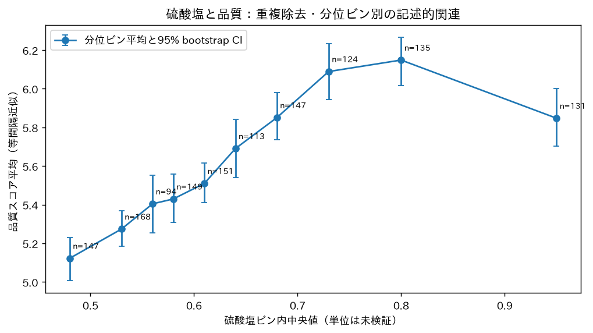

*完全重複除去後の硫酸塩ビン中央値と品質平均、95% bootstrap区間、各ビンの標本数。最大ビンで平均が低下しており、単純な全域増加の説明を避ける根拠となる。単位は未検証、他特性による交絡は未調整。*

品質5・6に限定する検証は分析対象を変更するため、選択バイアスの可能性があります。分位ビンや頑健回帰も外部検証にはなりません。

**最終結論**: 本標本では、品質とアルコールの正、揮発性酸度の負、硫酸塩の正の関連方向が、重複処理、極端値処理、モデル変更、中心品質帯、頑健回帰でも維持されました。ただし、硫酸塩の関連の大きさは仕様依存で、全域で一定の増加とは説明できません。pH・残糖の単調関連の証拠は乏しく、クエン酸の単変量関連を独立した正の関連とは断定していません。

反復は3回の上限で停止しました。残る試料ID、交絡、母集団代表性、測定定義の不確実性は、同じデータの追加解析だけでは解消できないと判断しています。`status.json` の `analysis_complete=true`、`final_completion.ready=true` と、Notebookの実行済み分析・3回の反復・根拠付きInsightから**分析完了**と判断します。ただし、全11コードセルの実行出力が完全に保存されたという判定とは区別します。

**監査・再現性**: `CELL: 09` の保存出力とmetadataには、既存基準に対する `numeric_outputs_identical_to_baseline=true`、取得ファイルのハッシュ一致、集約した指標のSHA-256 `7ecfc145bc2ddbe71381a6fea4f5b88da346c64855e2edc2cd230cc2afed158b` が記録されています。比較対象は取得日時を除いた `evidence_values` の集約値であり、全表示表・全モデル係数・PNGバイト列の一致を網羅的に検証したものではありません。metadataは「新規カーネルで上から順次MCP再実行」と記録し、初回ログにもファイルと固定seedの数値出力の一致が報告されています。

保存された実行環境はPython 3.12.3、pandas 3.0.6、NumPy 2.5.3、SciPy 1.18.1、statsmodels 0.15.0です。再実行には同じ依存環境、Kaggle認証、API接続、取得ファイル内容が必要です。本節作成時に分析の再実行やデータの再取得は行わず、指定の保存証拠だけを読んでいます。

| 確認対象 | 保存証拠から確認できる状態 |
|---|---|
| Notebook形式 | `nbformat_valid=true` |
| コードセル | 11セル中10セルに実行番号と出力あり。`CELL: 00`〜`CELL: 09` は実行番号1〜10 |
| 最終監査セル | `CELL: 10`（Notebookの0始まりcell index 33）は `execution_count=null`、出力なし |
| 未実行・エラー所見 | 監査の未実行・エラー一覧は空。ただし、末尾の監査セルを除外した結果 |
| 監査警告 | 「末尾の `audit_notebook` 呼び出しセルがまだ実行を完了しておらず、未実行所見から除外した」という警告1件 |
| 図表 | 画像を持つコードセルは2セル、PNGは5枚。`visual_audit=true`、`visual_findings=[]` |
| Insight | 根拠manifest付き9セル。根拠は `CELL: 09` の実行番号10の `display_data(text/plain)` |
| ライフサイクル | metadataに `state=completed`、実行中セル数・保留書き込み数・保持ロック数はいずれも0 |
| ランナーの完了判定 | `final_completion.ready=true`、列挙された8条件はすべて `true` |

Notebook metadataの `notebook_audit.ok=true` は、最終監査セルの除外を含む構造的合格です。「全セル11/11実行済み」「警告なし」「最終監査セルの完走出力も保存済み」とは書けません。Insightやライフサイクルのmetadataは存在しますが、最終セルそのものの実行出力を独立に追跡する証拠は不足しています。

`initial.log` と `followup.log` は、いずれも「Notebookが安定し監査を通過したため、runnerがprocess groupを停止した」と記録しています。`status.json` の初回・追加確認の終了コードは0、終了理由はいずれも `artifact_complete_cutoff` です。これは成果物を見た外部ランナーの打ち切りであり、CLIが自然終了して全最終出力を返した証拠ではありません。追加確認の前後でNotebookのサイズ589,339バイトとmtimeは同一で、追加確認ログには新しい分析結果がありません。Notebookに記録された3回の反復を、追加確認ログの別の3回と数えたり、新しい分析が成功したと推定したりはしません。

**失敗・連携上の制約とJupytermind改善候補**: 分析計算の未解決エラーは保存監査に記録されていません。一方、根拠保存・可視化監査の境界では、`CELL: 08` に次の2件の改善候補が記録されています。いずれも候補であり、ライブラリ本体を修正した実験ではありません。

| 分類 | 再現条件と実際の挙動 | 影響・今回の回避 |
|---|---|---|
| Insight根拠の出力形式に関する機能不足 | 隔離Notebookに実行番号1と `stdout stream: probe_rho=0.5` を持つテストセルを構築し、`record_insight` に引用値 `"0.5"` を渡すと `EvidenceMissingError`。セル内容・出力は再現用fixtureとして構築されており、このprobe自体を実分析の実行証拠とは扱わない | print形式の根拠が認識されない。実分析では `CELL: 09` に値を `display_data(text/plain)` として出力し、その実在出力から根拠を抽出して回避 |
| 可視化監査のメタデータ欠落検出に関する機能不足 | `render_chart` で得たPNGを `build_image_output` で出力化し、セルの `metadata={}` のまま `audit_visual_outputs` に渡すと所見が空。タイトル・軸・凡例・グリフ情報自体の欠落が警告されない | 可視化監査の検査範囲を過大評価する恐れ。実分析では画像出力・セルに明示的なchart metadataを保存し、描画時のグリフ警告も確認 |

これらはカーネル内のJupytermind APIを直接呼ぶ隔離検証で、データの取得やCLI・外部ランナーの終了操作を必要としません。したがって、Kaggle API、Copilot CLI、外部ランナー固有の問題とは分けます。分類、再現手順、期待・実際の挙動、影響、証拠、受け入れ条件は同じ実行ディレクトリの `issue-candidate.json` に保存しています。

これとは別に、初回ログは「最終セルが実行中に同じNotebookを書き換えると、MCP経由の実行出力が保存されない連携上の現象」を報告し、Insight保存と監査の分離を予定しています。しかし、提供された最終Notebookの `CELL: 10` には依然として `enqueue_write` と `record_insight` による自己書き込みがあり、その実行番号・出力は保存されていません。回避策が最終保存物で完了したとは確認できません。MCPとNotebook保存の連携条件に関する制約であり、この証拠だけでJupytermind、MCP、CLI、ランナーのどれか単独に原因を帰属させず、上記2件とは別に扱います。

Notebookの改善候補説明には、初期の指定ディレクトリ不存在によるMCP接続失敗も記録されています。ただし提供ログにはそのエラー詳細がなく、確認できるのはNotebookの説明に限られます。ディレクトリ作成前のホスト接続操作の問題として記録されており、Jupytermind改善候補には含めません。Kaggle API認証・取得の失敗は保存証拠に記録されていません。

**残る限界**: 完全重複の原因、試料・生産者・収穫年・評価者の識別情報、標本抽出方法は不明です。前提検査は最終的にも `iid-between-profiles` の未検証を警告しています。重複群のクラスタ標準誤差や重複除去でも、異なる化学特性群間の独立性は保証できず、CI・p値は探索的で仮定に依存します。

順序モデルによる確認はOLSの等間隔近似への感度を調べるものであり、比例オッズ仮定や量的解釈を全面的に保証しません。中心品質帯への限定、ビン分割、モデル選択も探索的で、未測定交絡・選択バイアスが残ります。第二の独立データセットがないため、データセット間比較や参照データによる異常検証は適用されていません。化学特性を操作すれば品質が変わるという処方や、赤ワイン全体への一般化はできません。

**証拠と保存先**: 実験結果の証拠は、指定Notebook、`initial-prompt.md`、`initial.log`、`followup.log`、`status.json` の実ファイルに限定しました。既存の `white-paper2.md` は書式・詳細度の参照にのみ用い、旧実験の数値や完了状態は転用していません。Notebookは `benchmark/projects/kaggle-v020-kaggle-exp-08-red-wine/notebooks/kaggle-v020-kaggle-exp-08-red-wine.ipynb`、本節は `benchmark/runs/08-kaggle-exp-08-red-wine/report-section.md` に保存しています。図は全5枚をNotebookからそのまま抽出し、`benchmark/figures/exp-08-*.png` に保存しました。`figures/...` はbenchmark直下の本文へ組み込むための相対参照です。

## 実験09: Pima Indians Diabetes（分析完了）

**課題**: 「KaggleのPima Indians Diabetesデータを分析し、糖尿病アウトカムと関連する特徴を調べてください。」

**初回プロンプト（全文・原文）**:

> KaggleのPima Indians Diabetesデータを分析し、糖尿病アウトカムと関連する特徴を調べてください。欠損や不自然な値の扱いは自分で判断して明記し、比較に適した図表を選んで、相関を因果と誤認しない日本語の結論を示してください。AI Data Scientist SkillとJupyter MCPで計画、実行コード、出力、根拠付きInsightを保存し、ノートブックの再実行も確認してください。 Kaggle参照先: https://www.kaggle.com/datasets/uciml/pima-indians-diabetes-database。インストール済みkaggle Python SDKを使い、NotebookのJupyter MCP実行セル内で`KaggleApi().authenticate()`、`dataset_list(search=...)`、`dataset_list_files(...)`、必要に応じて`dataset_download_file(...)`を呼び出し、Kaggle上の対応する公開データを検索・取得してください。owner/dataset slug、取得ファイル名、取得日、ファイルSHA-256をNotebookに記録してください。APIトークンをセル出力・Notebook・ログへ表示しないでください。分析・API取得コードの実行はJupyter MCPだけを使い、端末コマンド、subprocess、外部スクリプト起動、作業エージェントへの委譲は行わないでください。Kaggle APIで対応データを検索・取得できなかった場合に限り、`/home/nahisaho/kaggle/experiments/white-paper.md`に記載された旧実験の公開CSV `https://raw.githubusercontent.com/plotly/datasets/master/diabetes.csv` を取得して実験を継続してください。その場合はKaggle APIの失敗内容、フォールバックした理由、CSV URL、取得日時、SHA-256をNotebookに記録し、公開CSVとKaggle掲載版の完全な同一性は保証されないことを明記してください。保存先は benchmark/projects/kaggle-v020-kaggle-exp-09-diabetes/notebooks/kaggle-v020-kaggle-exp-09-diabetes.ipynb としてください。run_idは `v020-exp-09` です。長時間処理の開始前にlifecycle.register_runを呼び、実行・書込みフェーズを記録し、終了時にcompletedまたはfailedを記録してください。データ定義manifest、分析前提manifest、意味的な異常検査、妥当な範囲の感度分析を使い、適用できない機能は理由を記録してください。図表はvisual_audit=Trueで監査してください。Notebookには「使用したJupytermindモジュール」節を設け、直接import・呼び出したモジュール名、関数名、使用目的を記録してください。間接利用は使用済みに含めないでください。Jupytermindの不具合または機能不足が疑われた場合は「Jupytermind改善候補」節を設け、分類、再現条件、期待する挙動、実際の挙動、影響、回避策、関係するセルとログを記録してください。Copilot CLI、Kaggle API、ベンチマークランナーに固有の問題とは切り分け、候補がなければ「なし」と記録してください。初回分析後、自分で結果を読み直し、結論に実質的な影響を与える未解決点があれば自然言語の追加依頼文を作成し、Notebookの「反復依頼履歴」に原文のまま記録して実行してください。価値ある追加分析がなくなるまで最大3回繰り返し、各反復の選定理由・結果・証拠・残る限界を報告してください。最後に全コードセルを上から再実行し、notebook_auditとライフサイクル状態を記録してください。

**使用したJupytermindモジュール**: 以下は、指定Notebookのコードセルで直接importされ、呼出しコードと対応する実行出力を確認できるAPIです。モジュール名はすべて `ai_data_scientist` 配下です。

| モジュール | 直接呼び出した関数・クラス・メソッド | 使用目的 |
|---|---|---|
| `project_manager` | `resolve_project`, `ensure_notebook`, `ensure_data_dir`, `enqueue_write` | 保存先とデータ配置先の解決・作成、最終監査前の根拠参照の直列書込み |
| `language_router` | `detect_language` | 日本語の出力言語判定 |
| `lifecycle` | `register_run`, `is_cancel_requested`, `mark_execution_start`, `mark_execution_end`, `mark_write_start`, `mark_write_end`, `mark_completed`, `get_run_status` | 実行登録、キャンセル確認、実行・書込みフェーズ、終了状態の記録 |
| `ingestion` | `SourceSpec`, `ingest` | CSV読込みと行数上限・切詰め有無の確認 |
| `cleaning` | `clean_dataset` | 重複除去と処理前後の行数確認 |
| `eda` | `explore` | 記述統計、型、非欠損件数、欠損率の確認 |
| `stats_analysis` | `correlation` | 各特徴と二値OutcomeのPearson相関（点双列相関）・p値・日本語解釈 |
| `visualization` | `render_chart`, `build_image_output` | Outcome別件数の棒グラフ、PNGのNotebook出力化 |
| `data_definition` | `build_manifest`, `DataDefinitionManifest.unresolved_fields` | 出典・変数定義・単位・不明項目の記録 |
| `analysis_assumptions` | `Assumption`, `AnalysisAssumptionManifest`, `check_manifest` | 分析スコープと前提の記録、結論に重要な未検証前提の警告 |
| `data_quality` | `detect_anomalies` | 範囲・許容カテゴリ・欠損に関する意味的な異常検査 |
| `sensitivity` | `SensitivityPlan`, `run_sensitivity` | 欠損処理・極端値処理、年齢の関数形・対象範囲による係数の安定性確認 |
| `notebook_audit` | `audit_notebook(visual_audit=True)` | 実行状態、エラー、根拠参照、図表の監査 |

Notebookのモジュール利用記録には、制御Notebookからの `insight_engine.extract_cited_value`・`record_insight` 利用も記載されています。ただし、指定Notebookでは `insight_engine` のimportだけで、これらの呼出しコードは確認できないため、上表の直接使用には含めません。同様に `data_definition.FieldValue` は利用記録にはありますが、指定コードセルでの呼出しは確認できません。`lifecycle.mark_failed` は例外ハンドラに定義されているだけで、正常終了経路の実利用には含めません。ブートストラップ、GLM、スプライン、VIF、Wilson区間はNumPy・SciPy・statsmodels・patsyによる処理で、Jupytermindの提供機能とは区別します。

**初回指示と今回の実行範囲**: 欠損・不自然な値の判断、比較方法と図表の選定、因果と相関の区別をAIに委ねました。一方、取得経路、出典・ハッシュ、manifest、感度分析、最大3回の反復、全セル再実行と監査は必須条件です。`initial.log` は「指定先には既存の分析ノートブックがあり、3回の追加分析まで記録されています」と報告しています。したがって、以下の初回結果・追加依頼は、指定Notebookに保持された分析履歴と今回の再実行出力として報告します。今回の初回CLIセッションで3依頼を新たに生成したとは扱いません。

**データ取得**: Notebookの `acquisition` セルはKaggle SDKで認証・検索・ファイル一覧取得・ダウンロードを実行しています。指定slug `uciml/pima-indians-diabetes-database` の `dataset_list_files` はHTTP 403、次の候補 `ahmedgamelwaly/pima-indians-diabetes` は対象の `diabetes.csv` が一覧に存在しないため `FileNotFoundError` でした。その後、実際の検索結果にある `harsh146/pima-indians-diabetes` から取得できています。

| 項目 | 最終採用データの記録 |
|---|---|
| 取得元 | `https://www.kaggle.com/datasets/harsh146/pima-indians-diabetes` |
| ファイル | `diabetes.csv` |
| 取得日時（UTC） | `2026-10-01T20:14:59.960109+00:00` |
| SHA-256 | `698c203a14aa31941d2251175330c9199f3ccdb31597abbba2a3e35416257a72` |
| データ形状 | 768行・9列 |
| Outcome | 0が500件、1が268件（34.9%） |

今回の取得出力は `source_kind="kaggle"`、`kaggle_failure=null`、`fallback_reason=null` で、最終分析はKaggleから新規取得したファイルを使用しています。認証情報は出力せず、API例外も型・段階・HTTP状態だけを記録しています。指定uciml版は取得できておらず、最終採用版との完全な同一性は未検証です。

これとは別に、Notebookの「初期取得履歴」には、以前の検索不足による `LookupError` と、その後の指定slug照会時の `HTTPError` を受け、Plotly公開CSVへ一時フォールバックした記録があります。URLは `https://raw.githubusercontent.com/plotly/datasets/master/diabetes.csv`、取得日時は `2026-10-01T18:32:53.214381+00:00` と `2026-10-01T18:33:15.873031+00:00`、ファイルは `diabetes.csv`、SHA-256はいずれも上記と同じです。この過去の取得はNotebook内の履歴記述を証拠とし、今回のログに実行詳細があるとは扱いません。同じハッシュは保存バイト列の一致を示すだけで、取得できなかったuciml版との同一性の証明ではありません。

**前処理・前提確認**: 元データの通常のNAと完全重複はともに0件でした。Glucose・BloodPressure・SkinThickness・Insulin・BMIのゼロは生理的に不自然な欠測符号と判断してNaNに変換し、妊娠回数とOutcomeのゼロは保持しました。変換件数はそれぞれ5・35・227・374・11件です。特にInsulinは48.7%、SkinThicknessは29.6%が欠損となり、列ごとの観測標本が大きく異なります。正の高値は誤入力と断定せず主解析に保持し、1・99パーセンタイルへのWinsor化は感度分析に限定しました。

データ定義manifestは取得URL・ハッシュ・行数を確認済みとし、母集団、変数定義・単位は推定、ライセンス・抽出方法・診断基準・測定時点は不明としています。分析前提manifestでは、ゼロを欠損とする判断、行の独立性、Outcomeの意味について、結論に重要な未検証前提の警告が3件残っています。意味的検査の範囲は診断閾値ではなく、ゼロなどのコード異常を検出する便宜的な範囲です。

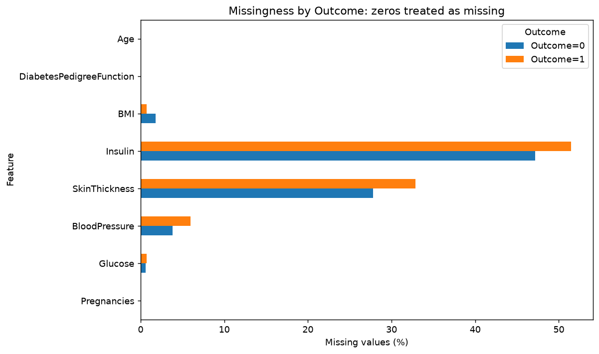

*ゼロを欠損へ変換した後のOutcome別欠損率。InsulinとSkinThicknessでは欠損が多く、観測値だけの比較を全標本へそのまま一般化できません。*

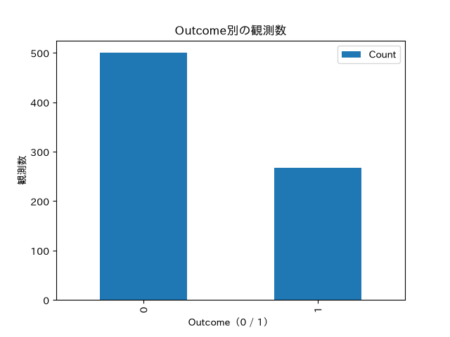

*Outcome=0は500件、Outcome=1は268件。陽性割合はこの標本の構成であり、一般集団の有病率を示すものではありません。*

**初回結果**: AIは観測値による群別分布、標準化平均差Hedges g、群別2,000回ブートストラップの95%区間、点双列相関と8特徴のBH補正を比較しました。Glucoseの中央値はOutcome=0で107、1で140、Hedges gは1.191625（95%区間1.018159–1.366606）、点双列相関は0.494650でした。BMIの中央値は30.1対34.3、Hedges gは0.690379、相関は0.313680です。Glucoseは比較した8特徴で最も明瞭な単変量関連を示しましたが、列ごとに観測数が異なるため順位は探索的です。

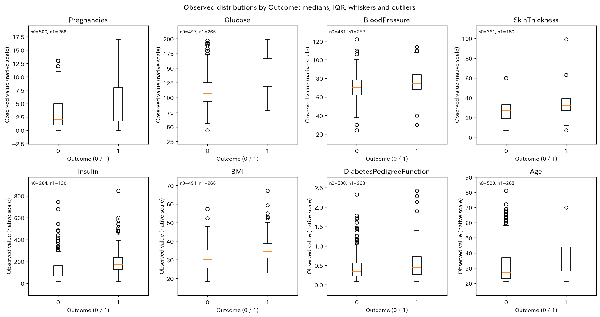

*各特徴の箱ひげ図と群別観測数。欠損は補完せずに比較し、正の極端値も表示しています。測定単位は未検証のため、図では元の数値尺度を使っています。*

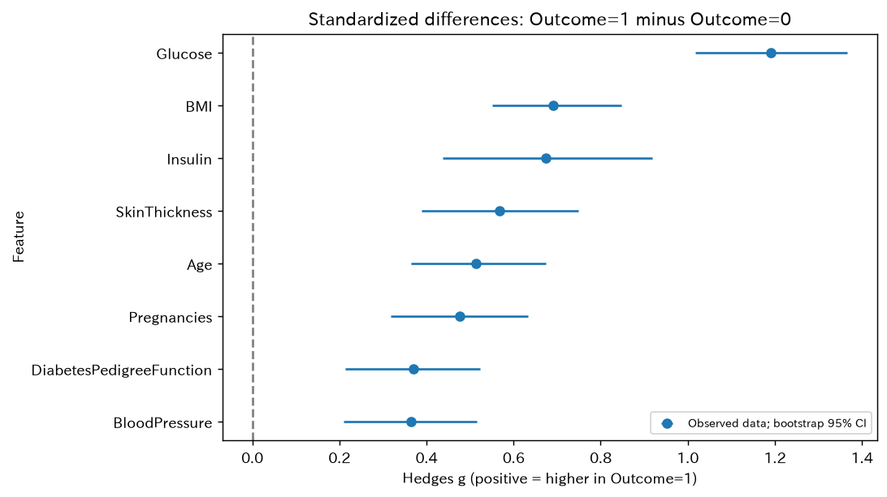

*Outcome=1から0を引いたHedges gと群別ブートストラップ95%区間。Glucoseの差が最も大きく、差の方向・不確実性を共通尺度で比較できます。*

調整分析は8特徴と5列の欠損指示変数を用いたロジスティック回帰です。主解析ではOutcomeを参照しない全体中央値補完を行い、観測値の標準偏差を共通の標準化基準にしました。

| 特徴 | 主解析の調整OR／観測値1SD | 95%信頼区間 |
|---|---:|---:|
| Glucose | 3.174604 | 2.506819–4.020279 |
| BMI | 1.943998 | 1.520736–2.485064 |
| DiabetesPedigreeFunction（家族歴指標と推定） | 1.382029 | 1.133036–1.685740 |
| Pregnancies | 1.520750 | 1.226827–1.885091 |
| Age | 1.153578 | 0.924243–1.439819 |

中央値補完／完全例と、高値保持／Winsor化を組み合わせた4仕様では、GlucoseのORは3.154560–3.217435、係数の最大相対変動は0.011601で `stable=True` でした。一方、BMIは係数が26.5%、家族歴指標は28.3%変動して `stable=False` です。正の方向が一貫することと、関連の大きさが安定していることを区別しました。`stable` の基準は係数の相対変動20%以内であり、OR自体の変動率や因果妥当性を意味しません。

**AIが生成した追加依頼1 — 完全例選択と共線性**

> 欠損処理によってBMIや年齢の調整関連が変わっています。完全例として残る人と除外される人のOutcome比率・主要特徴を比較し、欠損の少ない5特徴だけのモデルと全8特徴モデルを比べて、選択バイアスと共線性が結論を左右するか確認してください。

**選定理由**: BMIの係数が完全例処理で約26.5%変動し、年齢はさらに変動しました。全8特徴の完全例は392件と約半数になるため、標本選択とモデル調整の影響を分離する必要があると判断しています。

**結果・証拠**: `iteration-1` セルの出力では、完全例392件のOutcome=1割合は33.2%、除外376件は36.7%、年齢中央値は27対32でした。Fisher検定はp=0.325164ですが、非有意は欠損が無作為である証明ではありません。VIF最大は1.616142で、極端な共線性は確認されませんでした。欠損の少ない5特徴（Glucose・BMI・Age・Pregnancies・家族歴指標）のモデルでは、中央値補完768件／完全例752件でGlucoseのORは3.002663／2.996616、BMIは1.860849／1.833338と近い値でした。欠損の多い特徴をすべて含めた完全例解析の標本選択には注意が必要で、欠損機序と個人ID不在による独立性は未解決です。

**AIが生成した追加依頼2 — 非線形性と分布の歪み**

> 年齢は単変量では正の関連がある一方、調整後は不確実です。年齢とGlucoseの非線形性、およびInsulinなどの右裾の長い分布を考慮したモデルで主要な関連を再確認し、単変量の関連と調整後の関連を混同しない結論に更新してください。

**選定理由**: 反復1では極端な共線性は確認されなかった一方、完全例の年齢構成と調整後の直線係数には問題が残りました。年齢とOutcomeの関連形状、右裾の長い分布が解釈を左右する可能性を調べるための依頼です。

**結果・証拠**: `iteration-2` セルでは、年齢スプライン追加の探索的尤度比検定がLR=24.113894、追加自由度3、p≈2.36×10⁻⁵で、直線モデルより適合が改善しました。Glucose単独のスプライン追加はp=0.325376でした。年齢を非線形に扱うと妊娠回数のORは1.189143（95% CI 0.938686–1.506426）となり、「独立した正の関連がある」という単純な断定を取り下げています。

同じ年齢スプラインモデルでGlucoseのORは3.236985、BMIは1.850463、家族歴指標は1.367428で、95%区間はいずれも1を上回りました。Insulinと家族歴指標を `log1p` 変換したモデルでもGlucoseは3.048077、BMIは1.914501で正の関連が残りました。ただし、変換した特徴のORは変換後の1SDあたりで、元尺度のORと同一には扱いません。非線形モデルのAge・Glucoseも単一ORでは要約しません。事後的なモデル探索、単一補完、曲線の点ごとの信頼区間という限界が残ります。

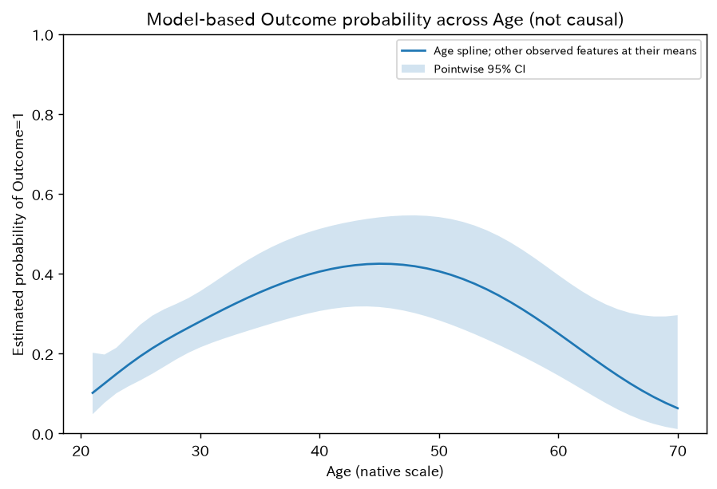

*他の観測特徴を平均値、欠損指示変数を0に固定した年齢21〜70のモデル曲線と点ごとの95%区間。年齢を変える介入効果ではなく、高齢端の下降を予防効果と解釈できません。*

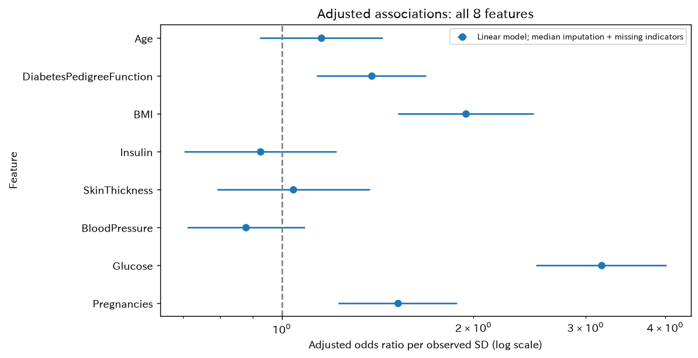

*中央値補完と欠損指示変数を用いた直線モデルの調整ORと95%区間。反復2のセルに出力されていますが、年齢スプラインモデルの係数図ではありません。妊娠回数の解釈は追加分析で更新されました。*

**AIが生成した追加依頼3 — 高齢端の標本数と年齢モデル感度**

> 年齢を非線形に扱うと妊娠回数の調整関連が弱まり、年齢曲線の高齢端では下降が見られます。年齢帯ごとの標本数とOutcome割合を確認し、スプライン自由度3〜5および60歳以下に限定した感度分析で、Glucose・BMI・家族歴指標・妊娠回数の結論が安定するか調べてください。高齢で糖尿病が予防されると解釈しないでください。

**選定理由**: 年齢スプラインで妊娠回数のORが約1.52から1.19へ弱まり、年齢曲線の高齢端にも下降が見られました。少数標本の形状を一般化しないよう、年齢帯ごとの観測数と関数形・対象範囲の感度を確認する最後の反復です。

**結果・証拠**: `iteration-3` セルの年齢帯別出力は次のとおりです。

| 年齢帯 | 件数 | Outcome=1件数 | Outcome=1割合 | Wilson 95%区間 |
|---|---:|---:|---:|---:|
| 21–29 | 396 | 84 | 21.2% | 17.5–25.5% |
| 30–39 | 165 | 76 | 46.1% | 38.6–53.7% |
| 40–49 | 118 | 65 | 55.1% | 46.1–63.8% |
| 50–59 | 57 | 34 | 59.6% | 46.7–71.4% |
| 60歳以上 | 32 | 9 | 28.1% | 15.6–45.4% |

60歳以上は32件と少なく、下降の機序は識別できません。全範囲768件／60歳以下741件と、スプライン自由度3・4・5の6仕様では、GlucoseのORは3.235987–3.339084、BMIは1.804528–1.860097、家族歴指標は1.342535–1.367428で、この比較ではすべて `stable=True` でした。妊娠回数は1.184657–1.240881で、各区間が1を含み、係数の最大相対変動0.245848から `stable=False` です。「60歳以上」の集計と「60歳以下」の感度分析は60歳を両方に含むため、互いに補集合ではありません。

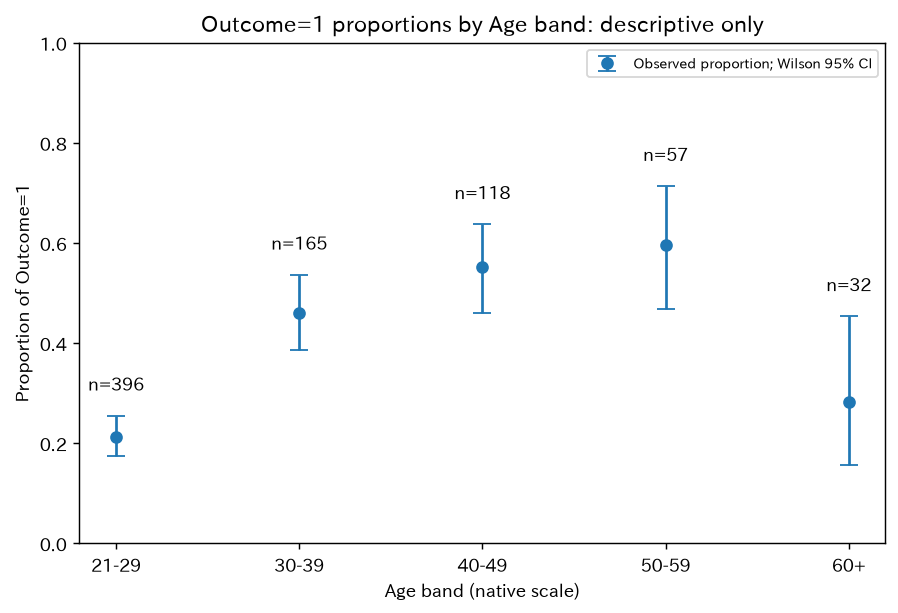

*年齢帯別の観測割合とWilson 95%区間。高齢帯の少数標本と広い不確実性を示し、年齢曲線の高齢端を過大解釈しないための図です。*

**反復停止と追加確認ログ**: Notebookでは3回の上限に達したことに加え、主要な関連の方向とモデル依存の結論を分けられたため停止しています。診断定義・欠損機序・外的妥当性・未測定交絡は、同じCSVのモデル探索を増やしても解決できないと判断しました。今回の `followup.log` には既存セルの確認方針と、Notebookが安定し監査に合格したためランナーが停止した記録だけがあり、新しい追加依頼や追加分析結果は確認できません。既存3回の履歴とは区別し、4回目の依頼が行われたとは報告しません。

**最終結論**: この標本ではGlucoseが最も明瞭な正の関連を示し、BMIと家族歴指標にも調整・年齢形状の検討後に正の関連が残りました。ただし、BMIと家族歴指標の関連の大きさは欠損処理に依存します。妊娠回数の独立した関連の断定は年齢の非線形性を考慮すると維持できず、年齢の単変量関連も単調な独立効果とは解釈できません。Insulin・皮下厚・血圧は調整後の区間が1を含むため、「関連がない」とも「独立した危険因子」とも断定しません。**観察的・条件付き関連を示した分析であり、原因、将来発症、介入効果を示すものではありません。**

**監査・再現性**: Notebookの「再実行・引渡し監査記録」とmetadataには、新しいカーネルで全11コードセルを上からJupyter MCPで再実行し、取得SHA-256と主要数値が一致したことが記録されています。`final-summary` の出力では件数・陽性件数、Glucose/BMIの相関・係数、年齢スプラインの対数尤度などを照合し、一致を確認しています。群別ブートストラップのseedは `20261002` です。

最終セル実行中の自己監査は、監査セルがまだ終了していない旨の警告を1件出していますが、最終の保存済みNotebook監査は11コードセル中11実行済み、未実行・エラー・構造的指摘・`visual_findings` がすべて空です。7図、根拠manifest付きInsight 7件があり、`audit_ok=True` です。`v020-exp-09` は `completed`、実行中セル・保留書込み・ロックはすべて0、引渡し検証日時は `2026-10-01T20:17:15.689748+00:00` でした。

`status.json` の `analysis_complete=true` と `final_completion.ready=true` もNotebook内容と整合します。初回CLIは終了コード0・443.7秒で通常終了、追加確認は終了コード0・95.6秒ですが、終了理由は `artifact_complete_cutoff` であり、自然終了したとは扱いません。分析完了の判断はこれらの分析記録によるもので、文書化前の状態を表す `documentation_complete`・最上位の `semantic_complete`・`report_exit_code` は用いていません。ここでの再現性は保存済み実行出力・照合・監査記録の確認であり、本節の作成時に分析を新たに再実行したものではありません。

**失敗内容とJupytermind改善候補**: データ取得では指定uciml版の403と別候補の対象ファイル不在がありましたが、検索で得た別のKaggle公開版から取得して分析を完了しています。最終Notebookに実行エラーや未完了の分析セルはありません。

Notebookの「Jupytermind改善候補」には、過去の初回分析から保持された2候補があります。1つは `visualization.render_chart` の長いx目盛りと日本語軸ラベルが下端で切れた描画品質の不具合疑い、もう1つは、その画像に対する `notebook_audit.audit_notebook(visual_audit=True)` が `ok=True`・`visual_findings` 空となった可読性検出範囲の拡張候補です。横棒化と `bbox_inches='tight'` で回避し、今回の7図は修正後の出力です。**原問題の画像や別ファイルの初回監査ログは今回の指定証拠には含まれないため、現在も再現する不具合とは断定せず、Notebookに記録された過去の候補として保存します。** 最終自動監査の合格も、あらゆるラベル切れを検出できるという保証ではありません。

Kaggleの403・ファイル不在は取得サービス／データセット側、CLIからPythonのMCPClientを注入できない点はCLI接続上の制約、Filesystem MCPの許可ディレクトリやJupyter Contents APIの絶対パス制約は周辺ツール設定・API側の問題として区別します。検索先頭ページだけで不在と判断した点は分析担当側の探索不足です。Notebookには「ベンチマークランナーは未起動」という記述もありますが、提供された両ログには `[runner]` の停止記録があるため、その記述からランナー全体の不使用を結論づけません。停止と追加確認の打切りは外部実行制御の記録で、Jupytermind本体の障害とは扱いません。

**残る限界**: ゼロを欠損とみなす判断、欠損機序、独立性、Outcomeの診断定義と測定時間順序は未検証です。Glucoseとの強い関連にはラベル定義との近接性があり得ます。単一補完の通常CIは補完値の不確実性を含まず、完全例解析は標本選択を変えます。探索的なモデル比較と点ごとの曲線CI、高齢端の少数標本、測定誤差、未測定交絡、母集団・単位の推定、指定uciml版との未照合も残ります。独立参照データがないためデータセット間照合による検証は行わず、歪んだ分布に対する一律のz-score除外も適用しません。予測性能評価・機械学習モデル選択は目的外で、ROC-AUCや将来発症予測の成功をこの実験の成果には含めません。

**証拠と保存先**: 本節の分析上の証拠は、`benchmark/projects/kaggle-v020-kaggle-exp-09-diabetes/notebooks/kaggle-v020-kaggle-exp-09-diabetes.ipynb` と、`benchmark/runs/09-kaggle-exp-09-diabetes/` の `initial-prompt.md`・`initial.log`・`followup.log`・`status.json` に限ります。既存の白書は書式の参考のみで、旧版の数値や成功状態は転用していません。図は指定NotebookのPNG出力を変換せず抽出しました。改善候補の証拠範囲と受け入れ条件は同ディレクトリの `issue-candidate.json` に保存しています。

## 実験10: Students Performance in Exams（Jupyter MCP初期化失敗・分析未実施）

**課題**: 「KaggleのStudents Performanceデータで、試験成績の差に結びつく要因を調べてください。」

**初回プロンプトの生成方法**: 初回プロンプトは、データセットと問い、およびデータ取得・実行経路・監査・反復分析に関する共通制約からAIが自動生成したものです。人間が本実験の全文を個別に作成したものではありません。以下は `initial-prompt.md` の全文を原文のまま掲載しています。

**初回プロンプト（全文・原文）**:

> KaggleのStudents Performanceデータで、試験成績の差に結びつく要因を調べてください。分析計画、比較方法、図表は自分で決め、交絡や自己選択の可能性を含む限界を日本語で説明してください。AI Data Scientist SkillとJupyter MCPを使い、コード・結果・根拠付きInsightをノートブックに記録し、再実行可能か検証してください。 Kaggle参照先: https://www.kaggle.com/datasets/spscientist/students-performance-in-exams。インストール済みkaggle Python SDKを使い、NotebookのJupyter MCP実行セル内で`KaggleApi().authenticate()`、`dataset_list(search=...)`、`dataset_list_files(...)`、必要に応じて`dataset_download_file(...)`を呼び出し、Kaggle上の対応する公開データを検索・取得してください。owner/dataset slug、取得ファイル名、取得日、ファイルSHA-256をNotebookに記録してください。APIトークンをセル出力・Notebook・ログへ表示しないでください。分析・API取得コードの実行はJupyter MCPだけを使い、端末コマンド、subprocess、外部スクリプト起動、作業エージェントへの委譲は行わないでください。Kaggle APIで対応データを検索・取得できなかった場合に限り、`/home/nahisaho/kaggle/experiments/white-paper.md`に記載された旧実験の公開CSV `https://raw.githubusercontent.com/rashida048/Datasets/master/StudentsPerformance.csv` を取得して実験を継続してください。その場合はKaggle APIの失敗内容、フォールバックした理由、CSV URL、取得日時、SHA-256をNotebookに記録し、公開CSVとKaggle掲載版の完全な同一性は保証されないことを明記してください。保存先は benchmark/projects/kaggle-v020-kaggle-exp-10-students/notebooks/kaggle-v020-kaggle-exp-10-students.ipynb としてください。run_idは `v020-exp-10` です。長時間処理の開始前にlifecycle.register_runを呼び、実行・書込みフェーズを記録し、終了時にcompletedまたはfailedを記録してください。データ定義manifest、分析前提manifest、意味的な異常検査、妥当な範囲の感度分析を使い、適用できない機能は理由を記録してください。図表はvisual_audit=Trueで監査してください。Notebookには「使用したJupytermindモジュール」節を設け、直接import・呼び出したモジュール名、関数名、使用目的を記録してください。間接利用は使用済みに含めないでください。Jupytermindの不具合または機能不足が疑われた場合は「Jupytermind改善候補」節を設け、分類、再現条件、期待する挙動、実際の挙動、影響、回避策、関係するセルとログを記録してください。Copilot CLI、Kaggle API、ベンチマークランナーに固有の問題とは切り分け、候補がなければ「なし」と記録してください。初回分析後、自分で結果を読み直し、結論に実質的な影響を与える未解決点があれば自然言語の追加依頼文を作成し、Notebookの「反復依頼履歴」に原文のまま記録して実行してください。価値ある追加分析がなくなるまで最大3回繰り返し、各反復の選定理由・結果・証拠・残る限界を報告してください。最後に全コードセルを上から再実行し、notebook_auditとライフサイクル状態を記録してください。

**使用したJupytermindモジュール**: Notebookで直接import・呼び出したモジュール名、関数名、使用目的を確認できるものはありません。指定Notebookが存在せず、初回ログもセル実行に到達していないと報告しています。プロンプトで要求された `lifecycle.register_run` や `notebook_audit` を、実際に使用した機能として数えません。読み込みや間接利用の申告も、Notebookでの直接利用の証拠には置き換えません。

**初回指示**: 分析計画、比較方法、図表をAI自身が選び、試験成績と属性の関連を、交絡や自己選択に注意して日本語で説明する依頼です。取得と分析のコード実行はJupyter MCPに限定し、Kaggle Python SDKによる認証・検索・ファイル一覧取得・必要なダウンロード、取得来歴の記録を求めています。公開CSVへの切り替えはKaggle APIで対応データを検索・取得できなかった場合だけ許可されています。さらに、データ定義・分析前提manifest、意味的異常検査、感度分析、図表監査、ライフサイクル記録、最大3回の自律的追加依頼、全セルの上からの再実行を要求しています。具体的な統計手法や追加分析の内容は指定していません。

### データ取得

**Kaggleデータの取得は未実施です。** `initial.log` は、Jupyter MCPの接続初期化で失敗し、Kaggle認証・検索・取得に到達しなかったと報告しています。参照先の `spscientist/students-performance-in-exams` はプロンプトで指定された候補であり、API検索や取得で確認したslugではありません。取得ファイル名、取得日時、SHA-256、行数・列数、欠損・重複の件数は確認できません。

公開CSVへのフォールバックも実施されていません。Kaggle APIを呼び出す前の接続失敗であり、「Kaggle APIで対応データを検索・取得できなかった場合」という条件が成立したとは判断できないためです。初回ログは、代替取得や禁止された端末実行を行わず、APIトークンも表示しなかったと報告しています。

### 初回結果と失敗内容

**データ分析の結果はありません。** 初回ログには、取得元とデータ定義を確認し、未調整比較と交絡を考慮した比較を分けるという方針が記されています。しかし、実行済みコード、統計量、推定値、根拠付きInsightは生成されていません。この方針の表明を、実施済みの分析計画や比較結果として扱いません。

初回ログが報告する失敗は、Jupyter MCPの `use_notebook` と `list_kernels` の両方で発生した次の初期化エラーです。

```text
JSON-RPC error: -32022
supported: 2026-07-28
requested: 2025-11-25
initialize handshake is not accepted
```

要求されたプロトコルとサーバーの対応プロトコルが一致せず、初期化が拒否されたと記録されています。これはログ本文中のエージェントによる報告であり、指定された証拠ファイルだけでは、生のMCP要求・応答や接続設定を独立に照合できません。接続失敗の報告と、指定Notebookが実際に存在しないことは整合しています。

`status.json` の `initial_exit_code` は `0`、`initial_seconds` は `70.0`、`initial_termination` は `"exited"` です。一方、`analysis_complete` は `false`、`final_completion.ready` は `false` で、初回・最終の監査記録はいずれも `exists: false`、`error: "notebook_missing"` です。**CLIプロセスの正常終了は、分析の成功を意味しません。** 本実験の未完了判定は、分析完了フィールド、成果物の不存在、初回ログの失敗報告に基づきます。

初回ログ末尾には、CLI終了後に子孫ランタイムを清掃するランナーのメッセージもあります。この行だけでは、ランナーが接続失敗を引き起こしたことや、実行中の分析を打ち切ったことは示せません。

### AIが生成した追加依頼

**確認できる追加依頼の原文・選定理由・実行結果はありません。** 指定Notebookが存在しないため、「反復依頼履歴」を確認できません。初回ログにも追加依頼文や追加分析の結果は記録されていません。結果の読み直しに基づく自律反復が行われた証拠がなく、依頼文や「追加が不要」とする判断理由を補って記述しません。

指定された `followup.log` も存在しません。`status.json` の `followup_exit_code`、`followup_seconds`、`followup_termination` はいずれも `null` です。したがって、追加確認が成功したとも失敗したとも判定できず、実行を確認できない状態です。AIによる最大3回の反復分析と、外部ランナーによる追加確認は別の過程として扱います。

### 図表

指定Notebookが存在しないため、Notebook内のPNG出力を確認・抽出できません。`benchmark/figures` に本実験のPNGを新規作成せず、節内にも画像参照や図番号を設けていません。旧実験の図や別実験の図を本実験の結果として流用しません。

### 最終結論

**Jupytermind v0.2.0ベンチマークの実験10は、Jupyter MCPの接続初期化失敗により、分析未実施・成果物未作成です。** 試験成績の差に結びつく要因について、今回の実行からデータに基づく結論は得られていません。「関連する要因がない」「交絡調整後も差が残る」といった実質的な結論は出せません。

確認できたのは、実行基盤との接続で停止し、Kaggle取得、分析、反復、再実行、監査に進めなかったことです。同名データセットを扱う旧版の実験結果は、今回の分析成功や数値を裏づける証拠ではありません。

### 監査・再現性

| 確認項目 | 今回確認できる状態 |
|---|---|
| 実行識別子 | プロンプトと `status.json` に `v020-exp-10` を記録。ただしライフサイクルへの登録は未実施と初回ログが報告 |
| 指定Notebook | `benchmark/projects/kaggle-v020-kaggle-exp-10-students/notebooks/kaggle-v020-kaggle-exp-10-students.ipynb` は存在しない |
| Kaggle認証・検索・取得 | 未実施と初回ログが報告。取得来歴・ハッシュなし |
| データ定義・分析前提manifest | Notebookがなく確認不可 |
| 意味的異常検査・感度分析 | 実施結果なし |
| PNG出力・`visual_audit=True` | 図表出力も監査結果もなし |
| 根拠付きInsight・反復依頼履歴 | Notebookがなく確認不可 |
| 全コードセルの上からの再実行 | 未実施と初回ログが報告 |
| `notebook_audit` | 関数の実行は未実施と初回ログが報告。ランナーの初回・最終監査記録は `notebook_missing` |
| ライフサイクルの終了状態 | `completed` または `failed` の登録結果を確認できない |
| 分析完了判定 | `analysis_complete: false`、`final_completion.ready: false` |
| 外部の追加確認 | `followup.log` がなく、実行・結果を確認できない |

`final_completion.requirements` では、構造監査、最低限の実行済みコードセル、図表出力、根拠付きInsight、反復履歴、モジュール利用記録、改善候補記録、Notebook監査呼び出しの条件がすべて `false` です。ただし、Notebook不存在時の未充足判定を、各機能が実行されて個別に失敗したという意味には読み替えません。

分析結果がなく、再現可能なNotebookもないため、統計的再現性は検証できません。接続エラーの再現を確かめるには、互換性を含むクライアント／サーバー設定と生の初期化応答を別途確認する必要があります。本節では再試行を行わず、既存の実行証拠を記述しています。

### Jupytermind改善候補と実行基盤の切り分け

**今回の証拠で登録できるJupytermind固有の改善候補はありません。** Notebook上の直接import・呼び出しやモジュール内の失敗を確認できず、接続エラーだけからJupytermindの不具合と帰属させることはできません。改善候補ファイル `benchmark/runs/10-kaggle-exp-10-students/issue-candidate.json` にはJSONの `null` を保存しています。これは不具合不存在の証明ではなく、今回の証拠では候補を特定できないという判断です。

| 対象 | 証拠と切り分け |
|---|---|
| Jupyter MCPのクライアント／サーバー接続 | 初回ログがプロトコル不一致を報告。具体的な設定責任や修正箇所は未特定 |
| Copilot CLI | 初回プロセスは終了コード0で終了。接続失敗の原因をCLI単独に帰属させる証拠はない |
| Kaggle API | 呼び出し前に停止。API認証・検索・ダウンロードの障害は確認していない |
| 外部ベンチマークランナー | 終了コード0とは別に分析未完了・Notebook不存在を記録。末尾の清掃メッセージから原因とは断定しない |
| Jupytermindの分析モジュール | 実行・評価の証拠なし。分析精度や監査機能の品質をこの失敗だけで評価しない |

### 限界と証拠範囲

本節の実行事実は、指定された `initial-prompt.md`、`initial.log`、`status.json` と、指定Notebookおよび `followup.log` の不存在に基づきます。`/home/nahisaho/kaggle/experiments/white-paper2.md` は節の詳細度・書式の参照に限り、旧実験の統計量、データの形状、ハッシュ、図表、成功状態は転用していません。

データを取得していないため、成績差、交絡の強さ、自己選択の程度、標本の代表性は評価できません。交絡・自己選択は初回指示で検討を要求された論点であり、今回観測された結果ではありません。また、初回ログは失敗の要約であり、生のツール実行履歴ではないため、報告された二つの接続試行の詳細や原因の帰属には限界があります。

`status.json` の `documentation_complete`、`semantic_complete`、`report_exit_code` は、本節生成前の文書化状態を表すものとして、分析の見出し、結論、失敗判定には使用していません。

## 実験11: Anagrams（分析完了）

**課題**: 「Kaggleで見つかるAnagrams課題データを使い、課題条件や参加者によって回答の正確さがどう異なるか調べてください。」

**初回プロンプト（全文・原文）**:

> Kaggleで見つかるAnagrams課題データを使い、課題条件や参加者によって回答の正確さがどう異なるか調べてください。データの形を確認してから自分で計画・統計的比較・図表を選び、少数標本の限界も述べてください。AI Data Scientist SkillとJupyter MCPで実行し、計画、コード、出力、根拠付きInsightをノートブックに記録して再実行を確認してください。 Kaggle参照先: https://www.kaggle.com/datasets?search=anagrams。インストール済みkaggle Python SDKを使い、NotebookのJupyter MCP実行セル内で`KaggleApi().authenticate()`、`dataset_list(search=...)`、`dataset_list_files(...)`、必要に応じて`dataset_download_file(...)`を呼び出し、Kaggle上の対応する公開データを検索・取得してください。外部CSVミラーは使用しないでください。owner/dataset slug、取得ファイル名、取得日、ファイルSHA-256をNotebookに記録してください。APIトークンをセル出力・Notebook・ログへ表示しないでください。分析・API取得コードの実行はJupyter MCPだけを使い、端末コマンド、subprocess、外部スクリプト起動、作業エージェントへの委譲は行わないでください。APIで対応するデータが見つからない場合は外部ソースにフォールバックせず、その実験を停止して理由を報告してください。保存先は benchmark/projects/kaggle-v020-kaggle-exp-11-anagrams/notebooks/kaggle-v020-kaggle-exp-11-anagrams.ipynb としてください。run_idは `v020-exp-11` です。長時間処理の開始前にlifecycle.register_runを呼び、実行・書込みフェーズを記録し、終了時にcompletedまたはfailedを記録してください。データ定義manifest、分析前提manifest、意味的な異常検査、妥当な範囲の感度分析を使い、適用できない機能は理由を記録してください。図表はvisual_audit=Trueで監査してください。Notebookには「使用したJupytermindモジュール」節を設け、直接import・呼び出したモジュール名、関数名、使用目的を記録してください。間接利用は使用済みに含めないでください。Jupytermindの不具合または機能不足が疑われた場合は「Jupytermind改善候補」節を設け、分類、再現条件、期待する挙動、実際の挙動、影響、回避策、関係するセルとログを記録してください。Copilot CLI、Kaggle API、ベンチマークランナーに固有の問題とは切り分け、候補がなければ「なし」と記録してください。初回分析後、自分で結果を読み直し、結論に実質的な影響を与える未解決点があれば自然言語の追加依頼文を作成し、Notebookの「反復依頼履歴」に原文のまま記録して実行してください。価値ある追加分析がなくなるまで最大3回繰り返し、各反復の選定理由・結果・証拠・残る限界を報告してください。最後に全コードセルを上から再実行し、notebook_auditとライフサイクル状態を記録してください。

**使用したJupytermindモジュール**: 対象Notebookのコードセルで直接import・呼出しを確認したモジュールを示します。型・メソッドも、直接使用したものを併記しています。セル参照のindexは0始まりです。

| モジュール | 関数・型・メソッド | 使用目的 |
|---|---|---|
| `ai_data_scientist.project_manager` | `resolve_project`, `ensure_notebook`, `ensure_data_dir`, `ProjectHandle`, `enqueue_write` | プロジェクトと保存先・データ置場の解決、根拠照合用一時Notebookの作成と直列化書込み |
| `ai_data_scientist.language_router` | `detect_language` | 日本語での記録言語の判定 |
| `ai_data_scientist.lifecycle` | `register_run`, `is_cancel_requested`, `mark_execution_start`, `mark_execution_end`, `mark_write_start`, `mark_write_end`, `mark_completed`, `get_run_status`, `wait_for_quiescence` | run登録、実行・書込みフェーズ、完了・静止状態の確認 |
| `ai_data_scientist.ingestion` | `SourceSpec`, `ingest` | Kaggle SDKで取得したCSVの行数上限付き読込み |
| `ai_data_scientist.cleaning` | `clean_dataset` | 完全重複の検査。除去0行、欠損補完なし |
| `ai_data_scientist.eda` | `explore` | 型、欠損、要約統計、条件カテゴリの確認 |
| `ai_data_scientist.data_definition` | `FieldValue`, `build_manifest`, `DataDefinitionManifest.unresolved_fields` | 確認済みの出典と、未確認の測定定義・単位・分母の分離 |
| `ai_data_scientist.analysis_assumptions` | `Assumption`, `AnalysisAssumptionManifest`, `check_manifest` | 推論単位と分析前提、未検証の独立性・交換可能性などの明示 |
| `ai_data_scientist.data_quality` | `detect_anomalies` | 欠損、ID一意性、非負性、許容カテゴリの意味的制約検査 |
| `ai_data_scientist.sensitivity` | `SensitivityPlan`, `run_sensitivity` | 参加者除外・推定法変更による各66仕様の感度分析 |
| `ai_data_scientist.dataset_validation` | `compare_datasets` | 別Kaggle公開ファイルとのID・値の照合。独立標本検証には用いない |
| `ai_data_scientist.visualization` | `render_chart`, `build_image_output` | 条件別平均バー図、PNG出力の組立て、再描画診断 |
| `ai_data_scientist.insight_engine` | `record_insight` | 実際のprint出力を用いた根拠照合プローブ。拒否された結果を改善候補として記録 |
| `ai_data_scientist.notebook_audit` | `audit_notebook`, `audit_visual_outputs` | 実行・根拠・可視化の監査、metadata欠落時の診断 |

対象Notebookの失敗時分岐には `lifecycle.mark_failed` もありますが、最終再実行でその分岐が動いたとは扱いません。Notebookには別のJupyter MCP作業Notebookでの根拠抽出・Insight保存の記録もありますが、上表は対象Notebookの実行コードで確認できる呼出しに限定しました。`mcp_gateway.run_and_record` と `stats_analysis.correlation` は使用済みに数えません。推測統計はNumPy/SciPy、詳細図はMatplotlibで実装されており、これらとKaggle SDK・Jupyter MCPはJupytermindモジュールではありません。

**初回指示**: 手法を指定せず、データの形を確認してから比較・図表を自律的に選び、小標本の限界を述べるよう依頼しました。取得はKaggle API、分析実行はJupyter MCPに限定し、出典・ハッシュ、データ定義・分析前提manifest、意味的異常検査、感度分析、最大3回のAI生成追加依頼、全コードセル再実行、可視化監査、ライフサイクル状態まで記録する条件を与えました。

**データ取得**: Notebookの `KaggleApi` 実行セルで認証し、`dataset_list(search='anagrams')`、`dataset_list_files`、`dataset_download_file`、`dataset_metadata` を呼び出しています。検索結果は `sakshisatre/anagrams-dataset` と `abdoomoh/all-seaborn-built-in-datasets` の2件で、主分析には前者の `anagrams.csv` を採用しました。外部CSVミラーへの取得処理はありません。主ファイルは399バイト、20行・5列（`subidr`, `attnr`, `num1`, `num2`, `num3`）で、各参加者に3測定、`divided`・`focused` 各10人です。欠損0、完全重複による除去0行、ID重複0でした。

取得日時は最終Notebookに保存された再取得出力のUTC時刻です。初回取得時刻を推測して補っていません。

| 用途 | Kaggle owner/dataset slug | 取得ファイル名 | 取得日時（UTC） | SHA-256 |
|---|---|---|---|---|
| 主分析 | `sakshisatre/anagrams-dataset` | `anagrams.csv` | `2026-10-01T17:18:35.031000+00:00` | `5eda074c9bc1d1ffb0a3988e36713fae520591d3e221e186efe9988baa054fc8` |
| 反復1の照合 | `abdoomoh/all-seaborn-built-in-datasets` | `Seaborn All Built-in Datasets/anagrams.csv` | `2026-10-01T17:19:02.774457+00:00` | `17af9bb054e0c371779ec5bd364baae916a923fe747049271dab1f3bd592003a` |

**測定定義と分析計画**: Kaggleの説明には `timings` とあり、数値列の説明は `likely`、注意条件の説明も `possibly` とされています。正誤・出題数・単位・値の良い方向・測定順・難度は確認できません。ID 7の `num2=4.5` は単純な整数正答数という解釈に整合しませんが、入力誤りとは断定せず保持しました。設定した欠損・一意性・非負性・カテゴリ制約では異常所見0件です。ただし、上限不明の値を正常と保証した結果ではありません。

AIは20人を推論単位とし、60個の独立観測として扱わない計画を立てました。各測定列と参加者の3列平均についてfocused−divided差、Hedges g、参加者単位の20,000回bootstrapによる点別95%区間、全184,756通りの群ラベル置換による両側p値を計算し、4比較にHolm補正しています。乱数seedは `20261002` です。さらに、参加者内の列間差の2次元プロフィール、対応t比較、補助的Friedman検定、個人線・群差区間・ID別平均を選びました。データ確認後の探索的計画であり、事前登録ではありません。

**初回結果**: 初回ログはnum1・num2の条件差とnum3の不確実性を報告しています。以下はその報告を最終Notebookの再実行出力 `GROUP_RESULTS` で照合した値です。

| 測定 | divided平均 | focused平均 | 差（focused−divided） | 点別bootstrap 95%区間 | Hedges g | 正確置換p値 | Holm補正p値（4比較） |
|---|---:|---:|---:|---|---:|---:|---:|
| num1 | 4.00 | 6.70 | 2.70 | 1.70〜3.70 | 2.070 | 0.000281 | 0.001126 |
| num2 | 4.95 | 7.00 | 2.05 | 0.90〜3.15 | 1.467 | 0.006040 | 0.012081 |
| num3 | 6.40 | 6.70 | 0.30 | −0.60〜1.20 | 0.257 | 0.692708 | 0.692708 |
| 参加者の3列平均 | 5.1167 | 6.8000 | 1.6833 | 0.9500〜2.4333 | 1.797 | 0.001018 | 0.003053 |

num1・num2ではfocused条件の記録値が高く、num3では区間が0を含みます。参加者平均の群差もありますが、**「高い記録値」を「正確な回答」と読み替えることはできません**。得点なら高い値が有利となる可能性がある一方、所要時間なら解釈の方向は逆になります。

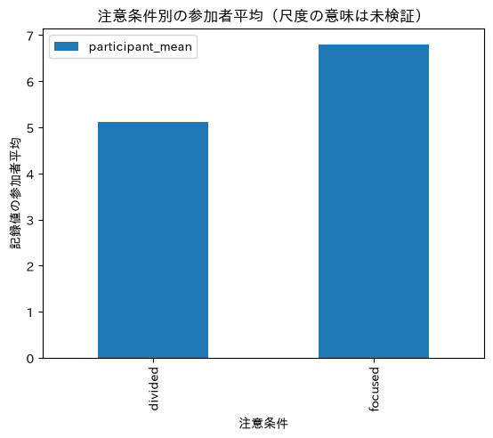

*注意条件別の参加者平均。dividedは5.1167、focusedは6.8000ですが、測定尺度の意味は未検証です。バー図だけでは不確実性や測定列ごとの差は分からないため、次の図と統計表を併せて読みます。Notebookの保存済みPNG出力をそのまま抽出しました。*

プロフィール比較では、`num3−num1` の平均はdividedで2.40、focusedで0.00、その群差は−2.40（参加者bootstrap 95%区間 −3.70〜−1.00）でした。`num2−num1` と `num3−num1` をまとめた2次元プロフィールの全ラベル置換p値は0.000103です。このp値を `num3−num1` 単独の検定値と同一視しません。群によって列間のパターンは異なりますが、時間順・難度が不明なので学習効果や注意の因果効果とは呼びません。

参加者の3列平均は4.00〜8.33、各参加者の3列の最大値−最小値は1.00〜5.00でした。IDは識別子であり能力順位ではありません。個人ごとの3値から能力・課題特異性・測定誤差を十分に分離することはできません。

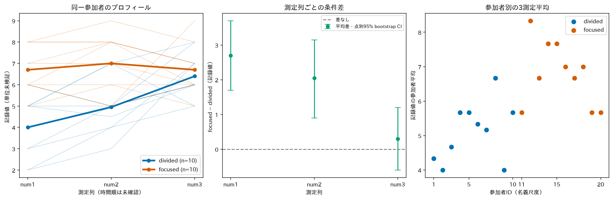

*左は同一参加者を結ぶ細線と条件別平均の太線、中央はfocused−divided差と点別95%bootstrap区間、右は参加者ID別の3測定平均です。num3の区間は0をまたぎます。測定列の順序は時間順とは確認されておらず、右のID順も能力順位ではありません。Notebookの保存済みPNG出力をそのまま抽出しました。*

**AIが生成した追加依頼1 — 測定定義と同源コピーの照合**

> Kaggle説明の「所要時間」と正確さという目的の不整合を再検討してください。同じ検索で見つかった別のKaggle公開データのanagramsファイルと説明をAPIから取得し、値と参加者IDを照合してください。コピーの一致を独立標本による再現と扱わず、正答率の結論が可能か判断してください。

**選定理由**: `SOURCE_DEFINITION` と `NONINTEGER_VALUES` を受け、測定の意味を取り違えると群差の良し悪しまで逆になることをAIが重視しました。

**結果・証拠・限界**: 別Kaggle公開データの420バイトのCSVをAPIで取得し、`compare_datasets` で照合しました。20 IDすべてが対応し、`attnr` と数値3列の値は各列100%一致、片側だけのID・値不一致は0でした。一方、SHA-256は異なりバイト同一ではありません。両公開データはSeaborn由来を示す同源コピーで、標本数は増えず独立再現でもありません。別公開説明にも正答率定義はなく、正確さの結論は依然出せません。採用判断は「正答率は算出せず、記録値の条件差に限定」です。証拠はセルindex=14の `CANDIDATE_PROVENANCE`, `DATASET_COMPARISON`, `ITERATION1_RESULT` と、反復1の根拠manifestです。

**AIが生成した追加依頼2 — 参加者・推定法への依存**

> 各群10人という少数標本で見えた群差とプロフィール差が、1人の参加者や非整数値、平均という推定法だけに依存していないか調べてください。1人ずつの除外、ID 7の除外、中央値と10%トリム平均を感度分析し、順位ベースの群間比較と参加者内の符号検定も補助的に実行してください。方向の安定性と効果量の安定性を分けて報告してください。

**選定理由**: 初回の `GROUP_RESULTS`, `PROFILE_INTERACTION` は差を示しましたが、各群10人しかなく、非整数値の意味も未解決でした。定義照合で解決できない点とは分けて、特定参加者や平均という推定法への依存を調べました。

**結果・証拠・限界**: 全標本、ID 7除外、20人それぞれの1人除外という22指定と、平均・中央値・10%トリム平均の3推定法を組み合わせ、参加者平均差と `num3−num1` の群差に各66回適用しました。

| 対象 | 基準値 | 感度分析の最小〜最大 | 最大相対偏差 | 方向 | 25%診断基準による判定 |
|---|---:|---|---:|---|---|
| 参加者平均の群差 | 1.6833 | 1.4167〜1.8634 | 15.84% | 全仕様で正 | `stable=True` |
| num3−num1の群差 | −2.4000 | −3.5000〜−2.1111 | 45.83% | 全仕様で負 | `stable=False` |

参加者平均差は設定した基準内で安定しましたが、プロフィール差は方向のみ安定し、大きさは不安定でした。25%は分析上の診断基準で、科学的な同等性閾値ではありません。また、`exclude_7` と `leave_7` は同じ標本なので、66実行は重複を除くと63種類の標本・推定法の組合せです。1人除外後のn=9の群では10%トリムは0人除去になります。各num1・num2列について66仕様を実行した結果ではありません。

順位ベースの群間比較でも、Holm補正p値はnum1で0.001126、num2で0.005391、num3で0.600619、参加者平均で0.002825でした。ただし順位分布差と平均差は異なる推定対象です。全20人のnum2−num1・num3−num1は対応t比較のHolm補正p値がともに約0.046でしたが、符号検定ではそれぞれ0.355・0.420でした。平均差と差の正負比は帰無仮説が異なるため単純な矛盾ではありませんが、全員が一様に増加するとは主張しません。dividedのnum3−num1は正8人・負0人・差0が2人で、符号検定の補正p値は0.0234でした。focusedには一貫した方向の証拠がありません。証拠はセルindex=16の `SENSITIVITY_SUMMARY`, `RANK_COMPARISON`, `SIGN_COMPARISON`, `ITERATION2_LIMITS` です。これらの感度分析も測定定義・独立性を検証するものではありません。

**AIが生成した追加依頼3 — 非有意と同等性、推定精度**

> num3で有意な群差がなかったことを「同じ正確さ」と誤読しないように、Welchの信頼区間と仮の同等性マージン0.5・1・2記録値単位によるTOSTを示してください。閾値の科学的根拠がないこと、少数標本でどの程度の差が見逃されうるか、符号検定と対応t検定が一致しなかった参加者内の結果も踏まえて、結論の強さを調整してください。

**選定理由**: 初回のnum3の区間が0を含み、順位比較も非有意でした。「差を検出できない」と「同等である」を区別し、方法依存の参加者内結果についても解釈を弱める必要がありました。

**結果・証拠・限界**: num3の平均差0.30に対するWelch 95%区間は−0.751〜1.351、90%区間は−0.567〜1.167でした。仮のマージンを使ったTOSTは次の結果です。

| 仮の同等性幅（記録値単位） | TOST p値 | 5%水準での条件付き判定 |
|---|---:|---|
| ±0.5 | 0.346945 | 同等性を示せない |
| ±1 | 0.089305 | 同等性を示せない |
| ±2 | 0.001606 | この仮定幅では同等性を示す |

±2で通ることは、科学的な実用同等性や「同じ正確さ」の証明ではありません。測定単位・意味・実用閾値が未確認で、TOSTは多重性未補正の探索的感度確認です。観測SDを固定した80%検出差の近似目安は約1.47記録値単位であり、小〜中程度の差を見逃す可能性があります。これは精度の目安で、事後検出力ではありません。証拠はセルindex=18の `PRECISION_RESULT`, `ITERATION3_RESULT` です。測定定義・募集・割付情報は追加計算では復元できないため、3回で停止しました。

**追加確認ログでの再評価**: `followup.log` とNotebookのフォローアップ節は、データ定義、分析前提、異常値、感度、可視化、根拠manifestの6観点を再評価したと記録しています。既存の3件の依頼に回答できた範囲と情報不足を確認し、追加の自然言語分析依頼は0件、合計3件のままです。第4回の分析を生成したとは扱いません。対象Notebookの既存セルIDを保持し、新カーネルで再実行・根拠再結合・保存後監査を行った検証は、追加分析の反復とは区別します。

**最終結論**: **focused条件ではnum1・num2と参加者平均の記録値が高い一方、「回答がより正確」とは結論できません。** num3の非有意結果から同じ正確さとも判断できません。条件別プロフィールの差は方向を保ちましたが、その大きさは感度分析で不安定でした。参加者の記録値にも幅がありますが、個人の能力順位・有意な能力差は推定していません。数値差の探索的分析と再実行は完了しており、正確さ・学習・課題難度・注意の因果効果への回答は、必要な定義・設計情報がないため保留です。

**監査・再現性**: `status.json` の `analysis_complete=true`、`final_completion.ready=true` と、その8項目の要件充足を、実行済みNotebook内容と併せて分析完了の根拠にしました。初回・追加確認のプロセスはともにexit code 0で通常終了、所要時間はそれぞれ1,494.0秒・389.4秒です。これらはランナーの実行時間であり、統計計算だけの所要時間ではありません。

Notebookには12コードセルがあり、最終保存状態の実行番号は上から1〜12、エラー出力はありません。metadataの `verified_reexecution` は新カーネルでの順次再実行、報告された全数値の初回一致、8件の根拠付きInsight、採用PNG 2枚の目視確認を記録しています。これは保存された検証記録の報告であり、本節作成時にKaggle再取得や分析を再実行したものではありません。

最終コードセルの `audit_notebook(..., visual_audit=True)` 出力、metadataの `post_save_audit`、statusの `final_audit` は、nbformat妥当、全12コードセル実行済み、未実行・エラー・監査所見・visual所見0件を記録しています。フォローアップrun `v020-exp-11-followup` は `completed`、実行中セル・未処理書込み・保持ロックはいずれも0です。初回run `v020-exp-11` の完了は初回ログにも記録されています。監査合格は測定定義・統計仮定・科学的妥当性や、以下の製品側改善候補の解消を保証しません。

再現にはKaggle認証、対応公開ファイル、Jupyter MCPとNotebookが直接使用するライブラリが必要です。保存済み出力のNumPyは2.5.3、pandasは3.0.6、SciPyは1.18.1です。主CSVには固定SHA-256のassertがあり、公開ファイルが更新されれば停止する設計です。認証時の標準出力・標準エラーは抑制し、出力された来歴に認証情報は含まれていません。証拠manifestはセルIDから最新実行番号へ再結合され、引用値の存在を追跡しますが、それだけで主張の妥当性を証明するものではありません。

**失敗内容とJupytermind改善候補**: 最終分析の未完了・未実行セル・未解決エラーは記録されていません。ただし、途中で回避した問題と、診断で再現した機能不足があります。Jupytermind側の候補は次の4件です。受け入れ条件は提案であり、修正実装・達成検証・GitHub Issue登録は行っていません。

| 候補・分類 | 再現条件と期待する挙動 | 実際の挙動・影響・回避策 | 証拠と受け入れ条件 |
|---|---|---|---|
| C1 可視化レイアウト不具合候補 | `render_chart(kind='bar', x='attnr', y='participant_mean')` を日本語ラベル・既定保存条件で描画。目盛・軸ラベルが枠内に収まることを期待 | 初回画像で下端のラベルが欠け、Notebookのフォローアップ記録では日本語フォントを明示しても再現。条件を誤読しうるが数値計算は不変。採用図は `savefig.bbox='tight'`、詳細図は `constrained_layout=True` で回避 | セルindex=20の `RENDERER_DIAGNOSTIC`、セルindex=24のC1と再現結果。英語・日本語の長いラベル・回転目盛・凡例を既定設定でも画像内に収める |
| C2 可視化監査の機能不足候補 | 実PNGセルのコピーでmetadataを空にし `audit_visual_outputs` を呼出し。未検査のタイトル・軸・glyph記録を警告することを期待 | PNG 2枚のmetadataを除去しても所見0件。未検査の図を監査済みと誤認する可能性。採用セルにmetadataを明示し、画像を目視確認して回避 | セルindex=20の `VISUAL_METADATA_PROBE`。PNGごとのmetadata・glyph検査記録の欠落を報告し、必要なラベル・凡例を検査。凡例不要の明示は許容する |
| C3 根拠追跡の出力形式対応不足 | 実行番号の一致するprintの `stream.text` にある `timings` を `record_insight` で引用。標準Jupyter出力として受理することを期待 | 値が存在しても `EvidenceMissingError`。有効な実行証拠を保存できない。実計算結果を `display_data` の `text/plain` に出す `emit` で回避 | セルindex=20の `STREAM_EVIDENCE_PROBE`、初回ログの拒否報告。Insight保存・監査がstreamも照合し、実行番号・値の不一致は従来どおり拒否する |
| C4 再描画時の日本語glyph不具合候補 | 新カーネルで `rc_context` 内の初回 `render_chart` 後、context外で再描画。毎回日本語が読めることを期待 | context復帰後の診断図でDejaVu Sansのglyph警告35件。繰返し描画で日本語が欠落する可能性。採用図は新カーネル初回描画とglyph警告検査で確認 | セルindex=12の `CHART_PROVENANCE`、セルindex=20の警告、セルindex=24のC4。context・style変更の内外で再描画してもglyph欠落せず、外側のrcParamsを不用意に変更しない |

C1の切れとC4の文字欠落は区別しています。採用PNG 2枚は日本語ラベルが読める状態で保存されており、不具合診断用画像はNotebookのPNG出力として表示されていません。診断画像や別JSONへのパスはNotebookに記録されていますが、今回それら別ファイルを追加の証拠として読み込んではいません。特にC1の再現結果はNotebook内の観察記録に基づく候補として扱います。

**外部ツール・呼出し側との切り分け**: Notebookは、保存先作成前のJupyter MCPによる作成拒否、Filesystem MCPの許可範囲、Kaggle SDKの `dataset_list(page_size=...)` 非対応、比較関数のrelationship指定・sampling項目不足などを記録しています。これらは環境・SDK差・呼出し側の誤りとして修正され、Jupytermind側の4候補に含めません。実行中の同一Notebookを `enqueue_write` で変更するとMCP返却出力が0件、末尾の実行番号が未保存となった件は、Jupyter MCPの結果保存と外部更新の統合競合として記録されています。自己書換えを除去し、別作業Notebookから更新、対象Notebookは読取り専用監査とした後に再実行しています。Jupytermindコアの確定不具合には数えません。Copilot CLI・外部ベンチマークランナー固有の不具合は、指定証拠では報告されていません。

**残る限界**: 各条件10人・1人3値という小標本で、募集・無作為割付・参加者間独立性・群ラベル交換可能性・列間の尺度比較可能性は未検証です。全置換を列挙しても交絡は消えず、母集団一般化や因果推論はできません。bootstrapは小標本percentile法の近似かつ点別区間で、同時区間ではありません。Friedmanは同順位を含む小標本での漸近検定として補助的に扱いました。Holm補正は明記した比較群内に限られ、全探索・全反復を横断する多重性は補正していません。追加分析もデータ閲覧後の探索です。

正答率・二項モデルは正誤と分母がなく、学習・難度の評価は列定義と実施順がなく、個人能力検定は観測不足で適用していません。IDとの相関も名義尺度のため非適用です。独立参照標本がないので同源コピー照合を独立検証とはせず、`validate_anomalies` による独立検証も行っていません。分布・単位の根拠が弱いため標準z-score異常検知は主分析で採用せず、確認できる意味的制約を検査しました。`mcp_gateway.run_and_record` は本接続で必要なPython MCPClient実装が渡されないため非適用とし、Jupyter MCPのセル実行と直列化書込みを直接利用しています。

**証拠範囲と保存物**: 分析上の証拠は、指定のNotebook、`initial-prompt.md`、`initial.log`、`followup.log`、`status.json` に限定しました。参考記事 `white-paper2.md` は書式・詳細度の参考にのみ使い、旧実験の数値・図・監査結果は転用していません。Notebookは `benchmark/projects/kaggle-v020-kaggle-exp-11-anagrams/notebooks/kaggle-v020-kaggle-exp-11-anagrams.ipynb`、抽出図は `benchmark/figures/exp-11-anagrams-condition-means.png` と `benchmark/figures/exp-11-anagrams-participant-profiles.png` です。改善候補の分類・再現手順・期待と実際・影響・証拠・受け入れ条件は、同実験runディレクトリの `issue-candidate.json` に保存しました。

## 実験12: Anscombe's Quartet（分析完了）

**課題**: 「KaggleのAnscombe's Quartet例を調べ、要約統計が似ている複数群を同じ結論として扱ってよいか検証してください。」

**初回プロンプト（全文・原文）**: 「KaggleのAnscombe's Quartet例を調べ、要約統計が似ている複数群を同じ結論として扱ってよいか検証してください。どの可視化と比較が必要か自分で判断し、数値だけでは見えない違いを日本語で説明してください。AI Data Scientist SkillとJupyter MCPを使い、分析計画・実行コード・結果・根拠付きInsightを保存し、再実行を確かめてください。 Kaggle参照先: https://www.kaggle.com/code/tomarns/anscombe-s-quartet。インストール済みkaggle Python SDKを使い、NotebookのJupyter MCP実行セル内で`KaggleApi().authenticate()`、`dataset_list(search=...)`、`dataset_list_files(...)`、必要に応じて`dataset_download_file(...)`を呼び出し、Kaggle上の対応する公開データを検索・取得してください。外部CSVミラーは使用しないでください。owner/dataset slug、取得ファイル名、取得日、ファイルSHA-256をNotebookに記録してください。APIトークンをセル出力・Notebook・ログへ表示しないでください。分析・API取得コードの実行はJupyter MCPだけを使い、端末コマンド、subprocess、外部スクリプト起動、作業エージェントへの委譲は行わないでください。APIで対応するデータが見つからない場合は外部ソースにフォールバックせず、その実験を停止して理由を報告してください。保存先は benchmark/projects/kaggle-v020-kaggle-exp-12-anscombe/notebooks/kaggle-v020-kaggle-exp-12-anscombe.ipynb としてください。run_idは `v020-exp-12` です。長時間処理の開始前にlifecycle.register_runを呼び、実行・書込みフェーズを記録し、終了時にcompletedまたはfailedを記録してください。データ定義manifest、分析前提manifest、意味的な異常検査、妥当な範囲の感度分析を使い、適用できない機能は理由を記録してください。図表はvisual_audit=Trueで監査してください。Notebookには「使用したJupytermindモジュール」節を設け、直接import・呼び出したモジュール名、関数名、使用目的を記録してください。間接利用は使用済みに含めないでください。Jupytermindの不具合または機能不足が疑われた場合は「Jupytermind改善候補」節を設け、分類、再現条件、期待する挙動、実際の挙動、影響、回避策、関係するセルとログを記録してください。Copilot CLI、Kaggle API、ベンチマークランナーに固有の問題とは切り分け、候補がなければ「なし」と記録してください。初回分析後、自分で結果を読み直し、結論に実質的な影響を与える未解決点があれば自然言語の追加依頼文を作成し、Notebookの「反復依頼履歴」に原文のまま記録して実行してください。価値ある追加分析がなくなるまで最大3回繰り返し、各反復の選定理由・結果・証拠・残る限界を報告してください。最後に全コードセルを上から再実行し、notebook_auditとライフサイクル状態を記録してください。」

**使用したJupytermindモジュール**: Notebookのコードセルで直接import・呼び出したものだけを示します。関数名の記載は直接の利用を意味し、間接利用や単なる言及は含めません。

| モジュール | 直接呼び出した関数・クラス・メソッド | 使用目的 |
|---|---|---|
| `ai_data_scientist.project_manager` | `resolve_project`、`ensure_notebook`、`ensure_data_dir`、`enqueue_write` | プロジェクト・Notebook・データ保存先の解決とNotebook書込みの直列化 |
| `ai_data_scientist.lifecycle` | `register_run`、`mark_execution_start`、`mark_execution_end`、`mark_write_start`、`mark_write_end`、`is_cancel_requested`、`mark_failed`、`mark_completed`、`get_run_status`、`wait_for_quiescence` | run_idの登録、実行・書込みフェーズ、取消確認、失敗時処理、完了・静止状態の記録 |
| `ai_data_scientist.language_router` | `detect_language` | 日本語の指示であることの判定 |
| `ai_data_scientist.ingestion` | `SourceSpec`、`ingest` | Kaggle APIで取得済みのCSV読込みと行上限確認 |
| `ai_data_scientist.cleaning` | `clean_dataset` | x・yの欠損除去による影響確認 |
| `ai_data_scientist.eda` | `explore` | 型、欠損、カテゴリ、基本統計の確認 |
| `ai_data_scientist.data_definition` | `FieldValue`、`build_manifest`、`DataDefinitionManifest.unresolved_fields` | 出典・変数定義と、verified／inferred／unknownの区別 |
| `ai_data_scientist.analysis_assumptions` | `Assumption`、`AnalysisAssumptionManifest`、`check_manifest` | 分析前提、結論に重要な未検証前提、関連分析の範囲の記録 |
| `ai_data_scientist.data_quality` | `detect_anomalies` | 群カテゴリ・行番号・キー一意性・欠損に関する意味的スキーマ検査 |
| `ai_data_scientist.stats_analysis` | `correlation` | 群ごとのPearson相関と日本語の係数解釈 |
| `ai_data_scientist.visualization` | `build_image_output` | Matplotlibで作った複合図をPNG MIME出力としてNotebookに記録 |
| `ai_data_scientist.sensitivity` | `SensitivityPlan`、`run_sensitivity` | 1点除去、モデル次数、影響点閾値、丸め幅・seedの感度分析とNaN入力の最小再現 |
| `ai_data_scientist.insight_engine` | `extract_cited_value`、`record_insight` | 保存済み出力から引用値を抽出し、実行カウント付きのEvidence manifestでInsightを保存 |
| `ai_data_scientist.notebook_audit` | `audit_notebook` | `visual_audit=True`による構造・証拠・図表の最終監査 |

`mark_failed`は失敗時分岐の呼出であり、正常終了した本実験がfailedになったことを意味しません。OLS・二次回帰、設計行列のランク、残差、レバレッジ、Cook距離、LOOCVはNotebook内のNumPy等によるコード、Theil–SenはSciPyで計算しています。これらをJupytermindの統計関数が提供した機能とは数えません。

**初回指示**: 手法を指定せず、同じ要約統計から同じ結論を導いてよいかを、AI自身が可視化と比較を選んで検証するよう依頼しました。Kaggle API限定の取得、取得元・ハッシュの記録、Jupyter MCPでの実行、manifest・意味的検査・感度分析、最大3回の自律的な追加依頼、全セル再実行と完了状態の記録を要求しました。

AIがNotebookに保存した計画は、4群を共通軸の散布図で比較し、OLS残差、影響度と1点除去、線形／二次モデルのLOOCV、観測されたxの配置を調べるものでした。外れた点や繰り返すxを自動削除せず、教材内の記述・関連分析に限定しています。独立した参照観測がないため外部データによる妥当性検証は非適用としました。また、呼出側のMCPClientがカーネルに公開されないため専用の実行記録ラッパーは直接利用せず、Jupyter MCPのセル実行と実際の出力保存を用いた、とNotebookに理由が記録されています。

**データ取得**: Notebookの実行カウント2〜4で、`KaggleApi().authenticate()`、`dataset_list(search='anscombe')`、`dataset_list_files(...)`、`dataset_download_file(...)`を実行しています。検索結果とファイル一覧を確認し、`carlmcbrideellis/data-anscombes-quartet` の `Anscombe_quartet_data.csv`を取得しました。同データセットにはQuintet用CSVもありましたが、分析対象にはしていません。

| 項目 | Notebookに残る取得・構造情報 |
|---|---|
| owner/dataset slug | `carlmcbrideellis/data-anscombes-quartet` |
| 取得ファイル | `Anscombe_quartet_data.csv` |
| 取得日時 | `2026-10-01T17:05:51.279178+00:00`（UTC。保存された再実行後の記録） |
| SHA-256 | `21dd4998e5985a2717e1ca154e3f90ac7657e8e71c6564096d92addf3c5a36b9` |
| 元データ | 11行・6列：`x123`、`y1`、`y2`、`y3`、`x4`、`y4` |
| 分析用データ | I〜IIIは`x123`と各y、IVは`x4`と`y4`を対応させ、各群11点、計44行の長形式へ変換 |

Kaggle参照Notebookも`kernels_pull('tomarns/anscombe-s-quartet', ...)`で取得し、コード2セル・Markdown1セル、seabornのAnscombeローダーと相関計算を含むことを確認しています。ただし`dataset_sources`は空です。**今回取得したCSVが参照Notebookの直接入力ファイルだったとは確認していません。** 参照Notebookのローダーを実行したり、外部CSVミラーへフォールバックしたりせず、別途Kaggleの公開CSVを取得して4群の構造を確認しています。認証時の標準出力・標準エラーは捕捉し、指定されたNotebook・ログにAPIトークンそのものの表示は見られません。

**データ定義・前提・意味的検査**: 欠損除去の確認は44行から44行、削除0行でした。x・yの有限値、各群11点、カテゴリ、行番号1〜11、群と行番号から作るキーの一意性を確認し、宣言したスキーマについて異常は0件でした。これは群IIIの影響点が誤記でないことや、測定過程の妥当性まで保証する結果ではありません。

データ定義manifestでは母集団、測定機構、x・yの物理単位を`unknown`、教材としての目的と説明側／応答側という役割を`inferred`と記録しています。初回の前提検査は、全群共通の線形性がまだ`assumed`であることを警告しました。最終段階では群別のモデル比較と識別可能性検査を`tested`として記録し、共通線形性を前提から外したことで、最終前提検査の指摘はありませんでした。

**初回結果**: 各群のx平均は9、標本分散は11で一致し、y平均、y標本分散、Pearson相関、OLS係数、R²もほぼ同じでした。分散は`ddof=1`です。保存された出力を丸めて示します。

| 群 | n | y平均 | y標本分散 | Pearson r | OLS傾き | OLS切片 | R² |
|---|---:|---:|---:|---:|---:|---:|---:|
| I | 11 | 7.500909 | 4.127269 | 0.816421 | 0.500091 | 3.000091 | 0.666542 |
| II | 11 | 7.500909 | 4.127629 | 0.816237 | 0.500000 | 3.000909 | 0.666242 |
| III | 11 | 7.500000 | 4.122620 | 0.816287 | 0.499727 | 3.002455 | 0.666324 |
| IV | 11 | 7.500909 | 4.123249 | 0.816521 | 0.499909 | 3.001727 | 0.666707 |

しかし、同じ`y≈3+0.5x`という直線から、同じ関係構造や予測の安定性を結論することはできませんでした。群Iには散らばりを伴う線形傾向、群IIには曲線性、群IIIには縦方向の影響点、群IVには1点に依存した傾きの識別という違いがあります。相関関数の「強い正の相関」という説明は係数の記述であり、線形性や頑健性の保証としては扱っていません。

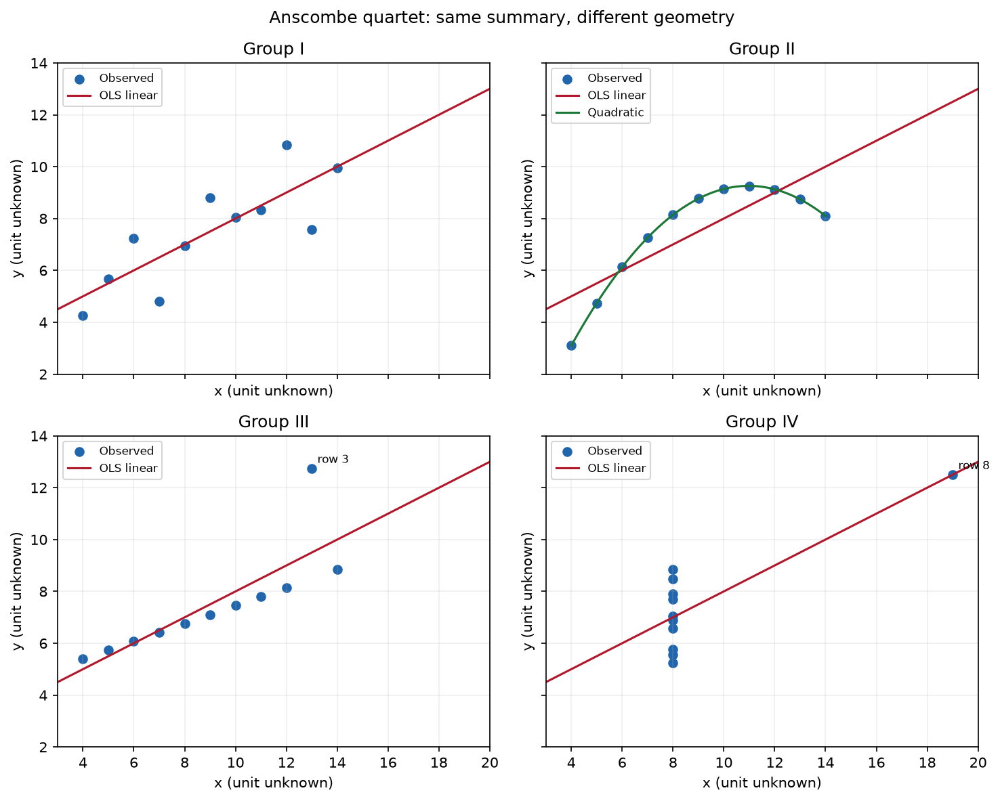

*同じ軸範囲で比較した4群の散布構造。赤いOLS直線はほぼ一致する一方、群IIの曲線、群IIIの第3点、群IVの第8点とxの集中は異なる。NotebookのPNG出力をそのまま抽出。*

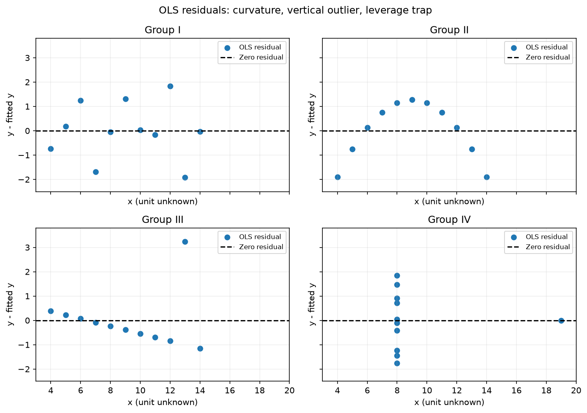

*群IIでは残差に曲率が残り、群IIIでは1点が大きく外れる。群IVのx=19の点は残差がほぼゼロでも、傾きの安定性を保証しない。*

初回から線形・二次モデルのLOOCV（一点ずつ除いた交差検証）も比較しています。群IIのRMSEは線形1.484648から二次0.001764へ低下しました。一方、群Iは1.367787から1.398117、群IIIは1.465390から1.762707となり、単に次数を増やせばよいわけではありません。群IVは二次モデルの設計行列がランク不足で、線形モデルでもx=19の1点を除いた1foldが識別不能になるため、全foldに基づくLOOCV RMSEを未定義としています。

群IIIの第3点（x=13、y=12.74）のCook距離は1.392849で、閾値`4/11`と1の両方を超えました。この点を診断目的で除くと、OLS傾きは0.499727から0.345390へ変わり、相関は約0.999997になります。群IVの第8点（x=19、y=12.50）はレバレッジが数値誤差の範囲で1であり、Cook距離の分母が退化するため未定義です。除去後は全点x=8となり、傾き・相関は「ゼロ」ではなく識別不能です。

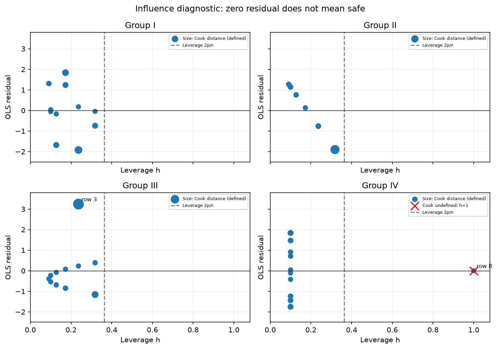

*点の大きさは定義可能なCook距離を表す。群IVのレバレッジ1の点は赤い×で未定義を明示し、残差の小ささだけでは影響点を見抜けないことを示す。*

**初回の感度分析**: 全点の結果を基準に各1点を除いた場合、傾きの最大相対変化は群Iが18.29%、IIが25.35%、IIIが30.88%でした。許容幅20%でIは`stable=True`、II・IIIは`False`です。ただし20%は便宜的な判定幅であり、統計的な同等性検定ではありません。群IVは識別可能な11仕様に限れば最大変化3.72%で`stable=True`ですが、第8点除去の無効仕様1件を別記しています。**無効仕様を除いた安定判定を、全仕様に対する頑健性とは解釈していません。** 点の除去は影響診断であり、元データの削除や誤記認定ではありません。

**AIが生成した追加依頼1 — 丸め幅と頑健推定への依存**

> 丸め誤差や推定法の選択によって、群IIの曲線性と群IIIの単一点への依存という解釈が変わるか確認してください。yを記録精度に相当する±0.005の範囲で変動させ、OLSとTheil–Senを比較し、群IVで頑健推定を使っても識別問題が解決しない理由を説明してください。

**選定理由**: 初回の曲線性と影響点依存が、yの小数2桁の記録精度やOLSの選択だけで生じたものかが未確認だったためです。

**結果**: 丸め幅0／0.005とseed12〜61の組合せ100仕様で検査しました。群IIの二次モデルによるLOOCV RMSE改善率は最低99.6369%、群IIIの第3点除去による傾きの相対変化は最低30.7908%で、主要な違いは消えませんでした。改善率の感度判定は許容1%に対して`stable=True`、最大相対変化0.002446でした。これは改善率という指標の安定性であり、群IIIのOLS傾きまで安定という意味ではありません。

Theil–Sen傾きは、Iが0.501667、IIが0.500000、IIIが0.345556、IVが0.503182でした。群IIIでは第3点除去後のOLS傾き0.345390と整合し、全点OLSの0.499727とは異なります。群IVでは頑健推定でもx=19の同じ1点との組合せに依存するため、推定法を変えても観測支持範囲の不足は解消しません。

**証拠・限界**: Notebookの実行カウント10の`iteration1_evidence`と対応するInsightに数値が保存されています。±0.005は記録桁から設定したシナリオで、真の測定誤差分布を推定したものではありません。100仕様はすべての摂動を網羅する保証ではなく、Theil–Senの区間を母集団推論には使っていません。

**AIが生成した追加依頼2 — 正相関と局所方向、予測を支える観測範囲**

> 群IIの正の相関を「xが増えるほど常にyが増える」と誤読できないよう、観測範囲内の二次曲線の頂点と局所傾き、隣接点の変化を比較してください。群IVについてはxの支持範囲と未観測区間を明示し、同じ回帰直線を同じ予測根拠として使えるか検証してください。

**選定理由**: 正の相関を全域の単調増加と取り違えたり、共通の直線式を同じ予測根拠と扱ったりする余地が残ったためです。

**結果**: 群IIの二次曲線の頂点はx=10.972958、x=14の局所傾きは−0.767133でした。実際の観測値もx=11のy=9.26からx=14の8.10へ低下しており、正のPearson相関は全域の単調増加を意味しません。

I〜IIIのxは4〜14の11水準、隣接する観測xの最大間隔は1です。一方、群IVはx=8に10点、x=19に1点の2水準しかなく、その間の幅11の区間に観測がありません。したがって、同じ回帰式でも補間や新規xでの予測を支える点の配置は異なります。

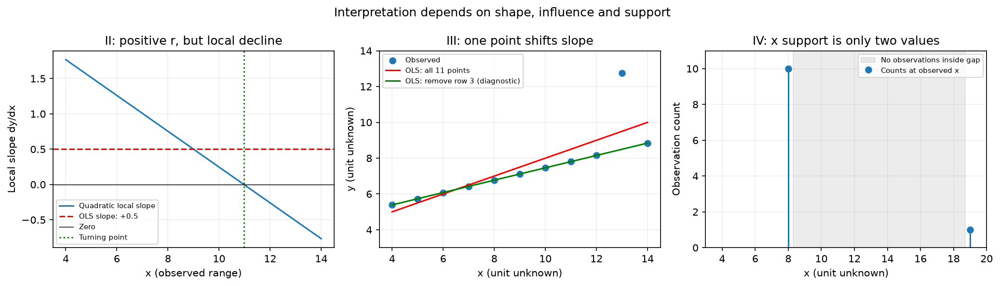

*左は群IIの局所傾きが正から負へ変わる位置、中央は群IIIの全点OLSと第3点除去後の直線、右は群IVのx別観測数と未観測区間。正相関・共通直線式だけでは説明できない違いをまとめている。*

**証拠・限界**: Notebookの実行カウント11の`iteration2_evidence`、隣接点変化・支持範囲の表、上のPNG、対応するInsightに記録があります。群IIIの影響点の真偽や群IVの未観測区間の関係は、追加データなしには確定できません。

**反復の停止と追加確認**: Notebookは、2回で主要な未解決点を確認し、残る問題は追加観測・外部妥当性の問題なので、同じ教材内で第3回を行っても価値がないと判断しています。なお、保存されたコードでは追加依頼2件の文面は初回レビューセルでまとめて定義・記録されています。「各回の結果を読んで次の文面を新たに作成した」という逐次的な生成過程までは、この成果物から確認できません。

`followup.log`も既存の初回分析と反復2回で元の問いに答えているとして、追加分析は不要と述べています。同ログの「証拠の対応付けと再評価記録を補強する」は方針の表明です。`status.json`では初回・最終のNotebookサイズがともに778005 bytes、mtimeも同じであり、この追加確認によってNotebookが更新・再実行されたとは断定しません。

**最終結論**: **要約統計が似ていても、4群を同じ結論として扱うことはできません。** 共通なのは、平均・標本分散・Pearson相関・OLS係数など指定した要約値の近似的一致です。群Iは観測範囲の線形近似が比較的妥当、IIは曲線性、IIIは縦方向の影響点への依存、IVは高レバレッジ点とx支持範囲の欠如が本質的に異なります。共通軸の散布図、残差対x、レバレッジ・Cook距離と1点除去、線形／二次モデルのLOOCV、xの頻度と空白区間を合わせて比較する必要があります。数値要約だけから線形性・単調性・予測頑健性・因果を結論することはできません。

**監査・再現性**: 分析完了の判断は`status.json`の`analysis_complete=true`、`final_completion.ready=true`とNotebookの内容に基づきます。生成前の文書化状態を分析の成否には用いていません。

| 確認項目 | 保存された証拠 |
|---|---|
| Notebook | `benchmark/projects/kaggle-v020-kaggle-exp-12-anscombe/notebooks/kaggle-v020-kaggle-exp-12-anscombe.ipynb` |
| 初回実行 | `initial_exit_code=0`、825.6秒、終了理由`exited` |
| 再実行 | 初回ログはカーネル再起動後の全セル再実行を報告。Notebookの実行カウントは1〜13、最終出力とmetadataは`replay_status=matched-baseline` |
| 比較内容 | 保存セルのコードは取得ファイルSHA-256、要約統計、モデル、診断、除去結果、丸め結果、反復結果とコードソースSHA-256の基準照合を実装 |
| 最終Notebook監査 | `nbformat_valid=true`、13コードセル／13実行済み、未実行・エラー・findings・visual_findingsなし、`ok=true` |
| 図表・Insight | PNGを含むセルは0始まりインデックス7・12、PNG出力は計4枚、Evidence manifest付きInsightは6件 |
| lifecycle | `v020-exp-12`は`completed`。最終出力で実行中セル0、保留書込み0、保持ロック0 |
| 追加確認の終了 | 92.9秒、`followup_exit_code=0`、終了理由`artifact_complete_cutoff`。ログはNotebookの安定・監査通過を理由とするランナーによる停止を記録 |

Notebookの最終保存セルは、`audit_notebook(..., visual_audit=True)`で監査し、監査合格後に`mark_completed`と`wait_for_quiescence`を実行しています。タイトル・軸・凡例・グリフ・可読性を確認した旨も最終出力にあります。PNGはセル出力から抽出したもので、分析や描画の再実行による作り直しではありません。

再現性について確認できるのは、保存コードの比較処理と`matched-baseline`という実行結果、および初回ログの再起動・再実行報告です。この節の作成時にはKaggle API取得やNotebook全セルの再実行を新たには行っていません。また、ログは要約された実行記録であり、Jupyter MCPの全呼出履歴や独立した第三者環境での再現を示すものではありません。Notebookが保存したmanifest等の別ファイルは、本節の独立した証拠には使用していません。

**失敗内容・Jupytermind改善候補**: 最終Notebookに分析セルのエラーや未実行セルはなく、分析の停止・取得失敗としては記録されていません。ただし、分析本体と分離した直接関数呼出で、次の2件の候補を記録しています。

| 分類 | 再現・実際の挙動 | 期待する挙動・影響・回避策 |
|---|---|---|
| `sensitivity`：非有限値入力の不具合候補 | 2仕様の返り値を1.0とNaNにすると、`stable=True`、`max_relative_deviation=0.0` | 非有限値を拒否するか、未評価・不安定を明示すべき。未定義仕様を含む結果を頑健と誤読し得る。本分析はランク・有限値を別検査し、群IVの無効仕様を別記してNaNを安定判定に渡していない |
| `data_definition`：確実性集約の機能不足候補 | `inferred`だけのmanifestで`unresolved_fields()`を呼ぶと0件 | 任意の機能として`unknown`と`inferred`を区別して注意点に集約できるとよい。推定を確認済みと誤読するリスクがあるため、本分析はstatusを別走査して両者を保存。Notebook自身が仕様どおりの挙動としており、不具合とは断定しない |

証拠はNotebookの0始まりセル13、実行カウント12の最小再現出力です。`nan_input_values=[1.0, NaN]`、`nan_input_report_stable=true`、`nan_input_max_relative_deviation=0.0`、`inferred_only_unresolved_fields_count=0`が残っています。この再現処理はKaggle APIやCLI・外部ランナーを呼ばず、Jupytermind関数を直接呼んでいます。分類、再現手順、期待・実際の挙動、影響、証拠、受け入れ条件を`benchmark/runs/12-kaggle-exp-12-anscombe/issue-candidate.json`に保存しました。ソース修正やGitHub Issue登録は行っていません。

**外部ツール・統合上の事象との切り分け**: Notebookの改善候補節には、実行中のNotebookを自身のセルから`enqueue_write`で変更した際、MCPは`COMPLETED`でも出力やexecution_countが保持されず、初回報告セルが`Count=N/A`になったという観測が記録されています。ファイル書込みとJupyter MCP側の結果保存の競合とされ、Jupytermind単体の不具合とは断定していません。回避コードは実際のIPython入力履歴番号と生成出力を明示保存し、最終監査では全セルの実行情報が残っています。指定ログに元のMCP応答の詳細はないため、原因の独立確認はできず、上の2件とは別扱いです。Kaggle認証・検索・取得はNotebook出力で成功を確認でき、追加確認の打切りは外部ランナーの動作であって、Jupytermindの分析失敗としては扱いません。

**残る限界**: 各群11点の固定教材であり、実母集団の独立同分布標本・因果効果としての解釈や、実世界への一般化は行っていません。母集団・測定機構・単位は不明で、公開CSVと参照Notebook入力のバイト単位同一性も未確認です。小標本のLOOCVと便宜的な感度許容幅だけでモデルの正しさを保証できず、群IVではそもそも定義できない比較があります。群IIIの点の真偽、群IVの未観測区間、外部妥当性は追加観測を要します。監査の指摘なしは保存状態と実装された検査条件についての結果であり、科学的妥当性やすべての主張を独立に保証するものではありません。

## 実験13: Attentionの条件差と参加者内の水準差（分析完了）

**課題**: 「Kaggle上の心理学Attentionデータに相当する公開データを分析し、注意課題の結果が時間や条件でどう変わるか調べてください。」

**初回プロンプト（全文・原文）**:

```text
Kaggle上の心理学Attentionデータに相当する公開データを分析し、注意課題の結果が時間や条件でどう変わるか調べてください。測定構造を自分で見極めて分析計画と適切な図表を選び、同一参加者の反復測定を無視する危険も日本語で説明してください。AI Data Scientist SkillとJupyter MCPで計画・コード・結果・根拠付きInsightを保存し、再実行を確認してください。 Kaggle参照先: https://www.kaggle.com/datasets?search=attention+dataset+psychology。インストール済みkaggle Python SDKを使い、NotebookのJupyter MCP実行セル内で`KaggleApi().authenticate()`、`dataset_list(search=...)`、`dataset_list_files(...)`、必要に応じて`dataset_download_file(...)`を呼び出し、Kaggle上の対応する公開データを検索・取得してください。外部CSVミラーは使用しないでください。owner/dataset slug、取得ファイル名、取得日、ファイルSHA-256をNotebookに記録してください。APIトークンをセル出力・Notebook・ログへ表示しないでください。分析・API取得コードの実行はJupyter MCPだけを使い、端末コマンド、subprocess、外部スクリプト起動、作業エージェントへの委譲は行わないでください。APIで対応するデータが見つからない場合は外部ソースにフォールバックせず、その実験を停止して理由を報告してください。保存先は benchmark/projects/kaggle-v020-kaggle-exp-13-attention/notebooks/kaggle-v020-kaggle-exp-13-attention.ipynb としてください。run_idは `v020-exp-13` です。長時間処理の開始前にlifecycle.register_runを呼び、実行・書込みフェーズを記録し、終了時にcompletedまたはfailedを記録してください。データ定義manifest、分析前提manifest、意味的な異常検査、妥当な範囲の感度分析を使い、適用できない機能は理由を記録してください。図表はvisual_audit=Trueで監査してください。Notebookには「使用したJupytermindモジュール」節を設け、直接import・呼び出したモジュール名、関数名、使用目的を記録してください。間接利用は使用済みに含めないでください。Jupytermindの不具合または機能不足が疑われた場合は「Jupytermind改善候補」節を設け、分類、再現条件、期待する挙動、実際の挙動、影響、回避策、関係するセルとログを記録してください。Copilot CLI、Kaggle API、ベンチマークランナーに固有の問題とは切り分け、候補がなければ「なし」と記録してください。初回分析後、自分で結果を読み直し、結論に実質的な影響を与える未解決点があれば自然言語の追加依頼文を作成し、Notebookの「反復依頼履歴」に原文のまま記録して実行してください。価値ある追加分析がなくなるまで最大3回繰り返し、各反復の選定理由・結果・証拠・残る限界を報告してください。最後に全コードセルを上から再実行し、notebook_auditとライフサイクル状態を記録してください。
```

### 初回指示と使用したJupytermindモジュール

初回指示は、データの測定構造を先に確認し、注意条件と時間に関する問いへ、反復測定を考慮して答えることでした。取得来歴、定義・前提、意味的検査、感度分析、根拠付きInsight、自律的な追加依頼、全セル再実行と可視化監査も要求されています。

以下はNotebookのコードで直接import・呼び出したモジュールと関数・クラスです。Kaggle SDK、Jupyter MCP、NumPy、SciPy、pandas、MatplotlibはJupytermindモジュールには含めません。

| モジュール | 関数・クラス | 使用目的 |
|---|---|---|
| `ai_data_scientist.project_manager` | `resolve_project`, `ensure_notebook`, `ensure_data_dir`, `enqueue_write` | 保存先とデータ置場の確保、Notebookの直列化書込み |
| `ai_data_scientist.language_router` | `detect_language` | 日本語の検出 |
| `ai_data_scientist.lifecycle` | `register_run`, `mark_execution_start`, `mark_execution_end`, `mark_write_start`, `mark_write_end`, `is_cancel_requested`, `get_run_status`, `mark_completed`, `mark_failed`, `wait_for_quiescence` | run_id管理、実行・書込みフェーズ、取消確認、完了・失敗と静止状態の記録 |
| `ai_data_scientist.ingestion` | `SourceSpec`, `ingest` | Kaggle APIで取得済みのローカルCSVを最大10,000行で読込み |
| `ai_data_scientist.cleaning` | `clean_dataset` | 重複検査、除去行数が0であることの確認 |
| `ai_data_scientist.eda` | `explore` | 型、欠測、要約統計の確認 |
| `ai_data_scientist.data_definition` | `FieldValue`, `build_manifest`, `DataDefinitionManifest.unresolved_fields` | データ定義と来歴をverified・inferred・unknownに分離 |
| `ai_data_scientist.analysis_assumptions` | `Assumption`, `AnalysisAssumptionManifest`, `check_manifest` | 分析前提と結論に重要な未確認前提の警告 |
| `ai_data_scientist.data_quality` | `detect_anomalies` | 必須値、条件カテゴリー、水準、IDの意味的制約の検査 |
| `ai_data_scientist.sensitivity` | `SensitivityPlan`, `run_sensitivity` | 42仕様による差の方向・大きさの安定性確認 |
| `ai_data_scientist.visualization` | `render_chart`, `build_image_output` | 条件別平均図の描画、PNGのNotebook出力 |
| `ai_data_scientist.insight_engine` | `extract_cited_value`, `record_insight` | 実出力から根拠値を抽出し、証拠検証付きInsightを保存 |
| `ai_data_scientist.notebook_audit` | `audit_visual_outputs`, `audit_notebook` | 可視化監査の再現検査、`visual_audit=True`の最終監査 |

### データ取得・測定構造と分析計画

Notebookでは`KaggleApi`の認証後、`attention psychology`、`attention`、`attentional`、`stroop`、`sustained attention`を検索しました。保存された再実行出力では、この5検索の結果件数合計は96件で、検索エラーは記録されていません。ただし重複を除いたデータセット数ではなく、各検索の1ページ目の件数です。続けて`seaborn datasets`などを検索し、複数候補を`dataset_list_files`で点検しています。

広い検索にはEEG、合成データ、機械学習のAttentionなどが混在していたため、最終的にKaggle上の[`tdogand/seaborn-datasets`](https://www.kaggle.com/datasets/tdogand/seaborn-datasets)を選び、`attention.csv`と`README.md`を`dataset_download_file`で取得しました。外部CSVミラーの取得は記録されていません。READMEにはAttentionの由来として心理学教育サイト`psych252.github.io`が記されていますが、そのサイトを別途取得した証拠や、個別の変数辞書はありません。

| ファイル | 初回取得日時（UTC） | 再実行時の取得日時（UTC） | サイズ |
|---|---|---|---:|
| `attention.csv` | 2026-10-01 17:00:51.725075 | 2026-10-01 17:09:07.342187 | 1,198 bytes |
| `README.md` | 2026-10-01 17:00:52.339844 | 2026-10-01 17:09:08.650317 | 1,662 bytes |

日本時間では、いずれも2026年10月2日の取得です。初回来歴はNotebookメタデータ`attention_analysis.initial_provenance`、再取得来歴はセル4の出力と「取得元・再現情報」節に保存されています。SHA-256は初回・再取得で一致しました。

```text
attention.csv
5c1de4b2a7cb7a9521145074815e0f3824f2d11786e72fc843f6fcb24701bc19

README.md
353c1ad8b97978c075a34b8dce68b3f0345a2005c87d79f74af413c57c620cbf
```

CSVは60行・5列で、連番の`Unnamed: 0`を除く分析列は`subject`、`attention`、`solutions`、`score`です。測定構造は**20参加者×3水準、各注意条件10参加者**でした。`attention`の`divided`と`focused`は参加者内で変わらず、`solutions`の1・2・3が同一参加者内で反復されています。条件は参加者間、水準は参加者内という構造です。

**`solutions`が経過時間や実施順序を表す根拠はありません。** したがって水準をカテゴリーとして扱い、時間経過、練習、疲労による変化は推定しません。scoreの観測範囲は2–9で、参加者7・水準2に4.5がありましたが、整数限定という定義がないため保持しています。連番列以外は除去せず、行削除・補完はありません。欠測、参加者×水準の重複、不完全な反復、参加者内の条件変更、非有限得点、指定した意味的制約の違反はいずれも検出されませんでした。

定義manifestでは、取得来歴やREADMEの記載と、構造から推定した変数の意味を区別しました。分析前提manifestは、異なるIDの独立性と得点差の加算的比較を`assumed`として警告しています。主解析は参加者単位の平均とt信頼区間、条件間のWelch比較、対応する水準差の条件間比較です。条件内で参加者を再抽出する10,000回のブートストラップも行い、反復の対応関係を保存しました。検定は探索的で、信頼区間は個別95%区間であり同時信頼区間ではありません。

### 初回結果

| solutions水準 | divided平均 | focused平均 | focused−divided | 条件差の個別95% CI |
|---|---:|---:|---:|---|
| 1 | 4.00 | 6.70 | 2.70 | 1.519–3.881 |
| 2 | 4.95 | 7.00 | 2.05 | 0.792–3.308 |
| 3 | 6.40 | 6.70 | 0.30 | −0.751–1.351 |

条件差は水準1から3にかけて縮小しました。各参加者の3水準平均を独立単位とした比較では、focused−dividedは**1.683**、95% CIは**0.840–2.527**、未補正p=0.000551でした。これは得点の関連であり、注意条件の因果効果や能力の優劣を証明しません。

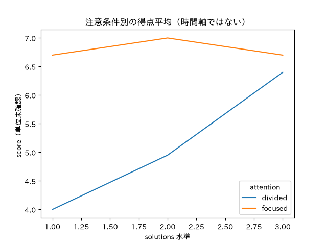

*注意条件ごとの平均得点。横軸はsolutions水準であり、時間軸でも連続量としての補間推定でもない。水準1で大きかった条件差は水準3で小さくなる。*

同じ参加者の水準3−1の平均対応差は、dividedが**+2.40（95% CI 1.043–3.757）**、focusedが**0.00（−0.954–0.954）**でした。その条件間差、すなわちfocused−dividedの変化量差は**−2.40（−3.953–−0.847）**、未補正p=0.004740です。水準2−1の変化量差は−0.65（−1.625–0.325）、未補正p=0.178148でした。

参加者単位ブートストラップの95%百分位区間は、全水準平均の条件差で0.933–2.433、水準3−1の変化量差で−3.80–−1.00でした。平均の条件差と端点の変化量差について、Welch区間と方向の整合性が確認されています。乱数seedは20261001です。

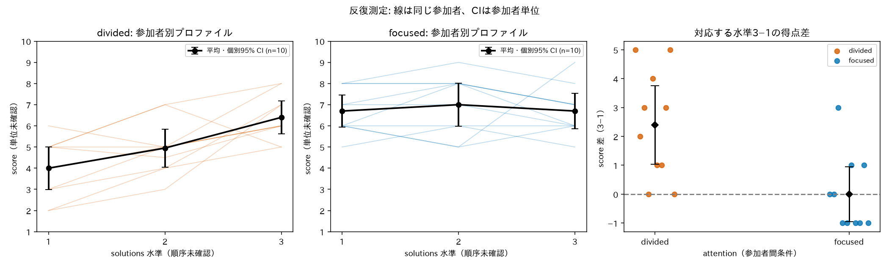

*左・中央は同一参加者を結ぶ3水準の得点と、各条件10参加者による平均・個別95% CI。右は参加者ごとの水準3−1差と条件別平均・95% CIで、平均だけでは見えない個人差を示す。*

以上の主解析に続く2回の追加依頼は、**初回CLI処理の中でAIが生成・実行した反復**です。後述する外部ランナーの追加確認処理とは区別します。数値の根拠はNotebookの主解析セル`e1d0e312`（セル6、実行番号6）に保存された`PRIMARY_EVIDENCE`、要約表、実出力です。`initial.log`の最終報告も主要な平均・変化量と一致しています。

### AIが自律生成した追加依頼

#### 追加依頼1: 少数参加者と集計方法への依存

**追加依頼原文（改変なし）**:

> 水準3−1の条件間差が一部の参加者や平均という集計方法だけに依存していないか、参加者を1人ずつ除いた解析と中央値による解析で確認してください。方向と大きさの安定性を分けて報告し、得点4.5は根拠なく除外しないでください。

**選定理由**: 各条件10参加者と小標本で、個人差も大きく、主たる変化量差−2.40が少数参加者や尺度前提に左右される可能性があったためです。

**結果**: 全員を含む場合と20人それぞれを1人ずつ除いた場合を、平均・中央値の2集計で比較し、計42仕様を実行しました。推定差はすべて負でしたが、全仕様の範囲は**−3.50～−2.111**、平均のみでは**−2.733～−2.111**、全標本の中央値による差は**−3.00**でした。基準の平均差−2.40に対する最大相対乖離は**45.8%**で、設定した許容閾値20%を超え、`stable=False`になりました。

**解釈・残る限界**: 差の方向は特定の1人だけに依存していませんが、効果の大きさまで頑健とは評価できません。中央値と平均は推定対象が異なり、この安定性判定は両者を含む仕様群に対するものです。score=4.5の恣意的な除外は行っていません。時間・得点尺度・無作為割付の定義は、この追加解析では解決しません。

**証拠**: Notebookセル`9daf294d`（セル8、実行番号8）の`SENSITIVITY_EVIDENCE`と42仕様の全結果、メタデータ`attention_analysis.iteration_history`。

#### 追加依頼2: 全水準のプロファイル、多重比較、擬似反復

**追加依頼原文（改変なし）**:

> 端点の差だけでなく3水準全体で条件別プロファイルが異なるか、参加者単位の置換検定で調べてください。探索した検定をHolm補正し、水準3の非有意差を同等性と誤解しないよう説明してください。また60行を独立と扱う解析と参加者単位の標準誤差を実データで比較してください。

**選定理由**: 端点差だけでは全水準の交互作用を判断できず、多重検定と擬似反復による確実性の過大評価が未解決だったためです。

**結果**: 参加者の水準2−1・3−1差を一つのベクトルとして保持し、条件ラベルを参加者単位で19,999回置換しました。全水準プロファイルの統計量は1.437540、未補正p=0.02045でした。ただし探索した7検定をHolm補正すると、全水準のpは**0.06135**となり、5%基準を満たしませんでした。seedは20261002です。

| 検定対象 | 未補正p | Holm補正p |
|---|---:|---:|
| 全水準の参加者平均の条件差 | 0.000551 | 0.003305 |
| 水準2−1の変化量の条件差 | 0.178148 | 0.356296 |
| 水準3−1の変化量の条件差 | 0.004740 | 0.018959 |
| 水準1の条件差 | 0.000164 | 0.001149 |
| 水準2の条件差 | 0.003061 | 0.015306 |
| 水準3の条件差 | 0.556027 | 0.556027 |
| 全水準プロファイルの交互作用 | 0.02045 | 0.06135 |

水準3−1の端点差には補正後も証拠が残りますが、これを全水準の確定的な交互作用へ拡張しません。また水準3の条件差0.30の95% CIは−0.751～1.351であり、非有意は「両条件が同等」や「差がゼロ」の証明ではありません。同等性の許容マージンも未定義です。

**反復測定を無視する危険**: 60行を独立標本として条件差を比較すると、30行/条件で標準誤差は0.359824でした。参加者ごとに平均し、10人/条件を独立単位に戻すと0.401271です。前者は後者の89.67%、つまり**約10.3%の過小評価**でした。自由度は約53.9対17.9、未補正pは約0.0000199対0.000551になりました。同じ差1.683でも、行単位の解析は確実性を過大に見せています。ただし歪みの方向は設計・相関・推定対象に依存し、反復を無視すると常に標準誤差が小さくなるという一般則ではありません。

**残る限界**: 置換検定は参加者間の交換可能性を仮定します。小標本、未知の割付、得点定義、実施順序を解消したものではなく、因果性も保証しません。

**証拠**: Notebookセル`cfcb0c37`（セル9、実行番号9）の`ITERATION2_EVIDENCE`、Holm補正一覧、擬似反復比較、メタデータ`attention_analysis.iteration_history`。

**停止理由**: 追加依頼は2回で停止しました。方向の個人依存、全水準プロファイル、多重比較、擬似反復は確認済みです。残る時間・得点定義・割付・代表性の不明は、このCSVだけで解消できず、追加モデルの価値が低いと記録されています。3回目の依頼は生成されていません。

### 最終結論

このデータでは、focusedの参加者平均得点がdividedより高く、水準1から3にかけて条件差が2.70から0.30へ縮小しました。dividedの水準3−1差は+2.40、focusedは0.00で、その差−2.40にはHolm補正後も統計的な証拠があります。

一方、**差の方向は感度分析で維持されたものの、大きさの安定性は確認できず、全水準の交互作用も補正後に5%基準を満たしませんでした。** 水準3の非有意差を同等性とは扱いません。そもそもsolutionsが時間とは確認できないため、「時間に伴い注意が改善した」「練習や疲労の効果が現れた」という結論は出せません。20参加者の反復構造を守った、教育用公開サンプル内の条件付き関連として解釈します。

### 再現性・監査と実行結果の扱い

Notebookは`benchmark/projects/kaggle-v020-kaggle-exp-13-attention/notebooks/kaggle-v020-kaggle-exp-13-attention.ipynb`に保存されています。`status.json`の**`analysis_complete=true`、`final_completion.ready=true`**に加え、Notebookの実出力と最終監査・再実行メタデータを根拠に、分析完了と判断します。初回処理は779.5秒、終了コード0、終了理由`exited`です。

Notebookメタデータ`mcp_reexecution`は、Jupyter MCPの`restart_notebook`後に全コードセルを上から`execute_cell`で再実行したと記録しています。再実行はUTC 2026-10-01 17:08:34.810243に予定され、17:09:44.058367に終了、状態は`passed`でした。最終セルの検証出力では、初回結果との指紋一致、取得ファイルのSHA-256一致、コードソースのハッシュ照合が確認されています。結果指紋は次のとおりです。

```text
92075e3576934231f22864b330c8fd465511f6a4188e7675b01bd8f94d0f472c
```

最終監査は`nbformat_valid=True`、`ok=True`、実行済み**12/12コードセル**、未実行0、エラー0、findings 0、visual_findings 0でした。図表はセル7の2点、根拠付きInsightは6件です。コードセルの実行番号は`1, 2, 3, 4, 5, 6, 7, 8, 9, 10, 12, 13`で、単調増加しています。番号の欠番はありますが、13コードセルという意味ではありません。図表セルにはタイトル・軸・凡例のメタデータと、`missing_glyphs=[]`、`warning_log=[]`が保存されています。

run_id=`v020-exp-13`の最終lifecycle状態は`completed`、実行中セル・書込み待ち・保持ロックはいずれも0です。これらは最終セル`00736966`とメタデータ`final_notebook_audit`、`reexecution_verification`、`lifecycle_final`に記録されています。

記録された依存パッケージは、kaggle 2.2.4、NumPy 2.5.3、pandas 3.0.6、SciPy 1.18.1、Matplotlib 3.11.2、nbformat 5.11.1、mcp 2.2.0、jupyter-mcp-server 2.2.3です。NotebookのPythonバージョン欄は空であり、Pythonの厳密な版はこの証拠だけでは確認できません。

**外部ランナーの追加確認**は92.5秒、終了コード0、終了理由`artifact_complete_cutoff`でした。`followup.log`には再点検の予告と「Notebookが安定して監査を通過したため停止した」というランナー行だけがあり、新しい分析結果や独立した全セル再実行の完了報告はありません。初回・最終の安定性記録はともに410,611 bytesで更新日時も同じです。したがって追加確認を別の再実行成功とは数えず、再実行の根拠は既存Notebookと初回ログに置きます。

### 途中の失敗・回避策とJupytermind改善候補

**途中の保存・監査失敗**はありました。Notebookメタデータ`prior_audit_attempt`には、自己書込みするレポートセルの実行番号がディスクへ同期されず、セル11が未実行扱いとなった監査拒否が残っています。この時点では実行済み10/12、未実行セル11、末尾監査セル24は実行中として除外する警告、run状態`failed`でした。これは分析結果のエラーではなく、Notebook自己書込みとMCP文書プロバイダの保存が競合したとNotebookに記録されています。

回避策としてレポートセルのソースを先に保存してから実行し、実際のカーネル実行番号と表示payloadを`enqueue_write`で明示保存しました。その後の全セル再実行と最終監査は上記のとおり完了しています。初回の`use_notebook(create)`が未作成の親ディレクトリを作成しなかった事象も記録され、`project_manager.ensure_notebook`を利用したブートストラップで回避されています。これらはNotebook上では**Jupyter MCP文書プロバイダ由来**として区別されており、指定証拠だけからJupytermind本体の不具合へ再分類しません。Kaggle認証・検索・取得の失敗、Copilot CLI固有の障害は確認されていません。追加確認の打切りは外部ベンチマークランナーの制御です。

**Jupytermind改善候補は1件**です。セル`242deb70`（セル10、実行番号10）で、`visualization.build_image_output`から作ったPNG出力を持つ、`chart`メタデータなしの検査用セルを`notebook_audit.audit_visual_outputs`へ渡すと、**`chart_metadata_present=False`なのに`findings=[]`**でした。ラベル・グリフの検査情報が不足している状態と、検査して問題がなかった状態を区別できない可能性があります。

これはJupytermindの可視化監査に対する直接呼出しで再現した**検査不能状態の通知不足の候補**であり、実際のPNGに文字欠けがあることを示したものではありません。Copilot CLI、Kaggle API、外部ランナーの問題とは分離します。本Notebookではメタデータと描画警告を明示保存して回避しました。受け入れ条件は、必要な監査情報が欠ける場合に検査不能を明示し、情報が揃っていて問題がない場合と区別できることです。分類、再現手順、期待・実際の挙動、影響、証拠、受け入れ条件は同実験ディレクトリの`issue-candidate.json`へ保存しました。GitHub Issueの登録はこの節の作成では行っていません。

### 残る限界

対象は各条件10参加者の教育用サンプルで、原実験、母集団代表性、割付手順、ライセンス、scoreの単位・良い方向・理論的範囲、測定時刻・順序は未確認です。READMEは一般用途のアーカイブではないこと、元データから変更されたサンプルもあることを注意書きしています。観測範囲2–9を有効範囲や尺度上限と読み替えません。未確認の独立性・得点尺度に依存する推論であり、因果効果、注意能力の優劣、時間効果を一般化できません。

独立した参照実験がないためデータ間検証は実施されず、同じSeaborn CSVの別Kaggle掲載も独立検証にはなりません。IDや水準番号の機械的な相関、根拠のない得点外れ値の削除、全因子が参加者内であることを前提とするANOVA、時間傾向・同等性検定も適用されていません。MCP実行をPythonクライアント経由で記録する経路はホスト側の対応がないため未適用と記録され、実際のJupyter MCPセル出力を証拠にしています。これらの未適用機能を、使用済みモジュールや成功した分析として数えません。

## 実験14: Car Crashes / Bad Drivers（分析完了・全セル再実行と最終監査の完了は未確認）

**課題**: 「Kaggleで扱われる米国州別の交通事故データから、事故率や死亡率に関係する特徴を探してください。」

**初回プロンプト（全文・原文）**: 「Kaggleで扱われる米国州別の交通事故データから、事故率や死亡率に関係する特徴を探してください。分析方法と図表を自分で選び、州間の比較可能性や相関から因果を主張できない点も含めて日本語で報告してください。AI Data Scientist SkillとJupyter MCPを使い、計画・コード・出力・根拠付きInsightを記録し、再実行を確認してください。 Kaggle参照先: https://www.kaggle.com/datasets?search=bad+drivers+car+crashes。インストール済みkaggle Python SDKを使い、NotebookのJupyter MCP実行セル内で`KaggleApi().authenticate()`、`dataset_list(search=...)`、`dataset_list_files(...)`、必要に応じて`dataset_download_file(...)`を呼び出し、Kaggle上の対応する公開データを検索・取得してください。外部CSVミラーは使用しないでください。owner/dataset slug、取得ファイル名、取得日、ファイルSHA-256をNotebookに記録してください。APIトークンをセル出力・Notebook・ログへ表示しないでください。分析・API取得コードの実行はJupyter MCPだけを使い、端末コマンド、subprocess、外部スクリプト起動、作業エージェントへの委譲は行わないでください。APIで対応するデータが見つからない場合は外部ソースにフォールバックせず、その実験を停止して理由を報告してください。保存先は benchmark/projects/kaggle-v020-kaggle-exp-14-car-crashes/notebooks/kaggle-v020-kaggle-exp-14-car-crashes.ipynb としてください。run_idは `v020-exp-14` です。長時間処理の開始前にlifecycle.register_runを呼び、実行・書込みフェーズを記録し、終了時にcompletedまたはfailedを記録してください。データ定義manifest、分析前提manifest、意味的な異常検査、妥当な範囲の感度分析を使い、適用できない機能は理由を記録してください。図表はvisual_audit=Trueで監査してください。Notebookには「使用したJupytermindモジュール」節を設け、直接import・呼び出したモジュール名、関数名、使用目的を記録してください。間接利用は使用済みに含めないでください。Jupytermindの不具合または機能不足が疑われた場合は「Jupytermind改善候補」節を設け、分類、再現条件、期待する挙動、実際の挙動、影響、回避策、関係するセルとログを記録してください。Copilot CLI、Kaggle API、ベンチマークランナーに固有の問題とは切り分け、候補がなければ「なし」と記録してください。初回分析後、自分で結果を読み直し、結論に実質的な影響を与える未解決点があれば自然言語の追加依頼文を作成し、Notebookの「反復依頼履歴」に原文のまま記録して実行してください。価値ある追加分析がなくなるまで最大3回繰り返し、各反復の選定理由・結果・証拠・残る限界を報告してください。最後に全コードセルを上から再実行し、notebook_auditとライフサイクル状態を記録してください。」

**使用したJupytermindモジュール**: 保存されたNotebookのコードで直接import・呼び出しを確認できるものを記載します。以下のセル番号は0始まりです。操作用bootstrapでの利用を述べたMarkdownだけでは、当該コードの直接実行を確認したとは扱いません。

| モジュール | 直接呼び出した関数・クラス | 使用目的 |
|---|---|---|
| `ai_data_scientist.project_manager` | `resolve_project`, `ensure_notebook`, `ensure_data_dir` | 分析プロジェクト、Notebook、取得データの保存先を準備（セル1）。 |
| `ai_data_scientist.language_router` | `detect_language` | 日本語の分析・解釈を選択（セル1）。 |
| `ai_data_scientist.lifecycle` | `register_run`, `mark_write_start`, `mark_write_end`, `is_cancel_requested`, `mark_execution_start`, `mark_execution_end`, `mark_failed`, `get_run_status` | run_id登録、実行・書込みフェーズ、中止・例外時の処理、状態表示（セル1と各分析セル）。例外分岐の実行回数は保存出力だけでは確定しない。 |
| `ai_data_scientist.ingestion` | `SourceSpec`, `ingest` | Kaggleから取得したローカルCSVを読み込み、行数上限による切り詰めがないことを確認（セル4）。 |
| `ai_data_scientist.cleaning` | `clean_dataset` | 重複除去操作の影響を記録。51行から51行で除去0行（セル6）。 |
| `ai_data_scientist.eda` | `explore` | 型、欠損、記述統計、州名の一意性を把握（セル6）。 |
| `ai_data_scientist.data_definition` | `FieldValue`, `build_manifest`, `DataDefinitionManifest.unresolved_fields` | 出典、単位、年、未確認・推測事項、派生率の定義を記録（セル6・17・22）。 |
| `ai_data_scientist.analysis_assumptions` | `Assumption`, `AnalysisAssumptionManifest`, `check_manifest` | 州間比較、異年指標、独立性、因果解釈の前提と未解決警告を記録（セル6）。 |
| `ai_data_scientist.data_quality` | `detect_anomalies` | 州キーの許容値・一意性・非欠損、割合の0～100%、率・金額の非負制約を検査（セル6）。 |
| `ai_data_scientist.stats_analysis` | `correlation` | 日本語解釈付きPearson相関を計算（セル8）。 |
| `ai_data_scientist.visualization` | `render_chart`, `build_image_output` | 初回の散布図描画と、初回・反復2のPNG出力を組み立て（セル9・17・22）。 |
| `ai_data_scientist.sensitivity` | `SensitivityPlan`, `run_sensitivity` | DC有無とPearson/Spearmanの4仕様を比較（セル14・17）。 |
| `ai_data_scientist.notebook_audit` | `audit_visual_outputs` | chartメタデータを持たないPNGの監査挙動を点検（セル22）。 |

最終セル25には、`ai_data_scientist.insight_engine.extract_cited_value` による根拠照合、`project_manager.enqueue_write` による参照更新、`notebook_audit.audit_notebook(..., visual_audit=True)`、`lifecycle.mark_completed` / `wait_for_quiescence` / `mark_failed` の直接呼び出しコードもあります。ただし、このセルはexecution_countがなく出力もないため、これらの最終処理の完了は未確認です。`insight_engine.record_insight` 等のbootstrap利用はNotebookの利用記録にはありますが、指定された証拠内では実コード・出力を確認できないため、上表の実行確認済み機能に加えていません。Spearman相関、BH補正、leave-one-out、ブートストラップ、共分散分解、置換実験、横棒図・3パネル図はSciPy・NumPy・Matplotlib等による分析コードであり、Jupytermindの提供機能として数えません。

**初回指示**: 分析手法と図表はAI自身に選ばせ、州間の比較可能性と相関・因果の違いを説明するよう求めました。Kaggle API限定の取得、来歴・SHA-256、定義と前提のmanifest、意味的品質検査、感度分析、根拠付きInsight、最大3回の自律的な追加依頼、全セル再実行、図表監査とライフサイクル記録を要求しています。Notebookは州別順位とPearson/Spearman相関を中心に計画し、死亡事故関与運転者率と一般事故率・人口当たり死亡率を区別しました。

**データ取得**: Notebookで `KaggleApi().authenticate()`、`dataset_list(search='bad drivers')` / `dataset_list(search='car crashes')`、`dataset_list_files(...)` を呼び出し、FiveThirtyEight名義の `fivethirtyeight/fivethirtyeight-bad-drivers-dataset` を選びました。ファイル一覧は `bad-drivers.csv`（2,575 bytes）と `README.md`（1,119 bytes）です。取得セルには `dataset_download_file(...)` と、再実行時に既取得ファイルのハッシュ・slug・ファイル名を確認する分岐があります。外部CSVミラーの利用は記録されていません。

CSVは50州＋District of Columbia（DC）の51行・8列で、取得日時は `2026-10-01T17:16:15.810231+00:00`（日本時間2026年10月2日02:16:15）、SHA-256は `49cd87d45f9eb199f8115035e4828aefbc338663dfeb2467ad2956c4478a02c4` です。同梱READMEの内容もNotebook出力に保存され、SHA-256は `a0f673ae7c0afc8208bd3ee311c49c47913b5d39773383aabc59f7e3fd3d9c54` です。認証処理はSDKの標準出力・標準エラーを抑制しており、指定証拠にAPIトークンの表示は見当たりません。

READMEにより、対象の率は2012年の「死亡事故に関与した運転者数／走行10億マイル」と確認できました。飲酒・注意散漫でない・事故歴なしの割合も2012年ですが、速度超過割合は2009年、保険料は2011年、保険会社損失は2010年です。死亡者数や事故件数の率ではなく、割合も全運転者の曝露割合ではありません。割合間で同じ運転者が重なり得るため、足して100%にはしません。「注意散漫でない」「事故歴なし」の否定表現も保持しました。

**初回結果**: 州の網羅性、数値型・有限値、欠損、重複、意味的制約を検査し、欠損・重複・検出された制約違反はいずれもありませんでした。補完や外れ値除外は行っていません。率の州等重み平均は15.7902、中央値15.6、範囲5.9～23.9です。North DakotaとSouth Carolinaは23.9、West Virginiaは23.8で高く、DCは5.9、州だけではMassachusettsの8.2が最低でした。この平均は全国の走行距離加重率ではなく、順位も死亡者率や一般事故率の順位ではありません。

6特徴について相関を計算し、Pearson・Spearmanそれぞれ6比較にBH補正を適用しました。

| 特徴 | 観測年 | Pearson r | 未補正p | Spearman rho | Pearson BH q |
|---|---:|---:|---:|---:|---:|
| 速度超過割合 | 2009 | −0.0291 | 0.8395 | −0.0172 | 0.9457 |
| 飲酒割合 | 2012 | 0.1994 | 0.1606 | 0.0514 | 0.4818 |
| 注意散漫でない割合 | 2012 | 0.0098 | 0.9457 | 0.0930 | 0.9457 |
| 事故歴なし割合 | 2012 | −0.0179 | 0.9006 | 0.0193 | 0.9457 |
| 保険料 | 2011 | −0.1997 | 0.1600 | −0.1181 | 0.4818 |
| 保険会社損失 | 2010 | −0.0360 | 0.8019 | −0.000045 | 0.9457 |

最大の絶対値でも約0.20で、Pearsonの補正後qはすべて0.48を超え、Spearmanの補正後qも全特徴で約0.9997でした。ここでは明瞭な単変量の州間関連を検出していません。自動生成の「弱い正／負の相関」という文は方向と大きさの記述にとどめ、飲酒や速度超過に影響がないという結論には用いていません。根拠はセル8の `CORRELATIONS_JSON` / `RANGE_JSON` と、execution_count 14を参照する初回Insightです。

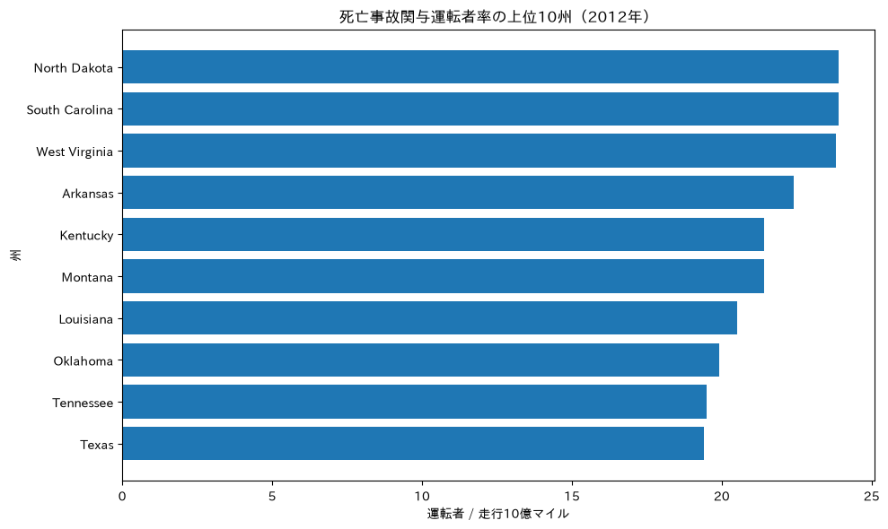

*2012年の走行10億マイル当たり死亡事故関与運転者率を上位10州で比較した横棒図。死亡者数や全事故件数の順位ではありません。Notebookセル9のPNG出力をそのまま抽出しました。*

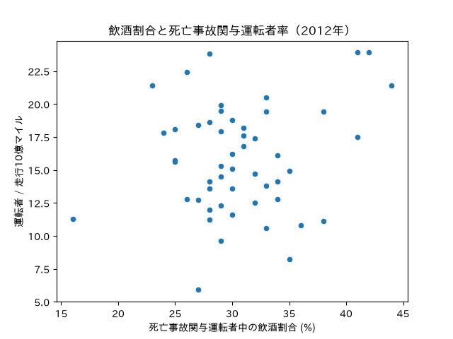

*50州＋DCについて、死亡事故関与運転者中の飲酒割合と総運転者率を比較。両指標は2012年ですが、飲酒割合は全運転者の飲酒頻度を表しません。*

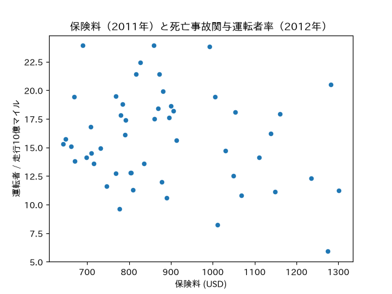

*2011年の保険料と2012年の死亡事故関与運転者率。弱い負相関は、保険料を高くすると安全になるという因果効果の証拠ではありません。*

**AIが生成した追加依頼1 — DC・特定州・相関仕様への依存**

> 初回の相関が弱いという結論は、DCの特殊性、一部の州、直線性の仮定に依存していませんか。DCを除外し、PearsonとSpearmanを比較し、全州のleave-one-outと固定seedの州単位ブートストラップで不確実性を確認してください。弱い相関付近では相対偏差が大きくなる点も分けて説明してください。

**選定理由**: 初回で弱い相関しか得られなかったため、DCや特定州、直線関係を仮定する手法によって結論が変わらないかを優先しました。仕様の安定性、係数の実質的な大きさ、不確実性を分けて評価する依頼です。

**結果・証拠**: 6特徴×DC有無×Pearson/Spearmanの24仕様で、点推定の最大絶対値は0.1997でした。DCを除くと飲酒のPearson相関は0.1758、保険料は−0.1047となりました。1地域ずつ除いたPearson相関の最大絶対値は0.2685で、飲酒の範囲は0.1218～0.2515、保険料は−0.2685～−0.1047です。Notebookで探索上の目安とした絶対値0.30に達する点推定はありませんでした。

州単位のブートストラップは各特徴・各対象で4,000回、seedは `20261002` です。DCを含む／除く全12区間が0を含みました。全地域での飲酒の95%区間は[−0.1629, 0.4781]、保険料は[−0.4551, 0.0913]です。弱い点推定は共通しますが、中程度の関連を完全に排除できるほど区間は狭くありません。

`run_sensitivity` の相対偏差20%基準では6特徴とも `stable=False`、最大相対偏差は特徴別に約0.408～15.367でした。基準値がゼロ付近では相対偏差が膨らむため、これをそのまま「強い関連がある」とも「効果ゼロが頑健」とも読みません。根拠はセル14の感度表、leave-one-out表、ブートストラップ表、`ITERATION1_SUMMARY` と、execution_count 20を参照するセル15のInsightです。残る限界は州の空間依存、小標本、道路・地域・記録方法等の未調整交絡です。区間は全国の運転者リスクの信頼区間ではありません。

**AIが生成した追加依頼2 — 派生率の数学的結合**

> 割合では相関が弱い一方、飲酒関与の死亡事故運転者率に変換すると強い相関が現れませんか。2012年の同年指標に限定して、総率×飲酒割合から派生率を作り、総率が両方に入る数学的結合を固定割合、共分散分解、割合の置換実験で点検してください。派生率の強い相関を飲酒の因果効果や独立した危険因子の証拠と誤解しない説明と図を追加してください。

**選定理由**: 割合の弱い相関と、部分率へ変換したときの強い相関が見かけ上矛盾し得るためです。目的変数である総率が派生指標にも含まれる問題は結論を大きく変え得ます。同年2012年の飲酒指標に限定し、置換を因果効果の検定ではなく数学的結合の診断として選びました。

**結果・証拠**: 2012年の3特徴だけでBH補正をやり直しても、最小qは0.4818でした。一方、飲酒の派生率を `総率×飲酒割合/100` とすると、総率とのPearson相関は0.8526へ強まりました。飲酒割合を全地域で平均割合に固定すると相関は1.0です。総率を固定したまま飲酒割合を州間で5,000回置換すると、相関の平均は0.8347、中央95%範囲は[0.7778, 0.8794]となり、観測値0.8526はその範囲内でした。seedは `20261003`、観測相関以上となる補正付き上側比率は0.2623です。この比率は飲酒の個人リスクについてのp値ではありません。

総率をR、飲酒割合を0～1のPとすると、共分散は `Cov(R, RP) = E[P]Var(R) + Cov(R, R(P−E[P]))` に分けられます。出力は総共分散5.9578、平均割合×総率分散の項5.1116、残差項0.8462で、構造項の比率は約85.8%でした。これは因果的な寄与割合やR²ではありません。DC有無×Pearson/Spearmanでは相関0.8400～0.8950、`stable=True`、最大相対偏差0.0497ですが、数値的安定性は独立した危険因子としての解釈を保証しません。

根拠はセル17の `ITERATION2_SUMMARY`、共分散一致の検算、派生率の感度出力、3パネル図と、execution_count 22を参照するセル18のInsightです。派生率は丸められた2列の積で、分子母集団・測定方法の完全一致は未確認としてmanifestに `inferred` を残しています。

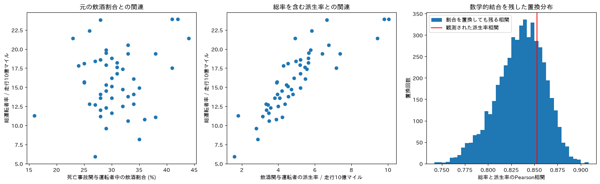

*左は元の飲酒割合との弱い関連、中央は総率を掛けた派生率との強い関連、右は数学的結合を残した5,000回の割合置換分布。赤線の観測相関は分布内にあり、強い派生相関だけで飲酒の因果効果を説明できないことを示します。*

**反復の終了判断**: AIが生成した分析上の追加依頼は上記2件です。3回目は、同年の人口・走行距離・道路条件・全運転者の曝露・記録方法を含む独立データが必要で、現CSVのモデルや検定を増やしても重要な識別問題が解消しないため実施しませんでした。`followup.log` は、この2回の反復を再確認し、未実行の最終監査セルとMCP接続問題への対応を述べています。新たな3回目の分析依頼や結果は保存されていません。

**最終結論**: `status.json` の `analysis_complete=true`、`final_completion.ready=true` と、Notebookの初回分析・2回の反復・日本語結論・4件の根拠付きInsightから、探索分析の成果物は完成したと判断します。このデータでは6特徴の明瞭な単変量の州間関連は検出されず、点推定の弱さはDC除外・順位相関・単一地域除外でも大きくは変わりません。ただし区間は広く、「関連なし」や「飲酒・速度超過は安全」とは結論できません。

最も重要な追加成果は、飲酒割合を派生率に変えるだけで強い相関が生じ、その大部分が総率の共用による数学的結合で説明できることを点検した点です。州差を説明する独立した危険因子や因果効果は特定していません。分析完了と、全コードセル再実行・最終監査・ライフサイクル完了の確認は別であり、後者の成功は以下の証拠からは確認できません。

**監査・再現性**: Notebookの保存先は `benchmark/projects/kaggle-v020-kaggle-exp-14-car-crashes/notebooks/kaggle-v020-kaggle-exp-14-car-crashes.ipynb`、run_idは `v020-exp-14` です。保存済みコードセルは12、execution_count付きは11で、エラー出力はありません。図表はセル9に3枚、セル17に1枚の計4 PNG、Insightは4件です。各Insightの引用値とexecution_countは該当保存出力に対応しています。

| 確認対象 | 指定ファイルから確認できた状態 |
|---|---|
| 構造監査 | `status.json` の初回・最終auditに `nbformat_valid=true`、`error_cells=[]`、図表セル[9, 17]、`visual_findings=[]`。未実行一覧は空だが、監査中の末尾セル25を除外した警告がある。 |
| 全セル再実行 | Notebookは再実行計画を記すが、セル24の実出力とNotebookメタデータは `verification_mode=baseline_recorded`。`replay_matched` の出力はなく、独立カーネルでの全セル一致を確認したとは言えない。 |
| ベースライン | セル24はデータハッシュ、行数、欠損、相関、感度、置換、ブートストラップ、leave-one-outをまとめた初回ベースライン記録を出力。snapshot SHA-256は `c1309984f32de17835a0d55a42c2063c9dbeed65733469cac68bf5a45f5be49d`。別ファイルの実在・内容は今回の指定証拠の対象外。 |
| 最終Notebook監査 | セル25に `audit_notebook(..., visual_audit=True)` はあるが、execution_countはnull、outputsは空。`NOTEBOOK_AUDIT` の実出力はない。外部auditの結果とNotebook内最終監査の完了を同一視しない。 |
| ライフサイクル | セル1は登録後の `state=running` と、実行・書込み・ロック各カウンタ0を出力。最終セルの `FINAL_LIFECYCLE` 出力はなく、`completed` と静穏状態の検証完了は未確認。 |
| 図表 | セル9・17にchartメタデータ、初回図ごとのラベル情報、`missing_glyphs=[]` が保存されている。メタデータなしの監査が空結果になる再現もあり、警告なしを図表品質の全面保証とは扱わない。 |
| 外部ランナー | 初回773.0秒、追加確認92.5秒、両exit_codeは0、終了理由はともに `artifact_complete_cutoff`。両ログ末尾は「Notebook remained stable and passed semantic audit」を理由にプロセス群を停止した旨を記録。正常終了コードだけで最終セル完了は主張しない。 |

**実行上の失敗・未完了部分**: Notebookセル3は、初回にKaggle SDKの `dataset_list` へ `page_size` を渡してTypeErrorになり、公開シグネチャを確認して `search` のみへ修正したと記録しています。保存済みセル2は修正後の検索結果を出力しており、この失敗は取得を最終的に妨げていません。元の例外tracebackは指定ログにはなく、発生経緯はNotebookの記述に基づきます。これは外部SDKの引数互換性の問題で、Jupytermindの改善候補には含めません。

親ディレクトリなしでのJupyter MCPのNotebook作成についても、Notebookは `project_manager.ensure_notebook` を使うbootstrapで解消したと記述していますが、その操作ログは指定証拠にはありません。追加確認ログは「MCPの接続にプロトコル不一致があるため、リポジトリの互換版クライアントで接続し直す」と述べるものの、接続回復・再実行完了の出力はありません。これをJupytermind内部の不具合と断定しません。また、外部ランナーは成果物の安定とauditを条件に打ち切っています。打ち切りと未完了セルはともに確認できますが、最終セル未完了の直接原因を特定する詳細ログはありません。分析そのものの失敗ではなく、要求された再実行・最終監査・完了状態の記録について証拠が不足した状態です。

**Jupytermindの改善候補**: Notebookの候補記録と直接APIの診断に基づき、3件を `issue-candidate.json` に保存しました。実装を修正した、または不具合を確定したという意味ではありません。

| 分類 | 候補・観測された挙動 | 影響・回避策・証拠の限界 |
|---|---|---|
| 可視化のレイアウト機能不足 | 長い州名の縦棒図でラベル下端が切れたとセル20に記録。セル22で表示した `render_chart` の公開シグネチャにfigsize・余白調整引数はない。 | 最終セル9はMatplotlibの横棒図、`tight_layout`、`bbox_inches='tight'` で回避。修正前のPNG自体は指定Notebookに残っておらず、切れの発生は履歴記述に基づく候補。 |
| データ定義の未検証項目抽出の仕様不足 | `unresolved_fields()` がunknownだけを返し、inferredの走行距離分母が漏れる。セル22は `INFERRED_NOT_RETURNED ['variables.fatal_driver_rate.exposure_denominator']` を出力。 | 推測した前提を未解決一覧だけから追跡できない。セル6でinferredを別途列挙して回避。Notebookは仕様どおりの可能性を明記しており、契約違反とは断定しない。 |
| 図表監査のメタデータ欠如の見逃し | 非空PNGにchartメタデータを付けず `audit_visual_outputs` を実行すると、セル22で `NO_METADATA_VISUAL_FINDINGS []`、`NO_METADATA_PRESENT {}`。 | 監査用情報がないことと、監査して問題がないことを区別できない。実図ではchartメタデータと文字警告記録を付けて回避。画像内のラベル欠損そのものをこのprobeが証明したわけではない。 |

上記はJupytermindの可視化・定義・監査APIの候補です。Kaggle SDKのTypeError、MCP接続のプロトコル不一致、外部ランナーの成果物条件による停止は別枠です。`mcp_gateway.run_and_record` は同一カーネルへの再帰的なMCP接続を避けるため非適用と記録されており、Notebookは直接のJupyter MCP実行を採用しています。この環境上の適用制限も、それだけでJupytermindの不具合とは扱いません。

**残る限界**: 対象は2009～2012年の異年混在データであり、現在の交通安全状況ではありません。走行距離正規化は人口・交通量差の一部を調整しても、都市化、道路構造、天候、車種、救急アクセス、州別の認定・記録差を揃えません。`measurement` / `temporal` / `independence` の結論に重要な前提警告は未解決です。各列の詳細測定方法、走行距離の測定・車種範囲、派生率の母集団一致、ライセンスも十分に確認されていません。

死亡事故関与運転者だけを分母とする特徴割合には選択・構成比の問題があり、全運転者の飲酒・速度超過の曝露は不明です。州を等重みとする横断集計なので、生態学的誤謬、未調整交絡、逆因果、空間依存を排除できず、因果効果も全国の個人リスクも推定していません。独立した同年・同一定義の参照データがないため、独立検証・データセット比較は非適用としています。分析を深めるには追加の独立データが必要であり、本実験の図表・根拠記録の完成と、再実行・最終監査の未確認部分は区別して評価する必要があります。

## 実験15: Dots（分析完了・反応時間と判断確率は推定不能）

**課題**: 「Kaggle検索で見つかる知覚実験のDotsデータで、刺激条件と反応時間・判断の関係を調べてください。」

**初回プロンプト（全文・原文）**: 「Kaggle検索で見つかる知覚実験のDotsデータで、刺激条件と反応時間・判断の関係を調べてください。変数の意味と実験単位を自分で把握して計画し、適切な図表と統計を選び、解釈の限界を説明してください。AI Data Scientist SkillとJupyter MCPを用い、計画・コード・出力・根拠付きInsightを保存し、再実行してください。 Kaggle参照先: https://www.kaggle.com/datasets?search=dots+perception+experiment。インストール済みkaggle Python SDKを使い、NotebookのJupyter MCP実行セル内で`KaggleApi().authenticate()`、`dataset_list(search=...)`、`dataset_list_files(...)`、必要に応じて`dataset_download_file(...)`を呼び出し、Kaggle上の対応する公開データを検索・取得してください。owner/dataset slug、取得ファイル名、取得日、ファイルSHA-256をNotebookに記録してください。APIトークンをセル出力・Notebook・ログへ表示しないでください。分析・API取得コードの実行はJupyter MCPだけを使い、端末コマンド、subprocess、外部スクリプト起動、作業エージェントへの委譲は行わないでください。Kaggle APIで対応データを検索・取得できなかった場合に限り、`/home/nahisaho/kaggle/experiments/white-paper.md`に記載された旧実験の公開CSV `https://raw.githubusercontent.com/mwaskom/seaborn-data/master/dots.csv` を取得して実験を継続してください。その場合はKaggle APIの失敗内容、フォールバックした理由、CSV URL、取得日時、SHA-256をNotebookに記録し、公開CSVとKaggle掲載版の完全な同一性は保証されないことを明記してください。保存先は benchmark/projects/kaggle-v020-kaggle-exp-15-dots/notebooks/kaggle-v020-kaggle-exp-15-dots.ipynb としてください。run_idは `v020-exp-15` です。長時間処理の開始前にlifecycle.register_runを呼び、実行・書込みフェーズを記録し、終了時にcompletedまたはfailedを記録してください。データ定義manifest、分析前提manifest、意味的な異常検査、妥当な範囲の感度分析を使い、適用できない機能は理由を記録してください。図表はvisual_audit=Trueで監査してください。Notebookには「使用したJupytermindモジュール」節を設け、直接import・呼び出したモジュール名、関数名、使用目的を記録してください。間接利用は使用済みに含めないでください。Jupytermindの不具合または機能不足が疑われた場合は「Jupytermind改善候補」節を設け、分類、再現条件、期待する挙動、実際の挙動、影響、回避策、関係するセルとログを記録してください。Copilot CLI、Kaggle API、ベンチマークランナーに固有の問題とは切り分け、候補がなければ「なし」と記録してください。初回分析後、自分で結果を読み直し、結論に実質的な影響を与える未解決点があれば自然言語の追加依頼文を作成し、Notebookの「反復依頼履歴」に原文のまま記録して実行してください。価値ある追加分析がなくなるまで最大3回繰り返し、各反復の選定理由・結果・証拠・残る限界を報告してください。最後に全コードセルを上から再実行し、notebook_auditとライフサイクル状態を記録してください。」

**使用したJupytermindモジュール**: 以下はNotebookのimport・直接呼び出しコードと保存出力で確認したものです。外部ライブラリや間接利用は含めません。末尾の自己監査セルは実行番号・出力が保存されていないため、そのセルにある呼び出しは保存済メタデータとの対応を示し、全呼び出しの正常終了を一括して断定しません。

| モジュール | 直接呼び出した関数・クラス・メソッド | 使用目的 |
|---|---|---|
| `ai_data_scientist.project_manager` | `resolve_project`, `ensure_notebook`, `ensure_data_dir`, `enqueue_write` | プロジェクト・保存先の解決、Notebook作成、データ保存先確保、ソース・メタデータの書込み |
| `ai_data_scientist.language_router` | `detect_language` | 日本語の選択 |
| `ai_data_scientist.lifecycle` | `register_run`, `is_cancel_requested`, `mark_execution_start`, `mark_execution_end`, `mark_write_start`, `mark_write_end`, `get_run_status` | 長時間処理前の登録、キャンセル確認、実行・書込みフェーズの記録 |
| `ai_data_scientist.ingestion` | `SourceSpec`, `ingest` | 取得済みCSVの読み込みと行数上限の適用 |
| `ai_data_scientist.eda` | `explore` | 型、欠測、カテゴリ、要約統計の確認 |
| `ai_data_scientist.cleaning` | `clean_dataset` | 完全重複の検査。削除0行を確認 |
| `ai_data_scientist.data_definition` | `FieldValue`, `build_manifest`, 戻り値の`unresolved_fields` | 来歴・変数定義のmanifest作成、未確認と推定の区別 |
| `ai_data_scientist.analysis_assumptions` | `Assumption`, `AnalysisAssumptionManifest`, `check_manifest` | 記述的分析の範囲、前提、結論に影響する未解決事項の確認 |
| `ai_data_scientist.data_quality` | `detect_anomalies` | 許容カテゴリ・範囲・欠測の意味的検査 |
| `ai_data_scientist.sensitivity` | `SensitivityPlan`, `run_sensitivity` | 36仕様の感度分析と相対偏差20%の安定性判定 |
| `ai_data_scientist.visualization` | `render_chart`, `build_image_output` | 共通窓の標準折れ線図生成とPNG MIME出力。複数パネルはMatplotlibで描画 |
| `ai_data_scientist.insight_engine` | `record_insight`、末尾セルの`extract_cited_value` | 最小再現での根拠照合、主分析の引用値抽出・Insight保存。根拠付きInsightは6セル保存 |
| `ai_data_scientist.notebook_audit` | `audit_notebook(..., visual_audit=True)` | PNG・実行状態・根拠の監査、および図メタデータ欠落の最小再現 |

`lifecycle.mark_completed`と`wait_for_quiescence`は末尾セルに直接記述され、Notebookメタデータには`completed`と実行・書込み・ロックの各残数0が保存されています。`mark_failed`は失敗時の処理として記述されていますが、最終再実行で呼ばれたことは確認できません。例外型`insight_engine.EvidenceMissingError`は最小再現で捕捉されています。

`mcp_gateway`と`stats_analysis`は直接利用していません。前者は実行中カーネルからホストのMCPクライアントを呼ぶ構造を避け、後者の相関p値は独立標本という前提を満たさないためです。独立参照データがない比較・異常検証や、試行IDを要する混合モデル、反応時間モデル、判断ロジスティックモデルも不適用と記録しました。

**初回指示**: 分析計画・統計手法・図表はAIに選ばせ、変数の意味と実験単位を先に確認するよう求めました。Kaggle API取得を優先し、取得不能の場合だけ指定公開CSVへのフォールバックを許可しています。来歴・SHA-256、データ定義と分析前提、意味的検査、感度分析、直接利用モジュール、改善候補、最大3回の自律的追加依頼、上からの再実行、図表監査とライフサイクル記録を要求しました。具体的な時間窓や追加分析項目は指定していません。

**データ取得と問いの修正**: Notebook内のKaggle SDKで認証し、`dots perception experiment`、`dots`、`seaborn dots`を検索しました。一般的なdots検索にはゲーム・画像等が混在したため、`daryasikerina/seaborn-dots-dataset`を選び、ファイル一覧を確認して`dots.csv`を取得しました。公開CSVへのフォールバックは使っていません。

| 項目 | Notebookに記録された内容 |
|---|---|
| 取得元・ファイル | Kaggle `daryasikerina/seaborn-dots-dataset` / `dots.csv` |
| 初回取得日時 | 2026-10-01T18:45:11.955456+00:00（`first_pass_reference`） |
| 再取得日時 | 2026-10-01T18:58:14.862331+00:00（保存済`provenance`と取得セル出力） |
| SHA-256 | `dd8ed5e18358ec23250ecc877c98d0212c0419d0152e1bf5387b20341059842b` |
| サイズ・列 | 848行×5列：`align`, `choice`, `time`, `coherence`, `firing_rate` |
| 条件構成 | 整列2種×選択条件2種×coherence 6水準＝24曲線 |
| 品質検査 | 欠測・完全重複・複合キー重複・数値列の非有限値・設定スキーマ上の意味的異常はいずれもなし。各曲線の時間間隔は20 |
| メタデータ上の制約 | Kaggle説明文は空、ライセンスは`unknown`。原版CSVとの完全同一性と加工経路は未確認 |

AIは、848行を848試行として扱えないことを先に明示しました。CSVは条件×時間点に一意な神経発火率曲線で、`time`は負値も含むイベント基準の相対時刻です。刺激開始への整列を`dots`、眼球運動への整列を`sacc`と推定していますが、時刻のms、coherenceの%、発火率のspikes/sという単位はCSV内で検証できません。`choice`のT1/T2は選択条件であり、正答／誤答や受容野との対応も未確認です。以降はCSV数値単位で記述し、**反応時間・正答率・選択確率の推定から、条件別神経曲線の比較へ分析範囲を限定**しました。

出典確認では、SeabornのREADMEと利用例、および原論文の抄録を照合した記録がNotebookにあります。原実験公開ページはタイムアウトでした。原論文が報告する判断速度・正確性の変化は今回のCSVから再推定した結果ではなく、出典の文脈説明にとどめています。

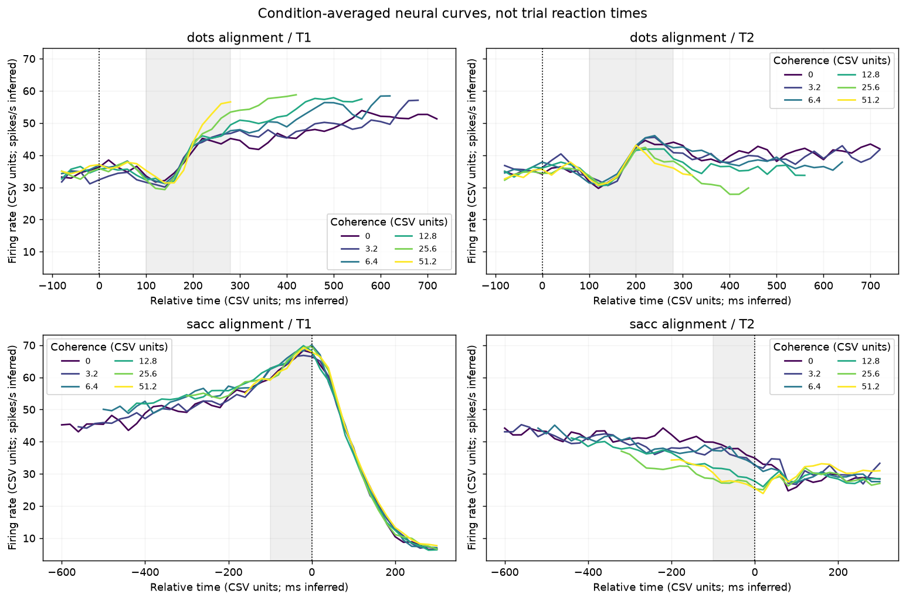

*刺激整列と眼球運動整列をT1/T2別に表示した24条件曲線。灰色は比較窓、点線は整列基準時刻。横軸は反応時間ではなく相対時刻で、曲線端点も試行反応時間を表さない。*

**初回結果**: 全条件に共通する時間範囲は、`dots`が−80〜280、`sacc`が−160〜300でした。AIは主窓を`dots`の100〜280、刺激前ベースラインを−80〜−20、別整列の比較窓を`sacc`の−100〜0に設定しました。主窓には各曲線10時間点があり、同時刻のT1−T2差、窓内平均、100時間単位あたりの線形傾きを計算しました。

| coherence（CSV数値） | 主窓の平均T1−T2差 | T1の傾き／100時間単位 | T2の傾き／100時間単位 |
|---|---:|---:|---:|
| 0.0 | 0.630844 | 8.651717 | 9.146003 |
| 3.2 | 0.751051 | 10.921339 | 8.047252 |
| 6.4 | 0.691588 | 10.219085 | 8.828172 |
| 12.8 | 2.489161 | 11.056977 | 6.490141 |
| 25.6 | 3.942871 | 14.618002 | 4.788281 |
| 51.2 | 6.517286 | 15.773326 | 3.909909 |

coherence 51.2と0の「T1−T2差の差」は5.886442でした。coherenceと傾きのSpearman係数はT1で0.942857、T2で−0.942857です。ただし6設計水準の記述量として報告し、p値を付けていません。時間点は自己相関し、独立な個体・ニューロン・試行数が不明なため、母集団検定、信頼区間、行単位ブートストラップも行いませんでした。`sacc`の比較窓では平均T1−T2差が27.045261〜37.967434でしたが、同じ記録の別整列なので独立した再現とは扱っていません。

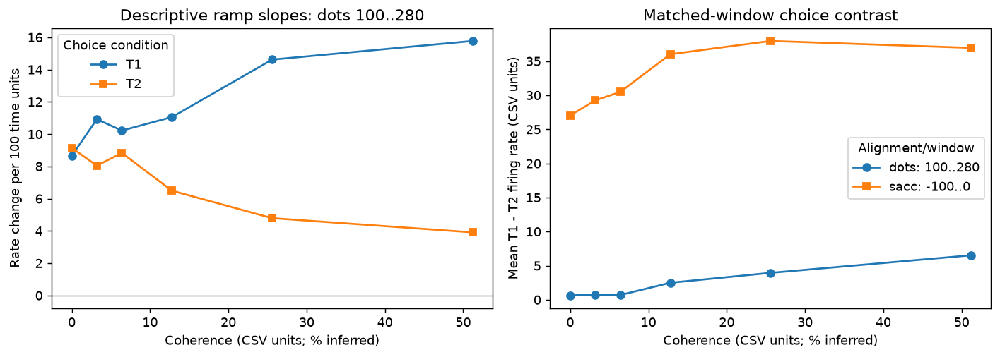

*左は刺激整列100〜280の傾き、右は二つの整列・窓における平均T1−T2差。刺激強度と関連する形状を示すが、標本間の有意差や行動判断確率を示す図ではない。*

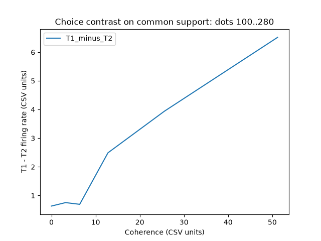

*`visualization.render_chart`で生成した主窓100〜280の平均T1−T2差。高低coherenceの差は正だが、全6水準で厳密に単調増加しているわけではなく、窓外への一般化もできない。*

**AIが生成した追加依頼1 — 時間窓・要約方法・ベースラインへの感度**

> 共通時間窓で刺激強度が高いほどT1−T2の発火率差が大きいという初回結果について、窓の開始・終了時刻、平均と中央値、刺激前ベースライン補正を変えてください。OLSとTheil–Senの傾きも比較し、効果の方向と大きさのどこまで安定しているかを区別してください。試行レベルの有意差や反応時間効果には読み替えないでください。

**選定理由**: 初回図と要約を読み直し、主窓に共通の刺激誘発波形が含まれること、刺激前のT1/T2差がゼロでないこと、曲線が非線形であることを未解決点としました。平均差が窓と要約方法に依存するなら、初回の一般化は維持できません。

**結果**: 開始時刻100・140・180、終了時刻280・260・240、平均／中央値、未補正／ベースライン補正を組み合わせた36仕様をすべて実行しました。高低coherenceの差の差は−2.481877〜11.661608で、符号まで変化しました。主窓の平均では未補正5.886442、補正後3.590353ですが、同じ窓の補正後中央値は−0.467905でした。最大相対偏差は1.421626で、最初の仕様に対する許容0.20を超え、`stable=False`です。この仕様範囲は信頼区間ではありません。

一方、検討した3窓ではOLSとTheil–Senとも高低coherenceの傾き差がT1で正、T2で負でした。主窓のOLSではT1が+7.121609、T2が−5.236094、Theil–Senでは+7.723061、−5.715513です。AIは「傾き差の方向」と「平均レベル差の安定性」を分け、**刺激強度が高いほど選択条件差が常に大きいという一般化を撤回**しました。証拠は`iteration-1`セルの36仕様表、傾き比較表、出力トークンです。単位、集約方法、平滑化、独立反復の不明点は残りました。

**AIが生成した追加依頼2 — 符号反転を時間経過に分解**

> 感度分析では刺激強度によるT1−T2差の変化が一部の仕様で負になりました。高coherenceとゼロcoherenceの選択差の差を、共通サポート上で時間点ごとに表示し、刺激前差を差し引いた系列も併記してください。窓平均・中央値が食い違う原因を時間経過から調べ、全時間帯で同じ方向に働くという結論を維持できるか判断してください。符号交差を反応時間や統計的な効果発現時刻と呼ばないでください。

**選定理由**: 追加依頼1で効果の符号まで変わったため、都合のよい窓へ選び直すのではなく、共通時間範囲全体を表示して初回結論を再評価しました。

**結果**: coherence 51.2と0の選択条件差の差を時間点ごとに計算し、刺激前差を差し引きました。補正済み平均は100〜140で−1.961059、160〜200で−3.329846、220〜240で8.918975、260〜280で16.969147でした。主窓10点のうち正なのは4点です。後半の大きい正の差が窓平均を押し上げ、中央値は前半の小さい／負の時間点を反映するため、平均と中央値の結論が一致しません。

AIは全時間帯で同方向という結論を維持せず、時間依存の差として記述しました。証拠は`iteration-2`セルの時間別表、探索的ブロック表、PNGと出力トークンです。ブロックや時間点は独立標本ではなく、符号交差は反応時間・統計的潜時・効果発現時刻の推定ではありません。未知の平滑化方法による制約も残ります。

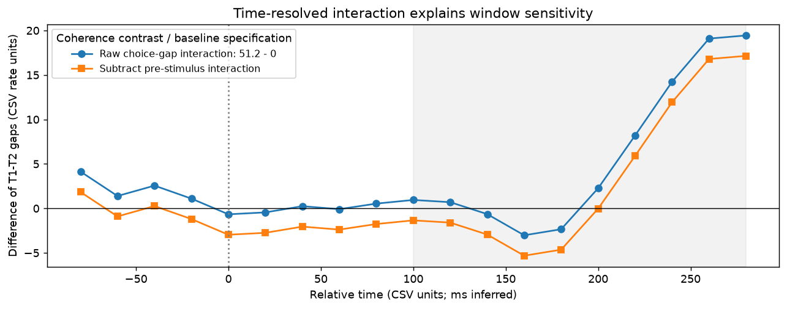

*未補正系列と刺激前差を差し引いた系列。主窓前半と後半で方向が異なり、後半の大きい差が平均を押し上げる。ゼロ交差を行動反応時間や効果発現潜時と解釈しない。*

**AIが生成した追加依頼3 — 曲線の支持域と行動指標の誤読**

> 時間依存の差は確認できましたが、条件ごとに曲線の長さが違うため、反応時間や判断頻度を誤って読み取る危険が残ります。dotsの終点とsaccの始点、条件別時間点数の関係を調べ、全行を使う不揃いな時間平均と共通窓平均を対比してください。T1/T2の行数比も共通サポートへの切り取りでどう変わるか確認し、CSVから行動反応時間・正答率・選択確率を推定できない理由を具体的に説明してください。

**選定理由**: 元の問いが反応時間・判断との関係である以上、刺激強度ごとの曲線の長さや行数を、行動指標と取り違えるリスクを解消する必要がありました。

**結果**: T1の`dots`曲線はcoherence 0で終点720・41時間点、51.2で終点280・19時間点でした。対応する`sacc`始点は−600と−160です。T1/T2×6刺激水準の全12条件で`dots`終点＋`sacc`始点＝120でした。これは整列間の機械的な切り取り関係を示唆しますが、具体的な規則や平均反応時間との関係は確認できません。

不揃いな全曲線平均によるT1−T2差はcoherence 0で4.526825、51.2で4.169266でした。共通窓100〜280の0.630844、6.517286とは、大小関係も異なります。また全848行のT2比率は0.507075でしたが、整列ごとの共通時間範囲に限定した516行では0.500000になりました。**切り取りだけで変わる行数比は、判断の分母を持つ選択確率ではありません。** AIは曲線端点を反応時間、T1/T2の行数を判断頻度として報告しませんでした。証拠は`iteration-3`セルの端点表、平均対比表、行数比診断、PNGと出力トークンです。

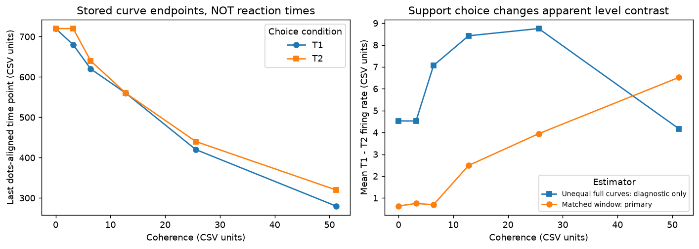

*左は保存された刺激整列曲線の終点で、反応時間ではない。右は不揃いな全曲線平均と共通窓平均の対比。異なる時間帯を混ぜる集計が刺激条件の比較を変えることを示す診断図。*

**最終結論**: 指定共通窓100〜280では、coherence 51.2と0の平均選択条件差の差は正の5.886442でした。しかし時間窓・要約方法・ベースラインを変えた36仕様では符号と大きさが変わり、「刺激が強いほどT1−T2差が常に大きい」とは結論できません。傾き差の方向が検討範囲で保たれたことも、平均差や全時間帯の効果が安定であることを意味しません。最終的に支持されるのは、**保存された条件別神経曲線には時間依存の差があり、共通窓を明示した記述的比較が必要**という結論です。

依頼された行動反応時間、正答率、選択確率については、必要な列・独立試行・判断分母がなく推定不能です。3回の反復後に残った問題はデータ定義・試行情報の不足であり、同じCSVの追加計算では解消できません。AIは最大3回に到達し、追加検定や最適窓探索は擬似精度を増すとして停止しました。`status.json`の`analysis_complete=true`、`final_completion.ready=true`と、保存された初回・3反復・6根拠付きInsightを分析完了の根拠とします。これは元の問いの全指標を推定できたことや、全コードセルの実行完了が保存出力で確認できたこととは区別します。

**監査・再現性**: Notebookは`benchmark/projects/kaggle-v020-kaggle-exp-15-dots/notebooks/kaggle-v020-kaggle-exp-15-dots.ipynb`、run_idは`v020-exp-15`です。初回ログには3反復を反映し、全コードセルを上から再実行して出典・根拠・図を確認する旨が記録されています。Notebookメタデータの`reexecution_checks`はSHA-256、主効果、感度分析の最小・最大・最大相対偏差、前半・後半の補正済み平均、二つの行数比の9項目すべて`true`でした。末尾コードに記載された数値照合の許容値は`rtol=1e-10, atol=1e-10`です。

保存済監査はnbformat妥当、コード12セル中実行番号付き11セル、エラーセルなし、未実行指摘なし、図出力セルの0始まり添字は9・13・15、根拠付きInsightは6セルです。PNGはこれら3セルから計5点を抽出しました。`visual_audit=True`による保存済`visual_findings`は空で、`notebook_audit_ok=true`です。主図セルにはタイトル・軸・凡例・字形確認のメタデータがあります。複数パネル図の保存コードでは字形警告を捕捉し、ラベルは英語で描画しています。ただし監査成功は図の科学的妥当性や全ラベルの正しさを保証しません。

**自己監査の保存状態には留保があります。** 末尾セル（添字28、`final-audit`）は`execution_count=null`で出力もなく、監査は「実行がまだ完了していない末尾の自己監査セルを未実行指摘から除外した」という警告を残しています。したがって「全12セルが実行完了し、その出力まで保存された」「監査警告0件」とは書けません。一方、同じNotebookの保存済メタデータにはライフサイクル`completed`、実行中セル・保留書込み・ロック各0と再実行一致が記録されています。完了メタデータの存在と、末尾セルの実行出力が未保存であることを併記します。再実行・監査節に記載された別ファイルへの保存予定だけから、外側での再監査が完了したとは判断しません。

初回・追加確認ログは、いずれも外部ランナーが「Notebook remained stable and passed semantic audit」を理由にプロセス群を停止したところで終わっています。`status.json`では両段階の終了理由が`artifact_complete_cutoff`、exit codeが0、所要時間が初回1250.9秒・追加確認96.4秒です。安定したNotebookのサイズは両段階とも1,009,025バイト、mtimeも同じでした。**exit code 0は自然なセッション終了や末尾セル保存完了の証拠には使いません。** 追加確認ログは既存証拠の確認と再実行の方針を述べるだけで、4回目の追加依頼や新しい分析結果は確認できません。なお`phase_log`には`initial_analysis`の終了時刻が開始時刻より前の組もあり、これだけから厳密な処理順序や所要時間を再構成することもできません。

**失敗・問題の切り分け**: 最終保存Notebookに分析エラーセルはありませんが、元の依頼の反応時間・正答率・判断確率の定量化はデータ不足で達成していません。Notebookが記録する準備時の問題には、生成コードの引用符による`SyntaxError`、Kaggleメタデータの`info`階層の読み違い、広すぎた文献検索、Jupyter MCP対象の親ディレクトリ未作成があります。引用符修正、取得情報の再確認、検索の絞り込み、bootstrapでの準備により対処したと記録されています。これらは生成分析コード・環境準備の問題で、Jupytermindの機能不具合とは同一視しません。

原実験サイトのタイムアウトと旧Seaborn文書URLの404は外部参照先・ネットワークの問題です。Kaggle APIの認証・検索・取得は成功しており、説明・ライセンスの不足は掲載データの来歴上の限界です。Copilot CLI固有の不具合は指定証拠から確認できません。ランナーによる成果物安定時の停止と末尾セルの未保存は観測できますが、停止が未保存を引き起こしたという因果関係や、Jupytermind側の欠陥とは断定できません。

**Jupytermind改善候補**: Notebookの`jupytermind-probes`セルは、外部API・Copilot CLI・ランナーを再現条件に含めない小さなNotebookを作り、次の2件を直接検査しています。確定不具合や修正済みとはせず、機能不足・監査カバレッジ不足の候補として`issue-candidate.json`へ保存しました。

| 分類・対象 | 再現条件と期待する挙動 | 実際の挙動・影響・回避策 |
|---|---|---|
| 証拠照合の出力形式：`insight_engine.record_insight` | 実行番号1のセルにstdout `STREAM_PROBE=7`を保存し、同じ値を根拠として記録。実在するstreamも照合できることを期待 | `EvidenceMissingError`を捕捉。通常のprint出力だけでは正常な根拠を拒否する候補。主分析は`display(Markdown(...))`のMIME出力で引用値を照合 |
| 図メタデータ欠落の通知：`notebook_audit.audit_notebook` | PNGのある実行済みセルからchartメタデータを省き、`visual_audit=True`で監査。ラベル・字形の監査情報欠落を通知することを期待 | `ok=True`, `visual_findings=[]`。字形・タイトル・軸・凡例の確認情報がない状態を、図監査済みと誤読するリスク。主Notebookは描画時の確認情報を明示的に付与 |

証拠は同セルのコード・実行出力、Notebookメタデータの`jupytermind_improvement_candidates`、改善候補節です。同セルは`data/jupytermind_probe_log.json`への記録も記述していますが、本節の判定は指定されたNotebook内の結果に基づきます。図メタデータ欠落の検査は、誤った図を実際に描いて見逃させた試験ではありません。確認できたのは「監査情報がないPNGでも欠落通知なしで成功扱いになる」という範囲です。

**残る限界**: 24曲線の独立な試行数・個体数・ニューロン数、重み、平滑化・集約方法、T1/T2の正解方向・受容野への対応、CSV加工辞書が不明です。時間・coherence・発火率の物理単位も未検証で、最終分析前提manifestには`unit_mapping`の未検証警告が残っています。窓選択は感度分析で検査済みに変わりましたが、安定性を確認したのではなく、依存性を明らかにした結果です。意味的異常が検出されなかったことも、設定したスキーマ内での検査結果にすぎません。原版との同一性、ライセンス、原実験の加工経路は確認できず、母集団推論、因果効果、個別試行の判断閾値・潜時は主張できません。

## 実験16: Dow Jones（分析完了）

**課題**: 「Kaggleで公開されているDow Jones株価時系列に相当するデータを用い、期間中のトレンドと変動の特徴を分析してください。」

**初回プロンプト（全文・原文）**: 「Kaggleで公開されているDow Jones株価時系列に相当するデータを用い、期間中のトレンドと変動の特徴を分析してください。時系列に合う分析計画と図表を自分で選び、価格水準とリターンの違いや将来予測の限界を日本語で説明してください。AI Data Scientist SkillとJupyter MCPで分析を記録し、再実行できるか確認してください。 Kaggle参照先: https://www.kaggle.com/datasets?search=dow+jones+historical+data。インストール済みkaggle Python SDKを使い、NotebookのJupyter MCP実行セル内で`KaggleApi().authenticate()`、`dataset_list(search=...)`、`dataset_list_files(...)`、必要に応じて`dataset_download_file(...)`を呼び出し、Kaggle上の対応する公開データを検索・取得してください。外部CSVミラーは使用しないでください。owner/dataset slug、取得ファイル名、取得日、ファイルSHA-256をNotebookに記録してください。APIトークンをセル出力・Notebook・ログへ表示しないでください。分析・API取得コードの実行はJupyter MCPだけを使い、端末コマンド、subprocess、外部スクリプト起動、作業エージェントへの委譲は行わないでください。APIで対応するデータが見つからない場合は外部ソースにフォールバックせず、その実験を停止して理由を報告してください。保存先は benchmark/projects/kaggle-v020-kaggle-exp-16-dowjones/notebooks/kaggle-v020-kaggle-exp-16-dowjones.ipynb としてください。run_idは `v020-exp-16` です。長時間処理の開始前にlifecycle.register_runを呼び、実行・書込みフェーズを記録し、終了時にcompletedまたはfailedを記録してください。データ定義manifest、分析前提manifest、意味的な異常検査、妥当な範囲の感度分析を使い、適用できない機能は理由を記録してください。図表はvisual_audit=Trueで監査してください。Notebookには「使用したJupytermindモジュール」節を設け、直接import・呼び出したモジュール名、関数名、使用目的を記録してください。間接利用は使用済みに含めないでください。Jupytermindの不具合または機能不足が疑われた場合は「Jupytermind改善候補」節を設け、分類、再現条件、期待する挙動、実際の挙動、影響、回避策、関係するセルとログを記録してください。Copilot CLI、Kaggle API、ベンチマークランナーに固有の問題とは切り分け、候補がなければ「なし」と記録してください。初回分析後、自分で結果を読み直し、結論に実質的な影響を与える未解決点があれば自然言語の追加依頼文を作成し、Notebookの「反復依頼履歴」に原文のまま記録して実行してください。価値ある追加分析がなくなるまで最大3回繰り返し、各反復の選定理由・結果・証拠・残る限界を報告してください。最後に全コードセルを上から再実行し、notebook_auditとライフサイクル状態を記録してください。」

**使用したJupytermindモジュール**: 名前空間は `ai_data_scientist` です。保存されたNotebookのコードで直接import・呼び出しを確認できるモジュール、関数・型、目的を示します。統計モデルやブートストラップは、以下のヘルパーだけで完結するものではなく、Notebook内のNumPy・pandasによる分析コードも使っています。

| モジュール | 直接使用した関数・型 | 使用目的 |
|---|---|---|
| `project_manager` | `resolve_project`, `ensure_notebook`, `ensure_data_dir` | プロジェクト、Notebook、データ保存先の解決・準備 |
| `language_router` | `detect_language` | 日本語の指定を確認 |
| `lifecycle` | `register_run`, `mark_execution_start`, `mark_execution_end`, `mark_write_start`, `mark_write_end`, `is_cancel_requested`, `mark_failed`, `mark_completed`, `get_run_status`, `wait_for_quiescence` | 実行・書込みフェーズ、中止要求、終了・静止状態の記録 |
| `ingestion` | `SourceSpec`, `ingest` | Kaggle SDKで取得したローカルCSVを行数上限付きで読み込む |
| `cleaning` | `clean_dataset` | 重複行の処理と影響を記録。削除は0行 |
| `eda` | `explore` | 水準・リターン・出来高の型、欠損、要約統計 |
| `data_quality` | `detect_anomalies` | 日付一意性、曜日、OHLC整合、値域の意味的検査 |
| `anomaly_detection` | `detect_anomalies` | 3σを超えるリターンを旗付け。除去には使わない |
| `data_definition` | `FieldValue`, `build_manifest`, `DataDefinitionManifest.unresolved_fields` | 出典・定義を確認済み、推定、未確認に分ける |
| `analysis_assumptions` | `Assumption`, `AnalysisAssumptionManifest`, `check_manifest` | 記述的分析の範囲と結論に重要な未検証前提を記録 |
| `stats_analysis` | `correlation` | 隣接する絶対リターンのPearson相関と日本語解釈 |
| `sensitivity` | `SensitivityPlan`, `run_sensitivity` | リターン定義、年率係数、対象期間、学習切点の感度分析 |
| `visualization` | `render_chart`, `build_image_output` | 日本語ラベル付き6図を生成し、PNGのMIME出力を残す |
| `insight_engine` | `extract_cited_value`, `record_insight` | 保存された引用・実行番号の整合検査と、stream証拠制約の再現 |
| `notebook_audit` | `audit_notebook(visual_audit=True)` | Notebook構造、実行状態、証拠、図表の監査 |

Notebookのモジュール一覧には準備セルからの `project_manager.enqueue_write` 使用も記載されていますが、保存された本Notebookのコードにはその呼出しが残っていないため、上表の直接呼出しには含めません。`insight_engine.record_insight` の保存コード上の呼出しは改善候補の再現セルです。10件の洞察は証拠manifest付きで保存されていますが、それらの生成用呼出しがすべて本Notebookのコードに残っているとは扱いません。間接依存や、呼び出していない関数は使用実績に数えません。

**初回指示**: 手法を固定せず、時系列に合う計画・図表を自律的に選び、価格水準とリターン、過去記述と将来予測を区別するよう求めました。取得は認証済みKaggle SDKに限定し、分析コードはJupyter MCPで実行する条件です。来歴・ハッシュ、定義と前提のmanifest、意味的品質検査、感度分析、図表監査、ライフサイクル、最大3回の自律的追加依頼、全セル再実行も要求しています。Notebookの計画は、データ定義確認、時間順整列、水準・対数水準・リターン・ドローダウンの比較、変動性・分布・自己相関、時系列順の予測検証という順序でした。

**データ取得**: `dataset_list` で `dow jones historical data`、`dow jones`、`djia` を検索し、重複をまとめた候補は41件でした。`dataset_list_files` と `dataset_metadata` で候補を確認し、複数の市場局面を含む長い日次系列として次のCSVを取得しました。もう一つの確認候補は2020年第1四半期の1分足で、目的と頻度・期間が異なるため取得していません。外部CSVミラーへのフォールバックはありません。

| 項目 | Notebookに記録された内容 |
|---|---|
| owner/dataset slug | `hussainbinwali/dow-jones-industrial-average-dataset-2007-to-2021` |
| ファイル名 | `Dow Jones Industrial Average Historical Data 2007 to 2021.csv` |
| 取得日時 | `2026-10-01T17:26:49.664767+00:00`（UTC、日本時間2026-10-02 02:26:49） |
| サイズ | 270,471 bytes |
| SHA-256 | `d4bb4e35f77e1e717b1675c9f42f8158c34468b3b1bb284cd1c3e1bf0d6923cd` |
| 掲載ライセンス | `CC0-1.0` |
| 取得データ | 3,524行・7列。`Date`, `Price`, `Open`, `High`, `Low`, `Vol.`, `Change %` |
| 実測期間 | 2007-07-02〜2021-06-30 |

公開metadataの開始月は2007年1月ですが、CSVの開始日は2007年7月2日でした。分析には実測期間を使い、この不一致を品質記録に残しています。日次頻度、`Price` の終値相当という解釈、指数ポイントという単位は、辞書で確認された定義ではなく推定です。原提供者、タイムゾーン、配当・物価調整、独立した取引日カレンダーによる完全性は未確認です。

CSVを日付昇順に並べ、数値のカンマ・百分率表記を変換しました。重複行削除は0行、日付重複・OHLC矛盾・掲載変化率との丸め不一致はいずれも0件で、指定したスキーマに対する意味的指摘もありませんでした。ただし、`Vol.` の `-` は読み込み時の欠損判定では捉えられず、変換後には723件の欠損となっています。ゼロへの置換・補完はしていません。最大日付間隔は5暦日ですが、祝日か欠落かを独立に確認できないため、取引日を機械的に追加・補間しませんでした。3σを超えるリターン61件も、危機時の実変動を含むため削除していません。先頭のリターンは前日価格がなく計算できず、リターン標本は3,523件です。

**初回結果**: 初回実行の中で、水準・後方移動平均、基準日からの対数価格比、単純リターン、ローリング年率変動性、ドローダウン、リターン分布の6図を作成しました。主要数値は `initial-summary`（最終保存時の実行番号7）の出力です。

| 指標 | 結果 |
|---|---|
| 始点・終点の水準 | 13,535.43 → 34,502.51 |
| 期間全体の相対変化 | +154.91% |
| 暦時間で計算したCAGR | 6.91% |
| 対数リターンの年率換算変動性（252観測） | 20.03% |
| 観測期間内の最大ドローダウン | −53.78% |
| 最大下落の高値・底・回復日 | 2007-10-09 → 2009-03-09 → 2013-03-05 |
| 最大日次下落 | −12.93%（2020-03-16） |
| 最大日次上昇 | +11.37%（2020-03-24） |
| 単純リターンの平均・中央値 | 0.03451%・0.05820% |
| 単純リターンの超過尖度 | 14.95 |
| 水準・リターン・絶対リターンの1期自己相関 | 0.99946・−0.14820・0.36153 |

水準は長期に上昇していますが、途中には半分を超える下落と長い回復期間がありました。単純リターンは `Price_t / Price_(t-1) - 1`、対数リターンは `log(Price_t) - log(Price_(t-1))` です。水準の変化を指数ポイント差だけで比べると、価格が高い時期ほど大きく見えやすく、時期比較には相対変化が必要です。CAGRと+154.91%はこの価格欄の変化であり、配当再投資・税・費用・物価調整を含む投資収益ではありません。

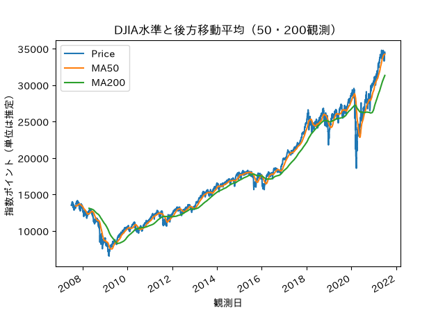

*価格水準と後方移動平均。長期上昇の途中に大幅下落があり、移動平均は過去の平滑化であって、売買シグナルの有効性を示すものではない。単位は指数ポイントと推定している。*

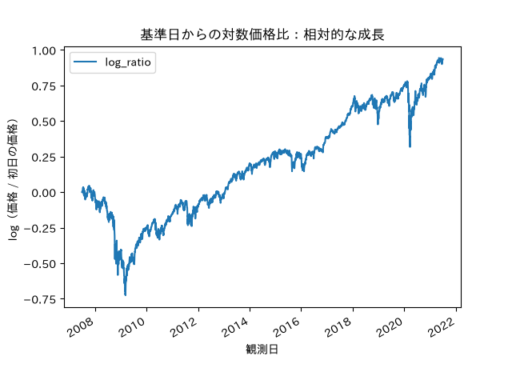

*初日の価格を基準とする対数価格比。絶対的なポイント差ではなく、期間中の相対的な水準変化を示す。*

年次では2008年のリターンが−33.84%、2009年が+18.82%、2020年が+7.25%でした。一方、年率変動性は2008年37.81%、2009年24.19%、2020年37.04%で、年末までの上昇だけでは途中の大変動を説明できません。2007年と2021年は部分年として扱っています。超過尖度14.95と危機期の大きな変動は厚い裾を示唆し、絶対リターンの正の自己相関は変動の集中を示します。ただし、`stats_analysis.correlation` の標準Pearson p値は時間依存を無視するため、確証としては使っていません。

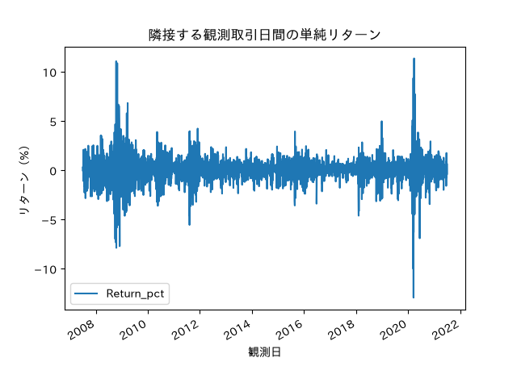

*単純リターンの時系列。ゼロ近辺の小変動と、2008–2009年・2020年の大変動が混在する。暦日でなく隣接する記録上の取引日間の変化である。*

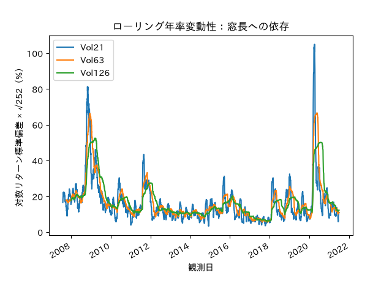

*対数リターンの標準偏差を√252倍したローリング変動性。窓長によって急変への反応と平滑化の程度が異なる。21観測窓の最大値は約104.90%で、全期間から計算した変動性20.03%だけでは局面差を表せない。*

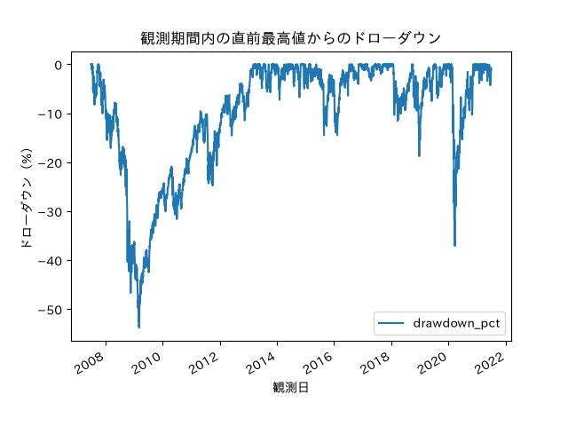

*記録上の直前最高値からの下落率。最大値は−53.78%であり、観測開始前の高値や日中の価格変動は含まない。*

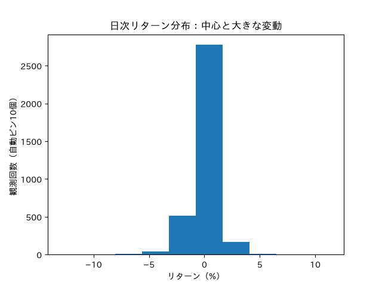

*3,523件の単純リターンのヒストグラム。自動10ビンの概観であり、裾の性質の評価は図だけでなく超過尖度や最大変動の出力と合わせて読む。*

掲載した6図は、対象Notebookの保存済みPNG出力を再描画せずに抽出したものです。`benchmark/figures` に英語の `exp-16-` 接頭辞付きファイル名で保存し、日本語のタイトル・軸ラベルは元画像のまま保持しています。各図の実行出力に記録された欠損グリフは0件で、保存後の図表監査にも指摘はありません。

初回の感度分析では、単純／対数リターンと年率係数250／252の4仕様で変動性は19.91〜20.03%、最大相対偏差は0.59%で、設定した5%閾値以内でした。一方、開始日3通り・終了日2通りの6期間でCAGRは6.15〜10.84%、最大相対偏差76.20%で、20%閾値を超えました。すべての期間で上昇していても、成長率の大きさは期間に依存します。ここでの `stable` は設定した相対偏差閾値の判定で、将来の安定性ではありません。

さらに、先頭80%（2007-07-02〜2018-09-11）で平均対数リターンと分散を固定し、2018-09-12〜2021-06-30を時間順に検証しました。1観測先705起点の対数変化RMSEは無変化モデル1.57481%、固定ドリフト1.57439%で、差は極小でした。21観測先685起点では6.70335%と6.66307%でした。正規・固定分散の名目95%区間の被覆率は約92.48〜94.01%で、95%の保証にはなりません。21観測先は予測区間が重複するため、独立した標本として検定しない方針です。AIは負のリターン相関の局面依存性と予測上の意味を未解決点として選びました。

**AIが生成した追加依頼1 — 自己相関の局面差と時間依存**

> 初回分析で日次リターンの1期自己相関が約-0.148、絶対リターンの自己相関が約0.362でした。負の相関を予測可能性と早合点しないため、2007–2009年・2010–2019年・2020–2021年で両者を比較し、時間依存を残すブロック・ブートストラップをブロック長5・21・63観測で実施してください。極端な変動を削除せず、各信頼区間の仮定と局面の違いを説明してください。

**選定理由**: 全期間の負のリターン自己相関と正の絶対リターン自己相関が、一部の危機期に依存していないかを確認するためです。標準Pearson p値だけでは時間依存を扱えないことも理由でした。

**結果**: `iteration-1`（実行番号17）で、局面別の相関と全期間の円環移動ブロック・ブートストラップを記録しました。

| 局面 | リターン数 | リターンの1期自己相関 | 絶対リターンの1期自己相関 | 年率変動性 |
|---|---:|---:|---:|---:|
| 2007–2009年 | 631 | −0.1452 | 0.2114 | 29.50% |
| 2010–2019年 | 2,515 | −0.0429 | 0.2173 | 14.09% |
| 2020–2021年 | 377 | −0.3001 | 0.5280 | 31.13% |

600回の再標本化による全期間の95%百分位区間は、ブロック長5／21／63で、リターン相関がそれぞれ[−0.2093, −0.0473]／[−0.2243, −0.0609]／[−0.2297, −0.0535]、絶対リターン相関が[0.2015, 0.3938]／[0.1990, 0.4613]／[0.1712, 0.4715]でした。絶対リターンの正の関係は各局面に残る一方、リターンの負の相関の大きさは局面で大きく変わります。変動の集中は記述的に支持されても、一定の反転予測則はまだ示されません。残る限界は定常性近似、ブロック境界で依存が切れること、600反復、探索的な局面選択です。この区間は将来の市場構造変化を保証しません。

**AIが生成した追加依頼2 — 固定AR(1)の時系列順検証**

> 反復1では負のリターン自己相関が局面で大きく変わり、2010–2019年は約-0.043、2020–2021年は約-0.300でした。この関係が実際に予測誤差を減らすか確認するため、先頭60・70・80%で学習した固定AR(1)を、無変化・固定ドリフトと1観測先の時系列順検証で比較してください。係数は検証期間中に再学習せず、2018–2019年・2020年・2021年の評価も表示し、方向的中率だけで収益性を主張しないでください。

**選定理由**: 相関の存在だけでは未見の時点の予測が有効とはいえません。局面差が予測誤差にも現れるかを確認し、長期トレンドや自己相関から予測可能性を過大評価しないためです。

**結果**: `iteration-2`（実行番号18）で、過去だけから切点ごとにAR(1)係数を推定し、検証中は固定しました。無変化モデルに対するRMSE改善率は、全検証期間では1.72〜2.03%でした。

| 学習割合 | 学習最終日 | 全検証数 | AR(1)全期間RMSE | 全期間改善率 | 2018–2019年改善率 | 2020年改善率 | 2021年部分期間改善率 |
|---|---|---:|---:|---:|---:|---:|---:|
| 60% | 2015-11-20 | 1,410 | 1.21532% | 1.718% | −0.317% | 2.760% | 0.232% |
| 70% | 2017-04-18 | 1,058 | 1.33446% | 1.849% | −0.299% | 2.732% | 0.304% |
| 80% | 2018-09-11 | 705 | 1.54289% | 2.027% | −0.369% | 2.650% | 0.417% |

RMSEは1観測先の対数変化を百分率表示した値です。改善率は無変化モデルに対する相対的な誤差減少率で、収益率ではありません。80%学習の2018–2019年評価は検証開始後の328件だけで、60%・70%学習の503件とは対象期間が異なります。3分割の改善率の最大相対偏差は17.99%で20%閾値以内でしたが、2018–2019年ではすべて悪化し、改善は特に2020年に依存しました。80%学習の全期間方向的中率もAR(1)53.05%、固定ドリフト55.89%で、誤差の小幅改善が方向予測の優位をそのまま意味するわけではありません。残る限界は検証期間の重複、探索的なモデル選択、改善率の不確実性、売買・費用の未評価です。

**AIが生成した追加依頼3 — 予測改善の不確実性と区間校正**

> 反復2でAR(1)の全検証期間RMSEは無変化より約1.7–2.0%低くなりましたが、2018–2019年には悪化し、改善は主に2020年に集中していました。80%学習の対応した誤差を使い、ブロック長5・21・63の再標本化でRMSE改善率の不確実性を確認してください。また、固定分散の名目95%区間を2020年などの局面別に検証し、過去データだけで更新するEWMA（λ=0.94・0.97・0.99）と比較してください。被覆率だけでなく区間幅と95%区間スコアも表示し、予測保証や取引収益とは区別してください。

**選定理由**: 改善率の符号だけではモデルの優位を判断できず、全期間の平均被覆率では危機期のリスク過小評価も見えないためです。

**結果**: `iteration-3`（実行番号19）で80%学習の対応する誤差を1,000回再標本化しました。RMSE改善率の95%百分位区間は次のとおりで、すべてゼロを含みました。

| ブロック長 | RMSE改善率の95%区間 |
|---|---|
| 5観測 | [−0.176, 3.740]% |
| 21観測 | [−0.312, 3.280]% |
| 63観測 | [−0.433, 3.042]% |

したがって、小さな誤差改善を再現可能な予測優位として確証するには足りません。区間校正では無変化を中心とする対数変化区間を比較し、EWMAは直前の検証リターンが観測された後だけ分散を更新しました。λの3仕様は比較用グリッドであり、最良値を選ぶ目的には使っていません。

| 2020年の区間モデル（253件） | 名目95%に対する実測被覆率 | 平均区間全幅（対数変化の%表示） | 平均95%区間スコア |
|---|---:|---:|---:|
| 学習分散固定 | 84.58% | 4.588 | 19.717 |
| EWMA λ=0.94 | 92.09% | 7.431 | 11.919 |
| EWMA λ=0.97 | 91.70% | 7.904 | 14.031 |
| EWMA λ=0.99 | 91.30% | 8.001 | 17.145 |

区間スコアは「全幅＋40×区間外距離」を百分率表示したもので、小さいほど良い指標です。EWMAは危機時に幅を広げ、固定分散より被覆率・スコアを改善しましたが、2020年の被覆率はどの仕様も95%に届きませんでした。全検証期間では固定分散92.62%、EWMA93.48〜94.75%であり、平均値だけでは2020年の不足を隠します。残る限界は、RMSE区間が固定モデル条件付きで学習係数の不確実性を含まないこと、非定常な将来、探索的選択、EWMAにも残る正規近似、最初の大変動を先取りできないことです。

**最終結論**: この取得系列では長期の価格水準上昇と大きな途中損失が両立していました。変動性の持続は各局面に認められますが、リターンの反転傾向は局面で変わり、固定AR(1)の小幅なRMSE改善もブロック再標本化ではゼロを含みます。「水準が長期上昇した」「自己相関がある」ことを、安定した方向予測や取引収益に結び付ける証拠はありません。固定分散の名目95%区間は危機期を十分に覆わず、過去に合わせた変動性更新も将来リスクの保証ではありません。

AIは3回の反復で局面差、予測誤差、不確実性、区間校正を確認して停止しました。さらに同じ検証期間で分割・モデルを探索すると過適合を増やす一方、独立参照・データ辞書・2021年以降の真に未見のデータは、この系列内の追加モデルでは補えないという停止理由を記録しています。分析完了の判断は、`status.json` の `analysis_complete=true`、`final_completion.ready=true`、Notebookの分析・反復・最終監査・終了状態を合わせたものです。

**監査・再現性**: Notebookは `benchmark/projects/kaggle-v020-kaggle-exp-16-dowjones/notebooks/kaggle-v020-kaggle-exp-16-dowjones.ipynb`、run_idは `v020-exp-16` です。保存されたコード21セルは実行番号1〜21を持ち、エラー出力はありません。カーネル再起動後、上から全コードセルをJupyter MCPで実行したことがNotebookに記録され、最終セルの出力 `reexecution_exact_match=True` とmetadataの `analysis_and_image_bytes_identical=true` が一致しています。比較対象は初回要約・品質・感度・予測・3反復の結果と6図のPNGバイトで、Notebookファイル全体のバイト一致を意味しません。

| 監査の時点 | 保存された結果 |
|---|---|
| 最終監査セルの実行中 | `audit_ok=True`。21コードセル中20セル実行済み。実行中の末尾監査セルを未実行指摘から除外する警告が1件 |
| 保存後の完全監査（Notebook metadata） | `ok=true`, `nbformat_valid=true`、21/21実行済み、未実行0、エラー0、図表6、根拠付き洞察10、構造・図表指摘とも0 |
| 最終ライフサイクル | `state=completed`、`active_cell_executions=0`、`pending_notebook_writes=0`、`locks_held=0` |
| 外部ランナーの最終完了判定 | `analysis_complete=true`, `final_completion.ready=true`。記録された完了要件はすべてtrue |

保存後の監査と実行中の監査は分けて読んでいます。図表監査の指摘がないことは、データ定義や統計解釈の正しさを保証する査読ではありません。実際、分析前提manifestでは、終値解釈A1と独立参照による正確性保証A5に未解決の重要前提という警告が残っています。一定の独立同分布・正規分布という前提A4は採用していません。

保存された環境出力はPython 3.12.3、pandas 3.0.6、NumPy 2.5.3、SciPy 1.18.1、Matplotlib 3.11.2、Kaggle 2.2.4、japanize-matplotlib 1.1.3です。再現は同じリポジトリ、データディレクトリ、依存環境、Kaggle認証を用意して、カーネル再起動後に上から実行する条件です。認証・候補検索・ファイル一覧は再取得する一方、既存CSVは来歴とSHA-256一致を確認して使い、最新CSVへの自動更新はしません。ブートストラップは反復1が各600回・seed `16100+ブロック長`、反復3が各1,000回・seed `16300+ブロック長` です。認証出力は抑制され、指定された証拠中にAPIトークンそのものの記載はありません。

初回ログは分析完了と3反復・再実行結果を報告しています。外部ランナー記録では初回は終了コード0、1,357.0秒、通常終了でした。追加確認ログは既存証拠の再評価を開始する文の後に、Notebookの安定と監査通過を理由にプロセス群を停止した旨を残しています。`status.json` では追加確認は92.7秒、終了コード0、終了理由 `artifact_complete_cutoff` で、初回・最終のNotebookサイズとmtimeも同一です。したがって、追加確認セッション自体がもう一度全セルを再実行した、という独立した成功証拠には数えません。新しい追加依頼の原文や分析結果もこのログにはなく、第4の反復とは数えません。全セル再実行の根拠は保存済みNotebookです。

**実行中の失敗と復旧**: 途中の問題はありましたが、復旧後の分析成果物は上記の状態に到達しています。次の過去の停止・同期問題はNotebookの経過記録に残されたもので、提供された `initial.log` に詳細なツール呼出し履歴や当時のエラー出力がすべて含まれるわけではありません。

| 問題 | 記録された実際の状態と対処 | 切り分け |
|---|---|---|
| Kaggle SDKのメソッド相違 | `dataset_view` がなく `AttributeError` でファイル確認が停止。`dataset_metadata(dataset, path)` に変更 | SDKのインターフェースと生成コードの不一致。Jupytermind不具合とはしない |
| 取得ファイル名の相違 | 空白が `%20` の名前で保存され、「SDK取得後にも指定CSVなし」で停止。期待したエンコード名だけをCSV名へ正規化 | Kaggle SDK側の保存名仕様との不一致 |
| streamだけの証拠の引用 | `record_insight` が `EvidenceMissingError`。同じ値を `display` の `text/plain` に残すことで回避 | Jupytermindの証拠出力型対応の改善候補 |
| 旧監査セルの自己書込み | 実行・書込みとcompleted状態は残ったが、MCP応答が空、保存セルは実行番号なし・出力なし。監査セルから同一Notebookの書込みを外し、全セル再実行と保存後監査を追加 | JupytermindとJupyter MCPの統合候補。単体の責任箇所は未確定 |

**Jupytermind改善候補**: `issue-candidate.json` に2候補を保存しました。1件目は `clean-quality` のstream出力「検査済み行数=3524」を引用し、`improvement-reproduction`（実行番号20）で `EvidenceMissingError` とNotebook非変更を確認した、モジュールの再現付き候補です。期待する改善は、標準Jupyterの `stream.text` も実行済み証拠として扱い、不正な引用の拒否は維持することです。

2件目は、実行中の `final-audit` から同じNotebookを `project_manager.enqueue_write` で変更すると、完了状態と保存済みセルの実行証拠が食い違うという統合候補です。Notebookに残る最初の再実行の記録では、MCP応答出力が空、監査セルの `execution_count=null`・出力数0、ライフサイクルはcompletedでした。回避後は21/21セルと出力が保存されています。ただし旧セルの完全なMCP応答・同期トレースは指定証拠にないため、Jupytermind単体の不具合と断定せず、原因調査を必要とする候補としました。Kaggle APIの問題、Copilot CLI固有の問題、外部ランナーによる追加確認の停止とは別です。

**残る限界**: データはKaggleユーザー公開の系列で、公式指数データとの独立照合はありません。metadataと実測開始月の不一致、辞書・原提供者・配当や物価調整・タイムゾーン・取引日完全性・出来高の経済的定義は未解決です。OHLCや丸めの整合があっても正確性は保証されず、終値という解釈が違えば市場解釈も変わります。

時系列評価は探索的な局面・分割・モデルを含み、検証期間も重複しています。ブートストラップは定常性近似と固定モデルに条件付きであり、未知の危機、学習係数の不確実性、モデル選択の影響を網羅しません。価格だけの分析で、金利・企業利益・景気・政策・構成銘柄の変化・配当・税・取引費用を評価せず、因果効果も示していません。同一定義・頻度の独立参照がないため、データセット間照合や独立した異常検証は適用せず、因果推論・季節調整・出来高の経済分析・AutoMLも目的または定義不足を理由に適用していません。過去CAGR、移動平均、予測区間のいずれも、将来収益や投資判断を保証するものではありません。

## 実験17: Exercise（分析完了・保存連携障害は回避後に再監査）

**課題**: 「Kaggleで見つかる運動・心拍のExerciseデータを調べ、運動の種類や時間と心拍数の違いを明らかにしてください。」

**初回プロンプト（全文・原文）**:

```text
Kaggleで見つかる運動・心拍のExerciseデータを調べ、運動の種類や時間と心拍数の違いを明らかにしてください。適切な比較方法、図表、欠損処理は自分で決め、観察された差の限界を日本語で示してください。AI Data Scientist SkillとJupyter MCPで計画、コード、結果、根拠付きInsightをノートブックに記録し、再実行してください。 Kaggle参照先: https://www.kaggle.com/datasets?search=exercise+heart+rate。インストール済みkaggle Python SDKを使い、NotebookのJupyter MCP実行セル内で`KaggleApi().authenticate()`、`dataset_list(search=...)`、`dataset_list_files(...)`、必要に応じて`dataset_download_file(...)`を呼び出し、Kaggle上の対応する公開データを検索・取得してください。外部CSVミラーは使用しないでください。owner/dataset slug、取得ファイル名、取得日、ファイルSHA-256をNotebookに記録してください。APIトークンをセル出力・Notebook・ログへ表示しないでください。分析・API取得コードの実行はJupyter MCPだけを使い、端末コマンド、subprocess、外部スクリプト起動、作業エージェントへの委譲は行わないでください。APIで対応するデータが見つからない場合は外部ソースにフォールバックせず、その実験を停止して理由を報告してください。保存先は benchmark/projects/kaggle-v020-kaggle-exp-17-exercise/notebooks/kaggle-v020-kaggle-exp-17-exercise.ipynb としてください。run_idは `v020-exp-17` です。長時間処理の開始前にlifecycle.register_runを呼び、実行・書込みフェーズを記録し、終了時にcompletedまたはfailedを記録してください。データ定義manifest、分析前提manifest、意味的な異常検査、妥当な範囲の感度分析を使い、適用できない機能は理由を記録してください。図表はvisual_audit=Trueで監査してください。Notebookには「使用したJupytermindモジュール」節を設け、直接import・呼び出したモジュール名、関数名、使用目的を記録してください。間接利用は使用済みに含めないでください。Jupytermindの不具合または機能不足が疑われた場合は「Jupytermind改善候補」節を設け、分類、再現条件、期待する挙動、実際の挙動、影響、回避策、関係するセルとログを記録してください。Copilot CLI、Kaggle API、ベンチマークランナーに固有の問題とは切り分け、候補がなければ「なし」と記録してください。初回分析後、自分で結果を読み直し、結論に実質的な影響を与える未解決点があれば自然言語の追加依頼文を作成し、Notebookの「反復依頼履歴」に原文のまま記録して実行してください。価値ある追加分析がなくなるまで最大3回繰り返し、各反復の選定理由・結果・証拠・残る限界を報告してください。最後に全コードセルを上から再実行し、notebook_auditとライフサイクル状態を記録してください。
```

**初回指示**: 比較方法・図表・欠損処理をAI自身に選ばせる一方、Kaggle SDKによる取得、Jupyter MCPでの実行、来歴と定義・前提の記録、意味的品質検査、最大3回の自律的追加依頼、全セル再実行と保存後監査を要求しました。時間が個人内の経過時刻なのかセッションの長さなのか、データが実測なのか合成なのかを確認してから、問いに答えられる範囲を決めています。

### 使用したJupytermindモジュール

指定Notebookのコードセルで直接import・呼び出したものを示します。以下のセル番号はNotebookの配列添字（0始まり）です。Notebookの使用記録には制作制御Notebookでの呼出しも含まれていますが、この表では指定Notebookに直接呼出しがない `enqueue_write` と `record_insight` を除外しました。統計モデル本体にはSciPy・statsmodelsも使っていますが、Jupytermindの機能とは混同しません。

| モジュール | 直接呼び出した関数・クラス・メソッド | 使用目的 |
|---|---|---|
| `ai_data_scientist.project_manager` | `resolve_project`, `ensure_notebook`, `ensure_data_dir` | 固定プロジェクトルート、Notebook、データ保存先の解決・作成 |
| `ai_data_scientist.language_router` | `detect_language` | 日本語での結果解釈 |
| `ai_data_scientist.lifecycle` | `register_run`, `is_cancel_requested`, `mark_execution_start`, `mark_execution_end`, `get_run_status`, `mark_failed`, `mark_completed`, `wait_for_quiescence` | 実行登録、各処理フェーズと協調中止の確認、失敗・完了・静止状態の管理 |
| `ai_data_scientist.ingestion` | `SourceSpec`, `ingest` | SDK取得済みCSVの読込みと行数上限確認 |
| `ai_data_scientist.eda` | `explore` | 列型、欠損、カテゴリ、数値分布の要約 |
| `ai_data_scientist.cleaning` | `clean_dataset` | 主要変数の完全ケース処理。補完なし、973行を維持 |
| `ai_data_scientist.data_definition` | `FieldValue`, `build_manifest`, `unresolved_fields` | 定義・単位・来歴・合成性・未確認項目の明示と改善候補の再現 |
| `ai_data_scientist.analysis_assumptions` | `Assumption`, `AnalysisAssumptionManifest`, `check_manifest` | 独立性、時間の定義、一般化、関数形、共通サポートの前提検査 |
| `ai_data_scientist.data_quality` | `detect_anomalies` | 広い範囲、必須値、カテゴリの検査。列間の心拍順序は別途コードで検査 |
| `ai_data_scientist.stats_analysis` | `correlation` | セッション時間と平均心拍数のPearson相関 |
| `ai_data_scientist.sensitivity` | `SensitivityPlan`, `run_sensitivity` | 時間係数8仕様と種別要約4仕様の比較・相対安定性評価 |
| `ai_data_scientist.visualization` | `render_chart`, `build_image_output` | 時間と心拍の散布図、PNG出力のNotebookへの格納 |
| `ai_data_scientist.insight_engine` | `extract_cited_value` | 保存済み出力から引用値を抽出し、再実行後のInsightと完全一致で照合 |
| `ai_data_scientist.notebook_audit` | `audit_visual_outputs`, `audit_notebook` | 視覚metadata欠落の再現と `visual_audit=True` の最終監査 |

セル1のフェーズ関数には書込み用の `mark_write_start` / `mark_write_end` を選ぶ分岐もありますが、指定Notebookの保存済みコードには `write=True` の呼出しがないため、上表で実行済み関数には含めていません。

### データ取得と初回結果

`KaggleApi` を認証し、`exercise heart rate`、`exercise`、`gym members exercise` の各検索の最初のページから候補を選びました。`dataset_list_files` と `dataset_metadata` でファイル構成と公開説明を確認し、3候補のCSVを `dataset_download_file` で取得しています。外部CSVミラーへはフォールバックしていません。公開説明のJSONを初めは最上位だけで読んだため空表示になりましたが、セル6で `info` 階層を読み直しています。

| owner/dataset slug | 取得CSV | 行数・列数 | 選定結果 |
|---|---|---|---|
| `davinascimento/data-to-learn-data-science` | `data.csv` | 169行・4列 | 心拍と時間はあるが運動種別がなく、主解析には不採用 |
| `valakhorasani/gym-members-exercise-dataset` | `gym_members_exercise_tracking.csv` | 973行・15列 | Cardio・HIIT・Strength・Yoga、平均・最大・安静時心拍、時間の単位が確認できるため採用 |
| `aakashjoshi123/exercise-and-fitness-metrics-dataset` | `exercise_dataset.csv` | 3,864行・12列 | 合成の `Exercise 1` 等で具体的な運動が不明なため不採用 |

**主解析データも合成データです。** Kaggle公開metadataの `userSpecifiedSources` に「generated using simulated data」と明記されています。973人の実測研究と読み替えず、模擬レコード内の関連だけを分析しました。`Avg_BPM` はセッション平均心拍数、`Session_Duration (hours)` はセッション全体の長さです。個人ID・日時がないため、同じ人の運動開始後の心拍推移や個人内差は推定できません。

Notebook metadataの `initial_provenance` にある初回取得日時と、保存済み再実行出力の取得日時は次のとおりです。いずれもUTCです。

| CSV | 初回取得日時 | 再実行時取得日時 | SHA-256 |
|---|---|---|---|
| `data.csv` | 2026-10-01T17:31:34.074151+00:00 | 2026-10-01T17:42:51.486186+00:00 | `c4d7a2375cb7b589b01f7fb7df8250261687cf7199cf4bd54bebfb9749cce147` |
| `gym_members_exercise_tracking.csv` | 2026-10-01T17:31:35.470953+00:00 | 2026-10-01T17:42:53.172168+00:00 | `cfa58990806ea6e1594fb1977d875a0158038e6d492fb95ec9107d29eb632307` |
| `exercise_dataset.csv` | 2026-10-01T17:31:37.344996+00:00 | 2026-10-01T17:42:54.917767+00:00 | `f480e047abcb96ac71631aa8e5f09f4c4ef4d1a517613fc4c7122220f2dcd74c` |

3ファイルのCSVハッシュは初回と再実行で一致しました。ただし主解析データのmetadataファイルのハッシュは、初回 `b4e5bc95b0b17559a1307b874e6793d0c3ae4a020289839034d6100d8870d7a0`、再取得時 `86201feed409e15a1eb1d257cd973922ce5449d85318d564096799d3c0edac3f` で異なります。公開説明を含むJSON全体のバイト一致まで確認できたとはしません。差分の原因は指定証拠からは特定できません。

主解析の全15列で欠損0、完全重複0。主要9変数の完全ケース処理は973→973行、削除0、値補完なしでした。範囲・カテゴリ検査の異常は0件ですが、別途行った `Resting_BPM <= Avg_BPM <= Max_BPM` の列間検査では **平均が最大を超える23行（2.36%）** を検出しています。種別内訳はCardio 6、HIIT 6、Strength 4、Yoga 7行です。BMIを体重・身長から再計算した最大絶対誤差は約0.005でした。心拍順序異常は初回には保持し、追加依頼1で除外の影響を比較しました。

初回の種別比較は群別平均のt区間、6組のWelch検定、Holm補正p値とBonferroni同時区間です。時間は連続量としてHC3頑健標準誤差付きOLSを用い、種別・年齢・性別・BMI・経験レベル・安静時心拍を調整しました。カロリーは時間や心拍の派生・下流指標となり得るため調整に入れていません。

| 運動種別 | 行数 | 平均心拍数（bpm） | 標準偏差 | 平均の95%区間 |
|---|---:|---:|---:|---|
| Cardio | 255 | 143.89 | 13.97 | 142.17～145.61 |
| HIIT | 221 | 143.52 | 14.28 | 141.63～145.42 |
| Strength | 258 | 144.31 | 15.08 | 142.46～146.16 |
| Yoga | 239 | 143.27 | 14.06 | 141.48～145.06 |

最大平均差はStrength−Yogaの **1.046 bpm**。6組のHolm補正p値はすべて1.0、調整後の種別同時Wald検定はp=0.8894でした。Cardio基準の調整差はHIIT −0.565 bpm（95%区間 −3.120～1.990）、Strength +0.246（−2.281～2.772）、Yoga −0.634（−3.133～1.865）です。群内標準偏差約14～15 bpmに比べて種別平均差は小さく、明瞭な種別差を検出していません。

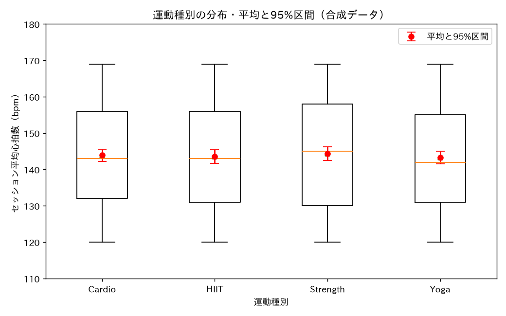

*Cardio・HIIT・Strength・Yogaの箱ひげと平均の95%区間。群内の広い分布に対して種別平均差は小さい。区間は独立した合成レコードを仮定した計算であり、実測集団の不確実性ではない。*

時間の無調整Pearson相関はr=0.0160、p=0.6178。属性調整後の時間係数は **+2.626 bpm/時間（95%区間 −1.796～7.048、p=0.2444）** でした。ほぼゼロの無調整相関と調整後係数を区別し、長時間運動の因果効果にも「関連が完全にない」という証明にも読み替えていません。

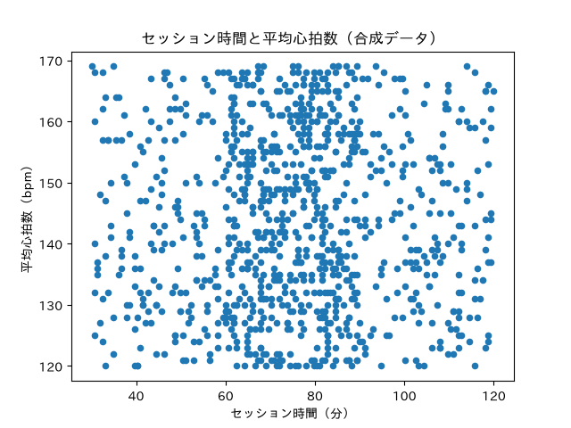

*セッション全体の長さと平均心拍数の散布関係。各点は模擬レコードで、同じ人を追跡した心拍時系列ではない。*

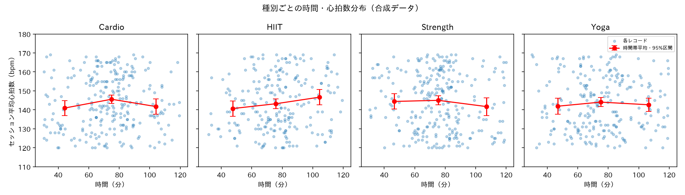

*各種別の個票と、60分以下・60～90分・90分超の時間帯平均および95%区間。HIITの平均は時間帯とともに増える一方、他種別は非単調であり、全体の直線係数だけでは形状の違いを評価できないことが追加依頼2の動機になった。*

3点ともNotebookセル12のPNG出力をそのまま抽出しています。再生成や追加の分析図ではありません。

### AIが自律生成した追加依頼

**追加依頼1（原文）**: 「心拍の平均が最大値を超える23行を除いた場合と、属性調整の有無・平均と中央値を変えた場合に、運動種別差と時間の関連の結論が変わるか確認してください。」

**選定理由**: 心拍順序の意味的異常と、無調整相関・属性調整係数の違いが結論に影響し得るためです。初回結果を見て選んだStrength−Yoga差は記述的指標に限定し、選択後の有意性を強調していません。

全行と異常除外、種別・時間のみと属性込みの調整、OLSとHuberの組合せで時間係数8仕様を比較しました。23行除外後は950行です。時間係数は **0.700～3.298 bpm/時間**、8仕様すべての95%区間が0を含みました。全調整OLSは全行2.626（−1.796～7.048）、除外後3.159（−1.222～7.539）です。補助的なSpearman相関もρ=0.0202、p=0.5285でした。

Strength−Yoga差は全行/除外と平均/中央値の4仕様で1.046～3.000 bpm。20%の相対安定性基準では時間 `stable=False`（最大相対偏差0.734）、種別差 `stable=False`（1.868）です。**推定値の相対的大きさは安定とは言えない** 一方、時間に明確な関連を検出しない点や種別差が群内変動より小さい点は変わりませんでした。基準値がゼロに近いと相対偏差が膨らむため、絶対差も併記しています。証拠はセル16（実行番号8）の感度reportと係数表です。異常除外は合成データの生成機構や現実適合性を修復するものではありません。

**追加依頼2（原文）**: 「全体で時間と心拍数の関連が弱くても、HIITだけ増えるなど種別別の傾きや曲線的な関連が隠れていないか、属性調整と心拍順序異常の除外を併用して確認してください。」

**選定理由**: 時間帯平均の形が種別によって異なり、全体平均による相殺があり得るためです。時間中心化後の種別×時間モデルと共通二次項モデルを、全行・異常除外でそれぞれ検討しました。4つの探索的検定をHolm補正し、種別別の4傾きにはBonferroni同時区間を付けています。

全行の交互作用は未補正p=0.1011、Holm補正p=0.4042。異常除外では補正p=0.5280、二次項は両標本とも補正p=1.0でした。4検定の最小補正pは **0.4042** です。全行の種別別傾きは次のとおりです。

| 種別 | 時間係数（bpm/時間） | 4種別の同時95%区間 |
|---|---:|---|
| Cardio | 3.77 | −3.91～11.45 |
| HIIT | 7.98 | −0.32～16.28 |
| Strength | −1.60 | −9.68～6.48 |
| Yoga | 2.23 | −5.95～10.41 |

すべて0を含み、異常除外後も同様でした。HIITの点推定だけを採って増加が確定したとは言えません。この検証中、経験レベル1は0.50～1.50時間、2は1.00～1.50時間、3は1.51～2.00時間で、**経験3と他レベルの時間域が重ならない** ことが判明しました。証拠はセル19（実行番号9）の交互作用・二次項・傾き表と経験別時間分布です。探索後の検定であり、任意の非線形性まで否定したものではありません。

**追加依頼3（原文）**: 「種別差が有意でない結果を差がないと言い換えず、同時信頼区間が±3・±5・±10 bpmに収まるか確認してください。経験レベルと時間帯の重なりがない影響も、経験レベル内の時間係数と区間を用いて示してください。」

**選定理由**: 「差を検出しない」と「差の範囲を小さく限定できる」を分離し、共通サポートのない調整時間係数の説明を過剰にしないためです。加法モデルの調整済み6組同時95%区間を3つの解釈用閾値と比較し、経験レベル内の時間係数を示しました。

| 解釈用の範囲 | 全行で区間が収まる組数 | 異常除外で区間が収まる組数 |
|---|---:|---:|
| ±3 bpm | 0 / 6 | 0 / 6 |
| ±5 bpm | 6 / 6 | 6 / 6 |
| ±10 bpm | 6 / 6 | 6 / 6 |

最も外側の区間端は約 **4.669 bpm**。この合成データの加法モデルでは、平均的種別差の区間は±5 bpm内ですが、±3 bpm内とは言えません。±3・±5・±10は結果を見た後の感度比較用閾値であり、事前に定めた臨床的等価性基準ではありません。

| 経験レベル | 全行の行数 | 時間域（分） | レベル内時間係数（bpm/時間） | 95%区間 |
|---|---:|---|---:|---|
| 1 | 376 | 30.0～90.0 | 3.37 | −1.93～8.68 |
| 2 | 406 | 60.0～90.0 | 2.55 | −7.28～12.38 |
| 3 | 191 | 90.6～120.0 | −0.98 | −16.59～14.64 |

レベル内の区間は広く、異常除外後もすべて0を含みました。経験3と他レベルの時間域に重なりがないため、全体の調整係数は共通直線というモデル仮定に依存します。証拠はセル22（実行番号10）の同時区間・閾値比較・層別時間係数表です。

**反復終了理由**: 3回の上限に達し、品質依存、隠れた時間形状、小差と無差の区別、共通サポートを点検しました。残る独立性・生成機構・実世界への一般化は同じCSVにモデルを足しても解決できず、有意な結果が出るまで探索を続けていません。初回ログにも3回実施が明記されています。`followup.log` は結論と証拠の再評価を開始する記述とランナーによる停止記録だけで、新しい追加依頼原文や第4の分析結果は確認できません。

### 最終結論

**この973行の合成データでは、運動種別による平均心拍数の差は小さく、セッションの長さとの明確な関連は確認できませんでした。** 種別平均の最大差は約1.05 bpm、属性調整後の時間係数は2.63 bpm/時間ですが区間は0を含みます。品質除外・推定法・要約法を変えても明瞭な時間関連は検出されず、調整済み平均種別差の同時区間は±5 bpm内に収まります。

ただし推定値の相対的安定性は満たさず、HIITなどの種別別時間係数は不確実です。一般的な運動生理学の知見を否定する実験でも、HIITとYogaが臨床的に等価である証明でもありません。結論は **合成データ内の平均的・モデル依存の関連** に限定されます。

### 監査・再現性

Notebookは `benchmark/projects/kaggle-v020-kaggle-exp-17-exercise/notebooks/kaggle-v020-kaggle-exp-17-exercise.ipynb`、run_idは `v020-exp-17` です。セル1で取得前に実行を登録し、各処理フェーズの開始・終了を記録しています。Notebook metadataの `replay_method` は `Jupyter MCP restart_notebook + ordered execute_cell`。カーネル再起動後、全12コードセルは配列添字1・2・4・6・8・10・12・16・19・22・26・28の順に、実行番号1～12で保存されています。5件のInsight引用は保存済み出力と完全一致で再照合され、3CSVのハッシュ一致も記録されています。

| 確認項目 | 保存後の最終記録 |
|---|---|
| `audit_notebook(..., visual_audit=True)` | `ok=True`, `nbformat_valid=True` |
| コードセル | 12 / 12実行済み、未実行0、エラー0 |
| 図表・Insight | 図表セル1つにPNG3点、根拠付きInsight5件 |
| 監査finding | 通常0、視覚0 |
| lifecycle | `completed`、実行中セル0、保留書込み0、保持ロック0 |
| 再実行確認日時 | 2026-10-01T17:43:59.903396+00:00 |

最終セル28の実行中に出力された内部監査は11セル実行済みで、自セルがまだ終了していないというwarningを1件含みます。これを保存後の12/12・finding 0の監査と混同していません。最終値はNotebook metadataの `experiment.notebook_audit` と保存後の記録、`status.json` の監査記録で確認できます。`analysis_complete=true`、`final_completion.ready=true` とNotebookの内容を根拠に分析完了と判断しました。

外部ランナー記録では初回は終了コード0、1,077.1秒、`exited`。追加確認は終了コード0、92.6秒、`artifact_complete_cutoff` で、ログにも「Notebook remained stable and passed semantic audit」によるプロセス群停止が残っています。追加確認プロセスが自然終了した、あるいは別の再実行を完遂したとは断定しません。初回・最終の安定確認は同じ496,707 bytesとmtimeを記録しており、追加確認後のNotebook更新はこれらの記録からは確認できません。

Notebook記録の環境はPython 3.12.3、pandas 3.0.6、NumPy 2.5.3、SciPy 1.18.1、statsmodels 0.15.0、Kaggle SDK 2.2.4、Matplotlib 3.11.2、nbformat 5.11.1、japanize-matplotlib 1.1.3です。これらは実験Notebookに記録された値であり、本節作成時に環境を再測定したものではありません。

### 失敗内容とJupytermind改善候補

**保存連携障害は実際に発生しています。** 初回ログには、対象セル内の引用更新がJupyter MCPの文書保存に上書きされたため、書込みを制御セルへ分離して再実行したことが記録されています。Notebook metadataの `execution_issue_history` でも、内部監査成功後の保存済みNotebookに対する監査で引用根拠の不整合5件、`ok=False`、lifecycle `failed` を保持しています。引用先は旧実行番号15・18・20・22で、現存の出力に解決できませんでした。

対象の最終セルを読み取り専用にし、別Jupyter制御セルから引用・metadataを書き込み、カーネル再起動と全12セル再実行を経て保存後監査 `ok=True` に回復しました。**回避後に分析は完了していますが、Jupytermind自体の修正が済んだとは記録されていません。**

| 改善候補 | 分類・証拠 | 影響と回避 |
|---|---|---|
| 定義manifestの推定項目の扱い | 契約・機能不足。セル26の `DATA_DEFINITION_PROBE` は `status="inferred"` に対して `unresolved_return_count=0` | 推定を確認済みと誤読する恐れ。`unknown` だけを返す仕様との方針整合が課題で、実装バグとは断定しない。本実験は推定項目を別途列挙 |
| 視覚監査のmetadata欠落 | 検査不足。正常PNGと空metadataに対するセル26の `VISUAL_METADATA_PROBE` は `findings=[]` | ラベルや文字欠落の検査未実施を成功と誤読する恐れ。図表metadataを手動付加し、Glyph警告捕捉と目視確認で補完 |
| Insight引用の再実行追従 | 機能不足。Notebookの改善候補記録、旧実行番号の引用不整合、再実行後の5件の完全一致ログ | 実行番号が変わると引用先が古くなる。独自の永続cell_id・patternを保持して保存出力から照合。別セルへの誤解決は潜在リスクであり、本実験で発生したとはしない |
| 排他書込みとJupyter MCP保存の同期 | 統合機能不足。初回ログと `execution_issue_history.before_recovery_audit` の根拠不整合5件 | 対象セルからの自己ファイル更新が保持されず、内部監査と保存後監査が乖離。制御Notebookに書込みを分離して回避。Jupytermind単独の排他ロック不良とは断定しない |

定義・視覚監査の2候補はJupytermind関数の直接呼出しで再現され、Copilot CLI・Kaggle API・外部ランナーを介していません。保存競合はJupytermind書込みとJupyter MCP保存の統合境界の課題で、単一製品だけを原因と断定できません。候補の再現手順・期待/実際の挙動・影響・証拠・受け入れ条件は `issue-candidate.json` に保存しました。

**その他の問題との切分け**: Notebookの記録によれば、最初のJupyter MCP接続は未作成ディレクトリで失敗し、制作制御Notebookで保存先を作成して回避しました。filesystem MCPの許可ワークスペースが異なる問題も環境・ツール設定として記録されており、指定ログには詳細なツール応答がありません。Kaggle metadataの空表示は呼出し側のJSON読取方法で修正済みです。合成性と心拍順序矛盾はデータ品質の問題で、Kaggle APIの認証・取得失敗ではありません。外部ランナーの追加確認停止も別の挙動です。Notebook内に「ベンチマークランナーは使用していない」とありますが、実験プロセス外側にランナーが存在したことは `followup.log` と `status.json` で確認できます。Copilot CLI固有の不具合を特定する証拠はありません。

### 残る限界

合成データの詳細な生成手順、実際の標本母集団、個人ID、運動強度・具体的プロトコル、測定機器・時点・心拍の集計窓は確認できません。各行の独立性も仮定のままであり、区間とp値を実測集団の標本誤差とみなせません。経験レベル3と他レベルには時間域の共通サポートがなく、調整係数の一般化もモデル依存です。

前提manifestには最終的に独立行 `assumed`、実世界への一般化 `rejected`、経験をまたぐ共通サポート `rejected` の3件の結論重要findingが残っています。これらはNotebook構造・引用・画像の最終監査finding 0とは別で、監査成功を科学的前提の解決とみなしていません。±5 bpmという結果も平均的な加法モデル内の区間の性質で、臨床的等価性、時間別差、個人差の小ささを保証しません。

独立で同等定義の参照標本や共通キーがないため、外部照合・異常の外部検証は適用していません。個人内反復測定・因果推論も適用不可と記録されています。公開候補探索は検索の最初のページに限られ、最適な実測データを網羅的に探した実験ではありません。根拠を強化するには、独立した実測データと測定・標本設計の情報が必要です。

本節の実験証拠は指定Notebook、`initial-prompt.md`、`initial.log`、`followup.log`、`status.json` に限定し、`white-paper2.md` は書式・詳細度の参照だけに使用しました。旧版実験17の数値や成功記録は転用していません。

## 実験18: fMRI（分析完了・追加確認の反復3は未記録）

**課題**: 「Kaggle上のfMRI時系列データに相当する公開データで、条件や領域によって信号の時間推移がどう異なるかを調べてください。」

**初回プロンプト（全文・原文）**: 「Kaggle上のfMRI時系列データに相当する公開データで、条件や領域によって信号の時間推移がどう異なるかを調べてください。データの反復測定構造を確認して自分で分析計画を立て、推移を伝える図表と慎重な解釈を日本語で示してください。AI Data Scientist SkillとJupyter MCPを利用し、根拠付きで記録して再実行を確認してください。 Kaggle参照先: https://www.kaggle.com/datasets?search=fmri+time+series。インストール済みkaggle Python SDKを使い、NotebookのJupyter MCP実行セル内で`KaggleApi().authenticate()`、`dataset_list(search=...)`、`dataset_list_files(...)`、必要に応じて`dataset_download_file(...)`を呼び出し、Kaggle上の対応する公開データを検索・取得してください。外部CSVミラーは使用しないでください。owner/dataset slug、取得ファイル名、取得日、ファイルSHA-256をNotebookに記録してください。APIトークンをセル出力・Notebook・ログへ表示しないでください。分析・API取得コードの実行はJupyter MCPだけを使い、端末コマンド、subprocess、外部スクリプト起動、作業エージェントへの委譲は行わないでください。APIで対応するデータが見つからない場合は外部ソースにフォールバックせず、その実験を停止して理由を報告してください。保存先は benchmark/projects/kaggle-v020-kaggle-exp-18-fmri/notebooks/kaggle-v020-kaggle-exp-18-fmri.ipynb としてください。run_idは `v020-exp-18` です。長時間処理の開始前にlifecycle.register_runを呼び、実行・書込みフェーズを記録し、終了時にcompletedまたはfailedを記録してください。データ定義manifest、分析前提manifest、意味的な異常検査、妥当な範囲の感度分析を使い、適用できない機能は理由を記録してください。図表はvisual_audit=Trueで監査してください。Notebookには「使用したJupytermindモジュール」節を設け、直接import・呼び出したモジュール名、関数名、使用目的を記録してください。間接利用は使用済みに含めないでください。Jupytermindの不具合または機能不足が疑われた場合は「Jupytermind改善候補」節を設け、分類、再現条件、期待する挙動、実際の挙動、影響、回避策、関係するセルとログを記録してください。Copilot CLI、Kaggle API、ベンチマークランナーに固有の問題とは切り分け、候補がなければ「なし」と記録してください。初回分析後、自分で結果を読み直し、結論に実質的な影響を与える未解決点があれば自然言語の追加依頼文を作成し、Notebookの「反復依頼履歴」に原文のまま記録して実行してください。価値ある追加分析がなくなるまで最大3回繰り返し、各反復の選定理由・結果・証拠・残る限界を報告してください。最後に全コードセルを上から再実行し、notebook_auditとライフサイクル状態を記録してください。」

**使用したJupytermindモジュール**: Notebookのコードセルで直接importし、直接呼び出したモジュール・関数・クラスだけを示します。統計計算にはNumPy・pandas、複合図にはMatplotlibも使っていますが、これらはJupytermindのモジュールではありません。

| モジュール | 直接呼び出した関数・クラス | 使用目的 |
|---|---|---|
| `ai_data_scientist.project_manager` | `resolve_project`, `ensure_notebook`, `ensure_data_dir`, `enqueue_write` | 保存先とデータ置場の作成・解決、Notebook書込みの直列化 |
| `ai_data_scientist.language_router` | `detect_language` | 日本語の出力言語判定 |
| `ai_data_scientist.lifecycle` | `register_run`, `is_cancel_requested`, `mark_execution_start`, `mark_execution_end`, `mark_write_start`, `mark_write_end`, `mark_completed`, `get_run_status`, `wait_for_quiescence` | 実行・書込みフェーズ、完了状態、静止状態の管理 |
| `ai_data_scientist.ingestion` | `SourceSpec`, `ingest` | Kaggle SDKで取得済みのローカルCSV読込みと行数制限確認 |
| `ai_data_scientist.eda` | `explore` | 基本集計・欠測確認 |
| `ai_data_scientist.data_definition` | `FieldValue`, `build_manifest`, `DataDefinitionManifest.unresolved_fields` | データ定義の確認済み・推定・未確認を分離 |
| `ai_data_scientist.analysis_assumptions` | `Assumption`, `AnalysisAssumptionManifest`, `check_manifest` | 記述的分析の範囲と結論に関わる未解決前提の明示 |
| `ai_data_scientist.data_quality` | `detect_anomalies` | カテゴリ、時点範囲、非欠測の意味的検査 |
| `ai_data_scientist.sensitivity` | `SensitivityPlan`, `run_sensitivity` | 窓・基準値補正・被験者除外を組み合わせた感度分析 |
| `ai_data_scientist.visualization` | `render_chart`, `build_image_output` | 平均推移の描画、PNGのNotebook出力化 |
| `ai_data_scientist.insight_engine` | `extract_cited_value`, `record_insight` | 実出力からの引用値抽出と根拠付き結論の記録 |
| `ai_data_scientist.notebook_audit` | `audit_notebook`, `audit_visual_outputs` | Notebook・図表の監査、図表監査情報の欠落検出の再現検査 |

`lifecycle.mark_failed` は例外時の分岐に記述されていますが、保存された正常終了経路で呼ばれたとは確認できないため、上表の実利用には含めません。`EvidenceMissingError` はimportして例外を捕捉していますが、直接呼び出した分析関数ではありません。間接依存を使用済みには数えません。

**初回指示**: 反復測定構造の確認を先に行い、分析計画と追加依頼はAI自身に選ばせました。Kaggle API限定の取得、出典とハッシュ、データ定義・分析前提manifest、意味的検査、感度分析、図表監査、ライフサイクル記録、最後の全コードセル再実行を要求しています。初回プロンプトは窓や統計手法を指定しておらず、時点3–7の要約、被験者単位のbootstrap、同時区間はAIが選んだ方法です。

**データ取得**: NotebookのKaggle SDKセルで `authenticate()` を呼び、`fmri time series`、`fmri`、`seaborn fmri` の3語で `dataset_list(search=...)` を実行しました。候補のうち `daryasikerina/seaborn-fmri-dataset` を選び、`dataset_list_files(...)` で `fmri.csv` を確認し、`dataset_download_file(..., force=True, quiet=True)` で取得しています。外部CSVミラーへのフォールバックはコードにも取得記録にもありません。認証処理の標準出力・標準エラーは抑制され、指定証拠にAPIトークンの表示は見当たりません。

| 項目 | Notebookに残る取得・構造確認の結果 |
|---|---|
| owner/dataset slug | `daryasikerina/seaborn-fmri-dataset` |
| 取得ファイル | `fmri.csv`、38,329バイト |
| 取得日時 | `2026-10-01T17:44:04.693956+00:00`（UTC。日本時間では2026-10-02） |
| SHA-256 | `8a0bfdce94daa31c95ae9f49ca6a2a3ac39e2fe85719c892cb0b06bca94ffe3e` |
| 形状・列 | 1,064行・5列。`subject`, `timepoint`, `event`, `region`, `signal` |
| 反復測定構造 | 14被験者×2条件（cue/stim）×2領域（frontal/parietal）×19時点（0–18） |
| 欠損・重複 | 各列の欠損0、複合主キーの重複0、直積との不足・余剰なし、信号は全値有限 |
| 前処理 | 削除・補完0行。解析時の主キー順への並べ替えと被験者内対応差 |

データ定義manifestは、ラベル・値・対応構造を確認済み、被験者・条件・領域という列の意味を推定、母集団・前処理・課題・アトラス・時間単位・信号単位を未確認として分離しています。意味的異常検査の結果は空でしたが、信号の物理的な正常範囲まで検証したという意味ではありません。分析前提検査は、被験者間の独立性・母集団代表性と、条件・領域間の信号尺度の比較可能性について、結論に関わる未確認前提の警告を2件出しました。

**初回結果**: AIは1,064行を独立標本とはせず、14被験者を解析単位にしました。被験者の条件・領域・全時点の軌跡をまとめて5,000回再標本化し、seedは `20261002` に固定しています。5種類の対応差を計算し、全期間0–18と探索窓3–7を比較しました。以下は単位未確認の提供値の尺度であり、95%区間は各要約についてのbootstrap区間で、全比較を同時に保証するものではありません。

| 対応差 | 全期間0–18の平均差 | 探索窓3–7の平均差 | 探索窓の95%区間 | 探索窓で正差の被験者数 |
|---|---:|---:|---|---:|
| frontal: stim−cue | 0.010756 | 0.101529 | 0.067843〜0.134973 | 12/14 |
| parietal: stim−cue | 0.030079 | 0.165203 | 0.137574〜0.192424 | 14/14 |
| cue: parietal−frontal | −0.005178 | 0.017532 | 0.008062〜0.029114 | 11/14 |
| stim: parietal−frontal | 0.014145 | 0.081207 | 0.045769〜0.121730 | 14/14 |
| 条件差の領域差 | 0.019323 | 0.063674 | 0.031087〜0.104445 | 13/14 |

「条件差の領域差」は `(stim−cue)_parietal − (stim−cue)_frontal` です。frontalの全期間条件差の区間は −0.005019〜0.025777で0を含み、探索窓の正差とは異なる要約になりました。cueの領域差も全期間と探索窓で符号が違います。平均軌跡のピークはcue/frontalで時点5・0.041640、cue/parietalで5・0.069338、stim/frontalで5・0.172703、stim/parietalで6・0.282978でした。平均軌跡のピークは、個々の被験者のピークを平均した値ではありません。

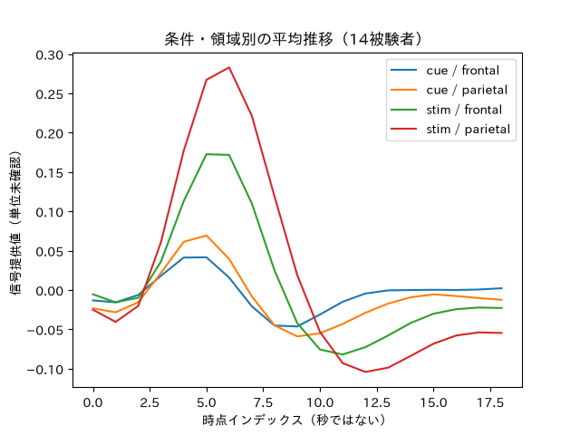

*14被験者の4条件・領域組合せの平均推移。横軸は時点インデックスであって秒ではなく、縦軸は物理単位未確認の信号提供値。Notebookセル7の最初のPNG出力を抽出。*

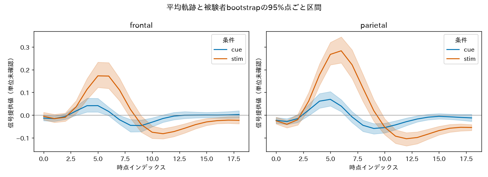

*frontalとparietalのcue/stim平均軌跡と、被験者単位bootstrapによる95%点ごと区間。帯は時系列全体の同時区間ではない。Notebookセル7の2番目のPNG出力を抽出。*

**AIが生成した追加依頼1 — 窓・基準値補正・個人依存の確認**

> 初回結果ではピーク付近のstim−cue差が正ですが、全期間平均と大きさが異なります。各被験者の時点0–2平均を基準とする補正の有無、窓3–7・4–8・3–8、被験者を1人ずつ除外した場合を比較し、条件差と条件差の領域差の符号・大きさがどこまで安定するかを調べてください。

**選定理由**: 全期間と探索窓で差の大きさや領域差の符号が異なり、窓選択・基準値・少数被験者の影響が結論を左右すると判断しました。各比較について3窓×2補正仕様×15除外仕様（除外なしと14人の1人ずつ除外）＝90仕様を実行しました。

**結果**: 5比較すべてで、前半の平均差は90仕様すべて正でした。ただし、符号の安定性と大きさの安定性は一致しません。

| 対応差 | 90仕様の最小〜最大 | 基準仕様からの最大相対変動 | 20%以内の安定性基準 |
|---|---|---:|---|
| frontal: stim−cue | 0.085638〜0.121692 | 0.198595 | 満たす |
| parietal: stim−cue | 0.156740〜0.205823 | 0.245877 | 満たさない |
| cue: parietal−frontal | 0.010240〜0.032908 | 0.876962 | 満たさない |
| stim: parietal−frontal | 0.067129〜0.119748 | 0.474610 | 満たさない |
| 条件差の領域差 | 0.047619〜0.092615 | 0.454516 | 満たさない |

時点0–2平均による補正を加えると、3–7の条件差はfrontalで0.101529から0.100139、parietalで0.165203から0.171393へ変わりました。一方、後半10–18の条件差はfrontalで −0.042416、parietalで −0.053068となり、前半とは逆符号でした。証拠はNotebookセル9（実行番号8）の感度表・基準値表・前後半表です。時点0–2が真の刺激前ベースラインとは確認されておらず、この補正は代替仕様の比較にとどまります。20%基準も設定した安定性の判定基準で、生理学的な意味の閾値ではありません。

**AIが生成した追加依頼2 — 多数時点比較とピーク時点の不確実性**

> 感度分析では前半の差の符号は保たれましたが、後半は逆符号で、大きさは仕様依存でした。5種類の対応差×19時点を同じ比較族として被験者軌跡bootstrapの95%同時区間を作り、前半と後半の差の変化を被験者内で確認してください。平均軌跡のピークが時点5と6に見える差についても再標本化で不確実性を確認し、確かな遅延と断言できるかを検討してください。

**選定理由**: 後半の逆符号を確認したため、点ごとの区間だけで多数の時点を判定することを避け、見かけの1時点差を確かな遅延と誤解しない範囲に結論を絞る必要があると判断しました。

**結果**: 5対応差×19時点＝95要素を一つの比較族とし、被験者軌跡bootstrapの最大絶対studentized統計量から近似95%同時区間を作りました。反復数は5,000、臨界値は5.655449でした。

| 対応差 | 同時区間が0を除いて正の時点 | 同時区間が0を除いて負の時点 |
|---|---|---|
| frontal: stim−cue | 5–6 | なし |
| parietal: stim−cue | 4–7 | 12–15 |
| cue: parietal−frontal | なし | なし |
| stim: parietal−frontal | なし | 1 |
| 条件差の領域差 | なし | なし |

領域間に差が一切なかったわけではなく、stimの領域差は時点1で負の区間でした。しかし、条件差の領域差は各時点で0を除かず、前半の平均差が大きく見えることから各時点の相互作用を断定することはできません。

前半3–7の条件差から後半10–18の条件差を引いた値は、frontalで0.143945（95%区間0.107516〜0.180961）、parietalで0.218272（0.180185〜0.255383）で、両領域とも14人全員が正でした。この前後半比較の区間は5比較の補正をしていない探索的区間であり、上表の95要素の同時区間とは別です。

stimの領域間ピーク時点差は観測平均軌跡では1時点ですが、bootstrapの95%範囲は0〜1、parietalのピークがfrontalより後となった頻度は0.3544でした。この頻度は仮説の事後確率やp値ではありません。0を含む離散的な再標本化分布と時間単位未確認を踏まえ、確かな生理的遅延とは扱っていません。証拠はNotebookセル11（実行番号9）の同時区間表、前後半変化表、ピーク分布です。

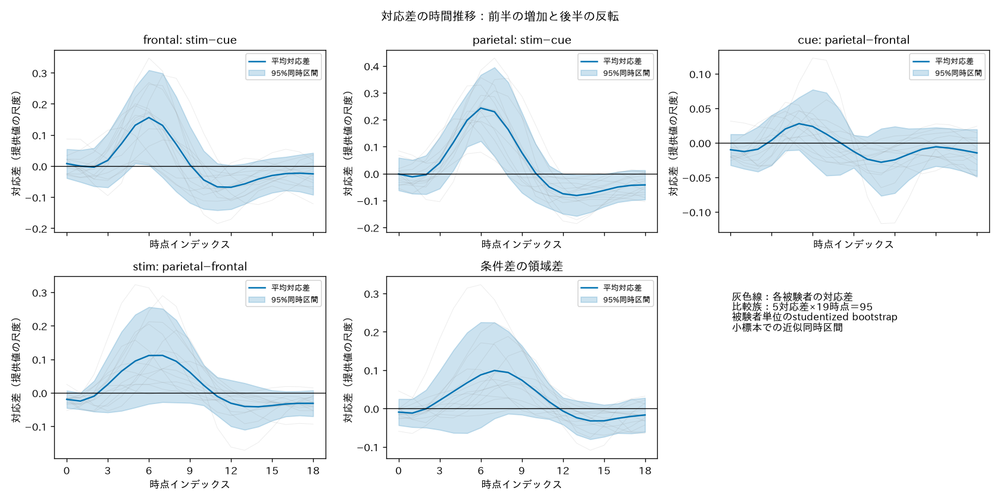

*灰色線は各被験者の対応差、青線は平均対応差、帯は5対応差×19時点をまとめた近似95%同時区間。前半と後半の符号の違い、個人差、各時点で断定できる範囲を示す。Notebookセル12のPNG出力を抽出。*

**追加依頼の停止判断と追加確認ログ**: 初回セッションは、窓・基準値・個人依存、多数時点比較、ピーク差を2回の反復で検討し、残る意味的情報や独立標本は追加計算では回復できないとして終了しました。`initial.log` にも「追加分析は2回で終了」とあります。

一方、`followup.log` には次の追加実施予告が残っています。

> 初回と反復1・2は、時間帯による差、前半の感度、多重比較、ピークの不確実性に答えています。一方、後半の逆符号と同時区間の判定は、極値・基準値補正・被験者除外への感度が未確認でした。この結論に関わる点を反復3としてまとめ、追加依頼は今回の1回で止めます。

これはログに残る判断・予告の原文であり、Notebookに記録された反復3の正式依頼文や実行結果ではありません。保存Notebookの「反復依頼履歴」は反復1・2のみで、反復3のセル・表・図はありません。`status.json` の初回・最終のファイルサイズとmtimeも同一で、追加確認の終了理由は `artifact_complete_cutoff`、ログ末尾には安定したNotebookが監査を通過したためプロセス群を停止したとあります。したがって、反復3を完了したとは扱いません。後半の逆符号と同時区間判定への追加感度検証は、未解決点として残ります。

**最終結論**: 保存された分析では、**条件差は時間帯に依存し、前半のstim−cue差は正、後半の平均差は負へ反転しました**。前半の方向は窓・基準値補正・被験者除外の90仕様で保たれましたが、効果量の大きさまで安定とはいえません。近似同時区間ではfrontalの時点5–6、parietalの4–7で正の条件差、parietalの12–15で負の条件差を確認しました。ただし、条件差の領域差について各時点の確かな相互作用や、stimの領域間の確かなピーク遅延は確認できません。これは差が存在しないことの証明でもありません。

`status.json` の `analysis_complete=true`、`final_completion.ready=true` と、Notebookの実行出力・結論・再実行記録が整合するため、**分析完了**と判断します。追加確認で予告された反復3の完了とは区別します。文書化状態の `documentation_complete`、トップレベルの `semantic_complete`、`report_exit_code` は分析の成否判定には用いていません。

**監査・再現性**: Notebook最終セルとメタデータには、新規カーネルで全12コードセルを上から再実行し、`matched=true` になった記録があります。再実行時刻は `2026-10-01T17:46:24.551725+00:00` です。コードは初回保存値と取得ファイルのSHA-256を一致確認し、平均推移・対応差・感度分析・同時区間閾値・ピーク分布を `rtol=1e-12, atol=1e-12` で照合しています。本節の作成では分析を新たに実行したのではなく、その保存記録を確認しました。

`audit_notebook(..., visual_audit=True)` の最終結果は、nbformat妥当、コード12セル中12セル実行済み、未実行・エラーセルなし、図表セル2件（PNG画像3点）、Insight3件、`findings`・`visual_findings` とも空、`ok=true` でした。ライフサイクルは `v020-exp-18` が `completed`、実行中セル数・保留書込み数・保持ロック数はすべて0です。PNG3点はNotebookの埋め込み出力からそのまま抽出し、再描画はしていません。図表の日本語Glyph警告は空で、タイトル・軸・凡例・区間の確認が記録されています。

ただし、構造監査の合格は統計的・科学的な妥当性の保証ではありません。図表監査についても、Notebook自身が近空白のバイト密度検査は精密な画素・内容評価ではないと明示しています。最終セルの自己書込みとMCP保存の競合を避けるため、実際のIPython実行番号と計算済み出力を `enqueue_write` で保存する処理があり、無介入で全セルの出力保存が成功したとは表現しません。

**Jupytermind改善候補**: 以下は確定した不具合一覧ではなく、指定Notebookに残る再現・観測に基づく候補です。必要な分類、再現手順、期待・実際の挙動、影響、証拠、受け入れ条件は同実行ディレクトリの `issue-candidate.json` に保存しました。

| 候補・分類 | 観測された挙動と影響 | 証拠・回避策 |
|---|---|---|
| `insight_engine` のstream引用対応・機能不足候補 | 取得セルのstream出力に行数 `1064` があっても、`record_insight` が `EvidenceMissingError` を返す。print出力の実証値を引用できない | セル4のstream、セル13の再現コード・例外出力。`IPython.display` による `text/plain` MIME出力で回避 |
| `notebook_audit` の図表監査情報欠落検出・監査機能不足候補 | PNG付きセルのコピーから `metadata.chart` を除いて `audit_visual_outputs` を呼んでも戻り値は空。監査情報がない図の合格を過信し得る | セル13の再現コード・`実際: []`。本Notebookではchartメタデータを明示しGlyph警告も検査 |
| `notebook_audit` の見出し付きInsight検出・監査機能不足候補 | `### 結論...` で始まる根拠付き結論3件が、初回監査で `insight_cell_count: 0`、`findings: ()` になったとの記録 | セル14の改善候補記述。独立した当時の監査出力は指定ログに残っておらず、前2件より証拠が弱い。通常文で始める形へ変更後、最終監査はInsight3件 |

**失敗・周辺ツールとの切り分け**: 最終Notebookに未解決の実行エラーはありません。ただし、Notebookの周辺ツール記述には、Kaggle SDKで `dataset_list(page_size=...)` がTypeError、`dataset_view` がAttributeErrorになったことが記録されています。これらは呼出し側とSDKの互換性問題であり、Jupytermind改善候補には含めません。MCPでの親ディレクトリ未作成、filesystem MCPの許可パス不一致も、環境・連携上の問題として分離します。これらの当時のエラー全文は指定ログにはなく、最終セルは修正後の出力です。

最終セルの出力・実行番号が自己書込みとMCP保存の連携で残らなかった問題は、実際の実行結果を同じ書込みキューで保存して再監査しています。Jupytermind単独の不具合とは断定しません。また、追加確認の反復3は外部ランナーの停止後に成果物へ残らなかったという観測であり、Copilot CLIやJupytermindが計算に失敗したと推測はしません。`initial_exit_code=0`、初回終了理由 `exited`、初回所要820.6秒に対し、追加確認は `followup_exit_code=0`、93.0秒、終了理由 `artifact_complete_cutoff` です。終了コード0を、未記録の追加分析成功の証拠には使いません。

**残る限界**: 被験者数は14と小さく、bootstrapの同時区間は近似です。被験者独立性・標本代表性、条件・領域間での尺度比較可能性は未確認です。時間を秒に換算できず、信号をBOLD変化率などの物理量として解釈できません。原研究の課題、cue/stimの厳密な意味、領域抽出方法、前処理も不明です。探索窓3–7は事前登録されたものではなく、0–2補正は刺激前基準を保証しません。後半と同時区間の追加感度検証は予告されたものの未記録で、初回の停止判断をそのまま完全な頑健性確認とは扱えません。

独立参照データがないため独立検証・データ間比較は適用せず、別コピーを独立検証とはみなしていません。欠損・重複がないため削除・補完は不要、単純相関は時間自己相関と対応構造を無視するため不使用、機械学習・因果推論も目的外と記録しています。Python側のMCPクライアントがホストから提供されないため `mcp_gateway.run_and_record` は使わず、NotebookにはホストのJupyter MCPで実行したと記されています。ただし指定ログは完全なツール呼出し履歴ではないため、全実行経路の独立監証まではできません。提供値の時間推移を慎重に記述した結果であり、疾患診断、特定心理過程の同定、生理的因果効果の実証ではありません。

**証拠の範囲**: 本節の実験事実は、指定されたNotebook、`initial-prompt.md`、`initial.log`、`followup.log`、`status.json` のみから整理しました。セル番号はNotebook配列の0始まりです。既存の `white-paper2.md` は詳細度・書式の参照に限り、そこにある別バージョンのfMRIデータ・数値は本実験の証拠にしていません。

## 実験19: Old Faithful Geyser（二峰性と予測精度の限界）

**課題**: 「Kaggleでよく使われるOld Faithful間欠泉データについて、噴出時間と次の噴出までの待ち時間の関係や分布を調べてください。」

**初回プロンプト（全文・原文）**:

```text
Kaggleでよく使われるOld Faithful間欠泉データについて、噴出時間と次の噴出までの待ち時間の関係や分布を調べてください。自分で分析計画・適切な図表・統計的要約を選び、単純な相関だけでは分からない構造も日本語で説明してください。AI Data Scientist SkillとJupyter MCPで実行・記録し、ノートブックの再実行を確認してください。 Kaggle参照先: https://www.kaggle.com/datasets?search=old+faithful+geyser。インストール済みkaggle Python SDKを使い、NotebookのJupyter MCP実行セル内で`KaggleApi().authenticate()`、`dataset_list(search=...)`、`dataset_list_files(...)`、必要に応じて`dataset_download_file(...)`を呼び出し、Kaggle上の対応する公開データを検索・取得してください。owner/dataset slug、取得ファイル名、取得日、ファイルSHA-256をNotebookに記録してください。APIトークンをセル出力・Notebook・ログへ表示しないでください。分析・API取得コードの実行はJupyter MCPだけを使い、端末コマンド、subprocess、外部スクリプト起動、作業エージェントへの委譲は行わないでください。Kaggle APIで対応データを検索・取得できなかった場合に限り、`/home/nahisaho/kaggle/experiments/white-paper.md`に記載された旧実験の公開CSV `https://raw.githubusercontent.com/mwaskom/seaborn-data/master/geyser.csv` を取得して実験を継続してください。その場合はKaggle APIの失敗内容、フォールバックした理由、CSV URL、取得日時、SHA-256をNotebookに記録し、公開CSVとKaggle掲載版の完全な同一性は保証されないことを明記してください。保存先は benchmark/projects/kaggle-v020-kaggle-exp-19-geyser/notebooks/kaggle-v020-kaggle-exp-19-geyser.ipynb としてください。run_idは `v020-exp-19` です。長時間処理の開始前にlifecycle.register_runを呼び、実行・書込みフェーズを記録し、終了時にcompletedまたはfailedを記録してください。データ定義manifest、分析前提manifest、意味的な異常検査、妥当な範囲の感度分析を使い、適用できない機能は理由を記録してください。図表はvisual_audit=Trueで監査してください。Notebookには「使用したJupytermindモジュール」節を設け、直接import・呼び出したモジュール名、関数名、使用目的を記録してください。間接利用は使用済みに含めないでください。Jupytermindの不具合または機能不足が疑われた場合は「Jupytermind改善候補」節を設け、分類、再現条件、期待する挙動、実際の挙動、影響、回避策、関係するセルとログを記録してください。Copilot CLI、Kaggle API、ベンチマークランナーに固有の問題とは切り分け、候補がなければ「なし」と記録してください。初回分析後、自分で結果を読み直し、結論に実質的な影響を与える未解決点があれば自然言語の追加依頼文を作成し、Notebookの「反復依頼履歴」に原文のまま記録して実行してください。価値ある追加分析がなくなるまで最大3回繰り返し、各反復の選定理由・結果・証拠・残る限界を報告してください。最後に全コードセルを上から再実行し、notebook_auditとライフサイクル状態を記録してください。
```

**初回指示・分析計画**: AIは、取得履歴の保存、定義と観測範囲の確度の区別、欠損・重複・意味的異常の点検、ヒストグラム/KDE・ECDF・散布図・条件別分布、群内相関と共分散分解、必要に応じた予測・不確実性の追加検証という計画をNotebook冒頭に記録しました。因果推論や現在の現地運用予測は対象外とし、観測順・日時・待ち時間の対応方向が不明なら留保する方針です。初回ログにも「分布・噴出パターン別の関係・予測誤差まで分析する」とあります。

### 使用したJupytermindモジュール

Notebookのimportと直接呼出しの記述を照合した一覧です。内部で間接的に呼ばれる機能は含めません。終了・例外用の関数については、呼出しコードがあることと保存済みの状態・出力を区別します。

| モジュール名 | 直接呼び出した関数・クラス・メソッド | 使用目的 |
|---|---|---|
| `ai_data_scientist.project_manager` | `resolve_project`, `ensure_notebook`, `ensure_data_dir`, `enqueue_write` | プロジェクトと保存先の解決、Notebook・データディレクトリ作成、直列化した書込み |
| `ai_data_scientist.language_router` | `detect_language` | 日本語の判定。出力は`ja` |
| `ai_data_scientist.lifecycle` | `register_run`, `mark_execution_start`, `mark_execution_end`, `mark_write_start`, `mark_write_end`, `is_cancel_requested`, `mark_completed`, `mark_failed`, `get_run_status`, `wait_for_quiescence` | 実行登録、実行・書込みフェーズと終了状態の記録、取消・失敗経路、静止状態の確認 |
| `ai_data_scientist.ingestion` | `SourceSpec`, `ingest` | CSV読込みと行数上限による切捨ての検査 |
| `ai_data_scientist.cleaning` | `clean_dataset` | 欠損処理による変更量の記録。除去は0行 |
| `ai_data_scientist.eda` | `explore` | 型、欠損、記述統計の要約 |
| `ai_data_scientist.stats_analysis` | `correlation` | Pearson相関と日本語の解釈 |
| `ai_data_scientist.visualization` | `render_chart`, `build_image_output`, `record_chart` | 日本語散布図と画像出力。`record_chart`は改善候補の再現用 |
| `ai_data_scientist.data_definition` | `FieldValue`, `build_manifest`, `DataDefinitionManifest.unresolved_fields` | 定義の`verified`・`inferred`・`unknown`の区別と未確認事項の抽出 |
| `ai_data_scientist.analysis_assumptions` | `Assumption`, `AnalysisAssumptionManifest`, `check_manifest` | 関連分析の範囲、結論に重要な前提、未検証前提への警告 |
| `ai_data_scientist.data_quality` | `detect_anomalies` | 意味的な範囲と非欠損制約の検査 |
| `ai_data_scientist.sensitivity` | `SensitivityPlan`, `run_sensitivity` | 境界・重複・予測仕様・丸め摂動の感度評価 |
| `ai_data_scientist.insight_engine` | `extract_cited_value`, `record_insight` | 実出力の値を抽出し、実行番号と対応した根拠付き結論を生成 |
| `ai_data_scientist.notebook_audit` | `audit_notebook` | `visual_audit=True`で実行状態・根拠・図表を監査 |

相関以外の統計計算、交差検証、再標本化、複合図の作成にはNumPy・pandas・SciPy・Matplotlibを使用しています。これらをJupytermind固有の機能とは数えません。独立した参照標本との比較、因果推論、日時に基づく季節性・周期分析は、必要な参照データや観測情報がないため実施していません。二峰混合を異常扱いするおそれがある単一正規分布のz-score検査も採用せず、クラスタリングやAutoMLも未使用です。

### データ取得と初回結果

取得セル`acquire`（保存済み実行番号2）は、Kaggle認証成功、`old faithful geyser`・`old faithful`・`geyser`の検索結果、ファイル一覧とダウンロードを記録しています。採用元は[`janithwanni/old-faithful`](https://www.kaggle.com/datasets/janithwanni/old-faithful)の`faithful.csv`で、一覧上のサイズは3,802 bytesでした。

| 取得・定義項目 | Notebookの記録 |
|---|---|
| 取得日時 | `2026-10-01T19:01:10.941736+00:00`（UTC、日本時間2026-10-02） |
| SHA-256 | `6675d052dd7495645ac2146290c8ca69e6c1d0795723288d578d2cb2c6c9cda3` |
| 読込み形状 | 272行×3列：`Unnamed: 0`, `eruptions`, `waiting` |
| 分析対象 | 連番列を除外し、`eruptions`を`duration`へ改名した2変量。CSV行順を保持 |
| 公開メタデータ | タイトル`Old Faithful`、descriptionは空、ライセンス表示`CC0-1.0` |

最終分析の採用元はKaggle CSVです。ただしNotebookの初期失敗記録には、SDK検索呼出しの引数誤りによる暫定フォールバックも残っています。URLは`https://raw.githubusercontent.com/mwaskom/seaborn-data/master/geyser.csv`、取得日時は`2026-10-01T18:49:09.453873+00:00`、ファイル名は`geyser-fallback.csv`、SHA-256は`ce8f6bd15967c9a3dee345aaf268f6b92623abb1e1d313e04d79b720aa6b8bd6`です。SDK呼出し修正後はKaggle取得に成功しており、暫定CSVを最終分析に使用したとは扱いません。両CSVの完全な同一性は確認されていません。

単位と意味の参考として、NotebookはRの`faithful`データ辞書のURL・取得本文を記録しています。本文には分単位、次の噴出までの待ち時間、噴出時間の強い丸めに関する注意書きがあります。一方、Kaggleコピーとの完全な同一性を検証していないため、manifestでは単位・意味を`inferred`、コピーの対応方向、開始・終了規約、日時、実観測順、現在への代表性を`unknown`として残しました。

欠損は両変量とも0、無限値0、欠損処理による除去0行です。意味的異常検査は噴出時間0.01〜10分、待ち時間1〜180分と非欠損を条件とし、検出0件でした。この範囲は分析者の広い妥当域であり、公式の測定基準ではありません。同一の数値ペアの追加出現は16件あり、丸めや別イベントの可能性を排除できないため、本分析では削除しませんでした。

| 変量 | 平均 | 標準偏差 | 中央値 | 最小〜最大 |
|---|---:|---:|---:|---:|
| 噴出時間（分） | 3.4878 | 1.1414 | 4.0 | 1.6〜5.1 |
| 待ち時間（分） | 70.8971 | 13.5950 | 76.0 | 43〜96 |

全体ではPearson r=0.900811、Spearman ρ=0.777972と強い正の関連があり、Jupytermindの日本語解釈も「強い正の相関が見られます」でした。ただし、**全体平均や相関だけでは二つの集まりを表現できません**。

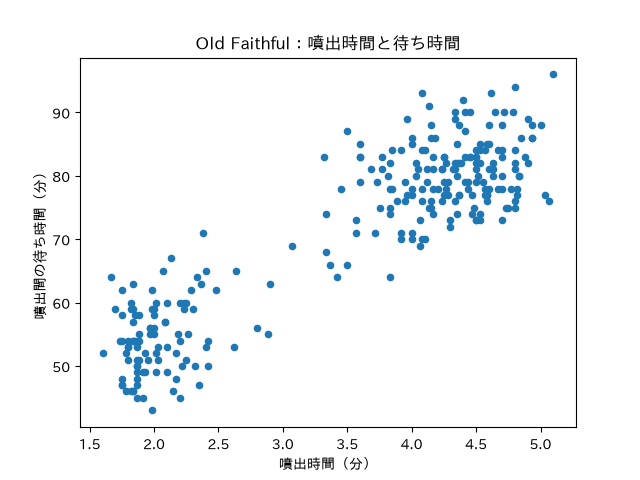

*噴出時間と行内の待ち時間の関連。全体に正の傾向がある一方、短い噴出・短い待ち時間と、長い噴出・長い待ち時間の集まりが見える。*

ヒストグラムとKDEは両変量の二峰性を示しました。Scott帯域では噴出時間の峰が約1.99・4.36分、待ち時間の峰が約53.72・79.90分です。帯域をScottの0.5・0.75・1.0・1.25倍にしても、検討したすべての仕様で峰は2個でした。これは帯域感度の確認であり、二峰性の正式な有意性検定ではありません。

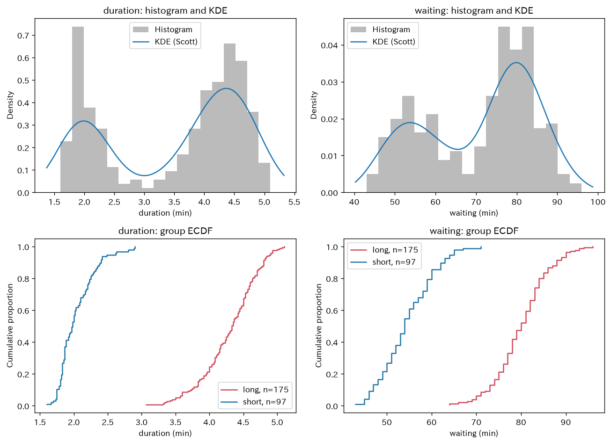

*上段は噴出時間・待ち時間のヒストグラムとKDE、下段は3分を境界にした群別ECDF。二峰性と条件別分布のずれを、全体平均とは別に示している。*

AIは探索的に3分未満を短噴出群、3分以上を長噴出群としました。既存ラベルや混合モデルによる分類ではありません。

| 群 | 観測数 | 噴出時間平均（分） | 待ち時間平均（分） | 待ち時間SD（分） | 群内Pearson r |
|---|---:|---:|---:|---:|---:|
| 短噴出（3分未満） | 97 | 2.0381 | 54.4948 | 5.8401 | 0.2902 |
| 長噴出（3分以上） | 175 | 4.2913 | 79.9886 | 5.9942 | 0.3728 |

群間の待ち時間平均差は25.493726分でした。全共分散を群内・群間に分解すると、群間成分の比率は0.946367、約94.6%です。全体の強い関連の多くは短長群の中心差に対応します。ただし、噴出時間で区切った範囲制限も群内相関を小さくするため、「群内に関係がない」とは言えません。この94.6%は因果寄与率でも説明分散R²でもなく、相関の符号が逆転するSimpsonの逆転を示した結果でもありません。

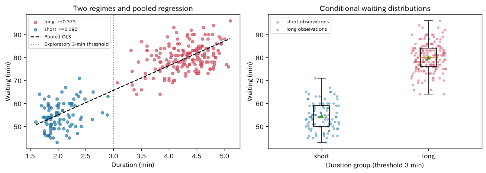

*左は探索的な3分境界、群内相関、全体回帰。右は群別の待ち時間分布で、群の中心は離れていても各群内に約6分の標準偏差と分布の重なりが残る。*

境界2.5・2.75・3.0・3.25・3.5分と、重複保持・除去を組み合わせた10仕様では、平均差は24.3678〜25.4937分でした。`run_sensitivity`の最大相対偏差は約4.42%、許容10%に対して`stable=True`です。初回ログは、この二峰性と約25.5分の差を述べたうえで、予測誤差や行依存性が未解決だとしています。以下の3回は、外部の追加確認とは別に、初回分析の中でAIが生成・実行した反復依頼です。

### AIが自律生成した追加依頼

**追加依頼1（原文）**:

```text
初回の散布図では二つの集まりがあり、全体相関の大半が群間差だった。これだけで個々の待ち時間を正確に予測できるとは言えないため、平均だけ・全体直線・短長群別平均・群別直線を同じ分割で交差検証し、残差と予測誤差を比較してください。またKaggleの公開メタデータで待ち時間の方向と単位を再確認し、確認できない定義は留保してください。
```

**選定理由**: 相関の強さを個々の予測能力と取り違えると、問いへの回答が変わるためです。

**結果**: `iteration-1`（実行番号6）では、同じ分割を使う5-fold交差検証を20回繰り返しました。各回の指標を平均した結果は次のとおりです。

| モデル | RMSE（分） | MAE（分） | 絶対誤差90パーセンタイル（分） |
|---|---:|---:|---:|
| 全体平均のみ | 13.6272 | 11.9977 | 21.0311 |
| 全体直線 | 5.9381 | 4.8169 | 9.6139 |
| 短長群別平均 | 5.9650 | 4.7755 | 9.8346 |
| 短長群別直線 | 5.6587 | 4.6554 | 9.0973 |

全体直線の全標本当てはめは、待ち時間=33.4744+10.7296×噴出時間でした。群別直線の全体直線に対する平均RMSE改善は0.27944分、20回の分割間SDは0.03252分です。群別直線でも90パーセンタイルの絶対誤差は約9.10分で、強い相関が精密な時刻予測を保証しないことが分かります。

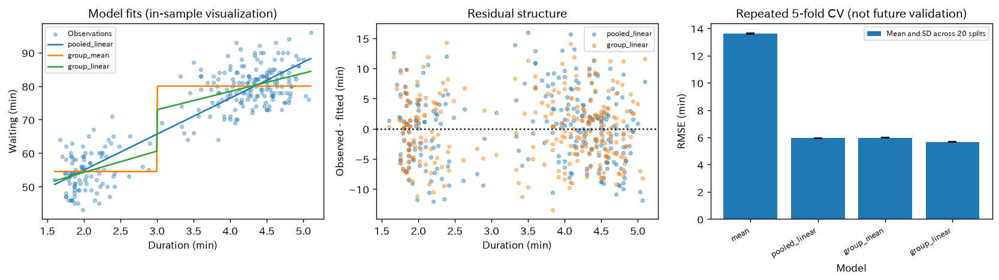

*左と中央は全標本での当てはめと残差、右は20回の反復5-fold交差検証のRMSE。誤差棒は分割間SDであり、信頼区間ではない。群別直線の改善は、残る個別誤差に比べて小さい。*

Kaggle公開メタデータのdescriptionは空で、R辞書が示す「次の噴出まで」という意味をKaggleコピーの測定規約として確定できませんでした。**証拠**は当該セルの実出力・PNGと、セル内に記載された結果保存処理です。別の結果JSONを本節の証拠として読み足してはいません。**残る限界**は、同一標本内の探索的比較、行独立性、探索的な固定境界、外部の最終テスト標本がないことです。

**追加依頼2（原文）**:

```text
反復1では群別直線のRMSE改善が約0.28分と小さく、ランダム分割が行の独立性に依存している。ファイル順のラグ相関を参考として調べ、行順を保持した前方分割とブロック・ブートストラップで、正の関連と短長群の待ち時間差の不確実性を確認してください。3分の探索的境界を2.5〜3.5分へ変えた場合の予測モデルの優位性も検討し、物理的な時間順が未確認である限界を明記してください。
```

**選定理由**: 小さな予測改善が、未検証の独立性や境界設定に依存していないかを調べるためです。

**結果**: `iteration-2`（実行番号7）では、ファイル順のラグ1相関が噴出時間−0.54995、待ち時間−0.53979、群別直線残差−0.22278でした。行順を無視した独立性は確定できませんが、真の観測順も未確認なので、物理的な交互噴出や周期の証明とは扱いません。

IID再標本化と円環ブロック長5・10・20の各1,500回のブートストラップでは、関連と群間差の符号が保たれました。

| ブロック長 | Pearson rの参考95%区間 | 長群−短群の待ち時間差の参考95%区間（分） |
|---|---|---|
| 1（IID） | 0.88185〜0.91795 | 23.98198〜27.01121 |
| 5 | 0.88365〜0.91619 | 23.85915〜27.04500 |
| 10 | 0.88265〜0.91704 | 24.04241〜26.94683 |
| 20 | 0.88407〜0.91685 | 23.84080〜27.09249 |

ファイル後半136観測を5ブロックに分け、それぞれより前の行で学習する前方分割でも、RMSEは全体平均13.6833分、全体直線5.9641分、群別平均6.1127分、群別直線5.7326分でした。ただしこれはファイル順への感度確認であり、確認済みの時間順による将来検証ではありません。

一方、境界を変える予測比較では、同じ10回の反復5-fold分割で、全体直線に対する群別直線のRMSE改善が2.5分境界で0.06418分、2.75分で0.11481分、3.0分で0.29035分、3.25分で0.27581分、3.5分で0.21818分でした。全仕様で改善は正ですが、最大相対偏差77.9%は許容20%を超え、`stable=False`です。**群間差の頑健性と、予測改善量の頑健性は別の評価である**という結論になりました。

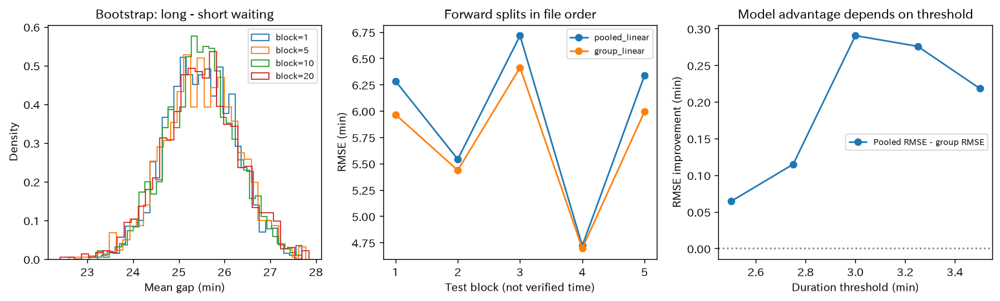

*左は再標本化方法ごとの待ち時間平均差の分布、中央はファイル順の前方分割誤差、右は境界によるRMSE改善量。大きな群間差が維持されても、小さなモデル改善量は境界に敏感である。*

**証拠**は`iteration-2`の実出力とPNGです。**残る限界**は、参考的なpercentile区間が標本の代表性を保証しないこと、円環ブロックが末尾と先頭を接続する仮定を追加すること、観測日時と真の順序がないことです。初回ログも、この段階で群間差は安定だがモデル改善は境界に敏感だったと記録しています。

**追加依頼3（原文）**:

```text
反復2で短長群の待ち時間差は再標本化でも大きく残ったが、群別直線の予測改善量は境界に敏感だった。Rデータ辞書が噴出時間の強い丸めを指摘しているため、噴出時間を±2.5秒および保守的に±5秒、整数の待ち時間を±0.5分揺らした感度分析を行い、相関・群間差・群所属・予測改善への影響を確認してください。これは測定誤差モデルの推定ではなく仮定に基づく摂動であると明記してください。
```

**選定理由**: 出典本文の丸めに関する注意が、同一数値ペアと小さな予測改善の解釈に影響し得るためです。

**結果**: `iteration-3`（実行番号8）では、摂動なし・噴出時間±2.5秒・±5秒の3仕様を各120回、合計360回計算しました。摂動を加える仕様では待ち時間にも±0.5分の一様摂動を加え、3分境界と1セットのCV分割を固定しました。

| 噴出時間の摂動 | Pearson rの最小〜最大 | 待ち時間平均差の最小〜最大（分） | 群移動の最大件数 | RMSE改善の最小〜最大（分） |
|---|---|---|---:|---|
| なし | 0.900811〜0.900811 | 25.493726〜25.493726 | 0 | 0.327741〜0.327741 |
| ±2.5秒 | 0.898314〜0.902114 | 25.406065〜25.567810 | 0 | 0.293406〜0.362050 |
| ±5秒 | 0.896500〜0.902768 | 25.343839〜25.577649 | 1 | 0.301771〜0.387486 |

仕様ごとの平均群間差に対する最大相対偏差は0.000465568、約0.0466%で、許容10%に対して`stable=True`でした。想定した丸め摂動では、大きな群間差と強い関連は変わりません。ここでの摂動なし改善0.32774分は固定した1セットの分割による値であり、反復1の20回平均0.27944分と同一の集計ではありません。

**証拠**は`iteration-3`の実出力です。この反復にPNG出力はありません。**残る限界**は、一様摂動が実際の測定誤差分布を推定したものではないことです。AIは、現データ内で結論を変え得る懸念を3回検討した一方、測定規約・日時・独立標本はCSVから復元できず、追加検定だけで解消できないと判断して停止しました。

### 結論

**噴出時間と待ち時間には強い正の関連があるが、単一の平均や直線だけでは二峰性と短長群の違いを見落とします。** 探索的な3分区分で待ち時間平均は約54.5分と80.0分に分かれ、その差約25.49分は境界・同一ペア除去・再標本化・想定した丸め摂動に対して安定していました。全体の共分散の約94.6%が群間成分に対応することも、単純相関だけでは分からない構造を示しています。

ただし、群別直線でも反復CVのRMSEは約5.66分、絶対誤差90パーセンタイルは約9.10分です。全体直線からの改善は約0.28分にとどまり、改善量自体は境界に敏感でした。AIは、**記述上の二群構造が頑健であることと、精密な予測が可能であることを切り分けました**。物理的な二状態、因果効果、現在の現地運用への予測性能、ファイル順からの周期性は主張していません。

### 監査と再現性

本節の実験結果の証拠は、指定されたNotebook、`initial-prompt.md`、`initial.log`、`followup.log`、`status.json`だけです。旧版資料は節の書式・詳細度の参考に限り、旧実験の結果を今回へ流用していません。Notebookのセル参照は0始まりのindexとセルIDを区別して用いています。

`status.json`では`analysis_complete=true`、`final_completion.ready=true`です。Notebookには取得・品質点検・初回分析・3回の反復・8件の根拠付き結論が残っており、この範囲で**分析は完了と判定**します。文書化状態のフラグは分析の成否判定に用いていません。

一方、**全10コードセルの実行番号・出力がすべて保存済み、とは言えません**。保存された実行番号は1〜9で、最終セル`final-audit`（index 32）は`execution_count=null`、出力なしです。Notebookメタデータの`audit_in_final_cell`は`ok=true`、`nbformat_valid=true`、コードセル10・実行済み9、未実行指摘0、エラー0、visual findings 0と記録していますが、末尾の監査セルがまだ実行終了していないため未実行判定から除外したという警告が1件あります。`status.json`の初回・最終監査にも同じ警告があります。したがって、「監査警告なし」「10/10実行完了」とは表現しません。

ライフサイクルの保存済み最終メタデータは`state=completed`で、`active_cell_executions`・`pending_notebook_writes`・`locks_held`はいずれも0です。これは終了状態の記録であって、最終監査セルの実行番号・出力の保存を代替するものではありません。`execution_route`にはクリーンカーネルでJupyter MCPから先頭順に実行したとの記録がありますが、`phase_log`の取得・定義、反復1・2の時刻には一部重なりがあり、記録だけで厳密な無重複の逐次実行まで確証とはしません。

図表はindex 9に3枚、12と15に各1枚、計5枚のPNGが保存されています。メタデータの描画チェックは5枚すべて`missing_glyphs=[]`で、主Notebookには手動の`metadata.chart`もあります。本節の図はNotebook内のPNGをそのまま抽出したもので、再描画や旧実験の図の転用ではありません。ただし、次節の再現結果が示すとおり、visual findings 0だけで図表属性の網羅的な監査を保証することはできません。

初回ログの末尾は、3回の追加分析後にクリーンカーネルで再実行・監査するという記述です。追加確認ログは「既存の3回の反復」を保持し、追加依頼を増やさず再評価・再実行すると記録しています。**外部の追加確認を、4回目の分析依頼とは数えません**。両ログ末尾には、Notebookが安定し監査条件を満たしたため外部ランナーがプロセス群を停止したとあります。`status.json`の終了理由も両方`artifact_complete_cutoff`、exit codeは両方0、所要時間は初回1,107.3秒・追加確認96.0秒です。終了理由は自然なCLI終了ではなく成果物条件による打切りです。

初回・最終の安定性記録はともに836,736 bytes、mtime=`2026-10-01T19:01:59.421646+00:00`でした。追加確認で別の最終出力が保存されたと断定できる記録はありません。再実行を行うとのログやメタデータと、保存済みNotebookで確認できる範囲を分けて扱います。

### 失敗・改善候補の切り分け

**修正済みの分析コード・SDKインターフェースの問題**: Notebookの`sdk-log`には、初回`dataset_list(search=..., page_size=10)`が`TypeError`となり、SDKシグネチャ確認後に未対応の`page_size`を除いて再試行したとあります。認証障害ではなく、呼出し側の引数誤りです。暫定CSV取得の後、Kaggle取得に成功しています。定義セルの余分な閉じ括弧による`SyntaxError`、HTMLタグで分割されるminutesの文字列判定、公開メタデータの`info`ネストの抽出も修正済みと記録されています。これらの過去の失敗はMarkdown記録に基づくもので、最終Notebookにエラー出力が残っているわけではありません。Jupytermind本体の障害やKaggleサービスの停止とは分類しません。

**ホスト・外部ランナーの制約**: Notebookは同期MCPClientがホストのツール環境に提供されていないため、分析コードをJupyter MCPの実セル実行で扱ったと記録しています。これをJupytermindの不具合とはしません。また、成果物条件によるプロセス停止と最終監査セルの保存上の留保は、今回の証拠だけではJupytermind・Copilot CLI・外部ランナーのどこに原因があるか確定できません。製品不具合として登録する根拠には使いません。

**Jupytermindの改善候補は1件**: `jupytermind-probe`（index 20、実行番号9）が図表記録・監査の機能不足を独立した小さなNotebookで再現しています。`ensure_notebook`と`enqueue_write`で空の診断用Notebookを用意し、`visualization.render_chart`で作った散布図を`visualization.record_chart`で記録後、`notebook_audit.audit_notebook(..., visual_audit=True)`を呼びました。実出力は`chart_metadata_present=false`、`audit_ok_without_chart_metadata=true`、`visual_findings=[]`です。

期待する挙動は、図表記録時に監査可能なタイトル・軸・凡例・グリフ確認情報を保存するか、監査側がそれらの未記録を指摘することです。実際には`record_chart`による図に`metadata.chart`がなくても監査が通り、未検査と問題なしを区別できません。主Notebookでは手動メタデータと実描画時のグリフ警告捕捉で回避しました。これはKaggle SDKや外部ランナーを介さず直接の図表記録・監査呼出しで再現した候補であり、図が実際に文字化けした、あるいは分析結果が誤ったことを示すものではありません。

分類、再現手順、期待・実際の挙動、影響、証拠、受け入れ条件は、本実験の`issue-candidate.json`へJSONオブジェクトとして保存しています。コード修正やGitHub Issue登録は行っていません。

### 残る限界

272観測の単一CSVで、日時、測定規約、抽出設計、季節・気象・地下状態などの説明変数がありません。Kaggle descriptionが空で、R辞書との完全な同一性や行内待ち時間の対応方向をコピー固有の事実として確定できません。分析前提検査も、対応方向と行独立性について`unresolved_conclusion_critical_assumption`の警告2件を残しています。

同一数値の追加出現16件が真の重複入力か別イベントかは判別できず、3分境界は探索的です。統計上の二群を物理状態と同一視できません。再標本化は母集団の代表性を保証せず、丸め摂動は仮定的で、モデル比較は同一標本内に限られます。現地の独立データによる検証なしに、現在の待ち時間予測へ外挿することはできません。加えて、最終監査セルの出力保存と図表メタデータ監査には上記の留保があり、分析完了と無条件の再現性保証は区別する必要があります。

## 実験20: Health Expenditure（MCP接続初期化失敗・分析未実施）

**課題**: 「Kaggle検索で見つかる国別医療支出・平均寿命データを分析し、支出と寿命の関係や国・年ごとの違いを調べてください。」

**初回プロンプトの生成方法**: 以下の初回プロンプトは、データセットと問い、および共通制約からAIが自動生成したものです。人間がこの実験向けに全文を個別作成したものではありません。`initial-prompt.md` に保存された全文を原文のまま掲載します。

**初回プロンプト（全文・原文）**: 「Kaggle検索で見つかる国別医療支出・平均寿命データを分析し、支出と寿命の関係や国・年ごとの違いを調べてください。時間変化と国差を区別する計画・図表を自分で選び、交絡や因果推論の限界を日本語で説明してください。AI Data Scientist SkillとJupyter MCPで計画と根拠付きの分析を記録し、再実行してください。 Kaggle参照先: https://www.kaggle.com/datasets?search=health+expenditure+life+expectancy。インストール済みkaggle Python SDKを使い、NotebookのJupyter MCP実行セル内で`KaggleApi().authenticate()`、`dataset_list(search=...)`、`dataset_list_files(...)`、必要に応じて`dataset_download_file(...)`を呼び出し、Kaggle上の対応する公開データを検索・取得してください。owner/dataset slug、取得ファイル名、取得日、ファイルSHA-256をNotebookに記録してください。APIトークンをセル出力・Notebook・ログへ表示しないでください。分析・API取得コードの実行はJupyter MCPだけを使い、端末コマンド、subprocess、外部スクリプト起動、作業エージェントへの委譲は行わないでください。Kaggle APIで対応データを検索・取得できなかった場合に限り、`/home/nahisaho/kaggle/experiments/white-paper.md`に記載された旧実験の公開CSV `https://raw.githubusercontent.com/mwaskom/seaborn-data/master/healthexp.csv` を取得して実験を継続してください。その場合はKaggle APIの失敗内容、フォールバックした理由、CSV URL、取得日時、SHA-256をNotebookに記録し、公開CSVとKaggle掲載版の完全な同一性は保証されないことを明記してください。保存先は benchmark/projects/kaggle-v020-kaggle-exp-20-healthexp/notebooks/kaggle-v020-kaggle-exp-20-healthexp.ipynb としてください。run_idは `v020-exp-20` です。長時間処理の開始前にlifecycle.register_runを呼び、実行・書込みフェーズを記録し、終了時にcompletedまたはfailedを記録してください。データ定義manifest、分析前提manifest、意味的な異常検査、妥当な範囲の感度分析を使い、適用できない機能は理由を記録してください。図表はvisual_audit=Trueで監査してください。Notebookには「使用したJupytermindモジュール」節を設け、直接import・呼び出したモジュール名、関数名、使用目的を記録してください。間接利用は使用済みに含めないでください。Jupytermindの不具合または機能不足が疑われた場合は「Jupytermind改善候補」節を設け、分類、再現条件、期待する挙動、実際の挙動、影響、回避策、関係するセルとログを記録してください。Copilot CLI、Kaggle API、ベンチマークランナーに固有の問題とは切り分け、候補がなければ「なし」と記録してください。初回分析後、自分で結果を読み直し、結論に実質的な影響を与える未解決点があれば自然言語の追加依頼文を作成し、Notebookの「反復依頼履歴」に原文のまま記録して実行してください。価値ある追加分析がなくなるまで最大3回繰り返し、各反復の選定理由・結果・証拠・残る限界を報告してください。最後に全コードセルを上から再実行し、notebook_auditとライフサイクル状態を記録してください。」

**使用したJupytermindモジュール**: Notebookで直接import・呼び出したことを確認できるモジュール・関数はありません。指定Notebookが存在せず、初回ログも分析コード実行前の停止を報告しています。したがって、指示文に登場する `lifecycle.register_run` や `notebook_audit` を使用済みとは扱いません。実際の呼び出しと使用目的を示すNotebookの記録は得られていません。

**初回指示**: 医療支出と平均寿命の関係を、国どうしの違いと同じ国の時間変化に分けて調べる依頼です。具体的な統計手法と図表の選択はAIに委ね、交絡と因果解釈の限界を日本語で説明するよう求めています。取得・分析はJupyter MCP内の実行に限定し、データの出典・ハッシュ、manifest、意味的な異常検査、感度分析、図表監査、ライフサイクル、最大3回の自律的反復、全コードセルの再実行まで記録する条件でした。初回ログの冒頭では、AIも「国どうしの差と同じ国の時間変化を分けて分析」すると述べていますが、これは実行予定の表明であり、分析実施の証拠ではありません。

**データ取得**: 未実施です。`initial.log` はKaggle APIが未実行だったことを明記しています。認証、データセット検索、ファイル一覧取得、ダウンロードの結果はなく、owner/dataset slug、取得ファイル名、取得日時、SHA-256、行数・列数、対象国・年も確認できません。Kaggle検索URLは探索の入口であり、取得したデータセットの出典ではありません。

公開CSVへのフォールバックも未実施です。初回指示ではKaggle APIで対応データを検索・取得できなかった場合に限って許可していましたが、今回はAPI自体を実行していません。初回ログは、この条件を満たさないためフォールバックしなかったと説明しています。プロンプト中のCSV URLを取得済みデータの出典として扱うこともできません。

**初回結果**: 統計結果・図表・根拠付きInsightは得られていません。初回ログは、Jupyter MCPの `use_notebook` と `list_kernels` が同じ接続初期化エラーで失敗したと報告しています。記録されたエラーは次のとおりです。

```text
JSON-RPC error: -32022
サーバー対応: 2026-07-28
クライアント要求: 2025-11-25
initialize handshake is not accepted
```

このログに基づく停止箇所は、分析コード実行前のMCP接続層です。初回ログは、端末実行・subprocess・外部スクリプト・エージェント委譲による代替を行わず、Notebookの作成・保存も未実施だったと報告しています。指定Notebookが存在しないことは、報告節作成時のファイル確認とも一致しています。支出と寿命の相関、国差、年次変化、調整後の関連について、数値や方向を推定する根拠はありません。

**AIが生成した追加依頼 — 原文・選定理由・結果**: 確認できる追加依頼の原文はありません。初回ログは反復を未実施と報告しており、指定された `followup.log` も存在しません。`status.json` の `followup_exit_code`、`followup_seconds`、`followup_termination` はいずれも `null` です。追加依頼の生成・実行を確認できないため、各回の選定理由、結果、証拠、残る限界も記載できません。これは「価値ある追加分析がなくなった」という判断ではなく、初回分析に到達できず反復の前提が成立しなかった状態です。

**図表**: 指定Notebookが存在しないため、抽出可能なPNG出力はありません。`benchmark/figures` への画像保存と節内の画像参照・キャプションは作成していません。旧実験の図や数値を流用したり、未実行の分析図を新たに生成したりすることはしていません。

**最終結論**: **本実験はMCP接続初期化で停止しており、分析未完了です。** `status.json` の `analysis_complete=false`、`final_completion.ready=false` と、指定Notebookの不在を根拠としています。「医療支出が高い国ほど長寿」「支出増が寿命を延ばす」「関連がない」のいずれも、本実験の証拠からは結論できません。確認できたのは、指定された実行経路で取得・分析を開始できなかったという実行上の結果です。

**監査・再現性**: `status.json` は初回プロセスについて `initial_exit_code=0`、`initial_seconds=50.5`、`initial_termination="exited"` を記録しています。ただし、プロセスの正常終了と分析完了は別です。`initial_stability` と `final_stability` はともに `stable=false`、`exists=false` で、初回・最終の監査記録には `exists=false`、`error="notebook_missing"` が残っています。`final_completion.requirements` の構造監査、最低実行セル数、図表、根拠付きInsight、反復履歴、モジュール使用記録、改善候補記録、監査呼び出しの各条件もすべて `false` です。これらはNotebookがない状態での未充足を示し、分析内容への個別の品質判定ではありません。

初回ログによれば、`v020-exp-20` のライフサイクル登録、`completed`／`failed` 記録、全セル再実行、Notebook監査はいずれも未実施です。データ定義・分析前提manifest、意味的な異常検査、感度分析、`visual_audit=True` の実行結果もありません。したがって、取得データの同一性、実行の再現性、監査合格を主張できません。今回の完了判定には、文書化状態を表す `documentation_complete`、`semantic_complete`、`report_exit_code` を使用していません。

**失敗内容と責任範囲の切り分け**: 初回ログが示す失敗は、MCPクライアントとサーバーが要求・対応するプロトコル版の不一致による接続初期化の拒否です。Jupytermindの分析関数の例外や、Kaggle APIの認証・検索・取得エラーは記録されていません。ログ末尾の `[runner] stopping process group: Copilot CLI exited; cleaning descendant runtimes` は、CLI終了後に外部ランナーが子プロセス群を整理した記録であり、それだけでランナーが接続失敗の原因だったとは判断できません。

このため、問題は外部実行基盤のMCP接続互換性として扱います。ただし、指定証拠だけでは、Copilot CLI側、サーバー側、または接続設定のどれが不整合を生んだかまで確定できません。初回ログは再開にプロトコル互換性の修復が必要だと述べていますが、修復や再試行が成功した証拠はありません。

**Jupytermind改善候補**: 指定証拠から裏づけられる候補はありません。Notebook内での直接呼び出しも機能評価も行われていないため、接続層の失敗をJupytermindの不具合・機能不足として登録しません。`issue-candidate.json` にはJSONの `null` を保存します。これはJupytermindに不具合がないという保証ではなく、本実験から候補を立てる証拠が得られなかったという意味です。

**残る限界**: 初回ログは停止理由を報告していますが、Notebookや追加確認ログがないため、セル単位の実行履歴や追加検証と照合できません。データ未取得により、測定単位、名目・実質・PPPの別、欠損、国年の範囲、交絡、時系列構造、因果解釈の妥当性も評価できません。参考文書 `white-paper2.md` は節の詳細度・書式の参考にのみ用い、そこに記載された旧実験の取得データ、分析結果、監査結果、不具合を今回の証拠として転記していません。

## 実験21: 太陽系外惑星の発見方法・測定経路と比較結果の頑健性（分析完了）

**課題**: 「Kaggleの太陽系外惑星発見データに相当する公開データから、発見年・発見方法・惑星特性の傾向を調べてください。」

**初回プロンプト（全文・原文）**: 「Kaggleの太陽系外惑星発見データに相当する公開データから、発見年・発見方法・惑星特性の傾向を調べてください。欠損や測定方法の違いを考慮して自分で分析を計画し、時系列またはカテゴリ比較に適した図表と解釈上の注意を日本語で示してください。AI Data Scientist SkillとJupyter MCPを用いて実行記録と根拠付きInsightを残し、再実行を確認してください。 Kaggle参照先: https://www.kaggle.com/datasets?search=exoplanets+discovery+methods。インストール済みkaggle Python SDKを使い、NotebookのJupyter MCP実行セル内で`KaggleApi().authenticate()`、`dataset_list(search=...)`、`dataset_list_files(...)`、必要に応じて`dataset_download_file(...)`を呼び出し、Kaggle上の対応する公開データを検索・取得してください。owner/dataset slug、取得ファイル名、取得日、ファイルSHA-256をNotebookに記録してください。APIトークンをセル出力・Notebook・ログへ表示しないでください。分析・API取得コードの実行はJupyter MCPだけを使い、端末コマンド、subprocess、外部スクリプト起動、作業エージェントへの委譲は行わないでください。Kaggle APIで対応データを検索・取得できなかった場合に限り、`/home/nahisaho/kaggle/experiments/white-paper.md`に記載された旧実験の公開CSV `https://raw.githubusercontent.com/mwaskom/seaborn-data/master/planets.csv` を取得して実験を継続してください。その場合はKaggle APIの失敗内容、フォールバックした理由、CSV URL、取得日時、SHA-256をNotebookに記録し、公開CSVとKaggle掲載版の完全な同一性は保証されないことを明記してください。保存先は benchmark/projects/kaggle-v020-kaggle-exp-21-planets/notebooks/kaggle-v020-kaggle-exp-21-planets.ipynb としてください。run_idは `v020-exp-21` です。長時間処理の開始前にlifecycle.register_runを呼び、実行・書込みフェーズを記録し、終了時にcompletedまたはfailedを記録してください。データ定義manifest、分析前提manifest、意味的な異常検査、妥当な範囲の感度分析を使い、適用できない機能は理由を記録してください。図表はvisual_audit=Trueで監査してください。Notebookには「使用したJupytermindモジュール」節を設け、直接import・呼び出したモジュール名、関数名、使用目的を記録してください。間接利用は使用済みに含めないでください。Jupytermindの不具合または機能不足が疑われた場合は「Jupytermind改善候補」節を設け、分類、再現条件、期待する挙動、実際の挙動、影響、回避策、関係するセルとログを記録してください。Copilot CLI、Kaggle API、ベンチマークランナーに固有の問題とは切り分け、候補がなければ「なし」と記録してください。初回分析後、自分で結果を読み直し、結論に実質的な影響を与える未解決点があれば自然言語の追加依頼文を作成し、Notebookの「反復依頼履歴」に原文のまま記録して実行してください。価値ある追加分析がなくなるまで最大3回繰り返し、各反復の選定理由・結果・証拠・残る限界を報告してください。最後に全コードセルを上から再実行し、notebook_auditとライフサイクル状態を記録してください。」

**初回指示**: 分析計画と図表の選択はAIに委ね、欠損と測定方法の違いを考慮するよう求めました。取得元の記録、実行・書込みのライフサイクル管理、データ定義・分析前提manifest、意味的異常検査、感度分析、画像監査、最大3回の自律的な追加依頼、全コードセルの再実行を要求しています。追加依頼の分析項目は事前に指定していません。公開CSVへの移行はKaggle APIで検索・取得できない場合だけ許可されました。

### 使用したJupytermindモジュール

以下は対象Notebookのコードに直接import・呼出しがあるモジュールです。表のセル番号は0始まりで、実行番号とは異なります。エラー時・根拠更新時だけ通る分岐は、その条件も明記します。Notebookの使用記録だけを根拠に、別の著作補助Notebookでの呼出しまで本Notebookの実績として加算しません。

| モジュール | 関数・クラス | 使用目的 |
|---|---|---|
| `ai_data_scientist.project_manager` | `resolve_project`, `ensure_notebook`, `ensure_data_dir`, `enqueue_write` | プロジェクト・Notebook・データ保存先を解決。根拠manifestが変化した場合の書込みを直列化（セル1・32）。 |
| `ai_data_scientist.language_router` | `detect_language` | 日本語の分析指示を判定（セル1）。 |
| `ai_data_scientist.lifecycle` | `register_run`, `is_cancel_requested`, `mark_execution_start`, `mark_execution_end`, `mark_write_start`, `mark_write_end`, `mark_failed`, `mark_completed`, `wait_for_quiescence`, `get_run_status` | run登録、実行・書込みフェーズ、中止要求、例外時の失敗、正常完了と静止状態を管理。`mark_failed`は例外分岐であり、最終状態は`completed`（セル1・各phase・32）。 |
| `ai_data_scientist.ingestion` | `SourceSpec`, `ingest` | 原本CSVを行上限10万行で取り込み、切詰めがないことを確認（セル7）。 |
| `ai_data_scientist.cleaning` | `clean_dataset` | 完全重複行の除去影響を記録。実際の削除は0行（セル7）。 |
| `ai_data_scientist.eda` | `explore` | 使用列の型、欠損、要約統計、カテゴリ構成を確認（セル7）。 |
| `ai_data_scientist.data_definition` | `FieldValue`, `build_manifest`, `DataDefinitionManifest.unresolved_fields` | 出典・単位・観測単位と定義の確実性を記録し、未確定項目を列挙（セル6）。 |
| `ai_data_scientist.analysis_assumptions` | `Assumption`, `AnalysisAssumptionManifest`, `check_manifest` | 記述分析の範囲と結論に重要な未検証前提を記録・検査（セル7・30）。 |
| `ai_data_scientist.data_quality` | `detect_anomalies` | 年の範囲、カテゴリ、欠損、一意性、物理量・限界フラグを宣言的に検査（セル7）。 |
| `ai_data_scientist.sensitivity` | `SensitivityPlan`, `run_sensitivity` | 測定経路4仕様、時間窓12仕様、観測単位・完全ケース等8＋8仕様を比較（セル17・21・24）。 |
| `ai_data_scientist.visualization` | `render_chart`, `build_image_output` | 年次折れ線図の描画と、Matplotlibで作成した図を含むPNGの画像MIME出力化（セル10・11・12・18・25）。 |
| `ai_data_scientist.insight_engine` | `extract_cited_value` | 引用値を実行出力から再確認し、再実行後の根拠参照を同期（セル32）。 |
| `ai_data_scientist.notebook_audit` | `audit_visual_outputs`, `audit_notebook` | 画像メタデータ欠落の監査プローブ、最終`visual_audit=True`監査（セル26・32）。 |

`record_insight`は直接importされていますが、対象Notebookのコードには呼出しがありません。根拠付きInsight 7件は保存されていますが、この関数を対象Notebook内で実行したとは数えません。`mcp_gateway.run_and_record`は接続に必要な実行アダプタがないため直接利用せず、実行はJupyter MCP経由と記録されています。カテゴリ比較に不適切な全方法混合のPearson相関、長い裾の分布に対する機械的なz-score外れ値判定、独立の第二カタログを欠くデータセット照合も適用せず、層別記述・意味的制約・感度分析を選びました。

### データ取得と初回結果

Kaggle APIで`exoplanets discovery methods`、`planets seaborn`、`exoplanet`を検索し、候補29件を記録しました。3データセットのファイル一覧を確認した後、`kaggleprollc/planetary-systems-dataset-nasa`の`NASA_Exoplanet_Composite.csv`を採用しています。複数の発見方法、発見年、質量の由来を持ち、参考文献別の重複行ではなく原則1惑星1行の複合表を選んだという理由が残っています。

| 項目 | Notebookの記録 |
|---|---|
| 取得元 | `kaggleprollc/planetary-systems-dataset-nasa` |
| ファイル | `NASA_Exoplanet_Composite.csv` |
| 取得日時 | `2026-10-01T19:17:12.261114+00:00`（UTC） |
| SHA-256 | `bb5b540cf191d9884515e4dfcb4d694896991c128b9d18a02a714ef19c907214` |
| サイズ・構造 | 38,721,772バイト、5,483行・313列、4,087主星 |
| 発見年の範囲 | 1992–2023年 |
| フォールバック | 使用なし（`fallback_used=False`） |

Kaggle APIの認証・ダウンロード成功がNotebookに記録されています。NASAの列辞書と複合表の計算説明もNotebook内から取得し、使用列の単位と由来を確認しました。ただし、これは定義の確認であり、KaggleファイルとNASA現行版の完全同一性を照合したものではありません。取得日はカタログ更新日ではなく、最大の論文発行月は2023-08です。今回の数値はこの取得ファイルに限るもので、書式参照に用いた旧実験の数値は引き継ぎません。

惑星名の一意性と完全重複0行を確認し、切詰めはありません。宣言したスキーマでの意味的異常、確認列の非有限値・非正値・数値変換失敗・非整数年はいずれも0件でした。発見年と発見方法の欠損は0件ですが、公転周期239件、質量25件、半径18件、星系距離22件が欠損しています。欠損を一括補完せず、比較ごとに利用可能な分母を示しました。物理量では欠損・非正値・非有限値・上限下限フラグを除外し、質量・半径は識別できた計算値も除外しています。

全期間ではTransit（トランジット法）が4,103件（74.8%）、Radial Velocity（視線速度法、以下RV）が1,048件（19.1%）、Microlensingが201件、Imagingが68件でした。最多年は2016年の1,517件です。初回から、年別件数を宇宙全体の存在頻度や観測能力そのものの推移と混同しない方針を採っています。

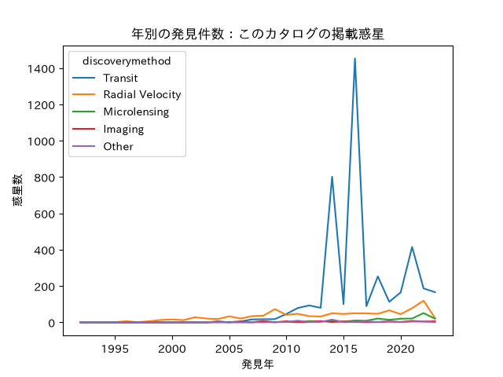

*NotebookのPNG出力をそのまま抽出した年別・方法別件数。2014年と2016年のTransitの集中が目立ち、カタログへの確認・公開のまとまりを追加検証する契機となった。*

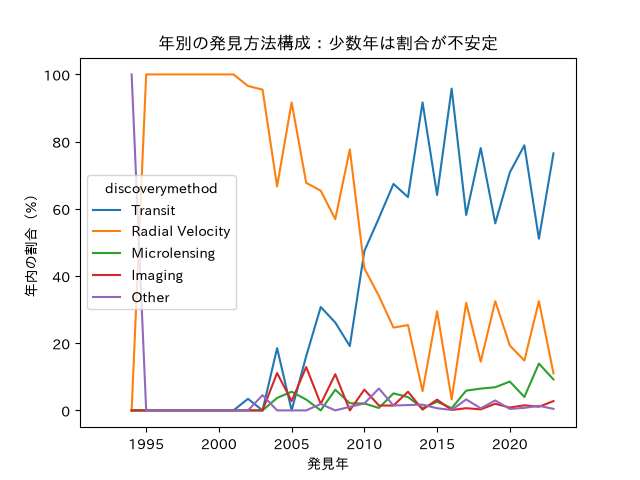

*年内の発見方法構成比。初期はRV中心、後年はTransit中心へ変化するが、少数件の年の割合は不安定で、方法の検出効率の比較にはならない。*

初回の利用可能ケース比較では、Transitの公転周期中央値は8.483日（n=4,101）、RVは352.2日（n=1,043）でした。星系距離中央値はTransit 555.134 pc（n=4,089）、RV 43.8214 pc（n=1,048）、Microlensing 5,900 pc（n=199）です。ここでの距離は主星系までの距離で、惑星の軌道半径ではありません。Transitの半径中央値は2.37地球半径（n=4,099）でしたが、RVの非計算半径は23件のみです。Imagingの周期は22件、Microlensingは10件しか利用できず、方法ごとの中央値を同じ代表性で読めません。

質量の計算値・質量半径関係による値は2,883行、半径の計算値は1,294行ありました。低い欠損率が豊富な直接測定を意味するか、発見年・施設が物理量比較と交絡していないか、主星内の複数惑星と完全ケース選択が結果を変えないかが、追加依頼の具体的な論点になりました。

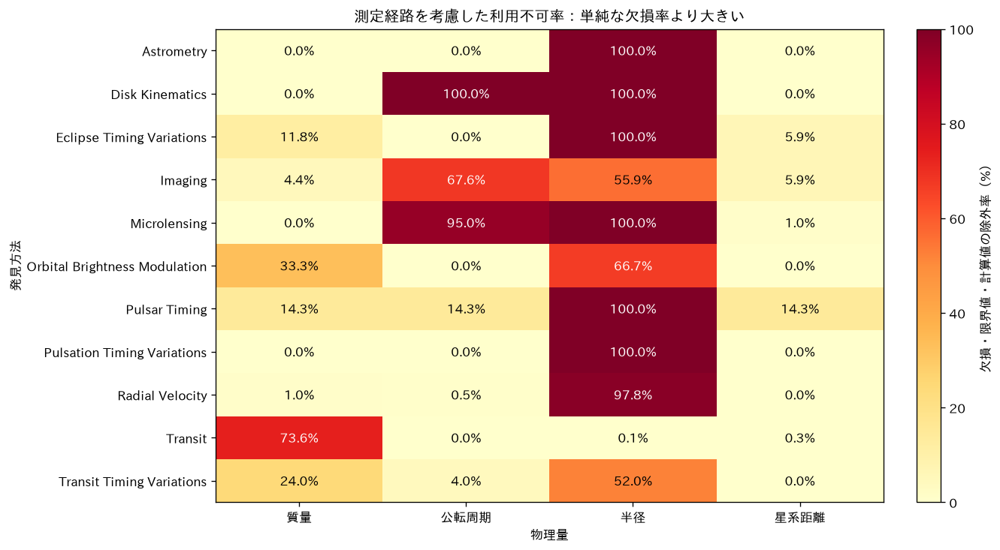

*欠損だけでなく限界値・識別できた計算値等を除外した利用不可率。Transitの質量やRVの半径は、単純な値の記録率から想像するより利用できる対象が少ない。表示の0.0%は丸め値であり、必ずしも全件利用可能を意味しない。*

### AIが自律生成した追加依頼

**追加依頼1（原文）**

> 質量・半径の欠損が少ない理由を、計算値と通常の観測値の違いから調べてください。推定値込みと推定値除外で代表値がどれだけ変わるか、質量をMass・Msini別に示し、誤差が記載された値だけに限定した感度分析も行ってください。

**選定理由**: 初回で計算値が多いと分かり、欠損率だけでは実測情報の不足を表せないため、方法別質量中央値が測定経路に依存するか確認する必要がありました。

**結果**: Transitの質量中央値は計算値込みで6.39地球質量（n=3,960）、計算値除外で107.266525（n=1,082）、さらに両側誤差記載ありで106.236525（n=1,076）でした。計算値除外で約16.8倍となり、4仕様の`run_sensitivity`は`stable=False`、基準値に対する最大相対変動は15.7866です。RVでは`Msini`の805件の中央値209.7678地球質量と、`Mass`の217件の中央値1,880.90851地球質量も異なります。`Msini`は傾斜角に依存する下限相当の量で、真の質量と同一には扱えません。

半径にも同様の問題があります。RVは計算値込み1,037件の中央値12.6地球半径に対し、計算値を除いた23件では3.89、両側誤差あり22件では3.403でした。Microlensingの半径は記録値201件の中央値12.5ですが、計算値除外後は0件です。**複合表の高い充足率を、直接測定率や代表性と読み替えない**という結論に修正されました。証拠はセル17の利用可能性・質量由来別集計と4仕様の出力、セル19の根拠付きInsightです。残る限界は、計算値以外の`Mass`にも異なる測定・モデル経路が含まれ、追観測対象の選択を取り除けないことです。

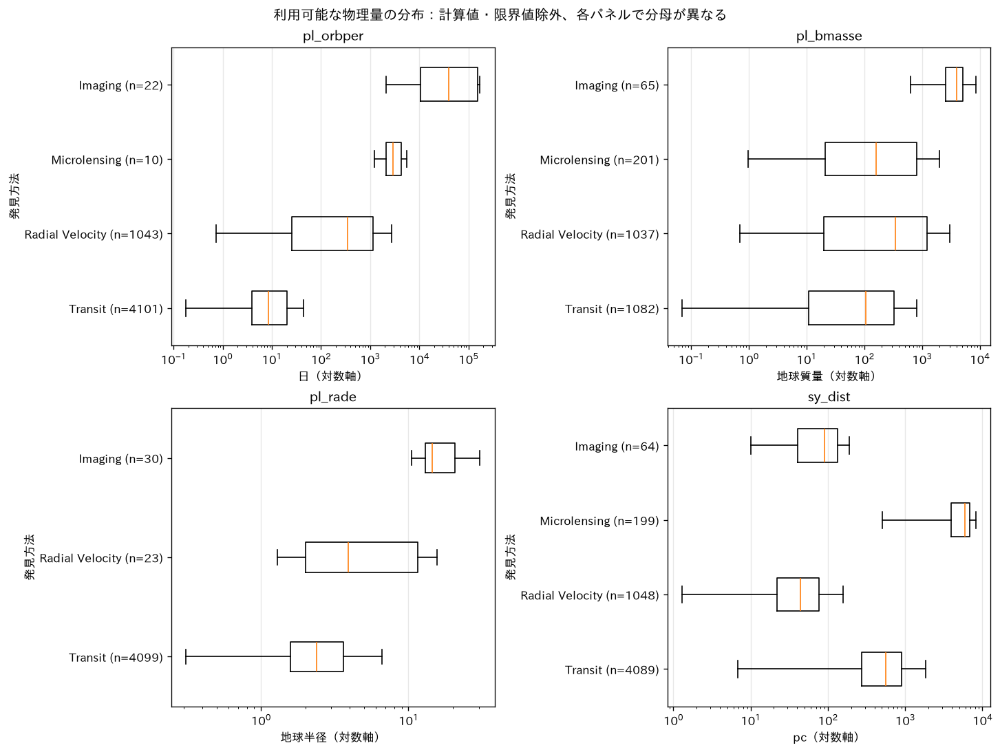

*計算値・限界値を除いた利用可能データの箱ひげ図。横軸は対数尺度で、各パネル・方法の分母を表示し、外れ点は描画しない。Microlensingの半径は利用可能0件のため表示されない。外れ点を描かないことと、解析データから除去することは別である。*

**追加依頼2（原文）**

> 2014年・2016年の発見件数の急増が、特定の観測施設や一括公開に集中しているか調べてください。発見時期をそろえた方法別の周期・距離比較も行い、最終年と急増年を除いてもTransit中心という結論が保たれるか確認してください。

**選定理由**: 2016年の1,517件への集中を受け、年次件数のピークと、方法別周期・距離の違いが施設構成や発見時期に左右される可能性を検証しました。

**結果**: 2014年は875件中785件（89.7%）、2016年は1,517件中1,282件（84.5%）がKeplerに集中しました。Transitはそれぞれ802件、1,453件です。この集中は一括公開・確認の影響と整合的ですが、個別の公開過程を調べたわけではなく、カタログだけでピークの発生機序は確定できません。

開始年を2010・2014・2018年、2014年・2016年の除外有無、最終年2023年の除外有無で組み合わせた12仕様では、Transit比率は65.9–82.2%で、全仕様で過半数でした。基準仕様は2010年以降・急増年と最終年を含む場合の79.7%で、最大相対変動0.17394は事前許容20%以内、`stable=True`でした。これはこの仕様範囲の安定性判定であり、統計的有意性や宇宙全体の代表性を示すものではありません。同時期の比較でも、TransitはRVより周期中央値が短く、星系距離中央値が大きい方向を維持しました。証拠はセル21の施設集中・時代別集計・12仕様の出力とセル22のInsightです。観測時間、未検出対象の母数、検出効率がないため、方法の効率や惑星の存在頻度は依然として推定できません。

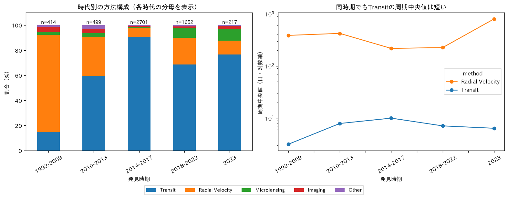

*左は各時代の掲載惑星数を添えた方法構成、右はTransitとRVの周期中央値の対数軸比較。同時期にも周期の方向差が残る一方、最後の2023年は途中集計の可能性があり、完全年と断定しない。*

**追加依頼3（原文）**

> 同じ主星に複数惑星が含まれることと、全物理量が揃った完全ケースへの限定が、方法別の周期比較をゆがめないか調べてください。主星ごとの中央値を等重みで扱う場合、時期を変えた場合、両端1%を除く場合を比較し、結論の方向と大きさの安定性を別々に報告してください。

**選定理由**: 同時期でも方法差は残りましたが、複数惑星系の重複した重みと、半径まで測定された少数のRV惑星だけへの限定が、比較の対象集団を変える懸念が残りました。

**結果**: 2023年を除外した1992年以降の8仕様と、2010年以降・2018年以降の変数別利用可能ケース8仕様を比較しました。主星ごとの周期中央値を等重みで扱うか、方法内の周期の両端1%を除外するか、全4物理量が揃った完全ケースにするかを変えています。変数別ケースでのRV/Transit周期中央値比は31.819–73.139ですが、完全ケースでは1.197–1.470まで縮みました。全カタログで完全ケースに残るRVは1,048惑星中23惑星（2.19%）のみで、Transitは4,103惑星中1,076惑星（26.22%）です。

1992年以降8仕様の最大相対変動は0.97035、最近期8仕様は1.26045で、いずれも`stable=False`でした。今回評価できた16仕様ではRVの周期中央値が長い方向は同じでも、**差の大きさは頑健ではありません**。最近期の完全ケースに主星等重みや両端除外を組み合わせるとRV主星が10未満となるため、その仕様は不適用として明記されました。証拠はセル24の仕様別集計・完全ケース残存数とセル27のInsightです。主解析は変数別利用可能ケースとし、完全ケースの結果を惑星全体へ外挿しない方針になりました。主星内中央値による等重み化も、検出確率や惑星の存在頻度を補正したものではありません。

**反復の終了判断**: 3回で測定経路、施設集中、時代、主星の重み、完全ケース、両端除外を確認しました。残る不確実性は未検出対象・観測効率・カタログ更新時点・複合値の自己整合性に由来し、同じCSVの加工だけでは解消できないため終了しています。追加確認ログは再評価方針を示しますが、新しい追加依頼や完了報告は残していません。3回の反復はすでに初回実行のNotebookと`initial.log`に記録されており、追加確認による新たな第4回の分析とは扱いません。

### 結論

このカタログでは発見方法の構成が初期のRV中心から後年のTransit中心へ変わり、時間窓や急増年・最終年の扱いを変えてもTransitの過半数は維持されました。一方、年次ピークは施設集中が強く、連続的な探索能力の増加とは解釈できません。方法別の周期・質量・半径・星系距離は異なりますが、検出選択と追観測、測定・計算経路、欠損によって比較対象が変わります。

追加分析の価値は、分析手法を増やすことより、**値が埋まっていることと測定情報が揃っていることを区別し、差の方向と大きさの頑健性を分けたこと**にあります。Transitの質量中央値の大きな変化と、完全ケースでの周期差の縮小から、カタログの中央値を真の惑星分布や発見方法の因果効果へ読み替える結論は支持されません。`status.json`の`analysis_complete=True`、`final_completion.ready=True`とNotebookの再実行・最終状態に基づき、実験分析は完了と判断します。

### 再現性と監査

Notebookは`benchmark/projects/kaggle-v020-kaggle-exp-21-planets/notebooks/kaggle-v020-kaggle-exp-21-planets.ipynb`に保存されています。初回ログには全体の分析・3反復・再実行完了の報告があり、`status.json`では初回終了コード0、1,454.4秒、通常終了（`exited`）です。追加確認は96.2秒、終了理由は`artifact_complete_cutoff`で、`followup.log`には「Notebook remained stable and passed semantic audit」を根拠とするランナーの停止記録があります。これは成果物監査による外部ランナーの終了判断であり、追加確認セッションの自然終了や新しい分析完了報告とは区別します。終了コードだけを成功の証拠にはしていません。

再実行メタデータには、Jupyter MCPのカーネル再起動後、全18コードセルを順に実行したことが記録されています。API検索は再呼出ししますが、分析対象は取得済みCSVのSHA-256を検証して固定しています。再実行の開始・終了はUTCで2026-10-01 19:29:54から19:34:45、数値結果SHA-256は初回基準値と再実行の双方で`ee7189afa1bfa2b24588cba27b9612b69acb0e32b9f2be097be68b8e76bd63c9`となり、`numeric_results_identical=True`です。セル30の実出力でもハッシュ一致が確認されています。

最終セル32の実行中監査は実行済み17/18で、「監査を呼ぶ末尾セルがまだ実行中」というwarningが1件あります。その後の保存後監査はNotebookの`final_notebook_audit`と`status.json`の`final_audit`にあり、nbformat有効、18/18実行済み、未実行0、エラー0、図表セル5、根拠付きInsight 7、`findings`・`visual_findings`とも0件です。セル32の出力とNotebookメタデータのライフサイクルは`completed`、実行中セル・保留書込み・ロックはすべて0です。5点の図はNotebookのPNGバイト列を加工せず抽出しています。

ただし、**構造・画像監査の指摘0は、科学的前提の未解決点0を意味しません**。セル30の`check_manifest`は、2023年が途中集計かもしれないという重要前提が`assumed`のままであるwarningを1件返しています。独立したカタログ照合、検出効率、更新時点の検証は未完了です。

### 失敗・Jupytermind改善候補

最終Notebookに未解決の実行エラーや分析停止はありません。ただし、修正済みの作図・著作問題と改善候補が記録されています。Notebookは初回棒図のラベル切れ、作図の独自クリッピング検査が未描画目盛まで数えた問題、bootstrapの`NameError`を報告しています。置換前の図やこれらの詳細な実行履歴は指定された初回・追加確認ログに残っていないため、例外内容や発生回数までは確認できません。独自検査とbootstrapの問題はNotebook著作側に分類されており、Jupytermind本体の確定不具合としては扱いません。最近期完全ケースの標本不足も、データと分析仕様の制約です。

| 分類 | 証拠と実際の挙動 | 影響・回避策・帰属 |
|---|---|---|
| 可視化の可読性不足（履歴記述に基づく候補） | セル29に、`render_chart(kind='bar')`で11種類の長い方法ラベルの下端が切れたと記録。置換前PNGは現存Notebookにないため、この出力を直接再確認はできない。 | 方法名が読みづらくなる。現在のセル12は余白調整付きヒートマップへ置換。Jupytermindの描画候補だが、原因と修正前の状態は再現確認が必要。 |
| 監査機能不足（保存出力で再現確認） | セル26でPNGだけを持つ`metadata.chart`なしのプローブを作成し、`audit_visual_outputs`の結果は空配列。 | タイトル・軸・凡例・glyph検査情報の欠落を画像監査が警告しない。全図へ明示メタデータを付ける回避策を採用。Kaggle API・CLI・ランナーを介さない関数呼出しであり、Jupytermind監査機能の候補。 |
| Notebook書込みとライブ実行の連携仕様不足（帰属未確定） | セル29に、実行中セル32から同じNotebookへ`enqueue_write`した際、処理後にライブ読取りで実行番号と出力が失われたと記録。最終セル32には実行番号・出力があり、現存成果物では解消済み。 | 未実行セルに見える可能性。別の著作補助Notebookから同期し、変更がなければ最終セルでは書かない回避策。Jupytermindのファイル書込みとJupyter MCPのライブ文書同期の境界であり、根本原因は未確定。 |

Kaggle取得失敗は記録されず、公開CSVへのフォールバックもありません。追加確認の打切りはベンチマークランナーの制御で、Jupytermindの分析失敗には分類しません。Copilot CLI固有の障害を裏付ける記録もありません。改善候補の分類・再現手順・期待と実際・影響・証拠・受け入れ条件は`benchmark/runs/21-kaggle-exp-21-planets/issue-candidate.json`に保存し、保存出力で確認できる候補と履歴のみ・帰属未確定の候補を分けています。ここで新たなGitHub Issue登録や本体修正は行っていません。

### 残る限界

NASA由来の複合表は異なる文献・測定・計算経路の値を混在させています。計算値の識別と誤差記録の有無だけで、全値の直接測定性や相互整合性を保証できません。`disc_year`は最初の発見年として定義を確認していますが、公表・確認・カタログ反映の全過程を分離した分析ではありません。最終年2023年の217件を完全年と断定できず、2026年時点の全発見状況を表すデータでもありません。

方法別の欠損と選択は無作為でなく、完全ケースは特定の追観測対象へ強く偏ります。観測時間、検出確率、未検出の母数がないため、宇宙全体の惑星分布、方法の効率、因果効果は推定できません。主星内の等重み化や外れ値感度もこの不足を補うものではありません。原本固定で再現されたのは今回のCSVと解析の数値結果であり、将来のKaggle検索や更新後データの同一性ではありません。ライセンス本文も未確認のため、データ再配布の許諾は主張しません。

## 実験22: 北極海氷の長期傾向と季節変動の分離

Jupytermind v0.2.0ベンチマークのArctic Sea Ice実験です。以下の結果は、指定されたNotebook、`initial-prompt.md`、`initial.log`、`followup.log`、`status.json`だけに基づきます。既存白書は節の詳細度・書式の参考にのみ使用し、旧実験のデータセットや数値は転用していません。

**課題**: 「Kaggle上の北極海氷データに相当する公開時系列データを分析し、長期傾向と季節変動を分けて示してください。」

**初回プロンプト（全文・原文）**: 「Kaggle上の北極海氷データに相当する公開時系列データを分析し、長期傾向と季節変動を分けて示してください。時間軸・単位を確かめて自分で計画と図表を選び、どこまで結論できるかを日本語で記録してください。AI Data Scientist SkillとJupyter MCPを使い、コード・出力・根拠付きInsightを保存し、再実行可能か検証してください。 Kaggle参照先: https://www.kaggle.com/datasets?search=arctic+sea+ice+extent。インストール済みkaggle Python SDKを使い、NotebookのJupyter MCP実行セル内で`KaggleApi().authenticate()`、`dataset_list(search=...)`、`dataset_list_files(...)`、必要に応じて`dataset_download_file(...)`を呼び出し、Kaggle上の対応する公開データを検索・取得してください。owner/dataset slug、取得ファイル名、取得日、ファイルSHA-256をNotebookに記録してください。APIトークンをセル出力・Notebook・ログへ表示しないでください。分析・API取得コードの実行はJupyter MCPだけを使い、端末コマンド、subprocess、外部スクリプト起動、作業エージェントへの委譲は行わないでください。Kaggle APIで対応データを検索・取得できなかった場合に限り、`/home/nahisaho/kaggle/experiments/white-paper.md`に記載された旧実験の公開CSV `https://raw.githubusercontent.com/mwaskom/seaborn-data/master/seaice.csv` を取得して実験を継続してください。その場合はKaggle APIの失敗内容、フォールバックした理由、CSV URL、取得日時、SHA-256をNotebookに記録し、公開CSVとKaggle掲載版の完全な同一性は保証されないことを明記してください。保存先は benchmark/projects/kaggle-v020-kaggle-exp-22-seaice/notebooks/kaggle-v020-kaggle-exp-22-seaice.ipynb としてください。run_idは `v020-exp-22` です。長時間処理の開始前にlifecycle.register_runを呼び、実行・書込みフェーズを記録し、終了時にcompletedまたはfailedを記録してください。データ定義manifest、分析前提manifest、意味的な異常検査、妥当な範囲の感度分析を使い、適用できない機能は理由を記録してください。図表はvisual_audit=Trueで監査してください。Notebookには「使用したJupytermindモジュール」節を設け、直接import・呼び出したモジュール名、関数名、使用目的を記録してください。間接利用は使用済みに含めないでください。Jupytermindの不具合または機能不足が疑われた場合は「Jupytermind改善候補」節を設け、分類、再現条件、期待する挙動、実際の挙動、影響、回避策、関係するセルとログを記録してください。Copilot CLI、Kaggle API、ベンチマークランナーに固有の問題とは切り分け、候補がなければ「なし」と記録してください。初回分析後、自分で結果を読み直し、結論に実質的な影響を与える未解決点があれば自然言語の追加依頼文を作成し、Notebookの「反復依頼履歴」に原文のまま記録して実行してください。価値ある追加分析がなくなるまで最大3回繰り返し、各反復の選定理由・結果・証拠・残る限界を報告してください。最後に全コードセルを上から再実行し、notebook_auditとライフサイクル状態を記録してください。」

**使用したJupytermindモジュール**: 以下はNotebookで直接importされた `ai_data_scientist` 配下のモジュールと、コードに記載された直接呼び出しです。セル番号はNotebook配列の0始まりです。実行カウント1〜11のセルで確認できる利用と、出力未保存の最終セル21にある処理を区別します。後者の関数は呼び出しコードの存在を報告するもので、実行成功を確認した利用には含めません。間接利用したモジュールも含めません。

| モジュール | 関数・型 | 使用目的と確認範囲 |
|---|---|---|
| `project_manager` | `resolve_project`、`ensure_notebook`、`ensure_data_dir`、`enqueue_write` | プロジェクト・Notebook・原本保存先の確保。`enqueue_write` による文書・図表メタデータ書込みは最終セルに記載。 |
| `language_router` | `detect_language` | 日本語判定。出力は `ja`。 |
| `lifecycle` | `register_run`、`is_cancel_requested`、`mark_execution_start`、`mark_execution_end`、`mark_write_start`、`mark_write_end`、`mark_failed`、`mark_completed`、`get_run_status`、`wait_for_quiescence` | 実行登録とフェーズ管理。登録時の `running` は出力で確認。書込み処理・完了処理は最終セル、`mark_failed` は例外経路に記載され、終了状態の保存出力はない。 |
| `ingestion` | `SourceSpec`、`ingest` | 固定CSVを10万行上限で読み込み。打切りなし。 |
| `cleaning` | `clean_dataset` | 完全重複除去と前後行数の記録。削除0行。 |
| `eda` | `explore` | 型・欠測・要約統計の確認。 |
| `data_definition` | `FieldValue`、`build_manifest`、`DataDefinitionManifest.unresolved_fields` | 来歴・時間軸・単位・定義を `verified` / `inferred` / `unknown` に分けて記録。推定定義は別途走査して留保。 |
| `analysis_assumptions` | `Assumption`、`AnalysisAssumptionManifest`、`check_manifest` | 重み・観測率・固定季節性・推論範囲の前提検査と追加分析後の更新。 |
| `data_quality` | `detect_anomalies` | 値域、半球、非欠測、一意日付キーの意味的検査。観測間隔の検査はNotebook側の処理。 |
| `stats_analysis` | `correlation` | 年と年平均の記述的相関。独立標本を前提とするp値は主結論に使用しない。 |
| `sensitivity` | `SensitivityPlan`、`run_sensitivity` | 24仕様で傾向の方向・効果量の安定性を比較。 |
| `visualization` | `render_chart`、`build_image_output` | 5図のPNG生成と画像MIME出力。 |
| `insight_engine` | `extract_cited_value`、`record_insight` | 最終セルに、実行出力からの数値引用とEvidence manifest付きInsightの保存処理を記載。保存された5件のInsightは確認できるが、最終セルの完了出力はない。 |
| `notebook_audit` | `audit_notebook`、`audit_visual_outputs` | 最終セルに `visual_audit=True` の監査と改善候補の再現処理を記載。呼び出し結果はNotebookに保存されていない。 |

回帰・HAC区間はstatsmodels、Theil–SenはSciPy、ブロック再標本化はNotebook内の自作関数による計算です。これらをJupytermindモジュールの機能としては数えていません。

**初回指示**: 分析計画、比較、図表はAI自身に選ばせ、時間軸と単位の確認、根拠と限界の日本語記録、最大3回の自律的追加分析を求めました。取得はKaggle APIを優先し、検索・取得失敗時だけ指定公開CSVを許可しました。v0.2.0向けの要件として、ライフサイクル登録、データ定義・分析前提manifest、意味的品質検査、感度分析、可視化監査、直接利用モジュールの記録を追加しています。分析手法と追加依頼の内容は事前指定していません。

### データ取得と初回結果

AIはKaggle APIで `arctic sea ice extent` と `sea ice extent` を検索し、保存出力ではそれぞれ10件、18件の候補を得ました。提供主体を優先して `nsidcorg/daily-sea-ice-extent-data` の `seaice.csv` を採用しています。認証・検索の失敗は記録されておらず、公開CSVへのフォールバックは未使用です。

| 項目 | Notebookに保存された記録 |
|---|---|
| 取得元 | `https://www.kaggle.com/datasets/nsidcorg/daily-sea-ice-extent-data` |
| 取得ファイル | `seaice.csv` |
| 初回取得日時 | `2026-10-01T19:24:57.592271+00:00`（UTC） |
| SHA-256 | `90a514812839a0c3edfd7540dbc17361b8f0b8e4368fb8aee5944468b6d398d1` |
| 原データ | 26,354行・7列、北半球と南半球が各13,177行 |
| 実CSVの期間 | 1978-10-26〜2019-05-31 |
| 単位 | `Extent` / `Missing` はKaggle説明文で `10^6 sq km`（百万km²） |
| 主分析 | 北半球のみ、1979〜2018年の採用38年・456か月 |

Kaggle説明文の期間は1978〜2015年ですが、実ファイルは2019年5月まであり、AIは実CSVの日付を優先しました。最初のメタデータ表示では説明文が空、ライセンスが `None` でしたが、取得セルの保存出力にはネストされた `info.description` があり、単位を確認できます。`info.licenses` は `unknown` で、ライセンスが確認できたとはしていません。再実行時のCSV取得セルは「固定原本を再利用・SHA-256検証済み」と出力しており、毎回の再ダウンロード成功を意味しません。

前処理では列名の空白を除去して暦日を作り、`hemisphere=north` だけを選びました。完全重複の削除は0行、指定した意味的制約の異常は0件でした。北半球の対象列に値の欠測はなく、`Missing` も全行0ですが、観測間隔は1日が11,565回、2日が1,610回、42日が1回あります。42日ギャップの次の観測日は1988-01-13であり、**値の欠測がないことと、日付が連続していることは別**です。

月内の観測数を暦日数で割った観測率を使い、1987年8月より前は45%以上、それ以降は90%以上の月を採用しました。基準を満たさない月は1978年10月、1987年8月・12月、1988年1月です。全12か月が採用された年だけで年平均を作ったため、部分年の1978年・2019年と、1987年・1988年を除外しています。隔日観測を日次に補間する処理は行っていません。

主分析は月等重みの年平均回帰と、月固定効果＋線形傾向による加法分解です。年平均の傾向は **−0.545951百万km²/10年**。月固定効果モデルでも −0.545951百万km²/10年、HAC(12)の95%区間は **[−0.595077, −0.496826]** でした。季節成分は3月最大、9月最小で、最大–最小差は **9.200138百万km²** です。

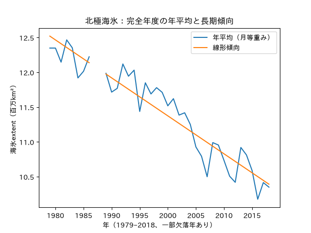

*1979〜2018年の北半球extentの月等重み年平均と線形傾向。採用できない1987年・1988年では線を切り、全年度が単調に減少しているとの誤解を避けている。*

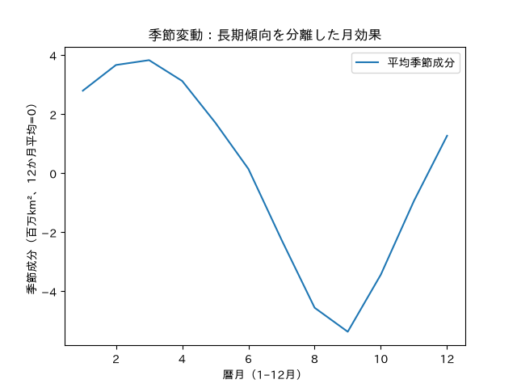

*月固定効果から求めた平均季節成分。12か月平均を0にした相対量であり、負の値は海氷extentそのものが負という意味ではない。*

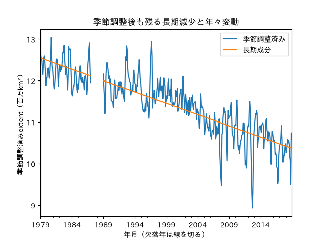

*季節調整済みextentと長期成分。季節周期を差し引いても減少と年々変動が残る。固定季節成分は全期間の平均的な基準であり、その一定性は追加分析で見直す。*

初回の分解残差の標準偏差は0.385484百万km²、ラグ1相関は0.751272でした。分析前提の検査では、月等重みと固定季節性が `assumed` のまま結論に関わるという警告が出ています。AIはこの2点と自己相関を、結論に影響する追加確認として選びました。

### AIが自律生成した追加依頼

**追加依頼1（原文）**

> 初回結果では隔日観測から日次観測への移行と42日ギャップがあり、月等重みの前提が未検証です。月の日数重み、観測率の閾値、全期間と1989年以降・両端5年除外、OLSとTheil–Senを比較し、長期減少の方向と効果量がどこまで安定するか確かめてください。

**選定理由**: 観測頻度の変化、ギャップ、期間の選択が傾向を左右する可能性があり、初回の月等重みの前提も未検証でした。

**結果**: 月等重み／暦日数重み、OLS／Theil–Sen、全期間／1989年以降／1984〜2013年、厳格／緩和した観測率基準を組み合わせた24仕様を実行しました。緩和基準は隔日期40%、日次期60%です。全仕様の傾きは **−0.638435〜−0.545951百万km²/10年** で、すべて負でした。基準からの最大相対差は **0.169400（約16.94%）**、あらかじめコードで設定した20%許容内で `stable=True` でした。

全期間・厳格基準のOLSは月等重みで −0.545951、日数重みで −0.546532、月等重みのTheil–Senは −0.564120でした。1989年以降の月等重みOLSでは −0.624898となり、減少方向は安定する一方、期間によって規模は変わります。これは加速の証明ではありません。緩和基準では不完全月が含まれること、24仕様以外への頑健性は保証しないことを残る限界としました。証拠はセル8の感度表と出力です。

**追加依頼2（原文）**

> 初回の固定季節分解では各月の減少率が同じと仮定されています。各月の長期傾向を同じ採用年で推定し、特に3月と9月を比較してください。初期と後期の季節曲線および年ごとの3月–9月差を用いて、季節振幅の変化が平均的減少に隠れていないか確認し、一定季節成分という前提を更新してください。

**選定理由**: 固定季節性が未検証で、季節調整後にも大きな変動と自己相関が残りました。月によって変化速度が異なれば、共通傾向だけでは問いへの回答が不十分です。

**結果**: 同じ38採用年の月別傾向はすべて負でしたが、3月は **−0.416037**、9月は **−0.809641百万km²/10年** と異なりました。各月のHAC(3)95%区間は、3月が [−0.486571, −0.345503]、9月が [−0.946572, −0.672710] です。1979〜1986年と2011〜2018年の各8年を比較すると、両期間とも平均季節曲線の最大は3月、最小は9月でした。9月平均は7.183317から4.654363百万km²、3月平均は15.940441から14.611395百万km²となっています。

同一年の3月–9月差は **＋0.393605百万km²/10年** で増加し、HAC(3)95%区間は **[＋0.221565, ＋0.565645]** でした。AIは固定季節性を厳密な前提としては採用せず、月固定効果を全期間の平均的な基準表示に限定し、月別傾向と季節差の変化を結論へ追加しました。証拠はセル9の月別表、初期・後期比較表、季節差の回帰出力です。

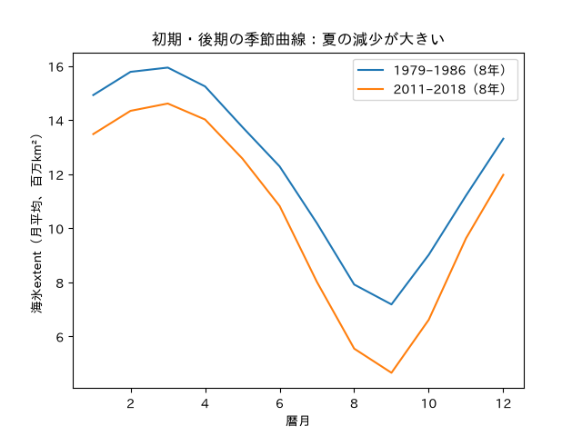

*1979〜1986年と2011〜2018年の各8年の月平均extent。最大・最小の月は同じだが、夏の最小期の減少が冬・春より大きい。*

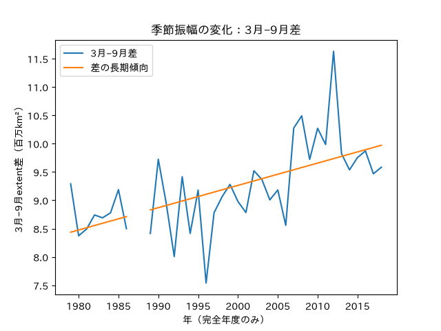

*完全年度の3月–9月extent差とその線形傾向。これは指定した2か月の平均値の差であり、日次データの年間最大–最小差ではない。*

12か月の区間は同時信頼区間ではなく、単純に12回の検定を独立な証拠として積み上げてはいません。固定季節成分の図だけから季節形が不変とは言えない、という点が初回結論からの重要な更新でした。

**追加依頼3（原文）**

> 残差の自己相関が強く、通常の独立標本の有意性は信用できません。年平均傾向と3月–9月差の傾向についてHACのラグ1・3・5年と5暦年ブロックのwild bootstrapを比較してください。3月・9月の両方がある40年を使う場合とTheil–Senでも季節差の方向を確認し、区間推定が何を保証しないか記録してください。

**選定理由**: 自己相関と季節ごとの変化が判明したため、HACのラグ選択や完全年除外に結論が依存しないかを確かめる必要がありました。

**結果**: HACラグ1・3・5の6仕様では、年平均傾向の95%区間はすべて0未満、3月–9月差の傾向の区間はすべて0より大きくなりました。

| 指標 | 推定値（百万km²/10年） | HAC(3)95%区間 | 5暦年ブロックwild bootstrapの95%区間 |
|---|---:|---|---|
| 年平均extent | −0.545951 | [−0.601355, −0.490548] | [−0.598461, −0.496050] |
| 3月–9月差 | ＋0.393605 | [＋0.221565, ＋0.565645] | [＋0.220565, ＋0.570627] |

wild bootstrapはseed=22、各2,000回、8ブロックです。3月と9月の両方がある1979〜2018年の40年を使うOLSでも季節差の傾向は ＋0.402240、38採用年のTheil–Senでも ＋0.353911百万km²/10年となり、方向は維持されました。前提manifestでは重みを `tested` に更新し、固定季節性を `rejected` として主張範囲を限定、季節差の検証を追加しています。セル10の最終前提検査の出力は空リストでした。

ただし、HACは欠落年を圧縮した観測年ラグによる近似で、厳密な暦年ラグと同じではありません。8ブロックの再標本化もブロック間独立性や区間の厳密な被覆率を保証しません。観測誤差、製品版の変更、因果識別は検証していません。証拠はセル10のHAC比較表と再標本化出力です。

**反復停止理由**: 3回の上限に達しました。主要な減少方向と季節差は検証した仕様で維持され、残る重要な不確実性には追加データや測定定義の確認が必要で、同じ時系列への当てはめ追加だけでは解決しないと記録しています。

### 最終結論

このKaggle CSVの北半球系列では、**1979〜2018年の採用38年における年平均extentは、10年あたり約0.546百万km²（約54.6万km²）減少**しました。3月最大・9月最小の強い季節性を分離しても減少は残り、24仕様で減少方向が維持されています。

ただし季節形は一定ではありません。9月の減少は3月より大きく、3月–9月差が10年あたり約0.394百万km²増加しています。したがって、「平均的な季節周期とは別に長期減少があり、その減少速度は月によって異なる」とまとめるのが適切です。一定速度で毎年減ること、将来も直線が続くこと、人為的温暖化の寄与率、無氷となる年を示す分析ではありません。

分析完了の判定は `status.json` の **`analysis_complete=true`、`final_completion.ready=true`** と、Notebookに保存された主分析・3回の追加分析・5件の根拠付きInsightに基づきます。ただし、以下のとおり最終監査セルとライフサイクル終了の保存証跡には留保があり、すべての終了処理まで確認できたという意味ではありません。

### 監査・再現性

Notebookは `benchmark/projects/kaggle-v020-kaggle-exp-22-seaice/notebooks/kaggle-v020-kaggle-exp-22-seaice.ipynb`、run_idは `v020-exp-22` です。セル11には **`REPLAY_NUMERIC_MATCH=True`** が保存され、初回参照値と `rtol=1e-10`、`atol=1e-12` で数値が一致したことを確認できます。再実行時はSHA-256を照合した固定原本を使用しています。カーネル再起動と全セル再実行は初回ログに実施予定として記載されていますが、ログには各セル実行の全履歴がなく、最終セルまでの再実行完了は断定しません。

環境の保存出力はPython 3.12.3、kaggle 2.2.4、NumPy 2.5.3、pandas 3.0.6、SciPy 1.18.1、statsmodels 0.15.0、Matplotlib 3.11.2、nbformat 5.11.1、japanize-matplotlib 1.1.3です。5件のInsightには、根拠集約セルの `execution_count=11` と引用値、主張種別のEvidence manifestが付いています。元CSV自体の再取得や、記録された環境の新規構築は本節作成では実施していません。

`status.json` の最終監査記録ではnbformat妥当、コードセル12、実行済み11、エラーセルなし、PNG図表セルは7・9、Insightセル5です。未実行セルの一覧は空ですが、これは末尾の監査セルを除外した結果です。セル21に「`audit_notebook` を呼ぶ末尾セルがまだ実行を終えていないため除外」という警告が1件あります。**保存Notebookでもセル21は `execution_count=null`、`outputs=[]` です。** したがって「全12セル実行済み」「警告なし」とは報告できません。

図表は5画像が2セルに保存され、タイトル・軸・凡例・画像ハッシュ等の `metadata.chart.specifications` も確認できます。初回3図の出力には文字欠落の検査結果「なし」があります。外部監査の `visual_findings` は空ですが、Notebook内で要求された `audit_notebook(..., visual_audit=True)` の結果は最終セルに保存されていません。監査が指摘しなかったことと、図の意味・見た目の完全な正しさは区別します。本節の5画像はセル7の出力1・2・3とセル9の出力3・4（出力番号も0始まり）の `image/png` をそのまま抽出し、`benchmark/figures/exp-22-*.png` に保存しました。保存ファイルのSHA-256は対応する図表メタデータと一致しており、再描画や分析のやり直しではありません。

ライフサイクルは登録時の `running` とフェーズ管理のコードを確認できます。最終セルには `mark_completed`、`wait_for_quiescence`、実行・書込み・ロック数0のアサートがありますが、`LIFECYCLE_FINAL` の保存出力はありません。終了時の `completed` と静止状態まで確認済みとはしません。

初回実行は832.9秒、追加確認は95.0秒で、外部ランナーの終了コードはいずれも0、終了理由はいずれも `artifact_complete_cutoff` でした。両ログには、Notebookが安定して監査条件を満たしたためプロセスグループを停止した旨が記録されています。初回と最終のファイルサイズ・更新時刻も同じで、追加確認によって最終セルの出力が補完された証拠はありません。**外部ランナーの成果物判定による打切りと、Notebook自身の終了処理の完了は別**です。

追加確認ログにある原文は次のとおりです。

> 既存セルを保持したまま、分析と反復依頼の根拠を再評価します。結論を左右する未解決点だけを追加分析し、最後に全コードセルの再実行と可視化・証拠・取得元・完了状態の監査を行います。

これは追加確認時の方針表明であり、Notebookに原文・選定理由・結果が保存された3件に続く「第4の自律生成依頼」や、監査完了の証拠としては数えません。

### 限界と失敗・未確認事項

**データと推論の限界**: CSVの末尾は2019年5月であり、最新2026年の北極海氷を説明していません。単位はKaggle説明文で確認できますが、extentの15%閾値の詳細と受動マイクロ波・NASA Team系という測定経路はmanifestで `inferred`、`Missing` の詳細定義とライセンスは `unknown` です。extentを氷そのものの面積・体積と混同せず、未確認の測定定義も確認済み扱いにしないことが必要です。

月の採用基準と完全年の選択は欠測による偏りを抑えるための判断ですが、元観測の代表性や測定精度を保証しません。直線は対象期間の要約であり、期間依存性が残ります。因果帰属・将来予測は対象外です。独立した参照観測をロードしていないためデータ間比較はせず、別の転載CSVを独立観測とはみなしていません。STLや季節ARIMAは不連続系列への補間・欠測モデルを追加する必要があり、本目的での追加価値が小さいとして使っていません。

**実際に記録された失敗**: NSIDCの定義解説ページ取得で `HTTPError` が出ており、15%閾値の詳細を公的解説で確認する処理は完了していません。HTTPステータスや原因の詳細は保存出力にないため推測しません。これは外部HTTP取得の失敗で、Kaggle CSVの取得失敗やJupytermindの不具合ではありません。

Notebookの改善候補節には、Jupyter MCPのNotebook作成が親ディレクトリ不在で失敗し、一時Notebookから `ensure_notebook` を呼んで解消したこと、およびfilesystem MCPの許可ディレクトリ制限も記録されています。ただし、指定された2ログにその生のエラー履歴はなく、Notebookの記述としての確認にとどまります。いずれも別ツール・設定側の事象として扱います。Copilot CLI自体の不具合を特定できる証拠はありません。最終監査・ライフサイクル終了の未確認は外部ランナーの打切り条件と切り分け、Jupytermindの故障とは断定しません。

**Jupytermind改善候補**: Notebookには次の2候補があります。分類・再現手順・期待／実際の挙動・影響・証拠・受け入れ条件を `issue-candidate.json` に保存しました。修正やGitHub Issue登録は行っていません。

| 分類 | 証拠と影響 | 回避策・確認上の留保 |
|---|---|---|
| 機能不足：推定された意味定義の一括把握 | セル5の `unresolved_fields()` はライセンスと `Missing` 定義の `unknown` 2項目だけを返し、別途出力した `Extent` 定義・測定経路の `inferred` 2項目は含みません。未確認定義の見落としを招く可能性があります。 | `inferred` を明示的に走査して留保。既存APIの仕様違反と断定せず、推定状態も一覧化できるAPI・オプションの改善候補とします。最終セルの最小再現結果は未保存です。 |
| 監査不足の疑い：PNGのチャートメタデータ欠落 | Notebookの改善候補節は、PNGセルに `metadata.chart` がないと `audit_visual_outputs` が空タプルを返すと報告し、セル21に最小再現コードがあります。未確認のタイトル・軸・凡例・文字欠落を警告できない可能性があります。 | 描画警告を捕捉し、画像ごとの仕様を保存してメタデータを明示補完。現在の5画像のセルにはメタデータがあります。再現コードの実行出力はないため、空タプルを返す挙動は本証拠だけでは確認済みとせず、再現待ちの候補とします。 |

本実験は、保存された分析結果としては長期傾向・季節変動の分離と追加検証を完了しています。一方、未確認定義の扱い、最終監査セルの出力保存、ライフサイクル終了の証跡を、分析の数値的成立とは別の再現性・引き渡し上の留保として残します。

## 実験23: NYC Taxisにおける距離・所要時間・料金・チップの関係（分析完了）

**課題**: 「Kaggleのタクシー乗車データに相当する公開データから、距離・所要時間・料金・チップの関係を調べてください。」

**初回プロンプト（全文・原文）**: 「Kaggleのタクシー乗車データに相当する公開データから、距離・所要時間・料金・チップの関係を調べてください。データ量や外れ値を確認し、分析計画と適切な図表を自分で決めて、サンプル範囲と限界を明記してください。AI Data Scientist SkillとJupyter MCPで計画・分析・根拠付きInsightを記録し、ノートブックを再実行してください。 Kaggle参照先: https://www.kaggle.com/datasets?search=nyc+taxi+trips。インストール済みkaggle Python SDKを使い、NotebookのJupyter MCP実行セル内で`KaggleApi().authenticate()`、`dataset_list(search=...)`、`dataset_list_files(...)`、必要に応じて`dataset_download_file(...)`を呼び出し、Kaggle上の対応する公開データを検索・取得してください。owner/dataset slug、取得ファイル名、取得日、ファイルSHA-256をNotebookに記録してください。APIトークンをセル出力・Notebook・ログへ表示しないでください。分析・API取得コードの実行はJupyter MCPだけを使い、端末コマンド、subprocess、外部スクリプト起動、作業エージェントへの委譲は行わないでください。Kaggle APIで対応データを検索・取得できなかった場合に限り、`/home/nahisaho/kaggle/experiments/white-paper.md`に記載された旧実験の公開CSV `https://raw.githubusercontent.com/mwaskom/seaborn-data/master/taxis.csv` を取得して実験を継続してください。その場合はKaggle APIの失敗内容、フォールバックした理由、CSV URL、取得日時、SHA-256をNotebookに記録し、公開CSVとKaggle掲載版の完全な同一性は保証されないことを明記してください。保存先は benchmark/projects/kaggle-v020-kaggle-exp-23-taxis/notebooks/kaggle-v020-kaggle-exp-23-taxis.ipynb としてください。run_idは `v020-exp-23` です。長時間処理の開始前にlifecycle.register_runを呼び、実行・書込みフェーズを記録し、終了時にcompletedまたはfailedを記録してください。データ定義manifest、分析前提manifest、意味的な異常検査、妥当な範囲の感度分析を使い、適用できない機能は理由を記録してください。図表はvisual_audit=Trueで監査してください。Notebookには「使用したJupytermindモジュール」節を設け、直接import・呼び出したモジュール名、関数名、使用目的を記録してください。間接利用は使用済みに含めないでください。Jupytermindの不具合または機能不足が疑われた場合は「Jupytermind改善候補」節を設け、分類、再現条件、期待する挙動、実際の挙動、影響、回避策、関係するセルとログを記録してください。Copilot CLI、Kaggle API、ベンチマークランナーに固有の問題とは切り分け、候補がなければ「なし」と記録してください。初回分析後、自分で結果を読み直し、結論に実質的な影響を与える未解決点があれば自然言語の追加依頼文を作成し、Notebookの「反復依頼履歴」に原文のまま記録して実行してください。価値ある追加分析がなくなるまで最大3回繰り返し、各反復の選定理由・結果・証拠・残る限界を報告してください。最後に全コードセルを上から再実行し、notebook_auditとライフサイクル状態を記録してください。」

### 使用したJupytermindモジュール

Notebookのコードにある直接importと呼び出しを照合しました。以下はすべて `ai_data_scientist` 配下です。Skill名や間接依存を使用モジュールに数えず、Notebook本文に列挙されていてもコードで直接呼び出されていない関数は含めていません。

| モジュール | 直接呼び出した関数・クラス・メソッド | 使用目的 |
|---|---|---|
| `project_manager` | `resolve_project`, `ensure_notebook`, `ensure_data_dir`, `enqueue_write` | プロジェクト・Notebook・データ保存先の解決、本文・metadataの書込み。 |
| `language_router` | `detect_language` | 日本語指示の言語判定。 |
| `lifecycle` | `register_run`, `mark_execution_start`, `mark_execution_end`, `mark_write_start`, `mark_write_end`, `is_cancel_requested`, `mark_completed`, `mark_failed`, `wait_for_quiescence` | 実行・書込みフェーズ、中止要求、失敗・完了、静止状態の記録・確認。 |
| `ingestion` | `SourceSpec`, `ingest` | 取得済みCSVの読込みと10万行の行予算確認。 |
| `cleaning` | `clean_dataset` | 重複削除・必須列欠損削除の影響確認。 |
| `eda` | `explore` | 型、非欠損件数、欠損、要約統計の確認。 |
| `data_definition` | `FieldValue`, `build_manifest`, `DataDefinitionManifest.unresolved_fields` | ファイル同一性と、列定義・単位・抽出設計の確認度を分離したmanifestの作成。 |
| `analysis_assumptions` | `Assumption`, `AnalysisAssumptionManifest`, `check_manifest` | 単位、記録チップ、代表性、除外基準の前提と未解決警告の管理。 |
| `data_quality` | `detect_anomalies` | 値域、支払方法の欠損、乗客数などの意味的検査。 |
| `stats_analysis` | `correlation` | 日本語解釈を伴うPearson相関の計算。 |
| `visualization` | `render_chart`, `build_image_output` | 距離分布・支払方法別棒グラフの描画、Matplotlibで作成した図も含むPNGのMIME出力。 |
| `insight_engine` | `extract_cited_value`, `record_insight` | 保存済み出力から引用値を抽出し、実行番号付きInsightを記録。`EvidenceMissingError`を直接参照してstream証拠拒否を診断。 |
| `sensitivity` | `SensitivityPlan`, `SensitivityPlan.specifications`, `run_sensitivity` | 除外閾値・上位値18仕様と車種・ゼロチップ6仕様の安定性評価。 |
| `notebook_audit` | `audit_notebook` | `visual_audit=True`による実行状態・証拠・図表の最終監査。 |

Spearman相関、日単位bootstrap、順位残差相関、記述的OLS、hexbin図はPandas・NumPy・SciPy・Matplotlib等を用いた分析コードであり、すべてをJupytermind固有の統計機能とみなしません。`mcp_gateway.run_and_record`は実Pythonクライアントが渡されていないため直接未使用で、実行はJupyter MCPのセル実行に限定したとNotebookに記録されています。独立した第二標本がないため外部標本比較は行わず、歪んだ分布を単純なz-scoreで誤りと決めつける代わりに、意味的検査・分位点・閾値感度を使っています。

**初回指示**: 分析計画、比較、図表はAI自身に選ばせました。一方、Kaggle APIによる取得と失敗時だけの公開CSVフォールバック、取得来歴、意味・前提のmanifest、ライフサイクル、視覚監査、最大3回の自律追加依頼、全コードの再実行は明示しました。追加分析の具体的な項目は事前に指定していません。

### データ取得と分析対象

Notebookには `KaggleApi().authenticate()`、`dataset_list(search=...)`、`dataset_list_files(...)`、`dataset_download_file(...)` の実行コードと結果があります。検索語は `seaborn taxis`、`nyc taxi trips`、`taxi tips`。大容量の全量データやクリーニング済み版ではなく、乗降時刻・距離・運賃・チップ・支払方法がそろい、全行と異常候補を調べられる小規模CSVを選びました。

| 項目 | 保存済みNotebookの記録 |
|---|---|
| Kaggle owner/dataset slug | `abdoomoh/all-seaborn-built-in-datasets` |
| 取得ファイル | `Seaborn All Built-in Datasets/taxis.csv` |
| 保存ファイル | `taxis.csv` |
| 取得日時 | `2026-10-01T20:05:11.606545+00:00`（UTC。保存された再実行時の来歴） |
| ファイルサイズ | 875,783 bytes |
| SHA-256 | `06d8c5579bdf4229199b0f517fde942775c565ac975cd858b8c1fa80c32f3fd5` |
| データ量 | 6,433件・14列。行予算による切詰めなし。 |
| 乗車開始時刻の範囲 | 2019-02-28 23:29:03〜2019-03-31 23:43:45（CSV上の時刻。タイムゾーンは確認していない） |
| 車種構成 | yellow 5,451件、green 982件。 |
| フォールバック | 未使用。Kaggleから検索・取得できたため。 |

対象はSeaborn相当の再配布標本であり、NYC全乗車の代表標本とは仮定していません。所要時間は `(dropoff-pickup).total_seconds()/60` で計算しました。距離のmile、金額のUSD、`fare`の基礎運賃としての意味、チップの記録経路は推定であり、TLC原列から短縮列への対応を完全には検証していません。参考取得を試みたTLC公式辞書は `HTTPError` となり、意味の確認済み扱いにはしていません。ライセンス条件と抽出方法もmanifestではunknownです。

**前処理・外れ値の確認**: 重複削除と必須列欠損削除はともに0件でした。支払方法欠損44件は全体記述には残し、カード分析からは除外しました。距離ゼロ51件、所要時間非正値6件（負の時間は0件）、推定速度80mph超11件、乗客数ゼロ96件を確認しています。これらは重複し得る検査件数で、合計を除外件数とは扱いません。原標本では距離中央値1.64・最大36.7、所要時間中央値10.9分・最大107.67分、運賃中央値9.5・最大150、推定速度最大約4,834.29mphでした。

主分析は距離・所要時間・運賃が正、チップが非負、`total>=tip`、所要時間1〜120分、推定速度60mph以下とし、84件を除いた6,349件を使用しました。そのうちカード支払は4,538件です。上限・下限は操作的なレビュー基準であり、除外された乗車がすべて真の入力誤りだと断定していません。

### 初回結果

AIは原標本と主分析標本、カード支払標本を分けてPearson・Spearman相関、距離帯別中央値、支払方法別のチップ記録を調べました。密集する連続値の関係には対数件数で色分けしたhexbin、距離分布にはヒストグラム、記録経路には棒グラフを選んでいます。

| 関係 | 原標本のPearson（6,433件） | 主分析のPearson（6,349件） | 主分析のSpearman |
|---|---:|---:|---:|
| 距離―所要時間 | 0.8213 | 0.8236 | 0.8672 |
| 距離―運賃 | 0.9201 | 0.9605 | 0.9450 |
| 所要時間―運賃 | 0.8481 | 0.8885 | 0.9705 |

距離・時間・運賃は強く連動しました。カード主分析の運賃―チップ金額のPearson相関は0.5958、Spearmanは0.4878でした。ただし、チップ金額の増加とチップ率の増加は別です。`total`にはチップ自体が含まれるため、運賃との関係には主に`fare`を使い、チップ率は `tip/fare` と `tip/(total-tip)` を区別しました。非ランダムな再配布標本なので、出力されたp値はNYC母集団についての検定根拠にはしていません。

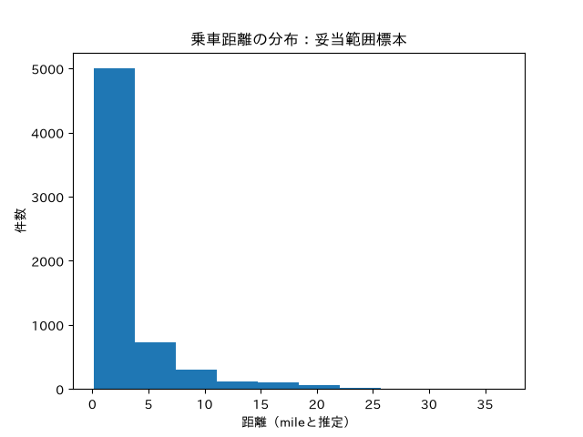

*操作的な妥当範囲に絞った6,349件の距離分布。短距離に集中し、右に長い裾がある。距離単位のmileは推定。*

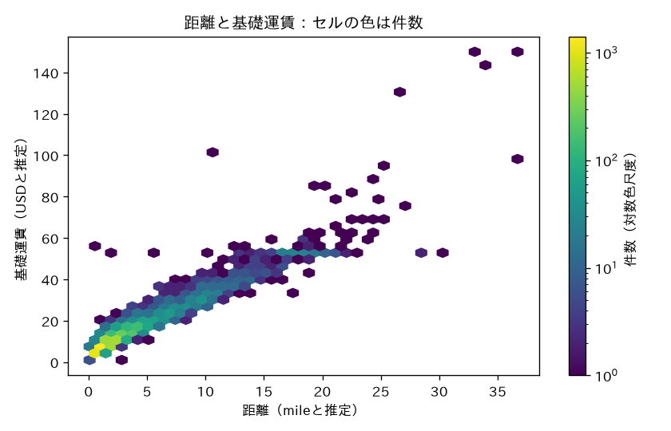

*距離と運賃の正の関連を示すhexbin。色は対数尺度の件数であり、52付近の運賃帯だけで料金制度を確定することはできない。*

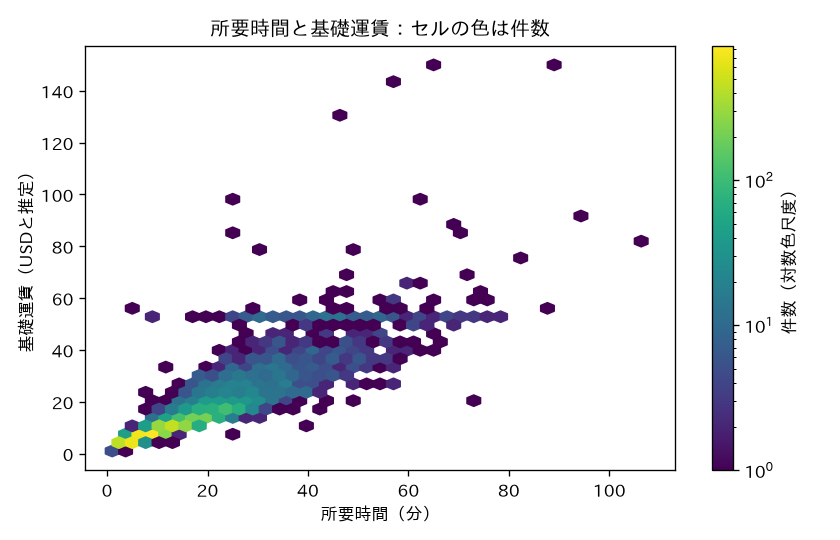

*乗降時刻差から求めた所要時間と運賃。走行時間のみを表す指標ではなく、距離との重なりも追加検証の対象とした。*

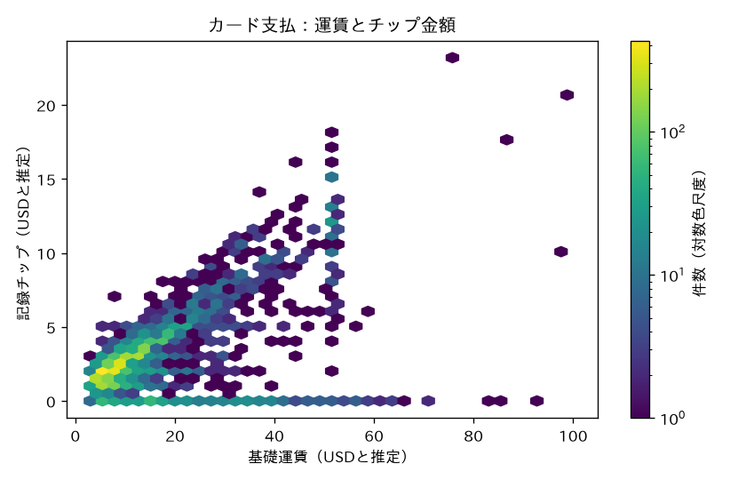

*カード主分析4,538件の運賃と記録チップ金額。正の関連のほか、運賃が高くてもゼロとして記録される乗車がある。*

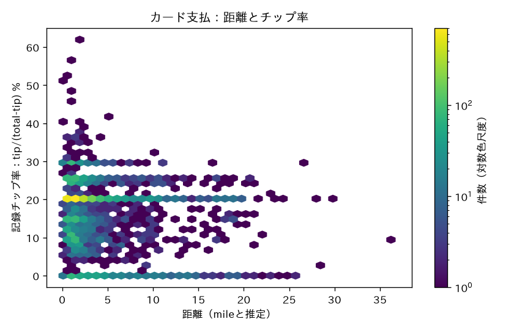

*分母をチップを除く総額 `total-tip` とした記録チップ率。金額の相関と率の傾向を分けて読む必要がある。*

原標本の支払方法別では、現金1,812件の記録チップはすべてゼロ、カード4,577件のゼロ記録は455件（9.94%）でした。欠損44件もすべてゼロです。現金の実際のチップを収録していない可能性があり、「現金客はチップを払わない」とは結論していません。

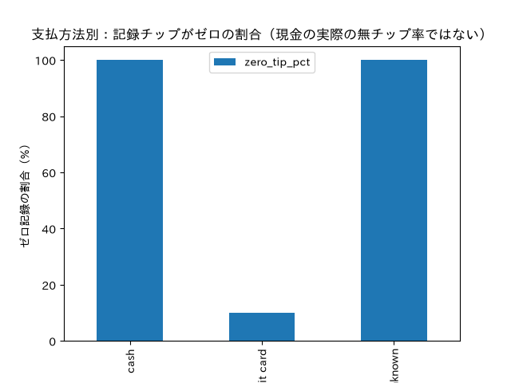

*原標本の支払方法別ゼロ記録率。unknownは支払方法欠損44件であり、現金や欠損の100%は実際の無チップ率を保証しない。*

カード主分析の距離帯別には、運賃・チップ金額の中央値が増える一方、二種類のチップ率は異なる傾向を示しました。これが最初の追加依頼につながっています。

| 距離帯（mileと推定） | 件数 | 所要時間中央値（分） | 運賃中央値 | チップ金額中央値 | `tip/fare`中央値 | `tip/(total-tip)`中央値 |
|---|---:|---:|---:|---:|---:|---:|
| 0超〜1 | 1,110 | 5.33 | 5.5 | 1.75 | 31.82% | 20.00% |
| 1超〜2 | 1,445 | 9.35 | 8.0 | 2.16 | 27.50% | 20.00% |
| 2超〜5 | 1,222 | 16.62 | 13.5 | 3.06 | 24.55% | 20.00% |
| 5超〜10 | 436 | 25.88 | 25.5 | 4.94 | 22.25% | 19.96% |
| 10超 | 325 | 40.30 | 44.5 | 8.31 | 20.48% | 19.97% |

### AIが自律生成した追加依頼

**追加依頼1 — 分母と記録経路（原文）**

> カード支払では距離帯が上がるとtip/fareの中央値が約32%から約20%へ下がっていますが、tip/(total-tip)は約20%のままです。この違いが追加料金を含む分母の選び方とゼロチップの混在で説明できるか、同一乗車の二つのチップ率、金額内訳の残差、ゼロ記録率、正のチップのみ、車種別を比較してください。日単位の再標本化で短距離と長距離のチップ率差も確認し、顧客が長距離でチップを渋るという解釈が妥当かを検討してください。

**選定理由**: 初回の距離帯別表で二種類の率の傾向が異なり、分母を混同すると「長距離ほど顧客がチップを渋る」と誤解しかねないためです。

**結果**: 短距離1以下と長距離10超の `tip/fare` 中央値は31.82%から20.48%へ下がりましたが、`tip/(total-tip)` は20.00%と19.97%で、長距離−短距離の差は−0.0266ポイントでした。カード標本の31日を日単位で500回再標本化（seed=23）した95%パーセンタイル区間は［−5.0068, 0.0482］ポイントです。ゼロを含む区間であり、等価性を証明したわけではありません。正のチップだけに限定すると距離と後者の率のSpearman相関は−0.0067でした。

原標本の6,411件で `total-fare-tip-tolls` が0.02を超えており、分母の違いは無視できません。ただし、その残差を特定の税・追加料と断定していません。カード主分析ではgreenのゼロ記録率が45.81%（561件）、yellowが4.55%（3,977件）で、大きな構成差も見つかりました。

**証拠・残る限界**: Notebookセル15（最終再実行番号8）の距離帯・車種・内訳表とJSON出力。追加料金の内訳、現金の実チップ、車種による記録経路は未確認で、bootstrapは標本内の安定性評価でありNYC母集団の信頼区間ではありません。

**追加依頼2 — 構成差と距離・時間の重なり（原文）**

> 追加分析でカード支払のゼロチップ記録率がgreen約46%、yellow約5%と大きく違いました。長距離ほど記録ゼロが増える傾向が車種や出発地区の構成差だけで生じていないか、車種×距離帯の件数とゼロ記録率、車種・地区を調整した順位残差相関を比較してください。また距離と所要時間が強く関連しているため、運賃との関係は両者を同時に入れた記述的回帰と52ドル運賃を除く比較で確認し、係数を因果効果や運賃表と解釈しないでください。

**選定理由**: 反復1で見つかった車種別の記録差を混合標本の相関から切り分け、距離と所要時間の重なり、初回図に見えた`fare=52`の帯が結論を左右しないか確認するためです。

**結果**: 距離と `tip/(total-tip)` の未調整順位相関−0.1201は、車種・出発boroughで調整した順位残差相関では−0.0675に弱まりました。これは順位をダミー変数に線形射影した残差のPearson相関で、通常の単純Spearmanとは異なります。車種内のSpearmanはyellow −0.0401、green −0.4445でした。10超の距離帯ではゼロ記録率がyellow 14.73%（258件）、green 92.54%（67件）であり、greenの小標本と記録差に注意が必要です。yellowでも長距離帯のゼロ記録率は高く、構成差だけですべて説明できたとはしていません。

運賃を距離と所要時間で同時に説明する主分析6,349件の記述的OLSでは、距離係数2.0807、時間係数0.2934、R²=0.9520でした。距離調整後の所要時間―運賃の部分相関は0.6172。`fare=52`の125件を除いた6,224件でも時間係数は0.2993で、時間との正の条件付き関連は残りました。係数は未検証単位に基づく標本内の記述量であり、料金表や時間の因果効果ではありません。52の帯もRatecodeや空港情報で確認しておらず、JFK固定料金と確定していません。

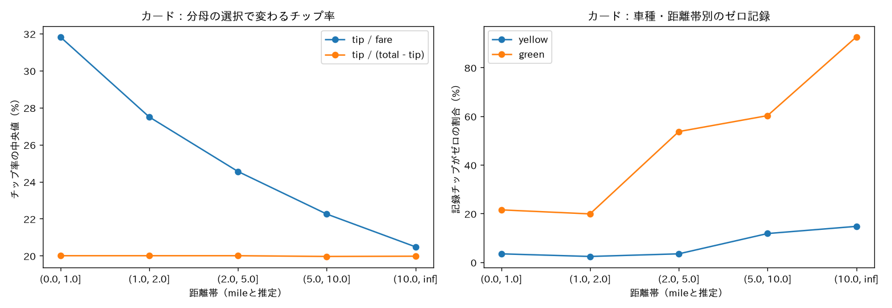

*左はカード支払の距離帯別チップ率中央値、右はyellow・green別のゼロ記録率。約20%の混合中央値と車種別の記録差は両立する。各群の件数を伴う表と併読し、特にgreen長距離67件を過剰に一般化しない。*

**証拠・残る限界**: セル18（実行番号9）の層別表・OLS表・JSONとセル19（実行番号10）の比較図。時刻、行先、混雑、運転者・顧客構成などは未調整です。車種差が記録方式か行動差かは識別できず、次に除外基準と高額乗車への依存を検証しました。

**追加依頼3 — 閾値・高額乗車・構成の感度（原文）**

> 距離と時間の運賃係数は正でしたが、84件の除外や高額乗車に依存していないか確認してください。所要時間の下限0.5・1・2分、速度上限40・60・80mph、距離・運賃の上位1%を残す／除く18仕様で、距離と運賃の相関、時間係数、カードの運賃とtip金額の相関、チップ率中央値と距離との順位相関を再計算してください。さらにyellow/green/混合とゼロtipを残す／除く6仕様でチップ率を比較し、SensitivityPlanの判定と数値範囲を示してください。安定しない結論は安定しないままとし、追加のデータなしでは解決しない限界を整理してください。

**選定理由**: 主分析の84件除外や高額乗車に結論が依存しないかを確認し、反復2の車種差を踏まえ、すべてを一つの「頑健」にまとめず指標ごとに評価するためです。

**結果**: 所要時間下限3種類×速度上限3種類×上位1%の扱い2種類で18仕様を実行し、5指標について90評価を行いました。仕様別の対象件数は6,176〜6,361件です。主仕様を基準とする相対偏差20%という公開された操作的許容基準では、5指標とも`stable=True`でした。

| 指標 | 18仕様での範囲 | 判定 |
|---|---:|---|
| 距離―運賃のPearson相関 | 0.960041〜0.967425 | 安定 |
| OLSの時間係数 | 0.292858〜0.320662 | 安定 |
| カードの運賃―チップ金額のPearson相関 | 0.584313〜0.626176 | 安定 |
| カードの `tip/(total-tip)` 中央値 | 19.976636〜19.980347% | 安定 |
| カードの距離―同チップ率のSpearman相関 | −0.122275〜−0.108981 | 安定 |

一方、混合・yellow・greenと、ゼロチップを残す／除く6仕様では率中央値は`stable=False`で、最大相対偏差は0.5076（約50.76%）でした。ゼロを含むgreenの中央値は9.8361%、yellowは19.9967%、混合は19.9768%。正のチップだけなら3群とも20.00%でした。**除外閾値に安定していることと、車種や記録経路を越えてチップ率が同じであることは別**です。

**証拠・残る限界**: セル22（実行番号11）の仕様表、安定性表、構成比較表、JSON出力。20%は統計的な普遍基準ではなく分析者の許容値です。3回を終え、現金チップ未観測、greenの記録経路、抽出設計、列意味の完全な来歴は同じCSVの追加操作では解消できないとして停止しました。

### 最終結論

この取得標本では、距離・所要時間と運賃に強い正の関連があり、距離と時間を同時に入れた記述モデルでも時間の正の関連が残りました。これらは検討した除外閾値・上位値の扱いでは安定しています。

カード支払のチップ金額は運賃とともに増えますが、「長距離ほどチップ率が下がる」「全車種のチップ率は一律20%」とは結論できません。基礎運賃を分母にした率の低下は、チップを除く総額を分母にすると大幅に縮まり、ゼロ記録と車種構成を変えると解釈が変わりました。現金ゼロを実際の無チップとみなすこともできません。AIの反復は手法を増やすだけでなく、分母と観測過程を見直し、初回の相関を顧客行動へ短絡させない役割を果たしました。

分析完了の判断は `status.json` の `analysis_complete=true`、`final_completion.ready=true` と、実際のNotebookの全14コードセル、3回の反復、8件の根拠付きInsight、最終監査・ライフサイクル記録の整合によるものです。完了は計算・保存・監査の完了を意味し、未確認の単位や抽出設計まで検証できたという意味ではありません。

### 監査・再現性と実行結果の扱い

Notebookの `metadata.orchestration_record` はカーネル再起動、全コードの上からの再実行、Kaggle再取得、SHA-256再照合を記録しています。対象Notebookの最終実行番号は1〜13と15で、14は同一カーネルを共有する管理NotebookからのInsight保存セルです。そのコード・出力は対象Notebookのmetadataに保存されています。したがって、**管理セルを挟むJupyter MCPの手順では再実行済み**ですが、対象Notebookだけを通常の「Run All」で実行すれば同じ自己書込み回避まで自動で完結する、と保証するものではありません。

全セル出力保存後の監査日時は `2026-10-01T20:07:47.493230+00:00`（UTC）。`audit_notebook(..., visual_audit=True)` の保存記録は `ok=true`、`nbformat_valid=true`、実行済み14/14、未実行0、エラー0、Insight8件、findingsとvisual_findingsはいずれも空でした。PNGはセル11に6点、セル19に1点の計7点あり、本節の画像はその埋込みPNGを再描画せず抽出したものです。図生成時の文字欠落警告ログも空でした。ただし、図表監査の合格は結論の科学的妥当性を保証しません。

`metadata.lifecycle` の `v020-exp-23` は `completed`、実行中セル・保留書込み・保持ロックの各カウンターは0です。一方、分析前提manifestには単位とチップ記録経路について2件の未解決warningが残っています。計算・構造監査と意味の確証を分けて評価します。

外部実行について、`status.json` は初回終了コード0、1,076.0秒、終了理由`exited`、追加確認終了コード0、95.8秒、終了理由`artifact_complete_cutoff`を記録しています。`initial.log`には取得・3回の追加検証・再実行・最終監査の終了報告があります。`followup.log`は確認方針と、安定したNotebookが監査を通過したためランナーがプロセスグループを停止した記録だけで、独立した追加分析結果や2回目の全再実行完了を示していません。追加確認を通常のCLI自然終了と扱わず、初回セッション内の自律追加依頼3件とも区別します。両段階の安定性記録ではNotebookサイズ820,732 bytesとmtimeが同一です。

### 途中の失敗とJupytermind改善候補

実験全体の分析は完了しましたが、途中には次の失敗・制約が記録されています。改善候補は2件で、原因を断定できないものは候補のまま扱います。ソース修正やGitHub Issue登録を済ませたとはしていません。

**候補1 — stream出力をInsightの証拠として受理できない**

分類は証拠エンジンの機能不足候補です。初回統計セル9（実行番号5）の保存済みstreamから、`extract_cited_value`で `0.9604533970991638` を抽出し、同じ実行番号・値を `record_insight` へ渡すと、セル25（実行番号12）の診断出力は `stream_contains_value=true` にもかかわらず `EvidenceMissingError` となりました。Notebookの `metadata.stream_evidence_diagnostic` にも一致する診断があります。

期待するのは、保存済みの実行済みstreamも証拠として照合されること、または非対応形式を公開契約として明確に説明することです。実際には出力中に値があるのに証拠セルなしとして拒否され、print中心の実分析からInsightを作れませんでした。同じ計算結果を `text/plain` MIMEのJSONとして出力し、そこから引用することで8件のInsightを保存できました。Kaggle取得やCLI表示、外部ランナーの終了ではなく、保存済み出力の形式と証拠照合の不一致として切り分けています。診断で具体的例外を捕捉したもので、最終Notebookのエラー出力セルではありません。

受け入れ条件は、streamとMIMEの実行済み証拠を同じ実行番号・引用値で照合でき、値がない場合や未実行セルは従来どおり拒否し、保存後監査も一貫して根拠を解決できることです。

**候補2 — 実行中Notebookへの書込みで実行結果が保存されない**

分類は `project_manager` のファイル書込みとJupyter MCPのNotebook保存の統合不足候補で、**Jupytermind単独かMCP側かの原因帰属は未確定**です。実行中の対象Notebook自身へ `enqueue_write` または `record_insight` で書き込んだ初期版では、ツールから出力が得られても、保存ファイル上の診断・Insight記録セルは `execution_count=None`、outputs空になったと記録されています。`metadata.write_integration_incident.pre_audit`には13コードセル中11実行、未実行セル位置［25, 28］とerror所見2件が残っています。これは当時のセル位置であり、現在の最終Notebookの未実行セルではありません。初回ログも出力喪失と回避策を報告しています。

期待するのは本文変更と実行番号・出力がともに保存されることです。実際には実行と保存が一致せず事前監査が失敗し、Notebook本文にはその時点でlifecycleを`failed`にしたと記録されています。回避策は自己書込みをセル終了後に分離し、同一カーネルを共有する管理Notebookから `persist_insights()` を呼んで再接続・全再実行・再監査するもので、最終保存記録では14/14実行と監査合格を確認できました。

受け入れ条件は、同条件で本文変更・実行番号・outputsが欠落せず、必要な実行・書込み調整が働くこと、対応できない条件では明示的エラーにして実行済みに見える不完全保存を残さないこと、再実行後の証拠リンク・監査・ライフサイクルが整合することです。外部ランナーの監視やCLI出力表示を原因にしていませんが、Notebookに残る事故記録だけで内部の競合機序までは確定できません。

**外部サービス・接続環境との切り分け**: TLC公式辞書のHTTP取得失敗は外部資料取得の問題で、Kaggle APIの取得失敗ではありません。Kaggle検索・取得は成功しており、フォールバックも未使用です。カーネル内の実MCPクライアントが渡されていないため `mcp_gateway` を直接使わなかった点はホストの接続制約です。追加確認の`artifact_complete_cutoff`は外部ランナーの終了方針であり、Jupytermindの分析失敗やタイムアウトとは分類しません。

### 残る限界

対象は2019年2月末〜3月の6,433件からなる抽出方法不明の再配布標本であり、NYC全体、他の月・年、現在の運賃、他都市へ一般化できません。距離・金額の単位、原列からの変換、ライセンス条件、現金やgreenのチップ記録経路が未確認で、ファイルのハッシュ一致は原典との意味的同一性を保証しません。

分析は関連の記述です。OLS係数は因果効果でも料金規則でもなく、ゼロチップは実際の無チップと未観測・記録制約を識別できません。日単位bootstrap、未調整要因、少数の車種×距離帯、操作的な異常閾値・安定性許容値にも限界があります。最終監査合格と分析完了を、これらの未解決条件が解消したという成功状態へ拡張しないことが重要です。

## 実験24: 国・地域別アルコール消費の分布（Jupyter MCP互換性エラーで分析未実施）

**課題**: 「Kaggleで公開されている国別アルコール消費データを用い、国・地域による消費量の違いと分布を調べてください。」

**初回プロンプトの生成**: 初回プロンプトは、データセット「Alcohol Consumption by Country」、国・地域別の消費量と分布という問い、および共通制約からAIが自動生成したものです。人間がこの実験のために全文を個別作成した指示ではありません。以下に `initial-prompt.md` の全文を原文のまま掲載します。

**初回プロンプト（全文・原文）**:

> Kaggleで公開されている国別アルコール消費データを用い、国・地域による消費量の違いと分布を調べてください。単位やカテゴリを確認し、適切な比較・図表を自分で選び、解釈の範囲と限界を日本語で示してください。AI Data Scientist SkillとJupyter MCPを使って再現可能に記録してください。 Kaggle参照先: https://www.kaggle.com/datasets?search=alcohol+consumption+by+country。インストール済みkaggle Python SDKを使い、NotebookのJupyter MCP実行セル内で`KaggleApi().authenticate()`、`dataset_list(search=...)`、`dataset_list_files(...)`、必要に応じて`dataset_download_file(...)`を呼び出し、Kaggle上の対応する公開データを検索・取得してください。owner/dataset slug、取得ファイル名、取得日、ファイルSHA-256をNotebookに記録してください。APIトークンをセル出力・Notebook・ログへ表示しないでください。分析・API取得コードの実行はJupyter MCPだけを使い、端末コマンド、subprocess、外部スクリプト起動、作業エージェントへの委譲は行わないでください。Kaggle APIで対応データを検索・取得できなかった場合に限り、`/home/nahisaho/kaggle/experiments/white-paper.md`に記載された旧実験の公開CSV `https://raw.githubusercontent.com/plotly/datasets/master/2010_alcohol_consumption_by_country.csv` を取得して実験を継続してください。その場合はKaggle APIの失敗内容、フォールバックした理由、CSV URL、取得日時、SHA-256をNotebookに記録し、公開CSVとKaggle掲載版の完全な同一性は保証されないことを明記してください。保存先は benchmark/projects/kaggle-v020-kaggle-exp-24-alcohol/notebooks/kaggle-v020-kaggle-exp-24-alcohol.ipynb としてください。run_idは `v020-exp-24` です。長時間処理の開始前にlifecycle.register_runを呼び、実行・書込みフェーズを記録し、終了時にcompletedまたはfailedを記録してください。データ定義manifest、分析前提manifest、意味的な異常検査、妥当な範囲の感度分析を使い、適用できない機能は理由を記録してください。図表はvisual_audit=Trueで監査してください。Notebookには「使用したJupytermindモジュール」節を設け、直接import・呼び出したモジュール名、関数名、使用目的を記録してください。間接利用は使用済みに含めないでください。Jupytermindの不具合または機能不足が疑われた場合は「Jupytermind改善候補」節を設け、分類、再現条件、期待する挙動、実際の挙動、影響、回避策、関係するセルとログを記録してください。Copilot CLI、Kaggle API、ベンチマークランナーに固有の問題とは切り分け、候補がなければ「なし」と記録してください。初回分析後、自分で結果を読み直し、結論に実質的な影響を与える未解決点があれば自然言語の追加依頼文を作成し、Notebookの「反復依頼履歴」に原文のまま記録して実行してください。価値ある追加分析がなくなるまで最大3回繰り返し、各反復の選定理由・結果・証拠・残る限界を報告してください。最後に全コードセルを上から再実行し、notebook_auditとライフサイクル状態を記録してください。

**使用したJupytermindモジュール**: Notebookが存在しないため、Notebook内で直接import・呼び出されたモジュール名、関数名、使用目的を確認できません。確認済みの直接利用はありません。初回指示にある `lifecycle.register_run` は実行前の状態登録、`notebook_audit` は最終監査の要求ですが、いずれも実施済みの利用としては扱いません。

**初回指示**: 消費量の単位・カテゴリを確認し、国・地域比較に適切な分析計画と図表をAI自身が選ぶよう求めています。取得は原則Kaggle APIに限定し、検索・取得に失敗した場合だけ指定の公開CSVを許可する条件付きフォールバックでした。取得元とハッシュの記録、データ定義・分析前提のmanifest、意味的な異常検査、感度分析、図表監査、ライフサイクル記録、全コードセルの再実行も要求しています。追加分析の内容は事前指定せず、初回結果を評価してAIが最大3回の依頼を生成する設計でした。

### 実行結果と失敗内容

**分析は開始できませんでした。** `initial.log` は、Notebook接続とカーネル一覧取得の両方でJupyter MCPの接続初期化が拒否されたと報告しています。ログに示されたエラーは次のとおりです。

```text
JSON-RPC error: -32022
サーバー対応: 2026-07-28
クライアント要求: 2025-11-25
initialize handshake is not accepted
```

この記録が示すのは、Copilot CLI–Jupyter MCP間の接続互換性による実行開始前の停止です。Jupytermindの分析コードやKaggle APIが失敗した証拠ではありません。ログは実行主体による失敗報告であり、指定された証拠には個々の接続呼び出しの完全な通信履歴は含まれていません。

`status.json` の初回記録は `initial_exit_code=0`、`initial_seconds=74.5`、`initial_termination="exited"` です。ただし終了コード0は分析成功を意味しません。`analysis_complete=false`、`final_completion.ready=false` が記録され、指定Notebookも実ファイルとして存在しません。分析完了条件は満たされていないと判断します。初回ログ末尾の `[runner] stopping process group: Copilot CLI exited; cleaning descendant runtimes` は終了後の子プロセス整理の記録であり、これをタイムアウトや分析中断の原因とは読み替えません。

### データ取得と初回結果

**データ取得**: 初回ログによれば、Kaggle APIは実行されず、公開CSVも取得されていません。接続障害はKaggle APIでの検索・取得失敗ではないため、ログでは条件付きフォールバックの条件も成立していないと判断しています。Kaggle検索URLは初回指示の参照先にとどまり、実際に選定・取得されたowner/dataset slug、ファイル名、取得日時、SHA-256は確認できません。

**初回結果**: 国別・地域別の分布、中央値、上位国、飲料カテゴリの比較、検定、感度分析などの結果はありません。消費量の単位、対象年、人口当たり指標の分母、地域分類も実データから確認されていません。したがって「地域差がある」「地域差がない」のいずれも結論できません。

**図表**: 指定Notebookが存在しないため、抽出可能なNotebook内PNGはありません。`benchmark/figures` へ本実験の図を保存することはできず、この節には画像参照を設けていません。旧実験や他実験の図表を流用したり、未取得データから図表を生成したりはしていません。

### AIが生成した追加依頼

**追加依頼の原文・選定理由・結果**: 指定された証拠には、AIが生成した自然言語の追加依頼文はありません。初回ログは分析・反復を未実施と報告し、Notebookも存在しないため、「反復依頼履歴」や選定理由、追加分析結果を確認できません。初回結果がないことによる実施不能であり、結果を検討して「価値ある追加分析が不要」と判断した記録ではありません。

**追加確認の実行状態**: 指定の `followup.log` は存在せず、`status.json` の `followup_exit_code`、`followup_seconds`、`followup_termination` はいずれも `null` です。追加確認が実行されたと示す証拠はありません。追加確認ログとAIが自律生成する追加依頼は別の記録であり、どちらについても実施済みとは扱いません。

### 最終結論

本実験は **Jupyter MCPの接続互換性エラーにより分析開始前に停止した未実施例** です。国・地域別アルコール消費についてのデータに基づく結論は得られていません。プロセス終了コード0だけで完了と判定せず、`analysis_complete`、`final_completion`、Notebookの有無を照合する必要があることを示します。

`white-paper2.md` は節構成と詳細度の参照にのみ使用しました。同文書の旧実験24に記載された数値、追加依頼、取得元、図表、成功・失敗状態は、今回のv0.2.0実験の分析証拠として使用していません。

### 監査と再現性

| 確認項目 | 証拠と状態 |
|---|---|
| 初回指示・実行経緯 | `benchmark/runs/24-kaggle-exp-24-alcohol/initial-prompt.md` と `initial.log` に保存 |
| 指定Notebook | `benchmark/projects/kaggle-v020-kaggle-exp-24-alcohol/notebooks/kaggle-v020-kaggle-exp-24-alcohol.ipynb` は存在しない |
| 安定性・成果物の監査 | `initial_stability`・`final_stability` は `exists=false`、`stable=false`。`initial_audit`・`final_audit` は `exists=false`、`error="notebook_missing"` |
| 分析完了 | `analysis_complete=false`、`final_completion.ready=false`。同オブジェクトの完了要件8項目もすべてfalse |
| データの来歴 | 取得未実施のためslug、ファイル名、取得日時、SHA-256を確認できない |
| ライフサイクル | 初回ログは `v020-exp-24` の登録を未実施と報告。completed・failedの記録も確認できない |
| コード・Insight・図表 | Notebookがなく、実行セル、根拠付きInsight、PNGの保存を確認できない |
| manifest・異常検査・感度分析 | 実施を示す成果物がない |
| 上からの再実行・Notebook監査 | 初回ログでは未実施。`notebook_audit` と `visual_audit=True` の監査結果はない |
| 追加確認 | `followup.log` は存在せず、statusの追加確認実行欄も `null` |

ここでの監査は保存済み証拠の照合であり、Notebookを再実行して得た監査合格ではありません。`documentation_complete`、`semantic_complete`、`report_exit_code` は本節生成前の文書化状態を表す項目として、分析の見出し、結論、失敗判定には使用していません。

### Jupytermind改善候補と外部要因の切り分け

**Jupytermind改善候補**: なし。Notebook内の直接import・関数呼び出しがなく、Jupytermind自体の不具合や機能不足を再現した証拠がありません。この判断は不具合が存在しないことの証明ではなく、今回の証拠では候補として裏付けられないという意味です。`benchmark/runs/24-kaggle-exp-24-alcohol/issue-candidate.json` にはJSONの `null` を保存します。

| 層 | 今回の証拠からいえること |
|---|---|
| Copilot CLI–Jupyter MCP接続 | 初回ログがプロトコル日付の不一致と初期化拒否を報告。互換な接続構成を確認する必要があるが、どちらの実装に修正責任があるかまでは確定できない |
| Kaggle API | 実行されていないため、認証・検索・ダウンロードの成否やAPI側の不具合は評価できない |
| 外部ベンチマークランナー | 終了コード0と分析未完了を分けて記録している。ログ末尾に後片付けの記録があるが、ランナーの不具合を示す根拠にはならない |
| Jupytermind | 分析機能の動作検証に到達しておらず、接続障害をJupytermindの分析不具合へ転嫁しない |

### 残る限界

データ取得前に停止したため、統計的妥当性、地域分類、消費量の単位、図表の有用性、意味的な異常検査や感度分析の効果を評価できません。接続エラーは初回ログに記載された範囲で確認できるものの、対応バージョンの変更や再試行による復旧は今回の証拠に含まれていません。互換な接続で再実験した場合の成功も保証できません。

本節の記録は失敗経緯を追跡するためのもので、分析結果の再現を保証するものではありません。追加確認ログとNotebookが欠けている以上、監査合格、再実行成功、ライフサイクル完了、アルコール消費に関する知見を補って記述することはできません。

## 実験26: Seattle気象の季節性と観測期間内の変動（分析完了・最終再実行確認は未確認）

**課題**: 「KaggleのSeattle気象データに相当する公開データを分析し、気温や降水量の季節性・変動を明らかにしてください。」

**初回プロンプトの生成方法**: 以下は、データセットと問い、および取得・実行・監査などの共通制約から、AIが自動生成した初回プロンプトです。人間がこの実験のために全文を個別作成したものではありません。`initial-prompt.md` の全文を改変せず掲載します。

**初回プロンプト（全文・原文）**:

> KaggleのSeattle気象データに相当する公開データを分析し、気温や降水量の季節性・変動を明らかにしてください。列の単位と時間範囲を確認して、自分で分析計画と図表を決め、過度な一般化を避けて日本語で説明してください。AI Data Scientist SkillとJupyter MCPでコード・結果・根拠付きInsightを記録し、再実行を確認してください。 Kaggle参照先: https://www.kaggle.com/datasets?search=seattle+weather。インストール済みkaggle Python SDKを使い、NotebookのJupyter MCP実行セル内で`KaggleApi().authenticate()`、`dataset_list(search=...)`、`dataset_list_files(...)`、必要に応じて`dataset_download_file(...)`を呼び出し、Kaggle上の対応する公開データを検索・取得してください。owner/dataset slug、取得ファイル名、取得日、ファイルSHA-256をNotebookに記録してください。APIトークンをセル出力・Notebook・ログへ表示しないでください。分析・API取得コードの実行はJupyter MCPだけを使い、端末コマンド、subprocess、外部スクリプト起動、作業エージェントへの委譲は行わないでください。Kaggle APIで対応データを検索・取得できなかった場合に限り、`/home/nahisaho/kaggle/experiments/white-paper.md`に記載された旧実験の公開CSV `https://raw.githubusercontent.com/plotly/datasets/master/2016-weather-data-seattle.csv` を取得して実験を継続してください。その場合はKaggle APIの失敗内容、フォールバックした理由、CSV URL、取得日時、SHA-256をNotebookに記録し、公開CSVとKaggle掲載版の完全な同一性は保証されないことを明記してください。保存先は benchmark/projects/kaggle-v020-kaggle-exp-26-seattle-weather/notebooks/kaggle-v020-kaggle-exp-26-seattle-weather.ipynb としてください。run_idは `v020-exp-26` です。長時間処理の開始前にlifecycle.register_runを呼び、実行・書込みフェーズを記録し、終了時にcompletedまたはfailedを記録してください。データ定義manifest、分析前提manifest、意味的な異常検査、妥当な範囲の感度分析を使い、適用できない機能は理由を記録してください。図表はvisual_audit=Trueで監査してください。Notebookには「使用したJupytermindモジュール」節を設け、直接import・呼び出したモジュール名、関数名、使用目的を記録してください。間接利用は使用済みに含めないでください。Jupytermindの不具合または機能不足が疑われた場合は「Jupytermind改善候補」節を設け、分類、再現条件、期待する挙動、実際の挙動、影響、回避策、関係するセルとログを記録してください。Copilot CLI、Kaggle API、ベンチマークランナーに固有の問題とは切り分け、候補がなければ「なし」と記録してください。初回分析後、自分で結果を読み直し、結論に実質的な影響を与える未解決点があれば自然言語の追加依頼文を作成し、Notebookの「反復依頼履歴」に原文のまま記録して実行してください。価値ある追加分析がなくなるまで最大3回繰り返し、各反復の選定理由・結果・証拠・残る限界を報告してください。最後に全コードセルを上から再実行し、notebook_auditとライフサイクル状態を記録してください。

### 使用したJupytermindモジュールと初回指示

以下は `ai_data_scientist.` 配下のモジュールです。指定Notebookの実行済みコードセルで、直接importと呼出しを確認できたものだけを使用実績として示します。セル番号はすべてNotebook内の**0始まりのインデックス**です。Notebookの自己申告には別の制御Notebookからの呼出しも含まれますが、そのコードは今回の証拠対象ではないため、直接使用の確認とは区別しました。

| モジュール | 直接呼び出した関数・クラス・メソッド | 使用目的 |
|---|---|---|
| `project_manager` | `resolve_project`, `ensure_notebook`, `ensure_data_dir` | プロジェクト、Notebook、取得データ保存先の解決・準備 |
| `language_router` | `detect_language` | 日本語の分析依頼の言語判定 |
| `lifecycle` | `register_run`, `is_cancel_requested`, `mark_execution_start`, `mark_execution_end` | 実行登録、取消し確認、分析フェーズの開始・終了記録 |
| `ingestion` | `SourceSpec`, `ingest` | 取得済みCSVの読込みと10万行上限による切詰め確認 |
| `cleaning` | `clean_dataset` | 完全一致重複の除去と処理影響の記録 |
| `eda` | `explore` | 欠損とカテゴリ分布などの概観 |
| `data_definition` | `FieldValue`, `build_manifest`, `DataDefinitionManifest.unresolved_fields` | 来歴・列定義・単位を確度付きで構造化し、未確定項目を抽出 |
| `analysis_assumptions` | `Assumption`, `AnalysisAssumptionManifest`, `check_manifest` | 記述分析の範囲と前提を整理し、未確認の単位に対する警告を取得 |
| `data_quality` | `detect_anomalies` | 非欠測、日付一意性、値域、許容カテゴリの検査 |
| `stats_analysis` | `correlation` | 気温中点と降水量の単純・月内中心化Pearson相関 |
| `sensitivity` | `SensitivityPlan`, `run_sensitivity` | 年除外、平均・中央値、降水上側クリップ、雨日閾値の感度分析 |
| `visualization` | `render_chart`, `build_image_output` | 6枚のPNG図表の生成とNotebook画像出力 |
| `insight_engine` | `record_insight`, `EvidenceMissingError` | 実際のstream出力を根拠にできない問題の再現と例外の明示 |

`extract_cited_value` はimportされ、Markdownには制御側での利用が記されていますが、指定Notebookのコードに直接呼出しはありません。同様に `project_manager.enqueue_write` と一部のライフサイクル操作は制御側の利用記録にとどまります。`notebook_audit.audit_notebook(visual_audit=True)`、`lifecycle.mark_write_start` / `mark_write_end` / `mark_completed` / `mark_failed` / `wait_for_quiescence` は最終セル31にありますが、このセルには実行番号と出力がなく、実行済みとは数えません。`mcp_gateway` の直接利用もありません。

**初回指示**: 列定義と時間範囲を確認したうえで、分析計画・図表・追加依頼をAIに選ばせました。Kaggle SDKによる検索・取得、来歴とSHA-256、単位・前提の確度、意味的異常検査、感度分析、視覚監査、最大3回の自律的な追加依頼、最後の全セル再実行が共通制約です。API取得・分析コードの実行経路はJupyter MCPに限定しました。

AIは結果を見る前に、月別の最高・最低気温と中点、日々の分布、月別・年別降水量、雨日頻度、年除外などを調べる計画を記録しました。最高・最低の中点 `(temp_max + temp_min) / 2` は、**観測された日平均気温とは別の代理変数**です。

### データ取得と定義の確認

セル3の出力では、`KaggleApi().authenticate()`、`dataset_list(search="seattle weather")`、`dataset_list_files(...)`、`dataset_download_file(...)` が成功しています。検索結果20件から、必要列を備えた `ananthr1/weather-prediction` の `seattle-weather.csv` を採用しました。**指定の外部CSVへのフォールバックは使っていません。**

| 項目 | Notebookに残った記録 |
|---|---|
| 公開データ | https://www.kaggle.com/datasets/ananthr1/weather-prediction |
| ファイル | `seattle-weather.csv` |
| 初回取得日時（UTC） | `2026-10-01T20:26:51.230542+00:00` |
| 保存出力上の再確認日時（UTC） | `2026-10-01T20:29:57.811356+00:00` |
| SHA-256 | `6fa53487858ab355a9ad5958236d47220faee53cf1e3bb92d1401b8a83234ce6` |
| 期間・規模 | 2012-01-01〜2015-12-31、日次1,461行・6列 |
| 列 | `date`, `precipitation`, `temp_max`, `temp_min`, `wind`, `weather` |

セル5では全6列の欠損0、完全一致重複除去0行、重複日0、期間内の欠測日0、最低気温が最高気温を超える行0、非有限数0、スキーマ異常0でした。これはCSV内の整合性の確認であり、原観測の正確さや測器の均質性の保証ではありません。

Kaggleの公開説明は気象列と天候ラベルを列挙するのみで、単位を明示していません。気温°C、降水量mm、風速m/sは `inferred`、観測地点・測定経路・日付タイムゾーンなどは `unknown` としました。分析前提の検査も、結論に重要な単位解釈が未確認であることをwarningとして返しています。以下の絶対値は、明示しない箇所も含めて**気温°C・降水量mmという推定単位を前提**とします。風速は主要結論に使用していません。

### 初回結果

月別の気温中点平均は1月5.46、8月20.44で、差は14.98でした。夏（6〜8月、JJA）平均は19.31、冬（12・1・2月、DJF）は6.03です。最高・最低気温の月平均でも夏の高温・冬の低温が見られます。冬の集計は全対象年の12・1・2月をまとめたもので、年をまたぐ一つの冬を単位にした比較ではありません。

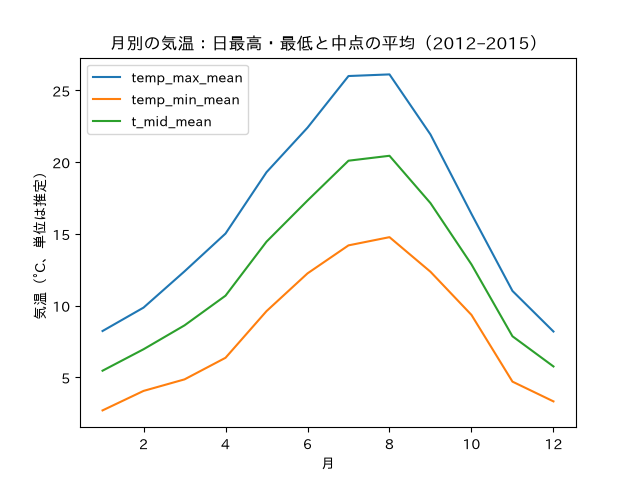

*2012〜2015年の月別平均。青は日最高、橙は日最低、緑は最高・最低の中点。中点は実測日平均気温ではなく、縦軸の°Cは推定単位。Notebookセル9のPNG出力を抽出。*

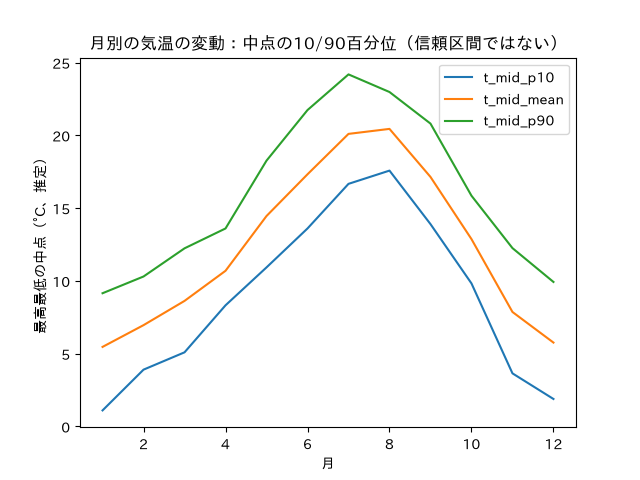

*青は10百分位、橙は平均、緑は90百分位。月内の日々の分布を示し、平均の信頼区間ではない。Notebookセル9のPNG出力を抽出。*

降水は、10〜3月の寒候期の日平均4.476に対し、夏JJAは0.937で、比は約4.78でした。4年平均の月合計は11月160.625が最大、7月12.05が最小です。日平均でも差があるため、月の日数の違いだけでは説明できません。ただし「毎年11月が最多雨」という結論は、この段階では未確認です。

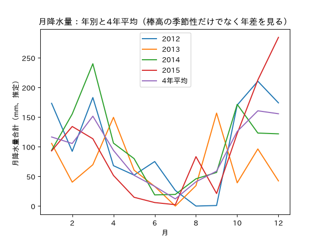

*各年の月合計と紫の4年平均。年別曲線のピークは一致しない。元画像のタイトルには「棒高」とあるが、実際の表示は折れ線図であり、値は月合計として読む。Notebookセル9のPNG出力を抽出。*

雨日を降水量1以上と定義すると、7月は7/124日（5.65%）、12月は72/124日（58.06%）でした。降水量が正の日の割合とは異なる定義であり、1を「1 mm」と読むには単位前提が必要です。

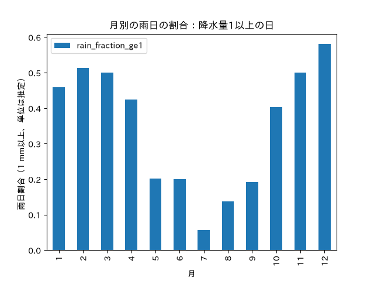

*降水量1以上の日の割合。縦軸は0〜1の割合で、雨日の物理的な閾値は推定単位に依存する。Notebookセル9のPNG出力を抽出。*

| 年 | 日数 | 気温中点の年平均 | 年降水量 | 日平均降水量 |
|---|---:|---:|---:|---:|
| 2012 | 366 | 11.28 | 1,226.0 | 3.350 |
| 2013 | 365 | 12.11 | 828.0 | 2.268 |
| 2014 | 365 | 12.83 | 1,232.8 | 3.378 |
| 2015 | 365 | 13.13 | 1,139.2 | 3.121 |

年降水量は単調増減ではなく、828.0〜1,232.8の間で変動しました。気温中点の年平均はこの4年で上昇していますが、長期的な温暖化率を推定できる期間ではありません。

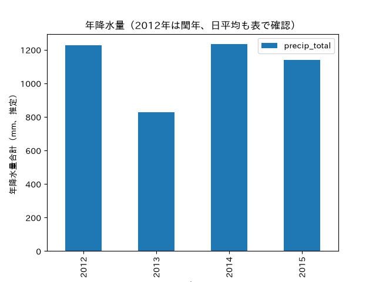

*年合計の比較。2012年は閏年のため、Notebookでは日平均も併記している。年差を長期的な増減傾向とは解釈しない。Notebookセル9のPNG出力を抽出。*

初回感度分析では、20%の相対偏差を大きさの安定性基準としました。年除外と平均・中央値の10仕様で夏−冬の気温中点差はすべて正、最大相対偏差7.73%で `stable=True`。年除外と降水量99百分位での上側クリップの10仕様でも寒候期−夏の日平均降水差はすべて正、最大相対偏差19.83%で `stable=True` でした。一方、年除外と雨日閾値0.1・1・5の15仕様では、頻度差の最大相対偏差52.31%で `stable=False` ですが、方向は全仕様で寒候期の方が高いままでした。**定義を変えたときの差の大きさと、結論の方向が保たれることは別**です。クリップは感度分析のみに用い、強雨日を誤測定として本集計から除いてはいません。

### AIが生成した追加依頼1 — 最多雨月の順位と降水の頻度・強度

**追加依頼（原文、Notebookセル17）**:

> 4年平均では11月が最多雨ですが、年別の月降水量のばらつきが大きく、この順位を一般化できるか未解決です。各年と1年除外で最多雨月・最少雨月を再計算し、10〜3月と夏の降水差を雨のある日の割合とその日の降水強度に分解してください。さらに上位降水日の総量への寄与を示し、「秋冬が多雨」と「毎年11月が最多雨」を分けて判断してください。

**選定理由**: 初回の年別曲線で月順位が変動しており、4年平均の11月最多雨を一般化すると結論が変わり得るため、AIがこの点を追加検証に選びました。

**結果**: セル18の出力で、各年の最多雨月は2012年11月、2013年9月、2014年3月、2015年12月でした。最少雨月も順に8月、7月、6月、7月と異なります。1年除外後の最多雨月は、2012年除外で12月、2013年除外で12月、2014年除外で11月、2015年除外で3月に変わりました。一方、1年除外後の最少雨月はすべて7月です。

| 降水差の分解（全期間） | 寒候期10〜3月 | 夏JJA |
|---|---:|---:|
| 降水量が正の日の割合 | 58.30% | 19.02% |
| 正の降水日の平均量 | 7.68 | 4.93 |
| 全日の日平均降水量 | 4.476 | 0.937 |

頻度と正の降水日の平均強度の双方に差があり、その積が全日の日平均量になります。寒候期の日平均降水量は全4年で夏を上回りました。上位15日（全日の約1.03%）は全降水量の13.91%、上位10日は10.14%を占め、最大日降水量は2015-03-15の55.9でした。

雨日閾値をそれぞれ固定して年除外だけを行うと、0.1・1・5のいずれも `stable=True` で、最大相対偏差は順に8.41%、11.91%、19.11%でした。初回の `stable=False` は、年の選択だけでなく閾値を変えた定義感度を含むことによるものです。

**再評価と残る限界**: 「寒候期が夏より多雨」は期間内の各年で支持されますが、「毎年11月が最多雨」は支持されません。強雨の集中も確認できましたが、4年しかなく、単位と原観測の定義は未確定です。結果と引用根拠はセル18・19に残っています。

### AIが生成した追加依頼2 — 気温の代理変数・暦日構成と相関の季節性

**追加依頼（原文、Notebookセル20）**:

> 年平均の気温中点が2012年から2015年に上昇している点は、最高最低の中点という代理変数や閏年・月の日数に依存していないか未解決です。最高気温と最低気温を別々に比較し、月を等しく重み付けした年平均、2月29日除外、同月比較による2015年−2012年の差を計算してください。気温と降水の単純相関も月の季節性を除いた相関と対比し、期間内の年差・季節性・因果解釈を区別してください。

**選定理由**: 年平均の上昇を代理変数や暦日構成の影響と切り分け、負の相関を因果関係と誤解しないためです。

**結果**: セル21で12か月を等しく重み付けした気温中点の年平均は、2012年11.270、2013年12.082、2014年12.776、2015年13.102でした。2015年−2012年の同月差の平均は1.832で、12か月中10か月が正ですが、9月は−1.232、11月は−1.695でした。最高気温と最低気温を個別に見ても、夏−冬の差は全ての年除外仕様で正です。月重みの変更と2月29日の除外で、年平均の順序は変わりませんでした。

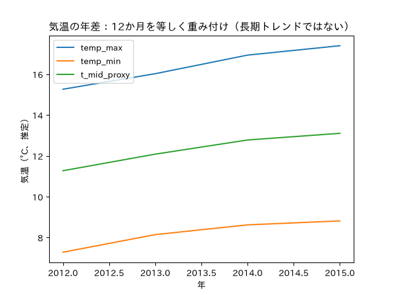

*青は最高気温、橙は最低気温、緑は中点の月平均を12か月で等重み平均した値。日数構成を変えても期間内の年差は残るが、長期的な温暖化傾向を表す図ではない。Notebookセル21のPNG出力を抽出。*

気温中点と日降水量の単純Pearson相関は `r=-0.1705`、月平均をそれぞれ差し引いた相関は `r=+0.0426` でした。この対比は、単純な負相関の読み方が季節構造に依存することを示します。月内中心化は因果調整ではなく、独立同分布を前提としたp値は結論の根拠に使っていません。

**再評価と残る限界**: 期間内の年差と季節性は、中点だけの選択や暦日構成のみでは消えません。ただし実測日平均気温がなく、原観測の均質性や日々の自己相関を調整した不確実性も未評価です。結果と引用根拠はセル21〜23に記録されています。

### AIが生成した追加依頼3 — 単位・観測地点の追加確認と不変な結論の分離

**追加依頼（原文、Notebookセル24）**:

> 単位と観測地点の確認が未完了で、絶対的な気温・降水量や1 mmという雨日閾値の解釈に影響します。Kaggle検索で得た対応候補の公開メタデータと選択データの出典欄を追加確認してください。選択CSVの単位を検証できない場合はverifiedへ格上げせず、単位換算で変わらない季節順位・比率・正降水日の頻度と、単位に依存する絶対値・閾値を明確に分離してください。別の公開CSVは取得しないでください。

**選定理由**: 分析前提manifestが単位解釈の警告を返し、絶対値や物理的閾値の根拠が未解決だったためです。

**結果**: セル25で選択データの出典欄と、`malihachaity/heuristic-model`、`hlaingmyooo/seattle-weather`、`owaishhhansari/seattle-weather`、`danghuynhhh/seattle-weather` の4候補の公開メタデータを確認しました。しかし、採用CSVの単位・観測地点を検証できる明示的根拠は得られませんでした。別掲載データの説明を採用CSVの同一性の証明にせず、単位は `inferred`、観測地点は未確認のままです。

降水量を1倍、1/25.4倍、25.4倍にした確認では、月別日平均の順位、寒候期/夏の比約4.78、正の降水日の割合42.64%は変わりませんでした。閾値も同じ倍率で換算すれば割合は維持されますが、数値1や5を固定した物理的解釈は単位前提に依存します。気温の°C→°Fという正のアフィン変換でも月順位は保たれます。これらは換算に対する不変性の確認であって、単位の検証ではありません。

**再評価と終了理由**: 3回の追加依頼で月順位、代理変数、暦日構成、相関の季節性、単位依存性を切り分けました。原観測のデータ辞書や測定履歴がない以上、同じCSVを追加計算しても単位確定や長期代表性は解消しないとして反復を終了しています。結果と引用根拠はセル25・26に残っています。

### 最終結論

**このCSVの2012〜2015年には、夏の高温・少雨と寒候期の多雨という季節性が明瞭です。** 寒候期の日平均降水量は夏の約4.78倍で、正の降水日の頻度とその日の平均強度の双方が高い結果でした。年除外などでも季節差の方向は維持されます。

一方、最多雨月の順位は年・年除外条件で変わり、「毎年11月が最多雨」とは言えません。気温の年平均はこの4年で上昇し、暦日構成を変えても年差は残りましたが、**Seattleの長期的な温暖化率や将来の気候を推定する結果ではありません**。単位未確認のため、絶対値は前提付きで示し、順位・比率など換算に強い記述的結論と分けました。

### 監査・再現性と追加確認ログ

分析完了の判断は、`status.json` の `analysis_complete=true`、`final_completion.ready=true`、およびNotebookの集計・3回の反復・画像・根拠付き記述が揃っていることに基づきます。文書化状態のフィールドは分析完了や失敗の判断に使っていません。

| 監査・実行項目 | 確認できた状態 |
|---|---|
| ランナーの最終監査 | `nbformat_valid=true`、コードセル11、実行済み10、エラーセル0 |
| 未実行セルの扱い | `unexecuted_cells=[]` だが、末尾セル31は実行未完了として除外するwarningが1件ある |
| 画像・根拠付き記述 | `chart_cells=[9,21]`、Notebook内PNGは6枚、監査の `insight_cells=9` |
| 視覚監査の記録 | `visual_findings=[]`。セル9の5図のグリフ欠落記録も空 |
| 最終監査セル31 | `execution_count=null`、`outputs=[]` |
| 初回・追加確認の終了 | 両方とも終了コード0、`artifact_complete_cutoff` |
| 初回・追加確認の所要時間 | `initial_seconds=923.5`、`followup_seconds=95.0` |
| 成果物の安定性 | 初回・最終とも459,199 bytes、mtimeは `2026-10-01T20:36:38.945287+00:00` |

`initial.log` はカーネル再起動後の全セル再実行と6図の監査をこれから行うと述べた後、ランナーによる停止記録で終わっています。`followup.log` も既存結果の再評価と再実行確認の方針を示しますが、具体的な再実行結果や監査出力を残さず同じ停止記録で終わります。追加確認の前後でNotebookのサイズ・mtimeも同じです。したがって、追加確認セッションが新しい結果を保存したとは確認できません。

セル31には、初回結果の科学的ハッシュとの一致確認、`audit_notebook(..., visual_audit=True)`、`mark_completed`、静止状態の検査を行うコードがあります。しかし出力がないため、**全セルを先頭から再実行して一致したこと、Notebook内の最終監査が完了したこと、ライフサイクルが `completed` で静止したことは未確認**です。実行番号もセル1が3、後続が12〜24と非連続であり、それだけでクリーンな全セル再実行の証明にはしません。

Notebookにある「6図を実際に読み確認した」という記述はAIの自己申告です。PNGは6枚とも保存されていますが、自動視覚監査の所見なしと、図の内容・科学的妥当性の保証は区別します。取得元・取得日時・入力ハッシュとコードは追跡可能である一方、厳密な再実行一致まで確認した実験とは記述しません。

### Jupytermind改善候補と失敗・外部要因の切り分け

**候補A — 推定値を含む未確定定義の一括抽出（機能不足候補）**: セル28では、単位だけが `FieldValue("mm", "inferred")` の最小manifestを作ると、`unresolved_fields()` が空になることを再現しています。Notebookの説明によれば現行APIは `unknown` のみを返す契約であり、契約違反と断定するのではなく、`unknown` と `inferred` をまとめて確認するための機能不足候補とします。セル5で推定欄を別途走査しているため、この実験では単位推定が報告から落ちてはいません。

**候補B — 実行済みstream出力の根拠連携（出力形式互換性候補）**: セル5の実際の `print` 出力に `"missing_calendar_days": 0` があることを確認し、その実行番号13と引用文字列を `record_insight` に渡したセル28で `EvidenceMissingError` が発生しています。出力が存在しても根拠セルを解決できず、Insight保存を保留する失敗です。Notebookは `display({"text/plain": ...}, raw=True)` にも根拠を出力する回避策を記録しています。この例外は再現用に捕捉され、明示的に出力されており、未処理のコードセルエラーではありません。

両候補の再現診断はセル28で `unresolved_fields_omits_inferred=true`、`actual_stream_contains_cited_value=true`、`record_insight_rejects_stream_evidence=true` と記録されています。候補の分類・再現手順・期待と実際・影響・証拠・受け入れ条件は、同じ実行ディレクトリの `issue-candidate.json` に保存します。ライブラリの修正やGitHub Issue登録は本節作成では行いません。

**外部要因**: NotebookのMarkdownとメタデータには、補助メタデータ取得時にKaggle SDKの `dataset_view` がなく `AttributeError` になり、`dataset_metadata` と `info` 内の解析に変更して解消した記録があります。失敗時のセル出力そのものは残っていませんが、その後の検索・一覧・CSV取得成功はセル3で確認できます。このSDK側の問題はJupytermind候補には含めません。

PythonのMCPClientハンドルがないため `mcp_gateway` を直接使わなかったという説明は、Copilot CLIのネイティブツール統合上の制約として扱います。また、ログの成果物判定によるランナー停止と最終セルの出力欠如は、Jupytermindの障害と断定しません。Notebookの「ランナーは起動していない」という記述にかかわらず、指定ログにはランナー停止が記録されています。**分析成果は完成していますが、最終再実行・ライフサイクル確認の証拠には欠落がある**というのが、観測できた状態です。

### 残る限界

観測期間は4年のみで、長期平年、気候変動率、極端降水の再現期間、将来予測には一般化できません。観測地点、測器、移設履歴、補完・変換履歴、タイムゾーン、天候ラベルの生成規則は未確認です。単位を前提とした広い値域検査で異常0でも、測定誤差や原観測の品質を否定できません。

実測日平均気温がないため中点を代理変数として用い、相関は自己相関を考慮した推論や因果推論ではありません。独立した参照データを取得していないため、`validate_anomalies` と `compare_datasets` は使用せず、再掲載CSVを独立観測として扱っていません。季節性を無視したz-scoreによる異常判定、予測モデル、長期トレンド検定も目的・データ範囲に適さないとして行っていません。追加分析は未確認の前提を解消したのではなく、**確認できる季節性と、確認できない測定定義・長期代表性を明確に分けた**ことに意義があります。

## 実験27: US Airport Traffic — 空港交通の集中と都市・地域定義への依存（分析完了）

**課題**: 「Kaggle上の米国空港交通データに相当する公開データを調べ、空港・都市ごとの交通量や地理的な偏りを分析してください。」

**初回プロンプトの生成**: 以下の初回プロンプトは、データセットと問い、および共通制約からAIが自動生成したものです。人間がこの実験の全文を個別に作成したものではありません。`initial-prompt.md` の全文を改変せず掲載します。

**初回プロンプト（全文・原文）**:

> Kaggle上の米国空港交通データに相当する公開データを調べ、空港・都市ごとの交通量や地理的な偏りを分析してください。データ項目を確認して適切な集計と図表を自分で選び、対象期間の制約を日本語で説明してください。AI Data Scientist SkillとJupyter MCPを使い、計画から根拠付き結果までノートブックに記録して再実行してください。 Kaggle参照先: https://www.kaggle.com/datasets?search=us+airport+traffic。インストール済みkaggle Python SDKを使い、NotebookのJupyter MCP実行セル内で`KaggleApi().authenticate()`、`dataset_list(search=...)`、`dataset_list_files(...)`、必要に応じて`dataset_download_file(...)`を呼び出し、Kaggle上の対応する公開データを検索・取得してください。owner/dataset slug、取得ファイル名、取得日、ファイルSHA-256をNotebookに記録してください。APIトークンをセル出力・Notebook・ログへ表示しないでください。分析・API取得コードの実行はJupyter MCPだけを使い、端末コマンド、subprocess、外部スクリプト起動、作業エージェントへの委譲は行わないでください。Kaggle APIで対応データを検索・取得できなかった場合に限り、`/home/nahisaho/kaggle/experiments/white-paper.md`に記載された旧実験の公開CSV `https://raw.githubusercontent.com/plotly/datasets/master/2011_february_us_airport_traffic.csv` を取得して実験を継続してください。その場合はKaggle APIの失敗内容、フォールバックした理由、CSV URL、取得日時、SHA-256をNotebookに記録し、公開CSVとKaggle掲載版の完全な同一性は保証されないことを明記してください。保存先は benchmark/projects/kaggle-v020-kaggle-exp-27-airport-traffic/notebooks/kaggle-v020-kaggle-exp-27-airport-traffic.ipynb としてください。run_idは `v020-exp-27` です。長時間処理の開始前にlifecycle.register_runを呼び、実行・書込みフェーズを記録し、終了時にcompletedまたはfailedを記録してください。データ定義manifest、分析前提manifest、意味的な異常検査、妥当な範囲の感度分析を使い、適用できない機能は理由を記録してください。図表はvisual_audit=Trueで監査してください。Notebookには「使用したJupytermindモジュール」節を設け、直接import・呼び出したモジュール名、関数名、使用目的を記録してください。間接利用は使用済みに含めないでください。Jupytermindの不具合または機能不足が疑われた場合は「Jupytermind改善候補」節を設け、分類、再現条件、期待する挙動、実際の挙動、影響、回避策、関係するセルとログを記録してください。Copilot CLI、Kaggle API、ベンチマークランナーに固有の問題とは切り分け、候補がなければ「なし」と記録してください。初回分析後、自分で結果を読み直し、結論に実質的な影響を与える未解決点があれば自然言語の追加依頼文を作成し、Notebookの「反復依頼履歴」に原文のまま記録して実行してください。価値ある追加分析がなくなるまで最大3回繰り返し、各反復の選定理由・結果・証拠・残る限界を報告してください。最後に全コードセルを上から再実行し、notebook_auditとライフサイクル状態を記録してください。

**初回指示**: 集計方法・図表・追加分析の内容は事前指定せず、AIに項目定義と対象期間を確認して選ばせました。取得はKaggle APIを優先し、取得不能の場合だけ指定CSVへのフォールバックを認めています。取得記録、秘密情報の非表示、Jupyter MCPでの実行、定義・前提manifest、意味的異常検査、感度分析、最大3回の自律的追加依頼、全セル再実行と視覚監査が共通制約です。

### 使用したJupytermindモジュール

Notebookのコードで直接import・呼び出しを確認できるものだけを示します。間接利用するモジュールは含めません。関数名には、実際に生成して使用したクラスとメソッドも含めています。

| モジュール | 直接使用した関数・クラス・メソッド | 使用目的 |
|---|---|---|
| `ai_data_scientist.project_manager` | `resolve_project`、`ensure_notebook`、`ensure_data_dir`、`enqueue_write` | 保存先の解決、Notebookとデータディレクトリの作成、直列書込み |
| `ai_data_scientist.language_router` | `detect_language` | 日本語の出力言語判定 |
| `ai_data_scientist.lifecycle` | `register_run`、`mark_execution_start`、`mark_execution_end`、`mark_write_start`、`mark_write_end`、`is_cancel_requested`、`get_run_status`、`mark_completed` | 実行・書込み・キャンセル確認と終端状態の記録 |
| `ai_data_scientist.ingestion` | `SourceSpec`、`ingest` | Kaggleから取得したCSVの読込みと行数制約 |
| `ai_data_scientist.cleaning` | `clean_dataset` | 完全一致重複の検査・除去。実際の除去は0行 |
| `ai_data_scientist.eda` | `explore` | 型、分布、欠損、カテゴリの要約 |
| `ai_data_scientist.data_definition` | `FieldValue`、`build_manifest`、`DataDefinitionManifest.unresolved_fields` | 定義・単位・出典と、確認済み・推測・未知の区別 |
| `ai_data_scientist.analysis_assumptions` | `Assumption`、`AnalysisAssumptionManifest`、`check_manifest` | 記述的分析の前提、棄却した仮定、結論に重要な未検証仮定の警告 |
| `ai_data_scientist.data_quality` | `detect_anomalies` | 非負値、一意性、欠損、座標範囲などの意味的検査 |
| `ai_data_scientist.dataset_validation` | `compare_datasets` | 重なりのある地理参照のキーと座標値の比較 |
| `ai_data_scientist.sensitivity` | `SensitivityPlan`、`run_sensitivity` | 単位倍率、対象空港、交通指標、地域境界、都市定義の感度分析 |
| `ai_data_scientist.visualization` | `render_chart`、`build_image_output` | 対応する棒グラフの生成とPNG出力。横棒・地理図・複合図は同じJupyterセル内のmatplotlibで作成 |
| `ai_data_scientist.insight_engine` | `extract_cited_value`、`record_insight`、`_find_evidence_cell` | 実行値の抽出と根拠付き結論の保存。最後の私有関数は改善候補の再現確認に限定 |
| `ai_data_scientist.notebook_audit` | `audit_notebook`、`audit_visual_outputs` | Notebookの形式・実行・根拠・視覚監査、および監査の再現プローブ |

`lifecycle.mark_failed` はエラー処理分岐にありますが、最終状態でその分岐を通ったとは判定しません。`mcp_gateway.run_and_record` はカーネル内に必要なホスト側クライアントがないため使わず、実行は既存Jupyter MCP、保存は `enqueue_write` に分離しました。相関・機械学習・因果推論は設問と取得データに適さず、独立交通データとの照合も参照資料がないため実施していません。

### データ取得と初回結果

**データ取得**: Kaggle APIで検索・ファイル一覧・掲載説明を確認し、交通量には `himaxym/us-air-traffic-t100` を採用しました。`oparam/us-airport-traffic-data` は説明・単位・全国収録範囲を確認できず不採用です。地理参照は `jinbonnie/airport-information`、反復2で追加したIATA参照は `syedasimalishah/airports` です。いずれもNotebookにKaggleからの取得記録があり、指定Plotly CSVへのフォールバックは使っていません。

交通データの掲載説明は、原出典をBTS T-100、編集者をFlightFinder（himaxym.com）、編集物のライセンスをCC BY 4.0としています。これはNotebookに保存された掲載情報であり、原票との独立照合ではありません。取得記録は次のとおりです。

| owner/dataset slug | ファイル | 取得日時（UTC） | SHA-256 |
|---|---|---|---|
| `himaxym/us-air-traffic-t100` | `airport_totals_2025.csv` | `2026-10-01T20:58:05.361002+00:00` | `4299a70801d71656428ce0f5f24b6581bd27eb9eb461e25d25055e0560cbf58d` |
| `himaxym/us-air-traffic-t100` | `airport_passengers_by_year.csv` | `2026-10-01T20:58:07.483404+00:00` | `08c6eb93464437b35f180aded0d2020604794ffd6fdde2212deb6a636d9cafce` |
| `himaxym/us-air-traffic-t100` | `us_air_traffic_by_year.csv` | `2026-10-01T20:58:08.086809+00:00` | `0e8214fdacb8a05e286482273b76e1c0f3f7ddc5fe3d6f8862802fc5936b3c8a` |
| `jinbonnie/airport-information` | `airport_code.csv` | `2026-10-01T20:58:16.117096+00:00` | `1d72e3133280f24858b1299a61021d408cefa9de1a1cfdff9326713aed51755e` |
| `syedasimalishah/airports` | `airports_w_headers.csv` | `2026-10-01T20:58:37.640566+00:00` | `4213eb4f63f12efb38cc6727e3262ead0442c56fb9df58cbfa7f4ad374ee5e7e` |

空港別2025年表は653行・4列で、`iata`、`passengers_2025`、`flights_2025`、`rank_2025` を持ち、欠損はありません。空港別年次表は19,332行・3列、全国年次表は37行・7列で1990–2026年を含みます。最初の地理表は58,505行・14列、追加IATA参照は7,698行・14列です。

主対象は、掲載者が「last full year」と説明する2025年としました。ただし月別行がなく、12か月の完全収録は独立確認できません。2026年は掲載説明で約5月までの部分年とされるため、通年比較から除外しています。2011年2月の旧CSVを分析した実験ではありません。

**初回結果**: AIは重複・欠損・値域・識別キーを確認し、空港別と自治体文字列別の集計を行いました。空港表は重複除去前後とも653行で、指定した意味的異常検査の検出結果は空でした。一方、空港別年次表の旅客列は19,332行すべて欠損でした。全国表では国内・国際旅客の和と総旅客列が一致しましたが、これはファイル間の定義一致を保証しません。

収録653空港の旅客列合計は972,505,919、上位10空港の構成比は35.719116%でした。空港別ではATLが51,408,843、DFWが41,338,411、ORDが40,818,844で上位に並びました。初回自治体集計の上位はAtlanta 51,408,843、Chicago 50,235,168、New York 46,917,650です。ただし空港所在地名は都市圏の境界ではなく、初回の地理結合は569空港、旅客カウントの98.786621%にとどまりました。

掲載者は空港旅客列を乗降合計と説明していますが、空港別合計と全国合計の不一致が見つかりました。そこで「確認済みの乗降人数」ではなく、以降は一貫して**CSVの記録旅客カウント**として扱います。図表は反復後に作成・保存した最終出力であり、初回集計だけで地理的結論を確定したものではありません。

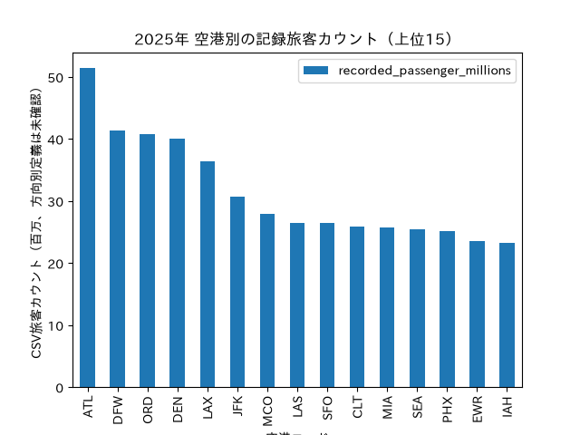

*2025年CSVの上位15空港。縦軸は記録旅客カウントを百万単位で示し、方向別定義が未確認であることを明示しています。NotebookのPNG出力をそのまま抽出しました。*

### AIが自律生成した追加依頼

**追加依頼1 — 定義と時系列の整合性（原文）**

> 空港別旅客数の説明が乗降合計となっている一方、空港別合計と全国合計が一致せず、空港別年次CSVの旅客数が全欠損です。各ファイルの合計、欠損、便数と旅客数の順位、旅客数を一律2倍した場合の集中度を確認し、解釈できる範囲とできない範囲を明確にしてください。

**選定理由**: 単位の誤読は絶対交通量を倍違いにし、全欠損の年次系列からは空港別成長率を計算できません。AIは、順位を示す前提となる交通指標とファイル間の整合性を確認する必要があると判断しました。

**結果**: 空港旅客列合計972,505,919に対し、2025年全国表の旅客列は1,104,406,537で、比は0.8805687819でした。便数列も空港合計9,094,033と全国表10,065,776で一致しません。旅客首位はATL、便数首位はORDの403,903で、指標により順位が変わります。

全空港の旅客列を一律2倍しても上位10空港構成比は35.719116%のままで、感度結果は `stable=True`、最大相対偏差0でした。ただし比例変換による構成比不変は、実際の出発・到着・乗降合計のどれを数えているかの検証にはなりません。空港別成長率は分析不可とし、空港間でカウント定義が比較可能という仮定A1、2025年が完全通年という仮定A2、地理コード結合の仮定A3に警告を残しました。証拠はNotebookの反復1セル（最終実行番号7）の出力とmanifestです。

**追加依頼2 — 結合漏れと都市定義（原文）**

> 地理CSVにIATA列がないことによる結合漏れや米国領域の除外が、都市・地域ランキングを変えるか確認してください。別のKaggle空港一覧を取得してIATAで結合し、座標・名称の一致、未結合交通量、自治体と主要都市圏の集約差を検証してください。

**選定理由**: 初回には `local_code` とIATAコードが一致しないAZAなどや米国領域の空港が未結合でした。New YorkとNewark、Dallas-Fort WorthとDallasを別扱いすると都市順位が変わる可能性があるため、結合改善と都市定義を別々に検証しました。都市圏の公式境界を取得したのではなく、明示的な主要空港グループの感度比較に限定しています。

**結果**: `syedasimalishah/airports` のIATA参照を追加し、曖昧なIATAコードは検出されませんでした。最初の地理参照との重複533件のうち530件は座標差が0.05度以内でした。一方、NUI、HCR、CHUは初回 `local_code` 結合先と大きく異なり、Nuiqsut、Holy Cross、Chuathbalukではなく別の空港へ結合していたことが分かりました。

IATA参照を優先し、ICAOと地理表の `ident`・`gps_code` の照合や座標一致を確認して補助結合を行った結果、座標結合は631空港、旅客カウントの99.994840%になりました。残る22空港の記録旅客カウントは50,177です。厳密な浮動小数一致と0.05度以内の比較を併用し、丸め差と大きな不一致を区別しました。

修正後も所在地文字列ではAtlanta 51,408,843、Chicago 50,235,168、New York 46,917,650の順です。しかしJFK・LGA・EWRをまとめるとNew York主要空港グループは70,438,812で首位になりました。後続の反復3で所在地文字列首位と主要空港グループ首位の構成比を比較すると、都市定義感度は `stable=False`、最大相対偏差37.02%でした。「最も交通量の多い都市」を定義なしに断定できません。両地理資料はOurAirports由来を共有し得るため独立検証ではなく、地理資料の基準日・旧所在地名の妥当性も未確認です。結合・集計の証拠は反復2セル（実行番号9）、都市定義感度の証拠は反復3セル（実行番号10）です。

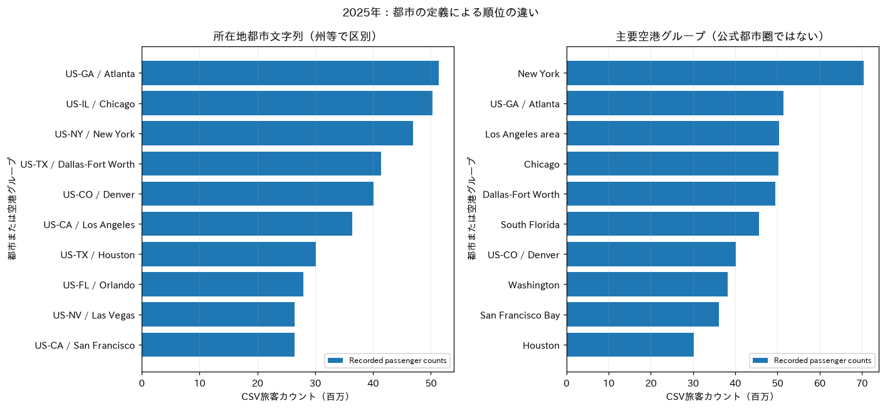

*左は州等で区別した所在地都市文字列、右は明示的な主要空港グループ。首位はAtlantaからNew Yorkへ変わります。右側は公式都市圏ランキングではなく、横軸の範囲も左右で異なります。*

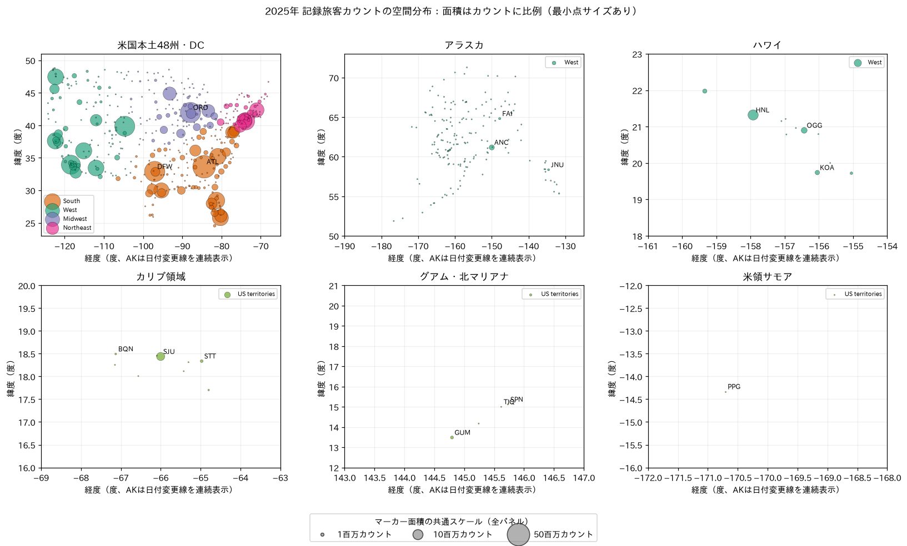

*IATA参照優先で補正した経緯度バブル図。マーカー面積は記録旅客カウントに比例し、視認用の最小サイズがあります。未結合22空港は描画から除外しますが集計分母に残します。行政境界や人口密度を示す地図ではありません。*

**追加依頼3 — 地理的偏りと集中度の頑健性（原文）**

> 地域ごとの交通量シェアと空港数シェアを比較し、地理的な偏りを定量化してください。未結合空港、小規模空港の除外、最大ハブの除外、東西の境界設定が結論を変えるか感度分析し、都市定義による変化とは区別して報告してください。

**選定理由**: 地図の印象だけでは人口密度や空港数と交通量を混同します。AIは地域分類、分母、大ハブ、未結合交通量の影響を確認する必要があると判断しました。人口・面積による標準化や偏りの原因推定は、必要なデータを取得していないため行っていません。

**結果**: 州ベースの4地域に米国領域と不明を加えて集計しました。構成比の分母は全国表ではなく、収録653空港の旅客列合計と空港数です。

| 地域 | 記録旅客カウント | 旅客カウント構成比 | 空港数 | 空港数構成比 |
|---|---:|---:|---:|---:|
| South（南部） | 395,610,488 | 40.679494% | 142 | 21.745789% |
| West（西部） | 300,149,377 | 30.863501% | 311 | 47.626340% |
| Midwest（中西部） | 134,705,498 | 13.851381% | 102 | 15.620214% |
| Northeast（北東部） | 132,608,725 | 13.635776% | 62 | 9.494640% |
| US territories（米国領域） | 9,381,654 | 0.964689% | 14 | 2.143951% |
| Unknown（不明） | 50,177 | 0.005160% | 22 | 3.369066% |

南部は旅客カウント構成比が空港数構成比の約1.87倍で、空港数だけでは説明できない偏りがありました。不明交通量を南部に全く配分しない場合と全量配分する場合の範囲は40.679494–40.684654%です。ATLの除外、旅客カウント10万未満の空港の除外、その両方でも南部が地域首位でした。南部構成比は37.368661–40.779608%、感度は `stable=True`、最大相対偏差8.14%でした。

集中度は上位10空港で旅客列の35.719116%、便数列の31.243949%となりました。旅客列は上位16空港で50%、45空港で80%に達します。未結合空港や小空港を除く感度では、旅客指標内は `stable=True`・最大相対偏差0.71%、便数指標内も `stable=True`・4.95%でした。一方、旅客と便数を混ぜた指標変更込みの比較は `stable=False`・12.53%です。これは小空港除外に対する旅客集中度の不安定性ではなく、異なる指標を使った影響です。

本土の経緯度範囲内で東西境界を西経95・100・105度へ変更すると、東側の旅客構成比は58.64%、70.06%、74.79%となり、`stable=False`・最大相対偏差27.53%でした。これらの感度判定には最大相対偏差10%という設定を使っており、統計的信頼区間や全国母集団への一般化を表すものではありません。証拠は反復3セル（実行番号10）の地域表と各感度出力です。

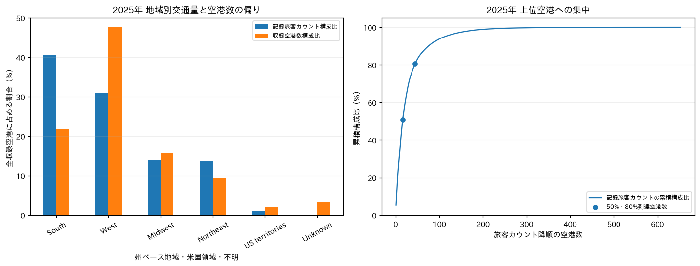

*左は収録範囲内の地域別旅客構成比と空港数構成比、右は旅客カウント降順の累積構成比。南部の交通量の偏りと、少数の空港への集中を別々に示しています。*

**反復の停止理由**: AIは3回の追加分析を実施し、現在の記述的結論に対して追加価値のある内部集計は尽きたと記録しました。方向別集計の再構成、月次完全性の確認、人口・面積補正には未取得の資料が必要です。未検証のA1・A2を残したまま、絶対人数や因果関係に強い結論を出さず終了しました。

### 最終結論

2025年CSVの収録範囲では、空港別の記録旅客カウントはATL、便数はORDが首位です。旅客列の上位10空港が35.72%を占め、上位45空港で80%に達するため、少数の空港への集中が見られます。

都市別の首位は定義依存です。空港所在地文字列ではAtlanta、JFK・LGA・EWRをまとめた主要空港グループではNew Yorkが首位になります。地理的には南部の旅客構成比40.68%が空港数構成比21.75%より高く、最大ハブや小空港の除外後も地域首位を維持しました。ただし東西の精密な構成比は境界に依存します。

これらは**取得CSV内の記述的比較**です。全国表と空港表の総量が一致せず、旅客・便数の方向別定義と2025年の完全収録が未確認であるため、米国全体の正確な乗降人数・需要・因果関係としては解釈しません。

### 監査・再現性

Notebookは `benchmark/projects/kaggle-v020-kaggle-exp-27-airport-traffic/notebooks/kaggle-v020-kaggle-exp-27-airport-traffic.ipynb`、実行識別子は `v020-exp-27` です。取得日時・SHA-256、定義manifest、前提manifest、感度結果、実行コード、出力、PNG4件、実行番号と引用値を持つ根拠付き結論7件が保存されています。Notebookメタデータは `reexecuted_top_to_bottom=True` を記録しています。

最終監査セル自身の実行中には18セル中17セルが実行済みで、末尾監査セルが未完了という警告が出ました。その後の「保存後の確定監査」とメタデータ、および `status.json` の最終監査は、コードセル18/18実行済み、未実行0、エラー0、`nbformat_valid=True`、`findings=[]`、`visual_findings=[]` で一致しています。`audit_notebook(visual_audit=True)` の保存後判定は `ok=True` です。

ライフサイクルの最終状態は `completed`、実行中セル・保留書込み・保持ロックは0/0/0です。`status.json` は `analysis_complete=True`、`final_completion.ready=True` を記録し、各完了要件も成立しています。これらとNotebook内容に基づき、実験分析を完了と判断します。ただし構造・視覚監査の合格は、データ定義や科学的結論の妥当性の保証ではありません。前提manifestのA1・A2の警告は残っています。

`initial.log` には、全セル再実行・監査後にNotebook保存を報告した最終回答があります。`status.json` で初回は終了コード0、終了理由 `exited`、所要1625.8秒です。追加確認は終了コード0、95.1秒、終了理由 `artifact_complete_cutoff` で、`followup.log` は既存3反復の再評価に言及する途中で、Notebookが安定して監査を通ったため外部ランナーが停止した記録で終わっています。追加確認の最終回答まで完了したとは読みません。初回・最終の安定性記録は同じNotebookサイズ827,547バイトと更新日時であり、新たな反復や結果の更新は確認できません。

本節は指定Notebook、初回プロンプト、初回ログ、追加確認ログ、監査状態だけを分析上の証拠としました。旧 `white-paper2.md` は書式・詳細度の参照に限り、旧実験の数値・手法・成功状態は流用していません。図は保存済みPNGの抽出であり、今回新たに分析を実行した結果ではありません。

### 失敗・改善候補と問題の切り分け

最終Notebookにエラーセルはありませんが、途中の呼出し失敗と監査・機能上の制約はNotebookに記録されています。Jupytermind本体はこの実験中に修正せず、回避策を用いて分析を完了しています。

| 分類 | 再現された挙動・影響 | 回避策・判定 |
|---|---|---|
| Jupytermindの根拠照合の不具合候補 | 標準 `print` の `stream.text` に値があっても根拠として照合されない。NotebookはORDの403903で `EvidenceMissingError` が生じたと記録し、`PROBE_4` でも照合結果がFalse | 同じ実行値を `display` の `text/plain` 出力にも記録して結論を保存 |
| Jupytermindの視覚監査の偽陰性候補 | PNGがあるのに `metadata.chart` がないNotebookの `PROBE_2` で `visual_findings=[]`。監査に必要な情報の欠落を検出しない | 本番4図にタイトル・軸・凡例・グリフ情報のメタデータを付け、非白色画素率を実測 |
| Jupytermindの定義manifestの機能不足候補 | `inferred` だけの `FieldValue` を持つ `PROBE_1` で `unresolved_fields()` が空。Notebookはdocstringどおりの挙動と明記 | `unknown` と `inferred` を別々に抽出して注意点を保持。仕様違反ではなく呼出側支援の候補 |
| Jupytermindの可視化の機能不足候補 | `render_chart(kind='barh')` が `Unsupported chart kind: 'barh'`。`PROBE_3` で再現 | 対応する縦棒へ変更し、長い都市名の横棒等はmatplotlibで作成 |

4候補の分類、再現手順、期待・実際の挙動、影響、証拠、受け入れ条件は `issue-candidate.json` に保存しました。根拠はNotebookの改善候補節と再現プローブであり、確定した修正要求や修正済み不具合ではありません。

一方、Kaggle SDKの `dataset_list` に非対応の `page_size` を渡したTypeErrorと、`compare_datasets` の `candidate_relationship` に自由文を与えたValueErrorは、分析コードの呼出側誤りとして修正済みです。年次旅客列の全欠損、集計定義の不整合、古いコードはデータ品質・掲載仕様の問題であり、Kaggle APIの取得失敗やJupytermindの計算不具合とは扱いません。

初回のJupyter MCPによるNotebook指定時の親ディレクトリ不在と、filesystemの許可ディレクトリ不一致は保存環境・接続側の問題です。NotebookにはJupyter MCP内で `project_manager` を使って保存先を作成したと記録されています。追加確認の途中停止は外部ランナーの成果物完了判定によるもので、Jupytermindのライフサイクル失敗とは区別します。提示されたログだけからCopilot CLI固有の不具合は認定しません。

### 残る限界

旅客・便数の方向別定義と空港間の比較可能性、2025年の完全通年収録は独立確認できていません。単位一律2倍の感度分析でもこの不確実性は解消しません。全国表との総量差を空港・地域へ配賦できず、収録空港の構成比をそのまま全国シェアとは呼べません。

空港別年次旅客列が全欠損のため、空港・都市ごとの成長率は分析できません。月別データもなく、季節性、月次ピーク、2026年の通年推計は対象外です。都市は所在地文字列または明示的な主要空港グループであり、公式都市圏ではありません。地理参照は共通由来を持ち得て、基準日や歴史的一致が不明なうえ、小空港の残るコード一致も完全には検証できません。

人口・面積・空港容量・乗継構造を調整しておらず、地域の偏りを住民の需要や経済効果の原因として説明できません。また、視覚監査にはメタデータ欠落を検出しない再現例があり、監査結果が空であることだけを図表品質の保証には使えません。本実験の成果は、記述的な順位と集中度を示すだけでなく、誤結合を補正し、都市定義による結論の変化と未解決のデータ定義を区別して記録した点にあります。

## 実験28: US Agricultural Exports — 米国農産物輸出の品目・地域構成（分析完了・公開CSVで継続）

**課題**: 米国農産物輸出データについて、通貨単位と集計対象を確認し、品目・地域による輸出額の構成を調べます。地域は輸出先ではなく、米国50州をまとめたCensusの4地域です。

**初回プロンプトの生成方法**: 初回プロンプトは、データセットと問い、および取得・実行・記録・監査に関する共通制約からAIが自動生成したものです。人間が本実験の全文を個別に作成したものとしては扱いません。以下は `initial-prompt.md` の全文であり、旧版実験のプロンプトではありません。

**初回プロンプト（全文・原文）**: 「Kaggleで扱われる米国農産物輸出データに相当する公開データから、品目や地域による輸出額の構成を調べてください。通貨単位や集計対象を確認し、比較に向いた図表を自分で選んで、分析結果を日本語で説明してください。AI Data Scientist SkillとJupyter MCPで計画・コード・出力・根拠付きInsightを記録し、再実行を確認してください。 Kaggle参照先: https://www.kaggle.com/datasets?search=us+agricultural+exports。インストール済みkaggle Python SDKを使い、NotebookのJupyter MCP実行セル内で`KaggleApi().authenticate()`、`dataset_list(search=...)`、`dataset_list_files(...)`、必要に応じて`dataset_download_file(...)`を呼び出し、Kaggle上の対応する公開データを検索・取得してください。owner/dataset slug、取得ファイル名、取得日、ファイルSHA-256をNotebookに記録してください。APIトークンをセル出力・Notebook・ログへ表示しないでください。分析・API取得コードの実行はJupyter MCPだけを使い、端末コマンド、subprocess、外部スクリプト起動、作業エージェントへの委譲は行わないでください。Kaggle APIで対応データを検索・取得できなかった場合に限り、`/home/nahisaho/kaggle/experiments/white-paper.md`に記載された旧実験の公開CSV `https://raw.githubusercontent.com/plotly/datasets/master/2011_us_ag_exports.csv` を取得して実験を継続してください。その場合はKaggle APIの失敗内容、フォールバックした理由、CSV URL、取得日時、SHA-256をNotebookに記録し、公開CSVとKaggle掲載版の完全な同一性は保証されないことを明記してください。保存先は benchmark/projects/kaggle-v020-kaggle-exp-28-ag-exports/notebooks/kaggle-v020-kaggle-exp-28-ag-exports.ipynb としてください。run_idは `v020-exp-28` です。長時間処理の開始前にlifecycle.register_runを呼び、実行・書込みフェーズを記録し、終了時にcompletedまたはfailedを記録してください。データ定義manifest、分析前提manifest、意味的な異常検査、妥当な範囲の感度分析を使い、適用できない機能は理由を記録してください。図表はvisual_audit=Trueで監査してください。Notebookには「使用したJupytermindモジュール」節を設け、直接import・呼び出したモジュール名、関数名、使用目的を記録してください。間接利用は使用済みに含めないでください。Jupytermindの不具合または機能不足が疑われた場合は「Jupytermind改善候補」節を設け、分類、再現条件、期待する挙動、実際の挙動、影響、回避策、関係するセルとログを記録してください。Copilot CLI、Kaggle API、ベンチマークランナーに固有の問題とは切り分け、候補がなければ「なし」と記録してください。初回分析後、自分で結果を読み直し、結論に実質的な影響を与える未解決点があれば自然言語の追加依頼文を作成し、Notebookの「反復依頼履歴」に原文のまま記録して実行してください。価値ある追加分析がなくなるまで最大3回繰り返し、各反復の選定理由・結果・証拠・残る限界を報告してください。最後に全コードセルを上から再実行し、notebook_auditとライフサイクル状態を記録してください。」

**初回指示**: 比較手法と図表の選択はAIに委ね、単位・集計対象の確認、取得履歴、根拠付きInsight、最大3回の自律的な追加依頼、全セル再実行を求めています。AIは、取得と出典確認、重複・欠損・非負・50州の網羅性・品目の親子重複の検査、金額加重の地域集計、分母を区別した可視化、感度分析という計画を立てました。

### 使用したJupytermindモジュール

指定Notebookのコードセルで直接importされ、呼び出しを確認できるモジュールだけを示します。関数・クラス・メソッド名は実際のコードに対応します。

| モジュール | 関数・クラス・メソッド | 使用目的 |
|---|---|---|
| `ai_data_scientist.project_manager` | `resolve_project`、`ensure_notebook`、`ensure_data_dir` | 指定プロジェクト、Notebook、取得データ保存先の解決・準備 |
| `ai_data_scientist.language_router` | `detect_language` | 日本語の分析指示の言語判定 |
| `ai_data_scientist.lifecycle` | `register_run`、`is_cancel_requested`、`mark_execution_start`、`mark_execution_end`、`get_run_status`、`mark_completed`、`wait_for_quiescence` | `v020-exp-28` の登録、実行フェーズ、取消確認、完了・静止状態の記録 |
| `ai_data_scientist.ingestion` | `SourceSpec`、`ingest` | 取得CSVの行上限付き読込みと切詰めの有無の確認 |
| `ai_data_scientist.cleaning` | `clean_dataset` | 重複除去の実施と行数への影響の確認 |
| `ai_data_scientist.eda` | `explore` | 型、欠損、記述統計、カテゴリ分布の確認 |
| `ai_data_scientist.data_definition` | `FieldValue`、`build_manifest`、`DataDefinitionManifest.unresolved_fields` | 出典・単位・観測対象・定義の確信度の記録と未確認項目の列挙 |
| `ai_data_scientist.analysis_assumptions` | `Assumption`、`AnalysisAssumptionManifest`、`check_manifest` | 記述的分析の範囲と結論に重要な未検証前提の明示 |
| `ai_data_scientist.data_quality` | `detect_anomalies` | 非負、非欠損、州の一意性、許容集合に関する意味的異常検査 |
| `ai_data_scientist.sensitivity` | `SensitivityPlan`、`run_sensitivity` | 親子列・丸めの6仕様、および1州除外を含む51仕様×3品目の感度分析 |
| `ai_data_scientist.visualization` | `render_chart`、`build_image_output` | 地域・品目の棒グラフ生成とPNGのMIME出力化。ヒートマップの描画自体はMatplotlib |
| `ai_data_scientist.notebook_audit` | `audit_notebook`、`audit_visual_outputs` | `visual_audit=True` によるNotebook監査と図表メタデータ欠落の限定再現 |

Notebookの利用表には、別の制御Notebook側での `project_manager.enqueue_write`、書込みフェーズ管理、`insight_engine.extract_cited_value` / `record_insight` も記録されています。ただし、その制御Notebookのコードは今回の指定証拠に含まれないため、上表の直接利用には加えていません。指定Notebookには9件の根拠付きInsightと、その再実行出力への参照更新が残っています。

`mcp_gateway.run_and_record` は、既存のstdio MCP接続をPythonクライアントとして注入できないため不適用と記録され、実行には直接Jupyter MCPを用いています。独立した対応参照データがないため `dataset_validation.compare_datasets` と `data_quality.validate_anomalies` は使用していません。相関検定、因果推論、予測、確率的な標本信頼区間も、50州の記述的構成という問いには適用していません。

### データ取得と定義の確認

Kaggle SDKの認証は成功しました。`us agricultural exports`、`2011 us ag exports`、`agricultural exports`、`2011_us_ag_exports`、`us ag exports`、`agriculture exports` の6検索語を使い、候補のファイル一覧を取得しています。実際にダウンロードした `willianoliveiragibin/latest-u-s-agricultural-trade-data` の `agricula.csv` と、`juliekri/agriculture-export-products` の `Agriculture Export Products.csv` は、州別総額と品目別輸出の必要列に一致せず不採用でした。

これは認証・通信障害による失敗ではなく、**今回の検索・候補取得の範囲で対応する州別データを特定できなかった**という結果です。Kaggleに対応データが存在しないことを証明したものではありません。分析には、初回指示が例外的に許可したPlotly公開CSVを使用しました。取得セルの `source_type` は `fallback_public_csv`、`owner_dataset_slug` は `null` です。検索で確認したKaggle候補のslugを、分析データの取得元として混同しません。

| 項目 | Notebookに記録された内容 |
|---|---|
| 分析ファイル | `2011_us_ag_exports.csv` |
| 取得URL | `https://raw.githubusercontent.com/plotly/datasets/master/2011_us_ag_exports.csv` |
| 初回取得日時 | `2026-10-01T20:49:10.828652+00:00` |
| 再実行時の取得日時 | `2026-10-01T21:01:12.300798+00:00` |
| SHA-256 | `fb67e84a105a6f29bb0005081e24b116995a9be21919c5b1dc69562adde866a0` |
| データ形状 | 50行・17列。米国50州、2011年 |
| 掲載9品目 | 牛肉、豚肉、家禽肉、乳製品、果物合計、野菜合計、トウモロコシ、小麦、綿花 |

Notebookに保存されたPlotly公式例の抜粋は、このCSVの `total exports` を図に使い、年を2011年、単位を `Millions USD` と表示しています。したがって、総額列は**百万USD**として確認しています。一方、各品目列にも同じ通貨単位を適用することは総額列からの推定で、正式な品目分類、暦年・会計年度の別、州への計上方法は未確認です。Census地域は州コードから付与し、反復3で公式一覧との全50州照合を行いました。公開CSVとKaggle掲載版の完全な同一性は保証していません。

重複除去は50行から50行で削除0行、意味的異常検査の出力は `[]` でした。州の集合、非数値・欠損・非有限値、非負、品目額の州総額超過を確認し、掲載9品目と総額の差が負となる州も0件でした。果物・野菜は合計の親列を採用し、生鮮・加工の子列を同時加算しないことで二重計上を避けています。分析前提manifestには、品目列の共通通貨単位と、残差を未掲載部分と解釈する前提について、未検証の重要前提を示す警告2件が残りました。

### 初回結果

50州の `total exports` 合計は **136,444.45百万USD（1,364.4445億USD）** でした。地域別総額は中西部が最大で、全国の48.10%を占めます。「約半分」であって、過半数ではありません。

| 地域 | 輸出総額（百万USD） | 全国総額に占める割合 |
|---|---:|---:|
| 中西部 | 65,628.69 | 48.10% |
| 南部 | 34,401.81 | 25.21% |
| 西部 | 31,383.35 | 23.00% |
| 北東部 | 5,030.60 | 3.69% |

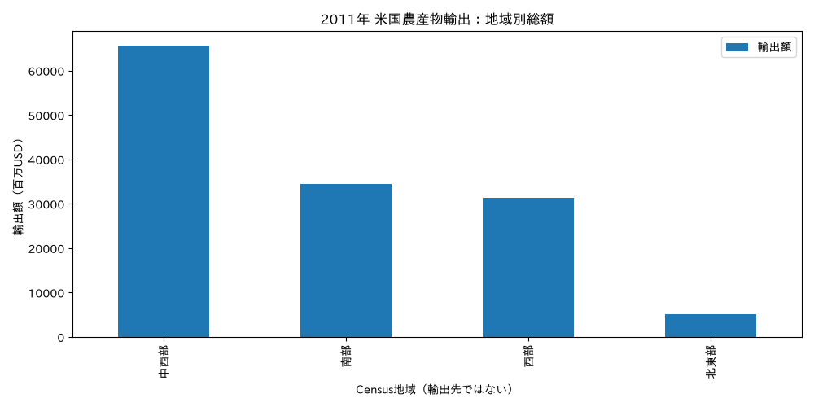

*州別総額を金額で積み上げた地域比較。ゼロ起点の共通軸で金額差を示し、地域が輸出先ではないことを軸名に明記しています。NotebookのPNG出力をそのまま抽出しています。*

掲載品目の上位は、果物14,089.50、トウモロコシ13,652.10、小麦11,141.20百万USDで、総額比はそれぞれ10.33%、10.01%、8.17%でした。ただし、**掲載9品目の合計は全国総額の55.06%にとどまり、差額61,314.15百万USD、44.94%の内容は不明**です。品目金額・総額比率には共通単位の前提があり、「全農産物で果物が首位」とは結論しません。

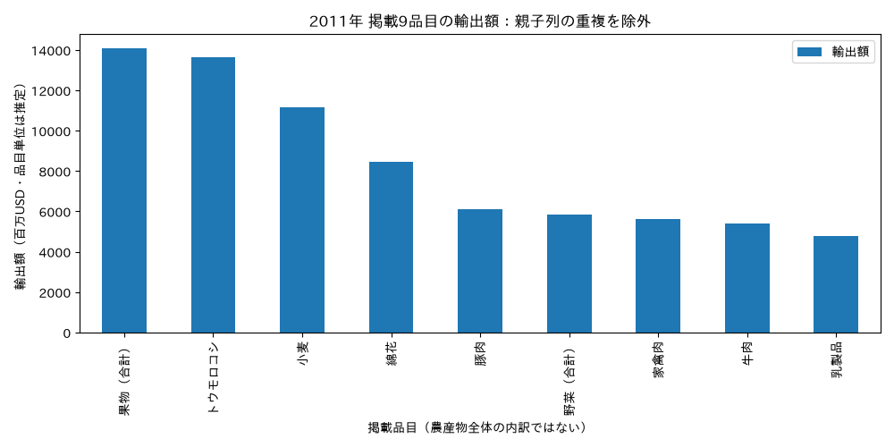

*果物・野菜は合計列だけを採用した掲載品目の比較。全農産物の完全な内訳ではなく、品目列の百万USD単位は推定を含むことを図中に明示しています。*

品目内で見ると、果物の78.53%が西部、トウモロコシの88.08%が中西部、綿花の76.96%が南部に集中していました。これは「各品目の全国合計に占める地域比率」であり、「各地域の総額に占める品目比率」とは分母が異なります。州別総額ではCaliforniaが16,472.88百万USD、全国の12.07%で最大でした。

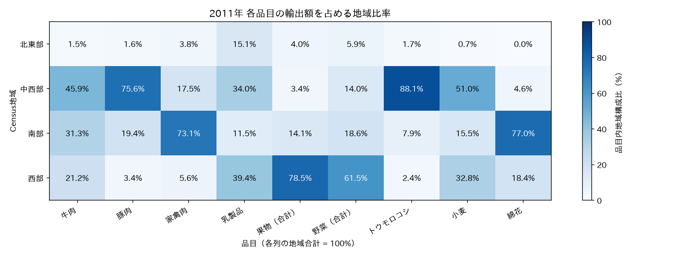

*各列の地域合計を100%とした品目内地域構成。共通の0–100%尺度と数値注記で、果物の西部、トウモロコシの中西部、綿花の南部への集中を比較します。各行が地域内の全品目構成を表すわけではありません。*

### AIが生成した追加依頼1 — 未掲載部分・分母・丸めの検証

**追加依頼（全文・原文）**:

> 掲載9品目が総額の約55%にしかならない点を再検討してください。地域ごとの未掲載残差を示し、掲載品目だけを分母にした場合に地域構成の結論がどう変わるか比較してください。果物・野菜の親列と生鮮・加工の子列の差が丸め誤差の範囲か確認し、親列/子列の選択と表示丸めに対する感度分析を実施してください。未掲載部分に特定の品目名を推測で付けないでください。

**選定理由**: AIは初回出力を読み直し、約45%の説明されない金額があるため、分母の混同が地域順位や品目構成の結論を変えると判断しました。

**結果**: 掲載9品目だけを分母にすると、中西部38.74%、西部31.61%、南部26.55%、北東部3.11%となり、総額ベースの「南部 > 西部」が逆転しました。地域別掲載率も、中西部44.35%、西部75.66%と大きく異なります。残差は北東部2,697.14、中西部36,520.85、南部14,457.75、西部7,638.41百万USDであり、特定の品目名は付けていません。

果物・野菜の親列と子列合計の差は、各州の最大絶対差がどちらも約0.09百万USDで、表示丸めから設定した上限0.105百万USD以内でした。親列・子列の2通りと、表示値・丸め下限・丸め上限の3通りを組み合わせた6仕様では、掲載率は55.0472–55.0800%でした。最大相対偏差は `0.0003094317458944067`（約0.03094%）で、相対許容幅0.1%に対して `stable=True` です。丸めや親子列選択では、約45%の差額は説明できません。

**証拠と残る限界**: `iteration1`（実行番号10）の地域別表・`ITERATION1_METRICS`・感度分析出力を根拠に、2件のInsightが記録されています。丸め上下は表示精度による境界であり、確率的信頼区間ではありません。品目単位・分類境界の前提と未掲載部分の内容は未解決です。

### AIが生成した追加依頼2 — 大規模州への依存

**追加依頼（全文・原文）**:

> 果物は西部、トウモロコシは中西部、綿花は南部に集中するという結果が、それぞれの大規模輸出州だけに依存していないか調べてください。各品目の最大州と地域内での寄与率を示し、50州の各1州を除く感度分析で地域の首位と過半数が維持されるか確認してください。州の除外は母集団を変える診断であり、不確実性の信頼区間や外れ値除去の正当化と混同しないでください。

**選定理由**: AIは初回の地域比率とCaliforniaの州総額首位を読み直し、地域全体に広く分布する集中なのか、特定州の大きな寄与なのかを区別しました。

**結果**: Californiaは果物全国合計の62.01%、西部の果物合計の78.96%を占めました。同州を除くと果物の西部比率は78.53%から43.49%へ下がり、過半数ではなくなります。Iowa除外後のトウモロコシ中西部比率は85.37%、Texas除外後の綿花南部比率は68.32%でした。

| 品目・着目地域 | 最大州 | 最大州の所属地域内寄与率 | 最大州除外後の地域比率 | 全1州除外で地域首位を維持 | 全1州除外で過半数を維持 |
|---|---|---:|---:|---|---|
| 果物・西部 | California | 78.96% | 43.49% | はい | いいえ |
| トウモロコシ・中西部 | Iowa | 21.04% | 85.37% | はい | はい |
| 綿花・南部 | Texas | 35.44% | 68.32% | はい | はい |

除外なしと全50州の各1州除外を合わせた51仕様を各品目に適用しました。元の地域首位は3品目とも維持しますが、相対許容幅10%による量的安定性は、果物 `stable=False`（最大相対偏差約44.62%）、トウモロコシ `stable=True`（約3.08%）、綿花 `stable=False`（約14.39%）でした。**首位が変わらないこと、過半数が維持されること、比率そのものが安定することは別の判断**です。

**証拠と残る限界**: `iteration2`（実行番号11）の州寄与表と `ITERATION2_METRICS`、同セルの51仕様×3品目を計算するコードが根拠です。結果は2件のInsightに記録されています。州除外は母集団を変える診断であり、信頼区間や大規模州を削除すべき根拠ではありません。

### AIが生成した追加依頼3 — 生鮮・加工区分と地域定義

**追加依頼（全文・原文）**:

> 残っている定義上の不確実性を点検してください。果物・野菜の生鮮と加工の列が、州ごとに独立の構成情報を含むのか、それとも表示丸めの範囲で共通比率による分割と整合するのかを調べてください。Census公式の地域一覧と全50州の割当ても機械的に照合してください。計上年の種類・州への帰属方法・正式な品目分類は、確認できた出典と未確認点を区別し、推定を事実に格上げしないでください。

**選定理由**: AIはデータ定義manifestに残る加工区分の留保を読み直し、親子列の数値整合だけでは独立した測定情報を保証できないと判断しました。地域の誤割当ても結論に影響するため、併せて確認しています。

**結果**: 正の生鮮額を持つ果物49州・野菜48州では、加工額／生鮮額を共通比率で表すことが表示丸めの範囲で可能でした。比率の共通許容区間は果物約2.129251–2.129363、野菜約1.622720–1.623047です。生鮮・加工それぞれの地域構成比の最大差は、果物約0.001964ポイント、野菜約0.006528ポイントにとどまりました。このCSVから独立した州別加工度の違いを推論することは避けています。ただし、共通比率と整合することは、実際にその方法でデータが生成されたという証明ではありません。

Census公式一覧との照合は50州一致、不一致0件でした。Notebookに記録されたUSDA資料の確認では、生産・現金収入に基づく州への配賦と、積出・移動起点の系列を区別していますが、このCSVがどの定義に対応するかは確定していません。

**証拠と残る限界**: `iteration3`（実行番号12）の共通比率区間表・`ITERATION3_METRICS` と、同出力に対応するInsightが根拠です。正式な品目境界、年度の種類、州への計上方法は未解決のまま保持しています。

### 最終結論

2011年の当該CSVでは、中西部が総輸出額の48.10%で最大でした。掲載9品目では果物、トウモロコシ、小麦が上位ですが、掲載部分は総額の55.06%にすぎません。未掲載部分の内容が不明なため、全農産物の品目順位・完全な内訳には一般化できません。

3回の反復によって、掲載品目のみを分母にすると西部・南部の順位が逆転すること、果物の西部集中の強さはCaliforniaに大きく依存すること、生鮮・加工区分に独立した地域差の情報が乏しいことが確認されました。AIの追加分析は、単に手法を増やすのではなく、初回結論の分母・集中の意味・データ定義を狭める役割を果たしました。丸めへの安定性と、州除外への安定性も分けて評価しています。

追加依頼は最大3回に到達しました。同じCSVで計算を増やしても、未掲載内容や正式定義、Kaggle版との同一性は解消できないため、AIは反復を終了しています。3回とも `initial.log` が記録する初回実行中に完了しており、外部の `followup.log` は既存履歴を保持して上限を超える依頼を追加しないと判断しています。外部の追加確認と、Notebook内の3回の分析反復を同一視しません。

### 再現性と監査

Notebookの最終実行証跡とメタデータは、カーネル再起動後に全15コードセルを先頭からJupyter MCPで再実行し、実行番号を1–15に更新したことを記録しています。`repro-check` の出力では、主要数値25項目が初回と `rtol=atol=1e-12` で一致し、再取得CSVのSHA-256も初回と一致しました。再現性の照合範囲は主要指標とCSVの同一性であり、取得時刻や出典HTMLの同一性までは要求していません。

最終セル内の自己監査は、実行中の監査セルを未実行判定から除外した警告1件を含みます。保存完了後の制御Notebookによる再監査については、指定Notebookに保存された最終結果を確認できます。監査日時は `2026-10-01T21:03:44.470700+00:00`、nbformat有効、コードセル15/15実行済み、未実行0、エラー0、図表3セル、根拠付きInsight 9件、`findings=[]`、`visual_findings=[]` でした。

ライフサイクルは `v020-exp-28` が `completed`、実行中セル0、書込み待ち0、保持ロック0です。`status.json` の `analysis_complete=true` と `final_completion.ready=true`、およびNotebook内容が分析完了を支持します。初回ログには完了報告、追加確認ログにはNotebookの安定と監査通過を理由にしたランナーの停止記録があり、`followup_termination` は `artifact_complete_cutoff` です。この終了理由を分析失敗とは扱いません。

本節の図表は保存Notebook内の3つの `image/png` 出力から抽出し、セルの `metadata.chart.image_sha256` と一致しています。図表監査の合格は、単位・品目定義・残差解釈の妥当性を保証するものではなく、分析前提の警告2件も解消していません。

### 発生した問題とJupytermind改善候補

分析全体の未完了や最終エラーセルは確認されませんでしたが、取得・描画・監査には次の問題と留保があります。

**外部の取得・統合経路**: Kaggle SDKで `dataset_list(page_size=...)` を指定した際の `TypeError` は、Notebookの互換性メモで報告され、標準の `dataset_list(search=...)` に修正されています。空白を `%20` に変換したダウンロード保存名も、取得コードが両方の名前を確認することで対応しています。いずれもSDK・呼出側の問題として切り分けます。最終的なフォールバック理由は取得CSVのスキーマ不一致であり、Kaggle認証失敗ではありません。

実行中Notebookの自己書換えとMCP保存の競合は、Notebookの実行方式説明で統合経路の制約として記録されています。別の制御Notebookによる直列書込みで回避していますが、今回の指定証拠では新たな競合障害を再現していません。Copilot CLI・外部ランナー固有の障害も確認されておらず、正常な成果物確認後の停止をJupytermindの不具合候補には含めません。

**候補1 — 定義不確実性の列挙範囲**: `module-diagnostics` で、単位だけが `inferred` のmanifestを `build_manifest` で作り、`unresolved_fields()` を呼ぶと、列挙数は0でした。推定単位を未解決一覧だけで確認すると見落とす可能性があります。ただしNotebookは同関数のdocstringがunknownのみを対象とすると報告しており、実装単独のバグとは断定しません。候補は、不確実性一覧の対象を明示するAPI・文書改善、または推定項目も選択的に列挙する機能です。今回の回避策は、全 `FieldValue` を走査し、`unknown` と `inferred` を両方出力することでした。

**候補2 — 棒グラフのラベル切れ**: Notebookの改善候補節は、10×5インチ・長い日本語品目名の棒グラフで、`figure.autolayout` が無効の初回PNGに品目名下端と横軸名の切れがあったと報告しています。欠落グリフが0でも、品目や分母の説明が読めない影響があります。`figure.autolayout=True` にして再描画した最終PNGは、抽出画像でもラベルが収まっています。初回PNGそのものは今回の指定証拠に含まれないため、修正前の現象はNotebook内の報告として扱い、独立に再確認したとは記述しません。

**候補3 — 図表メタデータ欠落の検出不足**: `module-diagnostics` は実PNG出力付きの図表セルをコピーし、`metadata.chart` を除いて `audit_visual_outputs` を呼んでいます。出力は `chart_without_metadata_visual_findings=[]` でした。監査合格だけでは、ラベル・欠落グリフに必要な情報が存在し、検査されたことを保証できません。今回はタイトル・軸・凡例・グリフ情報をセルに付与し、最終監査前にメタデータの存在と画像ハッシュを別途assertしています。

3件は `issue-candidate.json` に分類、再現手順、期待・実際の挙動、影響、指定証拠内の根拠、受け入れ条件を保存しています。ライブラリの修正やGitHub Issue登録を実施したという意味ではありません。

### 残る限界と証拠範囲

総額列の百万USD・2011年はNotebook内のPlotly公式例の抜粋で確認できますが、品目列の共通単位、正式分類、暦年・会計年度の別、州への帰属方法は未確認です。生鮮・加工の共通比率との整合も、データ作成方法の証明ではありません。未掲載44.94%を特定作物や加工品に割り当てず、公開CSVの個別ライセンス適用範囲も未確認として残しています。

対象は2011年の50州の断面であり、現在の構成、時間変化、輸出先国、生産性、一人当たり輸出、因果効果には外挿できません。独立した同年・同州・同品目の参照データによる数値検証は未実施で、Kaggle版との完全同一性も未確認です。ファイル同一性の再現と、意味定義の確定は別の達成事項です。

結果の証拠は、指定されたNotebook、`initial-prompt.md`、`initial.log`、`followup.log`、`status.json` のみです。Notebookが言及する補助データファイルや制御Notebook、外部サイトを追加の証拠として読んでいません。`white-paper2.md` は節の詳細度・書式の参照にのみ用い、旧版実験の数値・取得成功状態を本実験へ転用していません。

## 実験29: Apple Stock — 価格水準・日次変動・期間依存性（分析完了）

**課題**: 「Kaggleで公開されるApple株価データに相当する公開時系列データを分析し、価格推移と日次変動の特徴を示してください。」

**初回プロンプト（全文・原文）**: このプロンプトは、データセットと問い、および取得・実行・監査に関する共通制約からAIが自動生成したものです。人間が実験29の全文を個別に作成したものではありません。以下は `initial-prompt.md` の全文です。

> Kaggleで公開されるApple株価データに相当する公開時系列データを分析し、価格推移と日次変動の特徴を示してください。価格とリターンを区別して自分で分析方法と図表を選び、予測を行う場合はデータ範囲の限界を明記してください。AI Data Scientist SkillとJupyter MCPで根拠付きで記録し、再実行してください。 Kaggle参照先: https://www.kaggle.com/datasets?search=apple+stock+historical。インストール済みkaggle Python SDKを使い、NotebookのJupyter MCP実行セル内で`KaggleApi().authenticate()`、`dataset_list(search=...)`、`dataset_list_files(...)`、必要に応じて`dataset_download_file(...)`を呼び出し、Kaggle上の対応する公開データを検索・取得してください。owner/dataset slug、取得ファイル名、取得日、ファイルSHA-256をNotebookに記録してください。APIトークンをセル出力・Notebook・ログへ表示しないでください。分析・API取得コードの実行はJupyter MCPだけを使い、端末コマンド、subprocess、外部スクリプト起動、作業エージェントへの委譲は行わないでください。Kaggle APIで対応データを検索・取得できなかった場合に限り、`/home/nahisaho/kaggle/experiments/white-paper.md`に記載された旧実験の公開CSV `https://raw.githubusercontent.com/plotly/datasets/master/2014_apple_stock.csv` を取得して実験を継続してください。その場合はKaggle APIの失敗内容、フォールバックした理由、CSV URL、取得日時、SHA-256をNotebookに記録し、公開CSVとKaggle掲載版の完全な同一性は保証されないことを明記してください。保存先は benchmark/projects/kaggle-v020-kaggle-exp-29-apple-stock/notebooks/kaggle-v020-kaggle-exp-29-apple-stock.ipynb としてください。run_idは `v020-exp-29` です。長時間処理の開始前にlifecycle.register_runを呼び、実行・書込みフェーズを記録し、終了時にcompletedまたはfailedを記録してください。データ定義manifest、分析前提manifest、意味的な異常検査、妥当な範囲の感度分析を使い、適用できない機能は理由を記録してください。図表はvisual_audit=Trueで監査してください。Notebookには「使用したJupytermindモジュール」節を設け、直接import・呼び出したモジュール名、関数名、使用目的を記録してください。間接利用は使用済みに含めないでください。Jupytermindの不具合または機能不足が疑われた場合は「Jupytermind改善候補」節を設け、分類、再現条件、期待する挙動、実際の挙動、影響、回避策、関係するセルとログを記録してください。Copilot CLI、Kaggle API、ベンチマークランナーに固有の問題とは切り分け、候補がなければ「なし」と記録してください。初回分析後、自分で結果を読み直し、結論に実質的な影響を与える未解決点があれば自然言語の追加依頼文を作成し、Notebookの「反復依頼履歴」に原文のまま記録して実行してください。価値ある追加分析がなくなるまで最大3回繰り返し、各反復の選定理由・結果・証拠・残る限界を報告してください。最後に全コードセルを上から再実行し、notebook_auditとライフサイクル状態を記録してください。

**初回指示**: 価格水準とリターンを区別し、手法・図表をAI自身に選ばせる記述的分析です。取得元とハッシュ、定義の確度、分析前提、意味的異常、感度分析を記録し、最大3回の自律追加依頼、全セル再実行、画像監査、ライフサイクル終了確認を求めています。予測モデルや追加分析の個別項目は事前に指定していません。Kaggle取得が失敗した場合だけ公開CSVへ切り替える条件でしたが、本実験では切替えは不要でした。

### 使用したJupytermindモジュール

共通接頭辞は `ai_data_scientist.` です。以下は対象Notebookのコードで直接importと実際の呼出しを確認できるモジュール・関数・クラスに限定しています。セル番号はNotebook配列の0始まりで、`execution_count` とは区別します。

| モジュール | 直接呼び出した関数・クラス・メソッド | 使用目的 |
|---|---|---|
| `project_manager` | `resolve_project`, `ensure_notebook`, `ensure_data_dir` | プロジェクト・Notebook保存先の解決とデータディレクトリの準備（セル1） |
| `language_router` | `detect_language` | 日本語の実行言語判定（セル1） |
| `lifecycle` | `register_run`, `is_cancel_requested`, `mark_execution_start`, `mark_execution_end`, `mark_write_start`, `mark_write_end`, `mark_completed`, `wait_for_quiescence` | 実行登録、キャンセル確認、実行・書込みフェーズ、完了・静止状態の確認（セル1のヘルパーと各処理、セル21） |
| `ingestion` | `SourceSpec`, `ingest` | 取得CSVの読込みと10万行上限による切詰めの検査（セル3） |
| `cleaning` | `clean_dataset` | 完全重複行の削除と行数変化の記録（セル4） |
| `eda` | `explore` | 型、欠損、記述統計の確認（セル4） |
| `data_definition` | `FieldValue`, `build_manifest`, `DataDefinitionManifest.unresolved_fields` | 出典・列定義をverified／inferred／unknownに分けて記録（セル4） |
| `analysis_assumptions` | `Assumption`, `AnalysisAssumptionManifest`, `check_manifest` | 記述的分析の前提、未解決警告、感度分析後の更新（セル4・9・11・21） |
| `data_quality` | `detect_anomalies` | 非欠損、日付一意性、価格の正値、出来高の非負性の意味的検査（セル4） |
| `stats_analysis` | `correlation` | 隣接リターンのPearson相関と日本語の解釈（セル5） |
| `sensitivity` | `SensitivityPlan`, `run_sensitivity` | 期間・リターン定義8仕様と、ウィンザー化・定義6仕様の比較（セル9・11） |
| `visualization` | `render_chart`, `build_image_output` | 初回5図と年別1図の描画、および裾比較図を含むPNG出力化（セル6・9・11） |
| `notebook_audit` | `audit_notebook` | `visual_audit=True`による実行状態・根拠・画像の監査（セル21） |

Notebookの使用記録には、制御Notebook側での `project_manager.enqueue_write`、`insight_engine.extract_cited_value`／`record_insight`、`lifecycle.get_run_status` も記載されています。ただし、今回の証拠範囲に制御Notebook本体は含まれないため、上表の対象Notebookで直接実行を確認した関数には含めません。対象Notebook内の `enqueue_write` はヘルパー定義中にあり、最終コードではそのヘルパーの呼出しはありません。`insight_engine` はimportされていますが、直接呼出しコードはありません。例外分岐の `lifecycle.mark_failed` も本実行の使用済み関数には数えません。

### データ取得と分析前提

Kaggle SDKの `KaggleApi().authenticate()`、`dataset_list(search='apple stock historical', page=1)`、`dataset_list_files(...)`、`dataset_download_file(...)` を実行し、検索上位のApple単一銘柄の日次CSVを取得しました。選定理由はNotebookに「検索上位のApple単一銘柄の日次CSVを優先。結果の良し悪しで選択していない」と記録されています。

| 項目 | Notebookに記録された値 |
|---|---|
| owner/dataset slug | `tarunpaparaju/apple-aapl-historical-stock-data` |
| ファイル | `HistoricalQuotes.csv` |
| 取得日時 | `2026-10-01T21:02:18.937493+00:00`（保存済み再実行出力のUTC日時） |
| ファイルサイズ | 145,669バイト |
| SHA-256 | `9831571599a557aebf26e743f8ada6489e209afa6eef4fd0a866828e9e9f3911` |
| 収録期間・規模 | 2010-03-01〜2020-02-28、2,518行・6列 |
| 列 | `Date`, `Close/Last`, `Volume`, `Open`, `High`, `Low`（原CSVの一部列名には先頭空白あり） |
| Kaggle取得失敗・フォールバック | `kaggle_failures=[]`、フォールバック未使用 |

保存済み出力は最終再実行後の状態であり、初回取得時刻そのものはこの表から復元しません。取得時には認証処理の標準出力・標準エラーを抑制し、指定証拠にはAPIトークンを表示していません。

列名の空白と価格のドル記号・桁区切りを除き、日付・数値型へ変換して日付昇順に並べています。完全重複削除の影響は0行で、全6列の欠損、日付重複、週末日付、非有限数値、OHLC不整合、整数でない出来高はいずれも0件でした。意味的異常検査の出力は空配列です。日付間隔は最大5日ですが、取引所営業日カレンダーとの完全照合は実施していないため、欠損営業日がないとは断定していません。

価格を \(P_t\) とし、単純リターンを \(P_t/P_{t-1}-1\)、対数リターンを \(\ln(P_t/P_{t-1})\) と定義しました。ここで「日次」は隣接する収録観測の変化率です。標準偏差は `ddof=1`、ローリング変動は20観測で、年率換算はしていません。休日補間、欠損価格補完、極端日の削除は行っていません。

データ定義manifestでは、価格単位はドル記号からの推定、`Close/Last` は終値または最終約定値という列名に基づく推定です。株式分割・配当の調整、取引所タイムゾーン、ライセンスはunknownのままです。分析前提manifestでは、日付・価格・OHLC等の検査はverified、期間・定義の感度分析はtestedですが、営業日網羅性・共通の価格調整基準（A2）とブートストラップ近似の妥当性（A6）はassumedで、結論に関係する警告が残っています。

### 初回結果

初回分析は、価格水準、累積最高値からの下落率、日次リターンの時系列と分布、20観測ローリング標準偏差を分けて示しました。価格は29.8557から273.36へ変化し、端点比は **+815.60%** です。ただし、この値は取得CSVの価格変化であり、配当込み投資収益ではありません。途中の最大ドローダウンは **−44.38%** で、長期上昇と大幅な下落が併存しています。

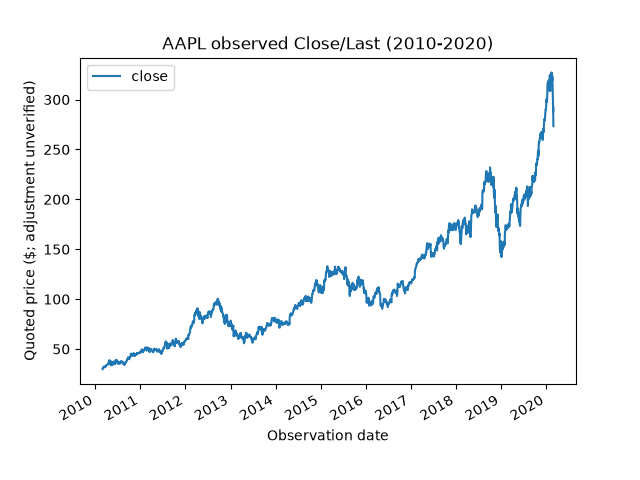

*2010年3月から2020年2月までの収録価格。縦軸のドル表記は元データからの推定で、価格調整規則は未確認。Notebookセル6のPNG出力から抽出。*

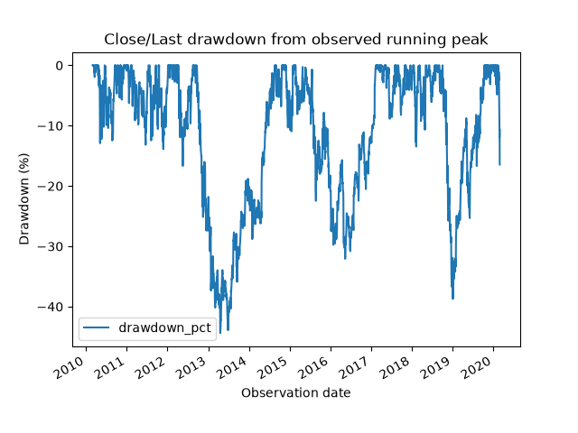

*収録範囲内の累積最高値を基準にした下落率。端点の上昇率だけでは見えない途中の損失経路を示す。*

| 日次価格リターンの要約 | 結果 |
|---|---|
| 観測数 | 2,517 |
| 平均・中央値 | +0.1013%／+0.0891% |
| 標準偏差 | 1.6271% |
| 1%／99%分位点 | −4.39%／+4.43% |
| 最小／最大 | −12.36%（2013-01-24）／+8.87%（2012-04-25） |
| 正のリターンの割合 | 52.80% |
| 歪度・超過尖度 | −0.1995／4.4222 |
| リターン／絶対リターンの1期自己相関 | 0.0188／0.1238 |

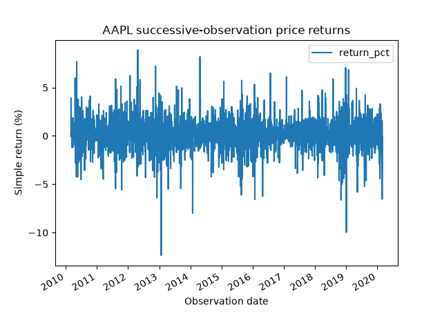

*隣接観測間の単純リターン。価格差ではなく比率で比較し、極端な日も削除せず保持している。*

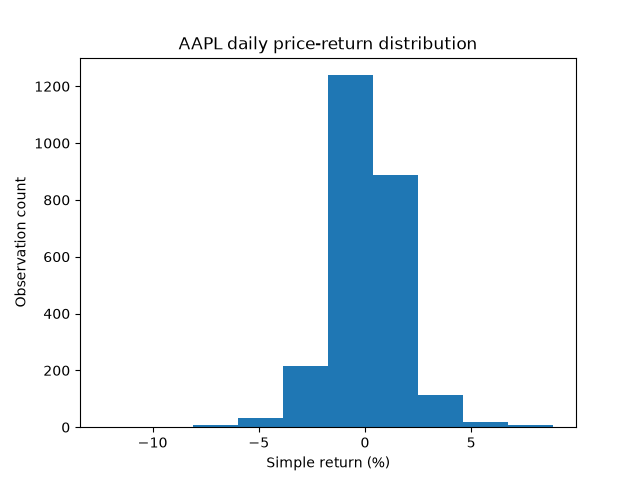

*日次価格変化率のヒストグラム。中心付近に観測が集中する一方、少数の大きな変動を含む。裾の評価は追加分析で定量化した。*

隣接リターンのPearson相関は0.0188、p=0.3458でした。モジュールは「弱い正の相関」と説明していますが、係数は小さく、p値も時系列の独立性等を仮定した参考値です。無相関や予測可能性の証明としては扱っていません。絶対リターンの自己相関0.1238は変動のまとまりを示唆する記述値であり、予測精度の検証ではありません。

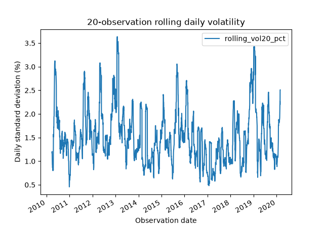

*20観測窓で計算した日次標準偏差。年率ボラティリティではなく、時期による局所的な変動幅の違いを示す。*

### AIが生成した追加依頼

**追加依頼1 — 年別・部分期間とリターン定義の感度（原文）**

> 全期間の日次標準偏差だけで変動を一定と解釈しないよう、年別と前半・後半・直近252観測を比較してください。単純リターンと対数リターンを切り替えた感度分析を行い、最大下落のピーク・底・回復日も確認してください。2014年の分割前後に不自然な価格断絶がないか確認し、調整規則を証明できるかどうかを区別してください。

**選定理由**: 初回のローリング変動図で時期ごとの幅が異なり、全期間要約の代表性（A5）と価格比較の調整基準（A2）が結論に影響するとAIが判断しました。

**結果**: 最大下落は2012-09-19の収録ピークから2013-04-19の底へ進み、2014-08-19にピーク価格を回復しました。ピークから底までは144観測間隔です。2011〜2019年の暦年観測における日次標準偏差は、2017年の1.1135%から2012年の1.8604%まで異なります。2010年は213リターン、2020年は40リターンだけの部分年であり、通年として比較していません。

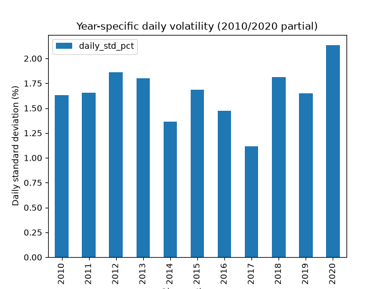

*年ごとの日次変動幅。2010年・2020年は部分期間であり、2020年の2.1325%を年間全体の値とは解釈しない。Notebookセル9のPNG出力から抽出。*

全期間・前半・後半・直近252観測と、単純／対数リターンを組み合わせた8仕様を比較しました。単純リターンの標準偏差は順に1.6271%、1.6780%、1.5746%、1.6082%、平均は0.1013%、0.1301%、0.0724%、0.1943%でした。感度モジュールの標準偏差判定は `stable=True`、最大相対偏差は約3.22%、平均は `stable=False`、最大相対偏差は約91.88%でした。許容20%は分析コードで指定した運用上の比較基準であり、有意差検定ではありません。小さい平均を基準にした相対差が大きくなり得る点もNotebookに記録されています。

絶対値20%を超える日次変化は0件でした。Notebookが分割前後の確認窓とした2014-06-05〜06-11では、06-06の92.2243から06-09の93.7000への変化は+1.6001%でした。大きな価格断絶がないことは確認できましたが、外部イベント資料・独立価格系列との照合はなく、分割調整や配当調整の方式は証明できません。

**証拠・残る限界**: セル9（`execution_count=7`）の年別表、8仕様比較、日付窓、下落経路と根拠付き所見が対応します。大きな部分期間で標準偏差が安定していても、各年・各時点の変動が均一とはいえません。営業日網羅性と調整基準は未解決です。

**追加依頼2 — 裾の厚さ・極端日依存・平均の不確実性（原文）**

> 部分期間を変えると平均リターンが安定しなかったため、観測平均の不確実性を時系列依存に配慮したブロック・ブートストラップで確認してください。初回に見られた裾の厚さを正規分布の基準と比較し、少数の極端な日とウィンザー化の有無が標準偏差に与える影響を調べてください。これらを将来予測や正常性の保証に使わないことも明記してください。

**選定理由**: 反復1で平均の感度判定が不安定でした。また、部分期間の標準偏差が安定でも年別差が残り、超過尖度の解釈を初回ヒストグラムだけに依存できないとAIが判断しました。

**結果**: 平均から3標準偏差を超える日は36件、全リターンの1.430%でした。標準正規分布の基準約0.270%に対して **約5.30倍** です。偏差平方が大きい上位約1%の26日が、全偏差平方の **19.54%** を占めました。これは裾の重さを記述する比較で、正式な正規性検定ではありません。

単純／対数リターンと、両裾0%・0.5%・1%のウィンザー化を組み合わせた6仕様では、標準偏差の感度は `stable=True`、最大相対偏差は約7.14%（許容20%）でした。ウィンザー化は異常価格の訂正ではなく感度分析に限り、極端日を保持した元の集計を主結果にしています。

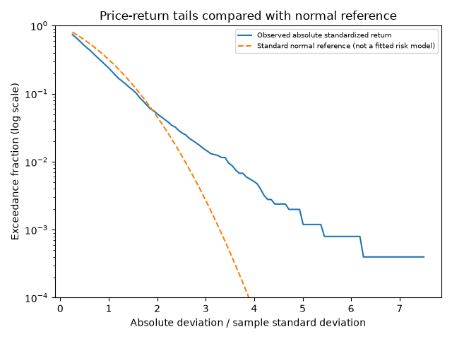

*標本平均からの絶対偏差を標本標準偏差で標準化し、超過割合を対数縦軸で表示。標準正規分布の曲線は比較基準であり、適合済みのリスクモデルではない。Notebookセル11のPNG出力から抽出。*

時系列依存に配慮して連続ブロックを再標本化する循環型ブロック・ブートストラップを実施しました。各2,000反復で、過去の日次平均について得られた条件付き95%区間は次の通りです。

| ブロック長 | 乱数seed | 日次平均の条件付き95%区間 |
|---|---|---|
| 5観測 | `20261007` | 0.0382%〜0.1633% |
| 20観測 | `20261022` | 0.0379%〜0.1602% |

**証拠・残る限界**: セル11（`execution_count=8`）の裾比較、6仕様感度、ブートストラップ表・図と根拠付き所見が対応します。区間は収録期間を再標本化できるという未検証の前提A6に依存します。期間非定常や未観測の危機を解消せず、予測区間でも将来の正の平均の証明でもありません。平均の期間依存性は残っています。

**反復終了判断**: 自律追加依頼は2回で終了しました。価格経路、年別変動、リターン定義、極端日の寄与、平均推定の前提を確認した一方、価格調整規則、営業日網羅性、再標本化の期間非定常は同じCSVへの検定追加では解消しないとNotebookに記録しています。3回目の依頼は生成していません。`followup.log` にある「不足がある場合だけ追加分析」という確認方針は、3回目の自律分析依頼や実行結果ではありません。

### 最終結論

**この収録系列では、長期の価格上昇と大きな途中下落、日次変動の時期差、正規分布基準より重い裾が併存しました。** 端点比+815.60%だけで経路を代表させず、最大下落−44.38%と年別・局所変動を併記することが重要です。平均リターンは期間・定義に敏感で、全期間の正の平均やブートストラップ区間を将来の収益保証に転用できません。

AIの追加依頼は、初回図で見えた時変リスクを部分期間比較へつなぎ、その結果で不安定だった平均を再標本化と極端日依存の確認へつなげました。Jupytermindは、定義の確度と分析前提を分け、感度分析と根拠付き所見を記録する点で有効でした。ただし、監査合格は価格データの外部検証や統計前提の成立を意味しません。価格系列の調整基準は未確定のままで、投資推奨・予測は行っていません。

### 監査・再現性

Notebook metadataの `replay` は、Jupyter MCPの `restart_notebook` 後、コードセルをソース順に `execute_cell` した記録です。全9コードセルの実行順は `[1, 2, 3, 4, 5, 6, 7, 8, 10]` で、最終監査セルの実行カウントは10です。9との不連続だけを未実行と解釈せず、保存済み全コードセルの実行状態を確認します。再取得CSVのSHA-256と初回集計の一致が記録されています。

実行中の監査セル21の出力では、完了済みコードセルは8件で、監査セル自身について「まだ実行を完了していないため未実行findingから除外」という警告1件があり、`ok=True` でした。保存後の最終監査metadataでは **9/9コードセル実行済み、未実行0、エラー0、findings 0、visual_findings 0、PNG 7枚、根拠付き所見5件** です。実行途中の監査と保存後の監査は区別しています。

`v020-exp-29` の最終ライフサイクルは `completed`、実行中セル・保留Notebook書込み・保持ロックはいずれも0です。`status.json` の `analysis_complete=true`、`final_completion.ready=true` と、Notebookの実行出力・最終監査・ライフサイクルが分析完了の根拠です。文書化状態の `documentation_complete`、トップレベルの `semantic_complete`、`report_exit_code` は分析の完了・失敗判定に使用していません。

外部ランナーの記録では、初回は終了コード0、805.6秒、通常終了でした。追加確認は終了コード0、95.4秒で、終了理由は `artifact_complete_cutoff` です。`followup.log` の末尾にはNotebookが安定し監査を通過したためプロセス群を停止した記録しかなく、新しい分析結果や追加の全セル再実行を確認できません。初回後・追加確認後のNotebookサイズとmtimeは同じであり、追加確認がNotebookを更新したとは記述しません。

独立した第二データセットがないためデータ間照合は実施していません。意味的検査は価格の正値や列間整合性を調べますが、極端なリターンを市場の誤りと決めつけません。予測、因果分析、機械学習は課題の記述目的とデータ範囲から対象外です。再取得ハッシュ一致はバイト単位の再現性であり、市場価格の正しさや独立検証の代わりにはなりません。

### 失敗内容とJupytermind改善候補

最終分析の失敗は記録されていませんが、途中で **実行中のNotebookへのメタデータ書込みと実行結果保存が両立せず、出力が失われた連携現象** が記録されています。Notebookセル19とmetadataの `integration_observation` によると、初回セル6はMCPが画像5枚と実行結果を返したにもかかわらず、保存ファイルでは `execution_count=None`、`outputs=[]` でした。セル9も計算後の変数 `annual` が存在する一方、保存出力は0件だったとされています。

記録された再現条件は「実行中の対象Notebookのセル内で `project_manager.enqueue_write` により同じNotebookのmetadataを変更する」です。期待する挙動は、メタデータ更新後もMCPの実行カウント・表・PNGが保存されることです。実際の影響は、実行済みでも監査で未実行扱いになり、図表と根拠が失われることでした。

回避策は、実行セル内から対象Notebookへ書かず、対象を非アクティブにして制御Notebookから更新した後、MCPで再接続・実行することです。最終metadataには、回避後のセル6が実行カウント6・出力6件、セル9が実行カウント7・出力6件、最終監査合格・visual findings 0件と記録されています。

**分類はJupytermind／MCP連携の同期改善候補で、帰属は未確定です。** Kaggle取得は成功しており、この現象をKaggle API障害とは扱いません。`followup.log` のランナーによる停止も別の事象です。Copilot CLI固有の不具合を示す証拠はありません。Notebookは書込みロックとMCP保存の同期境界を疑っていますが、今回の指定証拠には当時の生のMCP応答、制御Notebook、Notebookが参照する観測JSON本体は含まれず、原因を独立に再現・確定したわけではありません。改善候補JSONにはこの証拠の限界も記録します。

### 残る限界

収録終点は2020-02-28です。2020年3月以降の相場、現在のApple株価、将来の価格・投資収益については何も検証していません。株式分割・配当調整の方式、営業日網羅性、独立系列との一致は未確認で、収録値の端点比を調整済み総収益率とは呼べません。

年別比較には部分年が含まれ、期間変更に対して平均が不安定です。感度分析の20%許容幅は運用基準で、統計的均一性の保証ではありません。裾比較は正規性検定ではなく、ブートストラップは選んだブロックと収録期間の再標本化仮定に依存します。配当込み総収益、市場指数との比較、取引コスト、税、インフレは評価していません。監査合格と、これらの意味的・統計的限界の解消は分けて判断する必要があります。

## 実験30: 世界GDPの分布・集中度・地域差（分析完了）

**課題**: 「Kaggleの世界GDPデータに相当する公開データを使い、国ごとのGDP分布と地域差を調べてください。」

**初回プロンプトの生成方法**: 初回プロンプトは、データセット、分析上の問い、取得・記録・監査・反復に関する共通制約から、AIが自動生成したものです。人間がこの実験のプロンプト全文を個別に作成したものではありません。以下は `initial-prompt.md` の全文で、追加依頼の原文もNotebookの記録をそのまま掲載します。

**初回プロンプト（全文・原文）**:

```text
Kaggleの世界GDPデータに相当する公開データを使い、国ごとのGDP分布と地域差を調べてください。分布の偏りを確認して分析計画と伝わりやすい図表を自分で決め、集計年とGDPの解釈上の注意を日本語で説明してください。AI Data Scientist SkillとJupyter MCPで計画・コード・結果・根拠付きInsightを記録し、ノートブックの再実行を確かめてください。 Kaggle参照先: https://www.kaggle.com/datasets?search=world+gdp+by+country。インストール済みkaggle Python SDKを使い、NotebookのJupyter MCP実行セル内で`KaggleApi().authenticate()`、`dataset_list(search=...)`、`dataset_list_files(...)`、必要に応じて`dataset_download_file(...)`を呼び出し、Kaggle上の対応する公開データを検索・取得してください。owner/dataset slug、取得ファイル名、取得日、ファイルSHA-256をNotebookに記録してください。APIトークンをセル出力・Notebook・ログへ表示しないでください。分析・API取得コードの実行はJupyter MCPだけを使い、端末コマンド、subprocess、外部スクリプト起動、作業エージェントへの委譲は行わないでください。Kaggle APIで対応データを検索・取得できなかった場合に限り、`/home/nahisaho/kaggle/experiments/white-paper.md`に記載された旧実験の公開CSV `https://raw.githubusercontent.com/plotly/datasets/master/2014_world_gdp_with_codes.csv` を取得して実験を継続してください。その場合はKaggle APIの失敗内容、フォールバックした理由、CSV URL、取得日時、SHA-256をNotebookに記録し、公開CSVとKaggle掲載版の完全な同一性は保証されないことを明記してください。保存先は benchmark/projects/kaggle-v020-kaggle-exp-30-world-gdp/notebooks/kaggle-v020-kaggle-exp-30-world-gdp.ipynb としてください。run_idは `v020-exp-30` です。長時間処理の開始前にlifecycle.register_runを呼び、実行・書込みフェーズを記録し、終了時にcompletedまたはfailedを記録してください。データ定義manifest、分析前提manifest、意味的な異常検査、妥当な範囲の感度分析を使い、適用できない機能は理由を記録してください。図表はvisual_audit=Trueで監査してください。Notebookには「使用したJupytermindモジュール」節を設け、直接import・呼び出したモジュール名、関数名、使用目的を記録してください。間接利用は使用済みに含めないでください。Jupytermindの不具合または機能不足が疑われた場合は「Jupytermind改善候補」節を設け、分類、再現条件、期待する挙動、実際の挙動、影響、回避策、関係するセルとログを記録してください。Copilot CLI、Kaggle API、ベンチマークランナーに固有の問題とは切り分け、候補がなければ「なし」と記録してください。初回分析後、自分で結果を読み直し、結論に実質的な影響を与える未解決点があれば自然言語の追加依頼文を作成し、Notebookの「反復依頼履歴」に原文のまま記録して実行してください。価値ある追加分析がなくなるまで最大3回繰り返し、各反復の選定理由・結果・証拠・残る限界を報告してください。最後に全コードセルを上から再実行し、notebook_auditとライフサイクル状態を記録してください。
```

**初回指示・分析計画**: 分析手法や追加分析の内容は事前指定せず、分布の偏りに合う比較と図表の選択をAIに委ねています。AIは取得前に、出典確認、年・単位・価格基準の区別、欠損・重複・国コードの点検、線形・対数分布、平均と中央値、Lorenz曲線・Gini係数・上位シェア、地域別総額と中央値の比較を計画しました。巨大なGDPを機械的に外れ値として削除せず、収録対象内の記述統計として扱う方針です。

**使用したJupytermindモジュール**: Notebookで直接importされ、分析・保存・検査に使われた `ai_data_scientist` 配下のモジュールを示します。`project_manager` はコードでは `pm` という別名です。セルの実行はJupyter MCPで行われ、間接利用のモジュールは含めません。

| モジュール | 直接使用した関数・型 | 使用目的 |
|---|---|---|
| `project_manager` | `resolve_project`, `ensure_notebook`, `ensure_data_dir`, `enqueue_write` | 保存先の解決、Notebook・データディレクトリの準備、直列化した書込み |
| `language_router` | `detect_language` | 日本語の判定 |
| `lifecycle` | `register_run`, `is_cancel_requested`, `mark_execution_start`, `mark_execution_end`, `mark_write_start`, `mark_write_end`, `get_run_status`, `mark_completed`, `wait_for_quiescence` | 実行登録、実行・書込みフェーズの記録、完了と静止状態の確認 |
| `ingestion` | `SourceSpec`, `ingest` | 取得済みCSVの読込みと行数制限の確認 |
| `cleaning` | `clean_dataset` | 完全重複の除去と影響件数の記録 |
| `eda` | `explore` | 型・欠損・要約統計・カテゴリ頻度の確認 |
| `data_quality` | `detect_anomalies`, `validate_anomalies` | 意味制約の点検、参照データとの平均差検証 |
| `data_definition` | `FieldValue`, `build_manifest`, `DataDefinitionManifest.unresolved_fields` | 確認済み・推定・未確認の定義をmanifestで区別 |
| `analysis_assumptions` | `Assumption`, `AnalysisAssumptionManifest`, `check_manifest` | 分析範囲と前提の記録、結論に重要な未検証前提の検出 |
| `sensitivity` | `SensitivityPlan`, `run_sensitivity` | 大国除外、GDP下限、参照出典、異常候補処理の感度分析 |
| `dataset_validation` | `compare_datasets` | WDIとのキー対応・収録差・厳密一致率の確認 |
| `visualization` | `render_chart`, `build_image_output` | 日本語表記を含むPNGと画像出力bundleの生成 |
| `insight_engine` | `extract_cited_value`, `record_insight`, `EvidenceMissingError` | 実出力に基づくInsight記録、再実行後の証拠更新、stream出力の対応確認 |
| `notebook_audit` | `audit_notebook(visual_audit=True)` | 実行状態・エラー・証拠リンク・図表の監査 |

### データ取得と初回結果

**データ取得**: 最終主分析はKaggle APIで取得した `wsaqaf/2014_world_gdp_with_codes.csv` の `2014_world_gdp_with_codes.csv` です。Notebookの再実行時取得記録は **2026-10-01T21:29:22.205577+00:00**（日本時間10月2日）、SHA-256は `e85b1a32bc551b225844dcb12b531bb2d60d366d121327fb743031314db6d4e1` です。列は `COUNTRY`、`GDP (BILLIONS)`、`CODE`、対象は222国・地域です。完全重複の削除は0行、読込みの切詰めはありません。EDAと意味的検査では欠損・非有限値・ゼロGDPはなく、国コードの重複が検出されました。

取得過程では、Notebookの記録によると最初の `dataset_list(page_size=...)` がSDK非対応のため `TypeError` となり、指定公開CSVへ一度フォールバックしました。そのCSVの取得日時は **2026-10-01T21:10:18.810484+00:00**、URLは `https://raw.githubusercontent.com/plotly/datasets/master/2014_world_gdp_with_codes.csv`、SHA-256は `5b2311d1c6302c2b700fd1107fd0f4b550266b746fad16c22331d998c244f6ef` です。その後 `page=1` に修正してKaggle取得に成功したため、フォールバック版は最終主分析には使用していません。両者は取得バイト列のハッシュが異なり、完全同一とは扱えません。

**地域分類と前処理**: 原票ではBritish Virgin IslandsとVirgin Islandsがともに `VGB` でした。AIは原コードとGDP値を保持し、後者を米領Virgin Islandsの `VIR` と推定補正しました。Bahamasの `BHM` は `BHS` に補正し、公開ISOコード・国連M49地域対応表を1対1で結合しました。Kosovo（`KSV`）は欧州、Taiwan（`TWN`）とWest Bank（`WBG`）はアジアへ明示的に補完しています。補正後の意味的検査に指摘はなく、地域未対応は0件でした。補正は分析者による判断であり、原典による全件検証ではありません。

地域対応表のURLは `https://raw.githubusercontent.com/lukes/ISO-3166-Countries-with-Regional-Codes/master/all/all.csv`、取得日時は **2026-10-01T21:29:27.617982+00:00**、SHA-256は `347bba35029f804f53780062052499781d267b8a5d887bf3b051e80a68390d6d` です。区分はアフリカ・米州・アジア・欧州・オセアニアの5地域で、取得時点の区分が2014年版と一致する保証はありません。

**データ定義・分析前提**: 2014年はタイトルとファイル名で確認できるラベルで、各行の観測年は確認できません。`BILLIONS` という桁の定義は確認済みですが、米ドル、名目・市場為替換算という解釈は推定です。Kaggleの説明文は空で、ライセンス名 `world-bank` だけでは原典や指標定義を確定できません。manifestは原典の推計方法・網羅性・行ごとの年を未確認として記録し、分析前提の検査は共通の年・通貨・価格基準と地域区分について2件の警告を出しました。以下の金額は **配布値の10億単位（米ドル相当という解釈は推定）** です。

**初回結果**: 合計は78,285.45、平均352.637、中央値21.525、平均は中央値の **16.38倍**、歪度は **8.945** でした。上位1件は22.25%、上位5件は50.17%、上位10件は **64.63%** を占め、下位半数の111件は **0.92%** にとどまります。国・地域を等しく1観測とした総GDPのGini係数は **0.87513** で、強い右偏りと集中が確認されました。

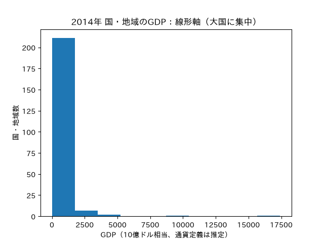

*線形尺度のGDP分布。少数の巨大経済が横軸の範囲を広げ、小規模経済の分布を読み取りにくくする。Notebookの保存PNGを抽出。*

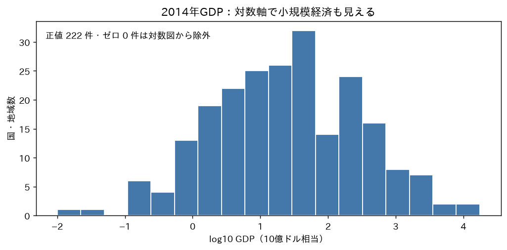

*対数尺度で示した222件の正のGDP。ゼロは0件で、小規模から巨大経済までの広がりを確認できる。図中のドル表記は推定された通貨定義。*

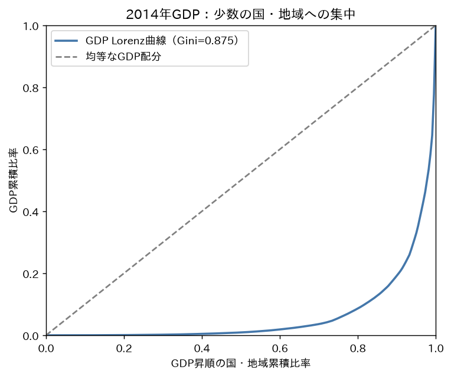

*GDP昇順の国・地域累積比率とGDP累積比率。均等線から大きく離れるが、個人の所得分配や生活水準の格差を表す曲線ではない。*

地域総額の首位はアジアですが、地域別中央値とは別の比較です。米州は総額で2位なのに中央値ではアフリカをわずかに下回りました。

| 地域 | 国・地域数 | GDP合計 | 収録GDP合計に占める割合 | GDP中央値 | 最大国・地域の域内シェア |
|---|---:|---:|---:|---:|---|
| アジア | 51 | 26,635.55 | 34.02% | 71.570 | 中国 38.90% |
| 米州 | 48 | 25,447.92 | 32.51% | 12.885 | 米国 68.45% |
| 欧州 | 49 | 21,990.59 | 28.09% | 63.930 | ドイツ 17.37% |
| アフリカ | 54 | 2,477.43 | 3.16% | 13.245 | ナイジェリア 23.99% |
| オセアニア | 20 | 1,733.96 | 2.21% | 0.825 | オーストラリア 85.53% |

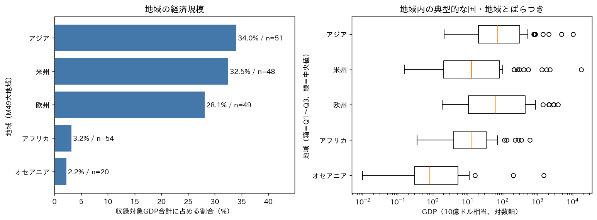

*左は収録対象GDPの地域別合計シェア、右は対数軸の箱ひげ図。地域の経済規模と典型的な国・地域の規模を分けて比較する。公式の世界GDPシェアではない。*

### AIが自律生成した追加依頼

3回の追加依頼はいずれもAIが直前の結果を読み、未解決点を選んで原文と理由をNotebookに記録したものです。`initial.log` にはこの反復を実施した報告があり、別の追加確認セッションの `followup.log` には新たな依頼文・計算結果はありません。以下の反復と、ランナーによる追加確認セッションを混同しません。

**追加依頼1（原文）**:

> 初回の集中度と地域差が少数の大国だけで決まっていないか確認してください。上位1件・5件を除いた分布と各地域の最大国を除いた集計を示し、ロシアをアジア側へ置く代替区分および地域補完行の除外で地域順位が変わるか感度分析してください。

**選定理由**: 上位10件への集中と米州・オセアニアの最大国シェアが大きく、大国の所在や地域割付による差を地域固有の性質と混同しないためです。

**結果**: 上位1件を除いたGini係数は0.84901、上位5件を除いても **0.80454** でした。基準比最大変動は **8.07%** で、AIが設定した15%という安定性の目安以内です。一方、各地域の最大国を1件ずつ除くと、地域合計は欧州18,170.59、アジア16,275.55、米州8,027.92となり、上位順位は **欧州・アジア・米州** へ変わりました。ロシアの代替区分と補完行除外を組み合わせた4ケースでは、元の地域合計・中央値順位は変わりませんでした。

**証拠・残る限界**: コードセル `#07` の `TAIL_SENSITIVITY`、`REGION_WITHOUT_LARGEST`、`ITER1_SUMMARY`。除外は仮想的なストレステストで、原票の訂正や因果効果の識別ではありません。15%は統計的な信頼区間ではなく分析上の判断基準で、小規模経済の収録数が中央値へ与える影響は未解決として残しました。

**追加依頼2（原文）**:

> 地域別中央値では米州がアフリカより少し低くなっています。この比較が小さな国・地域の収録数に依存していないか、GDPの下限を0・1・5・10（10億ドル相当）として再集計し、地域の合計順位と中央値順位の安定性を別々に確認してください。小規模経済の除外を主権国家限定や生活水準の比較と解釈しないでください。

**選定理由**: 米州とアフリカは中央値が近い一方、合計には大差があり、微小経済の混在で中央値順位が逆転する可能性があります。地域割付の検査だけではこの疑問を解消できません。

**結果**: 下限1では22件を除いてもGDP合計の **99.987%** を保持しましたが、米州とアフリカの中央値順位が逆転しました。下限5では欧州とアジアの中央値順位も逆転しました。下限0・1・5・10のGini係数は順に0.87513、0.86166、0.83284、0.81287で、基準比最大変動は **7.11%**、15%の目安以内です。地域合計の順位は全ケースで維持されました。したがって「地域総額の順位はこの閾値範囲では安定」と「地域中央値の順位は安定しない」を分けて結論にしました。

**証拠・残る限界**: コードセル `#08` の `CUTOFF_SENSITIVITY`、`ITER2_SUMMARY`。GDP下限は収録構成への感度を測る操作で、主権国家だけを選ぶ基準でも、一人当たりの豊かさを比較する操作でもありません。金額の原典、改訂、年の整合性は残る課題です。

**追加依頼3（原文）**:

> GDPの通貨・価格基準と各行の年が未確認なので、世界銀行WDIの2014年GDP（current US$、ND.GDP.MKTP.CD）を別途取得し、同じ国コードで照合してください。集計地域を除外し、コード補正・対象範囲の不一致・非収録国を明示してください。差の大きい国と10・20・30%の許容差での一致率を示し、同一収録国に限定したGiniと地域シェアの結論が維持されるか確認してください。原データを世界銀行値で勝手に置き換えず、原典の独立性や改訂の違いを限界として記録してください。

**選定理由**: 同じCSV内の感度分析では、単位や原票値の誤りを検出できません。公式の別取得データで定義と値を点検することが、結論の確実性に実質的な意味を持つと判断しました。

**実行時の修正**: 原文の `ND.GDP.MKTP.CD` はAIの誤記です。NotebookにはHTTP 200でもAPI本文に `Invalid value` が返ったと記録され、実行コードは公式定義を確認した **`NY.GDP.MKTP.CD`** に修正されています。原文は修正せず掲載しました。これはJupytermindやKaggle APIの障害ではありません。

**結果**: 集計地域を除いたWDIと210キーが対応しました。Kaggle側だけの12件とWDI側だけの3件を明示し、`KSV→XKX`、`WBG→PSE` と対応させたうえで、West BankとPalestine全体の範囲差がある1件を比較から除きました。最終209件は主分析GDPの **99.26%** を占めます。相対差の分母をWDI値とした10・20・30%許容差の一致率は、順に **56.94%、77.51%、89.00%** でした。10%超の差は90件あり、単純な厳密等号比較では210件すべてが不一致でした。

同じ209件のGini係数はKaggle **0.87062**、WDI **0.87080**、基準比変動は **0.0211%** でした。上位10件シェアも65.12%と65.16%で近く、地域合計順位はアジア・米州・欧州・アフリカ・オセアニアで一致しました。集計レベルの集中は維持されますが、各国の金額が確認済みの公式値になったわけではありません。

**反復3内の異常候補検証**: Sint Maartenの原票304.10に対しWDIは約1.36181で、比率は **223.31倍** でした。AIは単位混在や入力誤りの候補としつつ、一次資料なしに誤りを確定しませんでした。同じ反復の範囲内で当該行の除外とWDI値への仮置換を試し、Gini係数はそれぞれ0.87639、0.87692、基準比最大変動 **0.204%** で5%の目安以内、地域合計・中央値順位も維持されました。原票GDPは変更せず、4回目の依頼は生成していません。

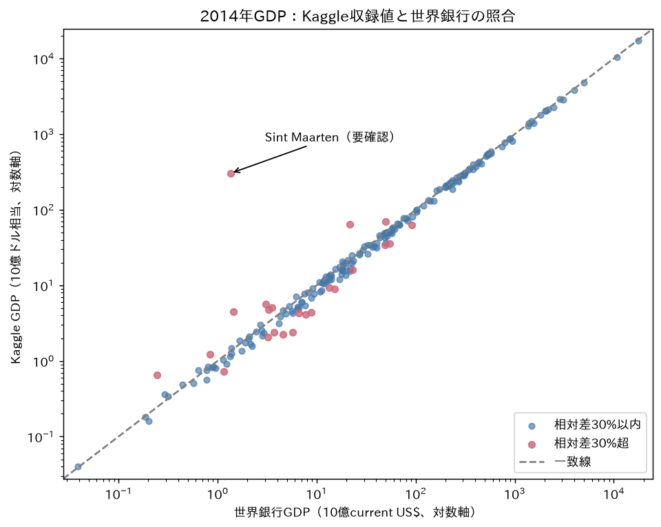

*同じ対象範囲の209件について、両軸を対数にしたGDP照合。相対差30%超の点とSint Maartenを明示し、集計の頑健性と国別金額の信頼性が別問題であることを示す。*

**証拠・残る限界**: コードセル `#09` の `DATASET_COMPARISON`、許容差別一致率、`ITER3_SUMMARY` と、`#10` の `ANOMALY_GINI_SENSITIVITY`、`POST_SUMMARY`。WDIは取得時点の改訂値で、Kaggle原典と独立とは保証できません。元CSV全行の観測年・価格基準を確定する検証でもありません。

### 最終結論

**2014年ラベルの222国・地域のGDPは少数の巨大経済へ強く集中し、平均だけでは典型的な国・地域を説明できません。** 集中という結論は、大国除外、小規模経済のGDP下限、同一対象のWDI照合、Sint Maartenの異常候補処理でも維持されました。一方、地域合計順位は各地域の最大国除外で変わり、中央値順位は微小経済の収録数に敏感です。地域差は、巨大経済の所在、収録対象構成、総額と中央値の違いを分けて読む必要があります。

AIは3回の反復で、大国依存、対象構成、地域分類、外部照合、異常候補という異なる不確実性を検証しました。残る原典・通貨・価格基準・行ごとの年は同じCSVを再集計しても解消できず、一次資料が必要として反復を終えています。**分析完了は、`status.json` の `analysis_complete=true`、`final_completion.ready=true` と、Notebookに保存された分析・反復・再実行・最終監査の内容から判断しました。** これはデータ定義と国別値の完全な検証を意味しません。

### 監査・再現性

Notebookは `benchmark/projects/kaggle-v020-kaggle-exp-30-world-gdp/notebooks/kaggle-v020-kaggle-exp-30-world-gdp.ipynb`、run_idは `v020-exp-30` です。Notebook本文と `metadata.verification` には、カーネル再起動後に全12コードセルを先頭から実行し、保存同期の問題を解消して末尾2セルを順に再実行したことが記録されています。最終実行番号は **`[1, 2, 3, 4, 5, 6, 7, 8, 9, 10, 16, 17]`** で、欠番を隠して単純な1〜12の一括実行とは表現しません。保存ソースとカーネル入力履歴の一致確認もmetadataに記録されています。

再実行比較では、GDP・地域対応表のSHA-256、主要指標、地域合計、同一対象WDIのGini係数の5チェックがすべて一致しました。ただし、これはNotebookに記録された比較結果であり、本節作成時に外部APIへ再取得して独立再実行した結果ではありません。

| 最終監査項目 | 保存された結果 |
|---|---|
| `audit_notebook(visual_audit=True)` | `ok=true`、nbformat正常 |
| コードセル | 12/12実行済み、未実行0、エラー0 |
| 図表 | 図表セル2件（0始まりの7・15）、埋込みPNG5枚 |
| 根拠付きInsight | 8件 |
| 監査指摘 | `findings=[]`、`visual_findings=[]` |
| lifecycle | `completed`、実行中・書込み待ち・lockはいずれも0 |
| 保存後確認日時 | 2026-10-01T21:32:21.281526+00:00 |

図表生成セルでは日本語グリフ警告0件、最初の4枚の非白色画素比率がいずれも1%超と記録されています。構造・図表監査の合格は、GDPの定義や異常候補の意味的解決を保証しません。

WDI GDP応答のURLは `https://api.worldbank.org/v2/country/all/indicator/NY.GDP.MKTP.CD?date=2014&format=json&per_page=20000`、取得日時は **2026-10-01T21:29:56.831582+00:00**、SHA-256は `103c1fe05ff85556bc8bcc60d6de4465416e3ce19b1994a63baeaf0a7eece4c8` です。国一覧と指標定義の取得日時・SHAもNotebookに保存されています。これら外部URLはNotebook内の取得記録として記載し、本節の新たな証拠源にはしていません。

`initial.log` は分析保存・3回反復・再実行・完了の報告を含み、`status.json` の初回終了コードは0、終了形態は `exited` です。追加確認は95.2秒で `artifact_complete_cutoff`、終了コード0と記録され、`followup.log` はNotebookが安定して監査を通過したためランナーが停止したことを示します。追加確認セッションが自然終了して新しい分析を完了したとは言えません。初回・最終の安定性記録はいずれも570,336バイト、同じ更新時刻で、最終監査にも未実行・エラー・指摘はありません。

### 途中の失敗とJupytermind改善候補

**回復した失敗**: Notebookには、Kaggle SDKの `page_size` 非対応、存在しない `dataset_view` の呼出し、WDI指標コードの誤記、分析コードのNumPy boolのJSON直列化失敗が記録されています。前2件は `page=1` と `dataset_metadata`、WDIは `NY.GDP.MKTP.CD`、boolはPython boolへの変換で解消しました。これらは呼出し側・SDK互換性・分析コードの問題で、Jupytermindの欠陥とは判定しません。原票の国コード問題とSint Maartenの乖離もデータ品質・定義側に分けます。

**Jupytermindの改善候補**: Notebookの直接利用と実出力から、次の4件を記録しました。仕様拡張候補を含み、すべてが確定バグであるという判定ではありません。

| 分類・対象 | 実際の挙動と影響 | 実験内の回避策・証拠 |
|---|---|---|
| 根拠出力対応不足：`insight_engine.record_insight` | SHAが実行済み `stream.text` に存在しても `EvidenceMissingError`。通常の `print` 出力を証拠にできない | `text/plain` のdisplay出力を使用。`#10` の明示的失敗と `FEATURE_CHECKS` |
| 不確実性列挙の拡張：`DataDefinitionManifest.unresolved_fields` | `unknown` は返るが、別途列挙した `inferred` 5項目は返らない。戻り値だけで注意書きを作ると推定を見落とし得る | 推定を別途走査して記載。`#04` のmanifestと `#10` の `FEATURE_CHECKS` |
| 異常検証の粒度拡張：`data_quality.validate_anomalies` | 209件の参照平均差では指摘0でも、行単位では90件が10%超乖離、Sint Maartenは223.31倍 | 1対1結合して相対・絶対差を確認。`#09` の平均照合・乖離一覧 |
| 数値一致基準の拡張：`dataset_validation.compare_datasets` | 厳密等号では210件すべて不一致。丸め・改訂差を含む連続値の品質をその率だけでは判定できない | 10・20・30%許容差を別計算。`#09` の比較出力と一致率 |

**原因未確定の統合候補**: 実行中のNotebookを `enqueue_write` で更新した際、MCPには出力が返っても当該セルの `execution_count`・`outputs` がディスクへ保存されない挙動がNotebookに記録されています。実行番号を読み取って保存する試行でも次番号とのずれがあり、最終的に `capture_output` と実際のカーネル入力履歴による番号照合、末尾2セル再実行で回復しました。Jupytermindの書込みとJupyter MCPの文書同期の境界にあるため、Jupytermind単独、Copilot CLI、外部ランナーのいずれかへ原因を断定しません。証拠はコードセル `#11`、Notebookの改善候補・最終再実行記録、`metadata.verification`、`initial.log` の保存問題への言及です。GDP集計の再実行比較は一致したままです。

改善候補の分類、再現手順、期待・実際の挙動、影響、証拠、受け入れ条件は、同じ実験ディレクトリの `issue-candidate.json` に保存しました。新しいGitHub Issueの登録や本体の修正は行っていません。利用可能なログから、Copilot CLIやベンチマークランナー固有の分析障害を確定する証拠はありません。

### 残る限界

総GDPは人口規模を含む経済規模であり、一人当たり所得、住民の生活水準、分配、幸福度ではありません。Gini係数も国・地域の総GDPの集中指標で、人口加重の所得格差ではありません。人口・物価・為替の調整、主権国家限定、時系列変化、2026年の経済規模は分析していません。

2014年はデータのラベルにすぎず、全行の年・通貨・価格基準が同じという重要前提は未確認です。WDIとの集計の近さでその前提を確定することはできず、原典不明のため独立検証とも断言できません。地域区分は取得時点の対応表と分析者補完を含み、国・地域の収録範囲も完全とは保証されません。Sint Maartenの値は未解決の異常候補として残ります。

相関・回帰・機械学習は、GDP以外の適切な説明変数がないため追加していません。大国をz-scoreだけで削除する処理も、真の経済規模と誤入力を区別できないため不適用としました。因果的な地域優劣や国別金額の確定ではなく、**収録対象内の強い集中と、地域差の読み方の条件を示した実験**です。

## 実験31: House Prices（Jupyter MCP接続障害により分析未実施）

**課題**: 「KaggleのHouse Pricesデータを使い、住宅価格の違いを説明する主要な特徴と、単純な線形関係では捉えにくい要因を調べてください。」

**初回プロンプトの生成方法**: 以下の初回プロンプトは、データセットと問い、およびデータ取得・実行環境・記録・反復に関する共通制約から、AIが自動生成したものです。人間が本実験用に全文を個別作成した指示ではありません。実際に保存された `initial-prompt.md` の全文を示します。

**初回プロンプト（全文・原文）**:

> KaggleのHouse Pricesデータを使い、住宅価格の違いを説明する主要な特徴と、単純な線形関係では捉えにくい要因を調べてください。欠損、歪んだ価格分布、カテゴリ変数を確認し、適切な図表と検証を自分で選び、予測性能と説明の違いを日本語で示してください。 Kaggle参照先: https://www.kaggle.com/competitions/house-prices-advanced-regression-techniques。インストール済みkaggle Python SDKを使い、NotebookのJupyter MCP実行セル内で`KaggleApi().authenticate()`、`dataset_list(search=...)`、`dataset_list_files(...)`、必要に応じて`dataset_download_file(...)`を呼び出し、Kaggle上の対応する公開データを検索・取得してください。owner/dataset slug、取得ファイル名、取得日、ファイルSHA-256をNotebookに記録してください。APIトークンをセル出力・Notebook・ログへ表示しないでください。分析・API取得コードの実行はJupyter MCPだけを使い、端末コマンド、subprocess、外部スクリプト起動、作業エージェントへの委譲は行わないでください。Kaggle APIで対応データを取得できない場合は、`/home/nahisaho/kaggle/experiments/white-paper.md`を確認してください。同じデータセットの公開CSVが同稿に明記されている場合だけ、そのURLへフォールバックしてください。対応するCSVを確認できない場合は、別データを推測で選ばず、取得失敗として記録してください。保存先は benchmark/projects/kaggle-v020-kaggle-exp-31-house-prices/notebooks/kaggle-v020-kaggle-exp-31-house-prices.ipynb としてください。run_idは `v020-exp-31` です。長時間処理の開始前にlifecycle.register_runを呼び、実行・書込みフェーズを記録し、終了時にcompletedまたはfailedを記録してください。データ定義manifest、分析前提manifest、意味的な異常検査、妥当な範囲の感度分析を使い、適用できない機能は理由を記録してください。図表はvisual_audit=Trueで監査してください。Notebookには「使用したJupytermindモジュール」節を設け、直接import・呼び出したモジュール名、関数名、使用目的を記録してください。間接利用は使用済みに含めないでください。Jupytermindの不具合または機能不足が疑われた場合は「Jupytermind改善候補」節を設け、分類、再現条件、期待する挙動、実際の挙動、影響、回避策、関係するセルとログを記録してください。Copilot CLI、Kaggle API、ベンチマークランナーに固有の問題とは切り分け、候補がなければ「なし」と記録してください。初回分析後、自分で結果を読み直し、結論に実質的な影響を与える未解決点があれば自然言語の追加依頼文を作成し、Notebookの「反復依頼履歴」に原文のまま記録して実行してください。価値ある追加分析がなくなるまで最大3回繰り返し、各反復の選定理由・結果・証拠・残る限界を報告してください。最後に全コードセルを上から再実行し、notebook_auditとライフサイクル状態を記録してください。

**使用したJupytermindモジュール**: Notebookで直接import・呼び出したモジュール、関数、使用目的の記録は確認できません。指定Notebookが存在せず、初回ログもJupytermindの分析機能を呼び出す前に停止したと報告しています。初回指示にある `lifecycle.register_run` は実行されておらず、`notebook_audit` も未実施です。指示文に登場する機能や予定されていた処理を、使用済みモジュールとして数えません。

**初回指示**: 住宅価格と特徴の関係を調べるだけでなく、欠損、価格分布の歪み、カテゴリ変数、単純な線形関係では捉えにくい要因を検討し、予測性能と説明を区別するよう求めました。具体的なモデルや検証方法はAIが選ぶ設計です。取得はKaggle SDKとJupyter MCPを使用し、出典・ファイル・取得日・SHA-256を記録する条件でした。外部CSVへの切り替えは、Kaggle APIで取得できず、指定文書に同じデータセットの公開CSVが明記されている場合だけ許可されています。さらに、ライフサイクル記録、manifest、意味的な異常検査、感度分析、図表監査、最大3回の自律的な追加依頼、全セル再実行と監査を要求しています。

**データ取得**: 未実施です。初回ログによれば、Jupyter MCPでのファイル一覧取得と指定Notebookの作成が、どちらも初期接続時のエラーで失敗しました。Kaggle認証・検索・ファイル取得には到達していません。取得したowner/dataset slug、ファイル名、取得日、SHA-256、行数・列数は確認できず、競技URLを実際の取得元として扱いません。外部CSVへのフォールバックも実施されていません。これはKaggle APIが取得を拒否した事例ではなく、取得処理の前段で停止した事例です。

**初回結果**: AIは、公開データと定義の確認、価格分布・欠損・カテゴリの探索、線形モデルと非線形モデルの比較、解釈の安定性の追加検証、全セル再実行と監査を行う方針をログに示しました。しかし、これは着手前の計画であり、実測結果ではありません。続いて、次の接続エラーを報告しています。

```text
JSON-RPC error: -32022
サーバー対応プロトコル: 2026-07-28
クライアント要求:       2025-11-25
initialize handshake is not accepted
```

初回ログには、端末・subprocess・外部スクリプト・作業エージェントによる代替実行は行わず、Kaggle認証・取得、Notebook保存、ライフサイクル登録、分析・反復・全セル再実行・監査はいずれも未実施と明記されています。価格の分布、欠損率、重要な特徴、相関、モデルの予測性能など、分析上の数値は得られていません。

**AIが生成した追加依頼 — 原文・選定理由・結果**: 追加依頼文は確認できません。初回分析が開始できず、読み直して検証対象を選ぶための分析結果もありません。Notebookの「反復依頼履歴」と `followup.log` は存在せず、`status.json` の `followup_exit_code`、`followup_seconds`、`followup_termination` はいずれも `null` です。したがって、追加依頼の原文、選定理由、実行結果、証拠は記載できません。「価値ある追加分析がない」と判断して終了した記録ではなく、接続障害で反復の前提となる初回結果が得られなかった状態です。

**図表**: 指定Notebookが存在しないため、Notebook内のPNG図表は抽出できません。実測結果を伴わない代替図や、他実験の図は作成・転用していません。本実験用の `exp-31-` で始まる図表ファイルと画像参照はありません。

**最終結論**: **分析未実施であり、住宅価格の違いを説明する特徴や非線形要因について結論は出せません。** 根拠は `analysis_complete=false`、`final_completion.ready=false`、指定Notebookの不在、および初回ログの未実施報告です。これは「説明できる特徴がない」「非線形モデルに改善がない」という分析結果ではありません。Jupytermind v0.2.0の分析機能の有効性も、本実験からは評価できません。

**監査・再現性**: 今回確認した実験証拠は、実験ディレクトリの `initial-prompt.md`、`initial.log`、`status.json` と、指定Notebook・追加確認ログの不在です。書式の参考文書は実験結果の根拠に使用していません。主要な状態記録は次のとおりです。

| 項目 | 記録と解釈 |
|---|---|
| 実行識別子 | `run_id=v020-exp-31` |
| 初回プロセス | `initial_exit_code=0`、`initial_seconds=40.0`、`initial_termination=exited`。プロセスの正常終了であって、分析成功ではありません。 |
| Notebookの安定性確認 | `initial_stability` と `final_stability` はともに `exists=false`、`stable=false`。保存済み成果物の安定性は確認できていません。 |
| Notebookの存在確認 | `initial_audit` と `final_audit` はともに `exists=false`、`error=notebook_missing`。指定パスの実ファイルも存在しません。 |
| 分析完了 | `analysis_complete=false`、`final_completion.ready=false`。同オブジェクトの構造監査、実行セル数、図表、根拠付きInsight、反復履歴、モジュール使用記録、改善候補記録、Notebook監査呼び出しの要件はすべて `false`。 |
| 追加確認 | `followup.log` は存在せず、フォローアップの終了コード・所要秒数・終了理由は `null`。追加確認の成功記録はありません。 |
| 再実行・図表監査 | 全コードセルの再実行、`notebook_audit`、`visual_audit=True` の実施結果はありません。 |

`status.json` の `completed_at` は `2026-10-02T00:16:59.262651+00:00` ですが、これは状態記録の時刻であり、分析やNotebook保存の完了を示しません。データのハッシュやコード・出力がないため、分析結果の再現性は検証できません。初回ログ末尾には、Copilot CLIの終了後に外部ランナーが子孫ランタイムを清掃する旨の記録がありますが、この記録だけで停止原因をランナーに帰属させることはできません。

**失敗内容とJupytermind改善候補の切り分け**: 直接確認できる障害は、Jupyter MCPクライアントとサーバーのプロトコル不一致による初期ハンドシェイク拒否です。Copilot CLI側から利用するMCP接続経路の互換性問題として区別し、どの構成要素を変更すべきかまでは断定しません。Kaggle APIは未呼び出しであり、API認証・権限・公開データの問題を示す証拠はありません。外部ランナーは終了コード0を記録していますが、同時にNotebook不在と分析未完了も記録しているため、成功へ誤分類したとは断定しません。Jupytermindの関数を実行して不具合や機能不足を再現した証拠はなく、**本実験の証拠から登録できるJupytermind改善候補はありません**。`issue-candidate.json` にはJSONの `null` を保存します。これはJupytermindに不具合がないと証明したものではありません。

**残る限界**: 指定先のNotebookと追加確認ログがないため、分析コード、データ定義・分析前提manifest、意味的な異常検査、感度分析、図表、根拠付きInsight、ライフサイクル状態を確認できません。欠損やカテゴリの扱い、価格分布の歪み、線形・非線形モデルの差、説明と予測の妥当性はすべて未検証です。初回ログの障害報告を超えて、接続構成の詳細や別の保存先に成果物があるかも本節では確認していません。再試行にはMCPの対応プロトコルを一致させる必要がありますが、修復・再実験は今回の記録整理では実施していません。

## 実験32: Breast Cancer Wisconsin（分析完了）

**課題**: 「KaggleのBreast Cancer Wisconsinデータを使い、良性・悪性を区別する特徴を調べてください。クラス比率、特徴間の強い相関、医療データとしての誤分類リスクを確認し、説明可能な比較と図表を日本語で報告してください。診断支援と臨床診断を混同しないでください。」

**初回プロンプト（全文・原文）**: 以下は、データセットと問い、および共通制約からAIが自動生成した初回プロンプトです。人間がこの実験の全文を個別に作成したものではありません。`initial-prompt.md`に保存された文面を掲載します。

> KaggleのBreast Cancer Wisconsinデータを使い、良性・悪性を区別する特徴を調べてください。クラス比率、特徴間の強い相関、医療データとしての誤分類リスクを確認し、説明可能な比較と図表を日本語で報告してください。診断支援と臨床診断を混同しないでください。 Kaggle参照先: https://www.kaggle.com/datasets/uciml/breast-cancer-wisconsin-data。インストール済みkaggle Python SDKを使い、NotebookのJupyter MCP実行セル内で`KaggleApi().authenticate()`、`dataset_list(search=...)`、`dataset_list_files(...)`、必要に応じて`dataset_download_file(...)`を呼び出し、Kaggle上の対応する公開データを検索・取得してください。owner/dataset slug、取得ファイル名、取得日、ファイルSHA-256をNotebookに記録してください。APIトークンをセル出力・Notebook・ログへ表示しないでください。分析・API取得コードの実行はJupyter MCPだけを使い、端末コマンド、subprocess、外部スクリプト起動、作業エージェントへの委譲は行わないでください。Kaggle APIで対応データを取得できない場合は、`/home/nahisaho/kaggle/experiments/white-paper.md`を確認してください。同じデータセットの公開CSVが同稿に明記されている場合だけ、そのURLへフォールバックしてください。対応するCSVを確認できない場合は、別データを推測で選ばず、取得失敗として記録してください。保存先は benchmark/projects/kaggle-v020-kaggle-exp-32-breast-cancer/notebooks/kaggle-v020-kaggle-exp-32-breast-cancer.ipynb としてください。run_idは `v020-exp-32` です。長時間処理の開始前にlifecycle.register_runを呼び、実行・書込みフェーズを記録し、終了時にcompletedまたはfailedを記録してください。データ定義manifest、分析前提manifest、意味的な異常検査、妥当な範囲の感度分析を使い、適用できない機能は理由を記録してください。図表はvisual_audit=Trueで監査してください。Notebookには「使用したJupytermindモジュール」節を設け、直接import・呼び出したモジュール名、関数名、使用目的を記録してください。間接利用は使用済みに含めないでください。Jupytermindの不具合または機能不足が疑われた場合は「Jupytermind改善候補」節を設け、分類、再現条件、期待する挙動、実際の挙動、影響、回避策、関係するセルとログを記録してください。Copilot CLI、Kaggle API、ベンチマークランナーに固有の問題とは切り分け、候補がなければ「なし」と記録してください。初回分析後、自分で結果を読み直し、結論に実質的な影響を与える未解決点があれば自然言語の追加依頼文を作成し、Notebookの「反復依頼履歴」に原文のまま記録して実行してください。価値ある追加分析がなくなるまで最大3回繰り返し、各反復の選定理由・結果・証拠・残る限界を報告してください。最後に全コードセルを上から再実行し、notebook_auditとライフサイクル状態を記録してください。

**使用したJupytermindモジュール**: 次の表は、保存されたNotebookのコードセルで直接import・呼び出しを確認できるAPIだけを対象にします。モジュールの接頭辞はすべて`ai_data_scientist.`です。型の生成とメソッド呼び出しも併記します。

| モジュール | 直接呼び出した関数・型・メソッド | 使用目的 |
| --- | --- | --- |
| `project_manager` | `resolve_project`、`ensure_notebook`、`ensure_data_dir` | 指定プロジェクト・Notebook・データ保存先の準備 |
| `language_router` | `detect_language` | 日本語の分析指示であることの確認 |
| `lifecycle` | `register_run`、`mark_write_start`、`mark_write_end`、`mark_execution_start`、`mark_execution_end`、`is_cancel_requested`、`get_run_status`、`mark_completed` | 実行登録、書込み・実行フェーズ、キャンセル要求、完了状態の管理 |
| `ingestion` | `SourceSpec`、`ingest` | 取得CSVの読込みと行数上限による切詰めの確認 |
| `cleaning` | `clean_dataset` | 完全重複の除去と削除件数の記録 |
| `eda` | `explore` | 要約統計・欠損状況の確認 |
| `data_definition` | `FieldValue`、`build_manifest`、`DataDefinitionManifest.unresolved_fields` | 出典、特徴定義、不明な単位の記録と未解決定義の検査 |
| `analysis_assumptions` | `Assumption`、`AnalysisAssumptionManifest`、`check_manifest` | 患者独立性、施設への移送、臨床損失などの前提と未解決リスクの記録 |
| `data_quality` | `detect_anomalies` | 診断カテゴリ、非負値、非欠損、ID一意性の制約検査 |
| `stats_analysis` | `correlation` | 平均半径と平均周長のPearson相関と日本語解釈 |
| `sensitivity` | `SensitivityPlan`、`run_sensitivity` | 分割・正則化・特徴群を変えた12仕様の感度安定性の検査 |
| `visualization` | `render_chart`、`build_image_output` | 日本語クラス図の描画とPNGのNotebook出力 |
| `insight_engine` | `extract_cited_value` | 実行済み出力から報告の引用値を抽出 |
| `notebook_audit` | `audit_visual_outputs`、`audit_notebook` | 図表メタデータ欠落の検証と`visual_audit=True`の最終監査 |

`lifecycle.mark_failed`は例外時の分岐に記述されていますが、最終保存出力に失敗状態の記録はありません。Notebookの利用記録には`project_manager.enqueue_write`と`insight_engine.record_insight`もcontroller側で使用したとありますが、対象Notebookのコードセルには直接呼び出しがないため、この表では使用済みに計上しません。ロジスティック回帰、交差検証、決定木はscikit-learn、順位検定はSciPy、複合図はMatplotlibで実装されており、Jupytermind固有の機械学習機能とは扱いません。

**初回指示**: 良性・悪性のクラス構成、特徴差、強相関と冗長性、見逃し・過剰判定を説明可能な比較で確認するよう求めています。取得来歴、定義・前提manifest、意味的異常検査、感度分析、図表監査、実行ライフサイクル、再実行も共通制約に含まれます。具体的なモデル、使用特徴、閾値や追加依頼の内容は初回プロンプトで指定されておらず、AIが分析結果を踏まえて選びました。

**データ取得**: NotebookはKaggle Python SDKで認証し、`breast cancer wisconsin`を検索、`uciml/breast-cancer-wisconsin-data`のファイル一覧を確認して`data.csv`を取得しました。取得経路は`Kaggle Python SDK`で、公開CSVへのフォールバックは使っていません。

| 項目 | Notebookに保存された値 |
| --- | --- |
| owner/dataset slug | `uciml/breast-cancer-wisconsin-data` |
| ファイル名・サイズ | `data.csv`、125,204 bytes |
| 取得日時（UTC） | `2026-10-01T21:32:02.668579+00:00` |
| CSV SHA-256 | `1425d9affa78ba8e53afc81d0ef8a19069ee10c4b21fe89b3cf514071b12ee33` |
| 取得時の形状 | 569行・33列 |

特徴定義は、Notebook内でUCI配布ZIPから読み出した`wdbc.names`と照合しています。これは定義資料の取得であり、分析CSVの代替取得ではありません。辞書のSHA-256は`840e04e3f20f8a5b326892f3b9cbc01c4cd6f7e6c597630b701ef6c0ac79f5ef`です。本節では外部サイトを新たに調査せず、Notebookに保存された辞書本文と出力を根拠にしています。

細針吸引（FNA）画像の細胞核について、半径、texture、周長、面積、smoothness、compactness、concavity、concave points、symmetry、fractal dimensionの10特徴を、`mean`・`se`・`worst`の3通りで集約した30特徴です。`worst`は画像内の最大3値の平均であり、患者の最悪の予後を意味しません。物理単位や装置校正尺度は不明として記録し、mmやmm²とは断定していません。

全欠損の`Unnamed: 32`を除き、IDを予測・相関から除外しました。完全重複の削除は0行、30特徴の完全重複も0行です。使用列に欠損はなく、非有限値と設定した意味的制約の違反は0件でした。追加の品質確認では、対象サイズ特徴の非正値、各特徴の`worst < mean`も0件でした。ただし、これらは設定した制約への適合であり、測定値の医学的正しさや患者独立性の証明ではありません。認証処理の標準出力・標準エラーを抑制しており、指定証拠ファイルにAPIトークンそのものの表示は確認していません。

**初回結果**: 良性Bは357件（62.74%）、悪性Mは212件（37.26%）でした。この比率は公開診断標本の構成であり、一般集団の有病率ではありません。常に良性と答えるだけでも正解率は62.74%ですが、悪性212件をすべて見逃します。

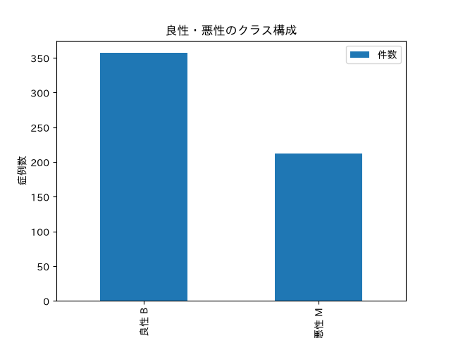

*公開標本569件の診断ラベル別件数。良性357件、悪性212件という構成を示し、一般集団の有病率を推定する図ではありません。*

特徴比較では、悪性群で核サイズと輪郭の凹みを表す値が大きくなりました。Hedges gは悪性−良性の平均差をpooled標準偏差で標準化した効果量です。上位6特徴は次のとおりでした。

| 特徴 | 良性中央値 | 悪性中央値 | Hedges g（悪性−良性） | 単変量AUC |
| --- | ---: | ---: | ---: | ---: |
| `concave points_worst` | 0.07431 | 0.18200 | 2.68908 | 0.96670 |
| `perimeter_worst` | 86.92000 | 138.00000 | 2.59480 | 0.97545 |
| `concave points_mean` | 0.02344 | 0.08628 | 2.54186 | 0.96444 |
| `radius_worst` | 13.35000 | 20.59000 | 2.54054 | 0.97044 |
| `perimeter_mean` | 78.18000 | 114.20000 | 2.28649 | 0.94690 |
| `area_worst` | 547.40000 | 1303.00000 | 2.22729 | 0.96983 |

単変量AUCは同一標本内の順位分離であり、外部予測性能でも、他の特徴と独立した寄与でもありません。30特徴のMann–Whitney順位検定にはBH補正を併記していますが、表示上の丸めで0となるp値を厳密なゼロと解釈せず、p値だけで臨床的な有用性を判断しません。

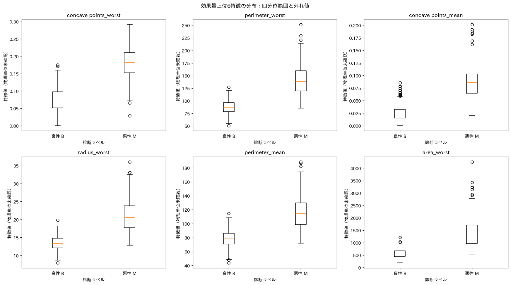

*核サイズと輪郭の凹みを表す上位6特徴の箱ひげ図。箱は四分位範囲、線は中央値、点は外れ値を示します。群差が大きくても分布は重なり、特徴値の物理単位は未確認です。*

30特徴の435ペア中、|Pearson r|≥0.90の強相関は21ペアありました。平均半径と平均周長はr=0.997855、良性内r=0.996769、悪性内r=0.995281でした。クラスを混合したことだけで生じる相関ではなく、半径・周長・面積の幾何学的な冗長性も大きいと判断できます。

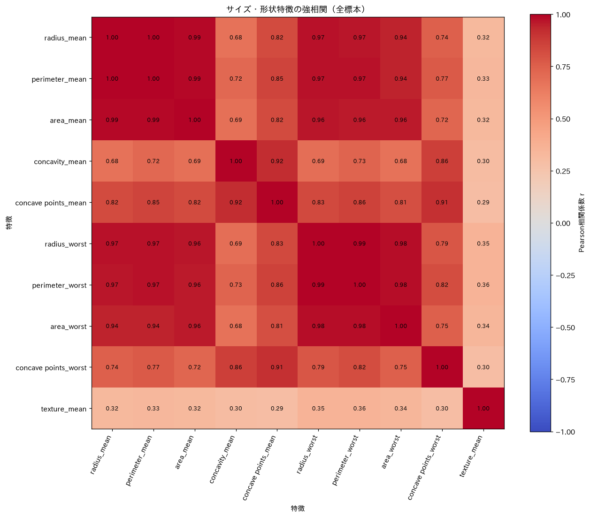

*選択した10特徴の全標本Pearson相関。核サイズに関する特徴群の強い相関を示します。全21ペアの確認にはNotebookの相関表を用い、ヒートマップだけで全30特徴を評価したとは扱いません。*

予測比較では悪性を陽性とし、乱数32の層化5-fold交差検証によるOOF（各症例を学習に使わない予測）を集約しました。ロジスティック回帰の標準化は各訓練fold内で行い、L2正則化はC=1です。縮約モデルの4特徴は`radius_mean`、`texture_mean`、`concave points_mean`、`smoothness_mean`で、Notebookでは形態学的な事前指定として扱っています。

| モデル（閾値0.5） | 見逃しFN | 過剰判定FP | 感度 | 特異度 | 正解率 | ROC-AUC |
| --- | ---: | ---: | ---: | ---: | ---: | ---: |
| 常に良性 | 212 | 0 | 0.00000 | 1.00000 | 0.62742 | 0.50000 |
| 1段決定木・30特徴 | 44 | 21 | 0.79245 | 0.94118 | 0.88576 | 0.87855 |
| 4特徴ロジスティック回帰 | 22 | 14 | 0.89623 | 0.96078 | 0.93673 | 0.98396 |
| 30特徴L2ロジスティック回帰 | 8 | 3 | 0.96226 | 0.99160 | 0.98067 | 0.99483 |

1段決定木は説明しやすい反面、見逃しが多い結果でした。全標本に学習した記述用の木は`radius_worst`の16.80で分岐しますが、これは検証foldごとのルールではなく、臨床カットオフでもありません。30特徴モデルは正解率98.07%でも悪性8件を見逃しました。感度のWilson近似95%区間は92.73–98.08%、特異度は97.56–99.71%ですが、患者独立を仮定し、fold間の学習依存性や施設差を十分に含まない区間です。

| 30特徴モデルの閾値 | 見逃しFN | 過剰判定FP | 感度 | 特異度 |
| --- | ---: | ---: | ---: | ---: |
| 0.1 | 5 | 31 | 0.97642 | 0.91317 |
| 0.2 | 7 | 18 | 0.96698 | 0.94958 |
| 0.3 | 7 | 10 | 0.96698 | 0.97199 |
| 0.5 | 8 | 3 | 0.96226 | 0.99160 |
| 0.7 | 18 | 0 | 0.91509 | 1.00000 |

閾値を下げると見逃しは減りましたが、ゼロにはならず、過剰判定が増えます。これらの閾値は内部感度分析用で、臨床的な最適値として選んだものではありません。FNは精査・診断の遅延につながり得る見逃し、FPは不安、追加検査、不要な侵襲的手技につながり得る過剰判定ですが、その実際の転帰をこのCSVで測定したわけではありません。

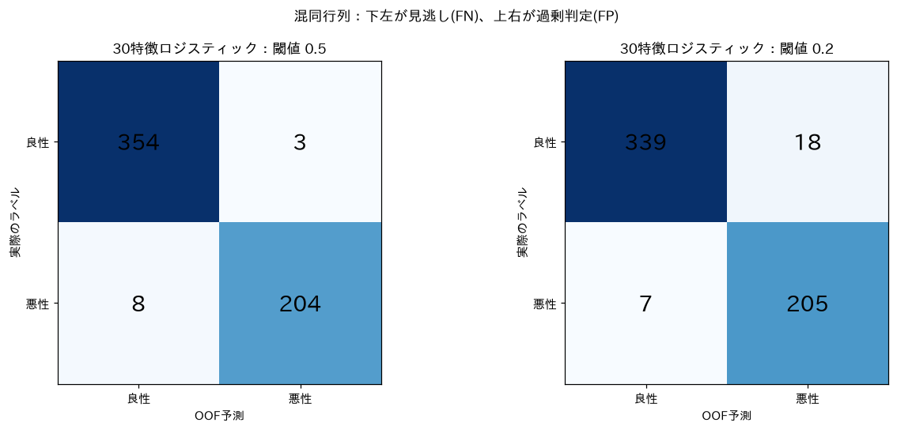

*30特徴モデルで閾値を0.5から0.2へ下げた比較。見逃しは8件から7件へ減る一方、過剰判定は3件から18件へ増えています。縦軸は実際の診断ラベル、横軸はOOF予測です。*

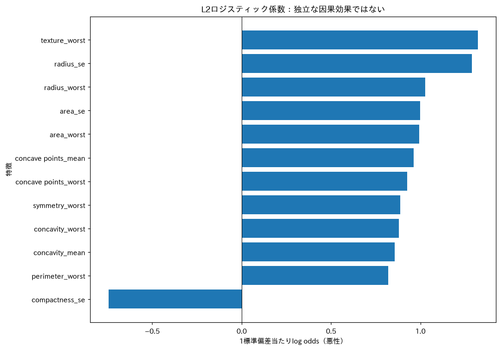

*全標本に学習したL2モデルの絶対値上位12係数。1標準偏差当たりの条件付きlog oddsを示します。強い共線性があるため、係数の大小や負符号を独立した重要性・因果効果と解釈しません。*

**AIが生成した追加依頼1 — 分割・正則化・縮約・外れ値に対する頑健性**

> 初回分析ではサイズ・凹み特徴の差と30特徴モデルの高い内部性能が見られましたが、強い共線性と1回の分割による不確実性が残ります。層化分割の乱数、L2正則化、4特徴への縮約を変えて感度と見逃し件数を比較し、主要特徴の差が外れ値処理でも維持されるか、回帰係数の符号がfold間で安定するかを確認してください。

**選定理由**: AIは、強い共線性と単一分割の高性能が、特徴解釈や見逃しリスクを過度に楽観的にする可能性を選びました。Notebookの「反復依頼履歴」に上記原文を記録してから実行しています。

**結果・証拠**: 乱数32・7、C=1・0.1・10、30特徴・4特徴の12仕様を比較しました。感度の相対変動を5%以内とする`run_sensitivity`の判定は`stable=False`、最大相対偏差は0.09313725490196081でした。30特徴のFNは8–14件、4特徴は20–27件となり、単一仕様と同じ感度を保証できないことが確認されました。この判定は特徴群の変更も含む12仕様全体に対するもので、乱数だけの不安定性ではありません。

上位6特徴を全標本の1–99パーセンタイルでwinsor化しても、大きな正の群差は維持されました。例えば`concave points_worst`のHedges gは2.68908から2.70121、`area_worst`は2.22729から2.34332でした。winsor化は記述的な群比較だけに使い、予測モデルの評価には使っていません。C=1の30特徴モデルを2乱数×5訓練foldで確認すると、`smoothness_mean`、`symmetry_mean`、`texture_se`、`smoothness_se`、`concavity_se`、`compactness_worst`の6特徴で係数の符号が反転しました。

根拠はNotebookセル8（実行カウント28）の12仕様表、`effect_sensitivity`、`coefficient_stability`、セル17の報告です。限られた処理変更で核サイズ・凹みの群差は残りましたが、個々の係数を安定した説明とみなすことはできません。2乱数・3種類のC、同じ569症例の再利用であり、12件の独立した追試ではありません。

**AIが生成した追加依頼2 — 見逃し重視の閾値選定と確率・悪性割合の確認**

> 反復1では感度が仕様によって変わり、特徴を縮約すると見逃しが増えました。見逃し重視の閾値を評価データで選ばず、外側5-foldと内側4-foldを分けて感度95%・98%を目標に選定し、実際に目標が達成されるかと過剰判定の増加を確認してください。また内部OOF確率の校正を点検し、悪性割合を1%・5%・10%と仮定したときの陽性的中率・陰性的中率の変化を、臨床性能への外挿ではない条件付きシナリオとして示してください。

**選定理由**: 反復1で仕様依存の見逃しが残ったため、AIは評価データで閾値を選ぶ楽観性と、悪性割合の低い集団で過剰判定が占める比率を未解決点として選びました。

**結果・証拠**: 30特徴・C=1を固定し、外側5-foldの訓練標本内で内側4-fold OOFを作り、目標感度を満たす最大閾値を選びました。選定と評価を分離しても、内側での目標感度は外側で保証されませんでした。

| 内側で設定した感度目標 | 外側の見逃しFN | 外側の過剰判定FP | 外側集約感度 | 外側集約特異度 |
| --- | ---: | ---: | ---: | ---: |
| 95% | 12 | 3 | 0.943396 | 0.991597 |
| 98% | 6 | 27 | 0.971698 | 0.924370 |

98%目標でも外側感度は97.17%で、見逃し6件・過剰判定27件でした。95%目標では94.34%にとどまりました。内側・外側モデルの確率尺度の変動も影響し得るため、選定時の感度条件を実運用の保証と取り違えないことが重要です。

固定閾値0.5のOOF確率はBrier score=0.019624、5等幅ビンのECE=0.015249でした。ただし、中間の確率ビンの症例数は10件、15件、7件と小さく、平均誤差が小さいだけで個別確率や外部施設での校正を保証できません。

悪性割合のシナリオは、感度・特異度が移送先でも変わらないという未検証の仮定を置いたBayes式の計算です。

| 仮定した悪性割合 | 固定閾値0.5の条件付きPPV | 固定閾値0.5の条件付きNPV | nested感度98%目標の条件付きPPV |
| --- | ---: | ---: | ---: |
| 1% | 0.536320 | 0.999616 | 0.114870 |
| 5% | 0.857688 | 0.998001 | 0.403416 |
| 10% | 0.927131 | 0.995789 | 0.588063 |

悪性割合1%では、固定閾値0.5のPPVは53.63%、見逃し重視の98%目標運用点では11.49%という条件付き結果でした。NPVが高くても見逃しが消えるわけではありません。この割合は一般集団で実測した有病率ではなく、FNA画像の症例データから検診性能を推定したものでもありません。

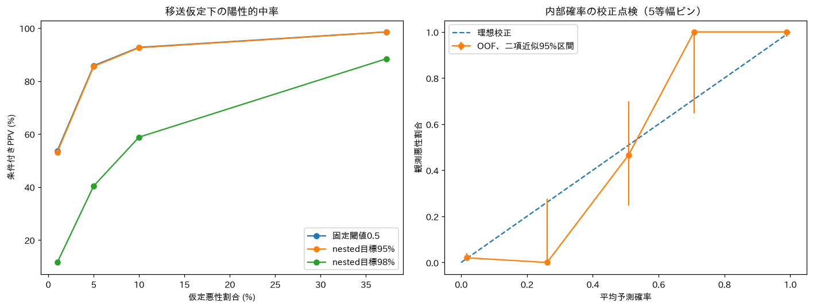

*左は感度・特異度を固定した仮定の下での陽性的中率、右は5等幅ビンによる内部確率の校正点検と二項近似95%区間。移送先の性能や個人の悪性確率を保証する図ではありません。*

根拠はNotebookセル10（実行カウント29）のfold別選択閾値・内外感度、nested集約表、悪性割合シナリオ、校正表・図と、セル18の報告です。残る限界は、単一の外側分割、固定C、患者独立性・施設移送の未確認、臨床の損失関数と外部データの欠如です。

**反復の終了判断**: AIは上限3回のうち2回で終了しました。残る課題は独立施設・前向き検証、患者連結、装置校正、医療上の効用に関する情報収集であり、同一CSVでモデル探索を増やしても解消しないという理由をNotebookに記録しています。外側検証で目標感度を達成しなかったことは重要な分析結果であり、処理の実行失敗とは区別します。

**最終結論**: この公開標本では、悪性群の核サイズと輪郭の凹みの特徴に大きな差があり、限定的な外れ値処理でも方向は維持されました。一方、強い相関により係数の独立した解釈は難しく、予測性能・見逃し件数は分割、正則化、特徴縮約、閾値選定に依存します。30特徴モデルの高い内部正解率やROC-AUC、訓練内の目標感度だけでは、安全な診断や見逃しゼロを保証できません。

この結果は診断支援手法を研究する材料であって、個人の臨床診断や検診への導入承認ではありません。陰性予測を理由に受診・精査を省く判断はできず、臨床適用には独立した外部検証、対象集団での校正、参照診断の確認、誤分類の損失評価と専門家による統合判断が必要です。

**監査・再現性**: Notebookの`metadata.reexecution`にはJupyter MCPでの上から順番の再実行完了が記録され、11コードセルの保存済み実行カウントは`22, 23, 24, 25, 26, 27, 28, 29, 30, 31, 34`です。最終セル内の監査は自身の実行途中のため10/11セルと警告を返していますが、保存後の`metadata.post_save_audit`は11/11セル実行済み、nbformat有効、未実行0、エラー0、監査指摘0、図表指摘0、`ok=True`、`visual_audit=True`を記録しています。根拠付き報告は5節、PNGは6枚で、図表を持つセルは6と10です。本節のセル番号は0始まりのNotebookインデックスです。

実行開始は`2026-10-01T21:31:39.753693+00:00`、再実行・保存後監査の完了記録は`2026-10-01T21:34:27.908310+00:00`です。セル19のライフサイクルは`completed`で、実行中セル数、書込み待ち、保持ロックはすべて0です。`status.json`の`analysis_complete=true`、`final_completion.ready=true`と保存済みNotebookの内容から分析完了と判断しています。この節の生成前の文書化状態を表すフラグや終了コードは、分析の完了・失敗判定には用いていません。

| 保存出力に記録されたライブラリ | バージョン |
| --- | --- |
| NumPy / pandas | 2.5.3 / 3.0.6 |
| SciPy / scikit-learn | 1.18.1 / 1.9.1 |
| Matplotlib / nbformat | 3.11.2 / 5.11.1 |
| Kaggle SDK | 2.2.4 |

データ取得来歴、両manifest、相関・モデル・感度分析などの出力、最終監査と各セルのソースSHA-256がNotebookに記録されています。日本語図表にはフォント文字マップと実際のTextを確認した結果があり、字形不足は空です。PNGはNotebookの保存済み`image/png`出力から6枚すべてをそのまま抽出し、本節から`figures/exp-32-...png`で参照しています。今回の記事生成ではデータ取得や分析を新たに再実行していません。

`initial.log`と`status.json`は、初回CLIが終了コード0、所要1076.7秒、終了形態`exited`であったことを示します。`followup.log`には既存セルの確認・再実行を行うという開始文と、Notebookが安定して監査に通ったためランナーが停止した記録があります。追加確認は所要95.3秒、終了形態`artifact_complete_cutoff`です。ただし、初回・最終のファイルサイズと更新日時は同一で、追加確認による新しい分析・再実行の完了証拠はありません。したがって、2回の反復は初回セッション中のNotebook記録に基づき、追加確認セッションがさらに分析したとは記述しません。

**失敗・回避策と責任範囲**: 最終成果物に未解決の実行エラーはありません。ただし、Notebookの記録には途中の障害と回避策が残っています。初回ログ・追加確認ログは完全なツール履歴ではないため、以下の途中事象はNotebookに記述された範囲で報告します。

| 事象 | 記録された対応と切り分け |
| --- | --- |
| 初回`use_notebook`で親ディレクトリが自動作成されない | bootstrap側で`ensure_notebook`を用いて準備。Copilot CLI／Jupyter MCP側の接続・準備上の事象として記録され、Jupytermindの不具合には計上しない |
| `findfont`へlistを渡したTypeError | `FontProperties`を使う形へ修正。分析側の補助コードの問題 |
| Agg環境の`display(fig)`だけではPNGにならない | 明示的にPNGへ保存してMIME出力。分析側のコード・描画環境の問題 |
| 実行中Notebookへの報告追記がMCPの保存で上書きされる | 非アクティブ側のcontrollerから静的報告・メタデータを追記。MCPのアクティブNotebook保存との競合として記録され、単独のJupytermind不具合とは断定しない |
| 追加確認が`artifact_complete_cutoff`で停止 | `followup.log`のランナー停止記録。分析失敗やJupytermindの異常終了の根拠とはしない |

Notebookに「ベンチマークランナーは起動していない」との記述もありますが、ログには`[runner]`の停止処理が存在します。本節では前者をランナー不在の証拠とは採用せず、実験外側のプロセス管理とNotebook内の分析を区別します。Kaggle APIについては取得成功の出力があり、取得失敗や代替CSVへの切替は確認されません。

静的な根拠付き報告と図表メタデータの再生成にはcontroller側の書込み回避策が必要と記録されているため、「保存Notebookだけで、すべての静的報告まで無条件に自動更新される」とは言えません。計算された日本語報告はコード出力にも残っています。Notebookのカーネル名・言語メタデータも空であり、移行先ではカーネル設定や記録された絶対パスの調整が必要です。構造監査の通過は可搬性や臨床妥当性の保証ではありません。

**Jupytermindの改善候補**: Notebookセル11（実行カウント30）で次の2候補が検証され、初回ログも改善候補2件の記録に言及しています。いずれも候補であり、指定証拠だけからAPI設計上の不具合と最終断定するものではありません。

| 分類 | 再現された挙動 | 影響と回避策 |
| --- | --- | --- |
| 定義検査の機能不足・未解決定義の扱い | `FieldValue('仮の単位', 'inferred')`だけのmanifestに`unresolved_fields()`を呼ぶと`[]` | 推定定義が検証すべき項目の一覧から漏れる可能性。Notebookでは`inferred`を別走査して併記 |
| 図表監査・メタデータ生成の機能不足 | 公開描画API由来のPNGを持ち、図表メタデータのないセルに`audit_visual_outputs`を呼ぶと指摘は`()` | 未検査を合格と誤認する可能性。実Textとフォント字形を別途検査し、メタデータを保存して監査 |

再現手順、期待・実際の挙動、影響、証拠、受け入れ条件は実験runディレクトリの`issue-candidate.json`へJSONオブジェクトとして保存しました。MCP保存競合、補助コードの誤り、Kaggle取得、ランナー停止はこの候補から除外しています。

**限界**: 患者独立性、IDと患者の連結、人口属性、詳細な参照診断、物理単位・校正、標本の代表性は未確認です。前提manifestの患者独立性、施設・装置への移送、臨床損失に関する3指摘は解消していません。IDが一意でも患者独立を証明しないため、内部検証の漏洩や区間の過小評価を完全には排除できません。

独立参照データがなく、同じWDBCの別配布コピーを独立検証とは扱えないため、参照データとの異常検証・比較は不適用と記録されています。患者group分割、施設・時点別の外部検証、公平性、物理単位に基づく臨床閾値、因果推論も必要情報がなく実施していません。特徴差の頑健性、内部予測性能、確率校正、臨床での有用性・安全性を別々に評価する必要があり、本実験で確認できたのは公開標本内の比較と限定的な内部検証までです。

## 実験33: Heart Disease（分析完了）

**課題**: 「KaggleのHeart Diseaseデータを分析し、心疾患アウトカムと関連する特徴を調べてください。欠損や符号化を確認し、単変量差と多変量での関連を区別して、交絡、標本選択、因果解釈の限界を日本語で説明してください。」

**初回プロンプト（全文・原文）**: 以下は、データセットと問い、およびベンチマークの共通制約からAIが自動生成した初回プロンプトです。人間が本実験向けに全文を個別作成したものではありません。`initial-prompt.md` の全文を掲載します。

> KaggleのHeart Diseaseデータを分析し、心疾患アウトカムと関連する特徴を調べてください。欠損や符号化を確認し、単変量差と多変量での関連を区別して、交絡、標本選択、因果解釈の限界を日本語で説明してください。 Kaggle参照先: https://www.kaggle.com/datasets?search=heart+disease+uci。インストール済みkaggle Python SDKを使い、NotebookのJupyter MCP実行セル内で`KaggleApi().authenticate()`、`dataset_list(search=...)`、`dataset_list_files(...)`、必要に応じて`dataset_download_file(...)`を呼び出し、Kaggle上の対応する公開データを検索・取得してください。owner/dataset slug、取得ファイル名、取得日、ファイルSHA-256をNotebookに記録してください。APIトークンをセル出力・Notebook・ログへ表示しないでください。分析・API取得コードの実行はJupyter MCPだけを使い、端末コマンド、subprocess、外部スクリプト起動、作業エージェントへの委譲は行わないでください。Kaggle APIで対応データを取得できない場合は、`/home/nahisaho/kaggle/experiments/white-paper.md`を確認してください。同じデータセットの公開CSVが同稿に明記されている場合だけ、そのURLへフォールバックしてください。対応するCSVを確認できない場合は、別データを推測で選ばず、取得失敗として記録してください。保存先は benchmark/projects/kaggle-v020-kaggle-exp-33-heart-disease/notebooks/kaggle-v020-kaggle-exp-33-heart-disease.ipynb としてください。run_idは `v020-exp-33` です。長時間処理の開始前にlifecycle.register_runを呼び、実行・書込みフェーズを記録し、終了時にcompletedまたはfailedを記録してください。データ定義manifest、分析前提manifest、意味的な異常検査、妥当な範囲の感度分析を使い、適用できない機能は理由を記録してください。図表はvisual_audit=Trueで監査してください。Notebookには「使用したJupytermindモジュール」節を設け、直接import・呼び出したモジュール名、関数名、使用目的を記録してください。間接利用は使用済みに含めないでください。Jupytermindの不具合または機能不足が疑われた場合は「Jupytermind改善候補」節を設け、分類、再現条件、期待する挙動、実際の挙動、影響、回避策、関係するセルとログを記録してください。Copilot CLI、Kaggle API、ベンチマークランナーに固有の問題とは切り分け、候補がなければ「なし」と記録してください。初回分析後、自分で結果を読み直し、結論に実質的な影響を与える未解決点があれば自然言語の追加依頼文を作成し、Notebookの「反復依頼履歴」に原文のまま記録して実行してください。価値ある追加分析がなくなるまで最大3回繰り返し、各反復の選定理由・結果・証拠・残る限界を報告してください。最後に全コードセルを上から再実行し、notebook_auditとライフサイクル状態を記録してください。

**使用したJupytermindモジュール**: 次表は、対象Notebookのコードセルで直接importと呼び出しを確認できるモジュール・関数に限定しています。モジュール一覧のMarkdownに名前があるだけの機能や間接依存は含めません。

| モジュール | 直接呼び出した関数・クラス | 使用目的 |
|---|---|---|
| `ai_data_scientist.project_manager` | `resolve_project`、`ensure_data_dir` | 指定プロジェクトの解決とデータ保存先の確保 |
| `ai_data_scientist.language_router` | `detect_language` | 日本語の指示であることの確認 |
| `ai_data_scientist.lifecycle` | `register_run`、`mark_execution_start`、`mark_execution_end`、`is_cancel_requested`、`get_run_status`、`mark_completed` | run登録、実行フェーズ、取消要求、最終状態の管理。`mark_failed` は失敗・取消経路に記述されているが、保存済み最終実行ではその経路の発火を確認していない |
| `ai_data_scientist.ingestion` | `SourceSpec`、`ingest` | Kaggleから取得済みのCSVの読み込み |
| `ai_data_scientist.eda` | `explore` | 型、欠損、カテゴリ頻度、要約統計の確認 |
| `ai_data_scientist.data_definition` | `FieldValue`、`build_manifest`、`DataDefinitionManifest.unresolved_fields` | 出典、変数定義、符号化と未確定定義の記録 |
| `ai_data_scientist.analysis_assumptions` | `Assumption`、`AnalysisAssumptionManifest`、`check_manifest` | 関連分析の範囲、独立性、完全ケース選択などの前提と未解決所見の記録 |
| `ai_data_scientist.data_quality` | `detect_anomalies` | ID、カテゴリ、値域とゼロ値の意味的検査 |
| `ai_data_scientist.cleaning` | `clean_dataset` | ID以外の完全重複を除く感度分析 |
| `ai_data_scientist.sensitivity` | `SensitivityPlan`、`run_sensitivity` | モデル仕様・施設除外・重複除外に対するORの相対偏差と安定性の評価 |
| `ai_data_scientist.visualization` | `render_chart`、`build_image_output` | 施設別棒グラフの描画と、棒グラフ・OR図のPNG MIME出力の生成 |
| `ai_data_scientist.notebook_audit` | `audit_notebook(visual_audit=True)` | 実行状態、エラー、証拠リンク、図表の監査 |

`ai_data_scientist.insight_engine` は対象Notebookでimportされていますが、`extract_cited_value`・`record_insight` の呼び出しコードは同Notebook内にありません。Notebookの利用記録ではこれらと `project_manager.ensure_notebook`・`enqueue_write`、lifecycleの書込み管理を別の制御Notebookから使ったとされていますが、その別ファイルは今回の証拠対象外です。このため、対象Notebookで直接呼び出した機能としては計上しません。`mcp_gateway.run_and_record` も不使用と記録されています。検定、ロジスティック回帰、スプラインはSciPy・statsmodels、データ整形はpandas、ORとCIの描画はmatplotlibによるもので、Jupytermindの統計関数の実行とは区別します。

**初回指示**: 欠損・符号化を確認し、単変量差と多変量での関連、交絡、標本選択、因果解釈を分けて説明するよう求めました。具体的な回帰仕様や追加分析の内容は指定せず、AIがデータ構造と初回結果から選んでいます。Kaggle SDKによる取得、取得元・ファイル・日時・ハッシュの記録、Jupyter MCP内での実行、manifest、意味的検査、感度分析、図表監査、最大3回の自律的追加依頼、全コードの再実行が共通制約です。公開CSVへのフォールバックは指定文書に同じデータのURLが明記された場合に限る条件でしたが、今回はKaggle取得が成功し使用していません。

**データ取得・定義確認**: Kaggle検索 `heart disease uci`、ファイル一覧確認、ダウンロードを経て、`redwankarimsony/heart-disease-data` の `heart_disease_uci.csv` を取得しました。取得記録は `2026-10-01T21:51:05.663946+00:00`（UTC）、SHA-256は `574f2fa2b43012fa25fca4fcdb36bd7c6bccdd0af4242f6c0e4c8633c5a072ae` です。CSVは920行・16列で、アウトカム `num` の欠損はありません。`num=0` を陰性、`num=1–4` を陽性にまとめ、陽性は509件（55.3%）でした。これは診断時の疾患有無であり、将来の発症・死亡ではありません。

NotebookにはKaggleの公開説明と、取得したUCI辞書の抜粋・ハッシュが残っています。ただしKaggle版の変換履歴や患者単位の対応を独立に照合していません。原辞書のCleveland 303件・Hungarian 294件に対し、このCSVは304件・293件で、無改変の原UCIファイルとは断定できません。`dataset` と説明中の `origin`、`thalch` と `thalach` の対応は推定として記録し、`oldpeak` の単位は独立確認できないためmmと断定せず「記録尺度」としています。`thal` も導入説明のthalassemiaと同一視せず、検査の欠損型分類として扱いました。

| 収集施設 | 件数 | 標本内の陽性割合 | 主モデルに残った件数 |
|---|---:|---:|---:|
| Cleveland | 304 | 45.7% | 304 |
| Hungary | 293 | 36.2% | 260 |
| Switzerland | 123 | 93.5% | 0 |
| VA Long Beach | 200 | 74.5% | 97 |

元CSVの欠損は `trestbps` 59件、`chol` 30件、`fbs` 90件、`restecg` 2件、`thalch`・`exang` 各55件、`oldpeak` 62件、`slope` 309件、`ca` 611件、`thal` 486件です。重複IDは0件、ID以外の完全重複は2件でした。意味的検査は安静時血圧の0を1件、コレステロールの0を172件検出し、生理的な真値とはみなさず欠損化しています。欠損の大きい `slope`・`ca`・`thal` は主モデルに含めず、追加分析で施設を限定して検証しました。上表の割合は臨床標本内の割合であり、一般住民の有病率ではありません。

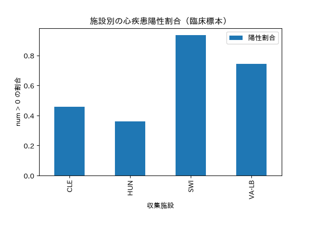

*施設ごとの `num>0` の割合。CLEはCleveland、HUNはHungary、SWIはSwitzerland、VA-LBはVA Long Beach。Notebookの保存済みPNG出力を抽出したもので、施設間の標本構成・選択の違いを含む。*

**初回結果**: 連続変数はMann–Whitney検定、カテゴリはカイ二乗検定で群差を調べ、14項目の単変量比較にBenjamini–Hochberg補正を用いました。欠損は項目別に除外されており、各比較の分母は同じではありません。陰性・陽性群の年齢中央値は51歳・57歳、最大心拍数中央値は151・128、ST低下中央値は0・1.05（記録尺度）でした。男性の陽性割合は63.2%、女性は25.8%、運動誘発狭心症ありは83.7%、なしは36.4%でしたが、これらは未調整の群差です。

主モデルは661完全ケース、陽性314件、16パラメータのロジスティック回帰で、収束が記録されています。年齢、性別、胸痛型、安静時血圧、コレステロール、空腹時血糖、安静時心電図、最大心拍数、運動誘発狭心症、ST低下、施設を相互調整し、p値による変数選択はしていません。カテゴリはダミー符号化し、IDは説明変数にしていません。

| 特徴・比較 | 主モデルの調整OR | 95%信頼区間 |
|---|---:|---|
| 男性／女性 | 4.31 | 2.50–7.44 |
| asymptomatic胸痛型／typical angina | 4.73 | 1.87–11.96 |
| 年齢10歳増加 | 1.22 | 0.92–1.63 |
| 安静時血圧10 mmHg増加 | 1.10 | 0.97–1.25 |
| コレステロール50 mg/dL増加 | 1.24 | 1.02–1.49 |
| 空腹時血糖120 mg/dL超／以下 | 1.61 | 0.86–3.04 |
| 最大心拍数の記録値10増加 | 0.91 | 0.81–1.01 |
| 運動誘発狭心症あり／なし | 2.68 | 1.65–4.37 |
| ST低下の記録尺度1増加 | 2.06 | 1.61–2.65 |

年齢は単変量で群差があっても、調整後のCIは1を含みました。これは「年齢の効果がない証明」ではなく、単純な群差を独立関連と取り違えないための結果です。ORはリスク比ではなく、上表のCIは点ごとの95%区間で同時信頼区間ではありません。コレステロールの0処理でSwitzerlandが全件脱落した点と、診断検査を主モデルから除いた点をAIが未解決の論点として選びました。

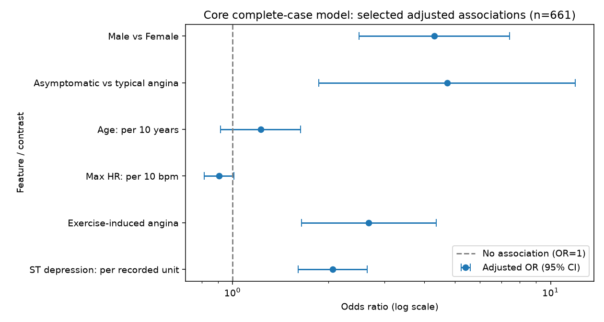

*661完全ケースの主モデルで選択した特徴の調整OR。横軸は対数尺度、線は95%信頼区間、破線はOR=1。全係数ではなく選択した比較を描いており、将来発症の予測性能や介入効果を示す図ではない。*

**AIが生成した追加依頼1 — ゼロ値と施設・完全ケース選択**

> 主解析からSwitzerlandが全件脱落しています。コレステロール0値と欠損の施設分布を確認し、cholとfbsを除いた施設調整モデル、0値をそのまま使うモデル、同じ標本でcholだけを除いたモデルを比較して、コレステロールの関連と他の主要関連が標本選択に依存するか調べてください。

**選定理由**: 初回の661完全ケースにSwitzerlandが残らず、コレステロールのゼロ処理で未調整の群差の方向も逆転するため、標本選択と調整セットの変更を分けて確認する必要があるとAIが判断しました。

**結果**: コレステロール0はSwitzerlandの123件すべてとVA Long Beachの49件でした。0を含む平均値は陰性227.91・陽性176.48ですが、0を欠損化すると陰性240.16・陽性254.01に逆転します。「低コレステロールが心疾患を引き起こす」とは読めません。

`chol`・`fbs` を除いた施設調整モデルは851件となり、Switzerlandも116件戻りました。運動誘発狭心症のORは主モデル2.68、同じ標本で `chol` を除いたモデル2.72、全施設を戻した縮小モデル2.99、0を真値扱いした比較モデル2.70でした。ST低下はそれぞれ2.06・2.07・1.91・2.08です。4仕様の最大相対偏差は狭心症11.4%、ST低下7.3%で、設定した25%閾値の範囲内でした。一方、0を真値扱いした740件のモデルでコレステロールのORは1.15（95%CI 1.00–1.32、丸め前の下限0.995674）となり、CIは1を含みます。この仕様は推奨されない比較用です。

証拠はNotebookセル10（セル位置は0始まり、実行番号6）の施設別ゼロ分布、モデル表、SensitivityReportです。主要関連の方向はこの範囲では維持されましたが、縮小モデルは脂質・血糖で未調整であり、同じ推定対象ではありません。MAR・MNARなどの欠損機構は検証できず、同一定数の補完でSwitzerlandの脂質情報を回復できるわけでもありません。

**AIが生成した追加依頼2 — 検査所見の追加と重複除外**

> 全施設を戻しても主要な関連の方向は維持されていますが、slope・ca・thalを除いた主モデルだけでは検査所見の影響を分離できません。欠損の少ないClevelandに限定し、同じ完全ケースでこれらを加える前後のORを比較してください。ID以外の完全重複を除く感度分析も行い、検査項目の追加による減衰を因果的な媒介効果と解釈しないでください。

**選定理由**: 反復1で狭心症・ST低下の方向が維持されても、欠損の大きい検査所見を除いた主モデルから「他の検査所見と独立」とは言えないため、AIが調整セット依存と重複による独立性の問題を選びました。

**結果**: Clevelandの304件から、追加検査を含む297完全ケース（陽性137件）を選び、同じ標本で基本・拡張モデルを比較しました。拡張モデルは21パラメータで収束しています。

| 特徴・比較 | Cleveland基本モデルのOR（95%CI） | `slope`・`ca`・`thal` 追加後のOR（95%CI） |
|---|---|---|
| 男性／女性 | 6.93（3.07–15.66） | 5.31（1.80–15.69） |
| asymptomatic胸痛型／typical angina | 9.91（3.01–32.66） | 10.73（2.67–43.08） |
| 年齢10歳増加 | 1.27（0.83–1.93） | 0.79（0.48–1.29） |
| 運動誘発狭心症あり／なし | 2.07（0.98–4.37） | 1.92（0.80–4.62） |
| ST低下の記録尺度1増加 | 1.93（1.36–2.73） | 1.48（0.92–2.36） |

狭心症のCIはCleveland基本モデルでも既に1を含んでいます。ST低下は検査所見の追加後にCIが1を含み、年齢の点推定の方向も変わりました。追加検査は疾患の結果や診断の構成要素かもしれず、ORの減衰を因果的な媒介効果や交絡除去の証明とはしていません。

IDを除く完全重複2件を削除すると元データは920件から918件となり、主モデル仕様の狭心症ORは2.63、ST低下ORは2.08でした。最大相対偏差はそれぞれ1.9%・0.8%で、今回の重複除外の影響は小さい結果です。証拠はセル12（実行番号7）の同標本モデル表、重複除外件数、感度出力です。Clevelandだけの解析への変更、少数カテゴリの広いCI、患者再受診の識別不能、外部検証不能は残ります。

**AIが生成した追加依頼3 — 非線形性と施設依存性**

> Cleveland拡張モデルでは狭心症とST低下のCIが1を含み、年齢のOR方向も変化しました。主モデルの年齢・最大心拍数・ST低下をスプラインで表した場合と、施設を一つずつ除外した場合に、性別・胸痛型・運動誘発狭心症の関連が維持されるかを確認し、モデル依存性と施設依存性を区別してください。

**選定理由**: 反復2で調整セットへの依存が確認されたため、残る実質的な論点として連続変数の線形仮定と施設への依存をAIが選びました。

**結果**: 同じ661件で年齢・最大心拍数・ST低下をスプライン化したモデルは収束し、線形モデルとの尤度比検定はLR=7.983、自由度9、p=0.536でした。AICは線形567.63、スプライン577.65で、非線形項の追加を支持する強い証拠はありません。ただし線形性が正しいと証明されたわけではありません。

施設除外は主モデルに残った3施設を対象とし、Switzerlandは既に全件脱落しているため除外比較に含まれません。Cleveland除外357件、Hungary除外401件、VA Long Beach除外564件の各モデルは収束しました。Clevelandを除くとasymptomatic胸痛型のORは1.27（95%CI 0.24–6.62）となり、Hungary除外では7.36（2.51–21.53）でした。主モデル・スプライン・3施設除外の5仕様における最大相対偏差は胸痛型73.1%、男性32.2%で、25%閾値による `stable=False` です。男性ORは方向を維持しましたが、効果量まで安定しているとはいえません。

運動誘発狭心症はOR 2.50–3.02、各仕様のCI下限も1を超え、最大相対偏差12.5%で `stable=True` でした。ただし反復2の拡張モデルはこの5仕様に含まれず、そこでの不確実性を解消したことにはなりません。証拠はセル14（実行番号8）の尤度比・AIC、施設除外のモデル表、SensitivityReportです。施設数は4しかなく、施設クラスターロバストCIは使用していません。

**反復終了理由**: AIは上限3回に到達したことを記録しました。残る重要な不確実性は標本抽出、服薬・喫煙、時間順序、欠損機構、外部検証に関するもので、同じCSV内の仕様探索を続けても解消しないと判断しています。全論点が解決したという意味での終了ではありません。

**最終結論**: 心疾患診断陽性との関連は、この臨床標本と調整仕様の範囲で確認されましたが、単変量差、相互調整関連、因果効果は区別する必要があります。年齢の単変量差は調整後に明瞭でなくなり、コレステロールの単純な群差はゼロ値と施設選択に依存します。主モデルでは男性、asymptomatic胸痛型、運動誘発狭心症、ST低下に関連がありましたが、胸痛型は施設依存が大きく、狭心症・ST低下はClevelandで検査所見を追加するとCIが1を含みます。「普遍的な独立した危険因子」を同定した結果ではなく、診断時の特徴の探索的な関連分析です。

本実験では、AIの追加依頼が初回の欠損・施設選択、検査所見の調整、線形仮定・施設依存という具体的な不足を検証し、初回結論をより限定的なものへ更新しました。分析完了は `status.json` の `analysis_complete=true`、`final_completion.ready=true`、Notebookの結果・反復履歴・完了状態で判断しています。

**監査・再現性**: Notebookは `benchmark/projects/kaggle-v020-kaggle-exp-33-heart-disease/notebooks/kaggle-v020-kaggle-exp-33-heart-disease.ipynb` に保存されています。metadataの `reexecution` はクリーンカーネルでJupyter MCPから全コードを順に実行したと記録し、保存済み13コードセルすべてに実行番号があります。実行番号は1–11、15、21であり、連番ではありません。初回ログにもカーネル再起動と全セル再実行の完了報告があります。本節の作成時に分析を再実行したのではなく、これらの保存記録を照合しました。

保存後の `metadata.final_audit` は `nbformat_valid=true`、`ok=true`、コード13件・実行済み13件、未実行・エラーなし、PNG図表2件、証拠付きInsight 7件、構造・視覚所見なしです。`metadata.final_lifecycle` は `v020-exp-33` が `completed`、実行・書込み・ロックのカウンタがすべて0です。`status.json` の最終監査とも整合します。末尾監査セルの出力には、そのセル自身が実行中であるため検査対象から一時除外した警告が残っていますが、保存後の監査では所見がありません。監査の合格は、以下の統計的・意味的限界の解消を意味しません。

7件の結論のEvidence manifestは実行番号15の専用証拠セルを参照しています。数値は実行番号11の総合解釈にもありますが、標準出力の証拠探索で問題が起きたため、再計算値を実際に `display_data` の `text/plain` として出したものです。Notebookの記録では、書込みと証拠番号同期を別の制御Notebookで行っています。将来の再実行でも対象Notebookを実行中に書き換えず、実行外で証拠番号を同期して保存後に監査する必要があります。「対象Notebookだけを再実行すればすべての証拠番号が自動更新される」とは確認できません。

取得記録、定義・前提manifest、感度出力、単変量表、調整OR表、ライフサイクル、最終監査のsidecar保存先はNotebook内に記録されていますが、今回それらの別ファイルは証拠として読んでいません。Notebook内のコード・出力・metadataを根拠としています。独立参照データがないため外部データ比較・異常検証、時間情報がないため時系列機能、識別条件を満たさない因果推定、課題外のAutoMLは適用していません。

**追加確認ログと外部ランナーの扱い**: 初回処理は `initial_exit_code=0`、`initial_termination=exited`、所要時間1332.8秒です。初回ログ末尾のプロセス群停止は「Copilot CLI exited; cleaning descendant runtimes」とされ、分析エラーを示すものではありません。追加確認ログには「既存セルを保持して再評価する」という表明と、Notebookが安定して監査を通過したためランナーが停止した記録があります。`followup_termination=artifact_complete_cutoff`、`followup_exit_code=0`、所要時間94.9秒で、前後のNotebookサイズ264909バイトとmtimeは同じでした。この追加確認を新たな第4回分析や、追加セッションが自然終了した証拠とは扱いません。

**実行中の失敗・Jupytermind改善候補**: 保存済み最終Notebookにエラーセルはなく、分析全体の未完了は確認されません。ただしNotebookの改善候補欄と初回ログには、途中で生じた次の問題・回避策が記録されています。いずれも今回ソース修正や新規の不具合再現は行っていないため、修正済みの不具合ではなく改善候補です。

| 分類 | 記録された実際の挙動・影響 | 回避と証拠の範囲 |
|---|---|---|
| lifecycleの文書例とAPIの不整合 | 文書例の `register_run(run_id)` ではNotebookパスが不足し `TypeError` となり、登録が止まるとNotebookが報告 | セル1では `register_run(run_id, handle.notebook_path)` を使用。元の例外出力や参照先diagnosticsは本節の証拠対象外で、候補欄の記録に基づく |
| 可視化レイアウト・監査範囲 | 長い施設名の棒グラフで下端のラベルが切れたのに視覚監査が通過したとNotebookが報告 | セル16で施設名を略号化し、`figure.subplot.bottom=0.25` を指定。最終PNGはラベルが収まり、字形警告もなし。切れた初期PNG自体は今回未確認 |
| 証拠探索の出力型互換性 | 保存済み `stream.text` の数値を証拠登録が認識せず `EvidenceMissingError` となった | 初回ログにも例外名の記録があり、セル19の標準出力とセル22の実際の `display_data` 出力、結論のmanifestを照合できる。後者で回避したが、内部探索実装は今回未検証 |

証拠探索の問題は、Kaggle取得後の正しいNotebook出力をJupytermindが根拠として扱えないという互換性候補です。取得失敗や外部ランナー停止とは区別します。候補の分類・再現手順・期待／実際の挙動・影響・証拠・受け入れ条件は、同実験の `issue-candidate.json` に保存しました。

Notebookは、実行中に `enqueue_write` で同じNotebookを書き換えると、カーネル側の完了状態は生成されてもMCP側でセルの出力・実行番号が保存されない連携現象も報告しています。別の制御Notebookから書き込み、対象Notebookでは読み取り専用監査を行うことで回避したとされますが、帰責は未確定であり、単独のJupytermind不具合候補には含めません。また、親ディレクトリ未作成による `use_notebook` 失敗はJupyter MCPの準備、検索1ページ内に事前slugがなかった問題は選択コード、metadataの `info` 入れ子の見落としは呼出し側の解析として、Notebook自身が切り分けています。Kaggle認証・CSV取得は成功しており、指定ログからCopilot CLI固有の障害やベンチマークランナーの障害を立証する記録はありません。

**残る限界**: 男性726件・女性194件という偏った4施設の診断用臨床標本であり、紹介・受診・検査施行・完全ケースへの選択があります。受診への条件付けによるコライダーバイアス、未測定の喫煙・服薬・家族歴、逆因果、時間順序不明、診断所見が疾患の結果や診断構成要素である可能性、ORの非可約性が残ります。独立性と完全ケース代表性は分析前提manifestで未解決の警告となっており、重複除外や構造監査では検証できません。値域検査の閾値も分析者が設定したもので、臨床的な誤記をすべて判定するものではありません。

追加分析は同じデータを見た後に選ばれた探索であり、独立した確認的検証ではありません。感度分析の `stable` は選んだ仕様とORの25%相対偏差閾値に限る判定で、無交絡・因果性・臨床再現性を保証しません。施設・時代差、Kaggle版の変換履歴、標本抽出率を確認できず、一般人口の有病率、個人の絶対リスク、将来発症率、予防・介入効果への一般化はできません。

## 実験34: Bike Sharing Demand（分析完了）

**課題**: 「KaggleのBike Sharing Demandデータを使い、自転車利用数の時間帯・曜日・季節・天候による変化を調べてください。時系列順序と需要分布を考慮し、適切な図表と検証を自分で選び、将来期間への一般化の限界を日本語で示してください。」

勤務日は朝夕、非勤務日は昼間に貸出が集中し、天候コード3の低需要関連は構成差を調整しても残りました。一方、時間順に分離した2012年Q4の検証では、RMSLEがベースラインより改善しても高需要時の過小予測が残ります。**観測期間の関連を説明できたことと、月末や将来年の需要を予測できることは別**です。

本節の分析上の証拠は、指定されたNotebook、`initial-prompt.md`、`initial.log`、`followup.log`、`status.json`に限定しました。既存の`white-paper2.md`は節の書式・詳細度の参考にのみ用いています。分析完了は`status.json`の`analysis_complete=true`、`final_completion.ready=true`、Notebookの実行出力・完了metadataから判断しました。

### 初回プロンプトと指示

**初回プロンプトは、データセット・分析上の問い・共通制約からAIが自動生成したものです。人間が実験34の全文を個別に作成したものではありません。** 実際の入力を`initial-prompt.md`から全文・原文で示します。

**初回プロンプト（全文・原文）**

> KaggleのBike Sharing Demandデータを使い、自転車利用数の時間帯・曜日・季節・天候による変化を調べてください。時系列順序と需要分布を考慮し、適切な図表と検証を自分で選び、将来期間への一般化の限界を日本語で示してください。 Kaggle参照先: https://www.kaggle.com/competitions/bike-sharing-demand。インストール済みkaggle Python SDKを使い、NotebookのJupyter MCP実行セル内で`KaggleApi().authenticate()`、`dataset_list(search=...)`、`dataset_list_files(...)`、必要に応じて`dataset_download_file(...)`を呼び出し、Kaggle上の対応する公開データを検索・取得してください。owner/dataset slug、取得ファイル名、取得日、ファイルSHA-256をNotebookに記録してください。APIトークンをセル出力・Notebook・ログへ表示しないでください。分析・API取得コードの実行はJupyter MCPだけを使い、端末コマンド、subprocess、外部スクリプト起動、作業エージェントへの委譲は行わないでください。Kaggle APIで対応データを取得できない場合は、`/home/nahisaho/kaggle/experiments/white-paper.md`を確認してください。同じデータセットの公開CSVが同稿に明記されている場合だけ、そのURLへフォールバックしてください。対応するCSVを確認できない場合は、別データを推測で選ばず、取得失敗として記録してください。保存先は benchmark/projects/kaggle-v020-kaggle-exp-34-bike-sharing/notebooks/kaggle-v020-kaggle-exp-34-bike-sharing.ipynb としてください。run_idは `v020-exp-34` です。長時間処理の開始前にlifecycle.register_runを呼び、実行・書込みフェーズを記録し、終了時にcompletedまたはfailedを記録してください。データ定義manifest、分析前提manifest、意味的な異常検査、妥当な範囲の感度分析を使い、適用できない機能は理由を記録してください。図表はvisual_audit=Trueで監査してください。Notebookには「使用したJupytermindモジュール」節を設け、直接import・呼び出したモジュール名、関数名、使用目的を記録してください。間接利用は使用済みに含めないでください。Jupytermindの不具合または機能不足が疑われた場合は「Jupytermind改善候補」節を設け、分類、再現条件、期待する挙動、実際の挙動、影響、回避策、関係するセルとログを記録してください。Copilot CLI、Kaggle API、ベンチマークランナーに固有の問題とは切り分け、候補がなければ「なし」と記録してください。初回分析後、自分で結果を読み直し、結論に実質的な影響を与える未解決点があれば自然言語の追加依頼文を作成し、Notebookの「反復依頼履歴」に原文のまま記録して実行してください。価値ある追加分析がなくなるまで最大3回繰り返し、各反復の選定理由・結果・証拠・残る限界を報告してください。最後に全コードセルを上から再実行し、notebook_auditとライフサイクル状態を記録してください。

**初回指示**: 問いは時間帯・曜日・季節・天候と貸出件数の関係です。手法や追加分析項目は事前指定せず、AIに図表・検証・反復の選択を任せました。一方、データ取得の出典とハッシュ、Jupyter MCPへの実行経路の限定、データ定義・分析前提・意味的検査・感度分析、図表監査、ライフサイクル管理、最後の上からの再実行は共通制約です。フォールバックは指定稿に同一データの公開CSVが明記される場合に限られ、本実験ではKaggleから取得できたため使用していません。

### 使用したJupytermindモジュール

Notebookのコードセルで直接importし、呼び出しを確認できる`ai_data_scientist`配下のモジュールを示します。名称と使用目的はモジュール単位で記載し、間接利用は数えません。

| モジュール | Notebook内の直接呼び出し | 使用目的 |
|---|---|---|
| `project_manager` | `resolve_project`、`ensure_notebook`、`ensure_data_dir` | 指定プロジェクト・Notebook・データ保存先の解決と準備 |
| `language_router` | `detect_language` | 日本語入力の言語判定 |
| `lifecycle` | `register_run`、`mark_execution_start`、`mark_execution_end`、`mark_write_start`、`mark_write_end`、`is_cancel_requested`、`mark_completed`、`get_run_status` | API取得・分析・書込みのフェーズ管理、キャンセル確認、完了状態の記録。`mark_failed`は例外・監査失敗時の分岐に記述 |
| `ingestion` | `SourceSpec`、`ingest` | 取得済みCSVの読み込み。行上限20,000件を指定 |
| `cleaning` | `clean_dataset(operation='drop_duplicates')` | 重複行の確認。削除0件、補完なし |
| `eda` | `explore` | 型、非欠損数、欠測、要約統計の確認 |
| `data_definition` | `FieldValue`、`build_manifest`、`DataDefinitionManifest.unresolved_fields` | 出典・定義の確度を`verified`・`inferred`・`unknown`等で記録し、未解決項目を確認 |
| `analysis_assumptions` | `Assumption`、`AnalysisAssumptionManifest`、`check_manifest` | 観察的関連の範囲と、月末・将来年・天候情報の前提を記録・検査 |
| `data_quality` | `detect_anomalies` | 許容カテゴリ、非負・範囲制約、時刻の一意性、欠測を検査 |
| `sensitivity` | `SensitivityPlan`、`run_sensitivity` | 天候関連6仕様、勤務日8時の需要比8仕様の感度分析 |
| `visualization` | `render_chart`、`build_image_output` | log1p需要分布の描画とPNG MIME出力の生成。その他の図はMatplotlibで描画しPNG出力に変換 |
| `insight_engine` | `record_insight` | 保存済みstream出力を引用する再現プローブ。拒否時に`EvidenceMissingError`を捕捉 |
| `notebook_audit` | `audit_notebook(visual_audit=True)`、`_looks_like_insight_candidate` | 実行・エラー・証拠・図表の監査、および見出し付き結論の検出診断 |

Notebookの説明には、著者工程で`project_manager.enqueue_write`、`insight_engine.extract_cited_value`、`record_insight`を使ったと記録されています。ただし前二者の実呼び出しは保存されたコードセルにはなく、説明からの推定で直接利用表へ追加していません。`record_insight`の直接呼び出しとしてコードで確認できるのは上記のプローブです。

`mcp_gateway.run_and_record`は使用せず、Jupyter MCPのセル実行を利用しています。単純な相関は時刻・カテゴリ・交絡を扱う主目的に合わず、`stats_analysis.correlation`は未使用です。独立したラベル付き参照データがないため、`validate_anomalies`・`dataset_validation.compare_datasets`も適用していません。需要の右裾を異常として削除しないため、z-scoreによる統計的外れ値除去は行っていません。Kaggle取得、回帰、予測、ブートストラップはSDKや統計ライブラリを使った分析コードであり、Jupytermind専用関数の成果とは区別します。

### データ取得と分析前の確認

Jupyter MCP実行セルでKaggle SDKを認証し、`bike sharing demand`と`bike-sharing-demand`を検索しました。SeoulやDivvyなど同名・類似名の別データを避け、公開ミラー`abdullapathan/bikesharingdemand`を選びました。`dataset_list_files`で`train.csv`、`test.csv`、`sampleSubmission.csv`を確認し、前二者を`dataset_download_file`で取得しています。競技への提出や公式スコアの取得は記録されていません。

| 項目 | 確認した内容 |
|---|---|
| 競技参照先 | `https://www.kaggle.com/competitions/bike-sharing-demand` |
| 実際の取得元 | `https://www.kaggle.com/datasets/abdullapathan/bikesharingdemand` |
| `train.csv` | 10,886行・12列、648,353 bytes。2011-01-01 00:00〜2012-12-19 23:00のラベルあり時間 |
| `test.csv` | 6,493行。月末側の共変量比較に使用し、需要ラベルはない。323,856 bytes |
| 取得日時（UTC） | train: `2026-10-01T21:56:31.877542+00:00`、test: `2026-10-01T21:56:33.226911+00:00` |
| 対応確認 | 列構成、行数、期間をassertで検証。競技公式ファイルとのバイト単位の一致は未確認 |
| 定義の取得 | `dataset_metadata`のdescriptionは空。コード辞書・単位の独立検証はできず |

**SHA-256（Notebook記録）**

```text
train.csv: 0cf70c35eeb6405a40cc9e124854e2da901fa88fe7374a75d141e7401bf4c857
test.csv:  3f1d0ebb197ba9b9a79280b30912093ce18959fac6e1931691092cda449eb63e
```

学習データの欠損値・重複削除・意味的制約違反は0件でした。`count = casual + registered`の不一致、非整数需要、曜日・祝日と`workingday`の不一致も0件です。ただし、**表の欠損値が0件でも時間軸が完全とは限りません**。trainは毎月1〜19日、testは20日以降で、時刻の重複は0件でしたが、両者を合わせても2011〜2012年の時間軸に165時間の欠測があります。3時・4時は各34時間が欠けており、選択的に低需要時間が欠けた可能性を残しました。欠けた時刻を需要0に置き換えていません。

湿度0は22件、風速0は1,313件ありました。風速0が無風か欠測符号かは区別できず、主解析では保持して感度分析で除外します。需要0の観測は0件で、観測された貸出件数から潜在需要や供給不足による逸失需要は分かりません。

データ定義manifestでは、取得ファイルの識別と観測期間を検証済み、都市・貸出件数の意味・天候辞書・温度等の単位を推定、タイムゾーン・風速単位・再配布許諾を未確認としました。季節コードと暦月の対応は実測で1＝1〜3月、2＝4〜6月、3＝7〜9月、4＝10〜12月です。天候コードの名称や日本の春夏秋冬は断定せず、コードと暦月を使います。

分析前提manifestは、情報漏洩を避けた特徴量・時間順学習とゼロ補完をしない方針を記録しました。一方、`full_month`、`future_stationarity`、`weather_forecast`は`assumed`のままで、結論に重要な未検証前提として3件の警告が残ります。

### 初回結果

AIは需要分布、時刻×勤務日、曜日×時刻、年別の月・季節コード、天候別集計を選びました。時間帯平均には週ブロックのブートストラップ95%区間を付けています（600回、seed=34）。需要の平均は191.57件/時間、中央値145件、90%点452件、最大977件、分散32,813.31で、平均より分散が大きい右裾の長い分布です。

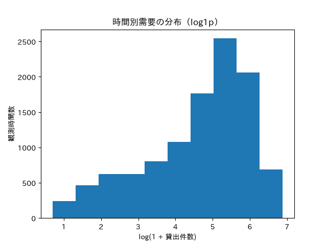

*時間別貸出件数をlog(1＋件数)で表示した分布。平均だけでなく右裾と低需要時間を確認するための図で、元NotebookのPNG出力を抽出した。*

勤務日は8時に479.95件/時間、17時に529.21件/時間のピークがあり、非勤務日は13時の387.82件/時間を中心に昼間へ広がりました。曜日別の平均は月曜190.39、金曜197.84、土曜196.67、日曜180.84件/時間ですが、日単位の平均だけでは勤務日の朝夕と週末の昼間という形の違いを捉えられません。

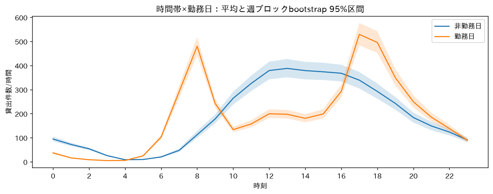

*勤務日の朝夕ピークと非勤務日の昼間集中。帯は週ブロックのブートストラップ95%区間であり、未観測期間や観測日の選択バイアスを含む保証ではない。*

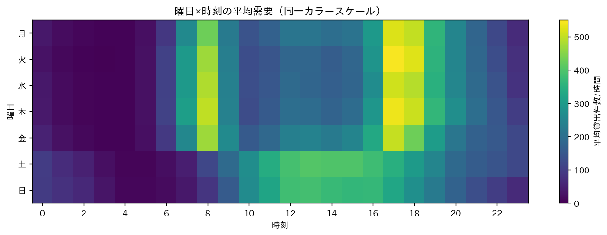

*同じカラースケールで比較した曜日×時刻の平均貸出件数。曜日平均が近くても時間帯の配置は異なる。*

季節コード1（1〜3月）が最も低く、コード3（7〜9月）が最も高い順位は両年で共通でした。2011年はそれぞれ71.91・186.99件/時間、2012年は159.48・281.74件/時間です。2012年の平均需要は2011年の1.654倍で、季節差と成長・気温・供給変化を独立に識別できません。

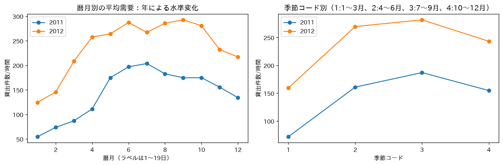

*月別・季節コード別の平均貸出件数。各月のラベルは1〜19日に限られ、2012年の水準上昇を季節差と混同しないため年を分けている。*

天候コード1は7,192件・平均205.24、コード2は2,834件・178.96、コード3は859件・118.85件/時間でした。コード3/1の未調整比は0.579です。コード4は1件のみで、平均164件を一般的な天候効果とは解釈しません。

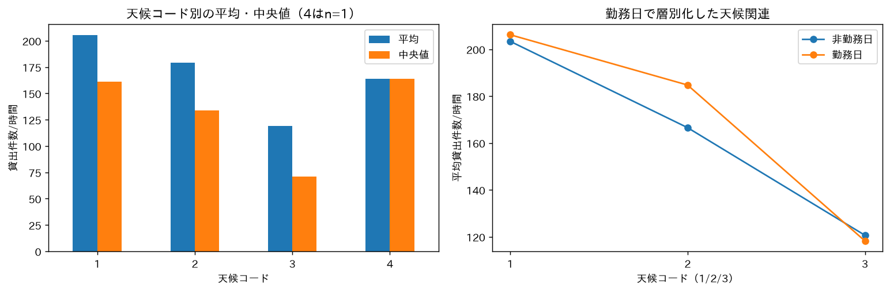

*天候コード別の未調整比較。コード3の低需要関連が見えるが、時刻・勤務日・月・気温の構成差をまだ調整していない。コード4は単一観測である。*

予測では、無作為分割を避けて2012年Q1〜Q3を順に検証する拡大型分割を選びました。各検証期間より前だけで学習し、`casual`・`registered`は目的変数の内訳なので特徴量から除外しています。時刻×勤務日平均ベースライン、Poisson損失の勾配ブースティング、log1p需要に二乗誤差を用いる勾配ブースティングを比較しました。

| モデル | Q1〜Q3の平均RMSLE | 固定Q4 RMSLE | 固定Q4 MAE（件/時間） |
|---|---:|---:|---:|
| 時刻×勤務日平均 | 0.5760 | 0.4273 | 71.66 |
| Poisson損失 | 0.3657 | 未評価 | 未評価 |
| log1p＋二乗誤差 | 0.3280 | 0.3152 | 40.02 |

Q1〜Q3の平均RMSLEでlog1pモデルを選び、2012年9月までの9,519件で学習、Q4の1,367件を固定holdoutにしました。Q4の実測平均243.19に対し予測平均221.60件/時間で、初回から平均21.59件/時間の過小予測が見えます。Q4を見てモデルを再選択・再調整していません。実測天候を入力する条件付き精度で、Kaggleのラベルなしtestや2013年以降の性能ではありません。

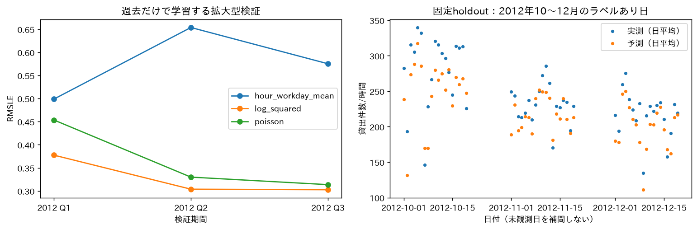

*過去のみで学習するQ1〜Q3のモデル比較と、固定Q4の実測・予測日平均。未観測日の需要は補間していない。*

### AIが生成した追加依頼1 — 天候関連の交絡と測定値・仕様の感度

**追加依頼（原文）**

> 天候コード3の需要低下が、時間帯・勤務日・月別の成長・気温の構成差によるものか確認してください。週内依存と過分散を考慮した調整後の比と区間を示し、天候4の単一観測、湿度0、風速0の扱い、モデル仕様への感度を検証してください。季節コードは暦月との対応で解釈し、因果効果とは区別してください。

**選定理由**: 未調整の天候3/1比0.579が時刻・月・気温の違いで説明される可能性と、年水準が約1.65倍変化していることをAIが未解決点に選びました。単純な天候別集計だけでは成長と天候の関連を分離できません。

**結果**: 天候4の1件を除き、負の二項GLMで時刻×勤務日、曜日、年月固定効果、気温のスプライン、湿度、風速を調整しました。週単位のcluster標準誤差を用い、87週を扱います。天候3/1の調整後平均需要比は**0.620（95%区間0.570〜0.675）**、天候2/1は0.938（0.913〜0.965）でした。

負の二項の固定alpha=1・0.5とPoisson、全測定値と湿度・風速とも正の観測だけという6仕様で天候3/1比を比較すると、0.617〜0.644、最大相対偏差3.77%、20%許容基準の`stable=True`でした。正の測定値だけの標本は9,550件です。ゼロ値除外は正しい補正と確定した処理ではなく、曖昧な測定値の扱いによる影響を調べる感度分析です。

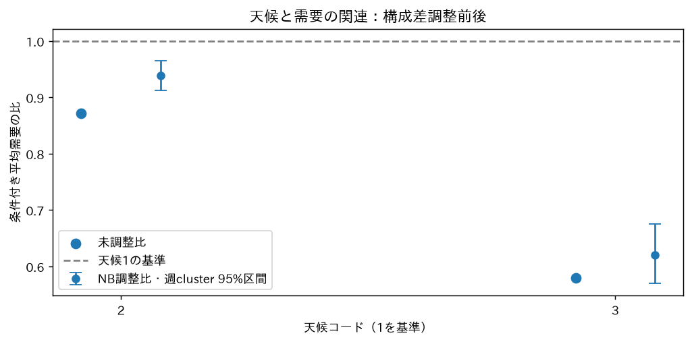

*天候1を基準とした未調整比と負の二項GLMの調整後平均比。区間は週clusterの95%区間で、因果効果の区間ではない。*

**証拠・残る限界**: `iteration-1`セル（実行番号8）の推定表・6仕様の感度出力と、証拠付き結論`result-3`が根拠です。低需要方向は検討した仕様で安定しましたが、年月固定効果に吸収された季節の独立効果は推定していません。負の二項alphaは固定で、分散分布の適合を証明したものではありません。未観測交絡、週を越える依存、天候と時間帯の効果修飾は残りました。

### AIが生成した追加依頼2 — 高需要の過小予測と月末への移植限界

**追加依頼（原文）**

> 固定holdoutのRMSLEが良好でも、成長や高需要時間の過小予測を隠していないか診断してください。週ブロックの指標区間とベースラインとの差、勤務日ピーク・高需要層別誤差を示してください。時間帯の結論を年・平均/中央値・祝日除外で感度分析し、毎月20日以降のtest.csvとの共変量分布差から一般化の限界を評価してください。holdoutを見てモデルを再調整しないでください。

**選定理由**: 天候関連の方向は6仕様で安定しましたが、初回holdoutには平均約21.6件/時間の過小予測が残りました。AIは、RMSLEだけで需要の右裾や将来移植可能性を判断することが結論を誤らせると考え、誤差の分解を選びました。

**結果**: holdoutの11週をブロックに1,200回のブートストラップ（seed=3402）を行いました。RMSLEの95%区間は0.286〜0.346、MAEは35.0〜46.0件/時間、ベースラインからのRMSLE改善幅は0.061〜0.162です。全体の予測総数は実測より8.88%少なくなりました。

| 誤差診断の対象 | 件数 | RMSLE | MAE（件/時間） | 平均誤差＝予測−実測（件/時間） |
|---|---:|---:|---:|---:|
| 高需要層（学習期間90%点の436件以上） | 232 | 0.2366 | 96.44 | −90.78 |
| それ以外 | 1,135 | 0.3290 | 28.49 | −7.45 |
| 勤務日のピーク時間群（7〜9・16〜19時） | 273 | 0.2512 | 77.61 | −60.90 |
| 天候コード1 | 778 | 0.2502 | 35.68 | −15.27 |
| 天候コード3 | 94 | 0.5594 | 85.13 | −61.43 |

勤務日8時では実測平均668.62に対し予測平均551.81件/時間、平均誤差は−116.81件/時間でした。**高需要層はRMSLEが小さくても、絶対量では大きく不足する**ため、容量計画の評価にRMSLEだけを使うことは不十分です。

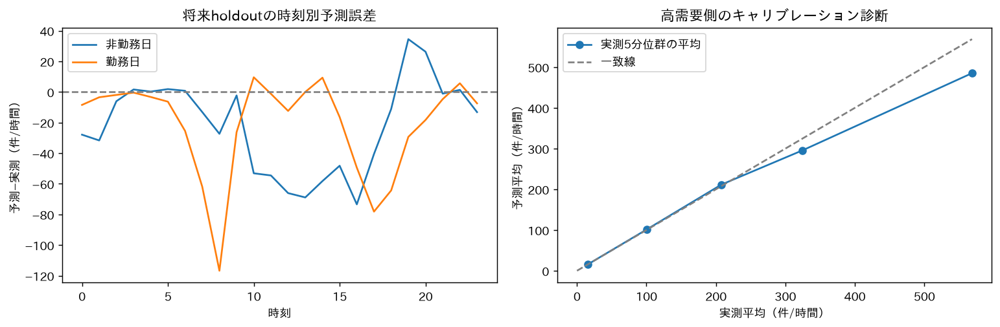

*左は勤務日・非勤務日別の予測−実測、右は実測需要の5分位群によるキャリブレーション診断。勤務日朝や高需要側に過小予測が残る。*

勤務日8時/非勤務日8時の比を、年、平均/中央値、祝日を含む/除くという8仕様で比べました。全仕様で1を上回りますが、比は4.269〜5.521、最大相対偏差28.15%、20%許容基準の`stable=False`です。「勤務日朝の需要が大きい」という方向は共通でも、差の大きさまで完全に頑健とはいえません。

さらにtestとtrainの月別平均を比較しました。同じ月の前半・後半の平均値差の絶対値を24か月で平均した値は、気温2.169、湿度5.209、風速1.522、勤務日割合0.075でした。これは全期間の単純な平均差ではなく、単位も独立には未検証です。月を等しく重み付けした天候3の割合も前半0.0789・後半0.0870でした。月末側に共変量の違いがあることは確認できても、ラベルがないため月末需要や精度の一致は検証できません。

**証拠・残る限界**: `iteration-2`セル（実行番号9）の層別表、時間別誤差、区間、感度結果、分布差と`result-5`・`result-7`が根拠です。区間は11週の条件付き標本変動に限られます。testは同じ採集元のラベルなしデータで、独立データによる予測検証ではありません。Q4への事後的な再チューニングは行っていません。

### AIが生成した追加依頼3 — 天候関連を全時間に一律適用しない

**追加依頼（原文）**

> 反復2では天候コード3の将来誤差が他の天候より大きいことが分かりました。全体の天候比を一律に適用しないため、勤務日と非勤務日、6〜19時とそれ以外で天候3の調整比が異なるか、週cluster区間付きで探索してください。各層の観測数を示し、仕様間の差、探索的分析であること、因果・将来一般化の限界を記録してください。

**選定理由**: 天候3のholdout RMSLEは0.559、天候1は0.250でした。AIは、全体の平均比0.620を勤務日・非勤務日や全時間帯に一律に適用する解釈を避けるため、限定的な効果修飾の探索を選びました。誤差が大きいこと自体を効果修飾の証明とはしていません。

**結果**: 勤務日と時間帯をそれぞれ修飾因子とする、別々の負の二項交互作用モデルを推定しました。

| 層 | 天候1の観測数 | 天候3の観測数 | 天候3/1の調整後平均比 | 週cluster 95%区間 |
|---|---:|---:|---:|---|
| 非勤務日 | 2,353 | 224 | 0.650 | 0.587〜0.719 |
| 勤務日 | 4,839 | 635 | 0.610 | 0.550〜0.676 |
| 0〜5・20〜23時 | 3,044 | 343 | 0.681 | 0.617〜0.751 |
| 6〜19時 | 4,148 | 516 | 0.582 | 0.528〜0.642 |

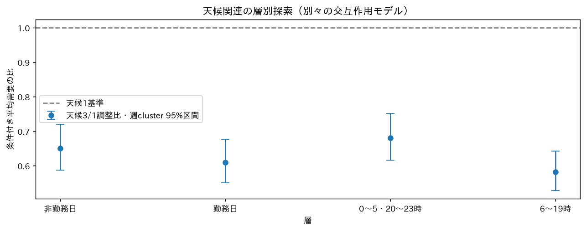

*勤務日別・時間帯別に探索した天候3/1の調整後需要比。二つの別々の交互作用モデルの結果であり、4層を単一モデルで同時比較したものではない。*

**証拠・残る限界**: `iteration-3`セル（実行番号10）の観測数・推定値・区間、証拠付き結論`result-6`が根拠です。各層で低需要方向は共通でしたが、同じ比を全時間に当てはめないという解釈に修正しました。事後的探索で、多重探索の調整はなく、層間差の確定的検定や因果推定ではありません。区間の重なりだけから差の有意性も判断していません。

**反復終了の判断**: AIは3回の上限に到達しました。残る重要な不確実性は、月末・将来年の需要ラベル、原票の定義、独立参照、天候4の追加観測がなければ解消できません。同じholdoutを使ったモデル探索の追加は独立性を損ねるため、分析を終了しました。

### 最終結論

観測されたラベルあり時間では、勤務日の朝夕と非勤務日の昼間で貸出の形が異なります。季節コード1（1〜3月）が低く、コード3（7〜9月）が高い順位は両年で共通ですが、2012年の水準上昇が大きく、季節だけの効果とはいえません。天候3の低需要関連は構成差・測定値の扱い・モデル仕様を調整しても残りますが、因果効果ではなく、時間帯等によって同じ比を使えるとも限りません。

時間順検証で選んだモデルは固定Q4のRMSLEを0.427から0.315へ改善しました。しかし、全体で約8.9%、高需要層で平均約90.8件/時間を過小予測しています。**「相対的に良い予測指標」と「ピーク需要に十分な容量判断」は一致しません。** 月末、2013年以降、別都市、実際の気象予報を入力する運用への性能保証は、この実験からはできません。

反復の価値は、最初の結論を単に補強したことではありません。天候の未調整差を調整後の関連へ限定し、RMSLE中心の評価に絶対誤差・過小予測を追加し、全体の天候比を一律に使わないという適用範囲の縮小へつなげた点にあります。

### 再現性と監査

Notebookは`benchmark/projects/kaggle-v020-kaggle-exp-34-bike-sharing/notebooks/kaggle-v020-kaggle-exp-34-bike-sharing.ipynb`、run_idは`v020-exp-34`です。Notebookのmetadataは、カーネル再起動後の全セル再実行、Jupyter MCPのみの実行経路、取得ファイル・ハッシュの再照合を記録しています。保存されたコードセルは全12セルに実行番号1〜12が付き、エラー出力はありません。

| 監査・実行項目 | 保存された結果 |
|---|---|
| 全コードセル | 12/12実行済み、未実行0、エラー0 |
| 図表 | 5コードセルにPNG9枚。本節では9枚を元出力から抽出 |
| 根拠付き結論 | 7セル。実行番号6〜10の出力へのevidence参照 |
| 完全監査 | `nbformat_valid=true`、`notebook_audit.ok=true`、`findings=[]`、`visual_findings=[]` |
| ライフサイクル | `completed`、実行中0、書込み待ち0、保持ロック0 |
| 初回実行 | `initial_exit_code=0`、1,161.4秒、終了理由`exited` |
| 追加確認 | `followup_exit_code=0`、95.6秒、終了理由`artifact_complete_cutoff` |

最終監査セル自身の出力では、監査時に末尾セルが実行中だったため11/12実行済みで、そのセルを除外するwarningが1件ありました。出力保存後の完全監査はNotebook metadataと`status.json`に12/12・指摘なしとして保存されています。この二段階を混同しません。

`initial.log`には、3反復、カーネル再起動、全12セルの再実行、最終`completed`の報告があります。`followup.log`は追加確認の方針と「Notebookが安定し監査を通過したため停止」というランナー記録だけで、新たな分析結果や再実行の完了報告はありません。初回・最終の安定化記録は同じサイズ1,039,717 bytes・同じmtimeであり、追加確認が第4の反復を実施したとは扱いません。

Notebookが記録するパッケージ版は、Kaggle 2.2.4、pandas 3.0.6、NumPy 2.5.3、Matplotlib 3.11.2、scikit-learn 1.9.1、statsmodels 0.15.0、nbformat 5.11.1です。予測モデルと初回ブートストラップはseed=34、holdout区間はseed=3402です。ただしJupytermindのコミット識別子・Python版はこの証拠集合で確認できず、Notebookのkernelspec・language_infoにも名称が空です。絶対パス、Kaggle認証、Jupyter MCP環境に依存するため、ファイルを別環境に置くだけで再実行できるとは主張しません。

なおmetadataの`phase_log`には、初回記述分析と反復2で終了時刻が開始時刻より前になる記録があり、完全監査metadata永続化の最後の開始イベントにも対応する終了イベントがありません。原因は指定証拠から確定できず、各フェーズの所要時間や完全な時刻順の証明には利用していません。これは最終セル出力・完了状態・実行数とは別の、ログ追跡上の限界です。

### 実行中の問題とJupytermind改善候補

データ取得失敗や最終的な分析中断は確認されません。一方、Notebookは以下の機能不足を再現して記録しています。いずれも現行実装の契約違反と断定せず、改善候補として`issue-candidate.json`に再現手順・期待/実際の挙動・影響・証拠・受け入れ条件を保存しました。修正実装は本実験の範囲外です。

| 分類 | 再現された挙動と影響 | 回避・最終状態 |
|---|---|---|
| 証拠出力型対応 | `insight_engine.record_insight`に、`setup`セルの実在するstream文字列を実行番号付きで渡すと`EvidenceMissingError`。print出力を根拠として扱えない | 主結果を`display(dict)`の`text/plain`として保存。プローブは`stream_present=True`・`stream_rejected=True` |
| 意味的不確実性の列挙 | `inferred`だけのmanifestに`unresolved_fields()`を呼ぶと0件。推定した辞書・単位を未検証項目として拾えない | manifest全体と`inferred`一覧を別途出力。Notebook自身も現行契約は`unknown`のみであると記録 |
| 監査対象の検出 | `_looks_like_insight_candidate('# 結論：証拠付き解釈')`は候補にならず、見出しなしでは候補になる。見出し付き結論の監査漏れの可能性 | 結論先頭の`#`を除き固定スロットで保存。最終完全監査では7結論を検出 |

証拠は`library-probes`セル（実行番号11）のコード・出力とNotebook metadataの`improvements`です。見出し検出についてNotebookには「修正前は7証拠セルがあってInsight件数0」という経緯も記されていますが、保存済みの最終監査は7件です。直接確認できる再現プローブと、記述された修正前の履歴は区別しています。

Jupytermind以外、または責任未確定の問題は次のとおりです。

| 切り分け先 | Notebook・ログに残る問題と対応 |
|---|---|
| Kaggle SDK | 2.2.4に`dataset_view`がない点を`dataset_metadata`で回避。取得descriptionが空のため辞書・単位は未検証のまま |
| 分析コード | pandasの`pivot_table(size)`による非一意列を`groupby.size`へ修正。Jupytermind関数の不具合とはしていない |
| MCP起動手順 | 新規Notebookディレクトリ不足を起動手順で回避 |
| MCP／Notebook書込み統合（責任未確定） | 実行中の最終セルを移動・自己書込みすると実行番号や出力保存が失われたとの記録。対象Notebookが非実行の状態で外部MCPセルから著者書込みする工程へ分離し回避。原因は未確定でJupytermind固有の不具合とは分類しない |
| Copilot CLI・外部ランナー | 初回は終了コード0。追加確認は成果物の安定・監査通過を理由にランナーが停止。CLI固有の失敗は指定ログで確認されない |

Notebookの「ベンチマークランナーは起動していない」という切り分け文は、保存された`initial.log`・`followup.log`の`[runner]`記録と整合しません。本節では外部ランナーの存在をログから確認し、当該文をランナー不存在の証拠には使いません。上記3候補は外部実行制御ではなく、Notebook内のライブラリ呼び出しで再現された機能不足として切り分けています。

### 残る限界

countは列名と加算恒等式から時間別貸出件数と解釈しており、固有利用者数・潜在需要・逸失需要ではありません。公開ミラーと公式競技ファイルの同一性、都市、天候辞書、気温・湿度等の単位、タイムゾーン、祝日暦をすべて一次資料で確認したわけではありません。

各月前半だけのラベルと時間軸の欠測があり、観測平均を月全体の総需要へ換算できません。2年だけでは季節、成長、供給変化を分離できず、木モデルも観測範囲外のtrendを外挿できません。天候4は1件で推定不能です。月末・将来年の安定性と将来天候の真値利用という3前提の警告は、最終Notebook監査の指摘0とは別に残っています。

週ブロックやcluster区間は依存への配慮ですが、未観測交絡・週を越えた依存・観測日の選択を解消しません。反復3は探索的で多重探索未調整です。したがって本実験の到達点は、**観測された需要パターンと固定期間の予測不足を、根拠と限界付きで記録したこと**であり、因果効果、月末需要、長期の運用精度を保証したことではありません。

## 実験35: Retail Sales（分析完了）

**課題**: 「Kaggleの小売売上データを使い、売上の季節性、店舗・商品カテゴリ差、急な変化を調べてください。集計粒度と欠損期間を確認し、再現可能な時系列図と比較を作成して、予測可能性の限界を日本語で説明してください。」

**初回プロンプト（全文・原文）**: 次のプロンプトは、データセットと問い、および共通制約からAIが自動生成したものです。人間が実験35の全文を個別に作成したものではありません。`initial-prompt.md` の全文を掲載します。

> Kaggleの小売売上データを使い、売上の季節性、店舗・商品カテゴリ差、急な変化を調べてください。集計粒度と欠損期間を確認し、再現可能な時系列図と比較を作成して、予測可能性の限界を日本語で説明してください。 Kaggle参照先: https://www.kaggle.com/datasets?search=retail+sales+time+series。インストール済みkaggle Python SDKを使い、NotebookのJupyter MCP実行セル内で`KaggleApi().authenticate()`、`dataset_list(search=...)`、`dataset_list_files(...)`、必要に応じて`dataset_download_file(...)`を呼び出し、Kaggle上の対応する公開データを検索・取得してください。owner/dataset slug、取得ファイル名、取得日、ファイルSHA-256をNotebookに記録してください。APIトークンをセル出力・Notebook・ログへ表示しないでください。分析・API取得コードの実行はJupyter MCPだけを使い、端末コマンド、subprocess、外部スクリプト起動、作業エージェントへの委譲は行わないでください。Kaggle APIで対応データを取得できない場合は、`/home/nahisaho/kaggle/experiments/white-paper.md`を確認してください。同じデータセットの公開CSVが同稿に明記されている場合だけ、そのURLへフォールバックしてください。対応するCSVを確認できない場合は、別データを推測で選ばず、取得失敗として記録してください。保存先は benchmark/projects/kaggle-v020-kaggle-exp-35-retail-sales/notebooks/kaggle-v020-kaggle-exp-35-retail-sales.ipynb としてください。run_idは `v020-exp-35` です。長時間処理の開始前にlifecycle.register_runを呼び、実行・書込みフェーズを記録し、終了時にcompletedまたはfailedを記録してください。データ定義manifest、分析前提manifest、意味的な異常検査、妥当な範囲の感度分析を使い、適用できない機能は理由を記録してください。図表はvisual_audit=Trueで監査してください。Notebookには「使用したJupytermindモジュール」節を設け、直接import・呼び出したモジュール名、関数名、使用目的を記録してください。間接利用は使用済みに含めないでください。Jupytermindの不具合または機能不足が疑われた場合は「Jupytermind改善候補」節を設け、分類、再現条件、期待する挙動、実際の挙動、影響、回避策、関係するセルとログを記録してください。Copilot CLI、Kaggle API、ベンチマークランナーに固有の問題とは切り分け、候補がなければ「なし」と記録してください。初回分析後、自分で結果を読み直し、結論に実質的な影響を与える未解決点があれば自然言語の追加依頼文を作成し、Notebookの「反復依頼履歴」に原文のまま記録して実行してください。価値ある追加分析がなくなるまで最大3回繰り返し、各反復の選定理由・結果・証拠・残る限界を報告してください。最後に全コードセルを上から再実行し、notebook_auditとライフサイクル状態を記録してください。

**使用したJupytermindモジュール**: Notebookの実行コードで直接import・呼び出しを確認できるものを示します。以下のセル番号はNotebook内の0始まりの位置です。描画以外の集計、ブロックbootstrap、予測比較、急変スクリーニングは、主にpandas・NumPyで組み立てた分析コードであり、Jupytermindが専用の予測モデルや変化点検定を提供したという意味ではありません。

| モジュール | 直接使用した関数・型・メソッド | 使用目的 |
|---|---|---|
| `ai_data_scientist.project_manager` | `resolve_project`, `ensure_notebook`, `ensure_data_dir` | プロジェクト、Notebook、データ保存先の準備 |
| `ai_data_scientist.language_router` | `detect_language` | 日本語指示の判定 |
| `ai_data_scientist.lifecycle` | `register_run`, `mark_execution_start`, `mark_execution_end`, `mark_write_start`, `mark_write_end`, `is_cancel_requested`, `mark_failed`, `mark_completed`, `get_run_status`, `wait_for_quiescence` | 実行・書込み・中止要求・終了状態と静止状態の管理 |
| `ai_data_scientist.ingestion` | `SourceSpec`, `ingest` | 取得CSVの読込みと切詰めの有無の確認 |
| `ai_data_scientist.cleaning` | `clean_dataset` | 重複除去の影響確認。削除は0行 |
| `ai_data_scientist.eda` | `explore` | 型、欠損、分布の基礎探索 |
| `ai_data_scientist.data_definition` | `FieldValue`, `build_manifest`, 返却manifestの`unresolved_fields` | 出典・粒度・単位・未確認定義の区別 |
| `ai_data_scientist.analysis_assumptions` | `Assumption`, `AnalysisAssumptionManifest`, `check_manifest` | 比較・集計・予測の前提と警告の記録 |
| `ai_data_scientist.data_quality` | `detect_anomalies` | 非欠損、非負、値域、二値制約の検査 |
| `ai_data_scientist.stats_analysis` | `correlation` | 2022年と2023年の月別形状の相関と日本語解釈 |
| `ai_data_scientist.sensitivity` | `SensitivityPlan`, `run_sensitivity` | 予測15仕様、急変9仕様、数量・金額代理3仕様の感度評価 |
| `ai_data_scientist.visualization` | `render_chart`, `build_image_output` | 図のPNG描画と実画像のNotebook出力 |
| `ai_data_scientist.insight_engine` | `extract_cited_value`, `record_insight` | 実出力の引用値抽出と、stream出力を根拠にした記録の最小再現 |
| `ai_data_scientist.notebook_audit` | `audit_visual_outputs`, `audit_notebook` | 図メタデータ欠落の最小再現と`visual_audit=True`の最終監査 |

Notebookの使用記録には制作補助の`enqueue_write`も記載されていますが、保存されたコードセル内での直接呼出しは確認できないため、この表には含めません。`record_insight`の直接呼出しはセル11の再現検査です。6段落の結論には制作補助で生成されたEvidence manifestが残っていますが、その生成処理を現存コードセルで再実行しているとは扱いません。

**初回指示**: 季節性、店舗・カテゴリ差、急変、予測可能性を、データの集計粒度と欠損期間を確認して評価するよう求めています。手法や追加依頼の内容は事前指定せず、AIに選択させています。共通制約は、Jupyter MCP内での取得・分析、出典とハッシュの記録、ライフサイクル管理、定義・前提manifest、意味的異常検査、感度分析、図表監査、最大3回の自律的反復、全コードセルの再実行です。

**データ取得**: Notebookセル1で`KaggleApi().authenticate()`と、`retail sales time series`・`retail store inventory forecasting`の2検索を実行しています。出力は認証成功、検索成功、エラー一覧なしです。検索結果に存在し、日付・店舗ID・商品ID・カテゴリを含む公開データとして、`anirudhchauhan/retail-store-inventory-forecasting-dataset`を選択しました。セル2のファイル一覧はCSVが1件で、`retail_store_inventory.csv`を選択しています。取得成功のため外部CSVへのフォールバックは使用していません。

| 項目 | Notebookに残る取得記録 |
|---|---|
| 出典 | `https://www.kaggle.com/datasets/anirudhchauhan/retail-store-inventory-forecasting-dataset` |
| ファイル | `retail_store_inventory.csv` |
| 初回取得日時 | `2026-10-01T21:48:03.215973+00:00`（UTC、日本時間では2026-10-02） |
| SHA-256 | `c7b6019887d85e6bb311a76da72560463e6bf269bfadbe4b326fbff3b1000468` |
| データ規模 | 73,100行・15列、2022-01-01〜2024-01-01 |
| 粒度 | 日付×店舗ID×商品ID。731日×5店舗×20商品で、毎日100行 |

SDKの`dataset_download_file`を用いた初回取得が記録されています。再実行時は原本が存在すれば再ダウンロードせず、保存された出典とSHA-256を照合する設計です。認証出力を抑制し、トークン値は指定証拠ファイルに表示されていません。

重要なのは、Notebookに取り込まれた出典説明が、このデータを**合成データ**と明記していることです。実店舗の売上を観測したデータではありません。また、通貨、`Price`の値引含有、税・返品の定義が未確認です。そのため主指標を`Units Sold`、すなわち販売数量に限定し、`Price×Units Sold`は未確認の金額代理値として扱いました。

**初回結果**: セル3〜6で基礎検査、定義・前提manifest、日次・月次・曜日・店舗・カテゴリの比較と図を作成しています。全15列の欠損数、完全重複、複合キー重複、欠損日、欠損キーはいずれも0でした。2024年1月は1日分しかないため、完全月・2022年と2023年の年比較から除外しています。日次合計、7日移動平均、月別の日平均を使い、月日数による合計の差を季節性と混同しない設計です。

初回の完全2年間の日平均販売数量は13,647.04個、日次変動係数は7.57%でした。月別日平均の最大・最小差は2022年4.86%、2023年5.56%ですが、年をまたいだ月別形状の相関は0.395でした。自己相関は7日で-0.0104、365日で0.0701と小さく、月別の大小だけで再現性のある季節性を主張しませんでした。

店舗の日平均はS001の2,703.39個からS003の2,766.62個で、最大・最小差は2.34%でした。カテゴリ合計の最大・最小差はFurnitureとElectronicsの3.29%ですが、1行当たり数量では2.04%でした。全20商品IDに5カテゴリ、全5店舗IDに4地域が出現しており、カテゴリや地域を固定属性として扱えないことが、追加確認につながっています。

急変は、当日より前の28日間の中央値とMADを用い、`|robust z|>3.5`で4候補を検出しました。これは確定した構造変化ではなく、追加検証の対象です。

| 日付 | 販売数量 | robust z | 前日比 |
|---|---:|---:|---:|
| 2022-03-15 | 11,057個 | -4.87 | -18.22% |
| 2022-06-21 | 17,239個 | 4.52 | +31.70% |
| 2022-08-09 | 11,533個 | -3.76 | -19.56% |
| 2022-08-20 | 11,792個 | -4.42 | -16.00% |

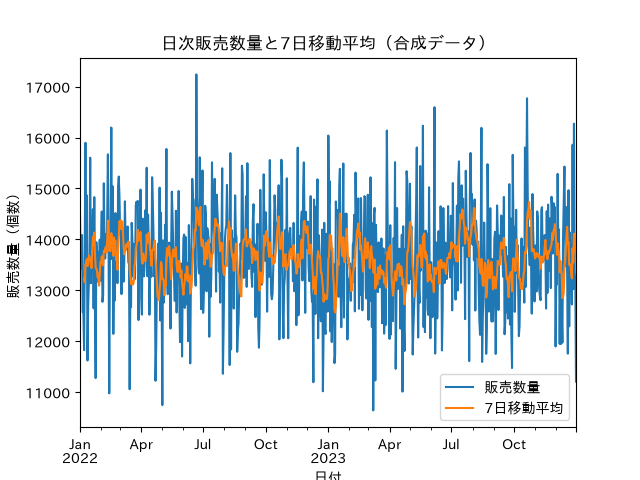

*合成データの全店合計の日次販売数量と7日移動平均。完全な2022年・2023年を対象とし、数量の変動と平滑化後の水準を分けて示す。*

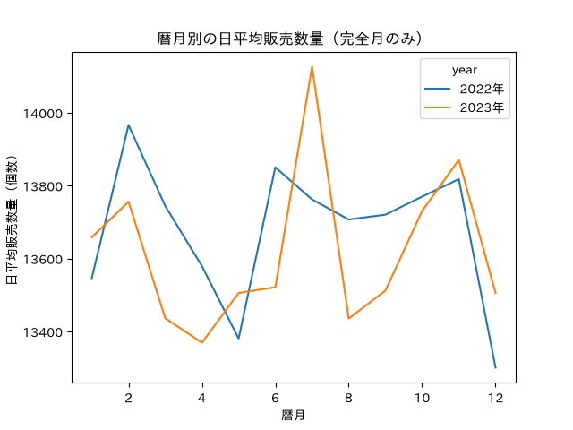

*完全月のみの月別日平均販売数量。月日数の違いを除いて比較しても、2年間の形状が強く一致するとはいえない。*

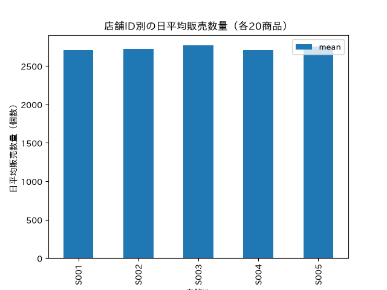

*各店舗20商品の日平均販売数量。点推定の差は小さく、差の不確実性は追加依頼1で検証した。*

**AIが生成した追加依頼1 — ラベル固定性・構成効果・季節性の再現性**

> カテゴリ総売上の差が販売行数の差によるものか、1行当たり販売数量の差によるものかを分解してください。同一商品のカテゴリ変更と同一店舗の地域変更を定量化し、Seasonalityラベルが暦の季節を意味するか確認してください。月別の形状が翌年にも再現するかと、店舗・カテゴリ差の不確実性を日単位のブロック再標本化で調べてください。

**選定理由**: 初回のカテゴリ合計差には行数差が含まれ、商品・店舗の属性ラベルも固定されていませんでした。この状態でカテゴリ需要や季節性を解釈すると結論が変わるため、AIが構成効果とラベルの意味を優先して検証しています。

**結果**: セル7で、同一店舗×商品の隣接日比較におけるカテゴリ変更率は79.97%、地域ラベル変更率は74.94%でした。後者は各店舗商品行の比較であり、実店舗が移転した割合ではありません。全731日にSpring・Summer・Autumn・Winterの4ラベルが同時に存在するため、`Seasonality`を暦の季節の代理変数には使いませんでした。

Furniture／Electronicsの合計比1.03294は、行数比1.01226×1行当たり数量比1.02044に分解できました。カテゴリ合計差3.29%のすべてを需要差と見なせず、母数補正後の記述差は約2.04%です。それでもカテゴリは固定商品群ではなく、毎日の行ラベルの比較にとどまります。

2022年と2023年の12か月の形状相関はr=0.3954、p=0.2033でした。月別平均の最大・最小差を1,000回のシャッフルと比較した探索的p値は、2022年0.2977、2023年0.1918です。7日循環ブロック・2,000回のbootstrapで、S001を基準にした4店舗比較とElectronicsを基準にした4カテゴリ比較の同時95%区間は、すべて0を含みました。

**再評価と残る限界**: 強い季節性や安定した店舗・カテゴリ差を積極的に支持する根拠は弱いと判断しています。ただし、2周期・月12組しかなく、弱い季節性や小さな差の不存在を証明したわけではありません。シャッフルはIID仮定、区間は選択した8比較と7日ブロックに依存します。証拠はセル7のラベル検査、乗法分解、相関、同時区間、シャッフル表です。

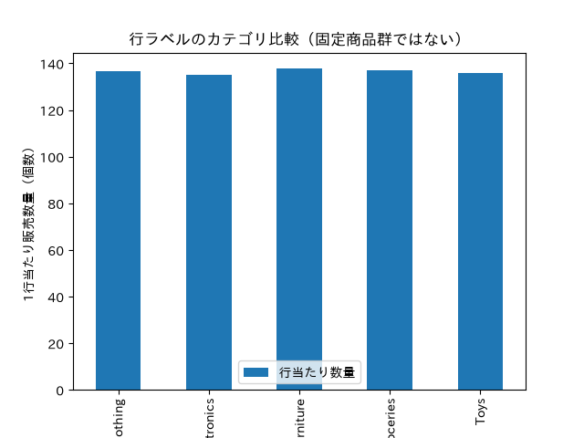

*カテゴリ別の1行当たり販売数量。合計差から行数の影響を除いた比較であり、固定の商品カテゴリ群の需要を表すものではない。*

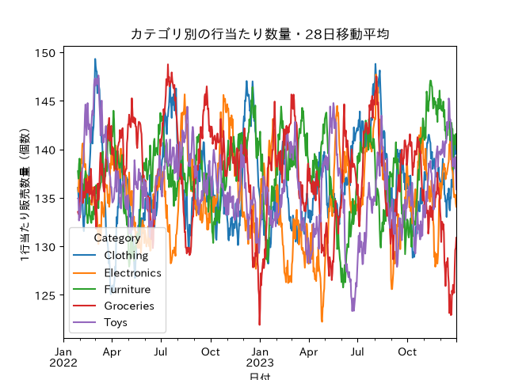

*行ラベルごとの1行当たり販売数量の28日移動平均。カテゴリ構成が日々変化するため、曲線を固定商品群の売上推移と解釈しない。*

**AIが生成した追加依頼2 — 時間順の予測比較と既存予測列の利用可否**

> 月や曜日のパターンが実際に予測へ役立つか、2023年の複数起点から14・28・56日先を時間順に検証してください。過去平均、直近平均、曜日平均、月平均、7日季節ナイーブを同じ期間で比較し、全店合計と店舗別の誤差、予測区間の幅と被覆率を示してください。Demand Forecast列に目的変数リークを疑う根拠があるかも確認し、使用可否を説明してください。

**選定理由**: 弱い自己相関や月形状の比較だけでは、暦情報の実際の予測価値を判断できません。また、既存の`Demand Forecast`が予測起点で利用できる情報なのか不明でした。AIは未来情報を使わない予測比較と、既存予測列の利用可否を確認しました。

**結果**: セル8で、2023年1月〜11月の各月初、11固定起点から14・28・56日間を予測しています。学習データは必ず起点より前に限定しました。WAPEは絶対誤差合計／実測数量合計×100です。過去平均は起点前の全期間平均、直近平均は直近28日平均、曜日・月平均も起点前の同じ暦区分の平均、7日季節ナイーブは直近7日の繰返しです。

| 手法 | 14日予測WAPE | 28日予測WAPE | 56日予測WAPE |
|---|---:|---:|---:|
| 過去平均 | 6.129% | 6.182% | 6.106% |
| 直近28日平均 | 6.129% | 6.306% | 6.264% |
| 曜日平均 | 6.163% | 6.212% | 6.146% |
| 月平均 | 6.141% | 6.221% | 6.123% |
| 7日季節ナイーブ | 7.974% | 8.220% | 8.759% |

28日予測は11起点×28日で308起点日ペアです。曜日平均・月平均は過去平均を改善せず、起点対応のMAE差の参考95%区間も0を跨ぎました。店舗別28日予測の過去平均WAPEは13.77〜14.52%で、全店合計6.18%より大きくなっています。全店合計は100商品店舗行の平均化を含むため、この低誤差を個別需要の予測しやすさとは読み替えられません。

過去の経験分布から作った95%範囲は、平均幅4,001.32個、評価期間の平均被覆率95.78%でした。これは平均の信頼区間ではなく、日次数量の経験的な予測範囲です。14・28・56日×5手法の15仕様を比較した感度評価は`stable=False`、基準の28日過去平均WAPEからの最大相対偏差41.69%でした。暦情報による改善は確認できませんが、すべての手法が同じ性能という結論ではありません。

`Demand Forecast`と当日の`Units Sold`の相関は0.996853、予測値−実測値の残差は-10〜20個、負の予測は673行でした。目的値から作られた可能性を疑う根拠はありますが、リークは未確証です。作成方法と起点での可用性が未確認なので、予測入力にも既存モデルの有効な比較対象にも使用しませんでした。

**再評価と残る限界**: この合成データ内では、複雑な暦パターンより過去平均が有効な基準でした。予測期間は起点間で重なる場合があり、11起点のbootstrap区間は参考値です。経験範囲は分布安定性を仮定し、推定誤差を補正していません。実市場や個別商品の需要予測精度への外挿はできません。証拠はセル8の予測表、店舗別誤差、経験範囲、起点対応差、感度report、既存予測列の残差です。

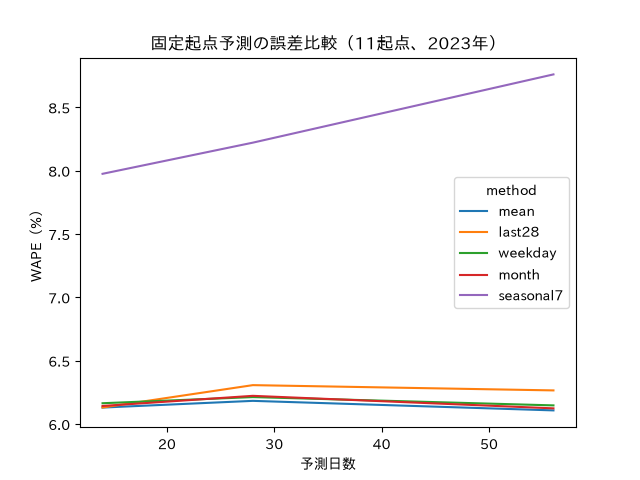

*2023年の11固定起点による14・28・56日予測のWAPE。過去平均に対する月・曜日情報の改善は確認されず、7日季節ナイーブの誤差は大きい。*

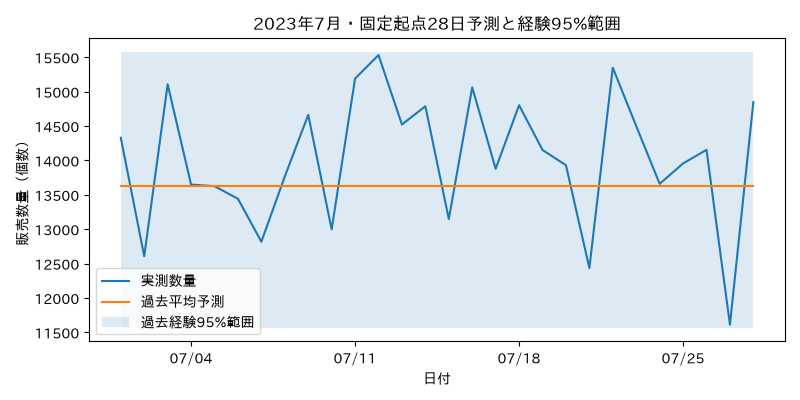

*2023-07-01起点の過去平均予測、実測数量、起点前の経験分布の95%範囲。幅のある日次不確実性を示す一例であり、この1起点だけで全期間の精度を評価していない。*

**AIが生成した追加依頼3 — 急変の頑健性と数量・金額代理の感度**

> 初回の急変候補について、過去14・28・56日の窓と閾値3・3.5・4を変えて再検出し、店舗ごとの寄与とその後14日間の持続性を比較してください。日次・完全週で候補がどう変わるか、販売数量とPrice×Units Soldの未確認金額代理値、割引を反映した代理値で年比較が変わるかも調べ、頑健でない結論を明示してください。

**選定理由**: 初回の4候補が窓・閾値依存の一時的変動なのか、持続する水準変化なのかは未解決でした。数量と金額代理で年比較の解釈が変わる可能性もあり、AIが仕様と指標の感度を検証しました。

**結果**: セル9で過去14・28・56日×閾値3・3.5・4の9仕様を、共通の674日間で比較しています。候補数は2〜22件に変わり、基準の4件に対する最大相対偏差は450%、感度評価は`stable=False`でした。

| 過去窓 | 閾値3 | 閾値3.5 | 閾値4 |
|---|---:|---:|---:|
| 14日 | 22件 | 15件 | 12件 |
| 28日 | 11件 | 4件 | 3件 |
| 56日 | 6件 | 2件 | 2件 |

2022-03-15と2022-06-21は9仕様すべてで検出されました。一方、初回4候補の後14日平均／前14日平均の変化は、順に-0.29%、+2.71%、-2.69%、-1.38%で、当日の大きな変動と同程度の恒久的変化が持続したとはいえません。店舗寄与も分解し、3月15日の減少ではS004が符号付き合計差の約36.20%、6月21日の増加ではS003が約41.45%を占めました。寄与率は相殺があると負や100%超にもなり得る指標で、原因の寄与率ではありません。

完全な月曜〜日曜週は104週で、過去8週・閾値3.5による候補は6件でした。週次では平均化と過去期間の違いが加わるため、日次候補と一致すること自体を要件にはしませんでした。

2023年／2022年の日平均変化率は、数量-0.419%、`Price×Units Sold`-0.918%、割引を百分率と仮定した`Price×Units Sold×(1−Discount/100)`-1.033%でした。方向は同じでも大きさは変わり、感度評価は`stable=False`、最大相対偏差146.60%です。初回の月平均を等重みで平均した年比較-0.437%とは集計方法が異なり、この-0.419%は各年の全日を同じ重みで比較した値です。

**再評価と残る限界**: 急変件数は仕様に敏感であり、全仕様で検出された日も正式な変化点や因果イベントとは断定できません。多数日・多数仕様を探索したスクリーニングで、多重検定調整済みの変化点検定ではありません。金額代理は通貨・値引含有・税・返品が未確認です。販売数量が始業時在庫を超える行は0、在庫と等しい行は369で、観測販売を潜在需要と同一視しません。証拠はセル9の候補数、検出日一致、持続性、店舗寄与、週次表、指標感度です。

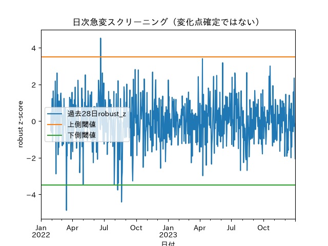

*過去28日の中央値・MADに基づくrobust zと±3.5の閾値。閾値超過は検証対象の候補であり、恒久的な水準変化の確定ではない。*

**反復の終了判断**: 3件の追加依頼は、Notebookセル16の「反復依頼履歴」に原文・選定理由・結果・証拠・限界として残り、セル7〜9のコードと出力が対応します。これらは初回セッション内でAIが生成・実行した反復であり、後日の`followup.log`が示す追加確認セッションとは区別します。3回の後に残ったのは生成過程、独立参照、実売上定義など追加計算だけでは解消できない問題で、さらに探索して有意な差を探すことはしないと記録しています。

**最終結論**: この公開合成データでは、日次の販売数量を記述し、再現する強い季節性、安定した店舗・カテゴリ差、急変の持続性を積極的に支持する証拠は弱いという結果でした。月・曜日情報は時間順の予測比較で過去平均を改善せず、急変候補数は窓と閾値に依存しました。ただし、季節性や差の不存在を証明したわけではありません。主な価値は「売上の特徴を見つけた」ことだけでなく、合成データ、属性ラベルの不安定さ、金額定義、予測列の可用性を点検し、主張できる範囲を販売数量の記述とデータ内の予測比較に限定したことです。

分析完了の判断は、`status.json`の`analysis_complete=true`、`final_completion.ready=true`と、Notebookの実行結果・反復履歴・最終状態に基づきます。実店舗への予測精度や実売上金額の分析まで完了したという意味ではありません。

**監査・再現性**: Notebookは`benchmark/projects/kaggle-v020-kaggle-exp-35-retail-sales/notebooks/kaggle-v020-kaggle-exp-35-retail-sales.ipynb`、run_idは`v020-exp-35`です。カーネル再起動後の全コードセル順次再実行が、Notebookの再実行記録と`initial.log`に記載されています。現存Notebookも実行番号1〜13の13コードセル、未実行0、エラー出力0、PNG8枚、Evidence manifest付き結論6段落を保持しています。

| 確認対象 | 証拠と結果 |
|---|---|
| 最終監査 | Notebookの`metadata.terminal_audit`は`ok=true`、`visual_audit=true`、13/13実行済み、`findings=[]`、`visual_findings=[]`。`status.json`の`final_audit`も同じ実行・図・結論数を報告 |
| 実行中の自己監査 | セル28の出力は13セル中12セル実行済み。監査セル自身が未完了のため末尾セルを除外するwarningが1件あり、最終完了後の監査と区別する |
| ライフサイクル | セル28の実出力とNotebook metadataで`completed`、実行中セル0、保留書込み0、保持ロック0 |
| 初回ランナー状態 | `initial_exit_code=0`、`initial_termination=exited`、所要1,263.5秒 |
| 追加確認ランナー状態 | `followup_exit_code=0`、所要95.1秒、終了理由は`artifact_complete_cutoff`。ログ末尾はNotebookの安定・監査通過を理由としたランナーによる停止 |
| 追加確認による変更 | 初回・最終の安定確認はともに850,494バイト、同じ更新時刻。追加確認ログには新しい分析結果や完了応答がなく、新規分析の成功を推測しない |
| 再現条件 | 原本SHA-256照合、乱数seed 35・3502、起点前データのみを使用。途中セルのみの再実行では根拠の実行番号が変わるため、全セルの順次再実行が必要 |
| 記録済みライブラリ | Kaggle 2.2.4、pandas 3.0.6、NumPy 2.5.3、matplotlib 3.11.2、nbformat 5.11.1（Notebook metadata） |

PNG8枚はNotebookの`image/png`出力から抽出し、各図の`chart_outputs.sha256`との一致を確認して`benchmark/figures/exp-35-*.png`に保存しました。本節は`figures/<filename>`で参照します。図のGlyph警告は0で、タイトル・軸・凡例・警告検査情報と画像ハッシュが記録されています。ただし、監査成功は図の統計的・科学的解釈の保証ではありません。

Notebookには定義・前提manifest、取得記録、集計表、反復履歴などを隣接`data/`へ保存するコードと保存先の記載もあります。本節ではそれら別ファイルを独立した証拠として読まず、指定Notebookのコード・出力・metadata、初回プロンプト、初回ログ、追加確認ログ、状態JSONのみを根拠にしています。Notebookのカーネル名・言語情報の一部は空欄で、実行環境全体の固定までは確認できません。また、制作補助で生成した文書・Evidence manifestを含め、空のNotebookから一度のRun Allだけですべて生成できることまでは示していません。

**限界と適用しなかった機能**: 観測期間は完全な2年で、弱い周期や外部環境が変わった後の性能を評価するには不十分です。カテゴリ・地域は固定属性ではなく、出典の生成方法・独立参照・実母集団との対応が不明です。販売数量は金額でも潜在需要でもなく、経験範囲には分布安定性の仮定があります。予測列のリークは疑いであり、因果効果も未識別です。

独立した第二データセットがないため異常の独立検証・データセット間比較は適用せず、ランダム割付や自然実験がないため販促・天候の因果推定も行っていません。MCP実行gatewayはカーネル内にホストtransportを提供できないため使わず、ホストのJupyter MCPを直接利用したと記録されています。PNG監査は表の見切れや意味の妥当性を保証しないため、表は単位・母数・完全月フラグなどをコードで補っています。未確認の定義を「検証済み」と扱わず、固定カテゴリ前提は棄却、実売上定義・将来の分布安定性は未検証の前提として残しています。

**Jupytermind改善候補**: セル11の最小再現で、次の2件が観測されています。分析を止める未解決エラーではなく、回避策を用いて最終成果物を完成させた後にも残る改善候補です。

| 分類・対象 | 再現・実際の挙動 | 期待する挙動・影響・回避策 |
|---|---|---|
| 監査の検査漏れ：`notebook_audit.audit_visual_outputs` | 実PNGを含む実行済みコードセルから`metadata.chart`を省いた最小Notebookを監査すると、出力は`[]` | 図の検査材料が不足する場合は「未検査」と明示してほしい。検査材料欠落と問題なしを区別できない影響がある。実験では全図に明示的メタデータとGlyph警告検査情報を付けて回避 |
| 証拠出力形式の機能不足：`insight_engine.record_insight` | 初回分析セルの`print`に存在する日平均`13647.038356164383`は抽出できるが、実行番号・引用値を渡すと`EvidenceMissingError`。セル11の出力は拒否が`True` | 通常の`stream.text`も実行根拠として扱ってほしい。print出力を根拠にInsightを記録できない影響がある。実験ではセル12に`display`の`text/plain`で最終証拠を出力して回避 |

候補1はPNGの文字欠落やラベル欠落そのものを実証したのではなく、監査メタデータの欠落が報告されない再現です。候補2の内部実装全体は指定証拠だけでは検証していませんが、実在するstreamの値を拒否する挙動は実出力で確認できます。再現手順、期待・実際の挙動、影響、証拠、受け入れ条件は、実験ディレクトリの`issue-candidate.json`に2件を含むJSONオブジェクトとして保存しました。GitHub Issueを作成したという意味ではありません。

**途中の失敗・回復と責任範囲の切り分け**: 次の事象はNotebookの改善候補節・制作補助記録に残っています。指定された初回・追加確認ログは短い要約で、個々の元の例外トレースまでは収録していないため、Notebook記録に基づく回復事象として扱います。

| 責任範囲 | 失敗内容 | 対応・最終状態 |
|---|---|---|
| Kaggle SDK呼出し側 | `dataset_list`に`page_size`を渡すと`TypeError` | 公開引数の`search`で検索し直して成功。Jupytermind候補ではない |
| Kaggle SDK機能照会 | `dataset_view`が未実装 | `dataset_metadata`の`info.description`を使用。API取得失敗とは区別 |
| 分析コードの列名 | インデックス名が「日付」の表に`Date`を指定し`KeyError` | 図用コピーを`rename_axis('Date')`にして解消 |
| Copilot CLI／MCPの準備 | 初回のNotebook作成で親ディレクトリが未作成 | bootstrapから`ensure_notebook`で準備 |
| 分析側のJSON比較 | 年の整数キーがJSONでは文字列になり、辞書直接比較が不一致。途中のlifecycleが`failed`だった記録あり | 同じJSON表現に正規化して比較。数値結果は変更せず、最終状態は`completed` |
| Jupyter MCPと実行中Notebookの更新連携 | 実行セルを外部から移動・再構成すると、MCPが出力を元の位置に保存できず、末尾セルの実行番号・出力が未保存 | 非アクティブNotebookへの制作補助で文書化し、最終セルを読取り監査に限定。再起動後に全13セルを再実行 |

Notebookは最後の事象を、モジュール単独ではなくMCPのセル位置・接続キャッシュと外部再構成の連携問題として切り分けています。指定証拠だけからJupytermindの単独不具合と断定はしません。また、追加確認の`artifact_complete_cutoff`は外部ランナーの終了方式であり、分析失敗の根拠ではありません。ベンチマークランナー固有の不具合は指定証拠からは確認されていません。途中の回復事象と、最終Notebookで分析が完了していることを区別して評価します。

## 実験36: Credit Card Fraud Detectionの不正頻度・分布と不均衡評価（分析完了）

**課題**: KaggleのCredit Card Fraud Detectionを用いて、不正取引の頻度、金額・経過時間の分布、正常取引との違いを調べる。極端なクラス不均衡に対してaccuracyだけに依存せず、匿名化特徴の解釈制約と検出性能の不確実性を示す。

**初回プロンプトの生成方法**: 以下は、データセットと問い、およびデータ取得・実行・監査・反復に関する共通制約から、AIが自動生成した初回プロンプトである。人間がこの全文を実験ごとに個別作成したものとして扱わない。`initial-prompt.md`の原文を改変せず掲載する。

**初回プロンプト（全文・原文）**:

```text
KaggleのCredit Card Fraud Detectionデータを使い、不正取引の頻度、金額・時刻の分布、正常取引との違いを調べてください。極端なクラス不均衡を前提に、accuracyだけに依存しない評価と図表を選び、匿名化特徴による解釈上の制約を日本語で示してください。 Kaggle参照先: https://www.kaggle.com/datasets/mlg-ulb/creditcardfraud。インストール済みkaggle Python SDKを使い、NotebookのJupyter MCP実行セル内で`KaggleApi().authenticate()`、`dataset_list(search=...)`、`dataset_list_files(...)`、必要に応じて`dataset_download_file(...)`を呼び出し、Kaggle上の対応する公開データを検索・取得してください。owner/dataset slug、取得ファイル名、取得日、ファイルSHA-256をNotebookに記録してください。APIトークンをセル出力・Notebook・ログへ表示しないでください。分析・API取得コードの実行はJupyter MCPだけを使い、端末コマンド、subprocess、外部スクリプト起動、作業エージェントへの委譲は行わないでください。Kaggle APIで対応データを取得できない場合は、`/home/nahisaho/kaggle/experiments/white-paper.md`を確認してください。同じデータセットの公開CSVが同稿に明記されている場合だけ、そのURLへフォールバックしてください。対応するCSVを確認できない場合は、別データを推測で選ばず、取得失敗として記録してください。保存先は benchmark/projects/kaggle-v020-kaggle-exp-36-credit-card-fraud/notebooks/kaggle-v020-kaggle-exp-36-credit-card-fraud.ipynb としてください。run_idは `v020-exp-36` です。長時間処理の開始前にlifecycle.register_runを呼び、実行・書込みフェーズを記録し、終了時にcompletedまたはfailedを記録してください。データ定義manifest、分析前提manifest、意味的な異常検査、妥当な範囲の感度分析を使い、適用できない機能は理由を記録してください。図表はvisual_audit=Trueで監査してください。Notebookには「使用したJupytermindモジュール」節を設け、直接import・呼び出したモジュール名、関数名、使用目的を記録してください。間接利用は使用済みに含めないでください。Jupytermindの不具合または機能不足が疑われた場合は「Jupytermind改善候補」節を設け、分類、再現条件、期待する挙動、実際の挙動、影響、回避策、関係するセルとログを記録してください。Copilot CLI、Kaggle API、ベンチマークランナーに固有の問題とは切り分け、候補がなければ「なし」と記録してください。初回分析後、自分で結果を読み直し、結論に実質的な影響を与える未解決点があれば自然言語の追加依頼文を作成し、Notebookの「反復依頼履歴」に原文のまま記録して実行してください。価値ある追加分析がなくなるまで最大3回繰り返し、各反復の選定理由・結果・証拠・残る限界を報告してください。最後に全コードセルを上から再実行し、notebook_auditとライフサイクル状態を記録してください。
```

**初回指示と実施方針**: 公開データの取得履歴を残し、全件の記述分析から、時間順ホールドアウトによる識別評価へ進んだ。初回ログの冒頭では、AI自身が時系列分割・重複行・判定閾値の確認方針を述べている。追加分析の具体的な依頼文は初回プロンプトで固定されておらず、AIが結果を読み直して選定し、Notebookに原文と理由を記録した。以下の「初回結果」は、初回CLI実行全体ではなく、Notebookの反復1より前の取得・記述・モデル評価セルを指す。3回の追加分析も初回CLI実行内で完了している。

**使用したJupytermindモジュール**: Notebookのimport、呼び出しコード、および「使用したJupytermindモジュール」節から確認した直接利用だけを示す。

| モジュール名 | 関数・メソッド名 | 使用目的 |
|---|---|---|
| `ai_data_scientist.project_manager` | `resolve_project`、`ensure_notebook`、`ensure_data_dir`、`enqueue_write` | プロジェクトと保存先の確定、データ格納、Notebook書込みの直列化 |
| `ai_data_scientist.language_router` | `detect_language` | 日本語の入力判定 |
| `ai_data_scientist.lifecycle` | `register_run`、`mark_execution_start`、`mark_execution_end`、`mark_write_start`、`mark_write_end`、`is_cancel_requested`、`get_run_status`、`mark_completed`、`mark_failed` | 実行・書込み・終了状態の管理とエラー経路の失敗記録 |
| `ai_data_scientist.ingestion` | `SourceSpec`、`ingest` | SHA-256を確認したローカルCSVを全件読み込み |
| `ai_data_scientist.eda` | `explore` | 型・欠損・基本統計の確認 |
| `ai_data_scientist.cleaning` | `clean_dataset` | 完全重複除外と除外行数の確認 |
| `ai_data_scientist.data_definition` | `FieldValue`、`build_manifest`、`DataDefinitionManifest.unresolved_fields` | データ定義・出典・未確認項目の記録、推定値の扱いの再現確認 |
| `ai_data_scientist.analysis_assumptions` | `Assumption`、`AnalysisAssumptionManifest`、`check_manifest` | 分析前後の前提、関連性の範囲、未検証リスクの明示 |
| `ai_data_scientist.data_quality` | `detect_anomalies` | 非欠損、非負金額・時間、ラベル値域の意味的検査 |
| `ai_data_scientist.sensitivity` | `SensitivityPlan`、`run_sensitivity` | 頻度・金額・モデル・閾値の有限グリッド感度分析 |
| `ai_data_scientist.visualization` | `build_image_output` | 作図したPNGのMIME出力、視覚監査用の再現入力作成 |
| `ai_data_scientist.insight_engine` | `extract_cited_value`、`record_insight` | 保存済み出力の数値抽出と根拠付きInsightの記録 |
| `ai_data_scientist.notebook_audit` | `audit_visual_outputs`、`audit_notebook` | 視覚監査の再現確認、`visual_audit=True`でのNotebook監査 |

`insight_engine`の呼び出しは対象Notebookの`persist_analysis_notebook()`内にあり、Notebook記録では、同一カーネルの制御Notebookからこの関数を実行している。図の構成はMatplotlib、モデル・評価はscikit-learn、順位効果量はSciPyで実装し、Jupytermindの間接利用や未使用機能を使用済みには含めない。

### データ取得と初回結果

Kaggle Python SDKで認証し、`dataset_list(search='credit card fraud detection')`と`dataset_list_files('mlg-ulb/creditcardfraud')`から対象と`creditcard.csv`を確認した。取得コードはCSV未保存時に`dataset_download_file`を呼び、必要ならZIP内の同名CSVを展開する。取得履歴は`method='Kaggle Python SDK'`であり、外部CSVへのフォールバックは使用していない。再実行時は取得済みファイルのハッシュを照合し、初回取得日時を保持した。

| 取得項目 | Notebookの記録 |
|---|---|
| owner/dataset slug | `mlg-ulb/creditcardfraud` |
| 公開参照先 | https://www.kaggle.com/datasets/mlg-ulb/creditcardfraud |
| ファイル名 | `creditcard.csv` |
| 初回取得日時 | `2026-10-01T22:05:57.916303+00:00` |
| 再実行時のAPI確認日時 | `2026-10-01T22:13:23.918729+00:00` |
| SHA-256 | `76274b691b16a6c49d3f159c883398e03ccd6d1ee12d9d8ee38f4b4b98551a89` |

NotebookはKaggle APIの公開説明と照合し、**2013年9月の欧州カード保有者による2日間の取引**として定義した。`Time`は最初の取引からの経過秒、`Amount`は取引金額、`Class`は1が不正・0が正常、V1～V28は匿名化されたPCA主成分である。通貨、実時計の起点、元の特徴、PCAのfit範囲、カード単位の独立性、不正ラベル確定遅延は未確認としてmanifestに残した。

全284,807行・31列を切り詰めずに読み込み、欠損、意味的スキーマ違反、非有限値、同一特徴に対する矛盾ラベルはいずれも0だった。完全重複は1,081行、金額0は1,825行である。重複・ゼロ・極端値は記録誤りと自動認定せず、主解析では保持した。

| 初回記述結果 | 正常取引 | 不正取引 |
|---|---:|---:|
| 件数 | 284,315 | 492 |
| 全取引に占める割合 | 99.8273% | 0.1727% |
| 金額中央値 | 22.00 | 9.25 |
| 金額平均 | 88.29 | 122.21 |
| 金額0の件数 | 1,798 | 27 |

不正金額は**中央値が低い一方で平均は高い**。したがって「高額ほど不正」と単純には言えない。金額は通貨未確認の元データ単位で示した。V14・V4・V12のCliff's deltaはそれぞれ約-0.8983、+0.8765、-0.8741で、分布差は大きいが業務要因や因果関係を意味しない。順位検定にはBH補正を用い、効果量の順位は全件の記述に限定し、モデルの特徴選択には使っていない。

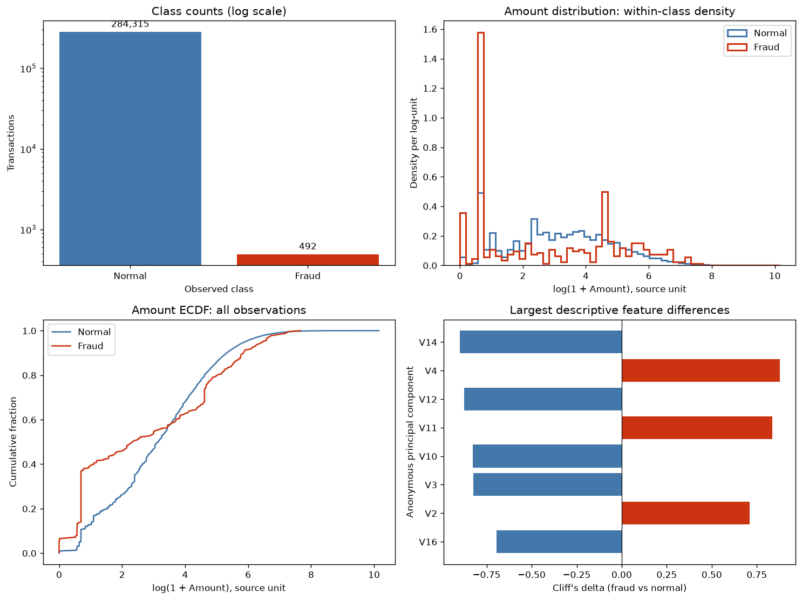

*正常・不正の件数を対数軸で示し、金額はクラス内密度と累積分布で比較する。右下の符号付き効果量は匿名化PCA主成分の差であり、取引の原因を説明するものではない。*

経過時間は0～47.9978時間だった。1時間幅の不正率の最大区間は経過26～27時間で、**1,752件中36件、2.0548%**。独立取引を仮定した参考Wilson 95%区間は約1.4879～2.8315%である。不正件数・クラス内時間構成比・全取引を分母にした不正率を分け、分母の少ない区間を見落とさない構成にした。「深夜に不正が多い」とは解釈できず、最後の区間は観測終了による部分区間として扱う。

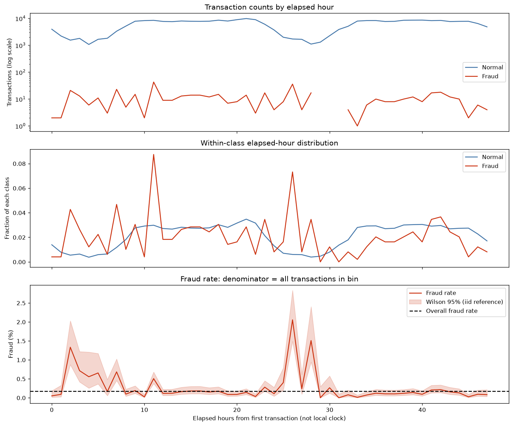

*最初の取引からの経過時間で比較した正常・不正の分布。下段の帯は独立性仮定下の参考区間であり、実際の現地時刻や長期の周期性を示さない。対数件数図の欠線は不正0件を表し、下段では0として表示する。*

**accuracyだけでは不正検出を評価できない。** 全件を正常と判定してもaccuracyは99.8273%になるが、不正recallは0である。識別評価にはAverage Precision（AP）、precision、recall、混同行列、正常1万件あたりの誤検知、検出不正金額の割合を併用した。APは非補間のAverage Precisionであり、台形積分によるPR-AUCとは区別した。

Timeの60%・80%分位点である120,396.0秒・145,247.8秒を固定境界として分割し、同一時刻が区間をまたがらないようにした。

| 区間 | 件数 | 不正件数 | 経過時間の範囲 |
|---|---:|---:|---|
| 学習 | 170,882 | 360 | 0～33.4431時間 |
| 検証 | 56,963 | 57 | 33.4433～40.3464時間 |
| テスト | 56,962 | 75 | 40.3467～47.9978時間 |

主モデルは`class_weight='balanced'`のロジスティック回帰で、Amountを`log1p`、Timeを時間へ変換し、標準化とモデルfitは学習区間だけで行った。SMOTEやunder-samplingは行わず、テストの自然なクラス構成を保持した。閾値は検証区間でrecallを重視するF2が最大になる値を選んだ。

| 時間順テストの評価 | 固定閾値0.5 | 検証F2で選んだ閾値 |
|---|---:|---:|
| 閾値 | 0.5 | 0.9999211812 |
| AP | 0.747370 | 0.747370 |
| precision | 4.36% | 81.25% |
| recall | 89.33% | 69.33% |
| TP / FP / FN | 67 / 1,471 / 8 | 52 / 12 / 23 |
| 正常1万件あたりのFP | 258.58 | 2.11 |
| 金額recall | 69.71% | 61.11% |

検証F2閾値では正常を正しく判定したTNは56,875件、調査対象は64件、ROC-AUCは0.9818だった。0.5閾値は見逃しを減らす一方で1,471件の誤検知を生む。balanced学習のスコアを較正済み不正確率とみなせないため、ほぼ1という閾値だけで異常や運用可否を判断しない。金額recallも「検出した不正取引金額の割合」であり、回収損失や利益ではない。

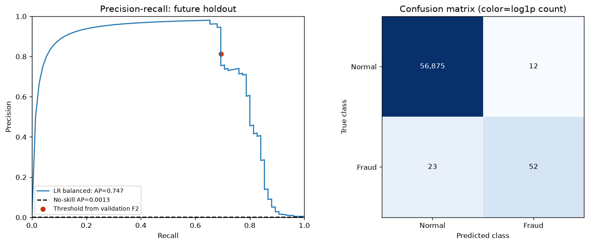

*検証F2で選んだ点と、テスト不正率を示す無情報ベースライン。混同行列は実件数を表示し、色だけをlog1pで変換して少数の誤検知・見逃しを読めるようにした。*

### AIが自律生成した追加依頼

**追加依頼1（原文）**: 「完全重複1,081行と金額の右裾が、不正頻度・平均と中央値の逆転・時間帯の偏りという結論を変えるか確認してください。重複保持／除外、金額上位1%の影響、1・2・4時間幅を比較し、経過時間の区間ごとの分母も示してください。」

**選定理由**: 完全重複の扱い、平均と中央値の逆転、時間集約の幅が記述結論を変える可能性があったため、AIは最初に集計の頑健性を検証した。

重複除外後は283,726件、不正473件となり、除外1,081行のうち不正は19行だった。不正率は0.17275%から0.16671%へ変わった。重複保持／除外と全期間／最初の24時間／それ以降の6仕様では、基準仕様からの最大相対偏差は0.1659で、設定した20%許容幅に収まった。

金額は重複保持／除外と、元の金額／全体99%分位での上側打切り／正額のみの6仕様を比較した。**全仕様で「不正の中央値は低く、平均は高い」という方向は維持**されたが、中央値差は-12.750～-5.295、最大相対偏差0.5847で`stable=False`だった。正額のみへの限定は母集団を変えるため、差の大きさまで頑健とは言えない。上位1%の確認は行削除ではなくwinsorizationであり、重複保持時の打切り値は1,017.970だった。

| 時間集約幅 | 不正率が最大の経過時間区間 | 不正件数 / 区間内全件数 | 不正率 |
|---|---|---:|---:|
| 1時間 | 26～27時間 | 36 / 1,752 | 2.0548% |
| 2時間 | 26～28時間 | 40 / 3,423 | 1.1686% |
| 4時間 | 24～28時間 | 52 / 9,158 | 0.5678% |

ピークはどの幅でも経過26時間を含むが、率の大きさは集約幅に依存した。証拠はNotebookセル8の除外報告・6仕様の感度出力・時間幅比較表にある。顧客IDがないため重複が誤記録か実取引かは断定できず、2日間の偏りを長期傾向へ一般化できない。

**追加依頼2（原文）**: 「初回の識別性能がモデルの線形性、正則化、重複行、時間順分割に依存しないか調べてください。固定した時間境界でモデルと重複保持／除外を比較し、金額・経過時間だけのモデルと層化ランダム分割を参考対照として示してください。テスト結果を使った閾値調整はしないでください。」

**選定理由**: 線形モデルだけでは、匿名化特徴の識別力と時系列外挿の限界を切り分けられないためである。初回の時間境界を固定したまま、モデルと重複処理の変更を評価した。

| モデル | 重複保持時のAP | 重複除外時のAP |
|---|---:|---:|
| ロジスティック回帰 C=1 | 0.747370 | 0.744307 |
| ロジスティック回帰 C=0.1 | 0.746563 | 0.742812 |
| Histogram Gradient Boosting | 0.748158 | 0.741076 |

6仕様のAPは0.741076～0.748158、最大相対偏差0.00842で、20%基準では`stable=True`だった。ただし閾値後のrecallは約68.92～75.68%であり、APの安定を誤検知・見逃しの同等性と読み替えない。重複除外時のテストは56,721件・不正74件となり、保持時と母集団が完全に同じではない。

TimeとAmountだけのモデルはAP=0.006141で、検証F2閾値ではテスト不正を検出できなかった。匿名化特徴を含むモデルより識別力が弱いことは示せるが、その差を業務上の説明には翻訳できない。重複除外後の層化ランダム分割による参考対照のAPは0.674782だった。時系列評価とはテスト構成が異なるため、差をリーク量や分割方式の優劣とは解釈しない。

証拠はセル9のモデル6仕様比較表・感度出力・2対照モデル表にある。各閾値は検証区間で選び、テストで最良だったモデルへの採用変更は行っていない。配布PCAの元のfit範囲やカード単位の重複は未確認のままである。

**追加依頼3（原文）**: 「テストの不正が75件しかない点と、検証F2閾値がほぼ1である点を再確認してください。検証区間だけでF1・F2・F4および正常取引の誤検知率上限を選び、将来側のprecision・recall・誤検知件数・金額recallを比較してください。固定モデル・固定閾値の層化および時間ブロックbootstrapで不確実性を示し、運用可能との断定を避けてください。」

**選定理由**: 判定閾値で正常顧客への負荷が大きく変わり、不正75件の点推定だけでは過度に確信する可能性があるため、AIはポリシー感度と区間推定を追加した。

| 検証区間で選んだポリシー | テストprecision | テストrecall | FP | FN | 調査対象件数 | 金額recall |
|---|---:|---:|---:|---:|---:|---:|
| F1最大 | 96.08% | 65.33% | 2 | 26 | 51 | 60.28% |
| F2最大 | 81.25% | 69.33% | 12 | 23 | 64 | 61.11% |
| F4最大 | 73.97% | 72.00% | 19 | 21 | 73 | 62.64% |
| FPR上限0.01% | 94.44% | 68.00% | 3 | 24 | 54 | 60.99% |
| FPR上限0.05% | 73.97% | 72.00% | 19 | 21 | 73 | 62.64% |
| FPR上限0.1% | 56.07% | 80.00% | 47 | 15 | 107 | 68.98% |

FPRの上限は**検証区間での制約**であり、将来側にも同じ上限が成り立つ保証ではない。6ポリシーでrecallは65.33～80.00%、FPは2～47件へ変わり、recallの最大相対偏差は0.22449で`stable=False`だった。検出を増やすと調査対象も増え、金額recallの変化は件数recallと同一ではない。

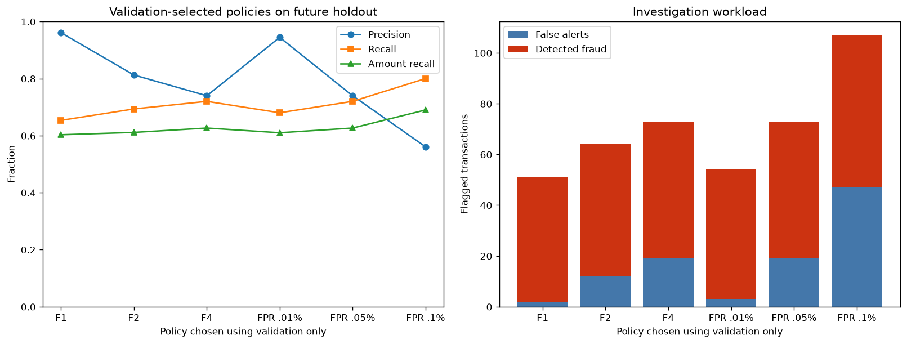

*同じモデルに検証区間だけで選んだ6ポリシーを適用した比較。左はprecision・recall・金額recall、右は調査対象を誤検知と検出不正に分け、検出改善と正常取引への負荷を同時に示す。*

固定モデル・固定F2閾値に対し、seed=36で層化bootstrapと1時間単位の時間ブロックbootstrapを各200回行った。テスト区間の時間ブロックは8個、除外された反復は両方式とも0だった。

| 指標の95%参考区間 | 層化bootstrap | 時間ブロックbootstrap |
|---|---|---|
| AP | 0.654274～0.854916 | 0.565280～0.863208 |
| precision | 0.725464～0.900041 | 0.603679～0.934253 |
| recall | 0.613000～0.800000 | 0.582880～0.766061 |
| 金額recall | 0.320893～0.875897 | 0.488570～0.857252 |

時間依存を近似したAP区間は広く、点推定0.7474だけでは不確実性を表せない。証拠はセル10のポリシー表・感度出力・bootstrap分位点表と負荷図にある。モデル再学習・閾値再選択は行っていないため、これらの区間はその不確実性を含まない。8ブロックには部分時間区間もあり、顧客単位依存や将来の不正率変化は評価できない。

**反復終了の理由**: 最大3回を実施し、残る課題は長期・顧客ID付きの独立データ、実コスト、スコア較正を要することが明確になった。同じCSVを追加探索しても解消できないため、3回で終了した。外部の追加確認ログには再評価する方針だけがあり、4回目の具体的な依頼文や追加分析結果は記録されていない。

### 結論

取得データでは不正は492/284,807件、0.1727%である。高いaccuracyだけでは検出能力を評価できず、金額では「不正の中央値は低いが平均は高い」という方向が6仕様で維持された。経過26時間を含む区間の不正率上昇は集約幅を変えても残ったが、実時計の時間帯や長期傾向を示すものではない。

匿名化特徴を含む時間順モデルの初回APは0.7474で、検証F2閾値では不正52件を検出し、誤検知12件・見逃し23件、precision 81.25%・recall 69.33%だった。モデル・重複処理によるAPの変化は小さい一方、判定ポリシーによる負荷とrecallの変化、不正75件からの区間推定には無視できない幅がある。**「不正の識別信号がある」と「実運用に十分な性能がある」は別の結論**であり、後者は確認していない。

本実験でAIが有効に機能した点は、初回の頻度・平均・APを列挙するだけでなく、重複と分布の裾、モデルと分割、閾値と調査負荷へ問いを展開したことである。分析完了は`status.json`の`analysis_complete=true`、`final_completion.ready=true`と、Notebookの実行結果・3回の反復履歴・最終監査記録から判断した。

### 再現性と監査

Notebookは`benchmark/projects/kaggle-v020-kaggle-exp-36-credit-card-fraud/notebooks/kaggle-v020-kaggle-exp-36-credit-card-fraud.ipynb`、run_idは`v020-exp-36`である。本節の結果の証拠はこのNotebook、`initial-prompt.md`、`initial.log`、`followup.log`、`status.json`だけで、既存稿は書式の参照に限定した。セル番号はNotebook配列の0始まりであり、execution_countとは区別する。

Notebookの再実行メタデータは`kernel_restarted=true`、`ordered_execution=true`、executorは`Jupyter MCP execute_cell`を記録している。保存後の最終監査とランナー監査はいずれも`nbformat_valid=true`、全12コードセル実行済み、未実行0、エラー0、図表セル3、PNG4枚、根拠付きInsight 7件、findings・visual_findingsとも0だった。最終監査セル自身の保存出力はそのセルの実行中に検査した11/11を示すが、保存後のNotebookメタデータ・監査節と`status.json`では12/12に更新されている。

ライフサイクルの保存状態は`completed`で、active_cell_executions・pending_notebook_writes・locks_heldはすべて0。分析前提manifestの警告5件は独立性、時間ブロック近似、PCAのfit範囲、現在の運用への代表性、実コストとの対応に関するもので、実行エラーとは区別した。

初回CLIはexit code 0、841.6秒、終了理由`exited`。追加確認は95.2秒で、終了理由は`artifact_complete_cutoff`、ログ末尾にもNotebookが安定して監査を通過したためプロセスグループを停止した記録がある。`followup_exit_code=0`だけをもって追加CLIが自然終了したとは扱わない。初回と最終のNotebook安定性記録は同じサイズ868,061 bytes・同じmtimeで、追加確認によるNotebook更新は確認できない。

再現時は分析セルを上から実行し、本文・図メタデータを`pending_sections`・`pending_charts`へ蓄積する。対象Notebookを非実行状態にして同一カーネルの制御Notebookから`persist_analysis_notebook()`を実行し、保存後に最終監査セルを実行する手順が記録されている。元の取得日時を保持し、SHA-256を照合する。`stable`は最初の仕様に対する最大相対偏差が20%以下という記述基準で、統計的有意性や運用同等性の判定ではない。

図表はNotebookのPNG出力4枚を再生成・改変せずに抽出した。英語の軸・凡例、日本語の説明、図メタデータがあり、保存された`missing_glyphs`は空だった。ただし次節の再現結果が示すとおり、視覚監査の合格だけで画像妥当性を保証しない。

### 実行途中の問題とJupytermind改善候補

**最終成果物に取得失敗・未実行セル・エラー出力は残っていない。** ただしNotebookの改善候補節には、初期実行で対象Notebookを実行しながら`enqueue_write`で同じファイルにMarkdownを追加すると、Jupyter MCPの同期で出力・execution_count・概要Markdownの保存が不整合になったと記録されている。本文と図メタデータをメモリに蓄積し、対象非実行中に制御Notebookから保存する手順で回避した。独立再現は示されていないため、Jupytermind単体の確定不具合ではなくMCP同期との相互作用として扱う。

同節はDataFrame構築エラーを利用者の分析コードの修正済み問題、CLI・filesystemの許可ルート不一致を外部実行環境の問題と記録している。短い初回ログ・追加確認ログにはこれらの完全な例外トレースがなく、詳細や影響量は追加推定しない。Kaggle SDKの`dataset_view`不存在とメタデータの`info`ネストはSDK仕様への対応であり、Kaggle取得失敗やJupytermind不具合とはみなさない。Notebookには「ベンチマークランナーは起動していない」とも書かれているが、両ログには`[runner]`の停止記録があるため、外部ランナーの不在は断定しない。

一方、セル11（execution_count=11）には外部CLI・Kaggle APIに依存しない小さな再現入力と、次の実行出力が保存されている。

```text
改善候補再現ログ: {'inferred_fields_returned': [], 'chart_without_metadata_findings': []}
```

| 分類 | 再現された挙動 | 影響・期待する改善 |
|---|---|---|
| データ定義の機能不足候補 | `FieldValue(..., 'inferred')`を含むmanifestに対し、`unresolved_fields()`が空リストを返す | 推定された定義を未検証として列挙できない。unknownだけを返す既存APIとの互換性を保ちつつ、inferredも含めて確認できる経路が必要 |
| 視覚監査の機能不足候補 | 不正なPNGバイト列を`build_image_output`で包み、chart metadataなしで`audit_visual_outputs(..., (0,))`へ渡してもfindingが空 | メタデータ欠落・画像読取不能を監査が見逃す。問題を区別できるfindingと明示的な画像検証が必要 |

本解析では通貨等を推定せずunknownとして残し、実際の図にはラベル・凡例・glyph情報を付与して確認した。改善候補は既存仕様違反と断定せず、再現コード・期待挙動・実際の挙動・影響・証拠・受け入れ条件を`issue-candidate.json`に保存した。外部ランナーの打切り、CLIの許可ルート、SDK仕様、利用者コードの問題はこの2候補に混在させていない。

### 残る限界

データは2013年の欧州2日間に限られ、現在の不正率や運用性能を代表するという前提はmanifestで棄却した。カードIDがなく、同一顧客の反復・顧客分離・取引独立性・重複の真偽は検証できない。PCAの元の特徴とfit範囲も不明で、モデル側で前処理を学習区間に限定しても、配布特徴の作成段階のリークを否定できない。

全件EDAを見た後の探索評価であり、独立外部検証は行っていない。独立参照データがないためデータ間の照合や外部検証は適用せず、その理由をNotebookに記録した。実時刻、通貨、不正ラベル確定遅延、取引金額と損失の関係も未確認で、時間帯の因果説明や損失削減額は提示できない。

bootstrapは固定モデル・固定閾値への条件付き区間で、再学習・閾値選択・顧客依存・長期ドリフトを含まない。実際の調査容量、誤検知と見逃しの費用、較正性能が未指定のため、最適な運用閾値や実装可能性を断定しない。またNotebookのkernelspec・language_infoには実質的な環境名がなく、指定証拠だけでは依存パッケージの版まで固定した完全な環境再現性は確認できない。

## 実験39: Forest Fires（分析完了）

**課題**: 「Kaggleの森林火災データを使い、焼失面積と気象・季節・火災危険指数の関係を調べてください。」

**初回プロンプト（全文・原文）**: 次のプロンプトは、データセットと問い、およびベンチマークの共通制約からAIが自動生成したものです。人間が実験39の全文を個別に作成したものではありません。`initial-prompt.md` の全文を掲載します。

> Kaggleの森林火災データを使い、焼失面積と気象・季節・火災危険指数の関係を調べてください。ゼロが多く歪んだ分布を確認し、外れ値に頑健な要約と図表を自分で選び、関連を発火原因と解釈しないよう日本語で説明してください。 Kaggle参照先: https://www.kaggle.com/datasets?search=forest+fires+weather。インストール済みkaggle Python SDKを使い、NotebookのJupyter MCP実行セル内で`KaggleApi().authenticate()`、`dataset_list(search=...)`、`dataset_list_files(...)`、必要に応じて`dataset_download_file(...)`を呼び出し、Kaggle上の対応する公開データを検索・取得してください。owner/dataset slug、取得ファイル名、取得日、ファイルSHA-256をNotebookに記録してください。APIトークンをセル出力・Notebook・ログへ表示しないでください。分析・API取得コードの実行はJupyter MCPだけを使い、端末コマンド、subprocess、外部スクリプト起動、作業エージェントへの委譲は行わないでください。Kaggle APIで対応データを取得できない場合は、`/home/nahisaho/kaggle/experiments/white-paper.md`を確認してください。同じデータセットの公開CSVが同稿に明記されている場合だけ、そのURLへフォールバックしてください。対応するCSVを確認できない場合は、別データを推測で選ばず、取得失敗として記録してください。保存先は benchmark/projects/kaggle-v020-kaggle-exp-39-forest-fires/notebooks/kaggle-v020-kaggle-exp-39-forest-fires.ipynb としてください。run_idは `v020-exp-39` です。長時間処理の開始前にlifecycle.register_runを呼び、実行・書込みフェーズを記録し、終了時にcompletedまたはfailedを記録してください。データ定義manifest、分析前提manifest、意味的な異常検査、妥当な範囲の感度分析を使い、適用できない機能は理由を記録してください。図表はvisual_audit=Trueで監査してください。Notebookには「使用したJupytermindモジュール」節を設け、直接import・呼び出したモジュール名、関数名、使用目的を記録してください。間接利用は使用済みに含めないでください。Jupytermindの不具合または機能不足が疑われた場合は「Jupytermind改善候補」節を設け、分類、再現条件、期待する挙動、実際の挙動、影響、回避策、関係するセルとログを記録してください。Copilot CLI、Kaggle API、ベンチマークランナーに固有の問題とは切り分け、候補がなければ「なし」と記録してください。初回分析後、自分で結果を読み直し、結論に実質的な影響を与える未解決点があれば自然言語の追加依頼文を作成し、Notebookの「反復依頼履歴」に原文のまま記録して実行してください。価値ある追加分析がなくなるまで最大3回繰り返し、各反復の選定理由・結果・証拠・残る限界を報告してください。最後に全コードセルを上から再実行し、notebook_auditとライフサイクル状態を記録してください。

**使用したJupytermindモジュール**: 以下は、分析対象Notebookのコードセルで直接import・呼び出しを確認できるモジュール、関数・型、使用目的です。Notebookの使用記録には別の制御Notebookからの呼び出しも含まれていますが、本節では対象Notebook自身のコードに限定し、間接利用や制御Notebookだけの呼び出しを使用済みに数えません。

| モジュール | 直接呼び出した関数・型 | 使用目的 |
|---|---|---|
| `ai_data_scientist.project_manager` | `resolve_project`, `ensure_notebook`, `ensure_data_dir` | プロジェクトと保存先を解決し、Notebook・データ保存ディレクトリを準備 |
| `ai_data_scientist.language_router` | `detect_language` | 日本語での分析指示を判定 |
| `ai_data_scientist.lifecycle` | `register_run`, `mark_write_start`, `mark_write_end`, `is_cancel_requested`, `mark_execution_start`, `mark_execution_end`, `mark_completed`, `get_run_status` | 実行・書込み・キャンセル確認・完了状態を記録。例外時の処理には `mark_failed` も記述されているが、保存出力で失敗状態への遷移は確認されない |
| `ai_data_scientist.ingestion` | `SourceSpec`, `ingest` | 取得CSVを10万行上限で読み込み、切詰めがないことを確認 |
| `ai_data_scientist.eda` | `explore` | 全列の型、欠損、数値・カテゴリの概要を検査 |
| `ai_data_scientist.cleaning` | `clean_dataset` | 感度分析で完全同一行を除去し、517行から513行への変化を記録 |
| `ai_data_scientist.stats_analysis` | `correlation` | 気温と面積の比較用Pearson相関と日本語解釈を生成。主分析の順位相関・区間推定はSciPyなどで別途実装 |
| `ai_data_scientist.data_definition` | `FieldValue`, `build_manifest`, `DataDefinitionManifest.unresolved_fields` | 出典、定義、単位、実際の型と、確認済み・推論・不明の区別を記録 |
| `ai_data_scientist.analysis_assumptions` | `Assumption`, `AnalysisAssumptionManifest`, `check_manifest` | 観察的関連、独立性、重複、季節、少数群の扱いを明示し、未確認の重要前提を検出 |
| `ai_data_scientist.data_quality` | `detect_anomalies` | 欠損、非負条件、値域、許容カテゴリの意味的な異常を検査 |
| `ai_data_scientist.sensitivity` | `SensitivityPlan`, `run_sensitivity` | 全件・正面積の16対象について各8仕様を評価し、相対偏差と安定性を出力 |
| `ai_data_scientist.visualization` | `render_chart`, `build_image_output` | 原尺度・log1p尺度のヒストグラムを生成し、PNGをNotebook出力へ格納。月別・相関区間の図はMatplotlibで描画後にPNG出力化 |
| `ai_data_scientist.notebook_audit` | `audit_notebook(visual_audit=True)`, `audit_visual_outputs` | 実行・エラー・証拠・図表を監査し、図表メタデータ欠落の最小再現を検査 |

**初回指示**: ゼロの多さと歪みを確認し、頑健な要約・図表を自分で選び、気象・季節・危険指数との関連を発火原因に読み替えないよう求めました。取得履歴、定義・前提manifest、意味検査、感度分析、図表監査、ライフサイクル、最大3回の自律的反復も共通制約です。中央値・順位相関・月調整・空間グリッド再標本化などの具体的な実装や、追加依頼の内容はAIが結果を読んで選びました。

**データ取得**: NotebookではKaggle SDKで認証し、`forest fires weather`、`forest fires`、`forestfires` の3検索を行いました。検索結果に存在する `elikplim/forest-fires-data-set` を選び、`dataset_list_files` で公開ファイルを確認して `dataset_download_file` で `forestfires.csv` を取得しています。認証・検索・一覧・取得の保存出力は成功を示し、CSVフォールバックは使用していません。

| 項目 | Notebookの記録 |
|---|---|
| Kaggle slug / ファイル | `elikplim/forest-fires-data-set` / `forestfires.csv` |
| 取得日時 | `2026-10-01T22:24:49.845608+00:00`（UTC、日本時間では2026-10-02） |
| ファイルサイズ / 形状 | 25,478 bytes / 517行・13列 |
| SHA-256 | `0d6586a1fa52f55bef48578aef14eb97273f1e9330e1a53423df497a77065253` |
| 列 | `X`, `Y`, `month`, `day`, `FFMC`, `DMC`, `DC`, `ISI`, `temp`, `RH`, `wind`, `rain`, `area` |
| 欠損 / 無限値 / 完全同一行 | 0 / 0 / 4行 |

NotebookはUCIのメタデータAPI `https://archive.ics.uci.edu/api/dataset?id=162` から辞書を取得し、PortugalのMontesinho parkのデータとして定義を照合しました。これは辞書の参照であり、分析CSVを外部データに置き換えたものではありません。面積はha、気温はCelsius degrees、湿度は%、風速はkm/h、降雨は辞書表記の `mm/m2` をそのまま記録しています。Kaggle版と原典CSVのバイト同一性は未確認です。保存された指定ファイルにAPIトークン値の表示は確認されません。

定義manifestでは年・実日付・火災IDの不在、標本の選択過程、ゼロの記録過程を不明とし、行単位と指数の単位については推論と区別しました。ゼロを「火災なし」と決めず、完全同一行も別火災の可能性を排除できないため主分析では保持しています。意味的な異常検査の出力は0件でしたが、独立性は未確認の重要前提として `unresolved_conclusion_critical_assumption` の警告が残っています。異常0件は、データ定義や独立性がすべて解決したという意味ではありません。

**初回結果**: AIは全517記録と正面積270記録を分け、中央値・四分位範囲・上位分位点、原尺度とlog1p尺度の分布、月別構成、気象4変数と危険指数4変数のSpearman順位相関を評価しました。

| 推定対象 | 件数 | ゼロ面積 | 中央値（ha） | Q1–Q3（ha） | 平均（参考、ha） |
|---|---:|---:|---:|---:|---:|
| 全記録 | 517 | 247件（47.7756%） | 0.52 | 0–6.57 | 12.8473 |
| 正面積のみ | 270 | 0件 | 6.37 | 2.14–15.4225 | 24.6002 |

最大面積は1090.84ha、最大1記録が総面積の16.4232%、上位5記録が38.0827%を占めました。全記録の95百分位は48.714ha、99百分位は194.7648haで、平均が典型的な面積を表しにくい強い右歪みがあります。最大値を誤記と決めて削除せず、中央値・四分位範囲と対数表示を優先しました。

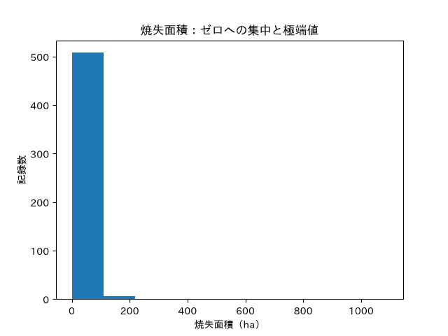

*全517記録の原尺度ヒストグラム。ゼロ付近への集中と1090.84haまでの長い右裾を同時に示す。NotebookのPNG出力を抽出。*

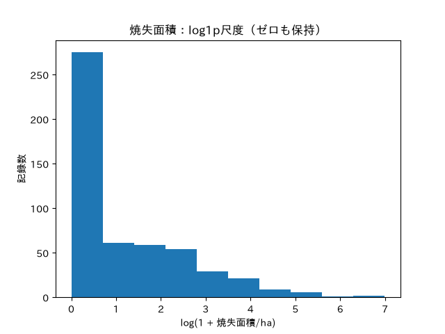

*log(1 + 焼失面積/ha)による表示。ゼロを残したまま小・中面積の分布を読みやすくしており、元の面積値の削除や補完ではない。*

未調整の順位相関は全件・正面積とも小さく、16比較で最大の絶対値は正面積のISIのρ＝−0.110034でした。Benjamini–Hochberg補正後の最小q値は0.517487で、16比較すべて0.05を上回ります。気温は全件ρ＝0.078696、正面積ρ＝−0.061405と符号が反転し、DMCも全件0.071920に対して正面積0.007646でした。比較用Pearsonの気温相関は0.097844、p＝0.026101ですが、これは頑健な主分析ではなく、弱い未調整の線形関連です。検定のp値だけで気温が原因だとは解釈していません。

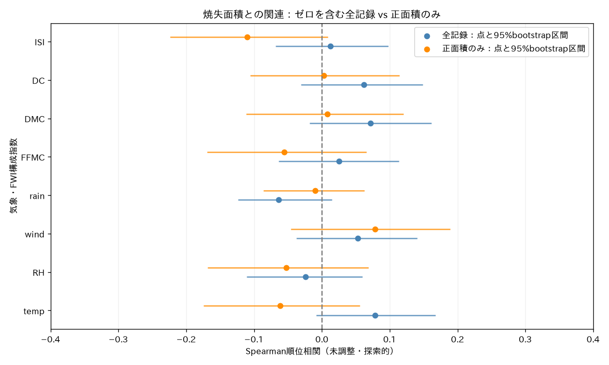

*全記録と正面積のみのSpearman相関および1,500回の通常bootstrapによる探索的95%区間。降雨の正面積群は175回が定数再標本で未定義となり、区間は計算可能な再標本に限定した参考値である。*

月別記録数は8月184件、9月172件に偏り、1月と5月は各2件、11月は1件でした。12月は9件すべて正面積です。北半球の暦季節で集計した正面積中央値は冬9.77ha（19件）、春7.82ha（24件）、夏4.25ha（125件）、秋6.935ha（102件）で、冬が大きく見えました。しかし、これは選択された火災記録内の面積比較であり、月・季節ごとの発火率でも危険度でもありません。

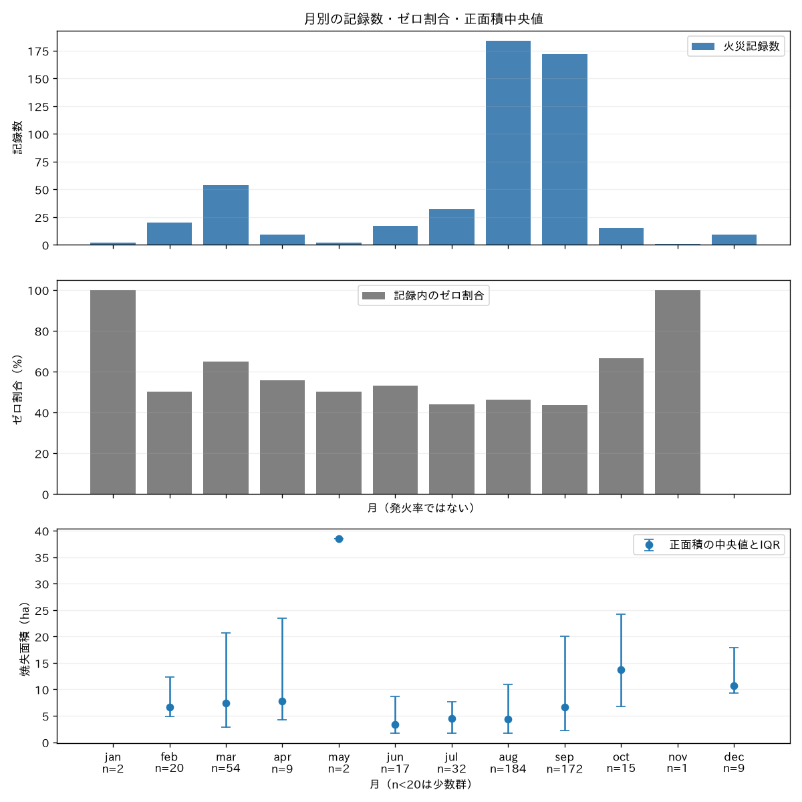

*上段は記録数、中段は記録内のゼロ割合、下段は正面積の中央値とQ1–Q3。横軸のnは全記録数であり、下段の正面積標本数とは異なる。1月・11月は正面積がなく点を表示していない。*

**AIが生成した追加依頼1 — 上位尾部・重複・月調整への感度**

> 初回では全件の順位相関が弱く、正面積だけでは気温の符号が反転しました。上位1%の大面積、完全同一行、月による交絡の扱いを変えても「強い関連を確認できない」という結論が維持されるか調べてください。全件と正面積だけの推定対象は混ぜず、近ゼロの相関に対する相対偏差を頑健性と誤解しないでください。

**選定理由**: 上位5記録が総面積の約38%を占め、気温の符号も推定対象によって変わったため、極端値・完全同一行・月の構成を変えることが結論に影響するとAIが判断しました。

**結果**: 全件・正面積の各8変数について、重複保持／除去、上位尾部保持／99百分位まで、未調整／月調整の8仕様、計128評価を実行しました。重複除去では517行から513行へ4行減りました。月調整は全体順位から月ごとの平均順位を引き、その残差同士を相関させる方法です。128評価の最大絶対係数は0.188610で、強い単調関連を支持しないという範囲では初回の見方が維持されました。

一方、正面積のDMCは未調整0.007646から月調整0.187856へ変わり、気温も−0.061405から0.072187へ変わりました。「関連がない」「すべての仕様で不変」とまでは言えません。DMCの正面積分析では `max_relative_deviation` が23.667997、`stable=False` ですが、基準係数がほぼゼロのため相対偏差が大きくなります。AIは絶対差0.180964と係数の大きさを併記し、相対偏差のフラグだけで実質的な不安定性を判断しませんでした。根拠はNotebookセル14（実行番号10）の出力です。月以外の交絡、記録間依存、非単調関係や交互作用は未解決として次の反復へ進みました。

**AIが生成した追加依頼2 — 季節の小標本と空間依存**

> 季節別では冬の正面積中央値が夏より高く見えますが、12月は9件すべて正面積で、季節の標本数も大きく違います。季節ごとの中央値の区間と各月を一つずつ除いた変化を調べ、冬が危険という一般化が適切か検討してください。また、同じ空間グリッドの記録をまとめて再標本化して、初回の相関区間と月調整後DMCの関連が依存性の扱いに左右されるか確認してください。

**選定理由**: 季節中央値の見かけの順位、12月の特殊な構成、通常bootstrapの独立性仮定が結論に関わるためです。火災ID・実日付がないので、空間グリッドを火災イベントそのものとみなさず、依存性に対する感度分析として選びました。

**結果**: 2,500回の通常bootstrapによる季節別正面積中央値の探索的95%区間は、冬6.38–13.05ha、春4.61–15.98763ha、夏2.77–6.43525ha、秋5.065–11.06haでした。12月を除くと冬の正面積は19件から10件となり、中央値は9.77haから6.61haへ、冬の全記録中央値は5.38haから0haへ変わりました。季節差を「冬は普遍的に危険」と一般化する根拠にはなりません。

空間グリッド単位の1,000回bootstrapでは全件36グリッド、正面積33グリッドを再標本化しました。正面積の月調整DMCの探索的95%区間は0.066482–0.348488、未調整ISIは−0.200157–−0.006448でした。初回の通常bootstrapではISI区間が−0.224004–0.009125とゼロを含んでいたため、区間推定の仕様によって判断が変わります。AIは「初回の区間がゼロを含むから無関連」とせず、DMCとISIを手法依存の弱い探索的信号として整理しました。根拠はセル17（実行番号11）の出力です。同一日・同一火災の依存、年別変動、燃料・消火などの交絡はグリッド再標本化では解決しません。

**AIが生成した追加依頼3 — DMCの信号の限定と降雨の疎データ**

> 月調整後の正面積DMCに弱い正の信号が残りました。月内順位という別仕様、8月・9月を除く仕様、空間グリッドを一つずつ除く仕様で確認し、特定群に依存する探索的信号かを整理してください。併せて降雨は正値が8記録しかないため、その8件の構成と正面積割合の正確区間を示し、雨の影響がないと誤解しない説明に修正してください。気象・指数の四分位帯別中央値も確認し、順位相関の弱さが非単調関係の不存在を保証しないことを明記してください。

**選定理由**: 反復2で区間推定に依存する信号が出た一方、初回の降雨bootstrapでは正面積群の175/1,500回が未定義になりました。DMCの信号を過度に一般化せず、疎な降雨を「無関連」と読む誤りを避けるため、AIが最後の追加依頼を作成しました。

**結果**: 正面積のDMCについて、全体順位の月調整と月内順位の代替仕様を比較しました。

| 仕様 | 正面積件数 | 全体順位の月調整係数 | 月内順位による係数 |
|---|---:|---:|---:|
| 正面積全件 | 270 | 0.187856 | 0.207575 |
| 8月除外 | 171 | 0.275131 | 0.247082 |
| 9月除外 | 173 | 0.183243 | 0.199530 |
| 8・9月のみ | 196 | 0.154774 | 0.180705 |
| 8・9月除外 | 74 | 0.347447 | 0.281820 |

各グリッドを一つずつ除いた月調整係数も0.169080–0.245231と正でした。符号は代替仕様でも維持される一方、大きさは月の構成によって変化するため、弱い正の関連の探索的信号として残しています。4,000回の月内置換ではρ＝0.187856、p＝0.003999でしたが、追加分析で対象を選んだ後の未補正p値です。月内交換可能性を仮定し、空間依存を同時に補正していないため、確証的な検定とは扱いません。

降雨正値は8件、そのうち正面積は2件でした。3月1件、7月1件、8月6件という構成で、正面積の2件はいずれも8月です。正面積割合は25.0%、二項分布の正確95%区間は3.1854–65.0856%と広く、雨なし509件の正面積割合52.6523%と点推定だけで比較しても結論は定まりません。探索的Fisher検定のp＝0.160223も「降雨の影響がない」という証拠ではありません。そもそも比較しているのは火災記録内の正面積割合であり、火災発生率ではありません。

気象・指数の四分位帯別中央値も一様な単調パターンではありませんでした。例えば湿度の4帯における正面積中央値は8.45、5.60、4.88、8.24haで、単純な順位相関だけでは表れない形があり得ます。ただし、これは月や他変数を調整していない探索的要約で、非線形関係を確証したわけではありません。根拠はセル20（実行番号12）の出力です。

**反復停止理由**: 最大3回の追加分析を実施しました。残る不確実性は火災ID、年・実日付、ゼロの記録過程、非火災日・曝露分母、燃料・消火・発火原因など、同じCSVの追加加工では得られない情報に由来します。AIは高自由度のモデルや追加の群選択を増やしても根拠を改善しにくいと判断し、4回目の依頼を作成せず停止しました。

**最終結論**: このCSVの焼失面積はゼロが約47.8%を占め、極端に大きな少数記録に総面積が左右されるため、全件と正面積を分け、中央値・四分位範囲・対数図を重視することが有用でした。気象・危険指数との未調整の単調関連は全体に弱い一方、正面積のDMCには月調整後の弱い正の探索的信号が残りました。季節の順位は少数記録と月の構成に左右され、降雨の比較は8件という疎データのため不確実です。「どの変数も影響がない」「冬が危険」「雨は無関係」とは結論しません。観察された火災記録内の関連であって、発火原因、火災発生率、因果効果を推定した実験ではありません。

**監査・再現性**: 根拠は指定されたNotebook、`initial-prompt.md`、`initial.log`、`followup.log`、`status.json` に限定しました。セル番号はNotebookの0始まりの位置で、実行番号とは区別しています。別のデータファイルや制御Notebookは本節の独立した証拠として読み取っていません。

Notebook末尾には、クリーンkernelからの上から順の再実行と、永続化後の監査が記録されています。最終コードセルの実行番号は16で途中の15がありませんが、15コードセルすべてに実行番号と保存出力があります。再実行時のクリーンkernel使用はNotebookの記録に基づくもので、本節作成時に分析やAPI取得を再実行したものではありません。

| 確認項目 | 保存された証拠 |
|---|---|
| 分析完了 | `status.json` の `analysis_complete=true`、`final_completion.ready=true`、全完了条件がtrue。Notebookに3回の反復・根拠付き結論・監査・完了状態が存在 |
| コード・構造 | 最終監査はnbformat妥当、15/15コードセル実行済み、未実行・エラーセルなし |
| 結論の根拠 | 実行番号14の最終根拠出力を引用するEvidence manifestが6件 |
| 図表 | セル10・11・12の計4枚。`visual_audit=True` の永続化後監査で図表所見0件、各図セルにタイトル・軸・凡例・glyph確認のメタデータあり |
| ライフサイクル | セル35の出力は `completed`、実行中セル0、書込み待ち0、保持ロック0、理由null |
| 初回実行 | 外部実行記録は終了コード0、765.1秒、`exited`。`initial.log` は取得・3回の反復・再実行・監査の要約を記録 |
| 追加確認 | 外部実行記録は終了コード0、94.9秒、`artifact_complete_cutoff`。`followup.log` は再評価方針と、Notebookが安定し監査に合格したためランナーが停止した旨を記録 |

初回のNotebook内監査では、監査セル自身が実行中のため実行済み14/15件と完了待ち警告が出ました。末尾の永続化後監査と `status.json` の最終監査では15/15件、所見なしとなっています。ただし、前提manifestの独立性警告は別の検査であり、最終根拠セルでも残っています。Notebook監査の所見0件は統計的前提の全面的な解決を意味しません。

初回と追加確認後のNotebookはともに402,413 bytes、記録された更新時刻も `2026-10-01T22:26:57.404610+00:00` で一致しています。`followup.log` には新たな自然言語の分析依頼や追加結果はないため、別の反復分析が実施されたとは数えません。追加確認の停止は外部ランナーの成果物判定によるもので、Copilot CLIが通常終了したことや、分析が失敗したことに読み替えません。

**失敗・Jupytermind改善候補**: 指定ファイルからは、データ取得や最終分析の失敗は確認されません。一方、Notebookセル24（実行番号13）には、**図表メタデータ欠落を可視化監査が検出しない**という不具合・機能不足の候補が再現されています。

`visualization.build_image_output` で作ったPNG出力を実行済みセルに入れ、`metadata.chart` を付けないNotebookを構築して `notebook_audit.audit_visual_outputs(probe, (0,))` を呼ぶと、出力は `chart_metadata_present=false`、`actual_findings=[]` でした。タイトル・軸・凡例・glyph確認情報の欠落を通知してほしいという期待に対し、監査が所見なしを返しています。期待仕様への適合は指定ファイルだけでは確定できないため、確定済み不具合とは断定せず改善候補とします。

影響は、`visual_audit=True` の所見なしだけでは図表メタデータの記録漏れを見つけられないことです。今回の図表では実描画時のglyph警告を捕捉し、メタデータを明示付与したうえで最終監査セルでもキーの存在とglyph欠落なしを検査して回避しました。この候補はKaggle API、Copilot CLI、外部ランナーを呼ばないNotebook内の最小再現に基づき、それら固有の問題とは切り分けています。分類、再現手順、期待・実際の挙動、影響、証拠、受け入れ条件は本実験の `issue-candidate.json` に保存しました。

Notebookの改善候補節には、最初の保存先ディレクトリ未作成エラーを `project_manager.ensure_notebook` で解消したとの記述もあります。ただし、指定されたログには例外の詳細がないため、Jupyter MCP側の前提条件だったというNotebookの説明を超えて原因を検証できません。最終Notebookを作成できており、この件をJupytermindの不具合候補には含めません。Kaggle取得失敗やCopilot CLI固有の不具合は指定証拠から確認されません。

**限界**: ゼロが丸め・測定限界・記録慣行のいずれによるものかは不明で、非発火と同一視できません。年・実日付・火災ID・非火災日・曝露分母がなく、独立性、時間依存、標本選択、火災発生率を検証できません。グリッドclusterは真のイベントclusterの代替を保証せず、月調整でも燃料・消火・原因など未観測交絡は残ります。季節の少数群、降雨正値8件、大火災の少数性、追加選択後の未補正検定、多重な仕様探索を踏まえ、DMCやISIの信号は探索的に限定します。弱い順位相関は非単調・閾値・交互作用の不存在を証明しません。

独立した第2データがないため、データ間の検証・比較は適用していません。正規分布を前提とした自動外れ値削除、原因・発火分類・発生率推定、年別・時間ラグ分析も行っていません。CSVにはFFMC/DMC/DC/ISIしかなく、存在しない総合FWI列を生成した分析はありません。可視化監査と証拠manifestは構造・追跡可能性を支えますが、統計的・科学的妥当性を自動保証するものではありません。

## 実験40: World Happiness（分析完了）

**課題**: 「KaggleのWorld Happinessデータを使い、幸福度と所得、健康、社会的支援などの指標の関係と地域差を調べてください。年次・国別データの構造を確認し、ランキング差の不確実性と因果推論の限界を日本語で示してください。」

**初回プロンプトの生成**: 以下の初回プロンプトは、データセットと問い、および取得・実行・監査・反復に関する共通制約からAIが自動生成したものです。人間が実験40の全文を個別に作成したものではありません。`initial-prompt.md` の原文を省略せず掲載します。

**初回プロンプト（全文・原文）**

> KaggleのWorld Happinessデータを使い、幸福度と所得、健康、社会的支援などの指標の関係と地域差を調べてください。年次・国別データの構造を確認し、ランキング差の不確実性と因果推論の限界を日本語で示してください。 Kaggle参照先: https://www.kaggle.com/datasets?search=world+happiness+report。インストール済みkaggle Python SDKを使い、NotebookのJupyter MCP実行セル内で`KaggleApi().authenticate()`、`dataset_list(search=...)`、`dataset_list_files(...)`、必要に応じて`dataset_download_file(...)`を呼び出し、Kaggle上の対応する公開データを検索・取得してください。owner/dataset slug、取得ファイル名、取得日、ファイルSHA-256をNotebookに記録してください。APIトークンをセル出力・Notebook・ログへ表示しないでください。分析・API取得コードの実行はJupyter MCPだけを使い、端末コマンド、subprocess、外部スクリプト起動、作業エージェントへの委譲は行わないでください。Kaggle APIで対応データを取得できない場合は、`/home/nahisaho/kaggle/experiments/white-paper.md`を確認してください。同じデータセットの公開CSVが同稿に明記されている場合だけ、そのURLへフォールバックしてください。対応するCSVを確認できない場合は、別データを推測で選ばず、取得失敗として記録してください。保存先は benchmark/projects/kaggle-v020-kaggle-exp-40-world-happiness/notebooks/kaggle-v020-kaggle-exp-40-world-happiness.ipynb としてください。run_idは `v020-exp-40` です。長時間処理の開始前にlifecycle.register_runを呼び、実行・書込みフェーズを記録し、終了時にcompletedまたはfailedを記録してください。データ定義manifest、分析前提manifest、意味的な異常検査、妥当な範囲の感度分析を使い、適用できない機能は理由を記録してください。図表はvisual_audit=Trueで監査してください。Notebookには「使用したJupytermindモジュール」節を設け、直接import・呼び出したモジュール名、関数名、使用目的を記録してください。間接利用は使用済みに含めないでください。Jupytermindの不具合または機能不足が疑われた場合は「Jupytermind改善候補」節を設け、分類、再現条件、期待する挙動、実際の挙動、影響、回避策、関係するセルとログを記録してください。Copilot CLI、Kaggle API、ベンチマークランナーに固有の問題とは切り分け、候補がなければ「なし」と記録してください。初回分析後、自分で結果を読み直し、結論に実質的な影響を与える未解決点があれば自然言語の追加依頼文を作成し、Notebookの「反復依頼履歴」に原文のまま記録して実行してください。価値ある追加分析がなくなるまで最大3回繰り返し、各反復の選定理由・結果・証拠・残る限界を報告してください。最後に全コードセルを上から再実行し、notebook_auditとライフサイクル状態を記録してください。

**初回指示**: 幸福度と複数指標の関連、地域差、年次・国別構造、ランキングの不確実性を調べるよう求めています。相関や回帰の具体的な仕様、比較年、追加分析の内容は事前指定せず、AIがデータと初回結果から選びました。Kaggle SDKによる取得、秘密情報を出力しないこと、Jupyter MCPに限定した分析実行、定義・前提manifest、意味的異常検査、感度分析、ライフサイクル管理、全セル再実行と図表監査を共通制約としています。

### 使用したJupytermindモジュール

以下は、指定Notebookのコードセルで直接importと呼び出しを確認できるモジュール・関数・型です。モジュールの存在や間接利用だけを使用実績には数えていません。

| モジュール | 直接呼び出した関数・型・メソッド | 使用目的 |
|---|---|---|
| `ai_data_scientist.project_manager` | `resolve_project`、`ensure_notebook`、`ensure_data_dir` | プロジェクト解決、Notebookとデータ保存先の作成 |
| `ai_data_scientist.language_router` | `detect_language` | 日本語の分析指示を検出 |
| `ai_data_scientist.lifecycle` | `register_run`、`mark_execution_start`、`mark_execution_end`、`mark_write_start`、`mark_write_end`、`is_cancel_requested`、`mark_completed`、`get_run_status`、`wait_for_quiescence` | 実行登録、実行・書込みフェーズ、取消確認、完了と静止状態の記録。例外経路には `mark_failed` を配置 |
| `ai_data_scientist.ingestion` | `SourceSpec`、`ingest` | SDK取得済みの2CSVを上限10,000行で読み込み、切り詰めの有無を確認 |
| `ai_data_scientist.cleaning` | `clean_dataset` | 重複行確認と完全ケース作成、削除行数・対象列の記録 |
| `ai_data_scientist.eda` | `explore` | 型、非欠損数、要約統計、欠損・カテゴリ要約の取得 |
| `ai_data_scientist.stats_analysis` | `correlation` | 幸福度とのPearson相関、p値、日本語解釈の計算 |
| `ai_data_scientist.visualization` | `render_chart`、`build_image_output` | 所得代理指標との散布図、日本語図表のPNG MIME出力 |
| `ai_data_scientist.data_definition` | `FieldValue`、`build_manifest`、生成manifestの `unresolved_fields` | データ定義を `verified`・`inferred`・`unknown` に分離 |
| `ai_data_scientist.analysis_assumptions` | `Assumption`、`AnalysisAssumptionManifest`、`check_manifest` | 関連分析の適用範囲と結論に重要な未確認前提の記録 |
| `ai_data_scientist.data_quality` | `detect_anomalies` | 値域、必須値、一意性などの意味的異常検査 |
| `ai_data_scientist.sensitivity` | `SensitivityPlan`、`run_sensitivity` | 指標ごとの相関8仕様、地域差4仕様、順位標準誤差2仕様の比較 |
| `ai_data_scientist.notebook_audit` | `audit_notebook(..., visual_audit=True)` | 実行状態、エラー、根拠参照、PNG図表の監査 |

Notebookのモジュール利用説明には、制御Notebook側での `project_manager.enqueue_write` と `insight_engine.extract_cited_value`・`record_insight` の利用も記されています。ただし、指定Notebookのコードセルでは前者の呼び出し、後者の関数呼び出しを確認できず、`insight_engine` はimportのみです。このため上表の直接呼び出し実績には含めません。証拠付き結論7件の存在と、それを生成した関数の直接呼び出し証拠は別に扱います。

回帰・固定効果モデルはstatsmodels、検定はSciPy、順位シミュレーションはNumPy、地域・年次・順位図の描画はMatplotlibで実装されています。これらをJupytermindモジュールの機能とは数えません。

### データ取得・定義・前処理

AIはJupyter MCP実行セル内でKaggle SDKの認証、`dataset_list(search='world happiness report', sort_by='hottest', page=1)`、候補のファイル一覧確認、2CSVのダウンロードを行いました。採用したowner/dataset slugは `ajaypalsinghlo/world-happiness-report-2021` です。国別の原指標、地域、標準誤差と国年パネルが同じslug内に揃っていることを選定理由としています。Notebookには、`unsdsn/world-happiness` の2015～2019年ファイルも確認したうえで、定義の異なる分解寄与列を安易に連結しなかったと記されています。

| 取得ファイル | 構造・対象 | 取得日時（UTC） | SHA-256 |
|---|---|---|---|
| `world-happiness-report-2021.csv` | 149か国・20列。2021報告の2018～2020年集約表 | `2026-10-01T22:32:44.889181+00:00` | `ba2e8711ec2f393c4901f027204cd8c0e23245c9346c1e83fa748912cfebd526` |
| `world-happiness-report.csv` | 166か国・1,949行・11列。2005～2020年の不均衡国年パネル | `2026-10-01T22:32:45.938750+00:00` | `a92e8067c7dc481655f1bd5e0e0ef8c3c5480fd13a80581382f965eea8b2b75c` |

取得日は日本時間で2026年10月2日です。Kaggle API取得は成功し、指定white-paperの公開CSVへのフォールバックは使っていません。読み込みの切り詰めもありません。取得元はKaggle上の公開配布データであり、公式配布CSVとのバイト単位照合は確認できません。

Notebookに保存された公式報告ページの取得出力から、幸福度はCantril ladderの0～10点による生活評価、通常のランキングは3年平均であることを確認しています。149か国の表は **2021年単年の調査結果ではなく、2018～2020年に1回以上の調査がある国の集約** です。本節では保存済みの取得出力を証拠にしており、外部ページを新たに取得して結果を補っていません。

説明変数にはGDP対数、社会的支援、健康、自由、寛大さ、腐敗認識の原指標を使い、`Explained by:` の分解寄与列は使っていません。GDPは個人所得ではなく一人当たりGDPの代理指標です。PPP基準年や対数の詳細、寛大さの変換、健康指標の補間・改訂、国別標準誤差の調査設計は未確認として残しました。`unresolved_fields()` の列挙対象は `unknown` のため、AIは `inferred` の定義も別途明示しました。

重複行削除数と国年キーの重複数はいずれも0でした。国年パネルではGDP36行、社会的支援13行、健康55行、自由32行、寛大さ89行、腐敗認識110行が欠損しています。6指標と幸福度の完全ケースは1,712行・155か国で、237行を除外し、補完はしていません。地域は2021表の国名との完全一致で付与し、地域未一致の17か国・63行を推測分類せず、地域別パネル比較から除外しました。

値域などの意味的異常検査は0件、非有限値も0件です。標準誤差は全て正で、掲載区間と点推定の大小関係も整合しました。ただし、検査の通過は測定誤りや定義不整合が存在しない証明ではありません。分析前提manifestは、年次の測定比較可能性、完全ケース・調査国選択による偏り、順位計算の独立正規近似と標準誤差の妥当性について **未確認前提の警告3件** を残しています。

### 初回結果

初回分析では149か国の集約表を使い、指標との相関、地域の平均・中央値、6指標による横断回帰、隣接順位差、順位シミュレーションを計算しました。国年パネルとは粒度・期間を分けて扱っています。

| 指標 | 幸福度とのPearson相関 | Spearman相関 |
|---|---:|---:|
| GDP対数 | 0.7898 | 0.8094 |
| 社会的支援 | 0.7569 | 0.7980 |
| 健康 | 0.7681 | 0.7969 |
| 人生選択の自由 | 0.6078 | 0.6071 |
| 寛大さ | -0.0178 | -0.0076 |
| 腐敗認識 | -0.4211 | -0.3008 |

所得代理指標・社会的支援・健康には強い正の国間相関があり、寛大さの単純相関はほぼゼロでした。6指標による横断回帰のR²は0.7558です。ただし、HC3標準誤差による健康の調整後係数は0.0303、95%区間は[-0.0010, 0.0616]でゼロを含み、単純相関と独立した調整後関連は区別する必要があります。相関のp値も、国が無作為標本であることや因果関係を保証しません。

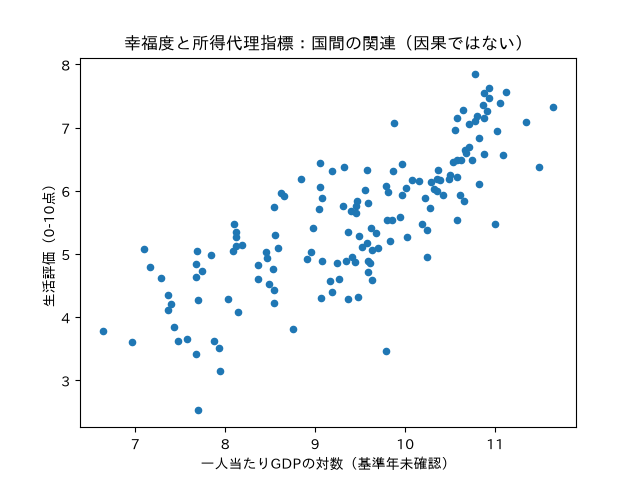

*149か国の生活評価と所得代理指標の散布図。2021報告の2018～2020年集約に基づく国間の関連であり、国内の所得上昇や個人所得の因果効果を表さない。*

地域の比較は人口加重ではなく国等重みです。

| 地域 | 国数 | 幸福度平均 | 国中央値 |
|---|---:|---:|---:|
| 北米・ANZ | 4 | 7.1285 | 7.1430 |
| 西欧 | 21 | 6.9149 | 7.0850 |
| 中東欧 | 17 | 5.9848 | 6.0780 |
| 中南米・カリブ海 | 20 | 5.9081 | 5.9920 |
| 東アジア | 6 | 5.8103 | 5.7610 |
| 独立国家共同体 | 12 | 5.4670 | 5.4715 |
| 東南アジア | 9 | 5.4076 | 5.3840 |
| 中東・北アフリカ | 17 | 5.2198 | 4.8870 |
| サハラ以南アフリカ | 36 | 4.4945 | 4.6160 |
| 南アジア | 7 | 4.4419 | 4.9340 |

北米・ANZと西欧は高く、サハラ以南アフリカと南アジアは低い一方、南アジアとサハラ以南アフリカの順序は中央値では逆転します。細かな地域順位を平均だけで確定させることはできません。国を再標本化した4,000回のブートストラップ区間も作成しましたが、これは国間の異質性に関する感度であり、地域住民の調査設計に基づく信頼区間ではありません。

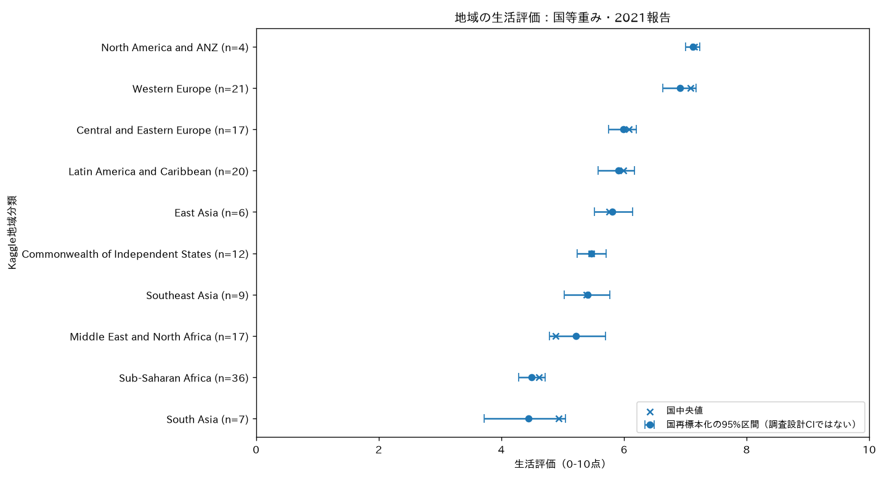

*Kaggleの10地域分類ごとの国等重み平均と中央値。横線は国再標本化の95%区間で、人口平均の信頼区間ではない。地域内国数の違い、とくに北米・ANZの4か国という少数性に注意が必要。*

初回の順位比較では、隣接148組のうち補正前の5%水準で差を識別できたのは6組でした。報告標準誤差を使う独立正規近似の20,000回シミュレーションでは、日本の生活評価5.94点・点順位56位に対し、モデル条件付き95%順位範囲は52～61位でした。AIは、国間相関と国内変化の違い、年ごとの調査国構成、多数国の比較が未解決と判断し、次の3依頼を自ら生成しました。

### AIが生成した追加依頼1 — 国間差と国内変化の分離

**追加依頼（原文）**

> 国間で豊かな国ほど幸福度が高いという初回結果が、同じ国の時間変化にも当てはまるか確認してください。国平均と国平均との差の相関、国・年固定効果と国クラスタ標準誤差を比較し、相関手法・外れ値・地域除外に対する感度を調べ、因果効果とは呼ばないでください。

**選定理由**: 国間の所得差と幸福度の相関を、同じ国の所得上昇や政策効果へそのまま外挿すると、初回結論の意味が変わります。AIはこの推定対象の違いを優先して確認しました。

**結果**: 国年パネルから国平均間相関と国平均との差による国内相関を計算すると、所得は0.8370対0.2930、社会的支援は0.7694対0.2678、健康は0.8017対0.0683でした。国間の関係は、国内の時間変化の関係より強くなっています。ここでの所得0.8370はパネルの国平均間相関であり、初回集約表の0.7898とは対象が異なります。

1,712行・155か国の完全ケースに国・年固定効果を入れ、国クラスタ標準誤差を使うと、所得係数は1.0380（95%区間0.5466～1.5294）、社会的支援は1.7184（1.0872～2.3496）でした。一方、健康は-0.03795（-0.06497～-0.01094）となり、横断の正相関と符号が異なりました。これは健康改善が幸福を低下させる因果効果の証拠ではなく、仕様依存を次に調べる理由です。

初回集約表についてはPearson／Spearman、各指標の上下2.5%トリミングの有無、サハラ以南アフリカ除外の有無を組み合わせ、所得・支援・健康の各8仕様を比較しました。基準からの最大相対偏差はそれぞれ11.99%、5.81%、8.44%で、20%閾値による判定はいずれも `stable=True` でした。安定しているのは選んだ横断仕様の範囲内であり、国内変化や因果効果の安定性ではありません。

**証拠・残る限界**: Notebookのセルindex 20（実行カウント10）の `between_within`、`fe_table`、`sensitivity_reports` が根拠です。時間変動交絡、逆因果、測定誤差、非無作為欠測は固定効果でも取り除けません。

### AIが生成した追加依頼2 — 調査国構成と健康係数の仕様依存

**追加依頼（原文）**

> 年次平均の変化が調査対象国の入れ替わりで生じていないか、2011-2020年の共通国と2019-2020年の対応国で比較してください。地域平均・中央値・GDP等で調整した地域差を区別し、反復1で負になった健康の固定効果係数を2020年除外と連続年の一階差分で点検してください。

**選定理由**: 年次の観測国数が異なるため、平均の上昇が各国の改善を意味するとは限りません。また、第1反復で健康係数が負に変わったため、その結果が2020年や時間変化のモデル化に依存するかを確認しました。

**結果**: 2011～2020年の幸福度平均の上昇は、各年の観測国全体では0.416518点ですが、全10年に観測のある共通80か国では0.082100点でした。観測国数は2011年146か国、2019年144か国、2020年95か国です。初回ログも約0.42点対約0.08点という差を報告しており、調査国の入れ替わりが年次平均の解釈に影響しています。

2019～2020年の対応93か国では平均差-0.008129点、4,000回の国ブートストラップ95%区間は[-0.094860, 0.076344]でゼロを含みました。これを世界人口の改善・悪化やCOVID-19の因果効果とは解釈していません。

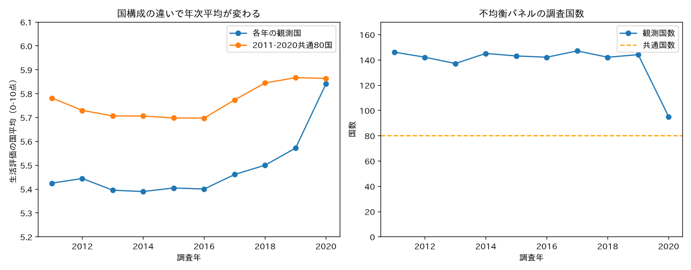

*2011～2020年の国平均と観測国数。左は毎年の観測国全体と共通80か国の比較、右は不均衡パネルの国数であり、国構成を固定するかどうかで平均の変化が異なる。*

健康係数の点検では、2020年を除いても固定効果係数は負でしたが、連続年の一階差分ではほぼゼロとなりました。

| 仕様 | 行数 | 健康係数 | 95%区間 |
|---|---:|---:|---|
| 国・年固定効果、全期間 | 1,712 | -0.03795 | [-0.06497, -0.01094] |
| 国・年固定効果、2020年除外 | 1,631 | -0.03918 | [-0.06675, -0.01162] |
| 連続年の一階差分、終了年効果 | 1,434 | 0.00234 | [-0.03849, 0.04318] |

地域差も粗平均と回帰残差を分けました。6指標による横断回帰の地域別平均残差は、中南米・カリブ海+0.2460点、東アジア-0.2400点です。これは地域の因果効果ではありません。地域を加えた回帰のR²は0.8087でした。2018～2020年付近の西欧－サハラ以南アフリカ差は、平均／中央値と2020年除外の4仕様で最大相対偏差5.99%、20%閾値では `stable=True` でした。

**証拠・残る限界**: セルindex 22（実行カウント11）の `annual_compare`、対応国差、`health_check_table`、`region_table` が根拠です。共通国のみを選ぶこと自体の選択性、地域人口の重みの欠如、健康指標の補間・改訂経路の未確認は残ります。年次比較や回帰仕様を変えても、それだけで因果識別にはなりません。

### AIが生成した追加依頼3 — 全国ペアの多重比較と順位範囲の感度

**追加依頼（原文）**

> ランキングの小差を確定的な順位差として扱わないため、全ての国ペアを対象にHolm補正を行い、隣接順位の識別数を再評価してください。日本と上位国の順位シミュレーションを標準誤差1.0倍・1.5倍で比較し、区間が測定誤差・非回答・国間相関を含まないことを明示してください。

**選定理由**: 補正前の隣接比較だけでは、149か国の多数の比較による過剰な差の識別と、報告標準誤差の過信が残ります。AIは順位の小差を確定的な優劣として読まないために追加検証しました。

**結果**: 全国11,026ペアを比較族とするHolm補正後、隣接148組のうち5%水準で差を識別できたのは2組でした。初回の補正前6組から減っています。ただし、残る146組を同等と証明したわけではなく、このモデル・検定条件では差を識別できないという結果です。

20,000回の独立正規近似シミュレーションで、標準誤差を1.0倍と1.5倍に変えた順位範囲は次のとおりでした。

| 国 | 点順位 | 報告SEでの条件付き95%範囲 | SEを1.5倍にした範囲 |
|---|---:|---|---|
| フィンランド | 1 | 1～1位 | 1～1位 |
| デンマーク | 2 | 2～4位 | 2～4位 |
| スイス | 3 | 2～4位 | 2～5位 |
| 日本 | 56 | 52～61位 | 49～63位 |

全国の順位範囲幅の中央値は9から13へ44.44%拡大し、20%閾値の感度判定は `stable=False` でした。相関の安定性とは対照的に、順位幅は標準誤差の仮定に敏感です。フィンランドの1～1位という結果も、選んだモデル内のシミュレーション結果であって無条件の確実性ではありません。

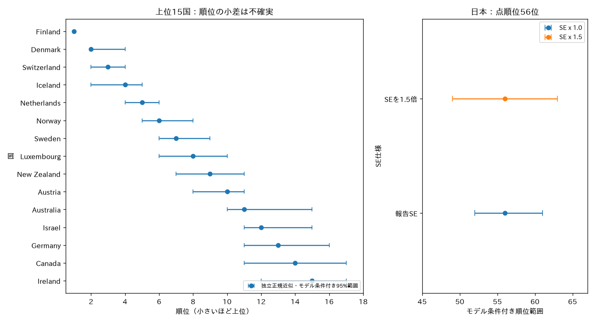

*左は報告標準誤差による上位15か国の順位範囲、右は日本のSE仕様比較。独立正規近似に条件付けた範囲であり、公式順位の訂正でも頻度論的な同時95%順位信頼区間でもない。*

**証拠・残る限界**: セルindex 24（実行カウント12）の `rank_test_summary`、`rank_scenarios`、`rank_sensitivity` が根拠です。正規近似、国間独立性、報告SEの妥当性に依存し、非回答、文化的回答差、共通ショック、国間相関を範囲に織り込んでいません。Holm補正は比較数を調整しても、こうしたモデル仮定を修復しません。

**反復の停止理由**: 3回の上限に到達しました。残る課題には個票、調査設計、独立した参照データ、因果識別戦略が必要であり、同じ集計CSVで似た仕様を増やす価値は低いとAIが記録しています。「全ての不確実性を解消した」ための停止ではありません。

### 結論

今回のデータでは、幸福度とGDP対数、社会的支援、健康の国間相関は強く、北米・ANZや西欧と、サハラ以南アフリカや南アジアとの国等重み平均差も見られました。しかし、国間差と国内の年次変化は同じ問いではありません。所得の国内相関は国間相関より弱く、健康の係数は横断・固定効果・一階差分で変わります。国間の関連から政策介入の効果を断定できません。

年次平均は調査国構成に左右され、2011～2020年の上昇は観測国全体で0.416518点、共通80か国では0.082100点でした。順位についても、全国ペアの補正後に隣接差を識別できたのは148組中2組で、日本の点順位56位にはモデル条件付きで52～61位、SEを拡大すると49～63位という幅があります。**地域差は国等重みの記述、年次差は国構成に条件付けた変化、順位差は仮定付きの推定として読む必要があります。**

AIの反復が有効だった点は、初回の「強い相関」をそのまま結論にせず、推定対象の違い、標本構成、係数の仕様依存、多重比較とSE感度へ自律的に問いを進めたことです。因果効果の識別やデータ定義の全確認まで達成した実験ではありません。

### 監査・再現性と追加確認ログ

分析完了の判断根拠は、`status.json` の `analysis_complete=true` と `final_completion.ready=true`、およびNotebookの実行出力・最終監査記録です。文書化状態を表すフラグを実験分析の失敗判定には使っていません。

Notebook metadataには、カーネル再起動後の全コードセル再実行が記録されています。実ファイルでも18コードセル全てに実行カウントがあり、順序は1～17、20と単調増加しています。セルindex 49の自己監査時点では、実行中の末尾監査セルを除外するwarningが1件ありますが、出力保存後の最終監査は18/18セル実行済み、未実行0、エラー0、PNG図表4セル、証拠付き結論7件、`ok=True`、`nbformat_valid=True`、`findings=[]`、`visual_findings=[]`です。図表監査は `visual_audit=True` で記録されています。

ライフサイクルはrun_id `v020-exp-40`、状態 `completed` で、実行中セル数・書込み待ち数・保持ロック数は全て0です。Notebookには2CSVの保存内容とSHA-256の一致を再確認した記録もあります。ただし、本節の作成時にKaggleから再取得したり、分析コードを再実行したりはしていません。再現性評価は指定された保存済みコード・出力・metadata・ログ・状態ファイルに基づきます。

`initial.log` と `status.json` による初回処理は終了コード0、917.5秒、終了種別 `exited` です。3回の自律追加分析はこの初回処理の中で行われ、Notebookにも履歴が保存されています。別の `followup.log` は「既存セルと過去の反復依頼を保持して再評価し、結論に影響する不足がある場合だけ追加分析を記録・実行する」との開始文と、Notebookの安定・監査通過を理由とするランナー停止記録だけです。状態ファイルでは追加確認は終了コード0、94.7秒、終了種別 `artifact_complete_cutoff`、初回と最終のNotebookサイズ・更新日時は同じです。

したがって、この追加確認を第4の分析反復や新しい結果の取得とは数えません。また、ランナーによる成果物判定での打切りを、Copilot CLIが自発的に正常終了した証拠にも置き換えません。分析完了は保存済みNotebookと完了判定から確認できる一方、追加確認ログには詳細な新規分析報告はありません。

分析時の乱数種は、地域ブートストラップと順位シミュレーションが40、2019～2020年の対応差ブートストラップが41です。Notebookのコードはmanifest、出典情報、反復履歴、感度結果、相関・地域・年次・健康仕様・順位の表をプロジェクトの `data/` へ保存します。本節の4PNGはNotebook内の `image/png` 出力をそのまま抽出したもので、再描画した図ではありません。

### 復旧した問題とJupytermind改善候補

最終Notebookに未実行・エラーセルはなく、データ取得や分析全体を失敗と判定する根拠はありません。一方、Notebookの「Jupytermind改善候補」節には次の復旧履歴が記されています。指定ログにはこれらの例外トレースは残っておらず、以下はNotebook本文の記録として扱います。記載された制御Notebookは本節の追加証拠として読み込んでいません。

| 問題 | 記録された対処・結果 | 切り分け |
|---|---|---|
| Kaggle SDKに存在しない `dataset_view` を呼び、`AttributeError` | 呼び出しを削除し、CSV取得成功 | 呼び出し側のSDK仕様理解の問題。Kaggle APIの取得障害やJupytermindの欠陥とは扱わない |
| `EDAReport` をdictのように扱い、`TypeError` | `asdict` に修正して復旧 | 呼び出し側の型の扱いの問題。最終コードは型に合わせて処理 |
| 初期MCP作成時の親フォルダ不在 | `ensure_notebook` による作成で回避 | MCP側のパス前提に関する記録。指定資料だけではJupytermind固有の不具合は再現していない |
| 追加確認のプロセス停止 | 成果物が安定し監査に通過したためランナーが停止 | 外部ベンチマークランナーの制御。Jupytermindの分析失敗とは別 |

**Jupytermind改善候補は「なし」**です。定義メタデータの不足、因果識別の不可能性、上記の呼び出し誤りをライブラリの不具合とは混同しません。指定証拠から再現可能なJupytermind固有の不具合・機能不足を特定できないため、`issue-candidate.json` はJSONの `null` としました。これは一般的に不具合が存在しないとの保証ではなく、今回の証拠範囲で候補を立てないという判断です。

### 残る限界

国平均の分析から個人の幸福要因を推論する生態学的誤謬、制度・教育・治安などの交絡、逆因果、同一調査由来の共通測定誤差、文化的回答差、非回答・非無作為欠測が残ります。国・年固定効果と国クラスタ標準誤差は、これら全てを除去する識別戦略ではありません。

地域平均は人口を代表する平均ではなく、地域分類も2021時点の分類を固定利用しています。国名未一致と国境変更を復元していません。少数国の地域や共通80か国だけの結果も、他の国・地域へそのまま一般化できません。全観測国と共通国との差を、調査国構成の因果効果として推定したわけでもありません。

個票・国年標準誤差・人口・独立参照資料がないため、調査設計に沿った再標本化、人口加重地域平均、年次順位差の検定、独立データ検証は非適用と記録しました。同一slugの2CSVは粒度・期間が異なる比較資料であり、独立した検証資料ではありません。2021年以降の幸福度や、今回取得していない新しいランキングは対象外です。

最終Notebook監査の指摘0件と、分析前提manifestの未確認警告3件は両立します。形式・実行・証拠参照の監査を通過したことは、測定定義、欠測の無偏り、モデル仮定、科学的妥当性の全てが確認されたことを意味しません。

## 実験42: Energy Consumption（日内・週内・季節変動と需要ピーク、分析完了）

**課題**: 「Kaggleの電力・エネルギー消費時系列を使い、日内・週内・季節変動と需要ピークを調べてください。時刻、タイムゾーン、欠損、集計間隔を確認し、需要予測に使える情報と未知期間への限界を日本語で説明してください。」

**初回プロンプト（全文・原文）**: 以下は、データセットと問い、および共通制約からAIが自動生成した初回プロンプトです。人間が実験42用に全文を個別作成したものではありません。`initial-prompt.md` の内容を省略せず掲載します。

> Kaggleの電力・エネルギー消費時系列を使い、日内・週内・季節変動と需要ピークを調べてください。時刻、タイムゾーン、欠損、集計間隔を確認し、需要予測に使える情報と未知期間への限界を日本語で説明してください。 Kaggle参照先: https://www.kaggle.com/datasets?search=energy+consumption+time+series。インストール済みkaggle Python SDKを使い、NotebookのJupyter MCP実行セル内で`KaggleApi().authenticate()`、`dataset_list(search=...)`、`dataset_list_files(...)`、必要に応じて`dataset_download_file(...)`を呼び出し、Kaggle上の対応する公開データを検索・取得してください。owner/dataset slug、取得ファイル名、取得日、ファイルSHA-256をNotebookに記録してください。APIトークンをセル出力・Notebook・ログへ表示しないでください。分析・API取得コードの実行はJupyter MCPだけを使い、端末コマンド、subprocess、外部スクリプト起動、作業エージェントへの委譲は行わないでください。Kaggle APIで対応データを取得できない場合は、`/home/nahisaho/kaggle/experiments/white-paper.md`を確認してください。同じデータセットの公開CSVが同稿に明記されている場合だけ、そのURLへフォールバックしてください。対応するCSVを確認できない場合は、別データを推測で選ばず、取得失敗として記録してください。保存先は benchmark/projects/kaggle-v020-kaggle-exp-42-energy-consumption/notebooks/kaggle-v020-kaggle-exp-42-energy-consumption.ipynb としてください。run_idは `v020-exp-42` です。長時間処理の開始前にlifecycle.register_runを呼び、実行・書込みフェーズを記録し、終了時にcompletedまたはfailedを記録してください。データ定義manifest、分析前提manifest、意味的な異常検査、妥当な範囲の感度分析を使い、適用できない機能は理由を記録してください。図表はvisual_audit=Trueで監査してください。Notebookには「使用したJupytermindモジュール」節を設け、直接import・呼び出したモジュール名、関数名、使用目的を記録してください。間接利用は使用済みに含めないでください。Jupytermindの不具合または機能不足が疑われた場合は「Jupytermind改善候補」節を設け、分類、再現条件、期待する挙動、実際の挙動、影響、回避策、関係するセルとログを記録してください。Copilot CLI、Kaggle API、ベンチマークランナーに固有の問題とは切り分け、候補がなければ「なし」と記録してください。初回分析後、自分で結果を読み直し、結論に実質的な影響を与える未解決点があれば自然言語の追加依頼文を作成し、Notebookの「反復依頼履歴」に原文のまま記録して実行してください。価値ある追加分析がなくなるまで最大3回繰り返し、各反復の選定理由・結果・証拠・残る限界を報告してください。最後に全コードセルを上から再実行し、notebook_auditとライフサイクル状態を記録してください。

### 使用したJupytermindモジュール

以下はNotebookのコードで直接import・呼び出しを確認した `ai_data_scientist` 配下のモジュールです。Skill名や間接利用を実績に含めません。

| モジュール | 直接呼び出した関数・クラス | 使用目的 |
|---|---|---|
| `project_manager` | `resolve_project`, `ensure_notebook`, `ensure_data_dir`, `enqueue_write` | 保存先の解決、Notebook・データディレクトリの準備、文書・メタデータの直列書込み |
| `language_router` | `detect_language` | 日本語指示の判定 |
| `lifecycle` | `register_run`, `is_cancel_requested`, `mark_execution_start`, `mark_execution_end`, `mark_write_start`, `mark_write_end`, `get_run_status`, `mark_completed` | run_id登録、実行・書込みフェーズ、取消要求、完了状態の記録 |
| `ingestion` | `SourceSpec`, `ingest` | CSV読込み。上限を200,000行にして切り詰めがないことを確認 |
| `cleaning` | `clean_dataset` | 完全同一行の重複除去と、削除0行の確認 |
| `eda` | `explore` | 列型、要約統計、欠損の探索 |
| `data_definition` | `FieldValue`, `build_manifest`, `DataDefinitionManifest.unresolved_fields` | 出典・単位・時刻・測定定義を確認済み／推定／不明に区分 |
| `analysis_assumptions` | `Assumption`, `AnalysisAssumptionManifest`, `check_manifest` | 非因果的な分析範囲と、結論に重要な未確認前提の検査 |
| `data_quality` | `detect_anomalies` | 時刻の非欠損・一意性、需要の非欠損・非負制約の検査 |
| `sensitivity` | `SensitivityPlan`, `run_sensitivity` | 時刻・重複処理・期間の24仕様と、ピーク閾値・期間の6仕様を比較 |
| `visualization` | `render_chart`, `build_image_output` | 日本語図表の描画とPNGのNotebook出力 |
| `insight_engine` | `extract_cited_value`, `record_insight` | 実出力に対応する4件のInsight記録、stream証拠照合の再現確認 |
| `notebook_audit` | `audit_visual_outputs`, `audit_notebook` | 監査メタデータ欠落の再現確認、`visual_audit=True` による最終監査 |

`lifecycle.mark_failed` はエラー処理の分岐に記述されていますが、保存された成功経路の出力から実行済みとは数えません。月別図はレイアウトの回避策としてMatplotlibで描画し、PNG出力には `visualization.build_image_output` を使っています。分析・集計・予測の実装にはpandas／NumPyも使われており、Jupytermindだけが統計計算のすべてを担ったわけではありません。

### 初回指示とデータ取得

**初回指示**: 周期変動とピークだけでなく、時刻・タイムゾーン・欠損・集計間隔を先に確認し、未知期間への予測可能性を説明する課題です。手法と追加分析の内容は事前指定せず、AIが結果を読み直して最大3回の追加依頼を生成するよう求めています。Kaggle SDKによる取得、来歴・manifest、意味的な異常検査、感度分析、全セル再実行、視覚監査、lifecycle記録を共通制約としました。

**データ取得**: NotebookでKaggle認証と `energy consumption time series` の検索を実行し、さらに `hourly energy consumption` を検索して、複数年の時間別需要を含む `robikscube/hourly-energy-consumption` を選びました。公開ファイル一覧を確認して `PJME_hourly.csv` を取得しています。Kaggle APIで取得できたため、外部CSVへのフォールバックは使っていません。

| 項目 | Notebookに残る記録 |
|---|---|
| 取得元 | `robikscube/hourly-energy-consumption`、データセット版3 |
| ファイル | `PJME_hourly.csv`、4,070,265 bytes |
| 取得日時 | 2026-10-01 22:45:51.272914 UTC／2026-10-02 07:45:51.272914 JST |
| SHA-256 | `4eb2b16d42bf07ec41ab55cb842191594cb69452725a6d3c0991658a628fde84` |
| サイズ・列 | 145,366行・2列、`Datetime` と `PJME_MW` |
| 時刻ラベルの範囲 | 2002-01-01 01:00〜2018-08-03 00:00 |
| 配布元メタデータ | PJM由来の時間別電力消費、単位MW、ライセンス `CC0-1.0` |

配布元説明には地域が年々変化したとの注意があります。`PJME` をPJM Eastと解釈する点はファイル・列名からの推定で、対象地域の境界や年次不変性を確認済みとはしていません。また、配布元原資料との独立照合は実施していません。

列の欠損、不正な日時、非正値、非有限値はそれぞれ0でした。しかし、元行順は未整列で、時刻ラベルは145,362種類、範囲内の期待ラベル145,392件に対して30件欠落しています。同一時刻の重複は4時刻・8行で、意味的な一意性検査も8行を検出しました。「列の欠損0」と「連続した時系列に欠落なし」は別です。

完全同一行の重複はなく、除去による削除は0行です。元の観測行を保持したうえで、分析用系列では重複時刻を平均し、欠落ラベルはNaNのまま残して補間しません。主分析は2003〜2017年の15年・131,469観測とし、途中までしかない2018年は季節比較から除外しました。時刻はUTCオフセットのないnaiveラベルであり、MWが時間平均か瞬時値か、ラベルが時間の開始か終了かも未確定です。したがって日・月集計は平均MWとし、MWhへの積算は行っていません。

### 初回結果

AIは日内・曜日・月別の平均、季節別の日内プロフィール、年平均と年最大、上位需要の集中を調べました。以下はNotebookの `INITIAL_RESULTS` と対応する集計・Insightに基づきます。

| 観点 | 初回分析の結果 |
|---|---|
| 日内 | 平均最大は18時ラベル約36,484 MW、最小は4時ラベル約25,442 MW。平均プロフィールの振幅は約11,042 MW |
| 週内 | 平日平均約33,028 MW、週末平均約29,873 MW。週末は平日より9.55%低い |
| 月別 | 7月平均約37,950 MWが最大、4月平均約27,853 MWが最小。各年の平均で正規化しても最大は7月 |
| 季節×時刻 | 平均最大のラベルは夏17時、冬19時、春21時、秋20時 |
| 観測最大 | 全取得期間の最大は2006-08-02 17:00ラベルの62,009 MW |
| 高需要の集中 | 主分析の99パーセンタイル約51,072 MW以上は1,315観測。夏94.98%、平日93.23%、15〜20時73.23% |
| 年別 | 主分析期間の年最大は51,962〜62,009 MW。地域構成の不変性が不明なため、因果的な長期需要変化とは解釈しない |

18時と19時の全体平均は近く、「18時が最大」という順位だけで鋭い単一ピークとは言えません。また、平均プロフィールの最大時刻、各日最大の時刻、全期間の極値の時刻は異なる集計です。初回時点では、時刻定義と重複処理が結論を変えるか、周期性が未知期間の予測に本当に役立つか、ピークの集中率が閾値に依存するかが未解決でした。

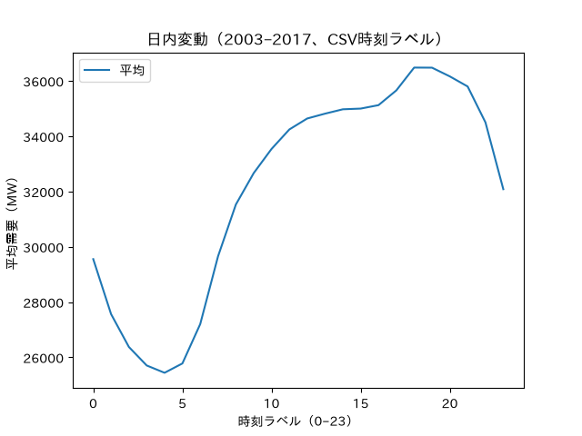

*2003〜2017年の時刻ラベル別平均需要。明け方に低く、夕方に高い。横軸はCSVラベルで、確認済みの現地時刻ではない。NotebookのPNG出力から抽出。*

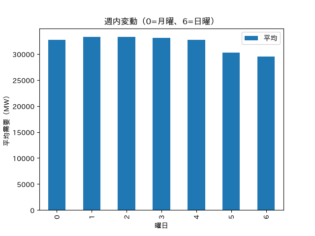

*曜日別の平均需要。0は月曜、6は日曜。週末の低需要を示すが、曜日の因果効果を推定した図ではない。*

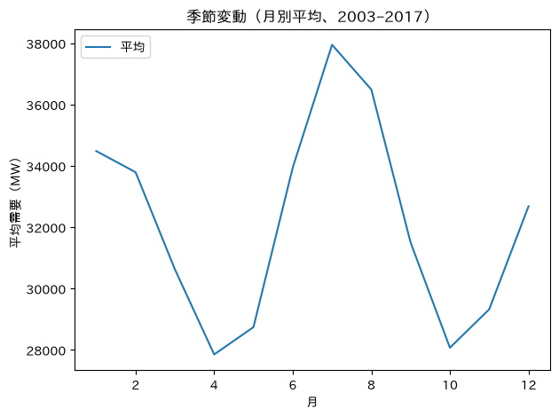

*7月に高く4月に低い月別平均需要。単位はMWであり、月間消費エネルギーの総量ではない。最終Notebookでは凡例・余白を調整したMatplotlib描画が保存されている。*

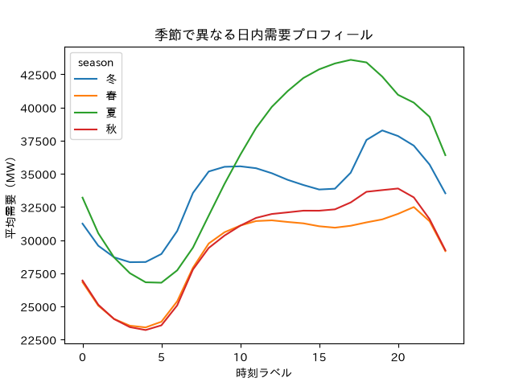

*冬・春・夏・秋の日内平均プロフィール。夏は午後、冬は夕方の高需要が目立つ。季節と時刻の組み合わせを分けて読む必要がある。*

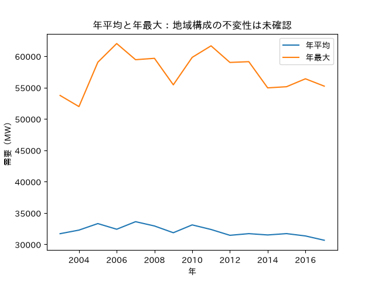

*2003〜2017年の年平均と年最大。通常の水準と極端需要を区別する図であり、地域構成の変化を調整した長期傾向ではない。*

### AIが自律生成した追加依頼

3件ともAIが直前の結果から選び、Notebookの「反復依頼履歴」に原文と選定理由を記録して実行しています。`initial.log` は同じ初回セッション内で3回の追加検証を終えたと報告しており、`followup.log` はその後の追加確認です。追加確認を4回目の分析反復とは数えません。

**追加依頼1 — 時刻定義と処理仕様への感度（原文）**

> 春の03時欠落と秋の02時重複・欠落は夏時間とhour-endingラベルに対応するか確認してください。時計切替日を除外し、重複時刻の平均・先頭・最大、時刻ラベルの0時間・1時間シフト、全15年・直近5年を比較して、日内・週内・季節の結論が変わるか検証してください。UTCを推測で確定しないでください。

**選定理由**: 列に欠損がなくてもラベルの欠落と重複があり、夏時間、時間終了ラベル、重複処理がピーク時刻や需要差を歪める可能性がありました。

**結果**: 欠落30件のうち17件は米東部の春切替日の03時、12件は秋切替日の02時、残る1件は2010-12-10 00時でした。重複4時刻はいずれも秋切替日の02時です。夏時間と時間終了ラベルの仮説に整合しますが、タイムゾーンを確定した証拠ではありません。`America/New_York` を仮定したローカライズで解決不能な行は、ラベルのままでは33行、1時間引いても8行残り、正しいUTC復元を達成したとはしていません。

重複処理3通り、時刻シフト2通り、切替日除外の有無、全15年／直近5年の24仕様で、週末差は−9.65%〜−9.04%、最大月は7月、最小月は4月でした。週末差の最大相対偏差は5.31%で、設定した許容20%内の `stable=True` です。ただし、この判定は週末差というスカラーに対するもので、すべての結論を保証するものではありません。1時間引くと日内最大ラベルは18時から17時になり、時計時刻の不確実性は残ります。

**証拠・残る限界**: セル9（0始まり）の `ITERATION1_RESULTS`、`gap_checks`、`sensitivity_table`。週末の低需要と7月の高需要は仕様に対して頑健ですが、秋の二重観測をUTC順へ復元していません。

**追加依頼2 — 未知年の予測性能と高需要時誤差（原文）**

> 日内・週内・季節の特徴が未知期間の需要予測にどの程度使えるか、2015年・2016年・2017年の時間順ホールドアウトで検証してください。学習期間だけで作った月×曜日×時刻平均（全過去と直近3年）を、前日同時刻・前週同時刻の逐次予測と共通の評価時刻で比較してください。通常時のMAE・WAPE・バイアスに加え、学習期間99パーセンタイル以上の高需要時の誤差を示し、情報漏洩と予測の発行時点を明記してください。2018年の途中期間は別枠で確認してください。

**選定理由**: 周期性が見えるだけでは、未知期間の予測価値や極端需要への対応能力を保証できません。時間順の評価と、通常の評価集計・高需要時の誤差を分ける必要がありました。

**結果**: 各テスト年より前の2003年以降を学習期間とし、月×曜日×時刻平均と高需要閾値を学習データだけで作りました。欠損や夏時間切替日、およびlag参照日の切替日を除外し、4方式に共通の2015〜2017年の25,872時刻で比較しています。高需要は各年の学習期間99パーセンタイル以上で、合計181観測です。

| 予測方式 | 全評価時刻MAE（MW） | WAPE | 平均バイアス（MW） | 高需要MAE（MW） | 高需要バイアス（MW） |
|---|---:|---:|---:|---:|---:|
| 全過去の月×曜日×時刻平均 | 3,016.66 | 9.64% | +1,056.88 | 8,609.33 | −8,609.33 |
| 直近3年の月×曜日×時刻平均 | 2,929.62 | 9.36% | +312.58 | 10,294.25 | −10,294.25 |
| 前日同時刻（`lag24`） | 2,149.97 | 6.87% | +0.59 | 3,315.65 | −2,655.75 |
| 前週同時刻（`lag168`） | 3,373.23 | 10.78% | −51.54 | 8,619.15 | −8,604.77 |

MAEは絶対誤差の平均、WAPEは絶対誤差合計を実測需要合計で割った割合です。バイアスは予測−実測で、負値は過小予測を意味します。表の「全評価時刻」は高需要時も含み、非ピーク時だけの指標ではありません。

前日同時刻が比較した4方式で最良でしたが、高需要時には平均約2,656 MWの過小予測が残ります。直近3年の暦平均は全評価時刻の平均バイアスを小さくする一方、高需要誤差を改善しませんでした。2018年途中の別枠評価は共通5,065時刻、高需要35観測で、前日同時刻のMAEは約2,528 MW、高需要MAEは約6,118 MWでした。性能は評価期間に依存します。

**証拠・残る限界**: セル10の `ITERATION2_RESULTS`、`forecast_table`、`fold_quality` と証拠付きInsight。暦平均は前年末で固定しますが、lag方式は対象日の前日までの実測を逐次利用する日次更新条件です。未知年の実測を順次利用することと未来漏洩は同一ではありませんが、年初に一年分を一括予測する実験でもありません。3完全年と2018年途中以外、夏時間切替付近、別地域への性能は未評価です。

**追加依頼3 — ピーク定義・連続性・集計粒度（原文）**

> 高需要時の過小予測が大きいため、需要ピークを95・99・99.5パーセンタイルで定義した場合と全期間・直近5年で、夏・平日・夕方への集中が保たれるか確認してください。99パーセンタイル超過の連続エピソードと日別ピークを調べ、時間数を独立な事象数と混同しないでください。未知年の高需要誤差も閾値を変えて確認し、暦平均と前日同時刻予測の優劣が逆転しないか示してください。

**選定理由**: 高需要の集中率と予測誤差は、閾値、年構成、連続観測の依存性によって変わり得ます。上位1%だけの結果を普遍化せず、時間数と事象数を区別するために追加しました。

**結果**: ここでの「全期間」は主分析の2003〜2017年、「直近5年」は2013〜2017年です。閾値と期間を変えた6仕様の結果は次のとおりです。

| 期間・閾値 | 需要閾値（MW） | 対象時間ラベル数 | 夏の割合 | 平日の割合 | 15〜20時の割合 |
|---|---:|---:|---:|---:|---:|
| 全15年・95% | 44,167.00 | 6,575 | 86.66% | 88.24% | 60.56% |
| 全15年・99% | 51,071.92 | 1,315 | 94.98% | 93.23% | 73.23% |
| 全15年・99.5% | 53,267.96 | 658 | 97.72% | 94.53% | 76.29% |
| 直近5年・95% | 43,264.00 | 2,192 | 76.60% | 88.05% | 61.82% |
| 直近5年・99% | 49,890.66 | 439 | 87.70% | 89.75% | 78.13% |
| 直近5年・99.5% | 51,763.92 | 220 | 90.91% | 91.82% | 81.36% |

夏・平日・夕方への集中の向きは維持されましたが、夏比率は76.60%〜97.72%であり、94.98%を普遍値にはできません。夏比率の最大相対偏差は19.36%、許容20%に近い `stable=True` でした。安定というラベルだけで変動の大きさを隠さないことが重要です。

主分析の99%閾値以上1,315時間ラベルは、221件の連続エピソードにまとまり、独立な1,315事象ではありません。エピソード長の中央値は6ラベル時間、最長は14ラベル時間でした。観測最大を含むエピソードは2006-08-02 10:00〜23:00です。実時間の連続長ではなく、naiveラベル上の長さです。

夏時間切替日を除き24ラベルを持つ5,448日を集計し、31日を対象外にしました。日別最大時刻の最頻値は19時です。最大日平均は約52,230 MWで、時間別最大62,009 MWより15.77%低く、日平均では極端需要が平滑化されます。これは別の集計粒度で得た観測最大同士の差であり、エネルギー損失率ではありません。

未知年の高需要MAEも閾値を変えて確認しました。前日同時刻／全過去暦平均は、95%で約3,439／5,723 MW、99%で約3,316／8,609 MW、99.5%で約2,616／10,150 MWです。前日同時刻の優位は逆転しませんでしたが、99.5%の評価対象は50観測に限られます。

**証拠・残る限界**: セル11の `ITERATION3_RESULTS`、`peak_sensitivity_table`、`episode_table`、`peak_forecast_table`。高需要時は連続性と少数性があるため、独立同分布を仮定した有意差検定や信頼区間は示していません。観測最大は将来最大や設備設計値ではありません。

**反復の終了と追加確認**: AIは3回で時刻解釈、処理感度、未知年性能、ピーク定義・連続性を確認しました。残る問題は原資料の時刻・測定定義、地域境界、気象・祝日、新しい期間のデータを必要とし、同じ2列の再分析では解消できないと判断しています。`followup.log` でも既存3回が問いに対応しているとして追加依頼を増やさず、証拠参照と改善候補の整理を確認しました。ただし初回後と最終時点でNotebookのサイズ・mtimeは同一であり、追加確認中にNotebookが変更・再実行されたとログの説明だけから断定しません。

### 最終結論

**PJMEの取得系列では、明け方の低需要、夕方の高需要、週末の低需要、7月の高需要が確認されました。** 週末差と月順位は24仕様でも維持されます。一方、ピークの時計時刻は時刻定義に依存し、高需要の夏比率も閾値・期間で変わります。

予測には時刻・曜日・月／季節とその交互作用、観測済みの過去需要が入力候補になります。実測を日次更新できる2015〜2017年評価では前日同時刻がMAE約2,150 MW・WAPE 6.87%で最良でしたが、高需要時の過小予測は残りました。周期性の記述だけで長期予測や極端需要対応ができたとは結論しません。

Jupytermindが有効だったのは、時刻ラベルの問題を感度分析に結び付け、記述的な周期性を未知年バックテストで検証し、さらにピーク閾値と連続事象を確認する反復をNotebookに残した点です。未確認定義を推測で確定せず、結論の適用範囲を狭めています。分析完了は `status.json` の `analysis_complete=true`、`final_completion.ready=true`、Notebookの結果・最終監査・lifecycle記録に基づきます。

### 監査と再現性

Notebookと初回ログには、カーネル再起動後に全14コードセルを上から再実行した記録があります。最終Notebookの実行カウントは順に `1, 2, 3, 4, 5, 6, 7, 10, 11, 12, 13, 14, 15, 16` です。欠番はありますが、14セルすべてに実行記録と出力があり、昇順です。本節の作成時に分析を再実行したわけではなく、保存されたコード・出力・監査記録を照合しました。

| 確認項目 | 保存された最終結果 |
|---|---|
| Notebook監査 | `audit_notebook(..., visual_audit=True)`、`ok=True`、nbformat正常 |
| コードセル | 実行済み14/14、未実行0、エラー0 |
| 図表・Insight | 図表セルは0始まりのセル8の1セル、PNGは5点、証拠付きInsightは4セル |
| 監査指摘 | `findings=[]`、`visual_findings=[]` |
| lifecycle | `v020-exp-42`、`state=completed`、実行中セル・保留書込み・保持ロックはいずれも0 |
| 初回ランナー | 終了コード0、787.6秒、終了理由 `exited` |
| 追加確認ランナー | 終了コード0、95.4秒、終了理由 `artifact_complete_cutoff` |
| 成果物の安定性 | 初回後・最終とも `stable=true`、487,068 bytes、mtimeは2026-10-01 22:55:20.641272 UTC |

追加確認のログ末尾は「Notebook remained stable and passed semantic audit」を理由にランナーがプロセス群を停止した記録です。正常な自然終了と同一視はしませんが、分析失敗やタイムアウトとも記録されていません。Notebook内の「ベンチマークランナーは未実行」という記述は分析コード側の認識であり、外部実行については `status.json` とログ末尾のランナー記録を優先します。

来歴の取得日時・SHA-256、再実行時のCSVハッシュ照合コード、データ定義・分析前提manifest、反復履歴、フェーズログがNotebookに記録されています。データディレクトリへの保存処理もありますが、本節では指定されたNotebook・プロンプト・ログ・statusだけを証拠とし、別の保存ファイルの実在や内容を追加確認したとはしていません。

図表は保存済みPNG5点をそのまま抽出し、すべて `figures/exp-42-*.png` で参照しました。日本語glyph警告は0、タイトル・軸・凡例の著者メタデータがあります。ただし視覚監査は画像密度ヒューリスティックとメタデータ確認であり、画像内容や凡例の切れを厳密に保証しません。フェーズログとゼロ件のlifecycleカウンタもカーネル内処理・`enqueue_write` の追跡で、MCPサーバー内部のすべての保存処理の排他性を保証するものではありません。

### 失敗・改善候補と外部問題の切り分け

**分析全体の未完了・失敗は確認されません。** ただし途中の制約、再現された機能不足、外部ツールの問題を無かったことにはしません。

| 分類 | 観測された内容・影響 | 回避策と判定 |
|---|---|---|
| Jupytermind：証拠照合の機能不足、再現済み | 実行済みsetupセルの `stream.text` に `v020-exp-42` があるのに `record_insight` が `EvidenceMissingError`。print出力だけを根拠とするInsightを記録できない | 根拠を `display_data` の `text/plain` に保存し、`extract_cited_value` を使用。セル12の `STREAM_EVIDENCE_REPRODUCTION=EvidenceMissingError` が証拠 |
| Jupytermind：視覚監査情報欠落の検出不足、再現済み | PNGを持つセルの `metadata.chart` を削除した試験でも `audit_visual_outputs` が空の指摘を返す。検査情報がないことを警告しない | 著者メタデータを明示、glyph警告を実測、目視記録を追加。セル12の `VISUAL_METADATA_REPRODUCTION=[]` が証拠 |
| Jupytermind改善の保留候補：図表レイアウト | 月別図の右上凡例が欠けて見え、短縮でも改善しなかったとのNotebook記録。凡例位置・余白の指定不足が疑われる | 最終図はMatplotlibの左上凡例・`tight_layout`・`bbox_inches='tight'` で回避。元PNGは最終Notebookに残っておらず、Copilot CLIの画像表示との影響分離も未完了。製品不具合と断定しない |
| Kaggle SDK呼出側 | `dataset_list` に未対応の `page_size` を渡した `TypeError` の履歴 | 最終コードは引数を修正し検索・取得に成功。元の失敗出力は最終再実行で置換されているため、履歴記述以上の詳細は未確認。Jupytermind候補には含めない |
| Jupyter MCP／CLI・ツール構成 | 親ディレクトリ未作成、filesystemの許可root相違の履歴 | Notebookに記録された外部構成問題。指定ログには詳細な例外・時系列がなく、製品の再現済み不具合とは扱わない |
| pandas表示警告 | 日時を含む表の `round` に効果がないという `UserWarning` | 集計・数値出力やNotebook監査のエラーではない。Jupytermind固有問題には含めない |

改善候補のJSONには、再現済み2件と原因未分離の保留1件を別状態で記録しました。受け入れ条件は本節作成時に定めた改善判定基準であり、修正済み・達成済みの結果ではありません。製品コードの修正やIssue登録はこの実験節では行っていません。

### 残る限界

時刻ラベルを地域時刻の代理とする `timestamp_local` と、地域構成の不変性に関する `stable_region` の重要前提は未確認で、最終 `check_manifest` に警告2件が残ります。重複処理の影響は検証済みへ更新されていますが、形式監査の合格は、この2前提や分析の科学的妥当性まで保証しません。

タイムゾーン、時間開始／終了ラベル、時間平均／瞬時値、測定・補正方法、正確な地域境界は未確定です。`unresolved_fields` は不明項目のみを返すため、AIは地域名と時間終了ラベルという推定項目も別に列挙しています。UTC復元やMWh積算を行わず、長期変動を地域構成一定の需要変化として解釈しない判断が必要です。

気象・祝日・分散電源・契約や地域構成の変更は未評価です。予測比較は単純な4方式の記述的評価であり、高度なモデルとの比較、独立データによる検証、統計的優位性の検定はありません。ラグ需要や過去のみのローリング値は入力候補ですが、後者の有効性を本実験で実測したわけではありません。2018年途中の悪化も踏まえ、2026年以降、未知の気象極端、別地域への直接外挿はできません。

独立参照がないためデータセット比較と異常の独立検証、識別設計がないため因果推論は適用していません。また、直接Jupyter MCPツールを使う環境でカーネルへMCPClientを渡せないため、`mcp_gateway.run_and_record` は未使用です。これらを実施済み機能として数えず、原資料と新たな説明変数を必要とする限界として残しています。

## 実験43: Telco Customer Churn（分析完了）

**課題**: 「KaggleのTelco Customer Churnデータを使い、解約と関連する契約・料金・利用期間の特徴を調べてください。クラス比率、カテゴリの符号化、顧客期間による交絡を確認し、解約原因と予測上の関連を区別して日本語で報告してください。」

**初回プロンプト（全文・原文）**: 以下は、データセット・分析上の問いと共通制約からAIが自動生成した初回プロンプトです。人間が本実験の全文を個別に作成したものではありません。

```text
KaggleのTelco Customer Churnデータを使い、解約と関連する契約・料金・利用期間の特徴を調べてください。クラス比率、カテゴリの符号化、顧客期間による交絡を確認し、解約原因と予測上の関連を区別して日本語で報告してください。 Kaggle参照先: https://www.kaggle.com/datasets/blastchar/telco-customer-churn。インストール済みkaggle Python SDKを使い、NotebookのJupyter MCP実行セル内で`KaggleApi().authenticate()`、`dataset_list(search=...)`、`dataset_list_files(...)`、必要に応じて`dataset_download_file(...)`を呼び出し、Kaggle上の対応する公開データを検索・取得してください。owner/dataset slug、取得ファイル名、取得日、ファイルSHA-256をNotebookに記録してください。APIトークンをセル出力・Notebook・ログへ表示しないでください。分析・API取得コードの実行はJupyter MCPだけを使い、端末コマンド、subprocess、外部スクリプト起動、作業エージェントへの委譲は行わないでください。Kaggle APIで対応データを取得できない場合は、`/home/nahisaho/kaggle/experiments/white-paper.md`を確認してください。同じデータセットの公開CSVが同稿に明記されている場合だけ、そのURLへフォールバックしてください。対応するCSVを確認できない場合は、別データを推測で選ばず、取得失敗として記録してください。保存先は benchmark/projects/kaggle-v020-kaggle-exp-43-customer-churn/notebooks/kaggle-v020-kaggle-exp-43-customer-churn.ipynb としてください。run_idは `v020-exp-43` です。長時間処理の開始前にlifecycle.register_runを呼び、実行・書込みフェーズを記録し、終了時にcompletedまたはfailedを記録してください。データ定義manifest、分析前提manifest、意味的な異常検査、妥当な範囲の感度分析を使い、適用できない機能は理由を記録してください。図表はvisual_audit=Trueで監査してください。Notebookには「使用したJupytermindモジュール」節を設け、直接import・呼び出したモジュール名、関数名、使用目的を記録してください。間接利用は使用済みに含めないでください。Jupytermindの不具合または機能不足が疑われた場合は「Jupytermind改善候補」節を設け、分類、再現条件、期待する挙動、実際の挙動、影響、回避策、関係するセルとログを記録してください。Copilot CLI、Kaggle API、ベンチマークランナーに固有の問題とは切り分け、候補がなければ「なし」と記録してください。初回分析後、自分で結果を読み直し、結論に実質的な影響を与える未解決点があれば自然言語の追加依頼文を作成し、Notebookの「反復依頼履歴」に原文のまま記録して実行してください。価値ある追加分析がなくなるまで最大3回繰り返し、各反復の選定理由・結果・証拠・残る限界を報告してください。最後に全コードセルを上から再実行し、notebook_auditとライフサイクル状態を記録してください。
```

**使用したJupytermindモジュール**: 以下はいずれも `ai_data_scientist` のサブモジュールです。保存されたNotebookのコードにある直接import・呼出しを基準に、関数・型・メソッドと用途を整理しました。内部で間接的に使われる機能は含めていません。

| モジュール | 直接利用した関数・型・メソッド | 使用目的 |
|---|---|---|
| `project_manager` | `resolve_project`、`ensure_notebook`、`ensure_data_dir`、`enqueue_write` | 保存先の解決、Notebook・データ置場の確保、著者側の書込みの直列化 |
| `language_router` | `detect_language` | 日本語の言語判定 |
| `lifecycle` | `register_run`、`mark_execution_start/end`、`mark_write_start/end`、`is_cancel_requested`、`mark_completed`、`mark_failed`、`get_run_status`、`wait_for_quiescence` | 実行・書込み・失敗・完了の状態管理と静止確認 |
| `ingestion` | `SourceSpec`、`ingest` | Kaggle SDKで取得済みのローカルCSVの読込み |
| `cleaning` | `clean_dataset` | 完全重複と処理前後の行数の確認 |
| `eda` | `explore` | 型、要約統計、欠損、カテゴリ分布の把握 |
| `stats_analysis` | `correlation` | 解約0/1と数値特徴、期間と累積料金のPearson相関・日本語解釈 |
| `data_definition` | `FieldValue`、`build_manifest`、`DataDefinitionManifest.unresolved_fields` | 出典・意味定義の確認済み／推定／不明の分離 |
| `analysis_assumptions` | `Assumption`、`AnalysisAssumptionManifest`、`check_manifest` | 分析範囲・前提・未解決リスクの明示 |
| `data_quality` | `detect_anomalies` | 非負、カテゴリ集合、ID一意性、欠損などの意味的制約検査 |
| `sensitivity` | `SensitivityPlan`、`SensitivityPlan.specifications`、`run_sensitivity` | 期間6仕様、料金4仕様、予測6仕様の感度分析 |
| `visualization` | `render_chart`、`build_image_output` | PNG図表生成、画像MIME出力の作成 |
| `insight_engine` | `extract_cited_value` | 再実行後の出力とInsight引用値の照合・証拠番号更新 |
| `notebook_audit` | `audit_notebook`、`audit_visual_outputs` | 実行・証拠・図表の最終監査、メタデータ欠落の最小再現 |

Notebookの利用記録には、作成時のJupyter MCPオーケストレーションセルで `insight_engine.record_insight` を直接呼んだとも記載されています。ただし、保存された再実行用コードにはその呼出しが残っていないため、上表の直接呼出し確認済み関数には加えていません。

**初回指示**: 契約・料金・顧客期間と解約の関連を、クラス不均衡、名義カテゴリの扱い、期間構成の違いを踏まえて調べるよう求めています。具体的な統計モデルと追加依頼文は事前指定せず、AIが結果から選びました。取得・分析はJupyter MCP内、来歴と両manifestを記録し、図表監査と全セル再実行を行うという共通制約があります。

**データ取得**: Notebookの取得セルには、Kaggle SDKの認証、検索、指定slugのファイル一覧取得、CSVダウンロードが記録されています。取得元は `blastchar/telco-customer-churn`、ファイルは `WA_Fn-UseC_-Telco-Customer-Churn.csv`、7,043行・21列、977,501 bytesです。最終再実行時の取得日時は2026年10月2日08:06:40.415295 JST（2026年10月1日23:06:40.415295 UTC）、SHA-256は `88be4b93fbe0cc83421af1c503794c97c342eca914c1576db7c276e61d61358a` です。Kaggleから取得できたため、公開CSVへのフォールバックは使っていません。

同一slugのメタデータ説明は、IBM Sample Data Setsに由来し、1行が1顧客、`Churn` は直近1か月に離脱した顧客を表すとしています。収集日、標本抽出枠、測定方法、料金の通貨は未確認です。`tenure` の単位は月と推定していますが、確認済み定義とは区別しました。SDKの認証出力を抑制するコードと、認証情報を表示しない取得ログが残っています。

**初回結果**: 完全重複の削除は0件、顧客IDの重複は0件でした。`TotalCharges` の空白11件を欠損へ変換し、すべて `tenure=0` と確認しました。空白を料金ゼロと決めつけず、主解析では累積料金を除いて7,043件を維持しています。電話・インターネット未利用と補助サービスカテゴリの不整合は0件でした。

解約は1,869人（26.54%）、非解約は5,174人（73.46%）です。非解約だけを予測しても約73%の正解率になるため、accuracyだけでなくROC-AUC、AP（average precision）、recall、precision、Brierも評価しました。

| 契約 | 顧客数 | 解約人数 | 粗解約率 | Wilson 95%信頼区間 | 顧客期間中央値 |
|---|---:|---:|---:|---:|---:|
| 月次契約 | 3,875 | 1,655 | 42.71% | 41.16–44.27% | 12 |
| 1年契約 | 1,473 | 166 | 11.27% | 9.75–12.99% | 44 |
| 2年契約 | 1,695 | 48 | 2.83% | 2.14–3.73% | 64 |

顧客期間1–12の解約率は47.68%、13–24は28.71%、25–48は20.39%、49–72は9.51%でした。期間0の11人は解約0人ですが、Wilson区間上限は25.88%であり、安全な群という証拠にはなりません。契約ごとに期間分布が大きく異なるため、粗比較を契約変更の効果と読むことはできません。期間と解約の相関は `r=-0.3522`、月額と解約は `r=0.1934`、累積料金と解約は `r=-0.1995`、累積料金と期間は `r=0.8259` でした。累積料金は長い利用期間の代理情報を含みます。

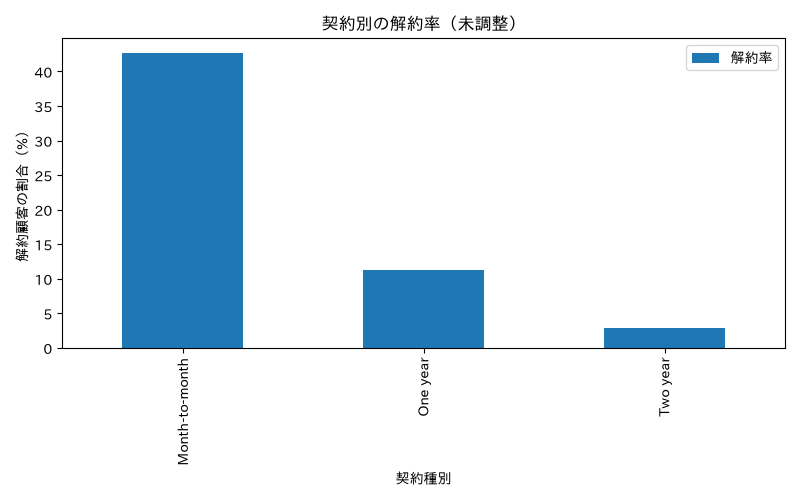

*月次・1年・2年契約の粗解約率。契約間で顧客期間の構成が異なるため、棒の差を契約の因果効果とは解釈しない。PNGはNotebookの保存済み実行出力から抽出。信頼区間と分母は上表に示す。*

AIは二項ロジスティックGLMでHC3による区間を求め、期間を三次B-spline（自由度4）で調整しました。月次契約を参照とする1年・2年契約のORは、契約単独で0.170・0.039、期間・月額調整で0.339・0.107、サービス等の部分追加調整で0.497・0.213です。関連は残るものの、ORの変化には交絡だけでなく非可縮約性や仕様の影響もあります。月額10金額単位増加のORは、月額単独1.167、期間・契約調整1.361、サービス等の部分追加調整1.143でした。通貨不明のため、ドルなどの単位は付けていません。

予測では `Churn` をYes=1／No=0とし、名義カテゴリをone-hot符号化しました。学習5,282件・評価1,761件の層化25%ホールドアウト（seed=43）で、符号化、標準化、期間スプラインは学習データだけにfitしています。ID・累積料金を除いた全特徴の正則化ロジスティック回帰はROC-AUC 0.866922、AP 0.708929、recall 0.567452、precision 0.714286、Brier 0.125447でした。判定閾値は0.5固定です。契約・月額だけのAUC 0.804714は期間を加えると0.855588になりましたが、これは同じCSV内の予測関連であり、将来月への性能保証ではありません。

**AIが生成した追加依頼1 — 期間構成とモデル仕様の感度**

> 顧客期間の交絡について、期間層ごとの契約別解約率と契約構成を確認し、期間分布を共通化した記述的な解約率を粗率と比較してください。期間スプライン自由度3・4・6とtenure=0の除外有無で契約・月額の調整ORの感度を調べ、重なり不足、ORの非可縮約性、因果的な交絡除去とは呼べない限界も明記してください。

**選定理由**: 契約単独と期間調整後のORが大きく異なり、短期顧客の2年契約が少ないため、粗比較の説明が一つの期間モデルだけに依存しないかをAIが確認対象に選びました。

**結果**: 正の顧客期間の共通分布に標準化した解約率は月次37.12%、1年10.98%、2年1.56%でした。月次対2年の絶対差は粗率の39.88ポイントから35.57ポイントへ縮みますが、率の比は増えるため、すべての指標で差が縮むとはいえません。期間自由度3・4・6と期間0除外の有無の6仕様では、1年・2年契約および月額ORの方向は一致しました。最大相対偏差は0.00961・0.10186・0.00483で、20%以内という設定基準ではすべて `stable=True` でした。この判定は仕様集合内の安定性であって、統計的検定や因果妥当性の保証ではありません。

短期2年契約は期間1–12が58人、13–24が90人で、いずれも解約0人です。そのWilson区間上限は6.21%・4.09%で、真のリスクゼロとは断定できません。標準化にも少数層、期間帯内の残差、契約自己選択、生存者選択が残ります。期間が契約の媒介変数や解約後の測定値である可能性も解消していません。根拠はNotebookセル15の層別人数・共通分布・6仕様OR表、セル16の証拠付き所見です（セル番号は0始まり）。

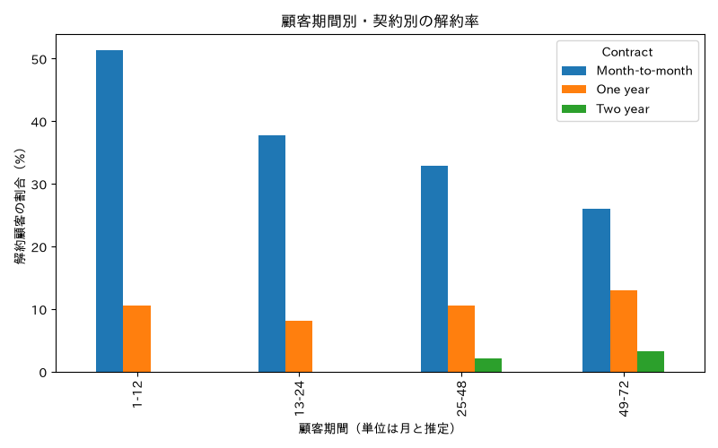

*正の顧客期間を4帯に分けた契約別解約率。短期2年契約のゼロ率は少数標本での観測結果であり、保護効果の証明ではない。期間の単位は月と推定。区間はNotebookの対応表にあり、図中に誤差棒はない。*

**AIが生成した追加依頼2 — 月額料金とサービス構成の仕様依存**

> 月額料金の正の関連は契約・顧客期間・インターネット種別・追加サービスをどこまで調整するかで変わるか確認してください。月額の非線形モデルとサービス別の料金範囲を調べ、累積料金を追加した仕様も感度分析として比較してください。サービス構成の代理情報、共線性、非現実的な料金介入を区別し、「高料金が解約を引き起こす」という結論を避けてください。

**選定理由**: 月額ORが期間・契約調整の1.361から部分サービス調整で1.143へ変わり、料金帯の粗解約率も単調でなかったため、AIは独立した料金関連とサービス構成・関数形への依存を分けて検証しました。

| 調整仕様 | 対象人数 | 月額10金額単位増加のOR | 95%信頼区間 |
|---|---:|---:|---:|
| 期間・契約 | 7,043 | 1.361 | 1.323–1.400 |
| サービス等の部分追加 | 7,043 | 1.143 | 1.072–1.220 |
| 全サービス構成 | 7,043 | 0.699 | 0.373–1.307 |
| 全サービス構成＋累積料金 | 7,032 | 0.787 | 0.420–1.478 |

**結果**: 全サービス構成の調整でORは1未満へ反転し、区間は1をまたぎました。最大相対偏差は0.48658、感度判定は `stable=False` です。月額の独立した正の関連は頑健ではなく、反転を値上げの保護効果とも解釈できません。全サービス調整下の線形月額と月額スプラインの比較はLR=7.289、自由度3、p=0.0632で、明確な非線形改善を示したとはいえません。探索的検査で、多重比較補正はしていません。

DSL、Fiber optic、インターネット未利用の月額中央値は56.150・91.675・20.150と異なり、料金はサービス構成と結びついていました。設計行列条件数は期間・契約仕様84.47、全サービス377.88、累積料金追加585.26ですが、この指標は尺度にも依存します。累積料金追加は欠損11件を除いた別標本の感度分析であり、主解析ではありません。ほかのサービスを固定して料金だけ変える計算には、現実に存在しない料金・サービスの組合せが含まれ得ます。根拠はセル18の4仕様OR・区間表、サービス別料金範囲、形状検査と、セル19の証拠付き所見です。

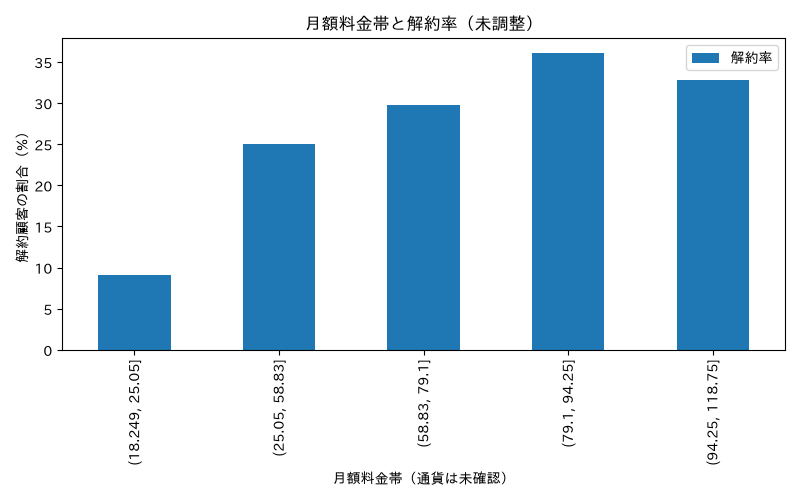

*月額料金を5つの分位帯に分けた粗解約率。最低帯9.15%から第4帯36.11%まで上がるが、最高帯は32.81%で単調ではない。契約・期間・サービス構成を調整した図ではなく、高料金の因果効果を示さない。通貨は未確認。*

**AIが生成した追加依頼3 — 情報重複とクラス不均衡下の予測評価**

> 料金とサービス構成の情報重複を料金回帰のR²・残差で確認し、同じホールドアウトで月額・契約・期間をそれぞれ除いた予測モデルを比較してください。クラス重み付けなし／balancedと3つの層化分割でAP・AUC・recall・Brierの安定性を確認し、初回testの条件付きbootstrap区間も付けてください。仕様をtest成績で選ばず、予測関連を因果効果や前向き運用性能と混同しないでください。

**選定理由**: 全サービス調整で料金ORが反転し、区間も広がったことから、AIは料金の独立した変動と予測への追加情報を直接確認しました。同時に、クラス不均衡による見逃しと単一分割の不確実性を最後の検証対象に選びました。

**結果**: サービス構成だけで月額を説明する回帰の評価データR²は0.998807、残差SDは1.03、元の月額SDは29.91でした。月額とサービス情報のほぼ重複した関係が確認できました。

| 同じ評価データでの特徴除外 | ROC-AUC | AP |
|---|---:|---:|
| 全特徴（ID・累積料金除外） | 0.866922 | 0.708929 |
| 月額を除外 | 0.866874 | 0.708654 |
| 契約を除外 | 0.862445 | 0.707514 |
| 顧客期間を除外 | 0.847579 | 0.632906 |

月額を除いても性能はほぼ変わらず、期間を除くとAPが低下しました。ただし、ほかの特徴による代替を含む予測上の比較であり、因果的重要度の順位ではありません。

seed=43・19・73の層化分割と重み付けなし／`balanced` の6仕様を比較しました。10%以内の最大相対偏差という設定基準では、AUC（0.02458）・AP（0.07204）は安定、recall（0.41887）・Brier（0.27427）は不安定でした。seed=43で `balanced` にするとrecallは0.567から0.805へ上がりますが、precisionは0.714から0.538へ下がり、Brierも0.125から0.152へ悪化します。誤警報数は106から323、見逃し数は202から91へ変わりました。見逃し削減と誤警報・確率予測にはトレードオフがあります。

初回評価データに対する300回の層化bootstrapによる95%区間は、AUC 0.84877–0.88418、AP 0.67068–0.74753でした。これは学習済みモデルと同じCSVに条件付けた区間で、学習変動や母集団変動を含みません。評価成績による仕様・閾値選択はしていません。根拠はセル21の料金回帰、特徴除外比較、6仕様、bootstrap表と、セル22の証拠付き所見です。

**反復の停止判断と追加確認ログ**: AIは3回で、期間仕様、料金の代理情報、クラス不均衡という結論に直結する確認を終えました。代表性、特徴の測定時点、因果識別、前向き性能は同じCSVの追加計算では解決しないため、無制限の探索は行わないと記録しています。`followup.log` にも既存3回の反復を再評価し、新規の反復依頼は行わないという判断があります。この追加確認を4回目の追加分析とは数えていません。同ログには証拠照合・改善候補の補強を行う意向がありますが、追加確認後の新しい数値出力や別の再実行完了記録は確認できません。

**最終結論**: 契約・顧客期間には、このCSV内で解約との関連があり、確認した期間モデルの仕様範囲でも契約関連は残りました。ただし、現在契約の自己選択、顧客の生存者選択、測定の時間順序を除去した因果効果ではありません。月額料金の独立した関連はサービス調整に強く依存し、料金自体の予測上の追加情報も小さい結果でした。「高料金が解約原因」「長期契約に変えれば解約を防げる」「値下げで解約率が下がる」という施策効果は支持されていません。

**再現性・監査**: `initial.log` は、kernel再起動後に全セルを再実行して最終監査したと報告しています。Notebookの保存済み記録では14コードセルの実行番号は1–14の順、再実行確認日時は2026年10月2日08:07:56.667553 JSTです。最終 `audit_notebook(visual_audit=True)` は `ok=True`、nbformat有効、未実行・エラー・構造監査所見・視覚監査所見はすべて0件でした。PNG出力はセル24・25・26の3点、証拠付きInsightは8セルです。最終ライフサイクルは `completed`、実行中セル・保留書込み・保持ロックはいずれも0でした。

環境情報としてNotebookはKaggle 2.2.4、NumPy 2.5.3、pandas 3.0.6、SciPy 1.18.1、scikit-learn 1.9.1、statsmodels 0.15.0、Matplotlib 3.11.2、nbformat 5.11.1を記録しています。これらは実験時の記録であり、本節作成時に分析を新たに再実行したという意味ではありません。

`status.json` の `analysis_complete=true`、`final_completion.ready=true` は、保存Notebookの分析・反復・図表・証拠・監査記録と整合します。初回プロセスは終了コード0、`initial_termination=exited`。追加確認は `followup_termination=artifact_complete_cutoff` であり、ログにもNotebookが安定し監査を通過したためランナーがプロセス群を停止したとあります。これを分析失敗や新規再実行成功とは読み替えていません。文書化前の `documentation_complete`、`semantic_complete`、`report_exit_code` は分析成否の判定には使用していません。

保存Notebookは `benchmark/projects/kaggle-v020-kaggle-exp-43-customer-churn/notebooks/kaggle-v020-kaggle-exp-43-customer-churn.ipynb`、根拠ログは `benchmark/runs/43-kaggle-exp-43-customer-churn/` の `initial-prompt.md`、`initial.log`、`followup.log`、`status.json` です。本節の分析証拠はこの5ファイルに限定し、既存記事は書式・詳細度の参照だけに用いています。

**途中の失敗と切り分け**: 分析完了までに以下の問題が記録されました。最終監査の所見0件だけで、途中の失敗や監査の適用限界を消してはいません。

| 問題 | 証拠と対応 | 切り分け |
|---|---|---|
| SDKのメタデータ取得メソッド非対応 | セル5に `dataset_view` の `AttributeError`。`dataset_metadata(dataset, path)` へ切替え、CSV取得・分析への影響なしと記録 | Kaggle SDK固有。Jupytermind候補には含めない |
| 特異な設計行列 | セル11に `LinAlgError: Singular matrix`。未利用インターネットの重複ダミーを追加サービスのYes指示子へ再パラメータ化し、全モデルのフルランクと収束を確認 | AIが作成した分析コードの問題 |
| 画像セルの実行番号不整合 | `execution_stamp_debug_log` に、次番号を使ったため重複番号が生じて最終順序検査に失敗した記録。入力履歴の実番号へ訂正して全セル再実行 | Notebook作成コード／IPython連携の問題 |
| 棒グラフのラベル切れ | セル28に初回画像の目視確認と再現PNGのハッシュ。autolayoutと描画サイズを呼出側で設定 | Jupytermind描画機能の改善候補 |
| クリーン再実行の日本語欠落 | `prior_reexecution_failure` に期間・契約図で35件のglyph warningと `state=failed`。各図にIPAexGothicを明示して再実行 | Jupytermindフォント状態の改善候補 |
| 図表メタデータ欠落を視覚監査が報告しない | セル28のメモリ内Notebookで `metadata.chart` を省略して直接監査し、所見0件 | Jupytermind視覚監査の改善候補 |

**Jupytermind改善候補**: セル28の直接呼出しとNotebookメタデータに3件を記録しています。メタデータなしのPNGを未確認と報告しない監査機能不足、既定レイアウトで長いラベルが切れる描画機能不足、日本語描画後のrcParams復元でフォントが再適用されない状態不具合の候補です。フォントの最小再現では28件のglyph warningが残っています。内部の一度だけの適用フラグとの不整合という説明はNotebookが記録した原因候補であり、本節でソースを独立検証した確定原因ではありません。レイアウトの欠落もNotebookの目視記録を根拠とし、再現PNGの外部ファイル自体は本節の追加証拠にしていません。

回避策は、全図に監査用メタデータを明示し、描画時のglyph warningを捕捉し、各描画の `rc_context` にautolayout、サイズ、IPAexGothicを指定することでした。最終保存図には欠落glyphの記録がなく、補正後3図の目視確認もNotebookに残っています。ただし、回避成功はライブラリ本体の恒久修正を意味しません。各候補の分類・再現手順・期待／実際・影響・証拠・受け入れ条件は、同じ実験ディレクトリの `issue-candidate.json` に保存しました。Copilot CLIや外部ランナーの停止制御を、この3件の原因とは扱っていません。

**残る限界**: 最終前提検査でも代表性と特徴の測定時点の2件が未検証の警告として残ります。構造監査の合格と科学的な前提の解消は別です。IBM由来の教育用標本で、現在の実顧客母集団を代表するか不明です。顧客期間は月と推定、通貨・収集日・標本抽出・測定方法も未確認です。期間別の割合は顧客月当たりのハザードではなく、開始日・イベント時点・追跡履歴がないため生存分析は実施していません。

期間調整後も未観測の満足度や契約選択、逆因果、生存者選択が残り、契約・料金変更の効果は識別できません。感度分析は事前に限定した仕様だけを対象とし、3つの分割も同一CSV内で重なります。bootstrapは条件付き区間で、独立データでの検証、時間外検証、将来月での校正や介入評価はしていません。独立データ比較がないこと、長期・高料金顧客を統計的外れ値として削除しないことも、非適用の理由としてNotebookに記録しています。AIによる反復は初回の独立した料金関連という読み方を修正し、問いへの回答を慎重にしましたが、原因や施策の有効性を確定するには別の研究設計とデータが必要です。

## 実験46: Crop Yield（分析完了・収量変化と地域差を記述、因果効果は断定しない）

**課題**: 「Kaggleの作物収量データを使い、作物・地域・年・気象条件による収量差を調べてください。」

**初回プロンプトの生成方法**: 以下の初回プロンプトは、データセットと分析上の問い、および取得・実行・監査・反復に関する共通制約から、AIが自動生成したものです。人間が実験46の全文を個別に作成したものとしては扱いません。引用は `initial-prompt.md` の全文です。

**初回プロンプト（全文・原文）**:

> Kaggleの作物収量データを使い、作物・地域・年・気象条件による収量差を調べてください。単位、地域粒度、欠測を確認し、時間変化と地域差を分けた分析と図表を選び、観察データから施策効果を断定しない日本語の結論を示してください。 Kaggle参照先: https://www.kaggle.com/datasets?search=crop+yield+weather。インストール済みkaggle Python SDKを使い、NotebookのJupyter MCP実行セル内で`KaggleApi().authenticate()`、`dataset_list(search=...)`、`dataset_list_files(...)`、必要に応じて`dataset_download_file(...)`を呼び出し、Kaggle上の対応する公開データを検索・取得してください。owner/dataset slug、取得ファイル名、取得日、ファイルSHA-256をNotebookに記録してください。APIトークンをセル出力・Notebook・ログへ表示しないでください。分析・API取得コードの実行はJupyter MCPだけを使い、端末コマンド、subprocess、外部スクリプト起動、作業エージェントへの委譲は行わないでください。Kaggle APIで対応データを取得できない場合は、`/home/nahisaho/kaggle/experiments/white-paper.md`を確認してください。同じデータセットの公開CSVが同稿に明記されている場合だけ、そのURLへフォールバックしてください。対応するCSVを確認できない場合は、別データを推測で選ばず、取得失敗として記録してください。保存先は benchmark/projects/kaggle-v020-kaggle-exp-46-crop-yield/notebooks/kaggle-v020-kaggle-exp-46-crop-yield.ipynb としてください。run_idは `v020-exp-46` です。長時間処理の開始前にlifecycle.register_runを呼び、実行・書込みフェーズを記録し、終了時にcompletedまたはfailedを記録してください。データ定義manifest、分析前提manifest、意味的な異常検査、妥当な範囲の感度分析を使い、適用できない機能は理由を記録してください。図表はvisual_audit=Trueで監査してください。Notebookには「使用したJupytermindモジュール」節を設け、直接import・呼び出したモジュール名、関数名、使用目的を記録してください。間接利用は使用済みに含めないでください。Jupytermindの不具合または機能不足が疑われた場合は「Jupytermind改善候補」節を設け、分類、再現条件、期待する挙動、実際の挙動、影響、回避策、関係するセルとログを記録してください。Copilot CLI、Kaggle API、ベンチマークランナーに固有の問題とは切り分け、候補がなければ「なし」と記録してください。初回分析後、自分で結果を読み直し、結論に実質的な影響を与える未解決点があれば自然言語の追加依頼文を作成し、Notebookの「反復依頼履歴」に原文のまま記録して実行してください。価値ある追加分析がなくなるまで最大3回繰り返し、各反復の選定理由・結果・証拠・残る限界を報告してください。最後に全コードセルを上から再実行し、notebook_auditとライフサイクル状態を記録してください。

**使用したJupytermindモジュール**: Notebookの実行コードで直接import・呼び出しを確認できる `ai_data_scientist` 配下の14モジュールだけを記載します。関数・クラス・メソッド名はNotebookの呼び出しに対応します。

| モジュール | 直接呼び出した関数・クラス・メソッド | 使用目的 |
|---|---|---|
| `project_manager` | `resolve_project`, `ensure_notebook`, `ensure_data_dir`, `enqueue_write` | 指定プロジェクトと保存先の解決、データ領域の確保、Notebook書き込みの直列化 |
| `lifecycle` | `register_run`, `mark_execution_start`, `mark_execution_end`, `mark_write_start`, `mark_write_end`, `is_cancel_requested`, `mark_completed`, `mark_failed`, `get_run_status`, `wait_for_quiescence` | 実行・書き込みフェーズ、取消し要求、完了・失敗と静止状態の追跡 |
| `language_router` | `detect_language` | 日本語の依頼文の言語判定 |
| `ingestion` | `SourceSpec`, `ingest` | 取得済みCSVの読み込みと10万行上限による打ち切りがないことの確認 |
| `cleaning` | `clean_dataset` | 完全重複の識別、再構築表の必須項目欠測の除去と件数記録 |
| `eda` | `explore` | 型、欠測、カテゴリ、記述統計の確認 |
| `data_quality` | `detect_anomalies` | 必須項目、非負条件、年・気象値の許容範囲による意味的異常候補の検査 |
| `data_definition` | `FieldValue`, `build_manifest`, `DataDefinitionManifest.unresolved_fields` | 単位、観測キー、出典、変換、確信度と未解決定義の記録 |
| `analysis_assumptions` | `Assumption`, `AnalysisAssumptionManifest`, `check_manifest` | 国集合・集計・気温代表性・一般化・因果解釈に関する前提と警告の記録 |
| `stats_analysis` | `correlation` | 作物・国間差・時間差が混在する単純相関の診断。最終結論には不採用 |
| `sensitivity` | `SensitivityPlan`, `run_sensitivity` | 気温3作物、時間変化10作物の各8仕様と、相対偏差20%の量的安定性の確認 |
| `visualization` | `render_chart` | 折れ線、棒、散布図のPNG生成 |
| `insight_engine` | `extract_cited_value`, `record_insight` | 実行出力の証拠トークン抽出と、日本語結論への実行カウント・引用値の付与 |
| `notebook_audit` | `audit_notebook`, `audit_visual_outputs` | `visual_audit=True`のNotebook監査と、図表メタデータ全欠落の検査漏れの再現 |

回帰、Holm補正、固定効果の直交射影、順位相関、一部の図の描画には、Notebook内のstatsmodels、patsy、numpy、scipy、matplotlib等のコードも使われています。これらをJupytermindモジュールの機能とは数えません。

**初回指示**: 単位・地域粒度・欠測を確認し、時間変化、地域差、気象との関連を区別して、日本語の根拠と限界を示すことを求めました。国・年固定効果モデルや具体的な感度仕様、追加依頼の内容は初回プロンプトで指定していません。AIがデータを確認して分析方法と最大3回の反復を選びました。

**データ取得**: Notebookは `crop yield weather`、`crop yield prediction` でKaggle SDK検索を行い、候補のファイル一覧・公開メタデータを確認して、`patelris/crop-yield-prediction-dataset` を選びました。収量・国・年・降水・気温を含む統合表と、その元の4表を同じslugから取得しています。公開説明の「FAO and World Bank由来」は出典側の申告であり、独立した原本照合による確認ではありません。API取得は成功しており、外部CSVへのフォールバックを使った記録はありません。

| 取得ファイル | 行数・列数 | 元表で確認された欠測 |
|---|---|---|
| `yield_df.csv` | 28,242行・8列 | なし。保存用インデックス列を含む |
| `yield.csv` | 56,717行・12列 | なし |
| `rainfall.csv` | 6,727行・3列 | 降水値774件。数値変換後の欠測・非数値は780件 |
| `temp.csv` | 71,311行・3列 | 気温2,547件 |
| `pesticides.csv` | 4,349行・7列 | なし |

取得日時とSHA-256はNotebookセル5の出力に記録されています。日時はUTCで、いずれも日本時間2026年10月2日朝の取得です。再実行では初回取得日時を維持し、保存済みファイルのハッシュを再照合しています。

| ファイル | 初回取得日時（UTC） | SHA-256 |
|---|---|---|
| `yield_df.csv` | `2026-10-01T23:17:31.108157+00:00` | `3d47d3fdc35950b5333348c0d28dbe5534346237813dd1db9d4c26f2935d888b` |
| `yield.csv` | `2026-10-01T23:17:33.278856+00:00` | `ddd4855e82cc072433555c972fef6728a05b28f17651221aeb5aac9136ec358c` |
| `rainfall.csv` | `2026-10-01T23:17:33.947914+00:00` | `684df19bb1bdc27f389643758ad852f0cc247cb982bebf9cf4c0fb1e3797e4c4` |
| `temp.csv` | `2026-10-01T23:17:35.851704+00:00` | `0635487775a8948dc6f8035750690dc1f6f988b7f2c15e113866e2c84df158ae` |
| `pesticides.csv` | `2026-10-01T23:17:37.404888+00:00` | `913fa4d98285a18eb4893210340c585010d2756019d2c6a0120ec86b39e21fca` |

**単位・粒度・欠測の確認**: 収量単位は `yield.csv` の `Unit=hg/ha` と統合表の全キーの収量一致で確認し、10,000で割ってt/haへ換算しました。地域は国・領域名と推定され、県・圃場・観測地点単位ではありません。気温の摂氏、降水のmm/年は列名・値域等からの推定で、測定手順や空間重みは未確認です。農薬は国全体の有効成分トン数であり、ha当たり施用量でも施策の割当でもありません。

統合表は101地域・10作物、1990–2013年のうち2003年を欠く23観測年です。欠測セルがなくても、結合で落ちた国や年がないとはいえません。保存用インデックスを除いた完全重複は2,310行、国×作物×年は13,130通りで、同じ国年に複数の気温があるケースは575件でした。同一キーの収量は一致しますが、統合表28,242行を独立した農地観測28,242件と扱うことはできません。また、全101地域で降水値は期間中一定でした。意味的異常検査の所見は空ですが、この時間情報・粒度の制約は別途キー検査で記録しています。

**初回結果**: 初回分析では国×作物×年へ集約し、気温は同一国年の統合表値の中央値としました。23観測年がそろう507国作物ペア、11,661行を固定して、国を等重みで比較しています。1990年を100とする収量指数では、トウモロコシ51.70%、小麦22.91%、籾米36.14%の増加を観察しました。トウモロコシの77国の23観測年平均収量は、国分布の10–90パーセンタイルで0.999–9.024 t/haでした。

気象については、作物ごとに国別期間平均を使った国間回帰と、国・年固定効果を使った国内年変動の回帰を分けました。従属変数はlog収量で、国間回帰はHC3標準誤差、国内回帰は国クラスタ標準誤差を使っています。初回の国内気温係数はSoybeansで−0.06829（無補正95%区間−0.12163–−0.01495）、Yamsで0.13829（0.00840–0.26818）でしたが、この段階では多重検定・国集合・気温集計への頑健性が未解決でした。作物等を混ぜた単純相関は−0.1419でしたが、国間差と時間差を混同するため結論には使っていません。証拠はセル7・9の出力です。

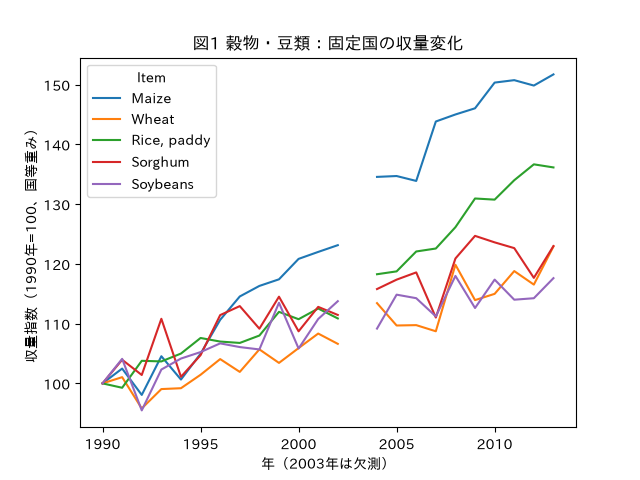

*初回の固定国集合における穀物・豆類の収量指数。国等重み、1990年=100。2003年は欠落を補間せず、線を途切れさせています。*

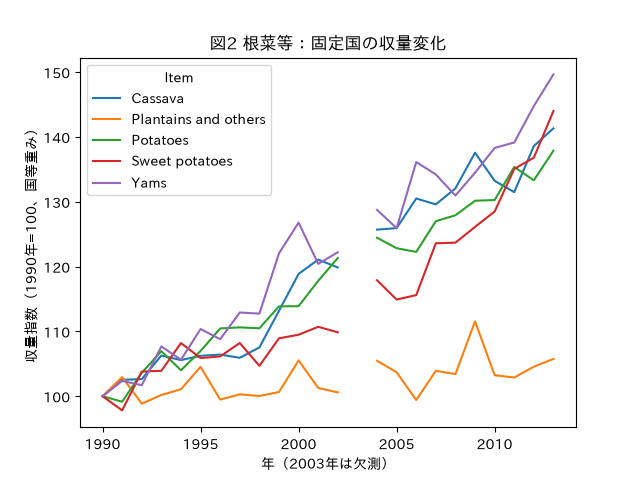

*Cassava、Plantains and others、Potatoes、Sweet potatoes、Yamsの初回収量指数。作物ごとに基準化した時間変化であり、作物間の絶対収量や栄養価の順位ではありません。*

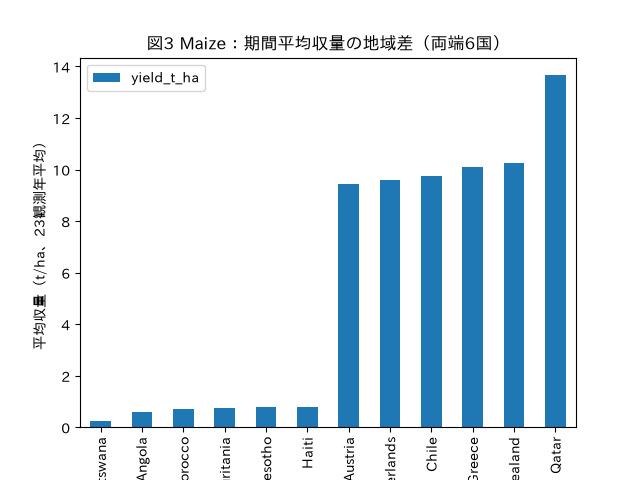

*トウモロコシの23観測年平均収量。初回の77国から低収量側・高収量側を各6国抜粋した比較で、全地域の代表標本ではありません。*

**AIが生成した追加依頼1 — 元表からの再構築と結合による選択の確認**

> 2003年が欠落し、完全パネルへの絞り込みで選択バイアスが生じています。同じKaggleデータセットの元表から国・作物・年単位の収量と気象を再構築し、農薬総量との結合が欠落や重複を生む原因か確認してください。元表の欠測・結合脱落を年別に数え、統合表と再構築表で時間変化と地域差がどれほど変わるか比較してください。

**選定理由**: AIは2003年の全欠落と、問いに必須でない農薬結合が、時間変化・地域カバレッジを左右すると判断しました。依頼文と理由はNotebookの「反復依頼履歴」に原文で残っています。

**結果・証拠**: 2003年は元収量表に1,094国作物行、気温あり662行、農薬あり902行がある一方、降水ありは0行でした。全欠落の直接の原因は農薬ではなく降水表です。農薬を必須結合条件から外すと、元収量26,040行から必須気象・収量欠測の11,172行を除き、気象完備14,868行・116地域になりました。23観測年完備の国作物ペアは507から568へ、主回帰パネルは13,064行へ増えています。統合表の13,130キーは再構築表に含まれ、重複キー上の気温中央値の最大差は0でした。

国集合の変更により、トウモロコシの増加率は51.70%から51.01%、小麦は22.91%から24.23%、籾米は36.14%から33.81%へ変わりました。最大の差はYamsの49.64%から39.79%への約9.855ポイントの低下です。国構成を変えても同じ結果になると仮定できないことを確認しました。証拠はセル13の年別カバレッジ、比較表、反復1の出力です。

**残る限界**: 国名の不一致と気象欠測による脱落は残ります。同じslugの元表照合は内部整合性検査であって、独立データによる検証ではありません。気象分析では2003年を補完せず23観測年を維持しました。

**AIが生成した追加依頼2 — 国間・国内の気温関連、感度、多重検定**

> 国間の気温差と国の中の年変動で収量との関連が異なる理由を検証してください。再構築した完全パネルで作物別の国・年固定効果モデルを計算し、気温の中央値と平均値、国別時間トレンドの有無、多重気温のある地域を除く条件で感度分析してください。10作物を同時に調べることによる多重検定も考慮し、安定しない関連を施策効果や気候効果と断定しないでください。

**選定理由**: 初回のSoybeans・Yamsの関連だけを取り上げると、気温集計方法、国別トレンド、10作物の同時検定に依存した結論になる可能性があるためです。

**結果・証拠**: 再構築パネルでは、国間の気温係数はMaize、Potatoes、Rice, paddy、Sorghum、Soybeans、Wheatで負の関連があり、各比較範囲・変数内の10作物に対するHolm補正後も5%水準を下回りました。一方、国・年固定効果で分けた国内年変動の気温係数は、Holm補正後に5%水準を下回る作物が0でした。Soybeansの国内係数は−0.06392（無補正95%区間−0.11668–−0.01116）で、未補正p値0.01758に対しHolm補正p値は0.17579です。Yamsは0.10972（−0.00715–0.22659）、補正p値0.59194でした。初回の関連をそのまま確定的な結論にはしません。

気温の中央値/平均値、国別トレンドなし/あり、多重気温地域の包含/除外の2×2×2仕様で、注目した3作物の感度分析を行いました。

| 作物 | 8仕様の気温係数の範囲（log収量） | 最大相対偏差 | 相対偏差20%の量的安定性 |
|---|---|---|---|
| Maize | −0.06026–−0.02468 | 1.441 | 未達 |
| Soybeans | −0.08961–−0.06141 | 0.402 | 未達 |
| Yams | 0.04938–0.12834 | 0.550 | 未達 |

係数の方向はこの8仕様内では維持しましたが、量的安定性は3作物とも未達です。基準値からの相対偏差と、符号の安定性は異なる指標です。証拠はセル16のモデル表・感度表で、気温1単位は `avg_temp` の数値1の差を意味します。単位の摂氏が原資料で確定しているとは扱いません。

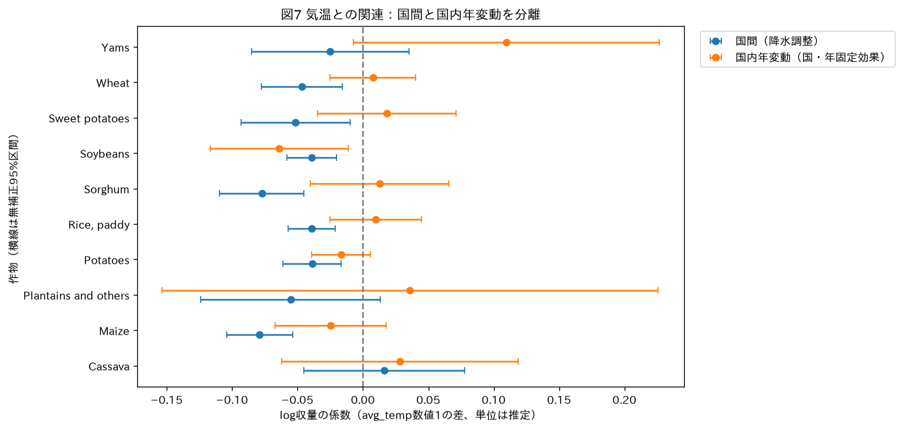

*再構築した23観測年パネルのlog収量に対する気温係数。国間回帰は降水を調整し、国内回帰は国・年固定効果を使います。横線は多重補正なしの95%区間で、有意性判断には別途Holm補正p値を用います。*

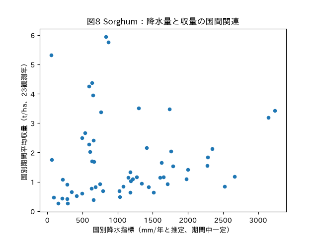

*Sorghumの60地域の降水指標と23観測年平均収量。降水値は国別に期間中一定であり、同じ国の年々の降雨変化を表す散布図ではありません。国間回帰の降水100mm当たりの係数は0.03959、Holm補正p値は0.00910ですが、降雨増加の因果効果とは解釈できません。*

**残る限界**: 感度対象の3作物は探索的に選ばれています。Holm補正は比較範囲・変数ごとの10作物内で行われ、実験中のあらゆる探索を包括する補正ではありません。気温の観測地点・栽培期・農地への代表性、灌漑・品種・土地・技術等の未観測交絡は解消していません。非有意は「気温の影響がない」という証明でもありません。

**AIが生成した追加依頼3 — 端点・国集合・集計方法と地域順位の安定性**

> 1990年と2013年だけの比較に結果が依存していないか確認してください。前後3年平均との比較、国平均と国中央値、気象が完備した固定国と収量だけが24年完備した固定国の違いを検証し、2003年も収量元表から使える場合は時間図に示してください。地域差についても、同じ作物の10–90パーセンタイルと、期間の前半・後半で地域順位がどの程度維持されるかを確認してください。

**選定理由**: 端点の異常年、国構成、平均に強く影響する高収量国が、「収量増加」の結論を変える可能性があるとAIが判断しました。

**結果・証拠**: 1990年対2013年/1990–1992年平均対2011–2013年平均、国平均/国中央値、気象完備の固定国/収量のみ24年完備の固定国の2×2×2仕様を比較しました。全10作物で8仕様すべての変化率が正でしたが、増加幅の相対偏差20%の安定性基準を満たした作物は0でした。

| 作物 | 基準仕様の国数（気象完備） | 基準仕様の増加率 | 8仕様の増加率の範囲 |
|---|---|---|---|
| Cassava | 48 | 35.93% | 16.13–35.93% |
| Maize | 84 | 51.01% | 50.03–67.14% |
| Plantains and others | 24 | 4.96% | 2.72–42.90% |
| Potatoes | 84 | 35.72% | 27.87–36.82% |
| Rice, paddy | 69 | 33.81% | 28.29–54.12% |
| Sorghum | 60 | 26.18% | 21.06–37.33% |
| Soybeans | 50 | 17.72% | 5.39–20.58% |
| Sweet potatoes | 55 | 40.13% | 25.83–46.67% |
| Wheat | 72 | 24.23% | 22.36–46.41% |
| Yams | 22 | 39.79% | 14.63–62.04% |

基準仕様は、気象23観測年が完備する固定国集合の1990年対2013年の算術平均収量です。収量のみ完備する別仕様では、たとえばMaizeは136国になり、基準仕様の84国とは異なります。国中央値の変化率は、個々の国の変化率の中央値ではありません。上表の範囲は仕様間の幅で、信頼区間ではありません。

最終の時間図・地域差は、気象完備の同じ568国作物ペアについて、元収量表の24年を使いました。2003年の568収量観測も利用でき、気象欠測を補完したわけではありません。作物別の国の24年平均収量の10–90パーセンタイル比は2.652–8.717倍でした。1990–2001年と2002–2013年の国別平均収量の順位相関は0.824–0.959で、Maizeは0.939、Wheatは0.959でした。Maizeの10–90パーセンタイルは1.012–8.822 t/ha、中央値は2.184 t/haです。証拠はセル19の8仕様要約・地域順位表です。

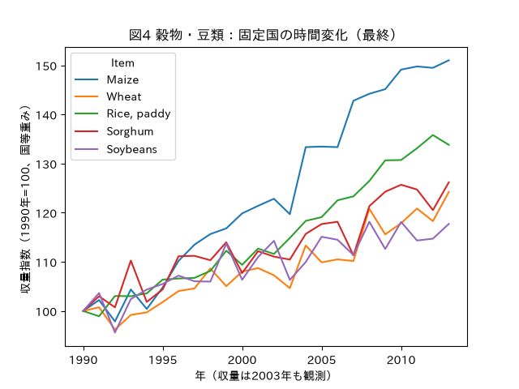

*再構築後の固定国集合による穀物・豆類の24年間の収量指数。2003年の収量は元表の観測値で、初回図の欠落を気象補完で埋めたものではありません。*

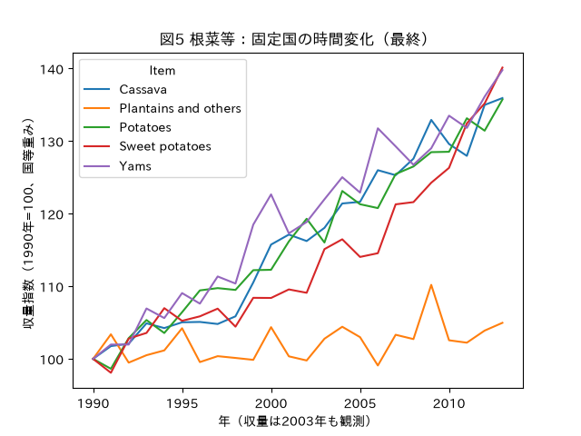

*再構築後の固定国集合による根菜等の収量指数。長期の増加方向と年ごとの変動を区別し、国集合変更による初回との差も踏まえて読みます。*

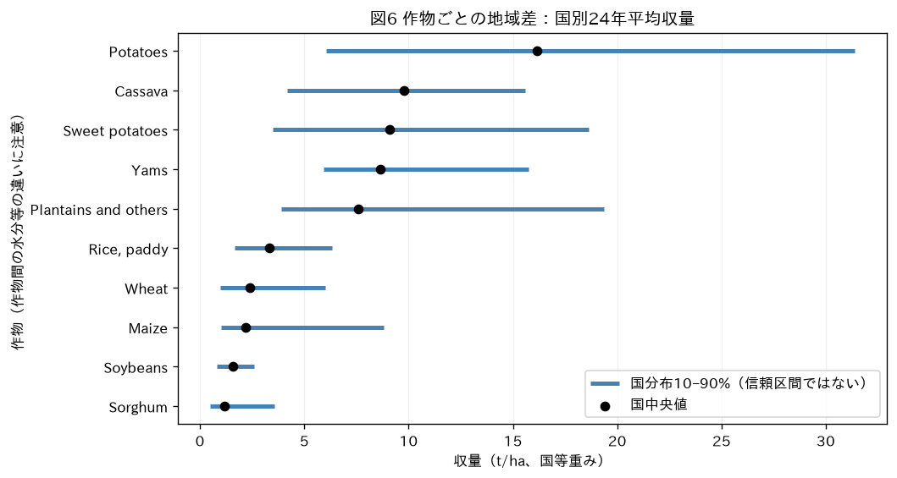

*同じ作物内の国別24年平均収量の10–90パーセンタイルと国中央値。線は国分布であって信頼区間ではありません。作物間の水分・可食部等が統一されていないため、t/haの大小を生産性・栄養価・利益の優劣とはみなしません。*

**反復終了の判断**: 3回の上限に到達しました。独立参照データ、地点・栽培期・面積重み、灌漑・品種・施策の識別情報は同じ表の追加分割だけでは得られないため、「世界の安定した増加幅」や「施策効果」の主張はせず、収録固定国の記述として終了しています。あらゆる感度条件で安定したという意味ではありません。

**追加確認ログの位置づけ**: 3回のAI生成依頼は初回セッション内で実施されています。`initial.log` の最終応答も3回の反復とその結論を報告しています。`followup.log` は既存の反復3回を確認し、「追加反復は増やさず、証拠参照と改善候補の受け入れ条件を更新します」と述べていますが、第4の分析依頼文や新しい定量結果は記録していません。`status.json` の初回・最終Notebookは同じ840,726バイト・同じmtimeであり、このログの予告だけから追加確認中のNotebook更新完了を認定しません。

**最終結論**: 収録された固定国集合の国平均収量は、1990–2013年にMaizeで51.01%、Wheatで24.23%、Rice, paddyで33.81%増加しました。調べた8仕様では10作物すべてで増加方向が共通ですが、増加幅は国集合・期間窓・平均/中央値に依存します。同じ作物でも持続的な地域差があり、Maizeの国別24年平均収量の10–90パーセンタイルは約8.72倍に開いています。国間の気象関連と国内年変動の関連は同じではなく、国内気温係数は10作物のHolm補正後に有意なものがありません。降水の年次変動はこの表では推定できません。これらは観察データの記述・関連であり、世界の面積加重収量、政策成果、気候の因果効果・無効果を示す結論ではありません。

**監査・再現性**: 分析完了の根拠は、`status.json` の `analysis_complete=true`、`final_completion.ready=true` と、その要件がすべてtrueであること、およびNotebookに残った実行出力・図表・結論です。本節の証拠に用いたのは指定されたNotebook、初回プロンプト、初回ログ、追加確認ログ、監査状態の5ファイルだけです。体裁の参照に用いた `white-paper2.md` の結果を本実験の証拠にはしていません。以下のセル番号はNotebook配列の0始まりで、実行カウントとは区別します。

| 確認対象 | 実ファイルに残る記録と判定範囲 |
|---|---|
| 最終Notebook | コード13セルすべてに実行カウントがあり、未実行・エラー出力のセルなし。PNGはセル11に3点、セル22に5点、合計8点 |
| 再実行 | 先行12コードセルの実行カウントは1–12で昇順。最終監査セルは再実行されており、現在の実行カウントは15。ログは全13セル再実行を報告するが、本節作成時に分析自体を再実行したわけではない |
| 監査中と保存後の差 | 監査セルの初期出力は実行済み12セル・Insight 0件・実行中監査セルを除外する警告1件。その後の「最終セル保存後の再監査」出力とNotebook metadata、`status.json.final_audit` は実行済み13セル・Insight 3件・所見なし・可視化所見なしで一致 |
| 根拠付き結論 | セル29–31の結論に、実行カウント12と `FINAL_TIME_MAIZE_PCT=51.013697`、`FINAL_REGION_MAIZE_RATIO=8.716983`、`FINAL_WEATHER_HOLM_SIGNIFICANT=0` の引用値を付与。引用元はセル24の出力 |
| 図表検査 | 描画ログは8点ともGlyph警告0件。タイトル・軸・凡例・`missing_glyphs`のmetadataを明示し、最終監査コードでも存在を別途assert。監査所見なしだけで画像内容の正しさを保証しない |
| ライフサイクル | セル32の「終状態」出力は `completed`、実行数・書き込み数・ロック数すべて0。一方、Notebook metadataのsnapshotは `completed` だが書き込み1・ロック1。保存中の記録と保存後の静止状態を同一視しない |
| 再実行snapshotの限界 | 監査出力中の監査実行カウント16、metadataの18、現在のセルの15は一致しない。先行12セルの順序と最終成果物の実行済み状態は確認できるが、すべてのsnapshotが単一時点の記録であるとは断定しない |
| 外部実行記録 | 初回は終了コード0、1,027.6秒、`exited`。追加確認は終了コード0、95.3秒だが `artifact_complete_cutoff`。後者はランナーによる安定成果物の確認・打ち切りであり、CLIが自然終了したことの証明ではない |
| 記録された再現環境 | セル24の出力はPython 3.12.3、pandas 3.0.6、numpy 2.5.3。その他の依存版をこの証拠だけで補完しない |

出典・単位・前提manifestには、未確定項目を確定値と区別して残しています。最終の前提では気温の農地・栽培期への代表性は `assumed`、世界全体への外的妥当性と政策効果の識別は `rejected` です。監査合格は、これらの科学的限界が解消したという意味ではありません。

**失敗・訂正の内容**: 実験全体の取得失敗や最終分析失敗は確認されませんが、途中の分析コードには訂正が記録されています。反復1は当初24年の気象完備を仮定して空パネルとなり、`KeyError(2013)` が発生しました。年別カバレッジを確認し、気象を23観測年へ修正して再実行しています。反復2では国別傾きと年ダミーの冗長性によるrank deficiency警告を受け、Frisch–Waugh–Lovellの直交射影と気温残差の分散確認へ修正しました。Notebookの改善候補節にはf-string改行の訂正も記載されていますが、具体的な例外・発生回数は指定ログや最終出力から確認できません。これらをJupytermind、Kaggle API、Copilot CLI、外部ランナーの不具合とは扱いません。保存後のエラー出力0件は、途中でエラーが一度も起きなかったことを意味しません。

**Jupytermind改善候補**: 図表監査の検査漏れ／機能不足候補が1件あります。セル24では、実行済みPNGセルをメモリ内Notebookへ複製し、そのセルのmetadataを空にして `notebook_audit.audit_visual_outputs(repro, (0,))` を呼び出しました。タイトル、軸、凡例、文字欠損の検査情報がすべて欠けていても、戻り値は空で、所見は0件でした。metadataがない図を「監査情報不足」として示すことが期待する挙動です。ただし、実装仕様の検証は本節の証拠範囲に含まれないため、既存仕様への違反が確定したバグとはせず、機能不足候補として扱います。

この再現はメモリ内のJupytermind関数だけで行われ、Kaggle API、Copilot CLI、外部ランナーの通信・認証・スケジューリングを介しません。影響は、`visual_audit=True`の所見なしだけでは文字・ラベル検査情報の存在を保証できないことです。本実験では描画時のGlyph警告捕捉、各図のmetadata・描画ログの明示、最終セルの存在assertで回避しています。分類、再現手順、期待・実際の挙動、影響、証拠、受け入れ条件は `issue-candidate.json` に保存しました。外部系の不具合は指定証拠からは確認されず、追加確認の打ち切りはランナーの終了方式として区別しています。

**限界と人間の判断が必要な点**: 地域名の対応、元データの観測・集計過程、気温の単位・地点・栽培期・農地重み、作物間の水分・可食部の比較可能性は未解決です。栽培面積・生産量がないため、世界の面積加重平均は計算していません。独立した第2データがないため、独立参照との異常照合・データセット比較は未適用です。一律のz-score外れ値除去は本来の作物・地域差を消す可能性から行わず、外れ値耐性が全面的に検証されたともいえません。`mcp_gateway.run_and_record` はカーネルから呼べるMCPClientが提供されないため未使用と記録し、Jupyter MCPによる実行と `enqueue_write` による保存を区別しています。

本実験での反復の価値は、新たな手法を増やすことより、欠落年の原因、結合による国選択、多重検定、集計による増加幅の不安定性を可視化し、結論の適用範囲を狭めた点にあります。人間には、元の統計定義と地域対応の検証、農地・栽培期を代表する気象データの選定、面積重み・灌漑・品種・技術・施策の情報を加えた研究設計が必要です。

## 実験47: Traffic Accidents（分析完了）

**課題**: 「Kaggleの交通事故データを使い、事故件数または重大度の時間帯・道路・天候による違いを調べてください。曝露量が不明な場合の率と件数の違い、記録バイアス、位置情報の欠損を確認し、慎重な日本語の解釈を示してください。」

**初回プロンプト（全文・原文）**: 以下は、データセットと問い、および共通制約からAIが自動生成した初回プロンプトです。人間がこの実験の全文を個別に作成したものではありません。`initial-prompt.md`の本文をそのまま掲載します。

> Kaggleの交通事故データを使い、事故件数または重大度の時間帯・道路・天候による違いを調べてください。曝露量が不明な場合の率と件数の違い、記録バイアス、位置情報の欠損を確認し、慎重な日本語の解釈を示してください。 Kaggle参照先: https://www.kaggle.com/datasets?search=traffic+accidents+weather。インストール済みkaggle Python SDKを使い、NotebookのJupyter MCP実行セル内で`KaggleApi().authenticate()`、`dataset_list(search=...)`、`dataset_list_files(...)`、必要に応じて`dataset_download_file(...)`を呼び出し、Kaggle上の対応する公開データを検索・取得してください。owner/dataset slug、取得ファイル名、取得日、ファイルSHA-256をNotebookに記録してください。APIトークンをセル出力・Notebook・ログへ表示しないでください。分析・API取得コードの実行はJupyter MCPだけを使い、端末コマンド、subprocess、外部スクリプト起動、作業エージェントへの委譲は行わないでください。Kaggle APIで対応データを取得できない場合は、`/home/nahisaho/kaggle/experiments/white-paper.md`を確認してください。同じデータセットの公開CSVが同稿に明記されている場合だけ、そのURLへフォールバックしてください。対応するCSVを確認できない場合は、別データを推測で選ばず、取得失敗として記録してください。保存先は benchmark/projects/kaggle-v020-kaggle-exp-47-traffic-accidents/notebooks/kaggle-v020-kaggle-exp-47-traffic-accidents.ipynb としてください。run_idは `v020-exp-47` です。長時間処理の開始前にlifecycle.register_runを呼び、実行・書込みフェーズを記録し、終了時にcompletedまたはfailedを記録してください。データ定義manifest、分析前提manifest、意味的な異常検査、妥当な範囲の感度分析を使い、適用できない機能は理由を記録してください。図表はvisual_audit=Trueで監査してください。Notebookには「使用したJupytermindモジュール」節を設け、直接import・呼び出したモジュール名、関数名、使用目的を記録してください。間接利用は使用済みに含めないでください。Jupytermindの不具合または機能不足が疑われた場合は「Jupytermind改善候補」節を設け、分類、再現条件、期待する挙動、実際の挙動、影響、回避策、関係するセルとログを記録してください。Copilot CLI、Kaggle API、ベンチマークランナーに固有の問題とは切り分け、候補がなければ「なし」と記録してください。初回分析後、自分で結果を読み直し、結論に実質的な影響を与える未解決点があれば自然言語の追加依頼文を作成し、Notebookの「反復依頼履歴」に原文のまま記録して実行してください。価値ある追加分析がなくなるまで最大3回繰り返し、各反復の選定理由・結果・証拠・残る限界を報告してください。最後に全コードセルを上から再実行し、notebook_auditとライフサイクル状態を記録してください。

**使用したJupytermindモジュール**: Notebookで直接import・呼び出した`ai_data_scientist`配下のモジュールを示します。モジュールの存在だけや間接利用を、使用実績には数えません。

| モジュール | 直接呼び出した関数・クラス・メソッド | 使用目的 |
|---|---|---|
| `project_manager` | `resolve_project`, `ensure_notebook`, `ensure_data_dir`, `enqueue_write` | 保存先の固定、データ配置、セル・metadataの直列書込み |
| `language_router` | `detect_language` | 日本語指示の言語判定 |
| `lifecycle` | `register_run`, `mark_execution_start`, `mark_execution_end`, `mark_write_start`, `mark_write_end`, `is_cancel_requested`, `mark_completed`, `mark_failed`, `get_run_status` | 実行・書込みフェーズ、キャンセル、失敗時処理、最終状態の記録。`mark_failed`は例外時の分岐であり、最終失敗の証拠ではない |
| `ingestion` | `SourceSpec`, `ingest` | SDK取得済みCSVの読込み。行上限を400,000行に設定 |
| `cleaning` | `clean_dataset` | 完全重複の検査と除去前後の行数記録 |
| `eda` | `explore` | 型、欠損、カテゴリ分布の確認 |
| `data_definition` | `FieldValue`, `build_manifest`, `DataDefinitionManifest.unresolved_fields` | データ定義、単位、未確認事項のmanifest化 |
| `analysis_assumptions` | `Assumption`, `AnalysisAssumptionManifest`, `check_manifest` | 記述的分析の範囲、検証済み・仮定・棄却した前提の明示 |
| `data_quality` | `detect_anomalies` | 非欠損、一意性、許容カテゴリ、数値範囲の検査 |
| `sensitivity` | `SensitivityPlan`, `run_sensitivity` | 限定した仕様グリッド内で比較差の安定性を確認 |
| `visualization` | `render_chart`, `build_image_output` | 件数と重大度割合を分けた6点のPNG生成・出力 |
| `insight_engine` | `extract_cited_value`, `record_insight` | 実行出力からの引用と根拠付き日本語解釈の保存 |
| `notebook_audit` | `audit_notebook(visual_audit=True)` | 実行状態、根拠manifest、画像出力の監査 |

Notebookの「監査と自己書込みの注意点」には、障害切り分けで`insight_engine._find_evidence_cell`、`notebook_audit._looks_like_insight_candidate`、`notebook_audit._extract_evidence_manifest`を直接呼び出した記録もあります。これらは診断用の非公開関数で、最終再実行セルに残る分析API呼出しとは区別します。

**初回指示**: 時間帯・道路・天候を比較し、曝露量のない件数を事故率と混同せず、記録バイアスと位置欠損を確認するよう求めています。具体的な層別変数や感度分析の仕様は事前指定せず、AIが結果を見て選択しました。SDK取得、来歴、manifest、ライフサイクル、図表監査、最大3回の自律的な追加依頼と最終再実行を共通制約に含めています。

**データ取得**: Notebookは`KaggleApi().authenticate()`後、`traffic accidents weather`と`road accident uk`で検索し、候補のファイル一覧・メタデータを確認しました。`devansodariya/road-accident-united-kingdom-uk-dataset`の`UK_Accident.csv`は449,667,447 bytesでした。採用したのは、約30万件の英国事故記録と前処理・地域抽出の存在が投稿者の説明に明記された`atharvasoundankar/road-accidents-dataset`です。採用元の説明はDfT由来としていますが、一次事故登録との一致や抽出方法を独立に確認したわけではありません。

| 項目 | Notebookに残った取得記録 |
|---|---|
| owner/dataset slug | `atharvasoundankar/road-accidents-dataset` |
| ファイル | `Road Accident Data.csv` |
| 取得経路 | Kaggle Python SDKの`dataset_download_file` |
| 取得日時 | `2026-10-01T23:26:25.707177+00:00`（日本時間の取得日: 2026-10-02） |
| ファイルサイズ | 69,270,104 bytes |
| SHA-256 | `6d870f4b258953d93d0f3978dde5ecc739ec5ebf27c4986b260426aa8da9617d` |
| 読込み形状 | 307,973行・21列 |

SDK取得は成功し、外部CSVへのフォールバックは使っていません。NotebookはAPIトークンを出力しない構成で、指定の証拠ファイルにもトークン値の記載はありません。再実行では既存CSVと取得来歴のハッシュを照合し、API検索・一覧を再確認するため、毎回の再ダウンロードを意味しません。

**初回結果**: 完全重複と事故IDの重複はともに0件でした。重大度は`Slight`263,280件、`Serious`40,740件、`Fatal`3,904件、未定義の`Fetal`49件です。主分析は`Fetal`を重大度割合の分母から除き、既知重大度307,924件中の`Serious`または`Fatal`44,644件、14.50%を「重傷死亡ラベル割合」としました。これは被害者の重症率でも、交通量当たりの事故発生率でもありません。

| 観点 | 初回集計の主な結果 | 解釈上の注意 |
|---|---|---|
| 時間帯 | 記録件数は17時台が最多の26,964件。重傷死亡割合は00–03時22.17%、08–11時12.39%。1時間単位の最大割合は4時台24.01% | 件数と重大度割合の山は異なる。時刻欠損17件は時間帯表からのみ除外 |
| 道路形状 | `Single carriageway`230,612件、重傷死亡割合15.35%。`Dual carriageway`45,467件、13.51%。`Roundabout`20,929件、8.87% | 道路名・区間ではなく形状の比較。延長・交通量は不明 |
| 天候 | 無強風の晴天244,496件、15.09%。無強風の降雨37,841件、12.58% | 天候の継続時間や走行距離を分母にしていない |
| 都市・郊外 | `Urban`198,532件、12.63%。`Rural`109,441件、17.89% | 天候・道路・時間帯比較の構成差を疑う根拠 |
| 意味的品質 | 日付と記録曜日は全307,973件で不一致。位置欠損・設定した英国周辺の範囲外座標は0件 | 実年代を確定できず、位置の正確性・加工前の欠損は別問題 |

日付の記載範囲は2021-01-01〜2022-12-31ですが、実際の事故年代としては採用しませんでした。`Carriageway_Hazards`には302,549件の欠損があり、主比較には使用していません。根拠はNotebookの初回品質確認・manifest・集計セル（最終実行番号68〜70）です。

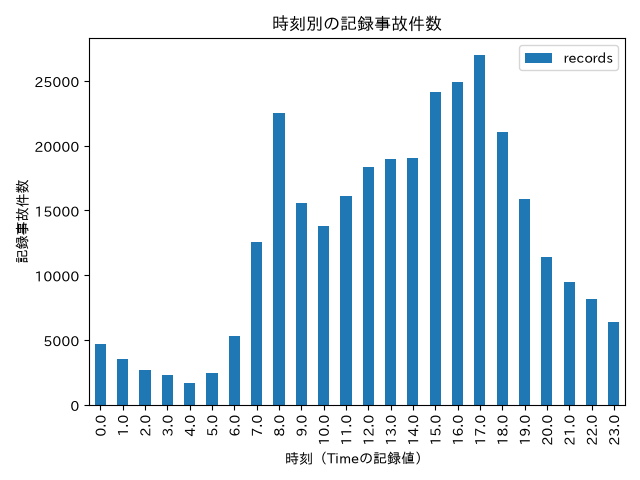

*記録時刻ごとの事故件数。17時台が最多だが、時間帯別交通量のない集計から走行の危険度は推定できない。NotebookのPNG出力を抽出。*

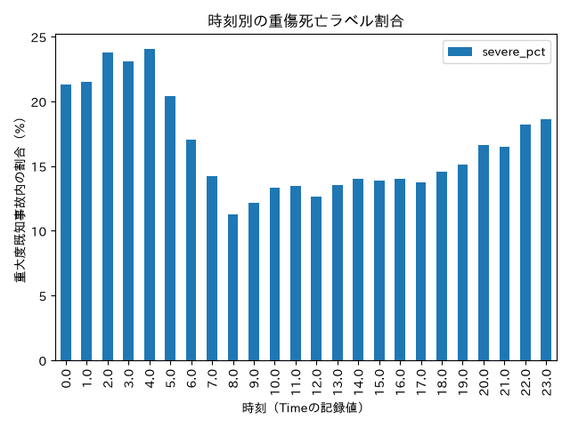

*重大度が既知の記録事故に占めるSerious・Fatalの割合。件数のピークと割合のピークは一致しない。図は点集計で、参考区間はNotebookの集計表に記録。*

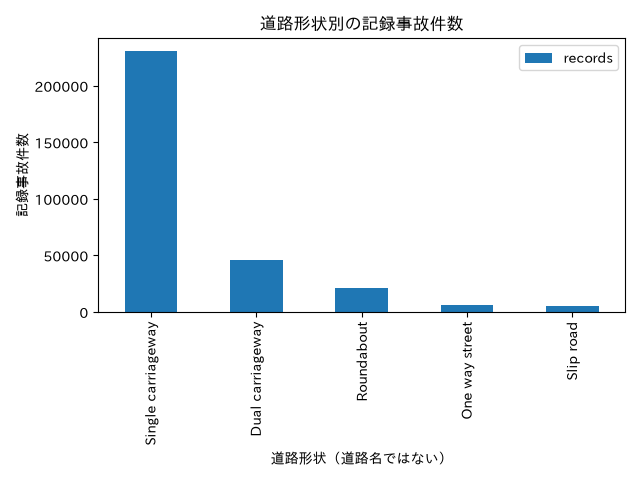

*道路形状別の記録件数。Single carriagewayへの集中を示すが、道路延長や交通量で調整した事故率ではない。*

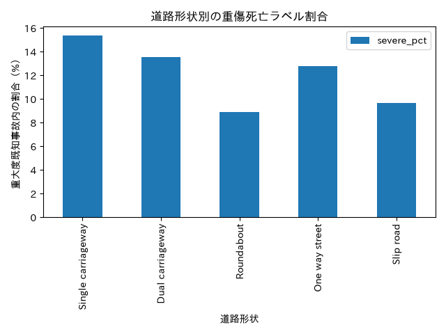

*道路形状ごとの未調整の重傷死亡割合。死亡のみの比較では標準化・仕様変更で方向が変わるため、この図だけで道路の安全性順位を付けない。*

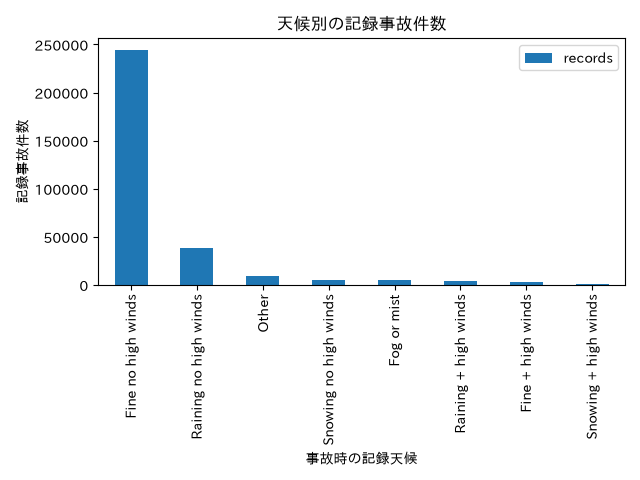

*事故時の記録天候ごとの件数。晴天の記録が多いことは、晴天時の事故率が高いことを意味しない。*

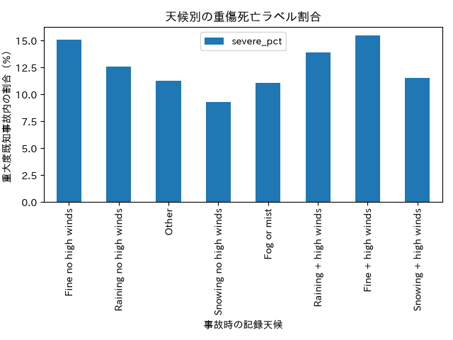

*重大度既知の記録事故内の天候別割合。無強風の降雨は晴天より低いが、事故の記録選択や未測定要因が残り、「雨のほうが安全」という因果結論にはならない。*

**AIが生成した追加依頼1 — 暦の不整合と欠損の影響**

> 日付と曜日の全件不一致について、日月の取り違え・一定日数ずれを検査し、元の年代を推測で補正せず、年代のラベルに依存しない結論と位置情報欠損・時刻欠損による影響を確認してください。

初回の意味的異常検査で暦の整合性が成立しなかったため、AIは年代解釈と加工可能性が外的妥当性に影響すると判断しました。位置欠損がCSV内でゼロという結果も、収集段階の欠損ゼロとは区別する必要がありました。

日-月-年として全件を解析できた一方、曜日一致は0件でした。月-日-年では122,977件しか解析できず、一致は17,240件にとどまりました。日付を1日前へずらすと全307,973件の曜日が一致しますが、これだけで元の事故日や年代を復元したとは言えません。AIは日付を推測補正せず、2021・2022を加工後の「記載年ラベル」としてのみ扱いました。

位置欠損・空文字・検査範囲外は0件で、座標組は280,808種類、同じ座標を共有する行は46,957件でした。同地点の別事故もあり得るため、座標共有を重複事故として削除していません。時刻欠損17件には重傷死亡ラベルが2件あり、割合は11.76%でしたが、Wilson 95%参考区間は3.29〜34.34%と広い値です。この17件をすべて別の時間帯へ割り当てても、件数最多の17時台は変わりません。

証拠は`CALENDAR_CHECKS`、`LOCATION_CHECKS`、`TIME_MISSING`（最終実行番号72）。位置欠損あり群が存在しないため群間比較は適用不可で、加工前の除外・補完、座標の正確性、実年代は未解決のままです。

**AIが生成した追加依頼2 — 天候の構成差と共通サポート**

> 晴天より降雨で重大度割合が低い点が都市・郊外、道路形状、時間帯、速度制限の構成差によるものか、共通サポートの層別標準化で検証してください。死亡のみの場合と記録年ラベルごとの結果も比較し、因果効果とは解釈しないでください。

AIは、降雨の低い割合を「雨のほうが安全」と誤読しないよう、観測された構成差とアウトカム定義への依存を選びました。都市・郊外、道路形状、4時間帯、制限速度、記載年ラベルで層別し、比較する両群に20件以上ある共通層だけを、両群を合わせた記録件数の重みで標準化しました。

晴天・降雨比較は182共通層、266,670件を保持し、各群の保持率は約94.5%でした。重傷死亡割合は標準化後に晴天15.303%、降雨12.296%、降雨−晴天の差は−3.007ポイント。死亡のみでも差は−0.394ポイントでした。記載年ラベル別の重傷死亡差は2021ラベル−2.836ポイント、2022ラベル−3.198ポイントで、方向は同じですが、実年代の比較ではありません。

関連する道路・夜間比較も行いました。`Single carriageway`−`Dual carriageway`の標準化後の重傷死亡差は+2.720ポイントでした。一方、死亡のみは未調整割合のDual 1.786%、Single 1.279%から、標準化後のDual 1.146%、Single 1.272%へ方向が逆転しました。共通層の保持率はDual 56.15%、Single 98.37%と不均衡でした。夜間を22〜翌5時とした比較では、夜間−日中の標準化差は重傷死亡+6.280ポイント、死亡のみ+1.558ポイントです。

証拠は`WEATHER_STANDARDIZED`、`YEAR_LABEL_COMPARISON`、`ROAD_OUTCOME_COMPARISON`、`NIGHT_OUTCOME_COMPARISON`（最終実行番号73）。共通層外には外挿できず、制限速度による層別は実速度の統制ではありません。年齢、飲酒、走行距離、悪天候時の運転回避、事故報告確率などの未測定要因が残りました。

**AIが生成した追加依頼3 — 仕様感度と曝露・記録バイアス**

> 道路の死亡割合は単純集計と標準化で方向が変わり、共通サポートで分離道路の約半分が外れています。共通層の最小件数と制限速度による層別の有無、未定義重大度の扱い、強風を含む天候定義、夜間定義を変えた感度分析を行ってください。さらに曝露量と重症・軽症の記録確率の違いについて、どの程度の仮定で解釈が変わるかを仮想シナリオとして示してください。

道路の死亡比較が標準化に依存し、保持率も偏ったため、AIは全道路への一般化を防ぐ感度分析を追加しました。未定義重大度49件を除外・非重症・重症として扱い、共通層の最小件数を5・20・50件、天候を強風込み／除外、道路を制限速度による層別あり／なし、夜間開始を20時／22時へ変更しました。天候18仕様×2アウトカム、道路18仕様×2、夜間6仕様×2の計84仕様です。

| 比較差の向き | アウトカム | 仕様数 | 差の範囲（ポイント） | `stable` | 最大相対偏差 |
|---|---|---|---|---|---|
| 降雨−晴天 | 重傷死亡 | 18 | −3.007747〜−2.844223 | `True` | 0.045239 |
| 降雨−晴天 | 死亡のみ | 18 | −0.395704〜−0.375209 | `True` | 0.033502 |
| Single−Dual | 重傷死亡 | 18 | +2.467095〜+2.793583 | `True` | 0.115729 |
| Single−Dual | 死亡のみ | 18 | −0.289760〜+0.141826 | `False` | 3.048329 |
| 夜間−日中 | 重傷死亡 | 6 | +5.115980〜+6.279823 | `True` | 0.185331 |
| 夜間−日中 | 死亡のみ | 6 | +1.204835〜+1.558356 | `False` | 0.226855 |

許容偏差は0.20です。天候の差と道路・夜間の重傷死亡差はこのグリッド内では安定しましたが、道路の死亡差は符号まで変わりました。夜間の死亡差は全仕様で正でも、偏差が閾値を超えるため`stable=False`です。安定性は統計的有意性や因果性の保証ではありません。道路比較の最低保持率は53.66%で、共通サポートの偏りも残っています。

曝露量の仮想シナリオでは、降雨／晴天の記録件数比0.154771に対し、走行距離比を仮に0.05、0.15、0.30とすると、捕捉確率が等しいという追加仮定の下で事故率比は3.095429、1.031810、0.515905となりました。同じ件数から「高い」「ほぼ同じ」「低い」が成立し得る例であり、実際の曝露量や事故率の推定ではありません。

記録バイアスについては、観測重症オッズを真の重症オッズ×重症／軽症の相対記録確率と分けました。真の天候間オッズが等しい場合でも、降雨対晴天の相対記録係数が0.809604倍、約19%異なるシナリオで観測差が説明可能です。その記録差を実測したわけではありません。

証拠は`SENSITIVITY`、`EXPOSURE_SCENARIOS_HYPOTHETICAL_NOT_ESTIMATES`、`RECORDING_BIAS_TIPPING_HYPOTHETICAL`（最終実行番号74）、再掲の`FINAL_EVIDENCE_VALUES`・`FINAL_SENSITIVITY`（75）。Notebookには84仕様の詳細を`../data/sensitivity-results.json`へ保存するコードがありますが、本節は指定されたNotebook内のコード・出力を根拠とし、その外部JSONを別途証拠にはしていません。

**追加確認と停止判断**: `initial.log`に3回の追加分析と最終再実行の完了報告があります。別セッションの`followup.log`では既存セルを保持して根拠と前提を再評価し、既存3回で問いに答えており、実年代・曝露量・加工前欠損は同じCSVで解消できないため、新しい分析依頼を作らないと記録しています。追加確認は証拠対応と改善候補の分類の補強で、4回目の追加分析とは数えません。

**最終結論**: この加工済みCSVでは、件数は17時台に集中し、重傷死亡ラベル割合は深夜・早朝に高い傾向がありました。降雨の割合が晴天より低い差は限定した層別標準化・感度分析でも残りました。一方、道路形状別の死亡割合の比較は仕様依存で、全国的な安全性順位は付けられません。**記録件数、記録事故内の重大度割合、交通量当たり事故率を分けることが、この実験の主要な結論です。** 「雨のほうが安全」「特定の道路形状が本質的に危険」といった因果的・実務的判断は支持していません。

分析完了は`status.json`の`analysis_complete=true`、`final_completion.ready=true`と、Notebookの実行出力・監査・ライフサイクルを照合して判断しました。生成前の文書化状態を示すフラグは分析の成否判定に使用していません。

**監査・再現性**: Notebook metadataは全15コードセルの上からの再実行を`verified=true`とし、実行番号`63, 64, 65, 66, 67, 68, 69, 70, 71, 72, 73, 74, 75, 77, 78`を記録しています。番号は連続ではありませんが昇順で、コードセルに未実行・エラー出力はありません。検証日時は`2026-10-01T23:41:02.906732+00:00`です。

末尾の監査セル自身が実行中に取得した監査は15コードセル中14実行済みで、実行中の末尾セルを未実行指摘から除く警告がありました。保存後の`final_notebook_audit`では15/15実行済み、`nbformat_valid=true`、`ok=true`、未実行・エラー・通常指摘・視覚指摘はすべて空です。8解釈を監査し、PNG6点はコードセル9にまとまっています。`visual_audit=True`は文字切れや科学的妥当性を完全に保証しないため、Notebookには目視確認も記録されています。

ライフサイクル出力は`completed`で、実行中セル0、未処理Notebook書込み0、保持ロック0です。定義manifestには出典・単位・不明事項、前提manifestには重大度定義、現地時刻、代表性、実年代、因果識別、仮想捕捉率の未解決警告が残ります。独立二項を仮定したWilson区間は参考値であり、地域内依存や報告バイアスを含む不確実性全体ではありません。

`status.json`による初回プロセスは終了コード0、1,206.1秒、`exited`。追加確認は終了コード0、94.5秒、`artifact_complete_cutoff`です。追加確認ログ末尾にはNotebookが安定し監査を通ったためランナーが停止した記録があります。初回・最終の安定性記録はともに411,569 bytes、同じ更新日時で、`stable=true`でした。これらのプロセス情報だけで分析成功を判断したわけではありません。

**失敗・回避策とJupytermind改善候補**: 最終成果物の分析失敗・データ取得失敗は確認されませんでしたが、途中の障害と機能上の制約を次のように分離します。候補は断定済み不具合ではなく、指定ファイルに残る再現条件に基づく改善検討事項です。

| 分類 | 実際の問題・影響 | 回避策と評価 |
|---|---|---|
| Jupytermind候補: 根拠保存形式の互換性 | 実行40のstreamに`"records": 307973`があり、抽出も成功したのに、`record_insight`が`EvidenceMissingError`で拒否。保存JSONのtextが行リストだったこととの不整合が疑われる | 値を単一の`text/plain`出力にも保存し、元streamから引用。最終実行77で8解釈の受理を確認。数値の改変や無根拠保存はしていない |
| Jupytermind候補: 図表レイアウト | `figure.autolayout=False`で長い天候ラベル・横軸名がPNG外へ切れたとNotebookに記録。数値には影響せず、判読性に影響 | `rc_context({"figure.autolayout":True})`で再描画。保存PNG6点は修正後。画素ベース検査は監査の現仕様外と記録され、`visual_findings`が空であること自体を監査不具合とは断定しない |
| Jupytermind候補: 日本語解釈の監査対象認識 | 日本語見出しと根拠manifestだけでは候補認識されず`insight_cell_count=0`、manifest解析自体は正常だったという診断記録 | 先頭に`洞察：`を付け、最終監査で8件を認識。単なる語句変更で根拠検査の対象が変わる制約として扱う |
| Kaggle SDKの保存名 | 空白入りファイルが`Road%20Accident%20Data.csv`として保存 | 元名へ移し、ハッシュを記録。API取得失敗やJupytermind不具合には分類しない |
| 呼出側・接続環境 | `register_run`必須引数の渡し忘れ、SDKにない`dataset_view`参照、初期構文エラー、Notebook未接続、存在しないディレクトリ、filesystem MCP許可範囲の違い | Notebookに修正・切分けを記録。最終保存セルにエラーは残っていない。Jupytermind固有の分析障害と断定しない |
| MCP／Notebook書込みの統合 | 実行中セルの自己書込み後に旧エラーが残る場面、最終再実行時の出力読出し`'outputs'`エラー | 実際の成功要約と実行番号を明示保存し、保存後監査で確認。`tool_interop_warning`も記録。単体Jupytermind原因とは確定しない |
| 外部ランナー | 追加確認を成果物安定・監査合格で停止 | `followup_termination=artifact_complete_cutoff`と整合。分析失敗やJupytermind候補には含めない |

根拠保存形式の拒否は`initial.log`にも記録されています。レイアウト・監査対象認識・各初期エラーの詳細はNotebookの記述と診断記録に依存し、指定ログには完全なツール呼出し履歴がありません。改善候補3件の分類、再現手順、期待・実際の挙動、影響、証拠、受け入れ条件を`issue-candidate.json`に保存します。受け入れ条件は今後の検証基準で、この実験で達成済みという意味ではありません。

**限界**: 投稿者の抽出・整形前の事故表、原本との一致、重大度の公式定義、測地系、時刻のタイムゾーン・夏時間、制限速度の単位は独立確認されていません。CSV内の位置欠損ゼロから、収集時の欠損ゼロや代表性は保証できません。警察への届出、未報告の軽微事故、主観的な天候記録、補完・除外による選択が残ります。全件の暦矛盾により実年代・曜日の実世界解釈は保留です。曝露量もなく、リスク地図・真の発生率・因果モデルには進んでいません。

カテゴリの番号付けによる相関、稀な死亡・悪天候をz-scoreだけで除く処理、位置欠損あり群との比較、独立原本との突合は適用しませんでした。同じCSVでモデルを複雑化しても主要な限界は解消しないため、3回で反復を終了しています。再現にはNotebookに固定されたパス、同一ハッシュのCSV、認証済みSDKとJupyter MCP環境が必要であり、機械監査の合格を外的妥当性の証明とみなさないことが重要です。

## 実験49: Water Quality（分析完了）

**課題**: 「Kaggleの水質データを使い、飲用可否または水質区分と化学指標の関係を調べてください。欠損、測定単位、基準値、クラス比率を確認し、規制基準による判定とデータ駆動の関連を区別して日本語で報告してください。」

**初回プロンプト（全文・原文）**: 以下は、データセットと問い、およびベンチマークの共通制約からAIが自動生成した初回プロンプトです。人間が実験49向けに全文を個別作成したものではありません。`initial-prompt.md` の全文をそのまま掲載します。

> Kaggleの水質データを使い、飲用可否または水質区分と化学指標の関係を調べてください。欠損、測定単位、基準値、クラス比率を確認し、規制基準による判定とデータ駆動の関連を区別して日本語で報告してください。 Kaggle参照先: https://www.kaggle.com/datasets?search=water+quality+potability。インストール済みkaggle Python SDKを使い、NotebookのJupyter MCP実行セル内で`KaggleApi().authenticate()`、`dataset_list(search=...)`、`dataset_list_files(...)`、必要に応じて`dataset_download_file(...)`を呼び出し、Kaggle上の対応する公開データを検索・取得してください。owner/dataset slug、取得ファイル名、取得日、ファイルSHA-256をNotebookに記録してください。APIトークンをセル出力・Notebook・ログへ表示しないでください。分析・API取得コードの実行はJupyter MCPだけを使い、端末コマンド、subprocess、外部スクリプト起動、作業エージェントへの委譲は行わないでください。Kaggle APIで対応データを取得できない場合は、`/home/nahisaho/kaggle/experiments/white-paper.md`を確認してください。同じデータセットの公開CSVが同稿に明記されている場合だけ、そのURLへフォールバックしてください。対応するCSVを確認できない場合は、別データを推測で選ばず、取得失敗として記録してください。保存先は benchmark/projects/kaggle-v020-kaggle-exp-49-water-quality/notebooks/kaggle-v020-kaggle-exp-49-water-quality.ipynb としてください。run_idは `v020-exp-49` です。長時間処理の開始前にlifecycle.register_runを呼び、実行・書込みフェーズを記録し、終了時にcompletedまたはfailedを記録してください。データ定義manifest、分析前提manifest、意味的な異常検査、妥当な範囲の感度分析を使い、適用できない機能は理由を記録してください。図表はvisual_audit=Trueで監査してください。Notebookには「使用したJupytermindモジュール」節を設け、直接import・呼び出したモジュール名、関数名、使用目的を記録してください。間接利用は使用済みに含めないでください。Jupytermindの不具合または機能不足が疑われた場合は「Jupytermind改善候補」節を設け、分類、再現条件、期待する挙動、実際の挙動、影響、回避策、関係するセルとログを記録してください。Copilot CLI、Kaggle API、ベンチマークランナーに固有の問題とは切り分け、候補がなければ「なし」と記録してください。初回分析後、自分で結果を読み直し、結論に実質的な影響を与える未解決点があれば自然言語の追加依頼文を作成し、Notebookの「反復依頼履歴」に原文のまま記録して実行してください。価値ある追加分析がなくなるまで最大3回繰り返し、各反復の選定理由・結果・証拠・残る限界を報告してください。最後に全コードセルを上から再実行し、notebook_auditとライフサイクル状態を記録してください。

**使用したJupytermindモジュール**: 対象Notebookのコードで直接import・呼び出しを確認できるAPIを整理しました。パッケージ接頭辞はすべて `ai_data_scientist` です。以下のセル番号はNotebook配列の0始まりの位置を指します。

| モジュール名 | 関数・クラス名 | 使用目的 |
|---|---|---|
| `ai_data_scientist.project_manager` | `resolve_project`, `ensure_notebook`, `ensure_data_dir` | 保存先の解決、Notebook・データディレクトリの準備 |
| `ai_data_scientist.language_router` | `detect_language` | 日本語での分析・報告の選択 |
| `ai_data_scientist.lifecycle` | `register_run`, `is_cancel_requested`, `mark_execution_start`, `mark_execution_end`, `mark_write_start`, `mark_write_end`, `get_run_status`, `mark_completed`, `wait_for_quiescence` | 実行登録、キャンセル確認、実行・書込みフェーズ、完了・静止状態の記録 |
| `ai_data_scientist.ingestion` | `SourceSpec`, `ingest` | 取得CSVの読込み、行上限と切詰め有無の確認 |
| `ai_data_scientist.cleaning` | `clean_dataset` | 重複の確認・除去と完全ケースの作成、処理前後の件数確認 |
| `ai_data_scientist.eda` | `explore` | 型、要約統計、欠損の構造化集計 |
| `ai_data_scientist.stats_analysis` | `correlation` | 列別観測値によるPearson相関と日本語の解釈 |
| `ai_data_scientist.data_definition` | `FieldValue`, `build_manifest`, `DataDefinitionManifest.unresolved_fields` | 来歴・列定義を確認済み・推定・未確認に分け、未解決項目を列挙 |
| `ai_data_scientist.analysis_assumptions` | `Assumption`, `AnalysisAssumptionManifest`, `check_manifest` | 単位、ラベル、独立性、欠損機構、外部妥当性の前提と警告を記録 |
| `ai_data_scientist.data_quality` | `detect_anomalies` | 非負、pH範囲、許容ラベル、欠損の意味的検査 |
| `ai_data_scientist.sensitivity` | `SensitivityPlan`, `run_sensitivity` | THM単位2解釈、RF12仕様、分割設計2種類の限定感度分析 |
| `ai_data_scientist.visualization` | `render_chart`, `build_image_output` | 日本語図表のPNG生成と画像MIME出力 |
| `ai_data_scientist.insight_engine` | `extract_cited_value` | 保存済み実行出力からRF AUCを抽出し、根拠値を確認 |
| `ai_data_scientist.notebook_audit` | `audit_notebook(visual_audit=True)` | 実行状態、エラー、根拠リンク、図表の読取り監査 |

Notebookの使用記録には、`project_manager.enqueue_write` と `insight_engine.record_insight` を別Notebookから対象がidleの間に呼んだ旨もあります。ただし対象Notebook内では前者は未呼出しの補助関数内に記述され、後者の呼出しコードは残っていないため、上表の直接利用には含めません。`lifecycle.mark_failed` は失敗・キャンセル分岐にありますが、最終保存セルでその分岐が発火した証拠はありません。間接利用のモジュールも使用済みに数えません。独立参照データがないため異常値の独立検証・データセット照合は未実施、採水ID・時刻・地点がないため時空間検証・因果推論は適用できないと記録しています。

**初回指示**: 飲用ラベルと化学指標の関連を、欠損、単位、基準値、クラス比率から点検するよう求めています。分析手法と追加依頼の具体的内容は事前指定せず、AIが結果に応じて選択しました。取得・分析はJupyter MCPに限定し、API認証情報を表示せず、来歴、manifest、感度分析、可視化監査、最大3回の反復、全セル再実行を記録する制約を付けています。

**データ取得**: Notebookセル3の出力には、Kaggle SDKで `water potability` を検索し、`adityakadiwal/water-potability` のファイル一覧を確認して `water_potability.csv` を取得した記録があります。取得経路はKaggle APIで、取得失敗や公開CSVへのフォールバックは記録されていません。

| 項目 | Notebookに保存された値 |
|---|---|
| データセット | `adityakadiwal/water-potability` |
| ファイル | `water_potability.csv` |
| 取得日時 | `2026-10-01T23:48:46.259959+00:00`（UTC、2026年10月2日08:48:46 JST） |
| SHA-256 | `904004bde729bfe3d2e195f46343bceead09e32a0eb95bb8184e7e20e029b2bf` |
| データ形状 | 3,276行・10列、読込み時の切詰めなし |
| ラベル | `Potability=0`: 1,998件（60.99%）、`Potability=1`: 1,278件（39.01%） |
| 重複・完全ケース | 重複0件、全9指標が揃う行は2,011件、完全ケース化で1,265件除外 |

掲載説明では1が飲用可、0が飲用不可ですが、採水地点・日時、標本抽出、測定法、ラベル生成規則、実測か合成かは確認できていません。化学指標はpH、硬度、溶解固形物（TDS）、クロラミン、硫酸塩、電気伝導率、有機炭素、トリハロメタン（THM）、濁度です。欠損はpH491件（14.99%）、硫酸塩781件（23.84%）、THM162件（4.95%）で、残る列に欠損はありません。意味的検査はこの3列の欠損を報告し、無限値は0件でした。pHの0・14は確認対象ですが、定義した0〜14の範囲内という理由だけで測定の真正性を保証せず、機械的にも除外していません。

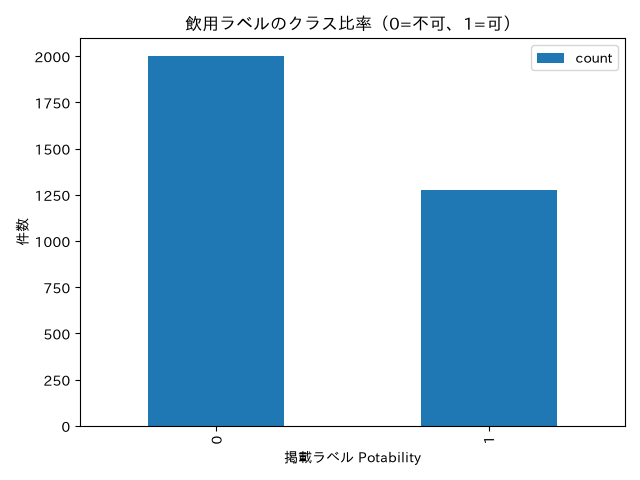

*掲載ラベル0・1の件数。飲用可39.01%というクラス不均衡があり、ラベルそのものの安全性は別途検証が必要です。NotebookのPNG出力から抽出しました。*

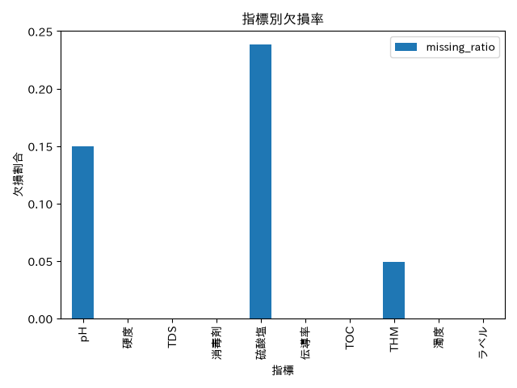

*pH・硫酸塩・THMに欠損が集中しています。欠損を基準適合や飲用可と扱わず、完全ケースと補完の両方を感度分析に用いました。*

**初回結果 — 単位・規制基準と掲載ラベルの切分け**: Kaggle説明にはTHMの安全閾値として「80 ppm」とありますが、Notebookに保存されたEPA一次規則の抜粋は総THMを0.080 mg/L、すなわち80 µg/Lとしています。希薄水溶液でppmをmg/L相当とする場合、両者には1,000倍の相違があります。説明の引用が確認できたことと、CSVの実測単位が確定したことを区別しました。

硬度の単位は未確認です。TDS・硫酸塩・有機炭素をmg/L、伝導率をµS/cm、濁度をNTUとする解釈は推定で、クロラミンのmg/L as Cl₂換算、総THMの測定定義との同一性も未確認です。THMをµg/Lとする主解析も仮定にすぎません。

NotebookではEPAの[一次規則](https://www.epa.gov/ground-water-and-drinking-water/national-primary-drinking-water-regulations)と[二次基準](https://www.epa.gov/sdwa/secondary-drinking-water-standards-guidance-nuisance-chemicals)を参照しています。以下はセル9の**条件付き数値比較**であり、法的な合否ではありません。率の分母は各指標の観測値です。

| 指標 | 比較した数値条件 | 超過・範囲外／観測数 | 観測内の超過・範囲外率 | 飲用可ラベル内の同率 |
|---|---|---|---|---|
| pH | 6.5〜8.5、二次基準 | 1,457／2,785 | 52.32% | 47.05% |
| TDS | 500 mg/L以下、二次基準 | 3,275／3,276 | 99.97% | 100.00% |
| 硫酸塩 | 250 mg/L以下、二次基準 | 2,437／2,495 | 97.68% | 95.94% |
| クロラミン | 4.0 mg/L as Cl₂以下、一次MRDL | 3,187／3,276 | 97.28% | 97.18% |
| THM | 80 µg/L以下と仮定、一次MCLとの数値比較 | 602／3,114 | 19.33% | 19.46% |

二次基準は嗜好・外観等の基準で、健康上の飲用可否と同一ではありません。一次指標も測定定義や採水・平均化等の適用条件があるため、単一のCSV行から法的遵守を判定していません。濁度は処理技術基準として扱い、一律の単一行判定を避けました。日本法・WHO基準は混用せず、掲載説明の有機炭素2／4 mg/L等も万能の健康閾値として採用していません。規制ページ内の年平均を探した文字列検索は該当なしであり、具体的な平均期間の裏付けがこの抜粋だけで十分に確認されたとは扱いません。

**初回結果 — データ駆動の関連**: セル11で列別の観測値に基づく群平均差、Cohen's d、Pearson相関、9検定のBenjamini–Hochberg補正を計算しました。最大の絶対相関はTDSの0.0337、最小の補正q値は0.3870で、有意な線形関連は検出されませんでした。一方、pHの四分位別飲用可率は36.01%、43.10%、43.82%、35.20%、硫酸塩は46.15%、34.13%、32.58%、45.03%と非単調でした。線形相関の弱さだけで関連全体の不存在を結論づけていません。

層化5分割・shuffleあり・乱数49のout-of-fold（OOF）予測では、補完器・標準化を各訓練fold内で学習しました。RFは180本、最小葉サイズ5です。

| モデル | OOF ROC AUC | Average Precision | Accuracy | Balanced Accuracy |
|---|---|---|---|---|
| クラス事前比率の基準モデル | 0.4992 | 0.3897 | 0.6099 | 0.5000 |
| 線形ロジスティック回帰 | 0.5042 | 0.4208 | 0.6105 | 0.5009 |
| ランダムフォレスト（RF） | 0.6803 | 0.5993 | 0.6703 | 0.6044 |

RFの混同行列は真の0／1を行、予測0／1を列として `[[1807, 191], [889, 389]]` でした。Accuracyだけではクラス不均衡の影響を受けます。これは掲載ラベルとの関連の検証であり、飲用安全判定器の完成を意味しません。AIは単位、欠損処理、性能の安定性を未解決点として追加依頼を生成しました。

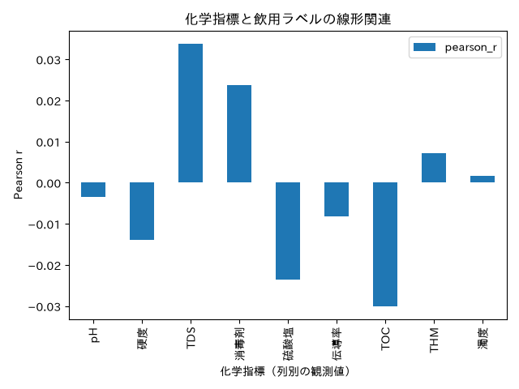

*列別観測値による線形関連。すべての相関は小さく、9検定のBH補正後に有意な指標はありませんでした。*

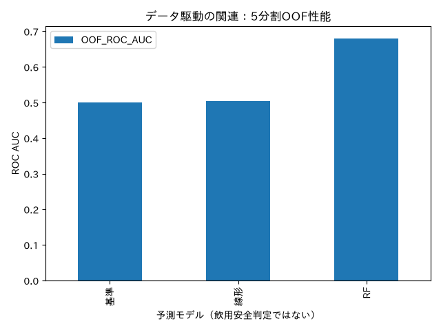

*基準・線形・RFの5分割OOF比較。RFの約0.68はCSV内の関連を示す補助結果で、外部安全性を保証しません。*

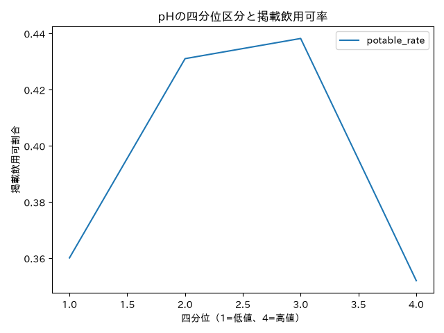

*pHは中央の四分位で掲載飲用可率が高く、単調な線形関係では捉えにくい形です。図は点推定で、Wilson区間はNotebookの表に記録されています。*

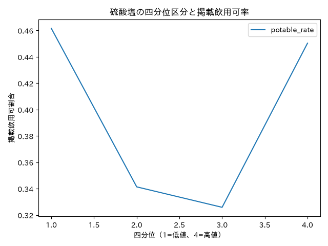

*硫酸塩は低値・高値側で掲載飲用可率が高い非単調な分布でした。濃度を増減すれば安全になるという因果的な解釈はできません。*

**AIが生成した追加依頼1 — 単位と規制適用の感度**

> 掲載説明のトリハロメタン80 ppmとEPAの80 µg/Lの食い違いが基準比較をどの程度変えるか、両方の単位解釈で比較してください。TDSと電気伝導率の整合性、pHの極端値、規制の適用条件も点検し、どの数値比較が確定できないか明示してください。

**選定理由**: THMの単位差が規制比較の結論を直接変え、TDSの規模も説明との整合性を点検する必要があるとAIが判断しました。

**結果・証拠**: セル16（実行カウント8）でTHMの観測3,114件を比較すると、µg/L仮定の80 µg/L超過は19.33%、ppm≈mg/L仮定の0.080 mg/L超過は100%でした。`sensitivity` は `stable=False`、基準仕様からの最大相対差417.28%を返しました。飲用可ラベルのTHM観測1,223件でも19.46%対100%です。

TDSをmg/Lとすると500 mg/L超過率は99.97%、仮想的にµg/Lとすると0%ですが、後者を正しい補正とはしていません。TDSと伝導率のSpearman相関は0.0211でした。掲載説明のpH6.52〜6.83はCSVの0〜14と一致せず、pH14・0の行も出力されています。単位を推測で1,000倍補正して元データを書き換えることは避けました。残る限界は実測単位、採水法、測定定義、平均期間等の不明さであり、規制違反も飲用安全も断定できません。

**AIが生成した追加依頼2 — 欠損と非線形関連の安定性**

> 線形相関が弱い一方で非線形予測に性能が見られる点を、完全ケース・中央値補完・欠損指示変数、分割seed、木の葉サイズを変えて検証してください。欠損のみの予測、二次の関連モデル、OOF性能の区間も比較し、欠損やモデル仕様に依存する結論を区別してください。

**選定理由**: 線形相関とRF AUC約0.68の差が問いへの回答に重要なため、補完による人工的な関連と非線形性を分離し、検証範囲を12仕様に限定しました。

**結果・証拠**: セル19（実行カウント9）で、中央値補完・欠損指示変数付き補完・完全ケースの3種類、乱数49／149、最小葉サイズ5／15を組み合わせ、120本のRFを層化5分割で評価しました。AUCは0.6593〜0.7026でした。判定指標はAUCそのものではなく `AUC−0.5` で、基準仕様からの最大相対差13.32%が許容20%内に収まり `stable=True` でした。

欠損パターンのみのロジスティック回帰はAUC0.5056、二次項・交互作用付きモデルは0.6762でした。非線形関連が中央値補完だけの人工物であるという証拠は乏しい結果です。初回RFの固定OOFスコアに条件付けた層化bootstrap1,000回・乱数49の95%区間は0.6612〜0.6986でした。ただしfold間の学習依存、モデル再学習、外部母集団への変動を含みません。

欠損とラベルの関連検定はpH p=0.1588、硫酸塩p=0.3475、THM p=0.2035でしたが、これによって欠損機構を無作為と確認したわけではありません。完全ケースは対象母集団が変わり、12仕様での安定性は独立性や外部妥当性を保証しません。AIは寄与指標、偶然性能、行順への依存を次の確認点に選びました。

**AIが生成した追加依頼3 — 寄与指標、負の対照、行順依存**

> 非線形の関連を支える化学指標を、未学習の検証行に対する置換重要度で調べてください。ラベルシャッフルの偶然性能と連続行ブロックを分離した検証も行い、CSV内の関連を外部の飲用安全性へ一般化できるか、行順だけでラベルが予測されないか確認してください。

**選定理由**: 複数仕様で非線形性能が維持されても、何が性能を支えるか、配列・バッチに依存していないか、偶然との差をどう読むかで結論が変わるためです。

**結果・証拠**: セル22（実行カウント10）では学習2,457件・検証819件の層化分割（乱数49）でRFを評価し、検証AUCは0.6689でした。検証行で10回置換したときの平均AUC低下は硫酸塩0.0893、pH0.0758、硬度0.0461、クロラミン0.0384が上位です。これは掲載ラベルの予測寄与であって健康リスク順位や因果効果ではありません。

さらにCSVの行を連続10ブロックに分け、`GroupKFold` の5分割でブロックを分離しました。木数180・葉サイズ5・乱数49を揃えたRFでもAUCは**0.5788**に低下し、無作為分割0.6803との差は−0.1015でした。`AUC−0.5` の相対変動は56.30%、分割感度は `stable=False` です。この検証は行配列への依存診断で、採水地域・時系列を確認した外部検証ではありません。

行位置だけを入力した決定木の無作為5分割AUCは**0.8630**、ラベルの連続区間は16個でした。行順・バッチ構造の影響が強い一方、その順序の意味は不明です。行位置は化学モデルには投入していません。別の3分割・80本RFによるラベルシャッフル19回はAUC0.4821〜0.5301、平均0.5051、観測AUC0.6656、置換p=0.05でした。最小p値の分解能が0.05で、交換可能性も未確認の粗い負の対照です。高精度の有意性や、行順問題を解消した証拠にはしません。

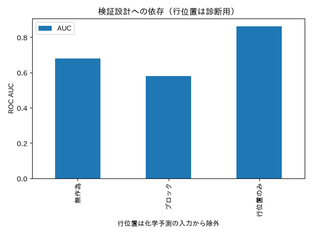

*化学モデルのAUCは無作為分割0.6803からブロック分割0.5788へ低下しました。行位置だけの0.8630は配列構造の診断であり、飲用安全予測を改善する入力として採用したものではありません。*

**追加確認ログの結果と反復停止理由**: `followup.log` は、既存3反復が単位、欠損・モデル仕様、行順依存を検証しているため第4の依頼は作らないと記録しています。残る単位・採水情報・ラベル生成の不明点は同じCSVの再解析では解消できず、独立外部データと原測定の辞書が必要です。ログには根拠の対応付けと改善候補の受け入れ条件を補強する意図もありますが、補強が完了したという最終応答はありません。`status.json` の終了理由は `artifact_complete_cutoff` で、ランナーはNotebookの安定と監査通過を理由に停止しています。追加確認で新しい分析結果やNotebook更新が生じたとは扱いません。

**最終結論**: このCSVではpH・硫酸塩などと掲載飲用ラベルの非単調・多変量関連が見られます。しかし線形関連は小さく、無作為分割のAUC約0.68は連続行ブロックを分離すると約0.58に低下します。行位置だけでもラベルを強く予測できるため、無作為分割を安定した外部一般化性能と読めません。THMの単位解釈で基準超過率も大きく変わります。**掲載ラベルの再現、規制数値への条件付き比較、法的遵守、実際の飲用安全性は別物であり、本結果を実飲用判断や因果推論へ転用できません。** この切分けと3回の反復分析は完了しています。

**監査・再現性**: 完了判断は `status.json` の `analysis_complete=true`、`final_completion.ready=true` と、実行済みNotebookの内容に基づきます。Notebookにはカーネル再起動後の上からの再実行、根拠カウントの更新、CSVハッシュ確認が記録されています。12コードセルの保存済み実行カウントは `[1, 2, 3, 4, 5, 6, 7, 8, 9, 10, 11, 13]` です。末尾が13であることを未実行セルの存在とは解釈しません。

セル30の自己監査時点では末尾セル自身が実行中のため、実行済み11セルと除外警告を報告しています。その後のNotebook metadata `final_notebook_audit` は全出力保存後、`2026-10-01T23:53:09.228395+00:00` に12／12セル実行済み、nbformat妥当、未実行・エラーなし、PNG7点、根拠付き所見5件、`findings=[]`、`visual_findings=[]`、`visual_audit=true`、`ok=true` を記録しました。`status.json` の最終監査も同じ構造的結果です。PNG7点はセル13の6点とセル25の1点から抽出し、英語名の `exp-49-*.png` として保存しました。

ライフサイクルの最終出力・metadataは `v020-exp-49` が `completed`、実行中セル・未完了書込み・保持ロックがすべて0です。記録された環境はpandas3.0.6、NumPy2.5.3、SciPy1.18.1、scikit-learn1.9.1、Kaggle SDK2.2.4、Matplotlib3.11.2、nbformat5.11.1、japanize-matplotlib1.1.3です。乱数、分割、補完・学習パイプラインはNotebookコードに残っています。今回の節作成では取得・学習を再実行せず、指定された保存出力を証拠にしています。

ただし、構造監査の合格は科学的妥当性を保証しません。分析前提の確認では単位の比較可能性、ラベルの妥当性、行の独立性、欠損機構に未解決警告が残り、外部妥当性は `rejected` です。またmetadataの `lifecycle_events` には開始より終了のUTC時刻が早い項目と、末尾開始イベントに対応する終了イベントがない記録があります。最終静止状態とは区別し、イベント列から正確な処理時間や完全な時系列を復元できるとは主張しません。この不整合の帰属は指定証拠だけでは確定できません。

**失敗・回避策とJupytermind改善候補**: 最終Notebookには未解決のエラーセルはありません。一方、「Jupytermind改善候補」節には開発時の次の問題が記録されています。ここではNotebookに残る報告と回避済みコードを証拠にし、同節が参照する `development-log.json` や `font-context-diagnostic.json` は指定証拠外のため確認していません。したがって修正前の画像、例外全文、再現診断を独立に確認した確定不具合とは扱いません。

| 分類・帰属 | Notebookに記録された失敗・不足 | 最終Notebookの回避策・確認範囲 |
|---|---|---|
| Jupytermind描画レイアウトの不具合の疑い | 長い縦tickと日本語xlabelが画像下端で切れ、短縮名だけではxlabelの一部が切れた | `figure.autolayout=True` と表示名短縮を採用。最終PNGを目視した記録あり |
| Jupytermind可視化監査の機能不足の疑い | 上記のラベル切れでも `visual_audit=True` の `visual_findings` が空だったと記録 | 自動監査だけで可読性を保証せず目視を併用。修正前画像・監査結果の組は指定証拠内に残っていない |
| Jupytermind日本語フォント状態の不具合の疑い | 新規カーネルの `rc_context` 内では初回だけ日本語が読め、次回以降にGlyph欠落。内部適用済みflag残存という原因仮説を記録 | 各描画の `rc_context` で `font.family=['IPAexGothic']` を明示。最終図表出力のGlyph警告は空。内部原因は未検証 |
| Jupytermind／Jupyter MCPの保存境界・帰属未確定 | 実行中の同Notebookへ `enqueue_write` した際、処理後のMCP結果が空、保存セルが `execution_count=None`・`outputs=[]` になったと記録 | 自己書込みを避け、別Notebookから対象idle時に書込み。最終セルの実行・出力は保存済み。Jupyter MCPの同期との切分けが必要 |

これら4件を疑い・機能不足・統合候補として `issue-candidate.json` に記録し、分類、再現手順、期待・実際の挙動、影響、指定証拠、受け入れ条件を分けました。ソフトウェア修正やGitHub Issue登録は行っていません。Notebookに記録された自作描画ループの `y` 上書きによる `InvalidParameterError` は修正済みの分析コード側の失敗で、Jupytermind候補から除外しました。対象ディレクトリの初期作成は環境準備です。Kaggle APIの取得失敗は記録されていません。追加確認のランナー停止やCopilot CLIの表示をJupytermind本体の不具合には分類していません。

**限界と実験から得られた示唆**: 原測定単位、採水条件、ラベル生成、実測／合成の別、独立性、欠損機構、未測定の微生物・重金属・農薬等は未確認です。固定OOF区間と19回シャッフルは限定的・探索的な証拠で、外部検証ではありません。最終監査の合格や12仕様の安定性だけで飲用安全性を主張せず、単位問題と分割依存を追加依頼で見つけて適用範囲を狭めた点が本実験の成果です。安全性を判断するには、原測定の辞書、監査可能なラベル根拠、採水設計、独立した外部データを人間が確認する必要があります。

## 実験50: Loan Default（分析完了・信用判断への利用は未検証）

**課題**: 「Kaggleのローン返済・デフォルトデータを使い、デフォルトと関連する申込者・契約特徴を調べてください。クラス不均衡、欠損、時点の混入、保護属性または代理変数による公平性リスクを確認し、予測上の関連と信用判断の妥当性を区別して日本語で示してください。」

**初回プロンプト（全文・原文）**: 以下は、データセットと問い、および共通制約から**AIが自動生成した初回プロンプト**です。人間がこの実験の全文を個別に作成したものではありません。`initial-prompt.md`の原文を掲載します。

> Kaggleのローン返済・デフォルトデータを使い、デフォルトと関連する申込者・契約特徴を調べてください。クラス不均衡、欠損、時点の混入、保護属性または代理変数による公平性リスクを確認し、予測上の関連と信用判断の妥当性を区別して日本語で示してください。 Kaggle参照先: https://www.kaggle.com/datasets?search=loan+default+risk。インストール済みkaggle Python SDKを使い、NotebookのJupyter MCP実行セル内で`KaggleApi().authenticate()`、`dataset_list(search=...)`、`dataset_list_files(...)`、必要に応じて`dataset_download_file(...)`を呼び出し、Kaggle上の対応する公開データを検索・取得してください。owner/dataset slug、取得ファイル名、取得日、ファイルSHA-256をNotebookに記録してください。APIトークンをセル出力・Notebook・ログへ表示しないでください。分析・API取得コードの実行はJupyter MCPだけを使い、端末コマンド、subprocess、外部スクリプト起動、作業エージェントへの委譲は行わないでください。Kaggle APIで対応データを取得できない場合は、`/home/nahisaho/kaggle/experiments/white-paper.md`を確認してください。同じデータセットの公開CSVが同稿に明記されている場合だけ、そのURLへフォールバックしてください。対応するCSVを確認できない場合は、別データを推測で選ばず、取得失敗として記録してください。保存先は benchmark/projects/kaggle-v020-kaggle-exp-50-loan-default/notebooks/kaggle-v020-kaggle-exp-50-loan-default.ipynb としてください。run_idは `v020-exp-50` です。長時間処理の開始前にlifecycle.register_runを呼び、実行・書込みフェーズを記録し、終了時にcompletedまたはfailedを記録してください。データ定義manifest、分析前提manifest、意味的な異常検査、妥当な範囲の感度分析を使い、適用できない機能は理由を記録してください。図表はvisual_audit=Trueで監査してください。Notebookには「使用したJupytermindモジュール」節を設け、直接import・呼び出したモジュール名、関数名、使用目的を記録してください。間接利用は使用済みに含めないでください。Jupytermindの不具合または機能不足が疑われた場合は「Jupytermind改善候補」節を設け、分類、再現条件、期待する挙動、実際の挙動、影響、回避策、関係するセルとログを記録してください。Copilot CLI、Kaggle API、ベンチマークランナーに固有の問題とは切り分け、候補がなければ「なし」と記録してください。初回分析後、自分で結果を読み直し、結論に実質的な影響を与える未解決点があれば自然言語の追加依頼文を作成し、Notebookの「反復依頼履歴」に原文のまま記録して実行してください。価値ある追加分析がなくなるまで最大3回繰り返し、各反復の選定理由・結果・証拠・残る限界を報告してください。最後に全コードセルを上から再実行し、notebook_auditとライフサイクル状態を記録してください。

**使用したJupytermindモジュール**: 次表は保存済みNotebookのコードセルで直接import・呼び出したモジュール、関数・型、使用目的です。モジュール使用節に記載があっても、別の記録用Notebookでの呼出だけが説明されている関数は、この表へ使用済みとして加えていません。

| モジュール | Notebookで直接呼び出した関数・型 | 使用目的 |
|---|---|---|
| `ai_data_scientist.project_manager` | `resolve_project`, `ensure_notebook`, `ensure_data_dir` | 指定プロジェクト、Notebook、データ保存領域の解決・作成 |
| `ai_data_scientist.language_router` | `detect_language` | 日本語の選択 |
| `ai_data_scientist.lifecycle` | `register_run`, `mark_execution_start`, `mark_execution_end`, `is_cancel_requested`, `get_run_status`, `mark_completed`, `mark_failed` | 実行フェーズ、取消要求、失敗経路、最終完了状態の管理 |
| `ai_data_scientist.ingestion` | `SourceSpec`, `ingest` | Kaggle SDK取得後のローカルCSV読込。行上限を300,000件に設定 |
| `ai_data_scientist.cleaning` | `clean_dataset` | 完全重複の検査・除去。除去は0件 |
| `ai_data_scientist.eda` | `explore` | 欠損・カテゴリ頻度などの概要把握 |
| `ai_data_scientist.stats_analysis` | `correlation` | 欠損ペアを除外したPearson相関と、NaN入力時の誤解釈の最小再現 |
| `ai_data_scientist.data_definition` | `FieldValue`, `build_manifest`, `DataDefinitionManifest.unresolved_fields` | 出典、変数定義、単位、利用可能時点の確認済み・推定・不明を区別 |
| `ai_data_scientist.analysis_assumptions` | `Assumption`, `AnalysisAssumptionManifest`, `check_manifest` | ラベル定義、審査前利用、独立性、将来への一般化などの前提を明示 |
| `ai_data_scientist.data_quality` | `detect_anomalies` | ID、カテゴリ、符号、値域の意味的制約検査 |
| `ai_data_scientist.sensitivity` | `SensitivityPlan`, `run_sensitivity` | 10予測仕様と8所得仕様を20%許容基準で比較 |
| `ai_data_scientist.visualization` | `render_chart`, `build_image_output` | クラス件数図の描画、PNGの画像MIME出力、レイアウト・メタデータの再現確認 |
| `ai_data_scientist.insight_engine` | `extract_cited_value`, `record_insight` | 実行済み標準出力の引用値抽出と、証拠記録が拒否される条件の再現 |
| `ai_data_scientist.notebook_audit` | `audit_notebook`, `audit_visual_outputs` | 実行状態、証拠リンク、図表の監査と、図表メタデータ欠落時の監査範囲確認 |

最終Notebookには証拠manifest付き結論が5件あります。ただし、その成功した保存については、対象Notebookが静止している間に別の記録用Jupyter MCPセルから行う手順が記録されています。対象Notebook内の`record_insight`呼出は改善候補の再現用であり、成功した結論保存と混同しません。`enqueue_write`や書込みフェーズ関数も、この対象Notebook内の直接呼出としては数えません。モデル学習・公平性集計はScikit-learn、Pandas、NumPy等、検定はSciPy、長いラベルの図はMatplotlibで実装されています。

**初回指示**: データセット検索URLと問いを与え、欠損・クラス不均衡・時点混入・公平性を確認するよう求めました。検索候補の選定、比較方法、診断モデル、追加分析の内容はAIが決めています。API取得と分析はJupyter MCP内で行い、取得元とハッシュ、データ定義・分析前提、根拠付き結論、最大3回の反復、全セル再実行と監査を残す制約です。公開CSVへの代替取得は指定文献に同一データのURLがある場合だけ許可されていましたが、本実験では使っていません。

**データ取得**: NotebookのKaggle SDK検索セルは`dataset_list(search='loan default risk')`を実行し、公開検索結果の`yasserh/loan-default-dataset`を選びました。ファイル一覧と`dataset_metadata`で内容を確認し、`Loan_Default.csv`を取得しています。公開メタデータは分類課題として説明していますが、`Status`の厳密なイベント定義、延滞期間、返済追跡期間、特徴の記録時点までは確認できません。したがって、以下の率は**`Status=1`の観測割合**であり、定義が検証された実際のデフォルト率とは区別します。

| 項目 | Notebookに記録された内容 |
|---|---|
| owner/dataset slug | `yasserh/loan-default-dataset` |
| 取得ファイル | `Loan_Default.csv`（API一覧のサイズ28,480,484 bytes） |
| 取得日時 | `2026-10-01T23:42:14.332071+00:00`（UTC） |
| SHA-256 | `4234b122f463ff4d563de600ade5ec347a9ab8f02cfc204535f7c0d4929bfe70` |
| データ形状 | 148,670行・34列 |
| 年 | 全148,670行が`year=2019` |
| ラベル | `Status=0`: 112,031件、`Status=1`: 36,639件 |
| 公開メタデータのライセンス | `CC0-1.0` |

再実行用コードは既存CSVがある場合に来歴ファイルとSHA-256を照合して再利用します。毎回Kaggleから再取得して同じファイルを確認した、とは記録していません。APIトークンを明示出力するコードはなく、認証等の標準出力・標準エラーを抑制し、例外本文も資格情報保護のため表示しない実装です。

**初回結果**: AIは変数定義・単位・利用可能時点をmanifestに分け、重複、欠損、値域と比率整合性、カテゴリ別・数値分位別のラベル割合を調べました。カテゴリではχ²検定、Cramér's V、Benjamini–Hochberg補正を用い、割合にはWilson区間を付けています。完全重複、ID重複、ID除外後の完全一致行はいずれも0件でした。`Status=1`は24.64%で、全件を0と予測するだけでも正解率75.36%となるため、正解率単独では少数クラスの検出力を評価できません。

金利スプレッドの欠損は36,639件で`Status=1`件数と一致し、欠損指示変数とラベルの一致率は1.0でした。金利欠損36,439件、初期費用欠損39,642件、所得欠損9,150件、LTV欠損15,098件、`dtir1`欠損24,121件も確認しています。欠損を無作為とみなさず、結果情報や業務処理の混入を優先検討する方針へ進みました。

意味的異常検査ではLTVの設定範囲0〜200を超える17件を検出しました。一方、評価額が正でLTVが観測された行では`LTV=100×loan_amount/property_value`と許容誤差`1e-4`以内で全件一致し、最大絶対誤差は約`4.95e-8`でした。LTVの高値は範囲検査上の候補であり、ただちに入力誤りと断定していません。所得0は1,260件、LTV>100は1,799件でした。

主な関連は、所得の最下位分位群で`Status=1`が37.25%、最上位分位群で20.29%、`neg_amm`群で44.60%、`not_neg`群で22.38%、`lpsm`群で77.66%、`not_lpsm`群で23.41%でした。所得分位は`qcut`による5分位であり、同値があるため各群が厳密に20%ずつとは限りません。`neg_amm`は負の償却、`lpsm`は一括払い条項と推定したコードですが、定義・利用時点は未確認です。`credit_type=EQUI`は15,298件中15,297件が`Status=1`（99.993%）で、Cramér's Vは0.5922でした。これは機関・収録経路・処理の違いによる選択を疑う材料であり、信用情報区分そのものの因果効果ではありません。

信用スコアとラベルのPearson相関は`r=0.0040, p=0.1227`で、ごく小さい関連でした。所得は`r=-0.0651`、LTVは`r=0.0389`、`dtir1`は`r=0.0781`です。大標本で小さな関連でも小さいp値が得られるため、統計的有意性を審査上の重要性とは同一視しません。信用スコアの尺度・モデルが不明なので、この結果から一般に信用スコアが無用だとは言えません。

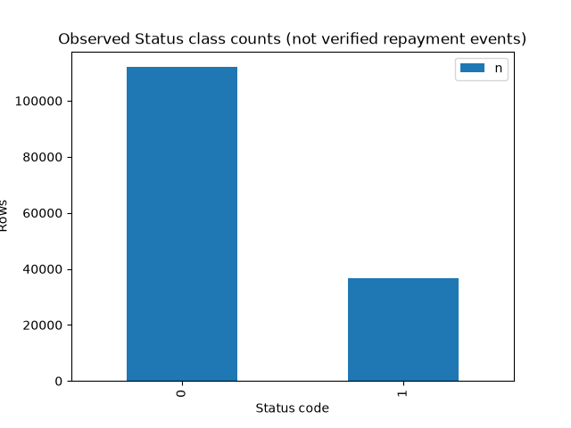

*NotebookのPNG出力から抽出したラベル件数。少数側は36,639件であり、多数派のみの予測でも高い正解率になる。Statusは返済イベントの定義が未検証のコードとして示している。*

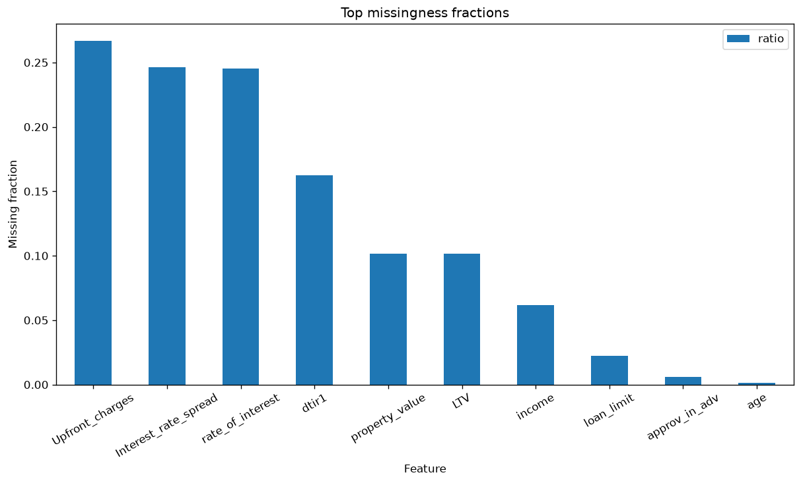

*初期費用、金利スプレッド、金利などの欠損割合。金利スプレッドの欠損はラベルと完全一致するため、通常の欠損補完だけで済ませず、データ生成過程の確認が必要になる。*

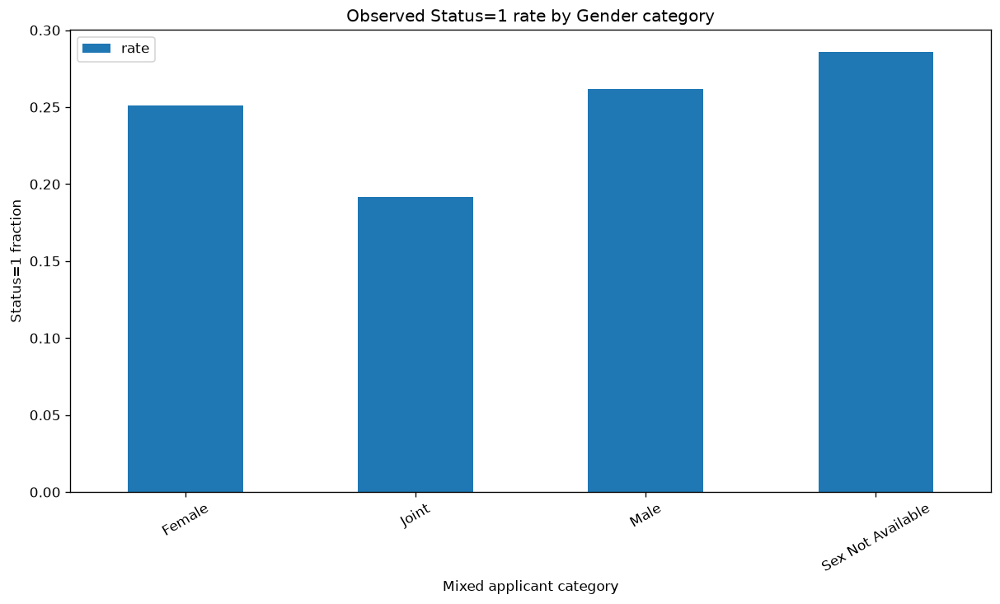

*Female、Male、Joint、Sex Not Availableの観測ラベル割合。Jointは共同申込、Sex Not Availableは未記載区分であり、四つを単純な性別カテゴリとして解釈しない。この図はモデルの公平性評価そのものではない。*

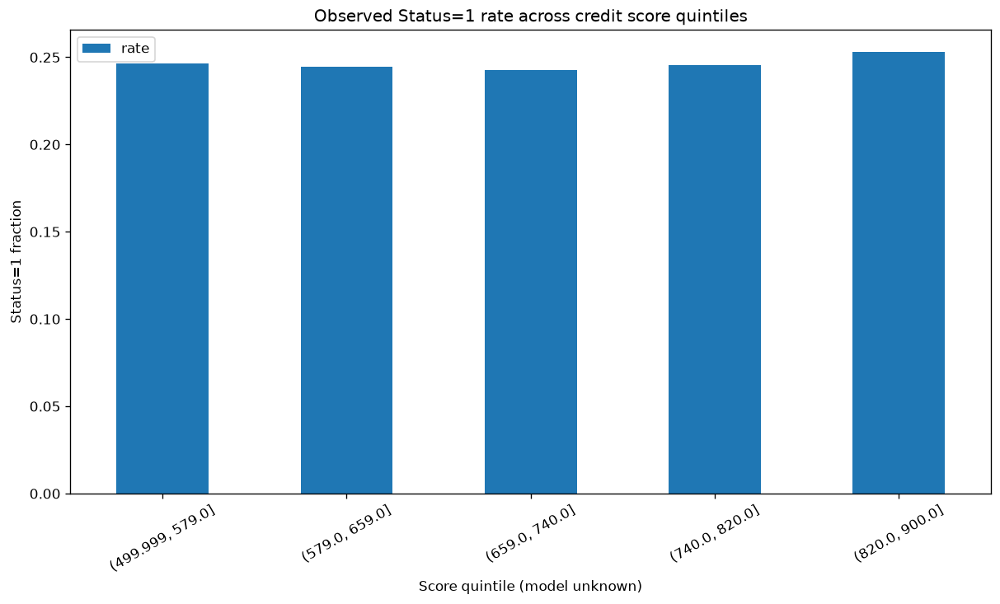

*信用スコア5分位での観測ラベル割合。尺度と取得時点が不明であり、この標本内の小さな差を他の信用評価へ一般化できない。*

**AIが生成した追加依頼1 — ラベル露呈と完全症例選択の確認**

> 金利スプレッド欠損とStatusの完全一致を、独立したテスト分割と完全症例のラベル分布で再確認してください。信用情報区分EQUIと担保・LTV欠損の重なりも調べ、疑わしい列と保護属性・代理変数を除いた経済特徴だけの診断モデルを比較してください。精度を信用判断の妥当性として扱わないでください。

**選定理由**: 初回の欠損指示変数とラベルの完全一致、EQUI群の極端なラベル割合は、関連の強さよりも「何を予測しているのか」を変える問題でした。AIは通常の特徴選択や高精度化より、ラベル露呈と欠損除去による選択を優先しました。

**結果**: seed=42のラベル層化70%/30%分割で、学習104,069件、テスト44,601件となりました。スプレッド欠損だけのルールはテストでも一致率1.0、混同行列`TN=33,609, FP=0, FN=0, TP=10,992`でした。全列の欠損行を除くと98,187件が残りますが、**すべて`Status=0`**となります。したがって、全列完全症例でデフォルト関連を分析する方針は棄却しました。EQUI群ではLTV・評価額欠損が各15,096件、`dtir1`欠損が15,296件で、特定の収録区分と欠損の集中も確認しています。

経済特徴モデルは`loan_amount`, `income`, `Credit_Score`, `term`, `loan_type`, `loan_purpose`, `occupancy_type`, `total_units`を使用しました。疑わしい金利列、性別・年齢、明示した代理変数、LTV・`dtir1`等を除き、所得と金額の`log1p`、数値の中央値補完・標準化、カテゴリの最頻値補完・one-hot化を学習用Pipelineに含めたL2正則化ロジスティック回帰です。ただし、この8特徴も審査前に利用可能だった保証はありません。

テストのROC-AUCは0.6005、AP（average precision）は0.3786、ラベル1割合は0.2465でした。閾値0.5では正解率76.27%に対し、balanced accuracyは0.5197、再現率は4.06%（446/10,992）にとどまります。正解率の見かけ上の高さに反して、ラベル1をほとんど検出していません。係数の指数値も全水準one-hotと正則化を用いたため、通常の参照群に対するオッズ比としては解釈していません。

**再評価・残る限界**: 欠損ルールの完全予測はラベル・業務状態の露呈と整合しますが、時点がないため発生過程は断定できません。全データでルールを発見してからのテスト分割なので、依頼文の「独立したテスト」は独立データによる仮説検証を意味しません。`Status=0`をイベントと定義すれば解釈方向が反転することも記録しました。

**AIが生成した追加依頼2 — 公平性、代理変数、閾値依存性**

> 疑わしい金利欠損列を使わないモデルで、性別区分・年齢区分・地域別の高リスク判定率、偽陽性率、再現率、較正を人数と区間付きで確認してください。信用情報区分などの代理変数を追加した場合と、契約条項を追加した場合を比較し、保護属性を除くだけでは公平性を保証できない理由を整理してください。

**選定理由**: 経済特徴モデルの正解率だけではラベル1の検出力が見えず、EQUIと欠損の重なりは代理変数による見かけの性能上昇を疑わせました。AIはグループごとの誤りと閾値依存性、追加特徴による性能変化を確認しました。

**結果**: 同じ分割で、代理変数追加モデルは`Region`, `credit_type`, `co-applicant_credit_type`, `submission_of_application`を追加し、契約条項追加モデルは`Neg_ammortization`, `lump_sum_payment`, `interest_only`, `loan_limit`, `business_or_commercial`, `open_credit`を追加しました。金利欠損列と性別・年齢を使わない点は共通です。

| 診断モデル | ROC-AUC | AP | 再現率（閾値0.5） |
|---|---:|---:|---:|
| 経済特徴のみ | 0.6005 | 0.3786 | 4.06% |
| 代理変数追加（利用妥当性未検証） | 0.8062 | 0.7233 | 43.51% |
| 契約条項追加（利用妥当性未検証） | 0.6745 | 0.4800 | 16.93% |

性能の上昇は確認できましたが、機関・経路・業務処理や契約確定後の情報を再現している可能性が残ります。モデル名にも`NOT_VALIDATED`を付け、審査利用が妥当なモデルとは扱っていません。

`Gender`, `age`, `Region`, `credit_type`別に、閾値0.5と0.25のフラグ率、偽陽性率（FPR）、再現率（TPR）、平均予測値と観測割合の差、Brier scoreを集計し、率には人数・分母とWilson区間を付けています。経済特徴モデルのGender区分間の最大−最小フラグ率差は閾値0.5で0.69ポイント、0.25で20.68ポイント、FPR差はそれぞれ0.19ポイント、19.43ポイントでした。低い閾値で判定対象を増やすと、誤り率差も大きく変わります。閾値0.25でFemale群のFPRは44.03%、Male群は34.97%でした。

較正も全体のスコア10分位とグループ平均で確認しています。経済特徴モデルの最下位スコア群は平均予測0.1455に対し観測割合0.1957、最上位群は0.4298に対し0.4549でした。代理変数追加モデルの最上位群では平均予測0.9994、観測割合1.0ですが、これもラベル・収録過程の問題を解消するものではありません。

**再評価・残る限界**: 性別・年齢を入力から除外しても、地域、所得、収録経路等との関係を通じたグループ差は残り得ます。フラグ率・FPR・TPR・較正は別の指標であり、同時に公平性を保証するものではありません。小さい分母の群を区別し、性別×年齢の交差群も点検しましたが、未観測の人種等は推定していません。ラベルの偏り、行の非独立性、法域ごとの保護対象が未確認なので、差を違法差別の証明、フラグを融資拒否とみなすことはできません。

**AIが生成した追加依頼3 — 性能・所得関連の感度と条件付き不確実性**

> 経済特徴の予測性能と低所得側の関連が、分割seed、クラス重み、非線形モデル、EQUI除外、必要列のみの完全症例、外れ値処理、信用スコア除外でどれだけ変わるか調べてください。所得の分位区切りも変え、公平性の主要な誤り率差と性能に条件付きの不確実性区間を付けてください。安定しない結果は安定しないと明記してください。

**選定理由**: 反復2で誤り率差の閾値依存と代理変数による性能上昇を確認したため、経済特徴の関連が特定の集団、線形モデル、欠損処理に依存していないかを最終反復で点検しました。

**結果**: 基準モデル、seed=17/83、クラス重みbalanced、非線形のHistGradientBoosting、EQUI除外、経済特徴だけの完全症例、学習側99パーセンタイルによる所得・金額の上限処理、信用スコア除外、契約期間除外の10仕様を比較しました。基準APは0.3786、非線形モデルでは0.4544、EQUI除外では0.3024、経済特徴の完全症例では0.4046でした。APの最大相対変動は20.12%で、許容20%の感度基準は`stable=False`です。EQUI除外ではテストのラベル1割合も16.00%へ変わるため、異なる集団のAPを単純な性能劣化として比較せず、ROC-AUCとAP/ラベル割合も併記しています。基準のAP/割合は1.5363、EQUI除外では1.8899でした。

所得関連は、全体/EQUI除外、LTV>200の保持/除外、3分位/5分位の8仕様で比較しました。低位群/高位群のラベル割合比は1.6446〜2.2742で、低位側の割合が高い方向は全仕様に残りました。ただし大きさの最大相対変動は38.25%で、こちらも`stable=False`でした。方向の維持と効果の大きさの安定性は別の結論です。

学習済みモデルを固定したテスト行bootstrap（150回、seed=20261002）の条件付き95%区間は、ROC-AUCが0.5946〜0.6064、APが0.3703〜0.3864でした。Female−MaleのFPR差は点推定9.06ポイントで、グループ内再標本化300回による条件付き95%区間は7.56〜10.59ポイントです。この区間は学習標本の変動、データ源、時点の変化、ラベル定義の不確実性を含みません。複数グループを探索した後の区間であり、多重比較の保証もありません。

**反復終了の判断・追加確認ログ**: 初回セッションで3回の追加分析を実行しました。残る問題はラベル辞書、特徴の記録時点、返済履歴、申込者・機関単位の独立性、独立データ、適用法域であり、このCSVに計算を加えるだけでは解消できないため、追加のハイパーパラメータ探索は行っていません。`followup.log`でも既存の3回を保持し、4回目は追加しない判断が記録されています。追加確認ログの「回答状況・限界・受け入れ条件を記録する」という方針表明と、実際の新規分析の実行は区別します。`status.json`では初回・最終のNotebookサイズとmtimeが同じで、追加確認によるNotebookの更新は確認できません。

**最終結論**: 所得下位側や一部の契約条項に`Status=1`との観測上の関連はあります。しかし最も重要な結果は、金利スプレッド欠損がラベルを完全再現し、全列完全症例化でラベル1が消えることです。高精度を信用判断の妥当性とみなさず、欠損の発生過程とラベルの意味を先に確認する必要があります。保護属性の除外だけで公平性は保証されず、グループ差は閾値に依存します。所得関連の方向は維持されても、大きさと予測APは本実験の感度基準を満たしません。分析・記録・監査は完了していますが、将来の審査、因果的介入、適法な承認・拒否規則への利用は未検証です。

**監査・再現性**: `status.json`の`analysis_complete=true`、`final_completion.ready=true`と保存済みNotebookの実行出力から、分析完了と判断します。初回ログは新しいカーネル状態で全コードセルを上から再実行したと報告し、最終Notebookの14コードセルはすべて実行番号を持ち、エラー出力はありません。図表セルは1セルでPNGは4点、証拠manifest付き結論は5件です。

Notebook内の最終監査は`visual_audit=True`、`ok=True`ですが、自分自身が実行中のため実行済み数は13/14で、末尾の監査セルを未実行指摘から除外する警告が1件あります。この自己監査の警告と、保存後の外部監査を混同しません。`status.json`の最終監査は14/14実行済み、未実行・エラーセルなし、findings・visual findingsとも空で、nbformatは有効です。Notebookの最終ライフサイクル状態は`v020-exp-50`が`completed`、実行中セル数・保留書込み数・保持ロック数はすべて0です。監査合格はラベルの真実性、因果、法的妥当性、完全な目視品質の保証ではありません。

初回の外部実行は終了コード0、1,259.5秒、終了理由`exited`でした。追加確認は終了コード0、95.2秒、終了理由`artifact_complete_cutoff`で、ログにはNotebookが安定し監査を通過したためランナーがプロセス群を停止した記録があります。追加確認プロセスが自然終了した、という意味には解釈しません。文書化前の状態を示す`documentation_complete`、トップレベルの`semantic_complete`、`report_exit_code`は、分析の見出し・結論・失敗判定には使用していません。

再現に必要な取得来歴、変数定義・分析前提、層化分割seed=42、感度仕様、bootstrap回数・seedがNotebookに残っています。記録された依存バージョンはKaggle SDK 2.2.4、Pandas 3.0.6、NumPy 2.5.3、SciPy 1.18.1、Scikit-learn 1.9.1、nbformat 5.11.1です。Notebook自身の説明では、再実行後に対象を静止させ、別の記録用Jupyter MCPセルで結論の引用先を同期してから監査する手順を採っています。その外部記録セルの全コードは指定された証拠ファイルに含まれず、対象Notebookだけで証拠保存手順まで完全に自己完結するとは言えません。本節の作成時には分析を再実行せず、保存済み出力とログを確認し、PNGを元の画像バイト列のまま抽出しました。

**失敗・復旧とJupytermind改善候補**: 最終成果物にエラーセルはありませんが、途中の失敗や機能不足は記録されています。Notebookの改善候補節と最小再現セル（セル番号は0始まりの30）を根拠に、次の4件を候補として保存しました。ライブラリ自体の修正はこの実験では行われていません。

| 分類 | 確認された挙動・影響 | 回避策と証拠の範囲 |
|---|---|---|
| 統計入力検査・解釈の不具合疑い | NaNを含む入力で`correlation`のr/pがNaNなのに「弱い負の相関」と説明する | 呼出側で欠損ペアを除外。`REPRO_STATS_NAN`で再現し、最終分析セルは除外後の入力を使用 |
| 可視化レイアウトの機能不足候補 | 長いラベルが初回640×480図で切れたとNotebookに記録。最小再現ではレイアウト調整・tight保存の指定がないことを確認 | 長いラベルはMatplotlibのconstrained layoutと`bbox_inches='tight'`へ変更。初回の切れた画像自体は最終Notebookに残らないため、切れの独立な再確認はできない |
| 視覚監査のカバレッジ不足 | chartメタデータのないPNGセルでも`audit_visual_outputs`は指摘を返さない | 最終図表セルにメタデータを明示。`REPRO_VISUAL_METADATA`で`chart_metadata_present=False`, `audit_findings=[]`を確認 |
| 証拠エンジンの標準出力非対応 | 実行済み`stream.text`に引用値があるのに`record_insight`が`EvidenceMissingError`となる | 同じ計算結果を`text/plain`にも保存して引用。`REPRO_STREAM_EVIDENCE`と初回ログに拒否・回避の記録 |

初回ログには証拠記録の失敗を検出して再実行した経緯があり、Notebookには監査書込みフェーズの`failed`から復旧したと記録されています。標準出力の引用拒否は最小再現でも確認できます。一方、保存先親ディレクトリの不足はJupyter MCPの作成前提、filesystem MCPのアクセス範囲不一致はホスト設定、`api.dataset_view`が存在しなかった問題は呼出側によるKaggle SDK APIの誤認として切り分けています。後者は`dataset_metadata`に変更して復旧した記録があり、Kaggle API全体の取得不能やJupytermindの障害とは扱いません。

分析Notebookの実行中に自分のセル一覧を書き換えて保存内容とセル位置が競合した問題も記録されていますが、Jupytermindの書込み制御とMCPの実行時保存の境界にあり、単独のライブラリ不具合とは断定できません。別の記録用Notebookから書き込み、対象が静止してから監査する回避策が説明されています。Copilot CLIまたは外部ランナーが分析結果を変えた不具合の証拠はなく、追加確認の打切りも分析失敗とは判定しません。候補の分類、再現手順、期待・実際の挙動、影響、証拠、受け入れ条件は同じ実験ディレクトリの`issue-candidate.json`にまとめています。

**残る限界**: 通貨、所得の月額/年額、コード辞書、母集団と収録条件が不明です。全行2019年で、イベント日・追跡終了日がないため、生存時間分析と時点外検証は適用できません。独立参照CSVがないため`validate_anomalies`と`compare_datasets`は未使用です。独立の申込者キーや機関情報がなく、ID・重複検査だけでは行の独立性を保証できません。したがって、ランダム分割性能、Wilson区間、bootstrap区間は条件付きの診断です。実用化にはラベル辞書、審査前スナップショット、返済追跡、独立機関・時点での検証、法域に応じた公平性審査が必要です。

**証拠ファイル**: 分析内容の根拠は、指定されたNotebook、`initial-prompt.md`、`initial.log`、`followup.log`、`status.json`だけです。`/home/nahisaho/kaggle/experiments/white-paper2.md`は実験節の書式・詳細度の参照にのみ用い、数値や実験の成功状態の根拠にはしていません。Notebookの保存先は`benchmark/projects/kaggle-v020-kaggle-exp-50-loan-default/notebooks/kaggle-v020-kaggle-exp-50-loan-default.ipynb`です。

<!-- EXPERIMENT_RESULTS_END -->
